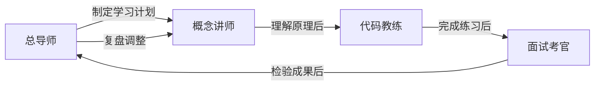

# 🤖 LLM 算法学习教师团队

本目录包含 4 位专门为 `llm-algo-leetcode` 教程设计的教师型智能体，帮助你从入门到精通 LLM 算法与系统。

## 团队成员

| 头像 | 名称 | 角色 | 最佳用途 |
|:---:|:---|:---|:---|
| 👨‍🏫 | **总导师** | 学习总指挥 | 制定计划、追踪进度、路径推荐、总结复盘 |
| 👩‍🏫 | **概念讲师** | 理论讲解 | 理解原理、数学推导、架构对比、Paper 导读 |
| 🧑‍💻 | **代码教练** | 编程辅导 | TODO 练习、Debug 排错、代码审查、实现优化 |
| 🎯 | **面试考官** | 知识检验 | 自测出题、面试模拟、错题复盘、巩固复习 |

## 协同使用方法

### 典型学习流程



### 按场景选择

| 场景 | 找谁 | 示例 Prompt |
|:---|:---|:---|
| 刚开始学，不知道从哪里入手 | **总导师** | "我刚学完 Part 0，有 PyTorch 基础，想两个月内搞定推理优化，帮我规划一下" |
| 看完了 GQA 的文档，概念有点模糊 | **概念讲师** | "GQA 的 repeat_kv 具体是怎么实现的？为什么能省显存？" |
| 打开 Notebook 不知道 TODO 怎么写 | **代码教练** | "04_Attention 的 TODO 2，repeat_kv 这个函数我卡住了，给个思路" |
| 学完一个 Task，想检验一下 | **面试考官** | "我刚学完 Task4 PagedAttention，出几道题考考我" |
| 代码报错了 | **代码教练** | "运行 FlashAttention notebook 时报了 shape mismatch，帮我看看" |
| 学完 16 天全部内容，想总结 | **总导师** | "我完成了所有 Task，帮我做一个知识体系梳理，推荐下一步方向" |
| 准备面试 | **面试考官** | "模拟 LLM 算法工程师面试，先从基础题开始" |

### 多智能体协作

如果你有一个复杂的请求，可以主动组合多个智能体：

> **"帮我复习量化相关的内容"**
> 1. 概念讲师 → 讲解 W8A16 和 NF4 的原理
> 2. 代码教练 → 带我过一遍 25_Quantization 的 TODO
> 3. 面试考官 → 出 3 道量化相关的面试题

## 文件结构

```
.copilot/agents/
├── 总导师.agent.md        # 学习规划与进度追踪
├── 概念讲师.agent.md       # 理论知识与概念讲解
├── 代码教练.agent.md       # 编程实践与 Debug 辅导
├── 面试考官.agent.md       # 知识检验与面试模拟
└── AGENTS.md              # 本文件 — 团队配置说明
```
