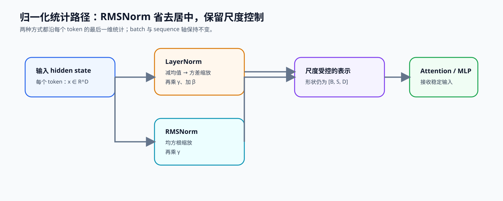

# 01. RMSNorm Tutorial | RMSNorm 教程

**难度：** Easy | **环境：** CPU-first | **标签：** `基础实现`, `归一化`, `RMSNorm` | **目标人群：** 基础实现学习者

> 🚀 **云端运行环境**
>
> 本章节的实战代码可以点击以下链接在免费 GPU 算力平台上直接运行：
>
> [](https://colab.research.google.com/github/datawhalechina/llm-algo-leetcode/blob/main/02_PyTorch_Algorithms/01_RMSNorm_Tutorial.ipynb)
> [](https://modelscope.cn/my/mynotebook) *(国内推荐：魔搭社区免费实例)*


---

## 本节导读

Transformer 层数一深，中间激活的尺度就会不断变化。如果不做归一化，后面的矩阵乘法和激活函数很容易面对不稳定的输入；但标准 LayerNorm 又要同时计算均值和方差，在大模型里会带来额外开销。

RMSNorm 选择更直接的做法：不再减均值，只用均方根控制特征尺度。本节会实现一个最小 RMSNorm，重点看清归一化维度、`eps` 的数值稳定作用，以及为什么许多 LLaMA 系模型会采用这种更轻的归一化层。完成后，你可以把它接到后面的 MLP、Attention 和完整 Transformer 组件里。

**关键词：** `RMSNorm`, `LayerNorm`, `normalization`

---
## 前置阅读

**导语：** 先确认输入张量的归一化维度和训练接口，再比较 LayerNorm 与 RMSNorm 如何处理特征尺度。

- [P0: 05. PyTorch Tensor Fundamentals | PyTorch 张量基础操作](../00_Prerequisites/05_PyTorch_Tensor_Fundamentals.md)
- [P0: 13. Transformer Block Dataflow and Residual Stream | Transformer Block 数据流与残差通路](../00_Prerequisites/13_Transformer_Block_Dataflow_and_Residual_Stream.md)
- [P0: 15. Normalization Techniques | 归一化技术](../00_Prerequisites/15_Normalization_Techniques.md)

---
### Step 1：从 LayerNorm 到 RMSNorm 的结构选择

归一化要解决的是残差流在多层变换后尺度漂移的问题。LayerNorm 同时执行重新居中与尺度归一；RMSNorm 只保留尺度归一。现代 Decoder 通常把归一化放在子层之前，让残差主路径可以跨层直接传递，再用 RMSNorm 为 Attention 或 MLP 提供尺度受控的输入。

从几何上看，LayerNorm 的减均值会移除向量在全 1 方向上的分量，随后再按方差缩放；RMSNorm 不做这个投影，只按向量的均方根缩放。它因此不是 LayerNorm 的数值近似，而是主动取消“重新居中”这一约束。是否适用仍由模型结构、初始化和训练结果共同决定，不能只凭算子更短就推导质量等价。

| 结构 | 统计动作 | 在 Block 中的位置 | 主要取舍 |
|---|---|---|---|
| Post-LayerNorm | 居中并缩放 | 子层与残差合并之后 | 深层训练更依赖稳定技巧 |
| Pre-LayerNorm | 居中并缩放 | 子层输入之前 | 残差主干更直接，但仍计算均值与方差 |
| Pre-RMSNorm | 只按均方根缩放 | 子层输入之前 | 统计路径更短，不保证输出零均值 |


### Step 2：公式、归一化轴与统计路径

对每个 token 的 hidden 向量 $x\in\mathbb{R}^d$，RMSNorm 沿最后一维计算

$$
\operatorname{RMS}(x)=\sqrt{\frac{1}{d}\sum_{i=1}^{d}x_i^2+\epsilon},\qquad
y=\frac{x}{\operatorname{RMS}(x)}\odot\gamma.
$$

batch 维和序列维保持不变，只有每个 token 内部的通道共同参与统计。可学习参数 $\gamma\in\mathbb{R}^d$ 恢复逐通道缩放能力，$\epsilon$ 防止零向量或极小输入导致除零。与 LayerNorm 对照时，应同时检查统计轴、是否减均值、可学习参数和输出 dtype，不能只比较公式中少了一项运算。

| 检查对象 | RMSNorm 契约 | 常见错误 |
|---|---|---|
| 统计轴 | hidden 最后一维 | 跨 batch 或序列混合统计 |
| 中心化 | 不减均值 | 误写成 LayerNorm |
| 可学习状态 | 一份逐通道缩放参数 | 使用标量导致通道能力丢失 |
| 形状 | 输入输出完全一致 | `keepdim=False` 破坏广播 |



### Step 3：混合精度下的数值路径

RMSNorm 的平方、均值和倒平方根属于数值敏感的归约路径。FP16/BF16 输入可以降低存储和矩阵计算成本，但较大激活在平方时可能溢出，较小激活也可能损失统计精度。常见实现先把统计路径提升到 FP32，完成归一化与缩放后再恢复输入 dtype。

| 阶段 | 建议计算类型 | 原因 |
|---|---|---|
| 输入与模型主状态 | 模型 dtype | 保持模型接口与存储口径 |
| 平方、均值、`rsqrt` | FP32 | 降低溢出和累计误差 |
| 归一化与通道缩放 | FP32 或实现规定的安全路径 | 避免过早舍入 |
| 输出 | 恢复输入 dtype | 保持后续子层契约 |

数值路径正确不等于模型质量已经验证。本节测试只确认单层算子的数值、dtype 与梯度契约；深层训练稳定性应进入 Block 稳定性基准，在相同初始化、数据和训练预算下比较。

### Step 4：代码设计与 RMSNorm 契约

题目区以一个最小模块承载三个机制责任：逐特征缩放参数、沿最后一维的 RMS 统计，以及 dtype 对齐。固定骨架处理模块接口；学习者只补全决定数值路径的变量。

| TODO | 代码契约与机制责任 | 关键约束 | 测试证据 |
| --- | --- | --- | --- |
| TODO 1 | 创建形状为 `[D]` 的可学习缩放参数 | 初值为 1；参与反向传播 | 参数形状正确且得到梯度 |
| TODO 2 | 沿最后一维在 FP32 中计算 RMS 并归一化 | 统计量形状为 `[B, S, 1]` | 与参考数值一致；零输入有限 |
| TODO 3 | 缩放后恢复输入 dtype | 输出形状与 dtype 与输入对齐 | FP16 输入结果与参考实现一致 |

```python
import torch
import torch.nn as nn
```


```python
class RMSNorm(nn.Module):
    """沿最后一维归一化，并保留逐特征缩放参数。"""

    def __init__(self, hidden_size: int, eps: float = 1e-6):
        super().__init__()
        if hidden_size <= 0:
            raise ValueError('hidden_size 必须为正数')
        self.eps = eps
        # TODO 1：创建逐特征的可学习缩放参数。
        # self.weight = ???
        raise NotImplementedError('TODO 1：请创建 RMSNorm 的缩放参数')

    def _norm(self, x: torch.Tensor) -> torch.Tensor:
        """在 FP32 路径中计算 RMS 归一化，返回 FP32 结果。"""
        if x.ndim < 1:
            raise ValueError('x 至少需要包含一个特征维')
        # TODO 2：计算最后一维的均方值并完成归一化。
        # x_fp32 = ???
        # mean_square = ???
        raise NotImplementedError('TODO 2：请完成 RMS 统计与归一化')

    def forward(self, x: torch.Tensor) -> torch.Tensor:
        """缩放归一化结果，并恢复输入 dtype。"""
        # TODO 3：对齐缩放参数 dtype，得到最终输出。
        # weight = ???
        # normalized = ???
        raise NotImplementedError('TODO 3：请完成缩放与 dtype 对齐')

```


```python
# 测试设计：分别定位参数契约、RMS 数值路径和 dtype/梯度对齐。

def _rmsnorm_reference(x: torch.Tensor, weight: torch.Tensor, eps: float) -> torch.Tensor:
    """使用显式 FP32 统计构造参考结果。"""
    x_fp32 = x.float()
    mean_square = x_fp32.pow(2).mean(dim=-1, keepdim=True)
    return (x_fp32 * torch.rsqrt(mean_square + eps) * weight.float()).to(x.dtype)


def test_rmsnorm_parameter_contract():
    norm = RMSNorm(hidden_size=4)
    assert isinstance(norm.weight, nn.Parameter)
    assert norm.weight.shape == (4,)
    assert torch.equal(norm.weight.detach(), torch.ones(4))


def test_rmsnorm_numeric_contract():
    x = torch.tensor([[[3.0, 4.0], [0.0, 0.0]]])
    norm = RMSNorm(hidden_size=2, eps=1e-6)
    output = norm(x)
    expected = _rmsnorm_reference(x, norm.weight, norm.eps)
    assert torch.allclose(output, expected, atol=1e-6)
    assert torch.isfinite(output).all()


def test_rmsnorm_dtype_and_gradient_contract():
    x = torch.randn(2, 3, 4, dtype=torch.float16, requires_grad=True)
    norm = RMSNorm(hidden_size=4).to(dtype=torch.float16)
    output = norm(x)
    expected = _rmsnorm_reference(x, norm.weight, norm.eps)
    assert output.shape == x.shape
    assert output.dtype == x.dtype
    assert torch.allclose(output.float(), expected.float(), rtol=1e-3, atol=1e-4)
    output.float().sum().backward()
    assert norm.weight.grad is not None
    assert x.grad is not None


def run_rmsnorm_tests():
    test_rmsnorm_parameter_contract()
    test_rmsnorm_numeric_contract()
    test_rmsnorm_dtype_and_gradient_contract()
    print('✅ RMSNorm：参数、数值路径与 dtype/梯度契约测试通过')


run_rmsnorm_tests()

```

## 参考代码与解析

### 代码


```python
class RMSNorm(nn.Module):
    """沿最后一维归一化，并保留逐特征缩放参数。"""

    def __init__(self, hidden_size: int, eps: float = 1e-6):
        super().__init__()
        if hidden_size <= 0:
            raise ValueError('hidden_size 必须为正数')
        self.eps = eps
        # TODO 1：创建逐特征的可学习缩放参数。
        self.weight = nn.Parameter(torch.ones(hidden_size))

    def _norm(self, x: torch.Tensor) -> torch.Tensor:
        """在 FP32 路径中计算 RMS 归一化，返回 FP32 结果。"""
        if x.ndim < 1:
            raise ValueError('x 至少需要包含一个特征维')
        # TODO 2：计算最后一维的均方值并完成归一化。
        x_fp32 = x.float()
        mean_square = x_fp32.pow(2).mean(dim=-1, keepdim=True)
        return x_fp32 * torch.rsqrt(mean_square + self.eps)

    def forward(self, x: torch.Tensor) -> torch.Tensor:
        """缩放归一化结果，并恢复输入 dtype。"""
        # TODO 3：对齐缩放参数 dtype，得到最终输出。
        weight = self.weight.to(dtype=x.dtype)
        normalized = self._norm(x)
        return (normalized * weight).to(dtype=x.dtype)

```

### 解析

题目区与答案区保留同一模块结构；三个 TODO 分别对应参数、统计路径和输出对齐。

**TODO 1：缩放参数**：`weight` 的形状为 `[D]`，会广播到每个 token 的特征向量；初始化为 1 不会改变刚开始的归一化尺度。

**TODO 2：RMS 统计**：先转 FP32，再沿最后一维计算平方均值并用 `rsqrt` 归一化。`keepdim=True` 保留 `[B, S, 1]`，使结果能与原输入逐元素相乘。

**TODO 3：dtype 对齐**：统计完成后再按输入 dtype 使用 `weight` 并恢复输出 dtype；这样既保护归约计算，也不改变后续 Block 的张量接口。
## 相关阅读

想把本节的公式与真实模型实现对照时，可以先读原论文，再查看开源 Decoder 实现中的归一化位置。

- [RMSNorm 原论文：Root Mean Square Layer Normalization](https://arxiv.org/abs/1910.07467)
- [Transformers 中的 LLaMA 模型实现](https://github.com/huggingface/transformers/blob/main/src/transformers/models/llama/modeling_llama.py)
- [02. SwiGLU 激活](../02_PyTorch_Algorithms/02_SwiGLU_Activation.md)
- [04. 多头注意力与 GQA](../02_PyTorch_Algorithms/04_Attention_MHA_GQA.md)
- [P1: 算子融合导论](../01_Hardware_Math_and_Systems/19_Operator_Fusion_Introduction.md)
