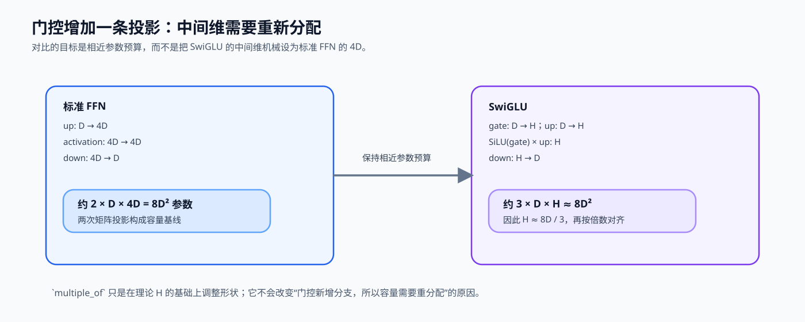

# 02. SwiGLU Activation | SwiGLU 激活

**难度：** Easy | **环境：** CPU-first | **标签：** `基础实现`, `激活函数`, `SwiGLU` | **目标人群：** 基础实现学习者

> 🚀 **云端运行环境**
>
> 本章节的实战代码可以点击以下链接在免费 GPU 算力平台上直接运行：
>
> [](https://colab.research.google.com/github/datawhalechina/llm-algo-leetcode/blob/main/02_PyTorch_Algorithms/02_SwiGLU_Activation.ipynb)
> [](https://modelscope.cn/my/mynotebook) *(国内推荐：魔搭社区免费实例)*


---

## 本节导读

Transformer 的 MLP 不只是把向量升维、过激活函数、再降维这么简单。大模型需要在每个 token 的特征里学会“哪些信息该放大，哪些信息该压住”，普通 ReLU/GELU 的单路激活很难显式表达这种选择过程。

SwiGLU 用两条并行分支做门控：一条提供候选特征，另一条决定通过多少。本节会实现一个最小 SwiGLU，并推导隐藏层维度为什么要调整，避免门控结构让参数量无意膨胀。完成后，你应该能看懂现代 LLM 的 MLP 为什么普遍采用 gated activation，也能把它和 RMSNorm、Attention 一起放进完整模型结构里。

**关键词：** `SwiGLU`, `GLU`, `gating`

---
## 前置阅读

**导语：** 先能读出逐元素激活、矩阵投影和归一化的位置，再比较 MLP 的单路激活与 SwiGLU 的双路门控。

- [P0: 05. PyTorch Tensor Fundamentals | PyTorch 张量基础操作](../00_Prerequisites/05_PyTorch_Tensor_Fundamentals.md)
- [P0: 14. Activation Functions | 激活函数](../00_Prerequisites/14_Activation_Functions.md)
- [P0: 15. Normalization Techniques | 归一化技术](../00_Prerequisites/15_Normalization_Techniques.md)

---
### Step 1：从单路 FFN 到双路门控

普通 FFN 先产生一组中间特征，再统一施加非线性；SwiGLU 同时产生候选特征和门控特征，并用逐元素乘法决定每个中间维度通过多少信息。因此现代 LLM 的 MLP 常见 `gate_proj / up_proj / down_proj` 三个投影：前两条支路各自升维，合并后再投影回 hidden size。

| 结构 | 中间路径 | 选择机制 |
| --- | --- | --- |
| FFN | `up → activation → down` | 所有中间维一起经过同一种激活 |
| GLU | `content × sigmoid(gate) → down` | Sigmoid 门控制候选特征 |
| SwiGLU | `up × SiLU(gate) → down` | SiLU 门保留平滑、可学习的选择 |


### Step 2：门控容量为什么需要重新对齐

SwiGLU 比单路 FFN 多出一条升维分支。如果仍沿用标准 FFN 的中间宽度，参数量和计算量都会明显增加；现代 LLM 因而会缩小中间维，再按硬件友好的倍数向上对齐。`8d/3` 不是孤立的经验常数：它是在门控带来额外投影后，为保持与标准 FFN 相近容量而得到的折中。

| 结构 | 投影数 | 参数量近似 | 与标准 `4d` FFN 对齐时的中间维 |
| --- | ---: | ---: | --- |
| 标准 FFN | 2 | `2dh` | `h = 4d`，约 `8d²` |
| SwiGLU | 3 | `3dh` | `h ≈ 8d/3`，约 `8d²` |


### Step 3：维度对齐与融合的工程取舍

实际实现会把理论中间宽度向 `multiple_of` 对齐，使矩阵形状更适合底层执行和并行分片；也常将 gate/up 融合投影，以复用同一份输入读取。这些调整不改变门控机制本身，但会改变参数账本和中间表示的成本。

| 设计点 | 它解决的问题 | 需要同时观察的代价 |
| --- | --- | --- |
| `8D/3` 中间维 | 三个投影的参数量接近普通 `4D` FFN | 中间表示仍显著影响显存与计算 |
| `multiple_of` 对齐 | 让矩阵形状更适合硬件与并行分片 | 向上取整会带来少量额外参数 |
| gate/up 融合投影 | 复用相同输入读取，减少中间访问 | 仍需保证切分后的两支路语义正确 |
### Step 4：代码设计与 SwiGLU MLP 契约

题目区依次连接容量推导、硬件倍数对齐、双分支投影和门控回投。固定骨架保留模块接口；学习者补全影响形状与数值结果的四处变量。

| TODO | 代码契约与机制责任 | 关键约束 | 测试证据 |
| --- | --- | --- | --- |
| TODO 1 | 计算 SwiGLU 的理论中间维 | 使用 $8/3 \times hidden\_size$ 的容量关系 | 理论维度符合预期 |
| TODO 2 | 将中间维向上对齐到 `multiple_of` | 对齐后不小于理论维度且是指定倍数 | `4096 → 11008` 等配置正确 |
| TODO 3 | 定义融合 gate/up 投影与 down 投影 | `gate_up_proj` 输出为 `2 × intermediate_size`；均无 bias | 两条分支与回投维度正确 |
| TODO 4 | 完成 SiLU 门控、逐元素乘法和回投 | `SiLU(gate) * up` 后再投回 hidden 维 | 输出形状正确，gate 与 up 都影响输出 |

```python
import torch
import torch.nn as nn
import torch.nn.functional as F
```


```python
def calculate_intermediate_size(hidden_size: int, multiple_of: int = 256) -> int:
    """计算 LLaMA 风格 SwiGLU 的对齐中间维。"""
    if hidden_size <= 0 or multiple_of <= 0:
        raise ValueError('hidden_size 和 multiple_of 必须为正数')
    # TODO 1：按 8/3 容量关系计算理论中间维。
    # theoretical_size = ???
    # TODO 2：向上对齐到 multiple_of 的倍数。
    # aligned_size = ???
    raise NotImplementedError('TODO 1/2：请完成中间维推导与对齐')


class SwiGLU_MLP(nn.Module):
    """使用融合 gate/up 投影的 SwiGLU 前馈层。"""

    def __init__(self, hidden_size: int, intermediate_size: int):
        super().__init__()
        if hidden_size <= 0 or intermediate_size <= 0:
            raise ValueError('hidden_size 和 intermediate_size 必须为正数')
        # TODO 3：构造无 bias 的融合 gate/up 投影和 down 投影。
        # self.gate_up_proj = ???
        # self.down_proj = ???
        raise NotImplementedError('TODO 3：请定义 SwiGLU 投影层')

    def forward(self, x: torch.Tensor) -> torch.Tensor:
        """执行 gate/up 切分、SiLU 门控和 down 投影。"""
        # TODO 4：完成门控前向。
        # gate_up = ???
        # gate, up = ???
        # gated = ???
        raise NotImplementedError('TODO 4：请完成 SwiGLU 门控前向')

```


```python
# 测试设计：分别验证容量推导、投影契约与门控前向，而非只检查最终形状。

def test_swiglu_intermediate_size():
    assert calculate_intermediate_size(4096, multiple_of=256) == 11008
    assert calculate_intermediate_size(64, multiple_of=16) == 176
    for hidden_size, multiple_of in ((0, 16), (64, 0)):
        try:
            calculate_intermediate_size(hidden_size, multiple_of)
        except ValueError:
            continue
        raise AssertionError('非法维度参数应被拒绝')


def test_swiglu_projection_contract():
    mlp = SwiGLU_MLP(hidden_size=8, intermediate_size=16)
    assert mlp.gate_up_proj.in_features == 8
    assert mlp.gate_up_proj.out_features == 32
    assert mlp.down_proj.in_features == 16
    assert mlp.down_proj.out_features == 8
    assert mlp.gate_up_proj.bias is None and mlp.down_proj.bias is None


def test_swiglu_gated_forward():
    torch.manual_seed(7)
    mlp = SwiGLU_MLP(hidden_size=4, intermediate_size=6)
    x = torch.randn(2, 3, 4, requires_grad=True)
    output = mlp(x)
    gate, up = torch.chunk(mlp.gate_up_proj(x), 2, dim=-1)
    expected = mlp.down_proj(torch.nn.functional.silu(gate) * up)
    assert output.shape == x.shape
    assert torch.allclose(output, expected)
    output.sum().backward()
    assert x.grad is not None


def run_swiglu_tests():
    test_swiglu_intermediate_size()
    test_swiglu_projection_contract()
    test_swiglu_gated_forward()
    print('✅ SwiGLU：容量、投影与门控前向测试通过')


run_swiglu_tests()

```

## 参考代码与解析

### 代码

```python
def calculate_intermediate_size(hidden_size: int, multiple_of: int = 256) -> int:
    """计算 LLaMA 风格 SwiGLU 的对齐中间维。"""
    if hidden_size <= 0 or multiple_of <= 0:
        raise ValueError('hidden_size 和 multiple_of 必须为正数')
    # TODO 1：按 8/3 容量关系计算理论中间维。
    theoretical_size = int(hidden_size * 8 / 3)
    # TODO 2：向上对齐到 multiple_of 的倍数。
    aligned_size = ((theoretical_size + multiple_of - 1) // multiple_of) * multiple_of
    return aligned_size


class SwiGLU_MLP(nn.Module):
    """使用融合 gate/up 投影的 SwiGLU 前馈层。"""

    def __init__(self, hidden_size: int, intermediate_size: int):
        super().__init__()
        if hidden_size <= 0 or intermediate_size <= 0:
            raise ValueError('hidden_size 和 intermediate_size 必须为正数')
        # TODO 3：构造无 bias 的融合 gate/up 投影和 down 投影。
        self.gate_up_proj = nn.Linear(hidden_size, 2 * intermediate_size, bias=False)
        self.down_proj = nn.Linear(intermediate_size, hidden_size, bias=False)

    def forward(self, x: torch.Tensor) -> torch.Tensor:
        """执行 gate/up 切分、SiLU 门控和 down 投影。"""
        # TODO 4：完成门控前向。
        gate_up = self.gate_up_proj(x)
        gate, up = torch.chunk(gate_up, 2, dim=-1)
        gated = torch.nn.functional.silu(gate) * up
        return self.down_proj(gated)

```

### 解析

题目区与答案区使用同一函数和模块骨架；四个 TODO 对应容量关系、对齐策略、投影布局和门控计算。

**TODO 1：理论中间维**：SwiGLU 为两条中间分支保留容量，常用 $8/3 \times hidden\_size$ 让参数量与普通 MLP 接近。

**TODO 2：倍数对齐**：把理论值向上取整到 `multiple_of`，避免中间维落在不利于矩阵计算的尺寸。

**TODO 3：融合投影**：`gate_up_proj` 一次产生两条大小相同的中间分支，再由 `down_proj` 回到 `hidden_size`。

**TODO 4：门控前向**：门控分支经过 SiLU 后与 up 分支逐元素相乘；任一分支变化都会影响回投结果。
## 相关阅读

本节的门控激活可以继续沿两条线阅读：一条是 GLU 家族的原始设计，另一条是 LLaMA 实现中 gate / up / down 三个投影如何落地。

- [GLU 家族原论文：GLU Variants Improve Transformer](https://arxiv.org/abs/2002.05202)
- [Transformers 中的 LLaMA 模型实现](https://github.com/huggingface/transformers/blob/main/src/transformers/models/llama/modeling_llama.py)
- [03. RoPE 旋转位置编码](../02_PyTorch_Algorithms/03_RoPE_Tutorial.md)
- [04. 多头注意力与 GQA](../02_PyTorch_Algorithms/04_Attention_MHA_GQA.md)
- [P1: Tensor Core 与混合精度](../01_Hardware_Math_and_Systems/12_TensorCore_and_Mixed_Precision.md)
- [P1: 算子融合导论](../01_Hardware_Math_and_Systems/19_Operator_Fusion_Introduction.md)
