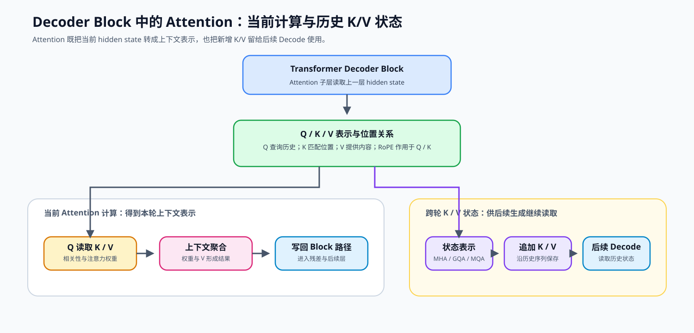
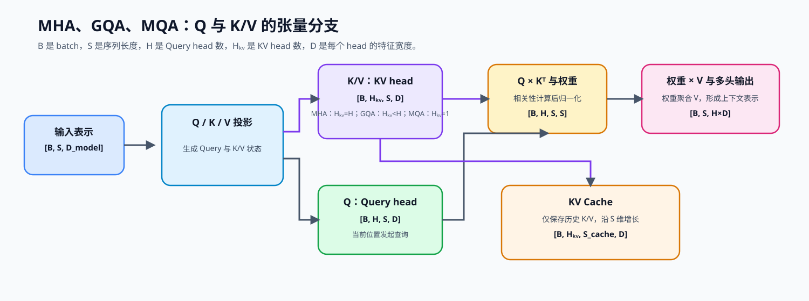

# 04. Attention MHA GQA | 多头注意力

**难度：** Medium | **环境：** CPU-first | **标签：** `基础实现`, `Attention`, `MHA/GQA` | **目标人群：** 基础实现学习者

> 🚀 **云端运行环境**
>
> 本章节的实战代码可以点击以下链接在免费 GPU 算力平台上直接运行：
>
> [](https://colab.research.google.com/github/datawhalechina/llm-algo-leetcode/blob/main/02_PyTorch_Algorithms/04_Attention_MHA_GQA.ipynb)
> [](https://modelscope.cn/my/mynotebook) *(国内推荐：魔搭社区免费实例)*


---

## 本节导读

Attention 是 Transformer Decoder Block 中把上下文信息写入当前表示的核心子层。输入 hidden state 会形成 Q、K、V：Q 用来查询相关位置，K 用来匹配位置，V 提供待聚合的内容。多头机制让模型从不同表示子空间读取上下文，而 MHA、GQA、MQA 的差异，本质上是 Query head 与 KV head 如何组织和共享。

这套结构会在不同场景中呈现不同问题：训练时需要处理反向传播依赖的中间状态；运行时需要关注计算、访存与状态保存；模型设计时则需要权衡 head 组织、表示能力与资源成本。本节建立 Q/K/V、MHA/GQA/MQA 与 KV 状态的共同口径，后续的架构、算子、训练、推理和系统主题都会复用这些概念。

**关键词：** `Attention`, `GQA`, `KV Cache`

---
## 前置阅读

**导语：** 先能写出基础注意力并理解 RoPE 如何作用于 Query / Key，再比较 MHA、KV Cache 和 GQA 对历史状态与读取成本的影响。

- [P0: 05. PyTorch Tensor Fundamentals | PyTorch 张量基础操作](../00_Prerequisites/05_PyTorch_Tensor_Fundamentals.md)
- [P0: 16. Attention Mechanism Intro | 注意力机制导论](../00_Prerequisites/16_Attention_Mechanism_Intro.md)
- [03. RoPE Tutorial | 旋转位置编码教程](../02_PyTorch_Algorithms/03_RoPE_Tutorial.md)

---
### Step 1：Attention 如何产生当前结果与历史状态

在 Decoder-only Transformer 中，Attention 是每个 Decoder Block 中读取上下文的子层：上一层的 hidden state 经由 Q/K/V 表示进入 Attention，位置关系由前置的 [RoPE](../02_PyTorch_Algorithms/03_RoPE_Tutorial.md) 加入 Q/K。Q、K、V 一方面完成当前轮的相关性计算和上下文聚合，另一方面让 K/V 成为下一轮仍可读取的历史状态。下面的图从 Block 中的 Attention 子层出发，分别追踪当前结果与跨轮状态。



### Step 2：MHA、GQA、MQA 与 MLA 的表示选择

现在用统一维度口径观察 Q/K/V。`H` 是 Query head 数，`H_kv` 是保存 K/V 的 head 数，`D` 是每个 head 的特征宽度；GQA 让多个 Query head 共享较少的 KV head，MQA 则只保留一组 KV head。MLA 走的是另一条路径：不只减少 head 数，而是把 K/V 的长期状态压缩为较低维的 latent 表示，并在读取时重构所需分量。

$$ \text{Attention}(Q, K, V) = \text{Softmax}\left(\frac{QK^T}{\sqrt{d_k}}\right)V $$

对单层、单 token 而言，普通 K/V 状态元素数与 `2 × H_kv × D` 成正比。下表把 head 共享与状态压缩放到同一个比较口径中：

| 观察对象 | MHA / GQA / MQA / MLA 的关系 | 代表状态 | 资源含义 |
| --- | --- | --- | --- |
| KV 表示 | MHA：`H_kv=H`；GQA：`1<H_kv<H`；MQA：`H_kv=1`；MLA：保存 latent 与位置相关分量 | MHA/GQA/MQA：`[B,H_kv,S,D]`；MLA：实现相关的低维状态 | 共享 head 是“少存”；MLA 是“存得更小” |
| Q 与 K/V 计算 | Q 使用 `H`；普通 K/V 使用 `H_kv` | Q：`[B,H,S,D]` | Query 表示与 KV 存储可以使用不同组织方式 |
| Attention 权重 | Q 与当前可读 K 比较并归一化 | `[B,H,S,S]` 或分块等价计算 | 序列变长时计算和临时状态增加 |
| 上下文输出 | 权重聚合 V，再汇总 Query head | `[B,S,H×D]` | 得到当前 token 的上下文表示 |
| KV Cache | 历史状态沿序列增长 | 普通 K/V 或 latent 状态 | 每 token 状态量取决于表示选择 |


### Step 3：同一 Attention 结构在训练与推理中留下什么状态

Attention 的结构选择会同时影响训练和推理，但留下的状态不同：训练为反向传播保存或重算中间结果；推理为后续 token 保留可读取的历史状态。区分这两类生命周期，才能判断某项改动是在减少计算、减少临时激活，还是减少长期 KV 驻留。

因此，04 提供表示层的共同口径；训练侧的保存与重算继续看 17、19、42，推理侧的分页、复用和容量治理继续看 22、24、34 与 71。

| 机制层次 | 训练时主要影响 | 推理时主要影响 | 应观察的量 |
| --- | --- | --- | --- |
| Attention 计算 | Q/K/V、分数、Softmax 与聚合结果可成为反向依赖 | Prefill 处理整段输入，临时计算随长度增加 | 计算量、激活、临时张量、访存 |
| MHA / GQA / MQA | `H_kv` 改变 K/V 投影与中间张量组织 | `H_kv` 决定每 token 的普通 KV 状态大小 | KV head 数、形状、字节数 |
| MLA 表示 | latent 与位置分量参与模型内部状态组织 | 改变每 token 的缓存表示和重构路径 | latent 维度、位置分量、质量与实际实现 |
| 历史状态管理 | checkpoint、offload 等处理反向所需状态 | 分页、复用、驱逐和容量治理处理 KV 生命周期 | 生命周期、峰值显存、读取带宽、命中率 |
### Step 4：代码设计与 MHA / GQA / MQA 状态验证

题目区用同一套 Attention 模块连接四个机制责任：多头重排、紧凑 KV Cache、因果聚合和输出合并。K/V 以 `H_kv` 个 head 写入 Cache，在当前计算中按需对齐到 `H` 个 Query head；测试分别检查输出、缓存、因果可见性与参数契约。

| TODO | 代码契约与机制责任 | 关键约束 | 测试证据 |
| --- | --- | --- | --- |
| TODO 1 | 建立 Query 与 KV 的多头表示 | `xq=[B,H,S,D]`，`xk/xv=[B,H_kv,S,D]` | MHA、GQA、MQA 的输出与 KV head 数正确 |
| TODO 2 | 追加紧凑 KV Cache | 沿序列维追加；Cache 始终保存 `H_kv` 个 head | Prefill + 单步 Decode 与完整前向一致 |
| TODO 3 | 完成缩放、因果 mask、Softmax 与 Value 聚合 | mask 可广播到 attention score | 输出有限，未来 token 不改变当前位置输出 |
| TODO 4 | 合并 Query head 并进入输出投影 | `[B,H,S,D] → [B,S,H×D]` | 输出形状与 hidden state 对齐 |

```python
import torch
import torch.nn as nn
import math
import torch.nn.functional as F
```


```python
def repeat_kv(hidden_states: torch.Tensor, n_rep: int) -> torch.Tensor:
    """
    将形状 [B, H_kv, S, D] 的 KV 头复制 n_rep 次，
    输出为 [B, H_kv * n_rep, S, D]，以匹配 Query 头的数量。
    当 n_rep == 1 时（即 MHA），直接返回原张量。
    """
    batch, num_kv_heads, slen, head_dim = hidden_states.shape
    if n_rep == 1:
        return hidden_states
    hidden_states = hidden_states.unsqueeze(2).expand(-1, -1, n_rep, -1, -1)
    return hidden_states.reshape(batch, num_kv_heads * n_rep, slen, head_dim)

class GroupedQueryAttention(nn.Module):
    def __init__(self, hidden_dim: int, num_heads: int, num_kv_heads: int = None):
        super().__init__()
        if hidden_dim <= 0 or num_heads <= 0:
            raise ValueError("hidden_dim 和 num_heads 必须为正整数")
        if hidden_dim % num_heads != 0:
            raise ValueError("hidden_dim 必须能被 num_heads 整除")
        self.hidden_dim = hidden_dim
        self.num_heads = num_heads
        self.num_kv_heads = num_kv_heads if num_kv_heads is not None else num_heads
        
        # GQA/MQA 要求 Query head 可以平均分配给 KV head。
        if self.num_kv_heads <= 0 or num_heads % self.num_kv_heads != 0:
            raise ValueError(
                f"num_heads ({num_heads}) 必须能被 num_kv_heads ({self.num_kv_heads}) 整除"
            )
        
        self.num_queries_per_kv = self.num_heads // self.num_kv_heads
        self.head_dim = hidden_dim // num_heads
        
        # Q 始终按 num_heads 投影；K/V 按 num_kv_heads 投影以支持 MHA、GQA 与 MQA。
        self.q_proj = nn.Linear(hidden_dim, num_heads * self.head_dim, bias=False)
        self.k_proj = nn.Linear(hidden_dim, self.num_kv_heads * self.head_dim, bias=False)
        self.v_proj = nn.Linear(hidden_dim, self.num_kv_heads * self.head_dim, bias=False)
        self.o_proj = nn.Linear(num_heads * self.head_dim, hidden_dim, bias=False)

    def forward(
        self, 
        x: torch.Tensor, 
        attention_mask: torch.Tensor = None, 
        kv_cache: tuple[torch.Tensor, torch.Tensor] = None
    ):
        """
        前向传播。

        Args:
            x: 输入张量，形状 [batch, seq_len, hidden_dim]
            attention_mask: 注意力掩码，形状应为 [batch, 1, 1, seq_len]（因果掩码）
                        或 [batch, 1, seq_len, seq_len]；可见位置通常为 0，
                        屏蔽位置为 -inf，并广播到 scores。
            kv_cache: 缓存的 (K, V) 张量，形状为
                      ([batch, num_kv_heads, cached_seq_len, head_dim], ...)。
    
        Returns:
            输出张量 [batch, seq_len, hidden_dim]，更新后的 KV Cache
        """
        batch_size, seq_len, _ = x.shape
        
        xq, xk, xv = self.q_proj(x), self.k_proj(x), self.v_proj(x)
        
        # TODO 1：把投影结果拆成多头格式。
        # xq = [B, H, S, D]；xk = [B, H_kv, S, D]；xv = [B, H_kv, S, D]
        # xq = ???
        # xk = ???
        # xv = ???

        # TODO 2：若给出历史 Cache，在序列维（dim=2）把它放在当前 K/V 前。
        if kv_cache is not None:
            k_cache, v_cache = kv_cache
            # 只拼接未扩展的 KV，避免把 GQA 的缓存放大到 MHA 大小。
            # xk = ???
            # xv = ???
            
        new_kv_cache = (xk, xv)
        
        # 仅为当前 Attention 计算临时扩展 KV，不把扩展结果写回 Cache。
        xk = repeat_kv(xk, self.num_queries_per_kv)
        xv = repeat_kv(xv, self.num_queries_per_kv)
        
        # TODO 3：计算缩放分数，并将 mask 后的 scores 归一化后聚合 V。
        # scores = [B, H, S_query, S_key]；probs 在最后一维归一化。
        # scores = ???
        
        if attention_mask is not None:
            scores = scores + attention_mask
            
        # probs = ???
        # output = ???
        
        
        # TODO 4：将 [B, H, S, D] 转回 [B, S, H×D]，再交给输出投影。
        # output = ???
        
        return self.o_proj(output), new_kv_cache

```


```python
# 按机制拆分测试，分别定位 MHA/GQA 输出、KV Cache 和参数契约。
def causal_mask(seq_len: int) -> torch.Tensor:
    """构造允许看见当前位置及历史位置的加性因果掩码。"""
    mask = torch.zeros(1, 1, seq_len, seq_len)
    return mask.masked_fill(torch.triu(torch.ones_like(mask, dtype=torch.bool), diagonal=1), float('-inf'))

def _build_attention_fixture():
    torch.manual_seed(41)
    batch_size, seq_len, hidden_dim, num_heads = 2, 16, 128, 4
    x = torch.randn(batch_size, seq_len, hidden_dim)
    return x, hidden_dim, num_heads

def test_mha_output_contract():
    """验证 MHA 输出形状、有限值和完整 KV head。"""
    x, hidden_dim, num_heads = _build_attention_fixture()
    mha = GroupedQueryAttention(hidden_dim, num_heads, num_kv_heads=num_heads)
    out, cache = mha(x, attention_mask=causal_mask(x.shape[1]))
    assert out.shape == x.shape
    assert torch.isfinite(out).all()
    assert cache[0].shape[1] == num_heads

def test_gqa_output_contract():
    """验证 GQA 保留较少 KV head 后仍能完成前向。"""
    x, hidden_dim, num_heads = _build_attention_fixture()
    gqa = GroupedQueryAttention(hidden_dim, num_heads, num_kv_heads=2)
    out, cache = gqa(x, attention_mask=causal_mask(x.shape[1]))
    assert out.shape == x.shape
    assert torch.isfinite(out).all()
    assert cache[0].shape[1] == 2

def test_mqa_output_contract():
    """验证 MQA 只保存一个 KV head，输出仍符合模型契约。"""
    x, hidden_dim, num_heads = _build_attention_fixture()
    mqa = GroupedQueryAttention(hidden_dim, num_heads, num_kv_heads=1)
    out, cache = mqa(x, attention_mask=causal_mask(x.shape[1]))
    assert out.shape == x.shape
    assert cache[0].shape[1] == 1

def test_kv_cache_decode_equivalence():
    """验证 Prefill 后的 Cache Decode 与完整前向末 token 一致。"""
    x, hidden_dim, num_heads = _build_attention_fixture()
    prefill_len = 5
    mha = GroupedQueryAttention(hidden_dim, num_heads, num_kv_heads=num_heads)
    x_prefill = x[:, :prefill_len]
    full_out, _ = mha(x_prefill, attention_mask=causal_mask(prefill_len))
    _, cache = mha(x_prefill[:, :-1], attention_mask=causal_mask(prefill_len - 1))
    decode_out, new_cache = mha(x_prefill[:, -1:], attention_mask=torch.zeros(1, 1, 1, prefill_len), kv_cache=cache)
    assert new_cache[0].shape == (x.shape[0], num_heads, prefill_len, hidden_dim // num_heads)
    assert torch.allclose(full_out[:, -1:], decode_out, atol=1e-5, rtol=1e-4)

def test_causal_mask_blocks_future():
    """验证改变未来输入不会改变第一个 token 的因果 Attention 输出。"""
    x, hidden_dim, num_heads = _build_attention_fixture()
    mha = GroupedQueryAttention(hidden_dim, num_heads)
    changed_future = x.clone()
    changed_future[:, 1:] += 1000.0
    mask = causal_mask(x.shape[1])
    original, _ = mha(x, attention_mask=mask)
    changed, _ = mha(changed_future, attention_mask=mask)
    assert torch.allclose(original[:, :1], changed[:, :1], atol=1e-5, rtol=1e-4)

def test_attention_config_contract():
    """验证 hidden/head/KV head 的非法组合会被拒绝。"""
    for bad_args in [(130, 4, 2), (128, 3, 1), (128, 4, 3)]:
        try:
            GroupedQueryAttention(*bad_args)
        except ValueError:
            continue
        raise AssertionError(f"非法配置未被拒绝: {bad_args}")

def test_attention_mechanisms():
    """汇总 MHA、GQA、MQA、因果可见性、Cache Decode 与参数契约测试。"""
    try:
        test_mha_output_contract()
        test_gqa_output_contract()
        test_mqa_output_contract()
        test_kv_cache_decode_equivalence()
        test_causal_mask_blocks_future()
        test_attention_config_contract()
        print("✅ Attention 机制测试通过：MHA/GQA/MQA、因果 mask、KV Cache 与参数契约均符合预期。")
    except NotImplementedError:
        print("请先完成 TODO 部分的代码！")
        raise
    except Exception as error:
        print(f"❌ Attention 测试失败: {type(error).__name__}: {error}")
        raise


test_attention_mechanisms()

```

## 参考代码与解析

### 代码

```python
def repeat_kv(hidden_states: torch.Tensor, n_rep: int) -> torch.Tensor:
    """
    将形状 [B, H_kv, S, D] 的 KV 头复制 n_rep 次，
    输出为 [B, H_kv * n_rep, S, D]，以匹配 Query 头的数量。
    当 n_rep == 1 时（即 MHA），直接返回原张量。
    """
    batch, num_kv_heads, slen, head_dim = hidden_states.shape
    if n_rep == 1:
        return hidden_states
    hidden_states = hidden_states.unsqueeze(2).expand(-1, -1, n_rep, -1, -1)
    return hidden_states.reshape(batch, num_kv_heads * n_rep, slen, head_dim)

class GroupedQueryAttention(nn.Module):
    def __init__(self, hidden_dim: int, num_heads: int, num_kv_heads: int = None):
        super().__init__()
        if hidden_dim <= 0 or num_heads <= 0:
            raise ValueError("hidden_dim 和 num_heads 必须为正整数")
        if hidden_dim % num_heads != 0:
            raise ValueError("hidden_dim 必须能被 num_heads 整除")
        self.hidden_dim = hidden_dim
        self.num_heads = num_heads
        self.num_kv_heads = num_kv_heads if num_kv_heads is not None else num_heads

        # GQA/MQA 要求 Query head 可以平均分配给 KV head。
        if self.num_kv_heads <= 0 or num_heads % self.num_kv_heads != 0:
            raise ValueError(
                f"num_heads ({num_heads}) 必须能被 num_kv_heads ({self.num_kv_heads}) 整除"
            )
        
        self.num_queries_per_kv = self.num_heads // self.num_kv_heads
        self.head_dim = hidden_dim // num_heads
        
        self.q_proj = nn.Linear(hidden_dim, num_heads * self.head_dim, bias=False)
        self.k_proj = nn.Linear(hidden_dim, self.num_kv_heads * self.head_dim, bias=False)
        self.v_proj = nn.Linear(hidden_dim, self.num_kv_heads * self.head_dim, bias=False)
        self.o_proj = nn.Linear(num_heads * self.head_dim, hidden_dim, bias=False)

    def forward(
        self, 
        x: torch.Tensor, 
        attention_mask: torch.Tensor = None, 
        kv_cache: tuple[torch.Tensor, torch.Tensor] = None
    ):
        """
        前向传播。

        Args:
            x: 输入张量，形状 [batch, seq_len, hidden_dim]
            attention_mask: 注意力掩码，形状应为 [batch, 1, 1, seq_len]（因果掩码）
                        或 [batch, 1, seq_len, seq_len]；可见位置通常为 0，
                        屏蔽位置为 -inf，并广播到 scores。
            kv_cache: 缓存的 (K, V) 张量，形状为
                      ([batch, num_kv_heads, cached_seq_len, head_dim], ...)。
    
        Returns:
            输出张量 [batch, seq_len, hidden_dim]，更新后的 KV Cache
        """
        batch_size, seq_len, _ = x.shape
        
        xq, xk, xv = self.q_proj(x), self.k_proj(x), self.v_proj(x)
        
        # TODO 1：投影后按 Query head 与 KV head 分别拆分。
        xq = xq.reshape(batch_size, seq_len, self.num_heads, self.head_dim).transpose(1, 2)
        xk = xk.reshape(batch_size, seq_len, self.num_kv_heads, self.head_dim).transpose(1, 2)
        xv = xv.reshape(batch_size, seq_len, self.num_kv_heads, self.head_dim).transpose(1, 2)
        
        # 先把历史 cache 和当前步拼起来，再决定是否需要扩展 KV 头。
        # 只缓存未扩展的 KV，保留 GQA 的显存优势。
        # TODO 2：在 seq_len 维度拼接未扩展的历史 Cache。
        if kv_cache is not None:
            k_cache, v_cache = kv_cache
            xk = torch.cat([k_cache, xk], dim=2)
            xv = torch.cat([v_cache, xv], dim=2)
            
        new_kv_cache = (xk, xv)
        
        xk = repeat_kv(xk, self.num_queries_per_kv)
        xv = repeat_kv(xv, self.num_queries_per_kv)
        
        # TODO 3：计算 Scaled Dot-Product Attention、mask 与 Value 聚合。
        scores = torch.matmul(xq, xk.transpose(2, 3)) / math.sqrt(self.head_dim)
        
        if attention_mask is not None:
            scores = scores + attention_mask
            
        probs = F.softmax(scores, dim=-1)
        output = torch.matmul(probs, xv)
        
        # TODO 4：恢复形状 [B, S, H*D]。
        #output = output.transpose(1, 2).contiguous().view(batch_size, seq_len, -1)
        output = output.transpose(1, 2).reshape(batch_size, seq_len, -1)
        
        return self.o_proj(output), new_kv_cache

```

### 解析

四个 TODO 串成一条前向路径：先区分 Query 与 KV head 的形状，再以紧凑格式追加历史 K/V；临时扩展后的 K/V 参与因果 Attention，最后合并各 Query head。

**TODO 1：建立多头表示**：`xq` 使用 `num_heads`，而 `xk/xv` 使用 `num_kv_heads`；先拆分最后一维，再把 head 放到序列维之前，得到矩阵乘法可直接使用的 `[B,H,S,D]` 或 `[B,H_kv,S,D]`。MHA、GQA、MQA 的区别只在 `H_kv`。

**TODO 2：追加紧凑 KV Cache**：历史与当前 K/V 在 `dim=2` 拼接，得到更长的 `[B,H_kv,S_cache,D]`。紧凑 K/V 必须在 `repeat_kv` 前写入 Cache；这样 GQA/MQA 才能保留较小的历史状态。

**TODO 3：计算因果 Attention**：先计算 $QK^\top / \sqrt{D}$，将因果 mask 加到分数上，再在 Key 维度做 Softmax 并聚合 V。修改未来 token 后，第一个位置输出保持不变，说明 mask 控制了可见性。

**TODO 4：合并 Query head**：把 `[B,H,S,D]` 转回 `[B,S,H,D]` 并合并为 `[B,S,H×D]`，`o_proj` 再把它映射回 `hidden_dim`，使模块保持 hidden-state 输入输出契约。
---
## 相关阅读

本节可以从注意力原论文回到真实模型实现，再继续进入解码、KV Cache 管理和推理性能分析。

- [Attention Is All You Need 原论文](https://arxiv.org/abs/1706.03762)
- [Transformers 中的 LLaMA 模型实现](https://github.com/huggingface/transformers/blob/main/src/transformers/models/llama/modeling_llama.py)
- [21. 解码策略](../02_PyTorch_Algorithms/21_Decoding_Strategies.md)
- [22. vLLM 与 PagedAttention](../02_PyTorch_Algorithms/22_vLLM_PagedAttention.md)
- [P1: 性能分析与瓶颈定位](../01_Hardware_Math_and_Systems/13_Profiling_and_Bottleneck_Analysis.md)
---