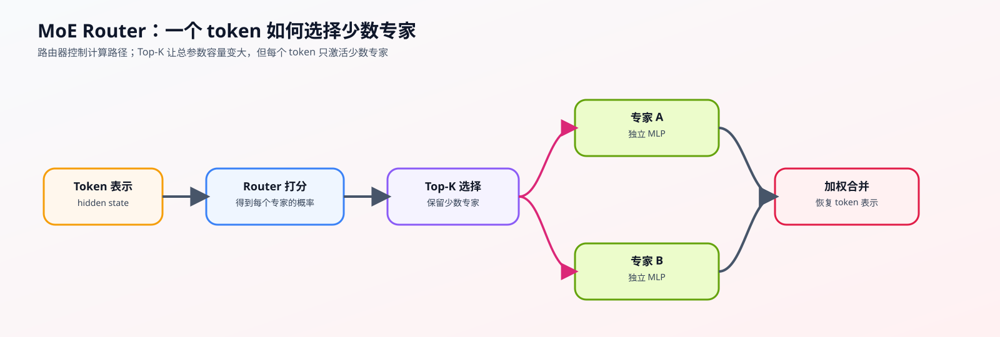
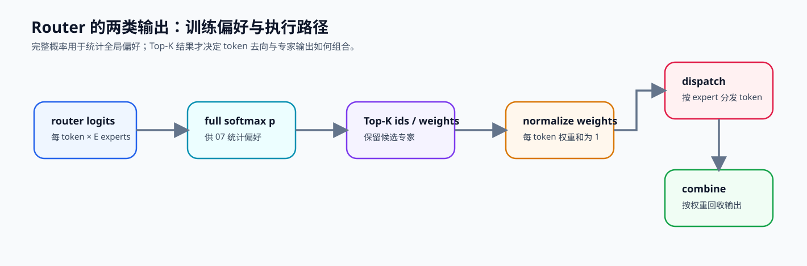

# 06. MoE Router | MoE 路由器

**难度：** Medium | **环境：** CPU-first | **标签：** `模型结构`, `MoE`, `Router` | **目标人群：** 模型结构学习者

> 🚀 **云端运行环境**
>
> 本章节的实战代码可以点击以下链接在免费 GPU 算力平台上直接运行：
>
> [](https://colab.research.google.com/github/datawhalechina/llm-algo-leetcode/blob/main/02_PyTorch_Algorithms/06_MoE_Router.ipynb)
> [](https://modelscope.cn/my/mynotebook) *(国内推荐：魔搭社区免费实例)*


---

## 本节导读

普通 Transformer Block 里的 MLP 是稠密计算：每个 token 都要经过同一组参数。模型越大，计算量也越大；但很多时候，一个 token 并不需要动用全部专家能力，只需要被送到最合适的少数分支。

MoE 的核心就是把 MLP 拆成多个 expert，再用 Router 为每个 token 选择 Top-K 专家。本节会实现最小路由器，重点看清 router logits、softmax 概率、Top-K 选择和专家权重如何连接起来。完成后，你应该能理解 MoE 如何用稀疏激活换取更大的参数容量，也能为下一节的负载均衡损失做好准备。

**关键词：** `MoE`, `Router`, `Sparse Routing`

---
## 前置阅读

**导语：** 先理解 Decoder Block 中稠密 MLP 的位置，再观察 MoE 如何让 Router 为每个 token 选择少数专家，并把专家输出写回原来的通道接口。

- [05. LLaMA3 Block Tutorial | LLaMA3 Block 教程](../02_PyTorch_Algorithms/05_LLaMA3_Block_Tutorial.md)
- 可选回看：[P0: 09. PyTorch nn.Module Basics | PyTorch nn.Module 基础](../00_Prerequisites/09_PyTorch_nn_Module_Basics.md)（不熟悉 `ModuleList` 与模块参数时使用）

### Step 1：从稠密 MLP 到稀疏专家容量

稠密 Block 中，每个 token 都经过同一组 MLP 参数。MoE 把通道变换拆成多个专家，再由 Router 为每个 token 选择少数分支，使总参数容量可以增长，而每个 token 的激活计算仍由 `top_k` 控制。

专家也可以进一步细分：细粒度专家把相同总容量拆成更多、更小的分支；共享专家为所有 token 提供共同路径，路由专家承担差异化能力。这些设计改变参数容量和路由空间，但都会受到 expert capacity 与执行布局约束。

| 结构 | 每个 token 经过什么 | 扩容方式 | 新约束 |
|---|---|---|---|
| Dense MLP | 一组固定参数 | 扩大中间维 | 所有参数都参与计算 |
| Top-k MoE | 少数路由专家 | 增加专家数 | 路由、capacity、dispatch |
| 共享 + 路由专家 | 共享路径和少数专用路径 | 分离共同与专用容量 | 共享计算与稀疏计算同时存在 |
| 细粒度专家 | 更多、更小的专家 | 提高组合选择空间 | 路由和跨设备调度更复杂 |



### Step 2：路由概率、Top-k 与稀疏组合

Router 先产生对全部专家的 logits 和概率，再保留 Top-k 专家。完整概率描述训练时的全局偏好，Top-k 索引决定实际 dispatch 目标，截取后的权重经过重归一化后用于组合专家输出；三者不能互相替代。

| 中间量 | 形状 | 机制职责 |
|---|---|---|
| logits | `[B,T,E]` | token 对全部专家的原始打分 |
| global probabilities | `[B,T,E]` | 保留训练统计和全局偏好 |
| top-k ids / weights | `[B,T,K]` | 决定稀疏执行路径与组合系数 |
| normalized weights | `[B,T,K]` | 保证选中专家的组合权重和为 1 |

| token | Top-1 | Top-2 | 输出组合 |
|:---:|:---:|:---:|:---|
| token 0 | expert 2 | expert 5 | `0.7 E2(x) + 0.3 E5(x)` |
| token 1 | expert 1 | expert 2 | `w1 E1(x) + w2 E2(x)` |

#### Top-k 结果还不是完整执行计划

Top-k 只回答“想去哪些专家”。真正执行前还要把 token 按专家重排、检查每个专家的容量、处理 overflow，并在专家计算后恢复原 token 顺序。单卡教学实现可以用循环表达聚合，跨卡实现则会把 dispatch / combine 转化为 All-to-All 和负载长尾问题。

### Step 3：从路由偏好到 capacity、dispatch 与 combine

设每个专家本轮最多接收 `capacity` 个 token。被选中次数超过容量时，系统必须丢弃、重路由、排队或启用备用路径；因此 Router 的概率正确并不足以保证 MoE 可执行。共享专家和细粒度专家也必须进入同一份容量账本。

| 阶段 | 输入 | 输出 | 需要观察的风险 |
|---|---|---|---|
| Top-k | 全部专家概率 | 专家 id 与权重 | 路由是否过度集中 |
| Capacity gate | token 去向与专家容量 | accepted / overflow token | 丢弃、重路由与长尾 |
| Dispatch | accepted token 与目标专家 | 按专家分组的批次 | 跨卡 payload 与负载不均 |
| Expert compute | 专家批次 | 专家输出 | 最慢专家决定同步点 |
| Combine | 专家输出、原位置与权重 | 恢复 token 顺序的 hidden state | 顺序、权重与形状必须守恒 |



### Step 4：代码设计与 Top-K Router

本题依次构造完整概率、Top-K 选择和重归一化权重：完整概率进入负载均衡统计，稀疏权重进入专家输出聚合。题目区提供输入形状与 `top_k` 契约；学习者补全三处路由机制。

| TODO | 代码契约与机制责任 | 关键约束 | 测试证据 |
|---|---|---|---|
| TODO 1 | 在专家维度计算完整 Softmax 概率 | 每个 token 覆盖全部 `E` 个专家 | 每行概率和为 1 |
| TODO 2 | 获取 Top-K 权重与专家索引 | 形状为 `[tokens, K]`；索引位于 `[0, E)` | 选中数量、形状、范围与去重正确 |
| TODO 3 | 对保留权重重归一化 | 每个 token 的稀疏组合权重和为 1 | 与完整概率的选中项一致，可用于聚合 |
| 固定骨架 | 按专家聚合 token 输出 | 每个 token 的选中专家输出按权重相加 | 恒等专家下聚合输出回到原输入 |

```python
import torch
import torch.nn as nn
import torch.nn.functional as F
```


```python
class TopKRouter(nn.Module):
    """将每个 token 路由到少数专家，并保留完整概率用于批次统计。"""

    def __init__(self, hidden_size: int, num_experts: int, top_k: int):
        super().__init__()
        if num_experts <= 0 or not 0 < top_k <= num_experts:
            raise ValueError('top_k 必须在 1 到 num_experts 之间')
        self.num_experts = num_experts
        self.top_k = top_k
        self.gate = nn.Linear(hidden_size, num_experts, bias=False)

    def forward(self, hidden_states: torch.Tensor):
        """返回完整概率、Top-K 重归一化权重和选中专家索引。"""
        if hidden_states.ndim != 3:
            raise ValueError('hidden_states 必须是 [batch, seq_len, hidden_size]')
        _, _, hidden_size = hidden_states.shape
        flat_hidden_states = hidden_states.reshape(-1, hidden_size)
        router_logits = self.gate(flat_hidden_states)

        # TODO 1：计算全部专家的路由概率。
        # routing_probs = ???  # 在 expert 维度归一化，并用 FP32 保存统计口径
        raise NotImplementedError('TODO 1：请计算完整 Router 概率')

        # TODO 2：选择每个 token 的 Top-K 专家。
        # routing_weights = ???
        # selected_experts = ???
        raise NotImplementedError('TODO 2：请选择 Top-K 权重与索引')

        # TODO 3：让每个 token 的保留权重重新和为 1。
        # routing_weights = ???
        raise NotImplementedError('TODO 3：请重归一化 Top-K 权重')
        return routing_probs, routing_weights.to(hidden_states.dtype), selected_experts


class SparseMoEBlock(nn.Module):
    """用 Top-K Router 的结果按专家聚合 token 更新。"""

    def __init__(self, hidden_size: int, num_experts: int, top_k: int):
        super().__init__()
        self.router = TopKRouter(hidden_size, num_experts, top_k)
        self.experts = nn.ModuleList(
            [nn.Linear(hidden_size, hidden_size) for _ in range(num_experts)]
        )

    def forward(self, hidden_states: torch.Tensor) -> torch.Tensor:
        """返回与输入同形状的稀疏专家聚合结果。"""
        batch_size, seq_len, hidden_size = hidden_states.shape
        _, routing_weights, selected_experts = self.router(hidden_states)
        flat_hidden_states = hidden_states.reshape(-1, hidden_size)
        final_hidden_states = torch.zeros_like(flat_hidden_states)

        for expert_idx, expert in enumerate(self.experts):
            token_idx, kth_expert = torch.where(selected_experts == expert_idx)
            if token_idx.numel() > 0:
                expert_output = expert(flat_hidden_states[token_idx])
                expert_weight = routing_weights[token_idx, kth_expert].unsqueeze(-1)
                final_hidden_states[token_idx] += expert_output * expert_weight
        return final_hidden_states.reshape(batch_size, seq_len, hidden_size)
```


```python
# 测试设计：分别验证全量概率、Top-K 契约、重归一化和专家聚合。
# 每个测试只对应一项 Router 责任，便于定位未完成的 TODO。


def test_full_probability_distribution():
    router = TopKRouter(hidden_size=4, num_experts=5, top_k=2)
    x = torch.randn(2, 3, 4)
    probs, _, _ = router(x)
    assert probs.shape == (6, 5)
    assert probs.dtype == torch.float32
    assert torch.allclose(probs.sum(dim=-1), torch.ones(6))


def test_topk_contract_and_bounds():
    router = TopKRouter(hidden_size=4, num_experts=5, top_k=2)
    _, weights, indices = router(torch.randn(2, 3, 4))
    assert weights.shape == indices.shape == (6, 2)
    assert torch.all((indices >= 0) & (indices < 5))
    assert torch.all(indices.sort(dim=-1).values[:, 1:] != indices.sort(dim=-1).values[:, :-1])


def test_renormalized_weights_match_selected_probability():
    router = TopKRouter(hidden_size=4, num_experts=5, top_k=2)
    probs, weights, indices = router(torch.randn(2, 3, 4))
    selected_probs = probs.gather(dim=-1, index=indices)
    expected = selected_probs / selected_probs.sum(dim=-1, keepdim=True)
    assert torch.allclose(weights.float(), expected)
    assert torch.allclose(weights.sum(dim=-1), torch.ones(6))


def test_sparse_aggregation_uses_router_weights():
    moe = SparseMoEBlock(hidden_size=4, num_experts=5, top_k=2)
    with torch.no_grad():
        for expert in moe.experts:
            expert.weight.copy_(torch.eye(4))
            expert.bias.zero_()
    x = torch.randn(2, 3, 4)
    assert torch.allclose(moe(x), x, atol=1e-5)


def test_router_config_contract():
    for top_k in (0, 6):
        try:
            TopKRouter(hidden_size=4, num_experts=5, top_k=top_k)
        except ValueError:
            continue
        raise AssertionError('非法 top_k 应被拒绝')


def run_topk_router_tests():
    test_full_probability_distribution()
    test_topk_contract_and_bounds()
    test_renormalized_weights_match_selected_probability()
    test_sparse_aggregation_uses_router_weights()
    test_router_config_contract()
    print('✅ Top-K Router：概率、选择、权重与聚合测试通过')


try:
    run_topk_router_tests()
except NotImplementedError:
    print('请先完成 TODO 1–3，再运行测试。')
    raise
```

## 参考代码与解析

### 代码

```python
class TopKRouter(nn.Module):
    """将每个 token 路由到少数专家，并保留完整概率用于批次统计。"""

    def __init__(self, hidden_size: int, num_experts: int, top_k: int):
        super().__init__()
        if num_experts <= 0 or not 0 < top_k <= num_experts:
            raise ValueError('top_k 必须在 1 到 num_experts 之间')
        self.num_experts = num_experts
        self.top_k = top_k
        self.gate = nn.Linear(hidden_size, num_experts, bias=False)

    def forward(self, hidden_states: torch.Tensor):
        """返回完整概率、Top-K 重归一化权重和选中专家索引。"""
        if hidden_states.ndim != 3:
            raise ValueError('hidden_states 必须是 [batch, seq_len, hidden_size]')
        _, _, hidden_size = hidden_states.shape
        flat_hidden_states = hidden_states.reshape(-1, hidden_size)
        router_logits = self.gate(flat_hidden_states)

        # TODO 1：计算全部专家的路由概率。
        # routing_probs = ???  # 在 expert 维度归一化，并用 FP32 保存统计口径
        routing_probs = F.softmax(router_logits.float(), dim=-1)

        # TODO 2：选择每个 token 的 Top-K 专家。
        # routing_weights = ???
        # selected_experts = ???
        routing_weights, selected_experts = torch.topk(routing_probs, self.top_k, dim=-1)

        # TODO 3：让每个 token 的保留权重重新和为 1。
        # routing_weights = ???
        routing_weights = routing_weights / routing_weights.sum(dim=-1, keepdim=True)
        return routing_probs, routing_weights.to(hidden_states.dtype), selected_experts


class SparseMoEBlock(nn.Module):
    """用 Top-K Router 的结果按专家聚合 token 更新。"""

    def __init__(self, hidden_size: int, num_experts: int, top_k: int):
        super().__init__()
        self.router = TopKRouter(hidden_size, num_experts, top_k)
        self.experts = nn.ModuleList(
            [nn.Linear(hidden_size, hidden_size) for _ in range(num_experts)]
        )

    def forward(self, hidden_states: torch.Tensor) -> torch.Tensor:
        """返回与输入同形状的稀疏专家聚合结果。"""
        batch_size, seq_len, hidden_size = hidden_states.shape
        _, routing_weights, selected_experts = self.router(hidden_states)
        flat_hidden_states = hidden_states.reshape(-1, hidden_size)
        final_hidden_states = torch.zeros_like(flat_hidden_states)

        for expert_idx, expert in enumerate(self.experts):
            token_idx, kth_expert = torch.where(selected_experts == expert_idx)
            if token_idx.numel() > 0:
                expert_output = expert(flat_hidden_states[token_idx])
                expert_weight = routing_weights[token_idx, kth_expert].unsqueeze(-1)
                final_hidden_states[token_idx] += expert_output * expert_weight
        return final_hidden_states.reshape(batch_size, seq_len, hidden_size)
```

### 答案与直觉

- **这一题要解决什么：** 用 Router 从所有专家里挑出最相关的少数几个，并给出对应权重。
- **为什么这样做：** 先全局 Softmax，再 Top-K，再重归一化，才能同时保留全局置信度和稀疏性。
- **带走的直觉：** MoE 的重点不是“专家很多”，而是“只激活少数专家，但路由必须稳定”。

**1. TODO 1: 全局 Softmax 转换**

- **实现方式**：`routing_probs = F.softmax(router_logits.float(), dim=-1)`
- **关键点**：必须在全维度（`num_experts`）上进行 Softmax，将原始打分转换为概率分布。
- **精度控制**：强制使用 `.float()` 转为 FP32 精度，防止 FP16/BF16 下的数值溢出。Softmax 对数值精度极其敏感，低精度会导致概率分布崩塌。
- **两类输出**：完整 `routing_probs` 保留所有专家的相对偏好，供负载均衡损失使用；截取后的权重只服务于稀疏专家组合。二者的职责不同，不能互相替代。

**2. TODO 2: Top-K 截取**

- **实现方式**：`routing_weights, selected_experts = torch.topk(routing_probs, self.top_k, dim=-1)`
- **关键点**：从全局概率分布中提取最大的 K 个概率值及其对应的专家索引。
- **本质区别**：这里同时保留完整概率与截取结果；Top-K 索引给出 dispatch 目标，截取权重给出组合比例。
- **工业实践**：Mixtral 8x7B、DeepSeek 等主流 MoE 模型均采用此方法。

**3. TODO 3: 重归一化**

- **实现方式**：`routing_weights = routing_weights / routing_weights.sum(dim=-1, keepdim=True)`
- **必要性**：截取后的 K 个概率之和不再为 1，需要按比例放大使其重新归一化，以稳定梯度的尺度。
- **技术细节**：`keepdim=True` 保持维度以支持广播除法。
- **后续用途**：完整概率会在下一节计算 $P_i$；重归一化后的 Top-K 权重只用于本节的稀疏专家输出加权。

**工程优化要点**

- **稀疏激活的本质**：MoE 的核心价值在于"大容量、低激活"。通过 Top-K 路由，每个 Token 只激活少数专家（通常 K=2），使得 56B 参数的模型实际计算量仅相当于 14B 的稠密模型。
- **高效聚合**：代码中的 `SparseMoEBlock` 使用 For 循环遍历专家是为了便于理解。工业界框架（vLLM、Megatron-LM）会使用 Token Sorting（按专家索引排序）将去往同一专家的 Token 汇聚成批次，一次性计算以提升 GPU 利用率。

## 相关阅读

完成 Top-K 路由后，可从代表性模型确认 Router 的实现，再沿着负载均衡和专家并行观察 token 去向如何转化为系统代价。

- [Switch Transformers 原论文](https://arxiv.org/abs/2101.03961)
- [Mixtral 模型实现说明](https://huggingface.co/docs/transformers/main/en/model_doc/mixtral)
- [07. MoE 负载均衡损失](../02_PyTorch_Algorithms/07_MoE_Load_Balancing_Loss.md)
- [80. MoE 专家并行基准](../02_PyTorch_Algorithms/80_MoE_Expert_Parallel_Benchmark.md)
- [P1: 通信拓扑与分布式基石](../01_Hardware_Math_and_Systems/05_Communication_Topologies.md)
