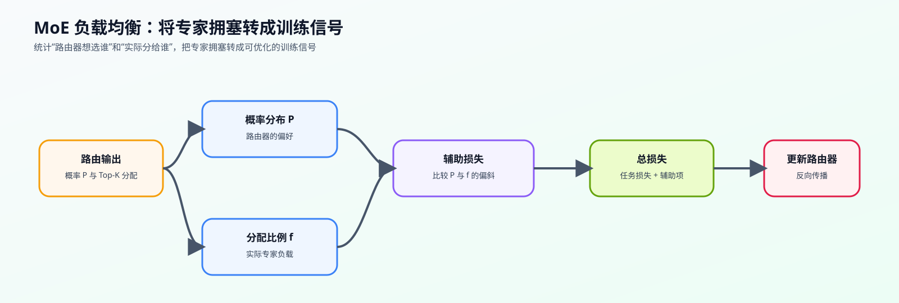
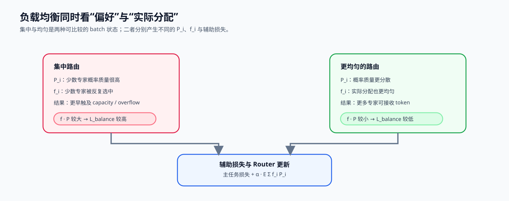

# 07. MoE Load Balancing Loss | MoE 负载均衡损失

**难度：** Hard | **环境：** CPU-first | **标签：** `模型结构`, `MoE`, `负载均衡` | **目标人群：** 模型结构学习者

> 🚀 **云端运行环境**
>
> 本章节的实战代码可以点击以下链接在免费 GPU 算力平台上直接运行：
>
> [](https://colab.research.google.com/github/datawhalechina/llm-algo-leetcode/blob/main/02_PyTorch_Algorithms/07_MoE_Load_Balancing_Loss.ipynb)
> [](https://modelscope.cn/my/mynotebook) *(国内推荐：魔搭社区免费实例)*


---

## 本节导读

上一节的 Router 已经能把 token 分给 Top-K 专家，但训练过程中它可能很快学会“偏科”：大量 token 被送到少数几个专家，其他专家长期拿不到样本。这样 MoE 表面上有很多参数，实际却退化成少数专家过载、其余专家闲置。

负载均衡损失要解决的就是这个问题：在主任务 loss 之外加入一个很小的辅助项，同时约束专家被选中的频率和平均路由概率。本节会实现 MoE auxiliary loss，重点看清 $f_i$ 和 $P_i$ 分别统计什么。完成后，你应该能理解 Router 不只要会选专家，还要被训练目标约束得足够均衡。

**关键词：** `MoE`, `Load Balancing`, `Auxiliary Loss`

---
## 前置阅读

**导语：** 先理解 Router 如何保留完整概率、选择 Top-K 专家并完成重归一化；随后再从一个 batch 的角度比较“偏好”与“实际派发”。

- [06. MoE Router | MoE 路由器](../02_PyTorch_Algorithms/06_MoE_Router.md)
- 可选回看：[13. End-to-End Fine-Tuning Experiment | 端到端微调实验](../02_PyTorch_Algorithms/13_End_to_End_Fine_Tuning_Experiment.md)（需要回看辅助损失如何进入训练总损失时使用）

### Step 1：路由正确还不够——还要避免专家拥塞

Top-k Router 可以为单个 token 选择专家，却不保证一个 batch 或多个训练 step 的 token 会均匀分布。若多数 token 长期集中到少数专家，capacity overflow、排队、跨卡通信和同步长尾都会放大；均衡机制需要把这种系统风险反馈给 Router。

| 观察层次 | 需要回答的问题 | 对应信号 |
|---|---|---|
| 单个 token | 它偏好哪些专家 | 完整概率与 Top-k id |
| 一个 batch | 偏好和实际派发是否集中 | `P_i`、`f_i`、expert count |
| 多个 step | 热点是否持续、是否振荡 | 移动统计、路由偏置变化 |
| 系统执行 | 哪些专家先触及容量 | capacity、overflow、等待与 payload |



### Step 2：用偏好、派发与容量三类分布观察路由

负载均衡至少需要同时看三类量：`P_i` 是 Router 给专家 $i$ 的平均概率质量，`f_i` 是专家实际被 Top-k 选中的比例，capacity / overflow 则说明执行阶段是否还能接收这些 token。只看其中一项可能掩盖“概率看似均匀、离散选择却集中”或“分配尚可、容量配置仍不足”的问题。

| 量 | 来源 | 回答的问题 |
|---|---|---|
| $P_i$ | 全部专家概率的 token 均值 | Router 的平均偏好是否集中 |
| $f_i$ | Top-k id 的出现次数 | 实际 dispatch 是否集中 |
| capacity usage | accepted / capacity | 专家槽位利用是否均衡 |
| overflow rate | 超容量分配 | 是否需要重路由、丢弃或扩容 |



### Step 3：辅助损失与无辅助均衡的不同反馈路径

经典辅助损失把平均偏好 $P_i$ 与实际分配 $f_i$ 放入训练目标：偏好和派发同时集中时惩罚增大。它直接影响梯度，因此系数过大可能干扰主任务。另一类无辅助均衡方法不把额外项加入主 loss，而是根据历史负载动态调整专家选择偏置；这减少了损失耦合，但引入了额外状态、更新节奏和稳定性问题。

$$
P_i=\frac{1}{T}\sum_t p_{t,i},\qquad
f_i=\frac{1}{TK}\sum_t\mathbf{1}_{i\in\operatorname{TopK}(p_t)},\qquad
L_{balance}=\alpha E\sum_i f_iP_i.
$$

| 路径 | 反馈进入哪里 | 优点 | 需要警惕 |
|---|---|---|---|
| Auxiliary loss | 训练总损失与梯度 | 机制直接、统计清晰 | 系数影响主任务，均衡不等于语义路由正确 |
| Auxiliary-loss-free | 路由选择偏置或控制状态 | 不直接改写主任务 loss | 偏置更新可能振荡，仍需监测 overflow 与质量 |
| Capacity fallback | 执行阶段重路由或丢弃 | 保护单步可执行性 | 不能替代长期路由训练 |

本节题目实现辅助损失这一条基础路径；无辅助均衡和 capacity fallback 作为后续 MoE 项目的候选策略，不在同一个函数中混写。

### Step 4：代码设计与批次级负载均衡损失

本题接收 Router 的两类输出：完整概率用于计算专家平均偏好 `P_i`，Top-K 索引用于统计实际派发比例 `f_i`，再据此得到辅助损失。题目区固定输入契约；学习者补全三处批次统计机制。

| TODO | 代码契约与机制责任 | 关键约束 | 测试证据 |
|---|---|---|---|
| TODO 1 | 汇总每个专家的平均路由概率 `P_i` | 从完整概率沿 token 维取平均 | `P_i` 总和为 1 |
| TODO 2 | 统计每个专家的实际 token 分配比例 `f_i` | 根据 Top-K 索引计数并按总分配数归一化 | `f_i` 总和为 1；集中路由可识别 |
| TODO 3 | 计算辅助均衡损失 | 使用相同专家维度的 `P_i` 与 `f_i` | 均匀路由低于集中路由；返回统计可核对 |
| 固定骨架 | 检查形状、专家数、`top_k` 与索引范围 | `router_probs` 与 `selected_experts` 共享 token 维 | 非法输入被拒绝 |

```python
import torch
import torch.nn.functional as F

```


```python
def compute_load_balancing_loss(
    router_probs: torch.Tensor,
    selected_experts: torch.Tensor,
    num_experts: int,
    top_k: int,
    alpha: float = 0.01,
    return_stats: bool = False,
):
    """计算 Top-K MoE 的 batch 级负载均衡辅助损失。"""
    if router_probs.ndim != 2 or selected_experts.ndim != 2:
        raise ValueError('router_probs 与 selected_experts 都必须是二维张量')
    total_tokens, probability_experts = router_probs.shape
    if total_tokens == 0 or probability_experts != num_experts:
        raise ValueError('router_probs 的 token 数与专家维必须有效')
    if selected_experts.shape != (total_tokens, top_k):
        raise ValueError('selected_experts 必须是 [tokens, top_k]')
    if not 0 < top_k <= num_experts:
        raise ValueError('top_k 必须在 1 到 num_experts 之间')
    if selected_experts.dtype != torch.long:
        raise ValueError('selected_experts 必须为 torch.long')
    if torch.any((selected_experts < 0) | (selected_experts >= num_experts)):
        raise ValueError('selected_experts 含越界专家索引')

    # TODO 1：计算每个专家的平均路由概率 P_i。
    # P_i = ???
    raise NotImplementedError('TODO 1：请汇总完整概率分布')

    # TODO 2：计算每个专家的实际分配比例 f_i。
    # expert_mask = ???
    # tokens_per_expert = ???
    # f_i = ???
    raise NotImplementedError('TODO 2：请统计 Top-K 分配比例')

    # TODO 3：计算负载均衡辅助损失。
    # aux_loss = ???
    raise NotImplementedError('TODO 3：请计算辅助损失')
    return (aux_loss, P_i, f_i) if return_stats else aux_loss
```


```python
# 测试设计：分别验证均匀、集中、偏好/派发错配和输入契约。
# 每个测试对应一类 batch 级路由现象，避免把所有判断混在单一大测试中。


def test_uniform_routing_statistics():
    num_experts, top_k, num_tokens, alpha = 8, 2, 80, 0.01
    selected = torch.tensor(
        [[(2 * i) % num_experts, (2 * i + 1) % num_experts] for i in range(num_tokens)],
        dtype=torch.long,
    )
    probs = torch.full((num_tokens, num_experts), 1 / num_experts)
    loss, P_i, f_i = compute_load_balancing_loss(probs, selected, num_experts, top_k, alpha, True)
    assert torch.allclose(P_i, torch.full((num_experts,), 1 / num_experts))
    assert torch.allclose(f_i, torch.full((num_experts,), 1 / num_experts))
    assert torch.allclose(loss, torch.tensor(alpha), atol=1e-6)


def test_concentrated_routing_has_larger_penalty():
    num_experts, top_k, num_tokens, alpha = 8, 2, 80, 0.01
    selected = torch.tensor([[0, 1]] * num_tokens, dtype=torch.long)
    probs = torch.zeros(num_tokens, num_experts)
    probs[:, :2] = 0.5
    concentrated = compute_load_balancing_loss(probs, selected, num_experts, top_k, alpha)
    uniform = torch.tensor(alpha)
    assert concentrated > uniform * 2


def test_preference_and_dispatch_can_differ():
    num_experts, top_k, num_tokens = 8, 2, 40
    probs = torch.full((num_tokens, num_experts), 1 / num_experts)
    selected = torch.tensor([[0, 1]] * num_tokens, dtype=torch.long)
    _, P_i, f_i = compute_load_balancing_loss(probs, selected, num_experts, top_k, return_stats=True)
    assert torch.allclose(P_i, torch.full((num_experts,), 1 / num_experts))
    assert torch.allclose(f_i[:2], torch.tensor([0.5, 0.5]))
    assert torch.allclose(f_i[2:], torch.zeros(num_experts - 2))


def test_load_balance_input_contract():
    probs = torch.full((4, 4), 0.25)
    selected = torch.tensor([[0, 1]] * 4, dtype=torch.long)
    invalid_cases = [
        (probs[:, :3], selected, 4, 2),
        (probs, selected.float(), 4, 2),
        (probs, torch.tensor([[0, 4]] * 4), 4, 2),
        (probs, selected, 4, 0),
    ]
    for args in invalid_cases:
        try:
            compute_load_balancing_loss(*args)
        except ValueError:
            continue
        raise AssertionError('非法路由输入应被拒绝')


def run_load_balance_tests():
    test_uniform_routing_statistics()
    test_concentrated_routing_has_larger_penalty()
    test_preference_and_dispatch_can_differ()
    test_load_balance_input_contract()
    print('✅ 负载均衡：均匀、集中、错配与输入契约测试通过')


try:
    run_load_balance_tests()
except NotImplementedError:
    print('请先完成 TODO 1–3，再运行测试。')
    raise
```

## 参考代码与解析

### 代码


```python
def compute_load_balancing_loss(
    router_probs: torch.Tensor,
    selected_experts: torch.Tensor,
    num_experts: int,
    top_k: int,
    alpha: float = 0.01,
    return_stats: bool = False,
):
    """计算 Top-K MoE 的 batch 级负载均衡辅助损失。"""
    if router_probs.ndim != 2 or selected_experts.ndim != 2:
        raise ValueError('router_probs 与 selected_experts 都必须是二维张量')
    total_tokens, probability_experts = router_probs.shape
    if total_tokens == 0 or probability_experts != num_experts:
        raise ValueError('router_probs 的 token 数与专家维必须有效')
    if selected_experts.shape != (total_tokens, top_k):
        raise ValueError('selected_experts 必须是 [tokens, top_k]')
    if not 0 < top_k <= num_experts:
        raise ValueError('top_k 必须在 1 到 num_experts 之间')
    if selected_experts.dtype != torch.long:
        raise ValueError('selected_experts 必须为 torch.long')
    if torch.any((selected_experts < 0) | (selected_experts >= num_experts)):
        raise ValueError('selected_experts 含越界专家索引')

    # TODO 1：计算每个专家的平均路由概率 P_i。
    # P_i = ???
    P_i = router_probs.mean(dim=0)

    # TODO 2：计算每个专家的实际分配比例 f_i。
    # expert_mask = ???
    # tokens_per_expert = ???
    # f_i = ???
    expert_mask = F.one_hot(selected_experts, num_classes=num_experts)
    tokens_per_expert = expert_mask.sum(dim=(0, 1)).float()
    f_i = tokens_per_expert / (total_tokens * top_k)

    # TODO 3：计算负载均衡辅助损失。
    # aux_loss = ???
    aux_loss = alpha * num_experts * (f_i * P_i).sum()
    return (aux_loss, P_i, f_i) if return_stats else aux_loss
```

### 答案与直觉

- **这一题要解决什么：** 用一个辅助损失把路由从“少数专家过载”拉回到更均匀的分配。
- **为什么这样做：** `P_i` 看路由器“想分给谁”，`f_i` 看实际“分给了谁”，两者一起乘能同时约束偏好和结果。
- **带走的直觉：** MoE 的路由不仅要选得对，还要选得均衡，否则专家容量再大也会塌缩。

**1. TODO 1: 计算 P_i（平均路由概率）**

- **实现方式**：`P_i = router_probs.mean(dim=0)`。
- **核心逻辑**：沿 token 维度求均值，保留 Router 对每个专家的完整概率偏好。
- **归一化**：每个 token 的完整概率和为 1，因此均值后的 $P_i$ 仍满足 $\sum_i P_i=1$。
- **物理含义**：$P_i$ 表示专家 $i$ 在所有 token 上获得的平均概率质量，而非只统计已 dispatch 的权重。

**2. TODO 2: 计算 f_i（分配次数比例）**

- **实现方式**：
  ```python
  expert_mask = F.one_hot(selected_experts, num_classes=num_experts)
  tokens_per_expert = expert_mask.sum(dim=(0, 1)).float()
  f_i = tokens_per_expert / (total_tokens * top_k)
  ```
- **核心逻辑**：`F.one_hot` 将专家索引转换为 one-hot 编码，形状为 `[batch_size_x_seq_len, top_k, num_experts]`。
- **统计方法**：沿前两个维度求和，统计每个专家被选中的总次数。
- **归一化**：除以总的选择次数得到比例。
- **物理含义**：$f_i$ 表示专家 $i$ 实际分到的 **分配次数占比**（总分配次数 = `total_tokens * top_k`）。它统计的是“选中次数”的占比，而非“Token 个数”的占比，因此代码中使用 `total_tokens * top_k` 作为归一化分母。

**3. TODO 3: 计算辅助损失**

- **实现方式**：`aux_loss = alpha * num_experts * (f_i * P_i).sum()`
- **数学公式**：$L_{aux} = \alpha \cdot E \sum_{i=1}^E f_i \cdot P_i$
- **最小值分析**：根据均值不等式，当 $f_i = P_i = 1/E$ 时（完全均匀），损失最小。在当前统一定义下，完全均匀时理论最小值为 $\alpha$。
- **优化目标**：优化器为了降低这个 Loss，会强制将 Token 均匀分配给所有专家，防止路由崩塌。

**工程要点**

- **Top-K 兼容性**：代码支持任意 K 值，通过 `total_tokens` 归一化 $P_i$、通过 `total_tokens * top_k` 归一化 $f_i$，确保比例计算正确。
- **数值稳定性**：使用 `scatter_add_` 而非循环累加，提升计算效率和数值稳定性。
- **超参数调优**：$\alpha$ 通常设为 0.01，过大会影响主任务性能，过小则无法有效平衡负载。
- **与主损失结合**：在实际训练中，将 `aux_loss` 加到 CrossEntropy Loss 上：`total_loss = ce_loss + aux_loss`。

## 相关阅读

负载均衡将 Router 的统计量连接到专家并行中的容量与通信问题；下列材料分别用于核对公式、真实模型和项目级证据。

- [Switch Transformers 原论文](https://arxiv.org/abs/2101.03961)
- [Mixtral 模型实现说明](https://huggingface.co/docs/transformers/main/en/model_doc/mixtral)
- [80. MoE 专家并行基准](../02_PyTorch_Algorithms/80_MoE_Expert_Parallel_Benchmark.md)
- [P1: 通信拓扑与分布式基石](../01_Hardware_Math_and_Systems/05_Communication_Topologies.md)
