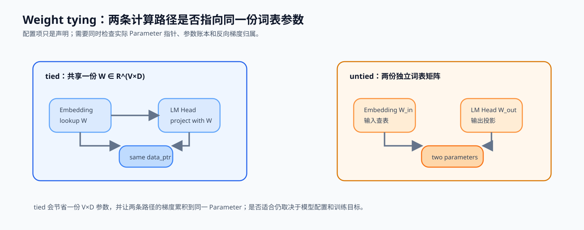

# 08. Architecture Tricks | 模型配置与参数归属

**难度：** Easy | **环境：** CPU-first | **标签：** `模型结构`, `架构技巧`, `Transformer` | **目标人群：** 模型结构学习者

> 🚀 **云端运行环境**
>
> 本章节的实战代码可以点击以下链接在免费 GPU 算力平台上直接运行：
>
> [](https://colab.research.google.com/github/datawhalechina/llm-algo-leetcode/blob/main/02_PyTorch_Algorithms/08_Architecture_Tricks.ipynb)
> [](https://modelscope.cn/my/mynotebook) *(国内推荐：魔搭社区免费实例)*


---

## 本节导读

本节聚焦配置层面的两个局部选择：输入 embedding 与 LM Head 是否共享参数，以及 RMSNorm 的缩放参数如何初始化。它们不改变 Block 的主路径，却会影响参数账本、梯度归属和训练初期的数值行为。

**关键词：** `Qwen`, `Gemma`, `Tie Embeddings`

---
## 前置阅读

**导语：** 先理解 RMSNorm 在 Block 中的缩放位置，以及 embedding、LM Head 与残差主路径在 Decoder Layer 中各自承担什么角色；随后再把局部配置对应到参数归属和审计字段。

- [01. RMSNorm Tutorial | RMSNorm 教程](../02_PyTorch_Algorithms/01_RMSNorm_Tutorial.md)
- [05. LLaMA3 Block Tutorial | LLaMA3 Block 教程](../02_PyTorch_Algorithms/05_LLaMA3_Block_Tutorial.md)
- 可选回看：[P0: 09. PyTorch nn.Module Basics | PyTorch nn.Module 基础](../00_Prerequisites/09_PyTorch_nn_Module_Basics.md)（理解 `Parameter` 与模块属性时使用）

### Step 1：配置选择如何落在模型结构上

模型配置不仅记录层数和 hidden size，还决定参数由谁持有、残差如何缩放、哪些层使用不同组件，以及 checkpoint 能否按预期加载。读取真实模型时，应把配置声明映射到模块对象、参数账本和状态接口，而不是只摘录一个字段名。

| 配置类别 | 代表选择 | 需要核对的实际对象 | 直接后果 |
|---|---|---|---|
| 参数归属 | embedding / LM Head 是否共享 | `Parameter` 指针与梯度 | 参数量、更新路径与 checkpoint 语义 |
| 数值约定 | Norm 类型、`eps`、缩放初始化 | 每个 Block 的 Norm 模块 | 初始尺度与加载兼容性 |
| 残差与深度 | residual scale、层级 pattern | Block 更新和层索引 | 深层激活与梯度稳定性 |
| Attention / MLP | KV heads、latent、dense/MoE | 投影、Router 与专家模块 | 状态容量、路由和执行路径 |


### Step 2：权重绑定的参数账本与梯度路径

Weight tying 让输入 Embedding 和输出 LM Head 共享同一份 $W\in\mathbb{R}^{V\times d}$。输入侧通过 $W$ 查表，输出侧使用同一参数把 hidden state 投影回词表；反向传播会把两条路径的梯度累积到同一个 `Parameter`。数值相同的两份拷贝不等于参数共享。

| 检查项 | tied | untied |
|---|---|---|
| 参数存储 | 两个模块指向同一矩阵 | 两个独立矩阵 |
| 参数账本 | 一份 `V × D` | 两份 `V × D` |
| 梯度归属 | 两条路径更新同一参数 | 两条路径分别更新 |
| 代码证据 | 参数与梯度指针一致 | 指针不同 |



### Step 3：从局部字段到可复查的结构审计

结构审计要回答三件事：配置声称采用什么结构，实际模块是否与声明一致，这个结构会改变哪些参数、状态或执行条件。局部字段只有进入这条证据链后，才能用于比较模型架构。

| 审计对象 | 配置声明 | 实际对象证据 | 结构后果与后续验证 |
|---|---|---|---|
| 权重共享 | `tie_word_embeddings` | 参数和梯度指针 | 词表参数账本、加载语义 |
| Norm 变体 | class、`eps`、初始化 | Block 中的 Norm 模块 | 尺度路径与深层稳定性 |
| 残差策略 | scale、层模式 | Block 更新公式 | 激活/梯度随深度变化 |
| Attention 表示 | head、KV head、latent 字段 | Q/K/V 投影与 Cache 接口 | 表示容量、重建和 backend 条件 |
| Dense / MoE | expert、top-k、shared expert | Router 与专家模块 | 激活容量、overflow 与通信 |
| 层级混合 | layer type pattern | 每层实际模块类型 | Attention / SSM 等记忆职责分配 |

本节题目选择权重共享和 Gemma 风格 Norm 缩放作为两个可运行例子，再用固定审计函数检查“声明—对象—账本”是否一致；其他结构沿用同一审计方法进入对应机制页和项目页。

### Step 4：代码设计与结构配置审计

本题将三项结构选择转成可验证的对象：Gemma 风格 RMSNorm 的缩放、embedding 与 LM Head 的共享存储，以及 tied / untied 的词表参数账本。`audit_model_config` 已提供声明与实际对象的一致性检查；学习者完成三个会改变结构语义的机制点。

| TODO | 代码契约与机制责任 | 关键约束 | 测试证据 |
|---|---|---|---|
| TODO 1 | 完成 `1 + weight` 的 RMSNorm 缩放 | 保持输入 dtype；零初始化应保留归一化输出 | 零/非零缩放与 dtype 正确 |
| TODO 2 | 让 LM Head 与 embedding 共享同一参数 | 两个模块引用同一 `Parameter` | 参数与梯度指针一致，更新同步 |
| TODO 3 | 计算 tied / untied 的词表参数账本 | embedding 参数为 `V × D`；untied 额外增加一份 | 节省量等于一份 `V × D` 矩阵 |
| 固定函数 | 比较 config 声明和实际参数关系 | 输出 `consistent / config_mismatch / needs_checkpoint_review` | 声明、指针与账本可共同核对 |

```python
import torch
import torch.nn as nn
```


```python
# --- TODO 1：Gemma 风格的 RMSNorm 缩放 ---
class GemmaRMSNorm(nn.Module):
    """用 `1 + weight` 作为通道缩放的最小 RMSNorm。"""

    def __init__(self, hidden_size: int, eps: float = 1e-6):
        super().__init__()
        self.eps = eps
        self.weight = nn.Parameter(torch.zeros(hidden_size))

    def forward(self, x: torch.Tensor) -> torch.Tensor:
        """保持输入形状与 dtype；内部以 FP32 计算 RMS。"""
        x_f32 = x.float()
        variance = x_f32.pow(2).mean(-1, keepdim=True)
        x_norm = x_f32 * torch.rsqrt(variance + self.eps)

        # TODO 1：完成 Gemma 的 `1 + weight` 缩放。
        # output = ???  # 归一化状态乘以通道缩放因子
        raise NotImplementedError("TODO 1：请实现 Gemma RMSNorm 缩放")
        return output.type_as(x)


# --- TODO 2：Embedding 与 LM Head 的参数共享 ---
class QwenTieEmbeddings(nn.Module):
    """构造词表 embedding 与 LM Head，并在 TODO 中绑定同一参数。"""

    def __init__(self, vocab_size: int, hidden_size: int):
        super().__init__()
        self.embed_tokens = nn.Embedding(vocab_size, hidden_size)
        self.lm_head = nn.Linear(hidden_size, vocab_size, bias=False)

        # TODO 2：让 LM Head 使用 embedding 的同一份 Parameter。
        # self.lm_head.weight = ???
        raise NotImplementedError("TODO 2：请绑定 embedding 与 LM Head 权重")

    def forward_embed(self, input_ids: torch.Tensor) -> torch.Tensor:
        return self.embed_tokens(input_ids)

    def forward_lm_head(self, hidden_states: torch.Tensor) -> torch.Tensor:
        return self.lm_head(hidden_states)


# --- TODO 3：tied / untied 词表参数账本 ---
def summarize_parameter_layout(vocab_size: int, hidden_size: int, tied: bool) -> dict:
    """返回 embedding、LM Head、总计与节省的词表参数数量。"""
    if vocab_size <= 0 or hidden_size <= 0:
        raise ValueError("vocab_size 和 hidden_size 必须为正数")

    # TODO 3：计算 tied / untied 的词表参数账本。
    # embedding_params = ???
    # lm_head_params = ???
    raise NotImplementedError("TODO 3：请计算参数归属账本")
    return {
        'embedding_params': embedding_params,
        'lm_head_params': lm_head_params,
        'total_params': embedding_params + lm_head_params,
        'saved_params': embedding_params if tied else 0,
    }


def audit_model_config(model: nn.Module, config: dict) -> dict:
    """由固定骨架比较配置声明与模块实际状态。"""
    declared_tied = config.get('tie_word_embeddings')
    actual_tied = model.embed_tokens.weight.data_ptr() == model.lm_head.weight.data_ptr()
    norm_scale_init = config.get('norm_scale_init')
    if declared_tied is None or norm_scale_init is None:
        status = 'needs_checkpoint_review'
    elif bool(declared_tied) != actual_tied:
        status = 'config_mismatch'
    else:
        status = 'consistent'
    return {
        'status': status,
        'declared_tied': declared_tied,
        'actual_tied': actual_tied,
        'norm_scale_init': norm_scale_init,
    }
```


```python
# 测试设计：分别验证缩放语义、共享 Parameter、参数账本和配置审计。
# 每个测试只对应一项结构选择，便于定位未完成或错误的 TODO。


def test_gemma_rmsnorm_scale():
    hidden_size = 16
    norm = GemmaRMSNorm(hidden_size)
    x = torch.randn(2, 3, hidden_size)
    expected = (x.float() * torch.rsqrt(x.float().pow(2).mean(-1, keepdim=True) + norm.eps)).to(x.dtype)
    assert torch.allclose(norm(x), expected, atol=1e-4, rtol=1e-3)

    with torch.no_grad():
        norm.weight.fill_(0.1)
    assert not torch.allclose(norm(x), expected, atol=1e-4)
    assert norm(x.half()).dtype == torch.float16


def test_tied_parameter_identity_and_gradient():
    model = QwenTieEmbeddings(vocab_size=32, hidden_size=8)
    assert model.embed_tokens.weight.data_ptr() == model.lm_head.weight.data_ptr()

    before = model.embed_tokens.weight.detach().clone()
    with torch.no_grad():
        model.embed_tokens.weight.add_(1.0)
    assert torch.allclose(model.lm_head.weight, before + 1.0)

    input_ids = torch.randint(0, 32, (2, 4))
    loss = model.forward_lm_head(model.forward_embed(input_ids)).sum()
    loss.backward()
    assert model.embed_tokens.weight.grad is not None
    assert model.embed_tokens.weight.grad.data_ptr() == model.lm_head.weight.grad.data_ptr()


def test_parameter_layout():
    tied = summarize_parameter_layout(vocab_size=1000, hidden_size=64, tied=True)
    untied = summarize_parameter_layout(vocab_size=1000, hidden_size=64, tied=False)
    assert tied == {
        'embedding_params': 64000, 'lm_head_params': 0,
        'total_params': 64000, 'saved_params': 64000,
    }
    assert untied == {
        'embedding_params': 64000, 'lm_head_params': 64000,
        'total_params': 128000, 'saved_params': 0,
    }
    for vocab_size, hidden_size in [(0, 64), (1000, 0)]:
        try:
            summarize_parameter_layout(vocab_size, hidden_size, tied=True)
        except ValueError:
            continue
        raise AssertionError('非法词表或 hidden size 应被拒绝')


def test_config_audit():
    model = QwenTieEmbeddings(vocab_size=32, hidden_size=8)
    consistent = audit_model_config(model, {'tie_word_embeddings': True, 'norm_scale_init': 0.0})
    mismatch = audit_model_config(model, {'tie_word_embeddings': False, 'norm_scale_init': 0.0})
    incomplete = audit_model_config(model, {'tie_word_embeddings': True})
    assert consistent['status'] == 'consistent'
    assert mismatch['status'] == 'config_mismatch'
    assert incomplete['status'] == 'needs_checkpoint_review'


def run_architecture_trick_tests():
    test_gemma_rmsnorm_scale()
    test_tied_parameter_identity_and_gradient()
    test_parameter_layout()
    test_config_audit()
    print('✅ 结构配置：缩放、参数共享、账本和审计测试通过')


try:
    run_architecture_trick_tests()
except NotImplementedError:
    print('请先完成 TODO 1–3，再运行测试。')
    raise
```

## 参考代码与解析

### 代码


```python
# --- TODO 1：Gemma 风格的 RMSNorm 缩放 ---
class GemmaRMSNorm(nn.Module):
    """用 `1 + weight` 作为通道缩放的最小 RMSNorm。"""

    def __init__(self, hidden_size: int, eps: float = 1e-6):
        super().__init__()
        self.eps = eps
        self.weight = nn.Parameter(torch.zeros(hidden_size))

    def forward(self, x: torch.Tensor) -> torch.Tensor:
        """保持输入形状与 dtype；内部以 FP32 计算 RMS。"""
        x_f32 = x.float()
        variance = x_f32.pow(2).mean(-1, keepdim=True)
        x_norm = x_f32 * torch.rsqrt(variance + self.eps)

        # TODO 1：完成 Gemma 的 `1 + weight` 缩放。
        output = x_norm * (1 + self.weight)
        return output.type_as(x)


# --- TODO 2：Embedding 与 LM Head 的参数共享 ---
class QwenTieEmbeddings(nn.Module):
    """构造词表 embedding 与 LM Head，并在 TODO 中绑定同一参数。"""

    def __init__(self, vocab_size: int, hidden_size: int):
        super().__init__()
        self.embed_tokens = nn.Embedding(vocab_size, hidden_size)
        self.lm_head = nn.Linear(hidden_size, vocab_size, bias=False)

        # TODO 2：让 LM Head 使用 embedding 的同一份 Parameter。
        self.lm_head.weight = self.embed_tokens.weight

    def forward_embed(self, input_ids: torch.Tensor) -> torch.Tensor:
        return self.embed_tokens(input_ids)

    def forward_lm_head(self, hidden_states: torch.Tensor) -> torch.Tensor:
        return self.lm_head(hidden_states)


# --- TODO 3：tied / untied 词表参数账本 ---
def summarize_parameter_layout(vocab_size: int, hidden_size: int, tied: bool) -> dict:
    """返回 embedding、LM Head、总计与节省的词表参数数量。"""
    if vocab_size <= 0 or hidden_size <= 0:
        raise ValueError("vocab_size 和 hidden_size 必须为正数")

    # TODO 3：计算 tied / untied 的词表参数账本。
    embedding_params = vocab_size * hidden_size
    lm_head_params = 0 if tied else embedding_params
    return {
        'embedding_params': embedding_params,
        'lm_head_params': lm_head_params,
        'total_params': embedding_params + lm_head_params,
        'saved_params': embedding_params if tied else 0,
    }


def audit_model_config(model: nn.Module, config: dict) -> dict:
    """由固定骨架比较配置声明与模块实际状态。"""
    declared_tied = config.get('tie_word_embeddings')
    actual_tied = model.embed_tokens.weight.data_ptr() == model.lm_head.weight.data_ptr()
    norm_scale_init = config.get('norm_scale_init')
    if declared_tied is None or norm_scale_init is None:
        status = 'needs_checkpoint_review'
    elif bool(declared_tied) != actual_tied:
        status = 'config_mismatch'
    else:
        status = 'consistent'
    return {
        'status': status,
        'declared_tied': declared_tied,
        'actual_tied': actual_tied,
        'norm_scale_init': norm_scale_init,
    }
```

### 解析

本题从通道缩放、参数共享到参数账本，依次验证配置如何落到真实模块对象上。答案与题目区使用同一套类、函数和审计骨架，只补全三个机制点。

**TODO 1：完成 `1 + weight` 缩放**

- 先以 FP32 计算 RMS，再让 `x_norm` 乘以 `1 + weight`，最后恢复输入 dtype。
- 因此 `weight=0` 时输出就是未额外缩放的 RMS 归一化结果；非零权重才产生逐通道调整。

**TODO 2：绑定 embedding 与 LM Head 参数**

- 两个模块必须引用同一 `Parameter`，而不是复制一份数值相同的张量。
- `data_ptr()` 与梯度指针共同验证存储和反向传播确实共享。

**TODO 3：计算 tied / untied 账本**

- embedding 始终持有一份 `V × D` 词表矩阵；untied 时 LM Head 再增加一份同样大小的矩阵。
- 因而 tied 方案的 `saved_params` 正好是一份 `V × D`；该数字用于结构审计，不单独代表端到端性能。

**固定审计函数：对照声明与实际对象**

- `audit_model_config` 同时返回配置声明、参数指针关系和审计状态。
- 当配置缺字段时返回 `needs_checkpoint_review`；声明与实际共享关系相反时返回 `config_mismatch`。
## 相关阅读

完成本节后，可对照真实模型的配置与模块对象，再把这些字段带入架构审计项目。

- [Transformers 中的 LLaMA 模型实现](https://github.com/huggingface/transformers/blob/main/src/transformers/models/llama/modeling_llama.py)
- [Qwen3 开源仓库](https://github.com/QwenLM/Qwen3)
- [Gemma 开源仓库](https://github.com/google-deepmind/gemma)
- [61. 模型架构探索](../02_PyTorch_Algorithms/61_Model_Architecture_Exploration.md)
- [归一化演进：架构专题](../topic_discussion/llm_architecture_evolution/03_norm_evolution.md)
- [代表模型：架构专题](../topic_discussion/llm_architecture_evolution/08_representative_models.md)
