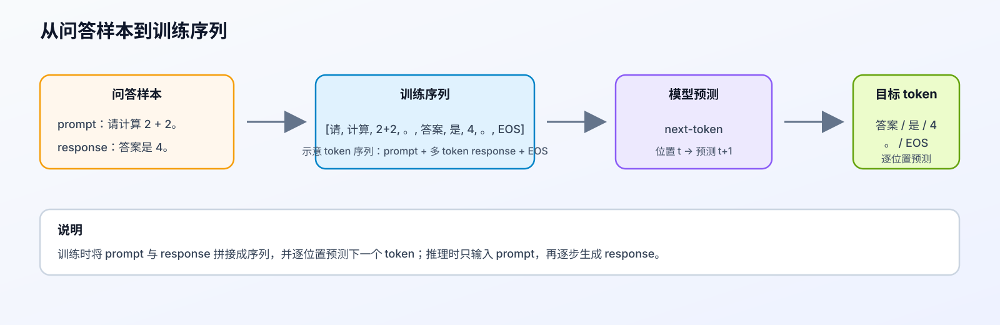
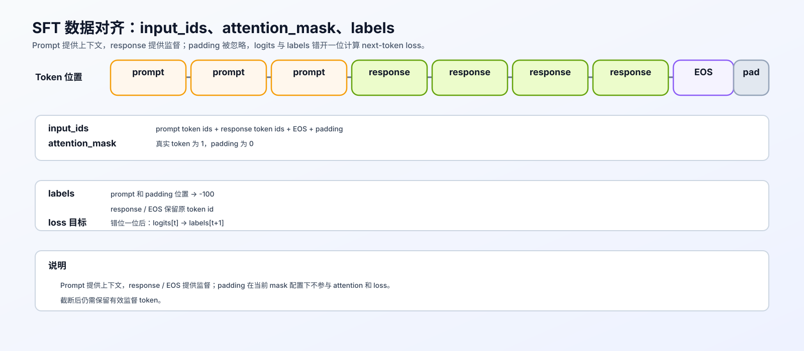

# 09. SFT Training Loop | 监督微调训练循环

**难度：** Medium | **环境：** CPU-first | **标签：** `训练微调`, `SFT`, `训练循环` | **目标人群：** 训练机制学习者

> 🚀 **云端运行环境**
>
> 本章节的实战代码可以点击以下链接在免费 GPU 算力平台上直接运行：
>
> [](https://colab.research.google.com/github/datawhalechina/llm-algo-leetcode/blob/main/02_PyTorch_Algorithms/09_SFT_Training_Loop.ipynb)
> [](https://modelscope.cn/my/mynotebook) *(国内推荐：魔搭社区免费实例)*


---

## 本节导读

把模型结构写出来以后，下一步就是让它按监督数据学习回答。Fine-tuning 是继续训练预训练模型以适应下游任务的总称，SFT（监督微调）是其中使用 prompt-response 标注数据的一种训练方式。SFT 最容易出错的地方并不在 optimizer，而在数据和 loss 的对齐：模型输入通常是 `[prompt + response]`，真正应该学习的是 response，而不是让模型去复述 prompt。

本节聚焦 SFT 训练循环中的数据与 loss 对齐：用 prompt masking 将上下文位置设为 `ignore_index`，用 `attention_mask` 区分真实 token 和 padding，再通过 shift logits / labels 对齐下一个 token 预测。完成后，你应该能看懂 `input_ids`、`attention_mask`、`labels` 和 cross entropy 之间的关系。参数更新、评估和 LoRA / RLHF 训练将在后续内容中沿用这套对齐规则。

**关键词：** `SFT`, `masking`, `attention_mask`, `shift logits`

---
## 前置阅读

**导语：** 先把模型封装、训练循环和优化器基础看清，再读 SFT 的数据构造与 loss 对齐会更顺。

- [P0: 09. PyTorch nn.Module Basics | PyTorch nn.Module 基础](../00_Prerequisites/09_PyTorch_nn_Module_Basics.md)
- [P0: 11. PyTorch Optimizers and Loss | PyTorch 优化器与损失](../00_Prerequisites/11_PyTorch_Optimizers_and_Loss.md)
- [P0: 13. Simple Neural Network Training | 简单神经网络训练循环](../00_Prerequisites/13_Simple_Neural_Network_Training.md)

## 相关阅读

**导语：** 读完 SFT 的最小训练循环后，建议继续看端到端微调实验、LoRA 以及训练显存和性能分析。

- [10. LoRA Tutorial | LoRA 教程](../02_PyTorch_Algorithms/10_LoRA_Tutorial.md)
- [13. End-to-End Fine-Tuning Experiment | 端到端微调实验](../02_PyTorch_Algorithms/13_End_to_End_Fine_Tuning_Experiment.md)
- [P0: 17. PyTorch Profiling Basics | PyTorch 性能剖析基础](../00_Prerequisites/17_PyTorch_Profiling_Basics.md)
- [P0: 18. Memory Profiling and Optimization | 显存剖析与优化](../00_Prerequisites/18_Memory_Profiling_and_Optimization.md)

---
### Step 1：从一条问答样本理解 SFT

SFT 使用“输入—回答”样本训练模型。例如：

- prompt：`请计算 2 + 2。`
- response：`答案是 4。`

`EOS`（end of sequence）是表示序列结束的特殊 token。它让模型知道回答何时结束。



<div align="center"><strong>SFT 训练序列与预测目标：</strong> 训练时将 prompt 与 response 拼接成序列并逐位置预测下一个 token；推理时只输入 prompt，再逐步生成 response。</div>

本节先从问答样本理解模型如何逐步生成回答，再逐步实现数据张量与 loss 对齐。

### Step 2: 构造输入数据三件套

一条 SFT 样本进入模型前，至少要整理成 `input_ids`、`attention_mask` 和 `labels`。本 Step 先关注序列构造与 padding 对齐；监督目标和 loss 规则放到 Step 3。

`padding` 是为了让同一 batch 的序列长度一致而补的占位位置；`mask` 用来标记哪些位置有效、哪些位置需要忽略。

下面的表先只检查序列结构；`labels` 的监督位置和 next-token 对齐规则留到 Step 3。

| 位置 | 0 | 1 | 2 | 3 | 4 | 5 | 6 | 7 | 8 |
|:---|:---:|:---:|:---:|:---:|:---:|:---:|:---:|:---:|:---:|
| 语义 | prompt | prompt | prompt | response | response | response | response | EOS | padding |
| `input_ids` | 10 | 20 | 30 | 40 | 50 | 60 | 70 | 2 | 0 |
| `attention_mask` | 1 | 1 | 1 | 1 | 1 | 1 | 1 | 1 | 0 |
| `labels` | 先不填 | 先不填 | 先不填 | 先不填 | 先不填 | 先不填 | 先不填 | 先不填 | 先不填 |

读表时先确认：真实 token 的 `attention_mask` 为 1，padding 位为 0；`input_ids` 可以包含 padding，但 padding 不应成为训练目标。Step 3 再把 prompt、response 和 EOS 映射为具体的 `labels`。
### Step 3: 对齐 next-token loss

先记住一个位置关系：模型读到位置 `t` 的内容后，要预测位置 `t+1` 的 token。模型对词表中每个 token 给出的分数叫 `logits`；计算 loss 前，要把最后一个 logit 去掉，并把 labels 从第二个位置开始取，也就是 `logits[..., :-1, :]` 对齐 `labels[..., 1:]`。

交叉熵可以看成“预测错得有多严重”：先把 logits 转成概率，再查看正确目标 token 的概率；概率越低，loss 越大。Step 2 的序列中，prompt 和 padding 的 label 设为 `-100`，response 与可选 EOS 保留目标 token；`CrossEntropyLoss(ignore_index=-100)` 会跳过 `-100` 位置并对其余目标求平均。若传入 `attention_mask`，还要同步屏蔽 shift 后的 padding。

**实现约束：** response 至少要留下一个监督 token；如果加入 EOS，它放在 response 后面；本节构造函数采用右侧 padding。截断后没有监督 token 时，应该调大 `max_len`、过滤样本或报错。

下表把 label 的监督范围与 shift 后的预测位置放在一起，帮助检查 logits、目标 token 和 loss 是否对应。

| 预测位置 | 0 | 1 | 2 | 3 | 4 | 5 | 6 | 7 |
|:---|:---:|:---:|:---:|:---:|:---:|:---:|:---:|:---:|
| logit 预测的 token | 20 | 30 | 40 | 50 | 60 | 70 | 2 | 0 |
| shift 后的 label | -100 | -100 | 40 | 50 | 60 | 70 | 2 | -100 |
| 是否计入 loss | 否 | 否 | 是 | 是 | 是 | 是 | 是 | 否 |

表中 `labels=-100` 决定哪些目标参与交叉熵，shift 决定 logits 与目标 token 的时间位置；两者缺一不可。



<div align="center"><strong>SFT 数据与损失对齐：</strong> 图中展示 labels、shift 和有效监督位置的关系；具体 mask 规则见本 Step 说明。</div>

### Step 4: 完成 TODO 并运行测试

**要求**：请补全下方两个函数的 `TODO`。TODO 1–3 对应 Step 2 的数据阶段：labels、截断检查和 padding；TODO 4–5 对应 Step 3 的 loss 阶段：shift 对齐、有效监督检查和交叉熵。

这里仍然使用 token id 直接演示；真实工程中的 chat template 和 tokenizer 会在进入本函数前完成。完成代码后运行测试，检查样本结构和 loss 对齐。


```python
import torch
import torch.nn as nn
```


```python
def build_sft_data(
    prompt_ids: list[int],
    response_ids: list[int],
    pad_id: int = 0,
    eos_id: int | None = None,
    max_len: int = 16,
    min_response_tokens: int = 1,
):
    """构造一条右侧 padding 的 SFT 样本。

    参数：prompt_ids / response_ids 为 token id 列表；pad_id 和 eos_id
    分别指定 padding 与可选 EOS；max_len 是输出固定长度；
    min_response_tokens 是截断后必须保留的监督 token 数。

    返回三个长度为 max_len 的 torch.long 张量：input_ids、
    attention_mask 和 labels；labels 中的 -100 不参与交叉熵。
    截断后有效监督 token 不足时抛出 ValueError。
    """
    response_with_eos = response_ids + ([] if eos_id is None else [eos_id])

    # 1. 拼接成完整序列。
    input_ids = prompt_ids + response_with_eos

    # ==========================================
    # Prompt 部分先统一标成 ignore_index，确保只对 Response/EOS 计算损失。
    # TODO 1: 构造 labels
    # 规则：
    # - 长度与 input_ids 相同
    # - prompt 部分的 label 设置为 -100
    # - response/EOS 部分的 label 保持原样
    # ==========================================
    # labels = ???

    # ==========================================
    # TODO 2: 截断（Truncation）与有效监督检查
    # 规则：
    # - input_ids 和 labels 使用同一个 [:max_len] 范围截断
    # - 从截断后的 labels 统计有效监督 token
    # - 截断后至少保留 min_response_tokens 个可监督 token
    # ==========================================
    # input_ids = ???
    # labels = ???
    # valid_supervised = ???
    # if valid_supervised < min_response_tokens:
    #     raise ValueError(...)

    # ==========================================
    # TODO 3: attention mask 与填充 (Padding)
    # 规则：
    # - 真实 token 的 attention_mask 为 1
    # - 计算 pad_len；若大于 0，再分别追加 pad_id、0 和 -100
    # ==========================================
    # attention_mask = ???
    # pad_len = ???
    # if pad_len > 0: 追加 padding 到三个序列

    return (
        torch.tensor(input_ids, dtype=torch.long),
        torch.tensor(attention_mask, dtype=torch.long),
        torch.tensor(labels, dtype=torch.long),
    )


def compute_sft_loss(logits: torch.Tensor, labels: torch.Tensor, attention_mask: torch.Tensor | None = None):
    """计算自回归 SFT 的 token-level cross entropy。

    logits 的 shape 为 [batch_size, seq_len, vocab_size]；labels 和
    attention_mask 的 shape 为 [batch_size, seq_len]。返回标量 loss；
    shift 后没有有效监督 token 时抛出 ValueError。
    """
    # ==========================================
    # TODO 4: 实现 Shift 错位对齐
    # 将 logits 的最后一个 token 切掉
    # 将 labels 的第一个 token 切掉
    # 如果传入 attention_mask，也同步切掉第一个位置
    # ==========================================
    # shift_logits = ???
    # shift_labels = ???
    # if attention_mask is not None:
    #     shift_attention_mask = ???
    #     shift_labels = ???

    # ==========================================
    # TODO 5: 检查有效监督 token，并计算交叉熵
    # 提示：loss_fct 使用 ignore_index=-100；计算前将
    # shift_logits 整理为 [有效位置数, vocab_size]，
    # shift_labels 整理为 [有效位置数]。
    # ==========================================
    # if ???:
    #     raise ValueError(...)
    # loss_fct = ???
    # loss = ???

    return loss

```


```python
# 运行此单元格以测试你的实现
def test_sft_pipeline():
    try:
        # --- 测试数据构造 ---
        prompt = [10, 20, 30]
        response = [40, 50, 60, 70]
        pad_id = 0
        eos_id = 2
        max_len = 9

        input_ids, attention_mask, labels = build_sft_data(prompt, response, pad_id, eos_id, max_len)

        print(f"Input IDs      : {input_ids.tolist()}")
        print(f"Attention Mask : {attention_mask.tolist()}")
        print(f"Labels         : {labels.tolist()}")

        assert input_ids.tolist() == [10, 20, 30, 40, 50, 60, 70, 2, 0], "Input IDs 构造错误！"
        assert attention_mask.tolist() == [1, 1, 1, 1, 1, 1, 1, 1, 0], "attention_mask 构造错误！"
        assert labels.tolist() == [-100, -100, -100, 40, 50, 60, 70, 2, -100], "Labels 构造或 Padding 错误！"

        # --- 测试截断后无监督 token 的保护 ---
        try:
            build_sft_data(prompt, [40], pad_id=pad_id, eos_id=eos_id, max_len=3)
            raise AssertionError("截断后没有 response token 时应该报错")
        except ValueError:
            pass

        # --- 测试 Loss 计算 ---
        batch_size = 1
        vocab_size = 100
        logits = torch.randn(batch_size, max_len, vocab_size)

        # 手动让它预测准确：logits[t] 预测 labels[t+1]
        logits[0, 2, 40] = 50.0
        logits[0, 3, 50] = 50.0
        logits[0, 4, 60] = 50.0
        logits[0, 5, 70] = 50.0
        logits[0, 6, 2] = 50.0

        labels_batch = labels.unsqueeze(0)
        attention_batch = attention_mask.unsqueeze(0)
        loss = compute_sft_loss(logits, labels_batch, attention_batch)

        assert loss.item() < 0.01, f"Loss 异常偏大，可能包含了 Prompt 或 Padding 的计算！Loss = {loss.item()}"

        # --- 验证监督范围：prompt 的预测分数不应改变 loss ---
        neutral_logits = torch.zeros_like(logits)
        masked_prompt_logits = neutral_logits.clone()
        masked_prompt_logits[0, 0, 99] = 50.0
        masked_prompt_loss = compute_sft_loss(masked_prompt_logits, labels_batch, attention_batch)
        neutral_loss = compute_sft_loss(neutral_logits, labels_batch, attention_batch)
        assert torch.allclose(masked_prompt_loss, neutral_loss), "Prompt 位置不应参与 loss"

        # response 位置的目标概率变化，应当反映到 loss。
        response_logits = neutral_logits.clone()
        response_logits[0, 2, 40] = 10.0
        response_loss = compute_sft_loss(response_logits, labels_batch, attention_batch)
        assert response_loss < neutral_loss, "response 目标位置没有参与 loss"

        # 即使错误地给 padding 写入 token id，attention_mask 也应将其屏蔽。
        labels_with_pad_target = labels_batch.clone()
        labels_with_pad_target[0, -1] = 99
        protected_loss = compute_sft_loss(neutral_logits, labels_with_pad_target, attention_batch)
        assert torch.allclose(protected_loss, neutral_loss), "padding 目标没有被 attention_mask 屏蔽"

        print("\n✅ All Tests Passed! SFT 数据与 loss 对齐逻辑实现正确。")

    except NotImplementedError:
        print("请先完成 TODO 部分的代码！")
        raise
    except (AttributeError, NameError, TypeError, ValueError) as e:
        print("代码可能未完成，导致变量未定义" if isinstance(e, NameError) else "代码可能未完成，导致了类型错误")
        raise NotImplementedError("请先完成 TODO 部分的代码！") from e
    except AssertionError as e:
        print(f"❌ 测试失败: {e}")
        raise NotImplementedError("请先完成 TODO 部分的代码！") from e
    except Exception as e:
        print(f"❌ 发生异常: {e}")
        raise

test_sft_pipeline()

```

---

🛑 **STOP HERE** 🛑
<br><br><br><br><br><br><br><br><br><br>
> 请先尝试自己完成代码并跑通测试。<br>
> 如果你正在 Colab 中运行，并且遇到困难没有思路，可以向下滚动查看参考答案。
<br><br><br><br><br><br><br><br><br><br>

---
## 参考代码与解析

### 代码


```python
def build_sft_data(
    prompt_ids: list[int],
    response_ids: list[int],
    pad_id: int = 0,
    eos_id: int | None = None,
    max_len: int = 16,
    min_response_tokens: int = 1,
):
    """构造一条右侧 padding 的 SFT 样本。

    参数：prompt_ids / response_ids 为 token id 列表；pad_id 和 eos_id
    指定 padding 与可选 EOS；max_len 是输出固定长度；
    min_response_tokens 是截断后必须保留的监督 token 数。

    返回三个长度为 max_len 的 torch.long 张量；labels 中的 -100 不参与交叉熵。
    截断后有效监督 token 不足 min_response_tokens 时抛出 ValueError。
    """
    response_with_eos = response_ids + ([] if eos_id is None else [eos_id])
    input_ids = prompt_ids + response_with_eos

    # TODO 1: 构造 labels
    labels = [-100] * len(prompt_ids) + response_with_eos

    # TODO 2: 截断与有效监督检查
    input_ids = input_ids[:max_len]
    labels = labels[:max_len]
    valid_supervised = sum(label != -100 for label in labels)
    if valid_supervised < min_response_tokens:
        raise ValueError("截断后没有足够的 response token 参与监督，请调大 max_len 或过滤该样本。")

    # TODO 3: attention mask 与填充
    attention_mask = [1] * len(input_ids)
    pad_len = max_len - len(input_ids)
    if pad_len > 0:
        input_ids = input_ids + [pad_id] * pad_len
        attention_mask = attention_mask + [0] * pad_len
        labels = labels + [-100] * pad_len

    return (
        torch.tensor(input_ids, dtype=torch.long),
        torch.tensor(attention_mask, dtype=torch.long),
        torch.tensor(labels, dtype=torch.long),
    )


def compute_sft_loss(logits: torch.Tensor, labels: torch.Tensor, attention_mask: torch.Tensor | None = None):
    """按 next-token 对齐规则计算忽略 padding 的交叉熵。

    logits、labels 和 attention_mask 的 shape 分别为 [B, T, V]、
    [B, T] 和可选的 [B, T]；返回标量 loss。
    """
    # 预测位置向左对齐一位，对应 next-token prediction。
    # TODO 4: 实现 Shift 错位对齐
    shift_logits = logits[..., :-1, :].contiguous()
    shift_labels = labels[..., 1:].contiguous()

    if attention_mask is not None:
        shift_attention_mask = attention_mask[..., 1:].contiguous()
        shift_labels = shift_labels.masked_fill(shift_attention_mask == 0, -100)

    # TODO 5: 检查有效监督 token 并计算交叉熵
    if not torch.any(shift_labels != -100):
        raise ValueError("当前 batch 没有任何有效监督 token，请检查 labels、padding 或截断策略。")

    loss_fct = nn.CrossEntropyLoss(ignore_index=-100)
    shift_logits = shift_logits.view(-1, shift_logits.size(-1))
    shift_labels = shift_labels.view(-1)
    loss = loss_fct(shift_logits, shift_labels)

    return loss

```

### 解析

以下内容按题目区 TODO 1–5 展开，围绕 SFT 的数据构造与 loss 对齐说明每一步的原因。

**1. TODO 1: 构造 labels**

- **实现方式**：`labels = [-100] * len(prompt_ids) + response_with_eos`
- **核心思想**：Prompt 部分全部设为 -100（忽略），Response 和可选 EOS 保持原 token id。
- **Loss Masking 原理**：PyTorch 的 `CrossEntropyLoss` 中，`ignore_index=-100` 的位置不会产生梯度，也不会计入损失。
- **为什么要 mask Prompt**：SFT 的目标是让模型学会“回答”，而不是“背诵提问”。如果 Prompt 也参与损失计算，模型会浪费容量去记忆人类的提问方式。

**2. TODO 2: 截断与有效监督检查**

- **截断逻辑**：`input_ids = input_ids[:max_len]`，`labels = labels[:max_len]`。
- **监督检查**：截断后至少要保留 `min_response_tokens` 个非 `-100` 的 label，否则样本没有足够的训练信号。
- **工程细节**：真实微调里如果 prompt 太长、response 被截没，应该调大 `max_len`、缩短 prompt，或直接过滤样本。

**3. TODO 3: attention mask 与填充**

- **attention mask**：真实 token 设为 `1`，padding 设为 `0`。
- **填充逻辑**：
  - `input_ids` 填充 `pad_id`（通常是 tokenizer 的 pad token）
  - `attention_mask` 填充 `0`
  - `labels` 填充 `-100`（确保 Padding 位置不产生梯度）
- **区别**：`attention_mask` 管模型看不看 padding，`labels=-100` 管 loss 学不学这个位置。

**4. TODO 4: Shift 错位对齐**

- **实现方式**：
  ```python
  shift_logits = logits[..., :-1, :].contiguous()
  shift_labels = labels[..., 1:].contiguous()
  ```
- **自回归原理**：模型用前 $t$ 个 token 预测第 $t+1$ 个 token。
- **对齐逻辑**：
  - `logits[0]` 预测的是 `labels[1]`
  - `logits[1]` 预测的是 `labels[2]`
  - 因此需要切掉 `logits` 的最后一个位置，切掉 `labels` 的第一个位置
- **attention mask 二次保护**：如果传入 `attention_mask`，shift 后的 padding label 会再次被设为 `-100`，避免数据构造错误漏进 loss。

**5. TODO 5: 展平并计算交叉熵**

- **实现方式**：
  ```python
  loss_fct = nn.CrossEntropyLoss(ignore_index=-100)
  shift_logits = shift_logits.view(-1, shift_logits.size(-1))
  shift_labels = shift_labels.view(-1)
  loss = loss_fct(shift_logits, shift_labels)
  ```
- **形状要求**：`CrossEntropyLoss` 期望 logits 形状为 `[N, C]`，labels 形状为 `[N]`。
- **有效监督检查**：如果整个 batch 的 labels 都是 `-100`，loss 没有意义，应该显式报错。
- **数据构造**：真实工程中通常在 tokenizer / DataLoader / collator 里批量生成这三件套，而不是逐条手写。

测试区还额外检查了三件事：改变 prompt 位置的分数不会改变 loss，改变 response 目标位置会改变 loss，以及给 padding 错写目标 token 后仍会被 `attention_mask` 屏蔽。它们验证的是 mask 规则真正参与了 loss 计算，而不只是检查张量形状。