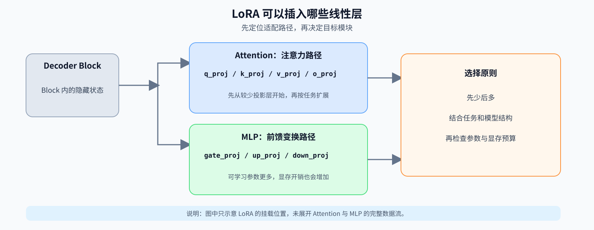
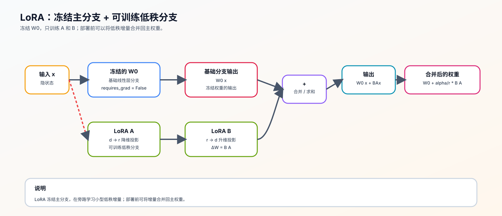

# 10. LoRA Tutorial | LoRA 教程

**难度：** Medium | **环境：** CPU-first | **标签：** `训练微调`, `LoRA`, `PEFT` | **目标人群：** 训练机制学习者

> 🚀 **云端运行环境**
>
> 本章节的实战代码可以点击以下链接在免费 GPU 算力平台上直接运行：
>
> [](https://colab.research.google.com/github/datawhalechina/llm-algo-leetcode/blob/main/02_PyTorch_Algorithms/10_LoRA_Tutorial.ipynb)
> [](https://modelscope.cn/my/mynotebook) *(国内推荐：魔搭社区免费实例)*


---

## 本节导读

大模型微调最直接的做法是更新全部参数，但这会把显存压力迅速放大：除了模型权重，还要保存梯度和优化器状态。很多场景里，我们真正需要的不是重写整个模型，而是在已有能力上做小幅适配。

LoRA 的思路就是冻结原始权重，只在旁边加一条低秩可训练旁路。SFT 描述的是监督训练范式，LoRA 描述的是参数更新方法，二者可以组合成 LoRA SFT。这一节在训练微调路线里承接 `09`：`09` 讲清 SFT 的样本、监督范围和 loss 对齐，`10` 再讲 LoRA 如何改变参数更新方式。学完这里，后面再看 `13` 和 `60` 时，你会更容易把 `target modules / r / alpha / dropout` 这些选择放回完整实验和项目交付里。

**关键词：** `LoRA`, `PEFT`, `adapter`, `target modules`

---
## 前置阅读

**导语：** 先把模型封装、优化器和最小训练闭环补齐，再看 LoRA 如何只训练一小部分参数。
- [P0: 09. PyTorch nn.Module Basics | nn.Module 基础](../00_Prerequisites/09_PyTorch_nn_Module_Basics.md)
- [P0: 11. PyTorch Optimizers and Loss | 优化器与损失](../00_Prerequisites/11_PyTorch_Optimizers_and_Loss.md)
- [P0: 13. Simple Neural Network Training | 简单神经网络训练](../00_Prerequisites/13_Simple_Neural_Network_Training.md)

## 相关阅读

**导语：** 理解 LoRA 的低秩旁路后，下一步最自然的是看它怎样进入端到端微调、4-bit 微调和项目化验证。
- [13. End-to-End Fine-Tuning Experiment | 端到端微调实验](../02_PyTorch_Algorithms/13_End_to_End_Fine_Tuning_Experiment.md)
- [26. QLoRA and 4bit Quantization | QLoRA 与 4-bit 量化](../02_PyTorch_Algorithms/26_QLoRA_and_4bit_Quantization.md)
- [60. LoRA Fine-Tuning Project | LoRA 微调项目](../02_PyTorch_Algorithms/60_LoRA_Fine_Tuning_Project.md)
- [63. LoRA Variants Benchmark | LoRA 变体基准对比](../02_PyTorch_Algorithms/63_LoRA_Variants_Benchmark.md)
  
---
### Step 1: 核心思想与痛点

全参微调会更新模型中的全部参数。训练时，GPU 不仅要保存模型权重，还要保存梯度、优化器状态和中间激活，因此模型越大，训练显存压力越高。

LoRA 的基本做法是冻结原始模型，只在部分 `Linear`（线性层）旁边增加少量可训练参数。这里的重点不是立即计算低秩矩阵，而是先确定 LoRA 应该接入模型的哪条路径。

在 Transformer 的一个重复计算单元（block）中，常见挂载位置包括：

| 位置 | 常见 target modules（目标模块） | 作用 | 选择建议 |
|:---|:---|:---|:---|
| Attention | `q_proj`, `v_proj` | 查询和值投影，调整注意力路径 | 适合作为入门起点 |
| Attention | `q_proj`, `k_proj`, `v_proj`, `o_proj` | 查询、键、值和输出投影，更完整地适配注意力路径 | 任务需要更强适配时使用 |
| MLP | `gate_proj`, `up_proj`, `down_proj` | 逐 token 的前馈表示变换 | 需要增加可学习参数时考虑 |

下面的结构图先标出这些投影层在 Decoder Block 中的位置；低秩分支的矩阵形状和初始化规则放到 Step 2。



<div align="center"><strong>LoRA 挂载位置：</strong> Attention 和 MLP 中的线性投影都可以作为适配入口，具体选择需要结合任务和预算。</div>

### Step 2: LoRA 结构、参数与初始化

先把 LoRA 看成一个普通的 PyTorch 模块：它保留冻结的线性层作为主分支，再并排放入两个很小的可训练矩阵 A 和 B。A 通常用 Kaiming 均匀分布或高斯分布初始化，而 B 严格初始化为零，以保证训练开始时 $\Delta W = B A \approx 0$，模型输出基本等于冻结基座的输出。

先从结构和参数状态确认 LoRA 是否正确接入，再理解几个控制适配规模的参数：

- base linear weight 已冻结。
- 只有 `lora_A / lora_B` 参与训练。
- `lora_A` 的形状为 `[r, in_features]`，`lora_B` 的形状为 `[out_features, r]`。
- 可训练参数量等于 `r * (in_features + out_features)`。
- `r` 是低秩维度，`alpha / r` 控制旁路更新的缩放；`dropout` 只作用在 LoRA 分支输入上。



<div align="center"><strong>LoRA 旁路结构：</strong> 主分支保留冻结权重，低秩分支负责学习增量。</div>

### Step 3: 前向计算与权重合并

LoRA 前向时有两条路径：输入 `x` 一条进入冻结的主线性层，另一条经过 LoRA 的低秩分支。代码中的行向量路径是：`x → x @ A.T → @ B.T → * (alpha / r)`，最后把这条增量加到主分支输出。

这对应数学表达式：
$$ h = W_0 x + \Delta W x = W_0 x + \frac{\alpha}{r} B A x $$
其中 $A$ 将输入维度压到 $r$，$B$ 再将它恢复到输出维度；Step 2 已经说明了矩阵形状和缩放参数。

部署时可以把低秩增量一次性合并到主权重：
$$ W_{\text{merged}} = W_0 + \frac{\alpha}{r} B A $$
合并后，计算图不再执行 A、B 两个旁路矩阵乘法；实际延迟仍取决于权重合并、数值误差和框架实现。

### Step 4: 动手实战

**要求**：本节用单个 `LoRALinear` 讲清低秩旁路；后面的项目页再把它放回完整模型和训练报告里。请补全下方 `LoRALinear` 的初始化、前向传播和合并权重的 `TODO` 逻辑，并让 merge 操作可以安全地重复调用。

额外检查点：实现后要能统计 LoRA 的可训练参数量，确认梯度只流向 A/B，验证 merge 前后的输出一致，并通过形状、参数边界和 dropout 状态检查。本 Step 验证的是 LoRA 线性层机制，完整任务训练和项目报告在 60 节展开。


```python
import torch
import torch.nn as nn
import math
```


```python
def count_trainable_parameters(module: nn.Module) -> int:
    """统计模块中 requires_grad=True 的参数数量。"""
    return sum(p.numel() for p in module.parameters() if p.requires_grad)


class LoRALinear(nn.Module):
    """在线性层旁路中加入可训练低秩增量的 LoRA 模块。"""
    def __init__(self, in_features: int, out_features: int, r: int = 8, lora_alpha: int = 16, lora_dropout: float = 0.0):
        """冻结基础线性层，只训练低秩 LoRA 旁路。"""
        super().__init__()
        if in_features <= 0 or out_features <= 0:
            raise ValueError('in_features 和 out_features 必须为正数')
        if r <= 0:
            raise ValueError('r 必须为正数')
        if lora_dropout < 0.0 or lora_dropout > 1.0:
            raise ValueError('lora_dropout 必须位于 [0, 1]')
        self.r = r
        self.lora_alpha = lora_alpha
        self.scaling = self.lora_alpha / self.r
        self.lora_dropout = nn.Dropout(lora_dropout)
        self.merged = False  # 记录 LoRA 增量是否已合并到主权重
        
        # ==========================================
        # 主权重冻结，只让低秩旁路参与训练。
        # TODO 1: 初始化主权重和 LoRA 矩阵
        # ==========================================
        # self.linear = ???
        # self.linear.weight.requires_grad = ???
        # self.lora_A = ???
        # self.lora_B = ???
        # 提示：lora_A 形状为 [r, in_features]，lora_B 形状为 [out_features, r]
        #pass
        self.reset_parameters()

    def reset_parameters(self):
        """按基础层和 LoRA 旁路各自的规则初始化参数。"""
        # ==========================================
        # 主权重和 LoRA 旁路分别按各自规则初始化。
        # TODO 2: 初始化权重
        # ==========================================
        # nn.init.kaiming_uniform_(???)
        # nn.init.kaiming_uniform_(???)
        # nn.init.zeros_(???)
        pass
        

    def forward(self, x: torch.Tensor) -> torch.Tensor:
        """计算基础线性层输出，并在未 merge 时叠加 LoRA 增量。"""
        # ==========================================
        # 先走主分支，再叠加低秩旁路的增量。
        # TODO 3: 实现前向传播
        # 1. 计算主权重的输出
        # 2. 对 LoRA 分支输入应用 dropout
        # 3. 计算 LoRA 分支的输出（先降维再升维，最后乘以缩放因子）
        # 4. 将两者相加；如果 self.merged 为 True，直接返回主线性层结果
        # ==========================================
        # result = ???
        # dropped = ???
        # lora_out = ???
        # 如果 self.merged：直接 return self.linear(x)，不要再次计算 LoRA 分支
        return result

    def merge_weights(self):
        """将 LoRA 增量合并到基础权重，并保证重复调用安全。"""
        # ==========================================
        # TODO 4: 合并权重
        # 提示：只在 self.merged=False 时，在 no_grad 环境下将
        # (lora_B @ lora_A) * scaling 加到主权重，并更新状态；使用 no_grad 和 add_。
        # ==========================================
        # if not self.merged:
        #     with torch.no_grad():
        #         self.linear.weight.add_(???)
        #     self.merged = True
        pass

```


```python
# 运行此单元格以测试你的实现
def test_lora():
    try:
        in_dim, out_dim = 128, 256
        batch_size, seq_len = 32, 10
        layer = LoRALinear(in_dim, out_dim, r=8, lora_alpha=16, lora_dropout=0.0)

        x = torch.randn(batch_size, seq_len, in_dim)

        # 1. 验证初始化导致 B 全零，所以初始输出等于冻结权重的输出
        with torch.no_grad():
            out_lora = layer(x)
            out_base = layer.linear(x)
            assert torch.allclose(out_lora, out_base), "初始化错误: lora_B 未被初始化为 0"

        # 2. 验证只训练 LoRA 参数
        expected_trainable = 8 * (in_dim + out_dim)
        assert not layer.linear.weight.requires_grad, "主权重应该被冻结"
        assert count_trainable_parameters(layer) == expected_trainable, "LoRA 可训练参数量统计错误"
        assert layer.lora_A.shape == (8, in_dim), "lora_A 形状错误"
        assert layer.lora_B.shape == (out_dim, 8), "lora_B 形状错误"

        # 2b. 反向传播只应为 LoRA 参数产生梯度。
        layer(x).sum().backward()
        assert layer.lora_A.grad is not None, "lora_A 应该获得梯度"
        assert layer.lora_B.grad is not None, "lora_B 应该获得梯度"
        assert layer.linear.weight.grad is None, "冻结主权重不应该获得梯度"

        # 3. 模拟训练一步，改变 B 的值
        with torch.no_grad():
            layer.lora_B.normal_(0, 0.02)

        out_trained = layer(x)
        assert not torch.allclose(out_trained, out_base), "前向传播错误: 旁路未能注入梯度值"

        # 3b. 用显式公式核对降维、升维和 alpha / r 缩放。
        with torch.no_grad():
            manual = layer.linear(x) + (x @ layer.lora_A.T) @ layer.lora_B.T * layer.scaling
        assert torch.allclose(out_trained, manual, atol=1e-6), "LoRA 前向公式或缩放实现错误"

        # 4. 验证合并权重的正确性
        layer.eval()
        out_trained = layer(x)
        layer.merge_weights()
        out_merged = layer(x)
        assert layer.merged, "merge 后应记录 merged 状态"
        assert torch.allclose(out_trained, out_merged, atol=1e-5), "权重合并错误: 合并后的输出与分离时的输出不一致！"

        # 重复调用 merge 不应再次叠加同一个 LoRA 增量。
        merged_weight = layer.linear.weight.detach().clone()
        layer.merge_weights()
        assert torch.allclose(layer.linear.weight, merged_weight), "重复 merge 改变了主权重"

        # 5. 参数边界应给出明确错误，而不是在后续计算中失败。
        for kwargs in ({'r': 0}, {'lora_dropout': 1.1}):
            try:
                LoRALinear(in_dim, out_dim, **kwargs)
            except ValueError:
                pass
            else:
                raise AssertionError("非法参数没有触发 ValueError")

        # 6. dropout 只影响未 merge 的 LoRA 分支，eval 模式应保持确定性。
        dropout_layer = LoRALinear(in_dim, out_dim, r=4, lora_dropout=0.5)
        with torch.no_grad():
            dropout_layer.lora_B.normal_(0, 0.02)
        dropout_layer.eval()
        assert torch.allclose(dropout_layer(x), dropout_layer(x)), "eval 模式输出应保持稳定"
        dropout_layer.train()
        assert not torch.allclose(dropout_layer(x), dropout_layer(x)), "train 模式应启用 LoRA dropout"

        print("\n✅ All Tests Passed! LoRA 核心算子、参数统计和 merge 逻辑实现正确。")

    except NotImplementedError:
        print("请先完成 TODO 部分的代码！")
        raise
    except (AttributeError, NameError, TypeError, ValueError) as e:
        print("代码可能未完成，导致变量未定义" if isinstance(e, NameError) else "代码可能未完成，导致了类型错误")
        raise NotImplementedError("请先完成 TODO 部分的代码！") from e
    except AssertionError as e:
        print(f"❌ 测试失败: {e}")
        raise NotImplementedError("请先完成 TODO 部分的代码！") from e
    except Exception as e:
        print(f"❌ 发生异常: {e}")
        raise

test_lora()

```

---

🛑 **STOP HERE** 🛑
<br><br><br><br><br><br><br><br><br><br>
> 请先尝试自己完成代码并跑通测试。<br>
> 如果你正在 Colab 中运行，并且遇到困难没有思路，可以向下滚动查看参考答案。
<br><br><br><br><br><br><br><br><br><br>

---
## 参考代码与解析

### 代码


```python
def count_trainable_parameters(module: nn.Module) -> int:
    """统计模块中 requires_grad=True 的参数数量。"""
    return sum(p.numel() for p in module.parameters() if p.requires_grad)


class LoRALinear(nn.Module):
    """在线性层旁路中加入可训练低秩增量的 LoRA 模块。"""
    def __init__(self, in_features: int, out_features: int, r: int = 8, lora_alpha: int = 16, lora_dropout: float = 0.0):
        super().__init__()
        if in_features <= 0 or out_features <= 0:
            raise ValueError('in_features 和 out_features 必须为正数')
        if r <= 0:
            raise ValueError('r 必须为正数')
        if lora_dropout < 0.0 or lora_dropout > 1.0:
            raise ValueError('lora_dropout 必须位于 [0, 1]')
        self.r = r
        self.lora_alpha = lora_alpha
        self.scaling = self.lora_alpha / self.r
        self.lora_dropout = nn.Dropout(lora_dropout)
        self.merged = False
        
        # TODO 1: 初始化主权重和 LoRA 矩阵
        self.linear = nn.Linear(in_features, out_features, bias=False)
        self.linear.weight.requires_grad = False
        
        self.lora_A = nn.Parameter(torch.empty(r, in_features))
        self.lora_B = nn.Parameter(torch.empty(out_features, r))
        
        self.reset_parameters()

    def reset_parameters(self):
        """按基础层和 LoRA 旁路各自的规则初始化参数。"""
        # TODO 2: 初始化权重
        nn.init.kaiming_uniform_(self.linear.weight, a=math.sqrt(5))
        nn.init.kaiming_uniform_(self.lora_A, a=math.sqrt(5))
        nn.init.zeros_(self.lora_B)

    def forward(self, x: torch.Tensor) -> torch.Tensor:
        """计算基础线性层输出，并在未 merge 时叠加 LoRA 增量。"""
        # TODO 3: 实现前向传播
        result = self.linear(x)
        if self.merged:
            return result
        dropped = self.lora_dropout(x)
        lora_out = (dropped @ self.lora_A.T) @ self.lora_B.T * self.scaling
        result += lora_out
        return result

    def merge_weights(self):
        """将 LoRA 增量合并到基础权重，并保证重复调用安全。"""
        # TODO 4: 合并权重
        if not self.merged:
            with torch.no_grad():
                self.linear.weight.add_((self.lora_B @ self.lora_A) * self.scaling)
            self.merged = True

```

### 解析

本题用一个最小 `LoRALinear` 验证四件事：基础权重冻结、A/B 旁路可训练、低秩增量参与前向，以及 merge 后计算结果保持一致。

**1. TODO 1：初始化主权重和 LoRA 矩阵**

- **主权重冻结**：`self.linear.weight.requires_grad = False` 是 LoRA 的核心，确保预训练权重不参与梯度计算，只更新 A 和 B。
- **LoRA 矩阵形状**：
  - `lora_A`: `[r, in_features]` - 降维矩阵
  - `lora_B`: `[out_features, r]` - 升维矩阵

**2. TODO 2：初始化参数**
- **初始化规则**：
  - `lora_A`: 使用 Kaiming 初始化，提供随机性
  - `lora_B`: **本实现将它初始化为全 0**，确保训练开始时 $\Delta W = BA = 0$，即 LoRA 模块的初始输出与冻结基础层一致
- **参数量对比**：原始权重 `[out_features, in_features]`，LoRA 参数 `r * (in_features + out_features)`。当 `r << min(in_features, out_features)` 时，参数量大幅减少。

**3. TODO 3：前向传播与缩放**

- **实现方式**：
  ```python
  result = self.linear(x)
  dropped = self.lora_dropout(x)
  lora_out = (dropped @ self.lora_A.T) @ self.lora_B.T * self.scaling
  result += lora_out
  ```
- **数学公式**：$h = W_0 x + \frac{\alpha}{r} B A x$。代码使用批量行向量，所以写成 `(x @ A.T) @ B.T`。
- **缩放因子**：`scaling = lora_alpha / r`，通常 `lora_alpha = 16`，`r = 8`，则 `scaling = 2`。
- **dropout 位置**：dropout 只作用在 LoRA 分支输入上，帮助小数据微调时减少过拟合；推理和 merge 前要切到 `eval()`。
- **计算顺序**：先 `x @ A^T` 降维到 `[..., r]`，再 `@ B^T` 升维到 `[..., out_features]`，最后乘以 `scaling`。

**4. TODO 4：合并权重与部署计算**

- **实现方式**：在 `torch.no_grad()` 中使用 `self.linear.weight.add_((self.lora_B @ self.lora_A) * self.scaling)`。
- **核心原理**：由于 $h = W x + B A x = (W + B A)x$，可以直接将 $BA$ 加到 $W$ 中。
- **合并后的计算**：合并后不再执行 LoRA 分支的额外矩阵乘法；实际延迟仍取决于权重合并、数值误差和框架实现。
- **部署提醒**：merge 前应切到 `eval()`，避免 dropout 造成 merge 前后输出不一致；用 `merged` 状态避免重复合并，合并后通常不再继续训练这个 LoRA 分支。

**工程要点**

- **target modules**：入门常选 `q_proj / v_proj`，更完整的注意力适配会覆盖 `q_proj / k_proj / v_proj / o_proj`，需要更强容量时再扩展到 `gate_proj / up_proj / down_proj`。
- **rank 选择**：`r=8` 通常足够做入门和小任务，`r=16` 可能带来边际提升，`r=32` 以上收益递减且更容易过拟合。
- **alpha 选择**：常见设置是 `alpha = r` 或 `alpha = 2r`。过大可能让 LoRA 更新过强，过小则适配能力不足。
- **dropout 选择**：小数据或格式容易过拟合时可以加 `0.05-0.1`；数据足够多或追求稳定对齐时可以设为 `0.0`。
- **参数统计**：项目报告里至少记录 base 参数量、trainable 参数量和 trainable ratio，证明当前实验真的只训练 LoRA adapter。
- **测试边界**：测试区还检查 A/B 形状、梯度归属、非法参数和 dropout 的 train/eval 行为；这些检查用于确认实现状态正确，不代表完整模型训练效果。
- **多任务切换**：可以为不同任务训练不同的 A/B 矩阵，推理时动态加载，实现“一个基座模型 + 多个 LoRA 适配器”。
