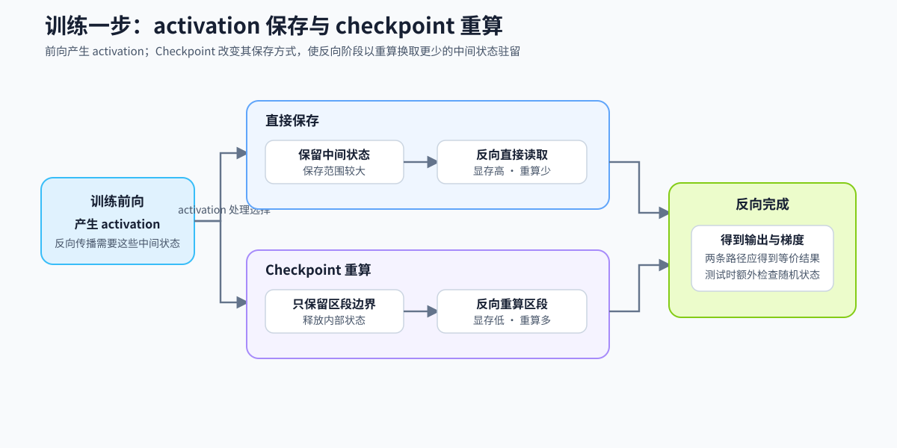
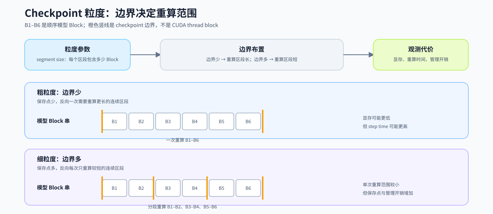

# 19. Activation Checkpointing | 激活检查点

**难度：** Hard | **环境：** CPU-first（机制验证）

> 🚀 **云端运行环境**
>
> 本章节的实战代码可以点击以下链接在免费 GPU 算力平台上直接运行：
>
> [](https://colab.research.google.com/github/datawhalechina/llm-algo-leetcode/blob/main/02_PyTorch_Algorithms/19_Activation_Checkpointing.ipynb)
> [](https://modelscope.cn/my/mynotebook) *(国内推荐：魔搭社区免费实例)*

**标签：** `显存优化`, `激活值`, `Checkpointing` | **目标人群：** 显存优化学习者

---

## 本节导读

训练大模型时，参数只是显存账本的一部分；随着训练规模和上下文长度变化，计算过程中产生的中间状态也会形成资源压力。本节从“反向传播需要哪些中间状态”这个问题出发，带你观察直接保存与重算分别改变了什么代价。

本节将沿着一次训练的前向—反向链路，比较“直接保存 activation”和“保存边界、反向重算”两条路径。你会用输出、梯度与重算次数判断实现是否正确，再在 Step 5 中观察显存—时间交换；统一汇总各类训练状态的账本留到 43 节。

**关键词：** `activation checkpointing`, `recompute`

## 前置阅读

**导语：** 阅读本节前，先确认你能说清一次训练中前向、loss 与 backward 的关系，以及 activation 为什么会在反向阶段被使用；随后再把“保存 activation”的需要转化为“保存边界、按需重算”的实现问题。

- [18. Activation and Loss Backward | 激活与损失反向](../02_PyTorch_Algorithms/18_Activation_and_Loss_Backward.md)：理解 activation 如何参与 loss 的反向传播。
- [P0: 13. Simple Neural Network Training | 简单神经网络训练循环](../00_Prerequisites/13_Simple_Neural_Network_Training.md)：若训练循环还不熟悉，先回顾前向、loss、backward 与参数更新的顺序。
---

### Step 1: Checkpoint 如何改变训练激活的处理路径

一次训练步骤先执行前向计算，再执行反向传播。前向会产生 activation，反向需要利用这些中间状态计算梯度；当序列长度、batch 或层数增加时，activation 可能成为显存压力来源。Activation checkpointing（激活检查点，下文简称 checkpoint）是前向阶段的保存策略：它将“保留区段内部 activation”改为“保留边界、在反向时重算区段”，以额外计算换取更少的 activation 驻留。

本节将顺序模型拆成连续的模型 Block：它是可顺序执行的计算单元，例如 [05. LLaMA3 Block Tutorial](../02_PyTorch_Algorithms/05_LLaMA3_Block_Tutorial.md) 中的 Transformer Decoder Layer，而不是 CUDA thread block。以 `h0 → Block 1 → h1 → Block 2 → h2 → Block 3 → h3` 为例，普通路径会保留 `h1`、`h2` 等中间 activation；若将 `Block 1–2` 划为一个 checkpoint segment，前向保留进入区段的 `h0` 等必要边界，反向需要内部 activation 时便从 `h0` 重跑 `Block 1–2`。

| 比较阶段 | 普通保存路径 | Checkpoint 路径 | 主要观察量 |
| --- | --- | --- | --- |
| 前向阶段 | 保存区段内部的中间状态 | 只保存重算所需的区段边界 | activation 驻留量与 peak memory |
| 反向阶段 | 直接读取已保存的中间状态 | 重新执行区段前向，再读取重算结果 | 重算次数、step time 与吞吐 |
| 机制验证 | 输出和梯度作为比较基线 | 输出和梯度应与普通路径一致 | 输出、输入梯度、参数梯度与随机状态 |



### Step 2: 为什么重算后仍应得到相同梯度
进入反向时，checkpoint 会从已保存的区段边界重新执行该段前向。例如上一节的 `Block 1–2` 区段会从 `h0` 重跑，重新得到 `h1`、`h2`，再用于后续梯度计算。要得到等价梯度，重算必须重放与原前向等价的计算上下文。

随机层说明了这条条件为何必要：若 `Block 1–2` 内包含 Dropout，而重算时使用了不同的随机状态，新的 activation 就可能不同，随后得到的梯度也不再能与普通路径对齐。外部副作用同样会破坏这项前提。

| 一致性对象 | 重算时必须保持什么 | 未保持时可能出现什么 | 本节如何验证 |
| --- | --- | --- | --- |
| 区段输入与执行顺序 | 从同一边界状态按相同 Block 顺序重跑 | 重算 activation 偏离原前向 | 比较输出与输入梯度 |
| 参数与随机状态 | 使用相同参数；随机层恢复对应随机状态 | Dropout 等随机结果变化，梯度失配 | 比较参数梯度；检查随机状态 |
| 无外部副作用 | 不读取两次执行之间可能变化的外部状态 | 第二次执行产生不同结果 | 将重算函数保持为可重放的前向计算 |

### Step 3: 检查点边界与粒度如何影响结果

checkpoint 为一段前向计算建立重算边界：前向阶段保留边界输入和必要状态，反向阶段重新执行区段内部的前向，再继续计算梯度。一个或多个连续模型 Block 可以组成 checkpoint segment，`segment_size` 控制每段包含多少个 Block；例如 `num_blocks=5`、`segment_size=2` 时，边界计划为 `[(0, 2), (2, 4), (4, 5)]`，最后一个尾段只含一个 Block。

下面的比较只说明执行组织方式：粒度不会给出固定的显存节省比例。参数、梯度和 optimizer state 仍在训练账本中，实际收益必须在固定模型、输入形状和运行环境下测量。

| `segment_size` 取值 | 5 个模型 Block 时的计划 | 改变的执行方式 | 需要实际测量的结果 |
| --- | --- | --- | --- |
| `1` | `[(0, 1), (1, 2), …, (4, 5)]` | 每个 Block 单独成段，接近逐 Block checkpoint | peak memory、重算次数与 step time |
| `2` | `[(0, 2), (2, 4), (4, 5)]` | 两个连续 Block 为一段，保留尾段 | 与 `1` 的显存—时间交换 |
| `≥ 5` | `[(0, 5)]` | 全部 Block 成一个区段，单次重算范围更大 | 是否仍满足显存与时间预算 |



### Step 4：实现 checkpoint 路径并验证

现在把前面的重算机制落实为三步：先为单个 Block 建立 checkpoint 路径，再规划连续 Block 的 segment 边界，最后将该边界计划用于分段 checkpoint。题目区只要求补全这三处机制；闭包绑定、普通前向 baseline 和循环骨架已提供。

| 函数 | 学习者完成的机制 | 必须满足的约束 | 测试证据 |
| --- | --- | --- | --- |
| `run_with_checkpointing` | TODO 1：为当前 Block 应用 checkpoint | 输入为当前 `x`；使用 `use_reentrant=False` | 输出、输入梯度与参数梯度一致；反向阶段的 Block 调用次数增加 |
| `build_checkpoint_segments` | TODO 2：生成 segment 边界 | `[start, end)` 连续、不重叠、覆盖尾段；非法粒度报错 | 尾段、空序列、`segment_size=1` 与非法输入 |
| `run_with_segment_checkpointing` | TODO 3：对当前 segment 应用 checkpoint | 使用已绑定的 `segment_forward`；更新当前 `x` | 分段路径与 baseline 一致；`segment_size=1` 等价于逐 Block 路径 |


```python
import torch
import torch.nn as nn
from torch.utils.checkpoint import checkpoint
```


```python
class SimpleTransformerBlock(nn.Module):
    """提供前向 activation 的简化残差 FFN Block。

    本节只借它观察 activation 的保存与重算，不代表完整 Transformer Block。
    """
    def __init__(self, dim):
        super().__init__()
        self.ffn = nn.Sequential(
            nn.Linear(dim, dim * 4),
            nn.ReLU(),
            nn.Linear(dim * 4, dim)
        )
        self.norm = nn.LayerNorm(dim)
        
    def forward(self, x):
        # out 代表反向传播可能需要读取的区段内部 activation。
        out = self.ffn(self.norm(x))
        return x + out

def run_without_checkpointing(blocks: nn.ModuleList, x: torch.Tensor) -> torch.Tensor:
    """普通前向 baseline，不使用 checkpoint 按顺序执行所有 Block。

    与两条 checkpoint 路径保持相同输入和输出接口，作为输出与梯度对照。

    Args:
        blocks: 按顺序排列、可接收隐藏状态的 Block 列表。
        x: 输入隐藏状态，形状通常为 [batch, seq, dim]，需与 Block 维度兼容。

    Returns:
        所有 Block 执行后的隐藏状态。
    """
    for block in blocks:
        x = block(x)
    return x

def run_with_checkpointing(blocks: nn.ModuleList, x: torch.Tensor) -> torch.Tensor:
    """对每个 Block 单独启用梯度 checkpoint。

    Args:
        blocks: 按顺序排列、可接收隐藏状态的 Block 列表。
        x: 输入隐藏状态，形状通常为 [batch, seq, dim]；测试中令其参与梯度计算。

    Returns:
        经过逐 Block checkpoint 的输出隐藏状态。

    Note:
        使用 use_reentrant=False；区段内部 activation 会在反向阶段按需重算。
    """
    for block in blocks:
        # TODO 1：让当前 Block 通过 checkpoint 执行，并将新的隐藏状态写回 x。
        # 输入隐藏状态：x；被包装函数：block；必须使用 use_reentrant=False。
        # x = ???
        raise NotImplementedError("TODO 1：请用 checkpoint 更新 x")
    return x

def build_checkpoint_segments(num_blocks: int, segment_size: int) -> list[tuple[int, int]]:
    """将 checkpoint 粒度转换为可执行的连续区间计划。

    区间覆盖 `[0, num_blocks)` 且不重叠；分段路径据此确定保存边界和重算范围。

    Args:
        num_blocks: 连续模型 Block 的总数（例如 Transformer Block 层数），不是 CUDA thread block；必须非负。
        segment_size: 每个 checkpoint segment 覆盖的连续模型 Block 数，必须为正。

    Returns:
        `(start, end)` 列表；当 `num_blocks=0` 时为空，尾段仍被保留。
    """
    if num_blocks < 0:
        raise ValueError("num_blocks must be non-negative")
    if segment_size <= 0:
        raise ValueError("segment_size must be positive")

    # TODO 2：生成覆盖 [0, num_blocks) 的半开区间。
    # ranges 中的区间必须连续、不重叠，并覆盖尾段。
    # ranges = ???
    raise NotImplementedError("TODO 2：请生成 ranges")
    return ranges

def run_with_segment_checkpointing(
    blocks: nn.ModuleList, x: torch.Tensor, segment_size: int = 2
) -> torch.Tensor:
    """按 segment 边界计划对连续 Block 启用 checkpoint。

    每个区段使用已绑定的 `segment_forward`；`segment_size` 改变保存边界和单次重算范围。

    Args:
        blocks: 按顺序排列、可接收隐藏状态的 Block 列表。
        x: 输入隐藏状态，形状通常为 [batch, seq, dim]，需与 Block 维度兼容。
        segment_size: 每个 checkpoint segment 覆盖的连续模型 Block 数，必须为正；
            默认值 2 仅用于演示分段与尾段：5 个 Block 会得到 `(0, 2)`、`(2, 4)`、`(4, 5)`；
            它不是通用性能推荐，最后一个 segment 可以不足该大小。

    Returns:
        经过分段 checkpoint 的输出隐藏状态。

    Note:
        `segment_size=1` 对应逐 Block 粒度；更大的值会扩大单次重算范围。
    """
    if segment_size <= 0:
        raise ValueError("segment_size must be positive")

    for start, end in build_checkpoint_segments(len(blocks), segment_size):
        segment = blocks[start:end]

        # 当前 segment 已通过默认参数绑定，避免反向重算时读取后续循环的区段。
        def segment_forward(hidden, blocks=segment):
            return run_without_checkpointing(blocks, hidden)


        # TODO 3：对当前 segment 的前向函数应用 checkpoint，并更新 x。
        # 输入隐藏状态：x；被包装函数：segment_forward；必须使用 use_reentrant=False。
        # x = ???
        raise NotImplementedError("TODO 3：请对 segment_forward 应用 checkpoint")
    return x

```

### 测试

运行下方 CPU 机制测试，检查 segment 边界、checkpoint 路径与普通路径的结果和梯度一致性，以及 backward 是否确实发生重算。GPU 显存与时间测量见 Step 5。

```python
# 各路径使用初始权重相同但彼此独立的 Block 副本，避免比较受到状态共享影响。
import copy

class CountingBlock(SimpleTransformerBlock):
    """记录 forward 次数，以区分普通前向与反向重算。"""
    def __init__(self, dim):
        super().__init__(dim)
        self.forward_calls = 0

    def forward(self, x):
        self.forward_calls += 1
        return super().forward(x)

def _forward_calls(blocks):
    return sum(block.forward_calls for block in blocks)

def _parameter_grads(blocks):
    return [parameter.grad.detach().clone() for parameter in blocks.parameters()]

def _run_and_collect(runner, blocks, x):
    """运行一条路径并收集数值、梯度与重算证据。

    使用 `output.sum()` 仅为统一构造反向传播，不代表训练 loss。
    """
    output = runner(blocks, x)
    calls_before_backward = _forward_calls(blocks)
    output.sum().backward()
    return {
        "output": output.detach(),
        "input_grad": x.grad.detach().clone(),
        "parameter_grads": _parameter_grads(blocks),
        "calls_before_backward": calls_before_backward,
        "calls_after_backward": _forward_calls(blocks),
    }

def _assert_matches_baseline(label, baseline, checkpoint_evidence):
    assert torch.allclose(baseline["output"], checkpoint_evidence["output"], atol=1e-5, rtol=1e-4), \
        f"{label}：输出与 baseline 不一致"
    assert torch.allclose(baseline["input_grad"], checkpoint_evidence["input_grad"], atol=1e-5, rtol=1e-4), \
        f"{label}：输入梯度与 baseline 不一致"
    assert len(baseline["parameter_grads"]) == len(checkpoint_evidence["parameter_grads"]), \
        f"{label}：参数数量与 baseline 不一致"
    for baseline_grad, checkpoint_grad in zip(baseline["parameter_grads"], checkpoint_evidence["parameter_grads"]):
        assert torch.allclose(baseline_grad, checkpoint_grad, atol=1e-5, rtol=1e-4), \
            f"{label}：参数梯度与 baseline 不一致"

def _assert_recomputed(label, evidence):
    assert evidence["calls_after_backward"] > evidence["calls_before_backward"], \
        f"{label}：backward 中没有重新执行 Block"

def _assert_segment_plan(num_layers):
    expected_two_block_segments = [
        (start, min(start + 2, num_layers)) for start in range(0, num_layers, 2)
    ]
    assert build_checkpoint_segments(num_layers, segment_size=2) == expected_two_block_segments, \
        "segment 边界应覆盖尾段且不重叠"
    assert build_checkpoint_segments(num_layers, segment_size=1) == [(i, i + 1) for i in range(num_layers)]
    assert build_checkpoint_segments(num_layers, segment_size=num_layers + 1) == [(0, num_layers)]
    assert build_checkpoint_segments(0, segment_size=2) == []
    for invalid_num_blocks, invalid_segment_size in [(num_layers, 0), (-1, 2)]:
        try:
            build_checkpoint_segments(invalid_num_blocks, invalid_segment_size)
        except ValueError:
            continue
        raise AssertionError("非法 segment 参数应被拒绝")

def test_activation_checkpointing_mechanism():
    torch.manual_seed(42)
    dim = 128
    num_layers = 5  # 特意让最后一个 segment 不完整
    _assert_segment_plan(num_layers)

    template_blocks = nn.ModuleList([CountingBlock(dim) for _ in range(num_layers)])
    x_template = torch.randn(2, 32, dim)
    normal_blocks = copy.deepcopy(template_blocks)
    baseline = _run_and_collect(
        run_without_checkpointing, normal_blocks, x_template.detach().clone().requires_grad_(True)
    )
    assert baseline["calls_after_backward"] == num_layers, \
        "普通路径不应在 backward 中重算 Block"

    checkpoint_paths = {
        "逐 Block checkpoint": (run_with_checkpointing, copy.deepcopy(template_blocks)),
        "分段 checkpoint": (
            lambda blocks, x: run_with_segment_checkpointing(blocks, x, segment_size=2),
            copy.deepcopy(template_blocks),
        ),
        "细粒度 segment": (
            lambda blocks, x: run_with_segment_checkpointing(blocks, x, segment_size=1),
            copy.deepcopy(template_blocks),
        ),
        "单段 checkpoint": (
            lambda blocks, x: run_with_segment_checkpointing(blocks, x, segment_size=num_layers + 1),
            copy.deepcopy(template_blocks),
        ),
    }

    evidence = {}
    for label, (runner, blocks) in checkpoint_paths.items():
        evidence[label] = _run_and_collect(
            runner, blocks, x_template.detach().clone().requires_grad_(True)
        )
        assert evidence[label]["calls_before_backward"] == num_layers, \
            f"{label}：前向阶段不应重复执行 Block"
        _assert_matches_baseline(label, baseline, evidence[label])
        _assert_recomputed(label, evidence[label])

    _assert_matches_baseline("segment_size=1 与逐 Block 路径", evidence["逐 Block checkpoint"], evidence["细粒度 segment"])
    print("✅ CPU mechanism 测试通过：边界、输出、输入/参数梯度与 backward 重算均符合预期。")

def run_checkpointing_test():
    try:
        test_activation_checkpointing_mechanism()

    except NotImplementedError:
        print("请先完成 TODO 部分的代码！")
        raise
    except Exception as e:
        print(f"❌ 实现或机制测试失败: {e}")
        raise


run_checkpointing_test()

```

---

🛑 **STOP HERE** 🛑
<br><br><br><br><br><br><br><br><br><br>
> 请先尝试自己完成代码并跑通测试。<br>
> 如果你正在 Colab 中运行，并且遇到困难没有思路，可以向下滚动查看参考答案。
<br><br><br><br><br><br><br><br><br><br>

---
## 参考代码与解析

### 代码

```python
import torch
import torch.nn as nn
from torch.utils.checkpoint import checkpoint

class SimpleTransformerBlock(nn.Module):
    """提供前向 activation 的简化残差 FFN Block。

    本节只借它观察 activation 的保存与重算，不代表完整 Transformer Block。
    """
    def __init__(self, dim):
        super().__init__()
        self.ffn = nn.Sequential(
            nn.Linear(dim, dim * 4),
            nn.ReLU(),
            nn.Linear(dim * 4, dim)
        )
        self.norm = nn.LayerNorm(dim)
        
    def forward(self, x):
        out = self.ffn(self.norm(x))
        return x + out

def run_without_checkpointing(blocks: nn.ModuleList, x: torch.Tensor) -> torch.Tensor:
    """普通前向 baseline，不使用 checkpoint 按顺序执行所有 Block。

    与两条 checkpoint 路径保持相同输入和输出接口，作为输出与梯度对照。

    Args:
        blocks: 按顺序排列、可接收隐藏状态的 Block 列表。
        x: 输入隐藏状态，形状通常为 [batch, seq, dim]，需与 Block 维度兼容。

    Returns:
        所有 Block 执行后的隐藏状态。
    """
    for block in blocks:
        x = block(x)
    return x

def run_with_checkpointing(blocks: nn.ModuleList, x: torch.Tensor) -> torch.Tensor:
    """
    对每个 Block 单独启用梯度 checkpoint。

    Args:
        blocks: 按顺序排列、可接收隐藏状态的 Block 列表。
        x: 输入隐藏状态，形状通常为 [batch, seq, dim]；测试中令其参与梯度计算。

    Returns:
        经过逐 Block checkpoint 的输出隐藏状态。

    Note:
        使用 use_reentrant=False；区段内部 activation 会在反向阶段按需重算。
    """
    for block in blocks:
        # TODO 1：逐 Block checkpoint，更新当前隐藏状态。
        x = checkpoint(block, x, use_reentrant=False)
    return x

def build_checkpoint_segments(num_blocks: int, segment_size: int) -> list[tuple[int, int]]:
    """将 checkpoint 粒度转换为可执行的连续区间计划。

    区间覆盖 `[0, num_blocks)` 且不重叠；分段路径据此确定保存边界和重算范围。

    Args:
        num_blocks: 连续模型 Block 的总数（例如 Transformer Block 层数），不是 CUDA thread block；必须非负。
        segment_size: 每个 checkpoint segment 覆盖的连续模型 Block 数，必须为正。

    Returns:
        `(start, end)` 列表；当 `num_blocks=0` 时为空，尾段仍被保留。
    """
    if num_blocks < 0:
        raise ValueError("num_blocks must be non-negative")
    if segment_size <= 0:
        raise ValueError("segment_size must be positive")

    # TODO 2：生成覆盖完整 Block 序列的半开区间。
    ranges = [(start, min(start + segment_size, num_blocks)) for start in range(0, num_blocks, segment_size)]
    return ranges

def run_with_segment_checkpointing(
    blocks: nn.ModuleList, x: torch.Tensor, segment_size: int = 2
) -> torch.Tensor:
    """按 segment 边界计划对连续 Block 启用 checkpoint。

    每个区段使用已绑定的 `segment_forward`；`segment_size` 改变保存边界和单次重算范围。

    Args:
        blocks: 按顺序排列、可接收隐藏状态的 Block 列表。
        x: 输入隐藏状态，形状通常为 [batch, seq, dim]，需与 Block 维度兼容。
        segment_size: 每个 checkpoint segment 覆盖的连续模型 Block 数，必须为正；
            默认值 2 仅用于演示分段与尾段：5 个 Block 会得到 `(0, 2)`、`(2, 4)`、`(4, 5)`；
            它不是通用性能推荐，最后一个 segment 可以不足该大小。

    Returns:
        经过分段 checkpoint 的输出隐藏状态。

    Note:
        `segment_size=1` 对应逐 Block 粒度；更大的值会扩大单次重算范围。
    """
    if segment_size <= 0:
        raise ValueError("segment_size must be positive")

    for start, end in build_checkpoint_segments(len(blocks), segment_size):
        segment = blocks[start:end]

        def segment_forward(hidden, blocks=segment):
            return run_without_checkpointing(blocks, hidden)

        # TODO 3：对当前 segment 启用 checkpoint，更新隐藏状态。
        x = checkpoint(segment_forward, x, use_reentrant=False)
    return x

```

### 解析

本题依次实现单 Block checkpoint、segment 边界计划和分段 checkpoint。答案代码保留与题目区相同的控制流，只补全每处机制决策。

**TODO 1：逐 Block checkpoint**

- 使用 `checkpoint(block, x, use_reentrant=False)` 更新当前隐藏状态。
- 它为单个模型 Block 建立重算边界，减少区段内部部分 activation 的长期驻留。

**TODO 2：生成 segment 边界**

- 使用连续的半开区间 `[start, end)` 覆盖完整 Block 序列。
- 末段不足 `segment_size` 时仍保留；空序列返回空计划。

**TODO 3：分段 checkpoint**

- 用 `blocks=segment` 绑定当前区段，再对 `segment_forward` 调用 checkpoint。
- 这样反向重算的是当前连续 Block 区段，而不是循环结束后的最后一个区段。
### Step 5：可选 GPU 复测——Checkpoint 单策略显存—时间对照

#### 5.1 环境检查与实验配置

在本地或 Colab 的仓库根目录依次运行本节前面的 imports、答案区和本配置单元。配置会优先使用当前工作目录；若当前目录不是教程仓库，则尝试 Colab 的 `/content/llm-algo-leetcode`。本轮只确定运行位置和比较口径，结果保存将在后续单元补充。

普通路径与逐 Block checkpoint 使用同一组初始权重、输入、dtype 和重复次数。总显存不一定按 activation 的减少比例下降，因为参数、梯度和 optimizer state 仍在训练账本中；改变 `segment_size` 时也应保持其余条件不变，比较粒度带来的显存—时间交换，而不从层数直接推导固定节省比例。

| 比较设置 | 固定条件与记录指标 | 如何解释结果 |
| --- | --- | --- |
| 普通路径 vs 逐 Block checkpoint | 固定模型、dtype、batch、序列长度、层数与重复次数；记录 `max_memory_allocated`、`max_memory_reserved`、step time、输出与输入梯度 | activation 占比越高，峰值变化越可能明显；backward 重算通常会增加时间；输出和梯度必须保持一致 |
| `segment_size` 粒度扩展 | 每次只改 `segment_size`，其余条件不变；记录同一组显存、时间与正确性指标 | 比较不同粒度的显存—时间交换，不把层数或区段数直接换算为固定节省比例 |
| 运行位置与结果目录 | `REPO_ROOT` 指向教程根目录；`RESULTS_DIR` 预留给本节 JSON 结果 | Colab 可设置 `LLM_ALGO_REPO_DIR` 覆盖默认路径 |


```python
# GPU 配置：先理解每个字段，再按可用显存调整 workload。
import copy
import os
from pathlib import Path

def resolve_tutorial_root() -> Path:
    """解析本地或 Colab 中的教程根目录，不创建目录也不下载依赖。"""
    configured = os.environ.get("LLM_ALGO_REPO_DIR")
    candidates = [Path(configured).expanduser()] if configured else []
    candidates.extend([Path.cwd(), Path("/content/llm-algo-leetcode")])
    for candidate in candidates:
        if (candidate / "02_PyTorch_Algorithms").is_dir():
            return candidate
    raise RuntimeError(
        "未找到教程根目录；请在仓库根目录运行，或设置 LLM_ALGO_REPO_DIR。"
    )

REPO_ROOT = resolve_tutorial_root()
RESULTS_DIR = REPO_ROOT / "benchmarks" / "results" / "19_activation_checkpointing"

GPU_CONFIG = {
    # 存储与计算精度；若硬件或 PyTorch 不支持 bf16，可先使用 fp16 或 fp32。
    "dtype": "fp16",
    # 单次训练 step 的样本数；增大它通常会提高 activation 压力。
    "batch_size": 2,
    # 每个样本的 token 数；增大它会同时扩大 activation 与计算量。
    "seq_len": 1024,
    # 隐藏维度；决定单个 Block 中线性层和 activation 的宽度。
    "dim": 1024,
    # 本示例中连续简化 Block 的数量；影响 checkpoint 的重算长度。
    "num_layers": 12,
    # 预热次数不纳入统计；重复次数用于减少单次测量波动。
    "warmup": 3,
    "repeats": 5,
}
GPU_RUN_LABEL = "baseline_vs_checkpoint"  # 仅用于结果文件名；详细 workload 写入 JSON。

if not torch.cuda.is_available():
    raise RuntimeError("未检测到可用 CUDA GPU；请跳过本可选实验或改在支持 CUDA 的环境运行。")

DEVICE = torch.device("cuda")
DTYPE = {"fp32": torch.float32, "fp16": torch.float16, "bf16": torch.bfloat16}[GPU_CONFIG["dtype"]]
try:
    torch.empty(1, device=DEVICE, dtype=DTYPE)
except RuntimeError as error:
    raise RuntimeError("当前 PyTorch/CUDA 构建无法在此 GPU 上运行；请检查驱动与 PyTorch CUDA 兼容性。") from error

torch.manual_seed(42)
torch.cuda.manual_seed_all(42)
print(f"GPU: {torch.cuda.get_device_name(DEVICE)} | dtype={GPU_CONFIG['dtype']}")
print(f"教程根目录: {REPO_ROOT}")
print(f"结果目录（后续写入）: {RESULTS_DIR}")
```

#### 5.2 执行对照并保存证据

运行下方单元会比较普通路径与逐 Block checkpoint，先检查输出和输入梯度，再将环境、配置和汇总指标保存为带时间戳的 JSON。每次运行生成独立文件，不覆盖历史复测。


```python
# 在固定 workload 下测量普通路径与 checkpoint 路径。
def _run_gpu_step(blocks, runner, input_template):
    for parameter in blocks.parameters():
        parameter.grad = None
    x = input_template.detach().clone().requires_grad_(True)
    torch.cuda.synchronize(DEVICE)
    torch.cuda.reset_peak_memory_stats(DEVICE)
    start, end = torch.cuda.Event(enable_timing=True), torch.cuda.Event(enable_timing=True)
    start.record()
    output = runner(blocks, x)
    output.float().square().mean().backward()
    end.record()
    torch.cuda.synchronize(DEVICE)
    return {
        "output": output.detach(),
        "input_grad": x.grad.detach(),
        "step_ms": start.elapsed_time(end),
        "peak_allocated_mb": torch.cuda.max_memory_allocated(DEVICE) / 2**20,
        "peak_reserved_mb": torch.cuda.max_memory_reserved(DEVICE) / 2**20,
    }

def _measure_gpu_path(label, runner, template_blocks, input_template):
    blocks = copy.deepcopy(template_blocks)
    for _ in range(GPU_CONFIG["warmup"]):
        _run_gpu_step(blocks, runner, input_template)
    samples = [_run_gpu_step(blocks, runner, input_template) for _ in range(GPU_CONFIG["repeats"])]
    last = samples[-1]
    return {
        "label": label,
        "step_ms": sum(sample["step_ms"] for sample in samples) / len(samples),
        "peak_allocated_mb": max(sample["peak_allocated_mb"] for sample in samples),
        "peak_reserved_mb": max(sample["peak_reserved_mb"] for sample in samples),
        "output": last["output"],
        "input_grad": last["input_grad"],
    }

template_blocks = nn.ModuleList([SimpleTransformerBlock(GPU_CONFIG["dim"]) for _ in range(GPU_CONFIG["num_layers"])]).to(DEVICE, dtype=DTYPE)
input_template = torch.randn(
    GPU_CONFIG["batch_size"], GPU_CONFIG["seq_len"], GPU_CONFIG["dim"], device=DEVICE, dtype=DTYPE
)

GPU_RESULTS = {
    "普通路径": _measure_gpu_path("普通路径", run_without_checkpointing, template_blocks, input_template),
    "逐 Block checkpoint": _measure_gpu_path("逐 Block checkpoint", run_with_checkpointing, template_blocks, input_template),
}

baseline, checkpoint_result = GPU_RESULTS["普通路径"], GPU_RESULTS["逐 Block checkpoint"]
output_max_abs_diff = (baseline["output"] - checkpoint_result["output"]).abs().max().item()
input_grad_max_abs_diff = (baseline["input_grad"] - checkpoint_result["input_grad"]).abs().max().item()
assert torch.allclose(baseline["output"], checkpoint_result["output"], atol=5e-3, rtol=5e-3)
assert torch.allclose(baseline["input_grad"], checkpoint_result["input_grad"], atol=5e-3, rtol=5e-3)

for result in GPU_RESULTS.values():
    print(
        f"{result['label']}: step={result['step_ms']:.2f} ms, "
        f"allocated={result['peak_allocated_mb']:.1f} MB, reserved={result['peak_reserved_mb']:.1f} MB"
    )
print(
    f"checkpoint - baseline: allocated={checkpoint_result['peak_allocated_mb'] - baseline['peak_allocated_mb']:.1f} MB, "
    f"step={checkpoint_result['step_ms'] - baseline['step_ms']:.2f} ms"
)

from datetime import datetime, timezone
import json

def _checkpoint_metrics(result):
    return {key: round(float(result[key]), 4) for key in ("step_ms", "peak_allocated_mb", "peak_reserved_mb")}

run_timestamp = datetime.now(timezone.utc).strftime("%Y%m%dT%H%M%SZ")
GPU_RESULT_RECORD = {
    "schema_version": 1,
    "experiment": "activation_checkpointing",
    "created_at_utc": run_timestamp,
    "environment": {
        "gpu": torch.cuda.get_device_name(DEVICE),
        "torch": torch.__version__,
        "cuda": torch.version.cuda,
    },
    "config": GPU_CONFIG,
    "paths": {
        "baseline": _checkpoint_metrics(baseline),
        "candidate": _checkpoint_metrics(checkpoint_result),
    },
    "correctness": {
        "output_max_abs_diff": output_max_abs_diff,
        "input_grad_max_abs_diff": input_grad_max_abs_diff,
    },
}
RESULTS_DIR.mkdir(parents=True, exist_ok=True)
RESULT_PATH = RESULTS_DIR / f"gpu_{GPU_RUN_LABEL}_{run_timestamp}.json"
RESULT_PATH.write_text(json.dumps(GPU_RESULT_RECORD, ensure_ascii=False, indent=2), encoding="utf-8")
print(f"已保存 GPU 结果: {RESULT_PATH}")
```

#### 5.3 读取结果并解释对照

下方单元读取刚保存的结果；如果当前会话没有 `RESULT_PATH`，则读取结果目录中最新的一次复测。先确认数值差异在容差内，再查看 checkpoint 相对普通路径的峰值显存和 step time 变化。


```python
import json

result_path = globals().get("RESULT_PATH")
if result_path is None:
    candidates = sorted(RESULTS_DIR.glob("gpu_*.json"))
    if not candidates:
        raise FileNotFoundError(f"未找到 GPU 结果，请先运行 5.2：{RESULTS_DIR}")
    result_path = candidates[-1]
record = json.loads(Path(result_path).read_text(encoding="utf-8"))
baseline_metrics = record["paths"]["baseline"]
candidate_metrics = record["paths"]["candidate"]
memory_delta = candidate_metrics["peak_allocated_mb"] - baseline_metrics["peak_allocated_mb"]
time_delta = candidate_metrics["step_ms"] - baseline_metrics["step_ms"]
print(f"结果文件: {result_path}")
print(f"环境: {record['environment']['gpu']} | torch={record['environment']['torch']} | CUDA={record['environment']['cuda']}")
print(f"数值差异: output={record['correctness']['output_max_abs_diff']:.3e}, input_grad={record['correctness']['input_grad_max_abs_diff']:.3e}")
print(f"checkpoint - baseline: peak allocated={memory_delta:.2f} MB, step={time_delta:.2f} ms")
print("解读：先以数值一致性为前提；再结合峰值显存下降与额外 step time 判断当前 workload 下的交换是否值得。")
```

## 相关阅读

Checkpoint 的核心思想是用重算换取更少 activation 驻留。机制、单策略复测与多策略决策可按下面顺序延伸。

- [P0: 20. Profiling and Memory Ledger | 性能分析与显存账本](../00_Prerequisites/20_Profiling_and_Memory_Ledger.md)：将参数、梯度、optimizer state 与 activation 放入同一训练显存账本。
- [Training Deep Nets with Sublinear Memory Cost 原论文](https://arxiv.org/abs/1604.06174)
- [PyTorch `torch.utils.checkpoint` 官方文档](https://pytorch.org/docs/stable/checkpoint.html)
- [42. 激活卸载](../02_PyTorch_Algorithms/42_Activation_Offload.md)：理解将 activation 移出设备的另一条策略。
- [74. Profiling 与证据收口](../02_PyTorch_Algorithms/74_Profiling_Driven_End_to_End_Optimization.md)：学习用 trace 与指标解释训练侧瓶颈。
- [76. Checkpoint 与 Offload 对比项目](../02_PyTorch_Algorithms/76_Activation_Checkpoint_Offload_Benchmark.md)：在固定预算下比较多种显存策略，并形成决策。
