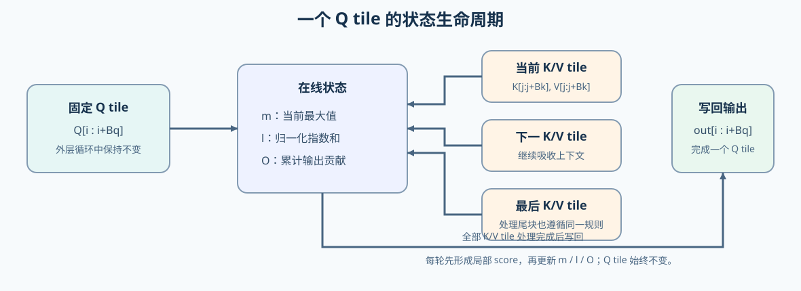

# 20. FlashAttention Sim | FlashAttention 模拟
**难度：** Hard | **环境：** CPU-first | **标签：** `推理优化`, `Attention`, `FlashAttention` | **目标人群：** 推理优化学习者

> 🚀 **云端运行环境**
>
> 本章节的实战代码可以点击以下链接在免费 GPU 算力平台上直接运行：
>
> [](https://colab.research.google.com/github/datawhalechina/llm-algo-leetcode/blob/main/02_PyTorch_Algorithms/20_FlashAttention_Sim.ipynb)
> [](https://modelscope.cn/my/mynotebook) *(国内推荐：魔搭社区免费实例)*


---

## 本节导读

标准 Attention 会先形成完整 Score 矩阵；当序列变长，这个中间矩阵会同时带来存储和读写压力。本节从这一问题出发，依次理解分块计算如何缩小当前工作集、Online Softmax 如何保持结果等价，以及这些机制如何落到一个可验证的前向模拟。

学习时请把三个问题连起来：哪些数据需要暂存、跨分块时如何维持同一行的归一化、以及工作集变小后需要怎样测量实际收益。

**关键词：** `FlashAttention`, `online softmax`, `tiling`

---

## 前置阅读

**导语：** 如果你已能写出普通 Attention，先通过完整 Score 与 tile 工作集的对比建立直觉；遇到“为什么减少写回会影响速度”的问题，再回查 GPU 内存层级。
- [P1: 14. FlashAttention Memory Model | FlashAttention 显存模型](../01_Hardware_Math_and_Systems/14_FlashAttention_Memory_Model.md)
- [P1: 03. GPU Architecture and Memory | GPU 物理架构与内存层级](../01_Hardware_Math_and_Systems/03_GPU_Architecture_and_Memory.md)

---

### Step 1: Attention 中间工作集与分块动机

给定 $Q、K、V$ 后，标准实现先计算完整的 $S=QK^T$，再对每一行做 softmax，最后与 $V$ 相乘。序列长度为 $N$ 时，$S$ 包含 $N^2$ 个元素；它不是最终输出，却可能作为大块中间数据写入并再次读取 HBM。

这里的**算法 tile**指 token 维度上的一小段 Q，与一小段 K/V 形成的局部 score 矩阵；它不是 Transformer 模型 Block，也不是 CUDA thread block。真实 FlashAttention 会把当前 tile 尽量放在寄存器或 shared memory 等片上存储中处理，减少完整 Score 的 HBM 往返。

先比较完整 Score 与局部 tile：分块不会删去 Attention 所需的信息，而是改变中间结果的出现、保留和合并方式；下一步关注这种方式怎样保持结果一致。

| 阶段 | 标准 Attention | 分块路径 |
|---|---|---|
| Score | 先得到完整 `QKᵀ` | 只计算当前 `Q block × K block` |
| Softmax | 对完整行统一计算 | 用跨分块摘要逐步合并 |
| 输出 | 最后与完整概率矩阵相乘 | 逐块累加当前 V 分块的贡献 |
| 工作集 | 完整 Score 需要长期处理较大的中间区域 | 单个 tile 限制当前暂存区域 |


### Step 2: Online Softmax 如何保持数值等价
分块以后不能对每个 tile 独立 Softmax 再相加，因为同一 Q 行的归一化分母覆盖全部 K/V。每行需要持续携带三类跨分块摘要；新 tile 到来时，先将历史摘要和当前 tile 对齐到同一最大值基准，再合并指数权重和输出贡献，从而保持与完整行 Softmax 相同的结果。

| 跨分块摘要 | 保存的信息 | 合并新 tile 时的职责 |
|---|---|---|
| 最大值 | 已处理 score 中的数值基准 | 选择新的共同基准，避免指数计算溢出 |
| 指数和 | 已处理 token 的归一化累计量 | 重标定历史贡献后，加上当前 tile 的贡献 |
| 累计输出 | 已处理 token 对输出的加权贡献 | 按新的归一化比例合并历史与当前 V 的贡献 |


### Step 3: 一个 Q 分块如何吸收全部 K/V 分块
固定一个 Q 分块，让它依次接收全部 K/V 分块；每轮把局部 score 的贡献并入跨分块摘要，直到当前 Q 分块获得与完整 Attention 相同的输出。下图把这一过程压缩为一个 Q tile 的生命周期。

| 计算阶段 | 保持不变的对象 | 状态变化 |
|---|---|---|
| 开始处理一个 Q 分块 | 当前 Q 分块 | 建立对应的跨分块摘要 |
| 接收一个 K/V 分块 | 当前 Q 分块与历史状态 | 形成局部分数，并合并新的上下文贡献 |
| 接收完全部 K/V 分块 | 当前 Q 分块 | 得到包含完整上下文信息的 Attention 输出 |




### Step 4: CPU 实现任务与验证标准
本步才把前面的概念与状态流转成可执行任务：输入是形状为 `[seq_len, dim]` 的 Q、K、V，输出是形状相同的 Attention 结果。题目骨架保留双层分块循环，学习者只完成四个机制责任：初始化 `out/m/l` 状态、形成 score 与 causal mask、按 Online Softmax 更新 tile 状态、写回全局状态。答案区保持相同函数签名与控制流，只补全这些位置。

这里的 FlashAttention 可以看作 Attention 内部的数据流融合：它把 score、Softmax 和 value aggregation 的中间结果尽量留在片上，减少完整矩阵写回。但本节不展开通用算子融合的图级判断、Triton kernel 或 CUDA 实现；需要比较 RMSNorm、Softmax、Linear-Activation 等融合边界时，转入算子优化路线。

测试不以“跑出一个输出”为终点：它会对齐标准 Attention，覆盖 causal、非整除尾块、dtype、数值稳定性与非法输入。完成 CPU 测试后，再由 Step 5 观察固定 workload 下的 GPU backend 延迟、显存和误差。

| 实验对象 | 输入与输出 | 判断方式 | 结果用途 |
|---|---|---|---|
| CPU 分块模拟 | 二维 Q/K/V → 同形状输出 | 与标准 Attention 的最大误差 | 检查 `m / l / O` 状态更新 |
| causal 扩展 | `causal=True` 的二维 Q/K/V | 与带上三角 mask 的标准结果对齐 | 检查未来位置是否被屏蔽 |
| dtype 与稳定性 | `float64` 和较大 Score 输入 | 输出 dtype 正确且无 NaN/Inf | 检查数值实现边界 |


```python
import torch
import math
```


```python
# 任务目标：在保留 Q/K/V 双层分块循环的前提下，实现 Online Softmax 的状态更新。
# 题目设计：保留 Q/K/V 的双层分块循环，只让每个 TODO 对应一个可验证的状态责任。
# TODO 1 初始化状态 → TODO 2 形成 score/mask → TODO 3 合并 Online Softmax → TODO 4 写回 tile。

def flash_attention_forward_sim(q, k, v, block_size=2, causal=False):
    """计算二维输入上的 FlashAttention 前向模拟。

    Args:
        q, k, v: [seq_len, dim] 张量，device 和 dtype 应保持一致。
        block_size: Q/K/V 的分块大小，必须为正数。
        causal: 是否只允许关注当前位置及之前的 K token。

    Returns:
        [seq_len, dim] 的 attention 输出。

    Note:
        只模拟 online softmax 和分块数据流，不实现真实 CUDA/Triton kernel、
        batch/head、dropout 或 backward；本节包含可选 causal 路径。out、m、l 显式使用输入 dtype；
        真实 kernel 常会使用更高精度累加器，不能由本模拟推断具体实现。
    """
    if q.ndim != 2 or k.ndim != 2 or v.ndim != 2:
        raise ValueError('q、k、v 必须是 [seq_len, dim] 二维张量')
    if q.shape != k.shape or k.shape != v.shape:
        raise ValueError('q、k、v 的形状必须一致')
    if q.device != k.device or k.device != v.device:
        raise ValueError('q、k、v 必须位于同一 device')
    if q.dtype != k.dtype or k.dtype != v.dtype:
        raise TypeError('q、k、v 必须使用相同 dtype')
    if block_size <= 0:
        raise ValueError('block_size 必须为正数')

    seq_len, dim = q.shape
    
    # TODO 1: 初始化输出 O，全局最大值 m，全局指数和 l
    # 提示: out 与 q 同 device、同 dtype，形状为 [seq_len, dim]；m/l 形状为 [seq_len, 1]
    # out = ???；m = ???；l = ???；m 初始为 -inf，l 初始为 0。
    # out = ???
    # m = ???
    # l = ???
    raise NotImplementedError("TODO 1：请初始化 out、m 与 l")
    
    scale = 1.0 / math.sqrt(dim)
    
    # 外层循环：遍历 Q 的分块
    for i in range(0, seq_len, block_size):
        q_block = q[i:i+block_size] * scale
        m_i = m[i:i+block_size]
        l_i = l[i:i+block_size]
        out_i = out[i:i+block_size]
        
        # 内层循环：遍历 K, V 的分块
        for j in range(0, seq_len, block_size):
            k_block = k[j:j+block_size]
            v_block = v[j:j+block_size]
            
            # TODO 2: 计算当前 tile 的 score，并在 causal 路径屏蔽未来 key。
            # S_ij = (Q_i / sqrt(d)) @ K_j.T
            # causal 时：用 query/key 的全局位置构造 mask，屏蔽 key_pos > query_pos。
            # 提示：query_pos = arange(i, ...)，key_pos = arange(j, ...)。
            raise NotImplementedError("TODO 2：请计算 score 并处理 causal mask")
            
            # TODO 3: 按 Online Softmax 公式更新 m、l 与 out 的 tile 状态。
            # m_block = ???；m_new = ???
            # m_new 是新的数值稳定基准；若 m_new 变化，旧 l_i 和 out_i 都必须重标定。
            
            # 先用 m_new 重标定旧状态，再累计当前 tile 的指数权重。
            # exp_scores = exp(S_ij - m_new)
            
            # 只需补出以下状态：局部最大值、新最大值、指数权重和新分母。
            # m_block = ???；m_new = ???
            # exp_scores = ???；l_new = ???
            
            # out_i = ???  # 用旧状态和当前 V tile 合并
            
            # 更新全局状态
            # m_i = ???
            # l_i = ???
            raise NotImplementedError("TODO 3：请完成 Online Softmax 的状态更新")
            pass
        
        # TODO 4: 将当前 Q tile 的 out_i、m_i、l_i 写回全局状态。
        # out[i:i+block_size] = ???
        # m[i:i+block_size] = ???
        # l[i:i+block_size] = ???
        raise NotImplementedError("TODO 4：请将 tile 状态写回 out、m 与 l")
            
    return out

```


```python
# 测试设计：分别验证数值等价、causal、dtype/稳定性、工作集代理与输入契约。

def _reference_attention(q, k, v, causal=False):
    scores = (q @ k.transpose(-2, -1)) / math.sqrt(q.shape[-1])
    if causal:
        mask = torch.triu(torch.ones(scores.shape, dtype=torch.bool), diagonal=1)
        scores = scores.masked_fill(mask, -float('inf'))
    return torch.softmax(scores, dim=-1) @ v

def test_noncausal_equivalence():
    """TODO 1–4：普通分块路径应与完整 Attention 等价，含尾块。"""
    for seq_len, dim, block_size, seed in [(8, 4, 2, 42), (5, 3, 3, 7), (3, 2, 1, 123)]:
        torch.manual_seed(seed)
        q, k, v = (torch.randn(seq_len, dim) for _ in range(3))
        diff = (_reference_attention(q, k, v) - flash_attention_forward_sim(q, k, v, block_size)).abs().max()
        assert diff < 1e-5, f"非 causal 结果失配：seq={seq_len}, block={block_size}"

def test_causal_equivalence():
    """TODO 2：causal mask 必须屏蔽未来 K/V。"""
    torch.manual_seed(11)
    q, k, v = (torch.randn(6, 4) for _ in range(3))
    assert torch.allclose(_reference_attention(q, k, v, causal=True), flash_attention_forward_sim(q, k, v, 2, causal=True), atol=1e-5, rtol=1e-5)

def test_dtype_and_stability():
    """TODO 3：重标定应保留 dtype，并让大 score 输出保持有限。"""
    torch.manual_seed(9)
    q, k, v = (torch.randn(4, 3, dtype=torch.float64) for _ in range(3))
    out = flash_attention_forward_sim(q, k, v, 2)
    assert out.dtype == torch.float64
    assert torch.allclose(_reference_attention(q, k, v), out, atol=1e-10, rtol=1e-10)
    stable_out = flash_attention_forward_sim(torch.full((3, 2), 100.0), torch.full((3, 2), 100.0), torch.randn(3, 2), 2)
    assert torch.isfinite(stable_out).all()

def test_working_set_proxy():
    """验证 score tile 的教学代理：固定 tile 时不随总序列长度平方增长。"""
    block_size = 8
    proxies = []
    for seq_len in [64, 256, 1024]:
        full_score_elements = seq_len * seq_len
        tile_score_elements = block_size * block_size
        proxies.append((full_score_elements, tile_score_elements))
        assert tile_score_elements == 64
        assert tile_score_elements < full_score_elements
    assert [full // tile for full, tile in proxies] == [64, 1024, 16384]

    seq_len = 256
    assert [block * block for block in [4, 8, 16]] == [16, 64, 256]

def test_input_contract():
    """输入形状、dtype、device 与 block_size 的契约应显式拒绝非法值。"""
    try:
        flash_attention_forward_sim(torch.randn(2, 2), torch.randn(2, 2), torch.randn(2, 2), block_size=0)
    except ValueError:
        return
    raise AssertionError('block_size <= 0 应被拒绝')

def run_flash_attention_sim_tests():
    try:
        test_noncausal_equivalence()
        test_causal_equivalence()
        test_dtype_and_stability()
        test_working_set_proxy()
        test_input_contract()
    except NotImplementedError:
        print("请先完成 TODO 部分的代码！")
        raise
    print("✅ FlashAttention CPU 机制测试通过：数值等价、causal、稳定性、工作集代理与输入契约均符合预期。")

run_flash_attention_sim_tests()

```

---

🛑 **STOP HERE** 🛑
<br><br><br><br><br><br><br><br><br><br>
> 请先尝试自己完成代码并跑通测试。<br>
> 如果你正在 Colab 中运行，并且遇到困难没有思路，可以向下滚动查看参考答案。
<br><br><br><br><br><br><br><br><br><br>

---
## 参考代码与解析

### 代码

```python
# 参考实现与题目区使用相同函数签名、双层分块循环和四个 TODO 位置。
def flash_attention_forward_sim(q, k, v, block_size=2, causal=False):
    """计算二维输入上的 FlashAttention 前向模拟。

    Args:
        q, k, v: [seq_len, dim] 张量，device 和 dtype 应保持一致。
        block_size: Q/K/V 的分块大小，必须为正数。
        causal: 是否只允许关注当前位置及之前的 K token。

    Returns:
        [seq_len, dim] 的 attention 输出。

    Note:
        只模拟 online softmax 和分块数据流，不实现真实 CUDA/Triton kernel、
        batch/head、dropout 或 backward；本节包含可选 causal 路径。out、m、l 显式使用输入 dtype；
        真实 kernel 常会使用更高精度累加器，不能由本模拟推断具体实现。
    """
    if q.ndim != 2 or k.ndim != 2 or v.ndim != 2:
        raise ValueError('q、k、v 必须是 [seq_len, dim] 二维张量')
    if q.shape != k.shape or k.shape != v.shape:
        raise ValueError('q、k、v 的形状必须一致')
    if q.device != k.device or k.device != v.device:
        raise ValueError('q、k、v 必须位于同一 device')
    if q.dtype != k.dtype or k.dtype != v.dtype:
        raise TypeError('q、k、v 必须使用相同 dtype')
    if block_size <= 0:
        raise ValueError('block_size 必须为正数')

    seq_len, dim = q.shape
    
    # TODO 1: 初始化输出 O，全局最大值 m，全局指数和 l
    out = torch.zeros((seq_len, dim), device=q.device, dtype=q.dtype)
    m = torch.full((seq_len, 1), -float('inf'), device=q.device, dtype=q.dtype)
    l = torch.zeros((seq_len, 1), device=q.device, dtype=q.dtype)
    
    scale = 1.0 / math.sqrt(dim)
    
    # 外层循环：遍历 Q 的分块
    for i in range(0, seq_len, block_size):
        q_block = q[i:i+block_size] * scale
        m_i = m[i:i+block_size]
        l_i = l[i:i+block_size]
        out_i = out[i:i+block_size]
        
        # 内层循环：遍历 K, V 的分块
        for j in range(0, seq_len, block_size):
            k_block = k[j:j+block_size]
            v_block = v[j:j+block_size]
            
            # TODO 2: 计算当前 tile 的 score，并在 causal 路径屏蔽未来 key。
            S_ij = q_block @ k_block.transpose(-2, -1)
            # TODO 2：使用全局 token 位置构造 causal mask。
            if causal:
                query_pos = torch.arange(i, i + q_block.shape[0], device=q.device)[:, None]
                key_pos = torch.arange(j, j + k_block.shape[0], device=q.device)[None, :]
                S_ij = S_ij.masked_fill(key_pos > query_pos, -float('inf'))
            
            # TODO 3: 按 Online Softmax 公式更新 m、l 与 out 的 tile 状态。
            m_block = torch.max(S_ij, dim=-1, keepdim=True)[0]
            m_new = torch.maximum(m_i, m_block)
            
            # TODO 3：以 m_new 为基准计算当前 tile 的指数权重。
            exp_scores = torch.exp(S_ij - m_new)
            
            # TODO 3：将旧 l_i 重标定到 m_new，再累加 l_block。
            l_block = torch.sum(exp_scores, dim=-1, keepdim=True)
            l_new = l_i * torch.exp(m_i - m_new) + l_block
            
            # TODO 3：修正旧输出并吸收当前 V tile 的贡献。
            out_i = out_i * (l_i * torch.exp(m_i - m_new) / l_new) + (exp_scores @ v_block) / l_new
            
            # TODO 3：提交本轮 tile 的在线状态。
            m_i = m_new
            l_i = l_new
        
        # TODO 4: 将当前 Q tile 的 out_i、m_i、l_i 写回全局状态。
        out[i:i+block_size] = out_i
        m[i:i+block_size] = m_i
        l[i:i+block_size] = l_i
            
    return out
```

### 解析

**1. TODO 1：初始化全局状态**
- **实现方式**：`out = torch.zeros((seq_len, dim), device=q.device, dtype=q.dtype)`，`m = torch.full((seq_len, 1), -float('inf'), device=q.device, dtype=q.dtype)`，`l = torch.zeros((seq_len, 1), device=q.device, dtype=q.dtype)`
- **关键点**：m 初始化为负无穷，确保第一个块的最大值能正确更新；l 初始化为 0，用于累加指数和
- **技术细节**：使用 `keepdim=True` 保持二维列向量形状，便于后续广播运算；这里显式沿用输入 dtype，真实 kernel 可能采用 FP32 累加器。

**2. TODO 2：计算当前块的 score 与 causal mask**
- **实现方式**：`S_ij = q_block @ k_block.transpose(-2, -1)`
- **关键点**：这是标准的 Attention Score 计算，但只针对当前的 Q 块和 K 块
- **技术细节**：q_block 已经在外层循环中乘以了 scale，避免重复缩放

**补充：causal mask 的位置约束**
- 对每个 Q/K block 使用全局 token 位置构造 `key_pos > query_pos` 的屏蔽条件。
- 被屏蔽的 score 设为负无穷，使其指数权重为 0；这不会改变 Online Softmax 的状态更新方式。
- 该扩展只验证因果约束下的数值一致性，不涉及真实 decoder kernel 的 mask 融合性能。

**3. TODO 3：合并当前 tile 的 Online Softmax 状态**
- **实现方式**：先取得局部最大值与新的共同基准，再计算相对该基准的指数权重。
- **关键点**：共同基准变化时，历史指数和与历史输出必须使用同一个重标定因子；随后再加入当前 tile 的贡献。
- **验证重点**：状态更新后，结果应与完整 Attention 数值等价，并在较大 score 下保持有限。题目区只要求补全状态合并表达式，分块循环、输入校验和写回位置已经给出。

**4. TODO 4：写回当前 Q tile 的最终状态**
- **实现方式**：将当前 Q tile 的输出和跨分块摘要写回对应位置。
- **关键点**：只有吸收全部 K/V tile 后，当前 Q tile 才能作为完整 Attention 的一部分输出。

**工程优化要点**
- **中间工作集**：不再物化完整的 O(N²) Attention Score 矩阵；单个 tile 的临时 score 约为 O(Bq × Bk)，Q/K/V、输出和状态仍需占用存储。
- **数值稳定性**：通过动态更新最大值 m，确保指数运算不会溢出
- **分块策略**：block_size 是关键超参数，需要根据硬件的 SRAM 大小调优
- **在线更新**：无需等待所有块计算完成，每个块处理后立即更新全局状态
- **工业实现**：真实的 FlashAttention 使用 CUDA/Triton 实现，利用共享内存和寄存器优化访存

**进阶思考**
- 如果把未归一化的加权和统一保存到循环结束，再一次性除以最终 `l`，会如何影响实现复杂度和数值稳定性？

### Step 5: GPU 可选对照实验

#### 5.1 环境检查与实验配置

完成 Step 4 的 CPU 函数和测试后，再运行本步 GPU 对照。本步只回答一个问题：在相同 Q/K/V workload 下，显式 Attention 与 PyTorch SDPA 的延迟、峰值显存和数值误差有什么差异？

SDPA 是 PyTorch 的统一 Attention API；它会依设备、dtype、shape 与 backend 条件选择 math、memory-efficient 或 flash 等实现路径。本单元比较显式物化 score 的 naive Attention 与当前环境中 SDPA 选择的路径，不把 SDPA 结果直接命名为 FlashAttention-2/3/4。若要验证特定 `flash-attn` kernel，需另行准备对应 backend、GPU 与 profiler 证据。环境与配置由后面的代码自动记录。
结果表用于记录相同 workload 下的延迟、峰值显存和误差；它不把一次运行外推为通用 kernel 结论。

| 实验部分 | 学习者需要做什么 | 输出与证据 |
|---|---|---|
| 环境与 workload | 设置 GPU、dtype、batch、head、seq_len、causal、warmup 和 iters | 自动记录 GPU、PyTorch、CUDA 与 workload |
| 两条执行路径 | 在同一组 Q/K/V 上运行显式 Attention 和 SDPA | 比较两种实现的延迟、峰值显存和最大误差 |
| 结果与解释 | 将 JSON 结果登记到最后的表格 | 形成当前 GPU 与固定 workload 下的对照结论 |


```python
# 本单元只配置实验条件；执行单元负责环境检查、测量和 JSON 输出。
RUN_GPU_EXPERIMENT = False  # 改为 True 才会启动真实 GPU；False 只做跳过提示。

# 数值与输入规模：auto 只选择原生 BF16，否则回退到 FP16。
GPU_DTYPE = 'auto'          # 可选：auto / float16 / bfloat16
GPU_BATCH_SIZE = 1
GPU_NUM_HEADS = 8
GPU_SEQ_LEN = 512
GPU_HEAD_DIM = 64
GPU_CAUSAL = False         # 是否启用因果 mask

# 测量设置：warmup 不计入结果，iters 用于计算平均单次延迟。
GPU_WARMUP = 5
GPU_ITERS = 20
GPU_SEED = 42
GPU_RESULTS_DIR_RELATIVE_PATH = 'benchmarks/results/20_flashattention'
GPU_RUN_LABEL = 'naive_vs_sdpa'  # 仅用于结果文件名；详细 workload 写入 JSON。
```

#### 5.2 执行对照并保存证据

先运行配置单元确认 workload，再运行执行单元。默认 `RUN_GPU_EXPERIMENT = False`，因此答案区测试不会启动 GPU；采集数据时只修改配置单元，不直接改执行逻辑。

```python
"""运行显式 Attention 与 PyTorch SDPA 的固定 workload GPU 对照。"""

from datetime import datetime, timezone
import json
import os
import platform
import time
from pathlib import Path

def _find_project_root():
    """从当前目录向上寻找项目根目录，保证结果写入仓库内。"""
    current = Path.cwd().resolve()
    for candidate in (current, *current.parents):
        if (candidate / 'benchmarks').is_dir() and (candidate / '02_PyTorch_Algorithms').is_dir():
            return candidate
    return current

def _select_gpu_dtype():
    """根据配置选择 dtype，并区分原生 BF16 与模拟支持。"""
    if GPU_DTYPE == 'float16':
        return torch.float16
    if GPU_DTYPE == 'bfloat16':
        return torch.bfloat16
    if GPU_DTYPE != 'auto':
        raise ValueError('GPU_DTYPE 只能是 auto / float16 / bfloat16')
    # including_emulation=False 避免把软件模拟误当成硬件 BF16 支持。
    try:
        native_bf16 = torch.cuda.is_bf16_supported(including_emulation=False)
    except TypeError:
        major, _ = torch.cuda.get_device_capability()
        native_bf16 = major >= 8
    return torch.bfloat16 if native_bf16 else torch.float16

def _naive_attention(q, k, v, causal=False):
    """显式物化 score 的 Attention baseline，用于同 workload 对照。"""
    scale = 1.0 / math.sqrt(q.shape[-1])
    scores = (q @ k.transpose(-2, -1)) * scale
    if causal:
        mask = torch.triu(torch.ones(scores.shape[-2:], device=q.device, dtype=torch.bool), diagonal=1)
        scores = scores.masked_fill(mask, -float('inf'))
    return torch.softmax(scores, dim=-1) @ v

def _measure_attention(fn, q, k, v, causal):
    """预热后同步计时，并记录 allocated / reserved 峰值。"""
    # 预热用于排除首次调用开销；正式计时前清零 CUDA 峰值统计。
    for _ in range(GPU_WARMUP):
        fn(q, k, v, causal)
    torch.cuda.synchronize()
    torch.cuda.reset_peak_memory_stats()
    start = time.perf_counter()
    output = None
    for _ in range(GPU_ITERS):
        output = fn(q, k, v, causal)
    torch.cuda.synchronize()
    elapsed = time.perf_counter() - start
    return output, {
        'latency_ms': round(elapsed * 1000 / GPU_ITERS, 3),
        'peak_allocated_mb': round(torch.cuda.max_memory_allocated() / 2**20, 2),
        'peak_reserved_mb': round(torch.cuda.max_memory_reserved() / 2**20, 2),
    }

def _run_gpu_attention_experiment():
    """执行两条 Attention 路径，并保存可复查的环境与结果记录。"""
    if not RUN_GPU_EXPERIMENT:
        print('已跳过 GPU 对照实验：将 RUN_GPU_EXPERIMENT 改为 True 后重新运行本单元。')
        return None
    # 先做环境和 workload 校验，避免在 CPU 环境中静默产生伪 GPU 结果。
    if not torch.cuda.is_available():
        raise RuntimeError('RUN_GPU_EXPERIMENT=True，但当前环境没有可用 CUDA。')
    if min(GPU_BATCH_SIZE, GPU_NUM_HEADS, GPU_SEQ_LEN, GPU_HEAD_DIM, GPU_WARMUP, GPU_ITERS) <= 0:
        raise ValueError('batch、heads、seq_len、head_dim、warmup 和 iters 必须为正数。')
    torch.manual_seed(GPU_SEED)
    device = torch.device('cuda')
    dtype = _select_gpu_dtype()
    shape = (GPU_BATCH_SIZE, GPU_NUM_HEADS, GPU_SEQ_LEN, GPU_HEAD_DIM)
    q = torch.randn(shape, device=device, dtype=dtype)
    k = torch.randn(shape, device=device, dtype=dtype)
    v = torch.randn(shape, device=device, dtype=dtype)
    # 两条路径共享同一批输入；因此误差和性能比较具有相同输入口径。
    methods = {
        'naive': _naive_attention,
        'SDPA': lambda a, b, c, causal: torch.nn.functional.scaled_dot_product_attention(
            a, b, c, is_causal=causal
        ),
    }
    rows = []
    outputs = {}
    # 分别测量并保留 OOM 状态；非 OOM 异常继续抛出，避免掩盖代码错误。
    for name, fn in methods.items():
        try:
            output, metrics = _measure_attention(fn, q, k, v, GPU_CAUSAL)
            outputs[name] = output
            rows.append({'implementation': name, **metrics, 'status': 'ok'})
        except RuntimeError as exc:
            if 'out of memory' not in str(exc).lower():
                raise
            torch.cuda.empty_cache()
            rows.append({'implementation': name, 'latency_ms': None, 'peak_allocated_mb': None, 'peak_reserved_mb': None, 'status': 'OOM'})
    # 只有两条路径都成功时才计算输出误差。
    max_error = None
    if len(outputs) == 2:
        max_error = float(torch.max(torch.abs(outputs['naive'] - outputs['SDPA'])).item())
    for row in rows:
        row['max_error'] = max_error
    # evidence_level 说明这是单 GPU、固定 workload 的对照，不是稳定 benchmark。
    result = {
        'schema_version': 'attention-gpu-experiment/v1',
        'experiment': '20_flashattention_sim',
        'created_at_utc': datetime.now(timezone.utc).strftime('%Y%m%dT%H%M%SZ'),
        'config': {
            'dtype': str(dtype), 'batch_size': GPU_BATCH_SIZE, 'num_heads': GPU_NUM_HEADS,
            'seq_len': GPU_SEQ_LEN, 'head_dim': GPU_HEAD_DIM, 'causal': GPU_CAUSAL,
            'warmup': GPU_WARMUP, 'iters': GPU_ITERS, 'seed': GPU_SEED,
        },
        'environment': {
            'device': torch.cuda.get_device_name(0), 'torch': torch.__version__,
            'cuda': torch.version.cuda, 'python': platform.python_version(),
        },
        'results': rows,
        'evidence_level': 'single_gpu_fixed_workload_comparison',
        'note': 'naive 与 SDPA 的对照不能直接命名为 FlashAttention-3/4；稳定结论需要重复运行。',
    }
    output_dir = _find_project_root() / GPU_RESULTS_DIR_RELATIVE_PATH
    output_dir.mkdir(parents=True, exist_ok=True)
    output_path = output_dir / f"gpu_{GPU_RUN_LABEL}_{result['created_at_utc']}.json"
    output_path.write_text(json.dumps(result, ensure_ascii=False, indent=2), encoding='utf-8')
    print(f'已保存 GPU 结果: {output_path}')
    print(json.dumps(result, ensure_ascii=False, indent=2))
    return result

gpu_result = _run_gpu_attention_experiment()
```

#### 5.3 读取结果并解释对照

将执行单元输出的 JSON 与配置一起抄录到下表。每次改变序列长度、dtype、causal 或实现后新增一组行，不覆盖已有结果；没有运行或发生 OOM 时保留空值并填写状态。同一组 naive / SDPA 必须使用相同 Q/K/V 形状、dtype、causal、warmup 和迭代次数，`status` 使用 `ok` 或 `OOM`。该表记录固定 workload 的一次对照，不替代重复 benchmark。

| GPU / PyTorch / CUDA | dtype | batch × heads × seq × dim | causal | 实现 | latency (ms) | peak allocated (MB) | peak reserved (MB) | max error | status |
|---|---|---|---|---|---:|---:|---:|---:|---|
|  |  |  |  | naive |  |  |  |  |  |
|  |  |  |  | SDPA |  |  |  |  |  |
|  |  |  |  | naive |  |  |  |  |  |
|  |  |  |  | SDPA |  |  |  |  |  |


```python
# 读取本次或结果目录中最新的 GPU 对照记录。
import json
from pathlib import Path

result_dir = _find_project_root() / GPU_RESULTS_DIR_RELATIVE_PATH
result_files = sorted(result_dir.glob("gpu_*.json")) if result_dir.exists() else []
if not result_files:
    print(f"未找到 GPU 结果；先将 RUN_GPU_EXPERIMENT=True 并运行 5.2。目录：{result_dir}")
else:
    result_path = result_files[-1]
    record = json.loads(result_path.read_text(encoding="utf-8"))
    rows = {row["implementation"]: row for row in record["results"]}
    naive, sdpa = rows.get("naive"), rows.get("SDPA")
    print(f"结果文件: {result_path}")
    print(f"环境: {record['environment']['device']} | torch={record['environment']['torch']} | CUDA={record['environment']['cuda']}")
    if naive and sdpa and naive["status"] == sdpa["status"] == "ok":
        print(f"SDPA - naive: latency={sdpa['latency_ms'] - naive['latency_ms']:.3f} ms, peak allocated={sdpa['peak_allocated_mb'] - naive['peak_allocated_mb']:.2f} MB, max_error={sdpa['max_error']:.3e}")
        print("解读：先确认 max_error，再将相同 workload 下的延迟与峰值显存差异作为当前 GPU 的对照证据。")
    else:
        print(f"本次状态：naive={naive and naive['status']}，SDPA={sdpa and sdpa['status']}；OOM 结果不能用于延迟比较。")

```

## 相关阅读

以下资料按“核心论文与实现 → 推理系统延伸”排列，用于把本节的分块计算和 Online Softmax 连接到后续工程主题。

- [FlashAttention 论文：Fast and Memory-Efficient Exact Attention with IO-Awareness](https://arxiv.org/abs/2205.14135)
- [FlashAttention-2 论文：Faster Attention with Better Parallelism and Work Partitioning](https://arxiv.org/abs/2307.08691)
- [FlashAttention 官方实现（FlashAttention / FlashAttention-2）](https://github.com/Dao-AILab/flash-attention)
- [PyTorch `scaled_dot_product_attention` 文档](https://docs.pytorch.org/docs/stable/generated/torch.nn.functional.scaled_dot_product_attention)
- [Part 02 · 22 vLLM 分页注意力](./22_vLLM_PagedAttention.md)
- [Part 02 · 34 Prefix Cache 匹配与复用](./34_Prefix_Cache_Matching_and_Reuse.md)
- [Part 02 · 66 推理性能对比项目](./66_Inference_Performance_Comparison.md)