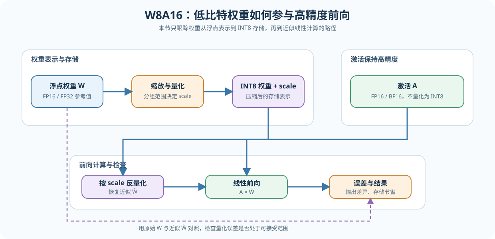

# 25. Quantization W8A16 | W8A16 量化
**难度：** Medium | **环境：** CPU-first | **标签：** `量化压缩`, `W8A16`, `granularity` | **目标人群：** 需要理解量化表示与反量化执行位置的学习者

> 🚀 **云端运行环境**
>
> 本章节的实战代码可以点击以下链接在免费 GPU 算力平台上直接运行：
>
> [](https://colab.research.google.com/github/datawhalechina/llm-algo-leetcode/blob/main/02_PyTorch_Algorithms/25_Quantization_W8A16.ipynb)
> [](https://modelscope.cn/my/mynotebook) *(国内推荐：魔搭社区免费实例)*


---

## 本节导读

量化权重不是把浮点数直接改成整数 dtype：系统还必须保存 scale、必要时保存 zero point，并明确这些参数由整个张量、每个输出通道还是每个 group 共享。不同粒度会同时改变恢复误差、元数据和 kernel 读取方式。

本节以 W8A16 Linear 为例，先建立对称/非对称量化表示，再比较 per-tensor、per-channel 和 per-group 状态，最后追踪反量化发生在 Python 前向、融合 kernel 还是整数 kernel 内部。W8A16 描述权重和激活的表示，不自动等于纯整数执行。

**关键词：** `W8A16`, `scale`, `zero point`, `granularity`, `dequantization`

---

## 前置阅读

**导语：** 先建立量化误差与数据隔离口径，再观察权重表示、粒度和执行路径如何改变成本。

- [52. Quantization Calibration and Error | 量化校准与误差控制](./52_Quantization_Calibration_and_Error.md)
- [Part 01 · 01 Data Types and Precision | 数据类型与精度](../01_Hardware_Math_and_Systems/01_Data_Types_and_Precision.md)
- [Part 01 · 21 Quantization Theory | 量化理论与 INT4/INT8](../01_Hardware_Math_and_Systems/21_Quantization_Theory_and_INT4_INT8.md)

---

### Step 1：整数码、scale 与 zero point 如何表示权重

量化状态至少包含整数码和 scale；非对称量化还需要 zero point 表示实数零落在哪个整数码点。对称量化令 zero point 为 0，适合分布大致围绕零的权重；非对称量化利用完整整数区间，更适合明显偏移的分布，但会增加参数与 kernel 处理条件。

| 表示 | 映射方式 | 优点 | 代价与适用条件 |
|---|---|---|---|
| 对称量化 | `q = round(x / scale)`，`zero_point = 0` | 公式和 kernel 更简单 | 偏移分布可能浪费码点 |
| 非对称量化 | `q = round(x / scale + zero_point)` | 更充分覆盖 `[min, max]` | 需要保存并处理 zero point |
| 反量化 | `x_hat = (q - zero_point) × scale` | 恢复近似浮点权重 | 舍入与截断误差不可逆 |
| W8A16 | 权重 8-bit，激活 16-bit | 降低权重存储与读取成本 | 不保证矩阵乘采用纯整数 kernel |



### Step 2：量化粒度如何改变误差与元数据

粒度决定多少个权重共享一组量化参数。共享范围越大，scale 数量越少，但异常值更容易压缩其他数值的有效码点；范围越小，局部误差通常更低，却会增加 scale、zero point 和 kernel 索引成本。

| 粒度 | 参数共享范围 | scale 数量 | 典型取舍 |
|---|---|---:|---|
| per-tensor | 整个权重张量 | 1 | 元数据最少，容易受全局 outlier 影响 |
| per-channel | 每个输出通道 | `out_features` | Linear 常用，误差与实现复杂度较平衡 |
| per-group | 每个输出通道内固定长度 group | `out_features × ceil(in_features / group_size)` | 局部误差更低，元数据与 kernel 约束更多 |

比较粒度时，量化值、scale、zero point 和尾组都必须进入字节账本；不能只用 `numel × bit` 估算实际状态。

### Step 3：反量化发生在哪里，为什么会影响真实性能

weight-only 描述的是“权重以低比特保存”，不是“整个 Linear 使用整数算术”。教学实现会先把 INT8 权重恢复到激活 dtype，再调用普通 `F.linear`；成熟 backend 可以把读取、反量化和矩阵乘融合在一个 kernel 中；只有特定路径才会让整数或低精度张量直接进入目标计算单元。

| 执行路径 | 反量化位置 | 可以证明什么 | 不能直接推出什么 |
|---|---|---|---|
| eager dequantization | `F.linear` 前显式恢复浮点权重 | 表示、误差与状态账本 | 量化 kernel 加速 |
| fused dequant + matmul | kernel 读取低比特权重时恢复 | 减少中间权重与访存 | 端到端服务收益 |
| integer / low-precision kernel | 目标计算单元直接消费受支持格式 | 真实低精度执行 | 其他 shape、硬件和 workload 的收益 |


### Step 4：实现量化参数、粒度状态与 W8A16 前向

题目区实现三项机制：根据分布生成对称或非对称 qparams；按 per-tensor、per-channel 或 per-group 划分权重；在教学前向中使用对应 scale 与 zero point 恢复权重。测试检查表示公式、尾组、元数据形状和 W8A16 dtype 契约。

| TODO | 机制责任 | 关键测试 |
|:---|:---|:---|
| TODO 1 | `calculate_qparams` 生成 scale 与 zero point | 对称/非对称、全零范围 |
| TODO 2 | `quantize_weight` 建立 per-group 划分 | 三种粒度、尾组、状态 shape |
| TODO 3 | `W8A16Linear.forward` 恢复 per-channel 权重 | 参考结果、输出 dtype、shape |


```python
import torch
import torch.nn as nn
import torch.nn.functional as F
```


```python
# 题目区只挖空量化参数、group 划分和反量化前向三个机制。

def calculate_qparams(
    values: torch.Tensor, *, symmetric: bool, eps: float = 1e-8
) -> tuple[torch.Tensor, torch.Tensor, int, int]:
    """返回 scale、zero_point、qmin 和 qmax。"""
    if values.numel() == 0 or not values.is_floating_point():
        raise ValueError("values must be a non-empty floating tensor")
    qmin, qmax = (-127, 127) if symmetric else (-128, 127)
    # TODO 1（量化参数）：分别实现对称 absmax 映射和非对称 min/max 映射。
    # if symmetric:
    #     scale = ???
    #     zero_point = ???
    # else:
    #     scale = ???
    #     zero_point = ???
    return scale, zero_point, qmin, qmax


def _quantize_chunk(chunk: torch.Tensor, *, symmetric: bool):
    scale, zero_point, qmin, qmax = calculate_qparams(chunk, symmetric=symmetric)
    quantized = torch.clamp(torch.round(chunk / scale + zero_point), qmin, qmax).to(torch.int8)
    return quantized, scale, zero_point


def quantize_weight(
    weight: torch.Tensor, *, granularity: str = "per_channel",
    group_size: int | None = None, symmetric: bool = True,
) -> dict[str, torch.Tensor | str | int]:
    """沿最后一维建立 per-tensor、per-channel 或 per-group 权重量化状态。"""
    if weight.ndim != 2 or not weight.is_floating_point():
        raise ValueError("weight must be a 2D floating tensor")
    if granularity not in {"per_tensor", "per_channel", "per_group"}:
        raise ValueError("unsupported granularity")

    out_features, in_features = weight.shape
    if granularity == "per_tensor":
        quantized, scale, zero_point = _quantize_chunk(weight, symmetric=symmetric)
        return {
            "quantized": quantized,
            "scale": scale.reshape(1, 1),
            "zero_point": zero_point.reshape(1, 1),
            "granularity": granularity,
            "group_size": in_features * out_features,
        }

    effective_group_size = in_features if granularity == "per_channel" else group_size
    if effective_group_size is None or effective_group_size <= 0:
        raise ValueError("per_group quantization requires a positive group_size")
    # TODO 2（粒度划分）：按最后一维向上取整；尾组不足 group_size 时仍保留。
    # n_groups = ???
    quantized = torch.empty_like(weight, dtype=torch.int8)
    scales = torch.empty((out_features, n_groups), dtype=torch.float32, device=weight.device)
    zero_points = torch.empty((out_features, n_groups), dtype=torch.float32, device=weight.device)
    for row in range(out_features):
        for group in range(n_groups):
            start = group * effective_group_size
            end = min(start + effective_group_size, in_features)
            q, scale, zero_point = _quantize_chunk(weight[row, start:end], symmetric=symmetric)
            quantized[row, start:end] = q
            scales[row, group] = scale
            zero_points[row, group] = zero_point
    return {
        "quantized": quantized,
        "scale": scales,
        "zero_point": zero_points,
        "granularity": granularity,
        "group_size": effective_group_size,
    }


def dequantize_weight(state: dict[str, torch.Tensor | str | int], dtype: torch.dtype) -> torch.Tensor:
    """按状态中的粒度恢复近似浮点权重。"""
    quantized = state["quantized"]
    scale = state["scale"]
    zero_point = state["zero_point"]
    granularity = state["granularity"]
    if granularity == "per_tensor":
        return ((quantized.float() - zero_point) * scale).to(dtype)

    group_size = int(state["group_size"])
    restored = torch.empty_like(quantized, dtype=torch.float32)
    for row in range(quantized.shape[0]):
        for group in range(scale.shape[1]):
            start = group * group_size
            end = min(start + group_size, quantized.shape[1])
            restored[row, start:end] = (quantized[row, start:end].float() - zero_point[row, group]) * scale[row, group]
    return restored.to(dtype)


class W8A16Linear(nn.Module):
    """保存 INT8 权重与 per-channel qparams，并以高精度激活执行教学前向。"""

    def __init__(self, in_features: int, out_features: int):
        super().__init__()
        self.in_features = in_features
        self.out_features = out_features
        self.register_buffer("weight_int8", torch.zeros((out_features, in_features), dtype=torch.int8))
        self.register_buffer("scale", torch.ones((out_features, 1), dtype=torch.float32))
        self.register_buffer("zero_point", torch.zeros((out_features, 1), dtype=torch.float32))
        self.bias = nn.Parameter(torch.zeros(out_features))

    def from_float(self, linear_layer: nn.Linear):
        """把浮点 Linear 转为对称 per-channel W8A16 状态。"""
        if linear_layer.weight.shape != self.weight_int8.shape:
            raise ValueError("linear layer shape does not match")
        state = quantize_weight(linear_layer.weight.detach(), granularity="per_channel", symmetric=True)
        with torch.no_grad():
            self.weight_int8.copy_(state["quantized"])
            self.scale.copy_(state["scale"])
            self.zero_point.copy_(state["zero_point"])
            if linear_layer.bias is not None:
                self.bias.copy_(linear_layer.bias)
        return self

    def forward(self, x: torch.Tensor) -> torch.Tensor:
        """显式反量化权重，再执行高精度激活路径。"""
        # TODO 3（反量化位置）：根据 per-channel scale / zero point 恢复权重并执行 F.linear。
        # weight = ???
        # output = ???
        return output

```


```python
# 机制测试：量化参数、粒度状态、尾组和 W8A16 反量化前向。
def test_symmetric_and_asymmetric_qparams():
    """对称量化保持 zero point 为零，非对称量化覆盖偏移范围。"""
    symmetric = calculate_qparams(torch.tensor([-2.0, 1.0]), symmetric=True)
    asymmetric = calculate_qparams(torch.tensor([1.0, 3.0]), symmetric=False)
    assert symmetric[1].item() == 0
    assert symmetric[2:] == (-127, 127)
    assert asymmetric[1].item() != 0
    assert asymmetric[2:] == (-128, 127)
    assert torch.isfinite(calculate_qparams(torch.zeros(4), symmetric=True)[0])


def test_granularity_state_shapes():
    """三种粒度产生不同数量的 qparams，并保留权重 shape。"""
    weight = torch.tensor([[1.0, -2.0, 3.0, -4.0, 5.0], [0.5, 0.25, -0.75, 1.5, -2.0]])
    tensor_state = quantize_weight(weight, granularity="per_tensor")
    channel_state = quantize_weight(weight, granularity="per_channel")
    group_state = quantize_weight(weight, granularity="per_group", group_size=2)
    assert tensor_state["scale"].shape == (1, 1)
    assert channel_state["scale"].shape == (2, 1)
    assert group_state["scale"].shape == (2, 3)
    assert group_state["quantized"].shape == weight.shape


def test_tail_group_and_dequantization():
    """非整除尾组不会丢失，恢复结果保持有限。"""
    weight = torch.arange(10, dtype=torch.float32).reshape(2, 5) - 4
    state = quantize_weight(weight, granularity="per_group", group_size=3, symmetric=False)
    restored = dequantize_weight(state, torch.float32)
    assert state["scale"].shape == (2, 2)
    assert restored.shape == weight.shape
    assert torch.isfinite(restored).all()


def test_w8a16_linear_contract():
    """教学前向与显式 per-channel 反量化参考结果一致。"""
    torch.manual_seed(42)
    fp_linear = nn.Linear(8, 4)
    quantized = W8A16Linear(8, 4).from_float(fp_linear)
    x = torch.randn(2, 8)
    state = {"quantized": quantized.weight_int8, "scale": quantized.scale,
             "zero_point": quantized.zero_point, "granularity": "per_channel", "group_size": 8}
    reference = F.linear(x, dequantize_weight(state, x.dtype), quantized.bias)
    assert torch.allclose(quantized(x), reference, atol=1e-6)
    assert quantized.weight_int8.dtype == torch.int8


def test_fp16_activation_contract():
    """A16 路径保持激活和输出为 FP16。"""
    layer = W8A16Linear(8, 4).from_float(nn.Linear(8, 4))
    output = layer(torch.randn(2, 8, dtype=torch.float16))
    assert output.dtype == torch.float16 and output.shape == (2, 4)


for test in (
    test_symmetric_and_asymmetric_qparams,
    test_granularity_state_shapes,
    test_tail_group_and_dequantization,
    test_w8a16_linear_contract,
    test_fp16_activation_contract,
):
    test()
print("✅ W8A16 机制测试通过：qparams、粒度、尾组与反量化前向均已验证。")

```

## 参考代码与解析

### 代码

```python
# 题目区只挖空量化参数、group 划分和反量化前向三个机制。

def calculate_qparams(
    values: torch.Tensor, *, symmetric: bool, eps: float = 1e-8
) -> tuple[torch.Tensor, torch.Tensor, int, int]:
    """返回 scale、zero_point、qmin 和 qmax。"""
    if values.numel() == 0 or not values.is_floating_point():
        raise ValueError("values must be a non-empty floating tensor")
    qmin, qmax = (-127, 127) if symmetric else (-128, 127)
    # TODO 1（量化参数）：分别实现对称 absmax 映射和非对称 min/max 映射。
    if symmetric:
        absmax = values.detach().float().abs().max().clamp_min(eps)
        scale = absmax / qmax
        zero_point = torch.zeros_like(scale)
    else:
        minimum = values.detach().float().min()
        maximum = values.detach().float().max()
        scale = ((maximum - minimum) / (qmax - qmin)).clamp_min(eps)
        zero_point = torch.clamp(torch.round(qmin - minimum / scale), qmin, qmax)
    return scale, zero_point, qmin, qmax


def _quantize_chunk(chunk: torch.Tensor, *, symmetric: bool):
    scale, zero_point, qmin, qmax = calculate_qparams(chunk, symmetric=symmetric)
    quantized = torch.clamp(torch.round(chunk / scale + zero_point), qmin, qmax).to(torch.int8)
    return quantized, scale, zero_point


def quantize_weight(
    weight: torch.Tensor, *, granularity: str = "per_channel",
    group_size: int | None = None, symmetric: bool = True,
) -> dict[str, torch.Tensor | str | int]:
    """沿最后一维建立 per-tensor、per-channel 或 per-group 权重量化状态。"""
    if weight.ndim != 2 or not weight.is_floating_point():
        raise ValueError("weight must be a 2D floating tensor")
    if granularity not in {"per_tensor", "per_channel", "per_group"}:
        raise ValueError("unsupported granularity")

    out_features, in_features = weight.shape
    if granularity == "per_tensor":
        quantized, scale, zero_point = _quantize_chunk(weight, symmetric=symmetric)
        return {
            "quantized": quantized,
            "scale": scale.reshape(1, 1),
            "zero_point": zero_point.reshape(1, 1),
            "granularity": granularity,
            "group_size": in_features * out_features,
        }

    effective_group_size = in_features if granularity == "per_channel" else group_size
    if effective_group_size is None or effective_group_size <= 0:
        raise ValueError("per_group quantization requires a positive group_size")
    # TODO 2（粒度划分）：按最后一维向上取整；尾组不足 group_size 时仍保留。
    n_groups = (in_features + effective_group_size - 1) // effective_group_size
    quantized = torch.empty_like(weight, dtype=torch.int8)
    scales = torch.empty((out_features, n_groups), dtype=torch.float32, device=weight.device)
    zero_points = torch.empty((out_features, n_groups), dtype=torch.float32, device=weight.device)
    for row in range(out_features):
        for group in range(n_groups):
            start = group * effective_group_size
            end = min(start + effective_group_size, in_features)
            q, scale, zero_point = _quantize_chunk(weight[row, start:end], symmetric=symmetric)
            quantized[row, start:end] = q
            scales[row, group] = scale
            zero_points[row, group] = zero_point
    return {
        "quantized": quantized,
        "scale": scales,
        "zero_point": zero_points,
        "granularity": granularity,
        "group_size": effective_group_size,
    }


def dequantize_weight(state: dict[str, torch.Tensor | str | int], dtype: torch.dtype) -> torch.Tensor:
    """按状态中的粒度恢复近似浮点权重。"""
    quantized = state["quantized"]
    scale = state["scale"]
    zero_point = state["zero_point"]
    granularity = state["granularity"]
    if granularity == "per_tensor":
        return ((quantized.float() - zero_point) * scale).to(dtype)

    group_size = int(state["group_size"])
    restored = torch.empty_like(quantized, dtype=torch.float32)
    for row in range(quantized.shape[0]):
        for group in range(scale.shape[1]):
            start = group * group_size
            end = min(start + group_size, quantized.shape[1])
            restored[row, start:end] = (quantized[row, start:end].float() - zero_point[row, group]) * scale[row, group]
    return restored.to(dtype)


class W8A16Linear(nn.Module):
    """保存 INT8 权重与 per-channel qparams，并以高精度激活执行教学前向。"""

    def __init__(self, in_features: int, out_features: int):
        super().__init__()
        self.in_features = in_features
        self.out_features = out_features
        self.register_buffer("weight_int8", torch.zeros((out_features, in_features), dtype=torch.int8))
        self.register_buffer("scale", torch.ones((out_features, 1), dtype=torch.float32))
        self.register_buffer("zero_point", torch.zeros((out_features, 1), dtype=torch.float32))
        self.bias = nn.Parameter(torch.zeros(out_features))

    def from_float(self, linear_layer: nn.Linear):
        """把浮点 Linear 转为对称 per-channel W8A16 状态。"""
        if linear_layer.weight.shape != self.weight_int8.shape:
            raise ValueError("linear layer shape does not match")
        state = quantize_weight(linear_layer.weight.detach(), granularity="per_channel", symmetric=True)
        with torch.no_grad():
            self.weight_int8.copy_(state["quantized"])
            self.scale.copy_(state["scale"])
            self.zero_point.copy_(state["zero_point"])
            if linear_layer.bias is not None:
                self.bias.copy_(linear_layer.bias)
        return self

    def forward(self, x: torch.Tensor) -> torch.Tensor:
        """显式反量化权重，再执行高精度激活路径。"""
        # TODO 3（反量化位置）：根据 per-channel scale / zero point 恢复权重并执行 F.linear。
        state = {"quantized": self.weight_int8, "scale": self.scale,
                 "zero_point": self.zero_point, "granularity": "per_channel",
                 "group_size": self.in_features}
        weight = dequantize_weight(state, x.dtype)
        output = F.linear(x, weight, self.bias.to(x.dtype))
        return output

```

### 解析

**TODO 1：量化参数。** 对称量化使用绝对最大值并固定 `zero_point=0`；非对称量化用 `[min, max]` 覆盖完整整数区间。全零或常量范围需要 `eps` 防止除零。

**TODO 2：粒度划分。** per-channel 等价于每个输出通道一个 group；per-group 还要对最后一维向上取整，确保尾组不丢失。scale 和 zero point 的数量必须进入状态账本。

**TODO 3：反量化位置。** 教学实现先恢复浮点权重再调用 `F.linear`，因此只验证 W8A16 表示与误差，不构成 INT8 kernel 证据。成熟 backend 可能把读取、反量化和矩阵乘融合起来。

### Step 5：可选 GPU 实验——用 torchao 比较 FP16 与 W8A16

#### 5.1 环境、真实层与固定 workload

实验从固定小模型提取首层 `q_proj` 和对应输入，在相同张量上比较 FP16 Linear 与 torchao `Int8WeightOnlyConfig`。这比手写“每次前向先反量化”的教学路径更接近成熟库执行，同时仍保持在单层机制范围内。

| 配置项 | 固定口径 | 作用 |
|---|---|---|
| 层来源 | 首个 Attention `q_proj` | 使用真实权重与真实输入形状 |
| baseline | FP16 Linear | 保存与执行基线 |
| candidate | torchao INT8 weight-only | 验证低比特权重路径 |
| 指标 | 状态字节、同步延迟、峰值显存、MSE | 同时观察容量、代价与误差 |


```python
# 5.1 只定义真实层来源与测量次数；默认不下载模型、不占用 GPU。
from pathlib import Path

import torch

RUN_MODE = "dry_run"  # dry_run / real_gpu
MODEL_ID = "Qwen/Qwen2.5-0.5B-Instruct"
PROMPT = "Explain why lower precision can reduce weight storage."
WARMUP_STEPS = 5
REPEAT_STEPS = 20
SEED = 42
OUTPUT_PATH = Path("benchmarks/results/25_torchao_w8a16_layer_microbenchmark.json")

```


```python
# 5.2 用 torchao 执行同层、同输入的 FP16/W8A16 配对实验，并保存 JSON。
import copy
import importlib.metadata
import json
import platform
import statistics
import time


def package_version(name):
    """读取依赖版本；缺失依赖在预检结果中显示为 None。"""
    try:
        return importlib.metadata.version(name)
    except importlib.metadata.PackageNotFoundError:
        return None


def tensor_state_bytes(module):
    """统计 state_dict 张量的逻辑存储字节，比较权重表示变化。"""
    return sum(value.numel() * value.element_size() for value in module.state_dict().values())


def synchronize():
    """同步 CUDA 计时边界。"""
    if torch.cuda.is_available():
        torch.cuda.synchronize()


def measure(module, inputs):
    """测量固定模块前向的同步延迟与峰值分配显存。"""
    with torch.inference_mode():
        for _ in range(WARMUP_STEPS):
            module(inputs)
        synchronize()
        torch.cuda.empty_cache()
        torch.cuda.reset_peak_memory_stats()
        timings_ms = []
        output = None
        for _ in range(REPEAT_STEPS):
            synchronize()
            started = time.perf_counter()
            output = module(inputs)
            synchronize()
            timings_ms.append((time.perf_counter() - started) * 1000.0)
    return output, {
        "median_latency_ms": statistics.median(timings_ms),
        "min_latency_ms": min(timings_ms),
        "peak_allocated_bytes": int(torch.cuda.max_memory_allocated()),
    }


result = {
    "schema_version": "quantization-mechanism-gpu/v2",
    "chapter": "25",
    "run_mode": RUN_MODE,
    "framework": {
        "python": platform.python_version(),
        "torch": torch.__version__,
        "transformers": package_version("transformers"),
        "torchao": package_version("torchao"),
    },
    "hardware": {
        "cuda_available": torch.cuda.is_available(),
        "cuda": torch.version.cuda,
        "device": torch.cuda.get_device_name(0) if torch.cuda.is_available() else None,
    },
    "workload": {
        "model_id": MODEL_ID,
        "layer": "model.layers[0].self_attn.q_proj",
        "prompt": PROMPT,
        "warmup_steps": WARMUP_STEPS,
        "repeat_steps": REPEAT_STEPS,
        "seed": SEED,
    },
    "baseline": {"name": "fp16_linear"},
    "candidate": {"name": "torchao_int8_weight_only", "config": "Int8WeightOnlyConfig"},
    "mechanism_metrics": None,
    "failure": None,
    "evidence_level": "environment_preflight",
    "decision": "ready_to_measure",
}

if RUN_MODE == "real_gpu":
    try:
        if not torch.cuda.is_available():
            raise RuntimeError("RUN_MODE=real_gpu 但 CUDA 不可用")

        from torch import nn
        from torchao.quantization import Int8WeightOnlyConfig, quantize_
        from transformers import AutoModelForCausalLM, AutoTokenizer

        torch.manual_seed(SEED)
        tokenizer = AutoTokenizer.from_pretrained(MODEL_ID, use_fast=True)
        model = AutoModelForCausalLM.from_pretrained(
            MODEL_ID,
            torch_dtype=torch.float16,
        ).to("cuda").eval()
        encoded = tokenizer(PROMPT, return_tensors="pt").to("cuda")
        with torch.inference_mode():
            hidden = model.model.embed_tokens(encoded["input_ids"]).to(torch.float16)
        source = model.model.layers[0].self_attn.q_proj

        # Sequential 让 quantize_ 处理子模块；两条路径从同一权重副本开始。
        baseline_module = nn.Sequential(copy.deepcopy(source)).to("cuda").eval()
        candidate_module = nn.Sequential(copy.deepcopy(source)).to("cuda").eval()
        del model, source
        torch.cuda.empty_cache()

        quantize_(candidate_module, Int8WeightOnlyConfig())
        baseline_output, baseline_metrics = measure(baseline_module, hidden)
        candidate_output, candidate_metrics = measure(candidate_module, hidden)
        output_mse = torch.mean(
            (baseline_output.float() - candidate_output.float()) ** 2
        ).item()

        baseline_metrics["state_bytes"] = tensor_state_bytes(baseline_module)
        candidate_metrics["state_bytes"] = tensor_state_bytes(candidate_module)
        storage_reduction = 1.0 - (
            candidate_metrics["state_bytes"] / max(1, baseline_metrics["state_bytes"])
        )
        latency_ratio = candidate_metrics["median_latency_ms"] / max(
            1e-9, baseline_metrics["median_latency_ms"]
        )
        result.update({
            "workload": {
                **result["workload"],
                "input_shape": list(hidden.shape),
                "input_dtype": str(hidden.dtype),
            },
            "baseline": {**result["baseline"], **baseline_metrics},
            "candidate": {**result["candidate"], **candidate_metrics},
            "mechanism_metrics": {
                "state_storage_reduction_ratio": storage_reduction,
                "latency_ratio_candidate_over_baseline": latency_ratio,
                "output_mse": output_mse,
            },
            "evidence_level": "matched_torchao_weight_only_layer_microbenchmark",
            "decision": "accept" if storage_reduction > 0 and torch.isfinite(torch.tensor(output_mse)) else "tune",
        })
        del baseline_module, candidate_module, hidden, baseline_output, candidate_output
        torch.cuda.empty_cache()
    except Exception as exc:
        result.update({
            "failure": {"type": type(exc).__name__, "message": str(exc)},
            "evidence_level": "failed_real_gpu_attempt",
            "decision": "reject_until_environment_fixed",
        })

OUTPUT_PATH.parent.mkdir(parents=True, exist_ok=True)
OUTPUT_PATH.write_text(json.dumps(result, ensure_ascii=False, indent=2), encoding="utf-8")
print(json.dumps(result, ensure_ascii=False, indent=2))

```

#### 5.3 读取配对实验结果

读取单元只检查固定 workload、两条路径、机制指标和失败证据，不重复模型下载或量化。


```python
# 5.3 只读取 5.2 保存的 JSON。
if OUTPUT_PATH.exists():
    saved = json.loads(OUTPUT_PATH.read_text(encoding="utf-8"))
    keys = (
        "framework",
        "hardware",
        "workload",
        "baseline",
        "candidate",
        "mechanism_metrics",
        "failure",
        "evidence_level",
        "decision",
    )
    print({key: saved.get(key) for key in keys})
else:
    print(f"等待 W8A16 配对实验结果：{OUTPUT_PATH}")

```

#### 5.4 解释容量、误差与执行代价

单层实验首先验证权重表示是否缩小、输出误差是否有限，再观察当前设备上的执行时间。weight-only 不保证更快：若硬件或 torchao 路径未命中高效实现，候选仍可能出现延迟回退。

| 观察项 | 读取字段 | 判断问题 |
|---|---|---|
| 表示收益 | `state_storage_reduction_ratio` | INT8 权重状态是否小于 FP16 |
| 数值影响 | `output_mse` | 同层、同输入下误差是否可接受 |
| 执行代价 | `latency_ratio_candidate_over_baseline` | 当前设备上是否出现速度回退 |
| 路径可信度 | `failure`、`evidence_level` | 是否真实执行 torchao weight-only 路径 |
| 下一步 | `decision` | accept / tune / reject_until_environment_fixed |

## 相关阅读

- [Transformers：torchao quantization](https://huggingface.co/docs/transformers/main/quantization/torchao)
- [torchao：Quantization API](https://docs.pytorch.org/ao/stable/api_reference/api_ref_quantization.html)
- [40. GPTQ and AWQ Weight Quantization | GPTQ 与 AWQ 权重量化](./40_GPTQ_and_AWQ_Weight_Quantization.md)
- [53. Activation Quantization and SmoothQuant | 激活量化与 SmoothQuant](./53_Activation_Quantization_and_SmoothQuant.md)
