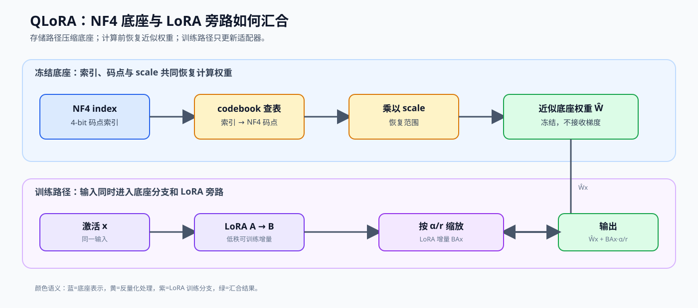
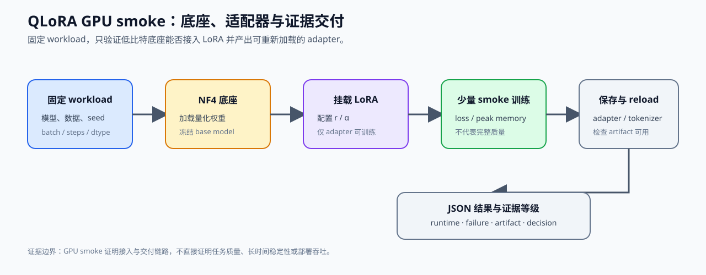

# 26. QLoRA and 4bit Quantization | QLoRA 与 4-bit 量化

**难度：** Hard | **环境：** CPU-first | **标签：** `量化压缩`, `QLoRA`, `4-bit` | **目标人群：** 量化压缩学习者

> 🚀 **云端运行环境**
>
> 本章节的实战代码可以点击以下链接在免费 GPU 算力平台上直接运行：
>
> [](https://colab.research.google.com/github/datawhalechina/llm-algo-leetcode/blob/main/02_PyTorch_Algorithms/26_QLoRA_and_4bit_Quantization.ipynb)
> [](https://modelscope.cn/my/mynotebook) *(国内推荐：魔搭社区免费实例)*


---

## 本节导读

第 25 节已经说明：只压权重，就能明显降低显存和读取压力。但微调大模型时，问题会更尖锐：底座模型很大，训练又需要额外保存梯度和优化器状态，单靠 8-bit 还不够省。QLoRA 继续往前走一步：把底座尽量压到 4-bit，同时把学习能力留给一条很小的可训练旁路。

这一节不复现工业库里的高性能内核，而是用纯 PyTorch 搭一个教学模拟：低精度基础权重负责存储和前向，高精度 LoRA 旁路负责训练更新。学完后，你应该能看清“底座压缩、旁路训练、计算前还原”这条主线，再理解真实 QLoRA 为什么能把大模型微调的显存门槛大幅压低。

本节的 4-bit 重点是 QLoRA/NF4 训练适配：底座冻结、LoRA 参数更新。训练显存与质量决策可以延伸到 `65`，部署侧的 GPTQ / AWQ artifact、backend 和 kernel 则在 `67` 中继续验证。

**关键词：** `QLoRA`, `NF4`, `LoRA`

---

## 前置阅读

**导语：** 进入本节前，先理解权重压缩如何降低底座成本，再理解 LoRA 旁路如何承担可训练参数。
- [10. LoRA Tutorial | LoRA 教程](./10_LoRA_Tutorial.md)
- [13. End-to-End Fine-Tuning Experiment | 端到端微调实验](./13_End_to_End_Fine_Tuning_Experiment.md)
- [25. W8A16 Quantization | W8A16 量化](./25_Quantization_W8A16.md)
- [P1: 21. Quantization Theory and INT4/INT8 | 量化理论与 INT4/INT8](../01_Hardware_Math_and_Systems/21_Quantization_Theory_and_INT4_INT8.md)
- [P1: 06. VRAM Calculation and ZeRO | 显存计算与 ZeRO 优化](../01_Hardware_Math_and_Systems/06_VRAM_Calculation_and_ZeRO.md)
- [P1: 12. TensorCore and Mixed Precision | Tensor Core 与混合精度](../01_Hardware_Math_and_Systems/12_TensorCore_and_Mixed_Precision.md)

---

### Step 1: QLoRA 如何组织底座与训练分支

QLoRA 面向显存受限的参数高效微调：底座权重压缩为 4-bit 并冻结，LoRA 旁路保留少量可训练参数。一次前向的输入是激活 `x`、压缩底座权重和 LoRA 参数，输出是底座结果与适配器增量合并后的结果；反向时主要更新 LoRA 参数。
先区分每个对象在存储、计算和训练中的角色，再沿着主图观察底座路径与训练路径如何汇合。

| 参与对象 | 存储或计算方式 | 是否更新 | 在训练流中的作用 |
|---|---|---|---|
| 底座权重 `W` | NF4 索引，前向时查表恢复 | 冻结 | 提供压缩后的基础模型能力 |
| NF4 码点与 scale | 查表和缩放信息 | 不作为训练参数 | 把 4-bit 表示还原为计算权重 |
| LoRA 旁路 `A、B` | 高精度低秩矩阵 | 更新 | 学习任务相关的权重变化 |
| 前向输出 | `W_nf4 x` 与 `BAx` 合并 | 由 LoRA 梯度驱动 | 同时利用底座能力与微调增量 |


### Step 2: NF4 如何用 4-bit 码点表示权重
NF4 的核心是一个预计算的 16 码点 lookup table。它基于标准正态分布的 CDF / 分位数函数（quantile function）构造，使码点在 0 附近更密集、在尾部更稀疏，因此比均匀 4-bit 更贴合神经网络权重的统计特性。

从直观上看，INT4 是"均匀铺点"，而 NF4 是"按概率密度聚集铺点"：权重出现概率高的区域（靠近 0）码点更密，尾部区域码点更疏。

其码点构造可概括为：

$$
q_i = \Phi^{-1}(p_i), \quad p_i = \frac{i - 0.5}{16}, \quad i = 1,2,\dots,16
$$

其中 $\Phi$ 表示标准正态分布的累积分布函数（CDF），$\Phi^{-1}$ 是其反函数（分位数函数）。实际实现中，这些码点会预先计算并存为 lookup table。

例如，一个权重值先被归一化为 `0.20`，再映射到最接近的 NF4 码点 `0.161`，最后乘以该分组的 scale 恢复近似权重。这个例子说明 NF4 保存的是索引，真正的浮点值来自“码点 × scale”。Double Quantization 还可以进一步压缩 scale 等量化元数据；它属于 NF4 存储路径的扩展，不改变“底座冻结、LoRA 更新”的训练分工。

| 表示方式 | 码点来源 | 码点分布 | 对微调的意义 |
|---|---|---|---|
| INT4 | 等间隔整数码点 | 均匀铺点 | 实现简单，但不一定贴合权重分布 |
| NF4 | 标准正态分布分位点 | 0 附近更密、尾部更疏 | 在相同 4-bit 索引下更贴近常见权重分布 |
| NF4 + Double Quantization | NF4 码点与再次量化的 scale | 权重和元数据都压缩 | 进一步降低底座存储开销 |
### Step 3: NF4 反量化如何与 LoRA 前向融合
NF4 码点负责压缩底座表示；本步继续追踪它们如何进入一次前向：先用索引查表得到近似底座权重，再与 LoRA 旁路产生的低秩增量合并。

底座路径和旁路路径的关系可以写成：

$$
(x A^\top) B^\top \cdot \mathrm{scaling}
$$

其中 $W_{NF4}$ 在反向传播中保持冻结，$A$ 和 $B$ 承担可训练更新。下面的表格把表示、计算和梯度流向对应起来，Step 4 再把它们落到教学类中。

| 前向环节 | 使用的表示 | 产生的结果 | 梯度归属 |
| --- | --- | --- | --- |
| 查表与缩放 | NF4 index、codebook、scale | 近似底座权重 `Ŵ` | 底座保持冻结 |
| 底座计算 | `Ŵ` 与激活 `x` | `Ŵx` | 不更新底座 index |
| LoRA 旁路 | 高精度 `A`、`B`、`α/r` | `BAx · α/r` | 更新 `A`、`B` |
| 输出合并 | 底座结果 + LoRA 增量 | 训练输出 | 反向主要经过 LoRA |


### Step 4: 实现并验证 QLoRA 前向路径

请补全下方 `QLoRALinearSim` 类。输入是 NF4 index、scale、LoRA 参数和激活，输出是底座前向与 LoRA 增量的合并结果；用纯 PyTorch 模拟查表反量化和前向融合，不引入 BitsAndBytes 的底层 kernel。
| 实现部分 | 需要完成的内容 | 验证重点 |
|---|---|---|
| NF4 查表 | 根据 4-bit index 读取预定义码点 | 索引范围和输出 dtype |
| 底座路径 | 应用 scale，得到近似浮点权重并完成线性计算 | 底座参数保持冻结 |
| LoRA 路径 | 计算低秩增量并按 scaling 合并 | `A`、`B` 可以获得梯度 |
| 前向输出 | 合并底座输出与 LoRA 输出 | shape 正确、结果有限且可复现 |


```python
import torch
import torch.nn as nn
import torch.nn.functional as F
```


```python
def create_nf4_lookup_table() -> torch.Tensor:
    """
    创建 4-bit NormalFloat (NF4) 的查表 (共 16 个离散的浮点值)。
    为了教学，这里提供论文中给出的标准 NF4 分位点数值的近似版本。
    """
    nf4_values = [
        -1.0, -0.696, -0.525, -0.395, -0.284, -0.185, -0.091, 0.0,
        0.080, 0.161, 0.246, 0.338, 0.441, 0.563, 0.723, 1.0
    ]
    return torch.tensor(nf4_values)

class QLoRALinearSim(nn.Module):
    """
    模拟 QLoRA 的 Linear 层。
    真实的 QLoRA 会把 weight 存为 uint8，两个 4-bit 挤在一个字节里。
    为了只演示原理，我们这里用 torch.int8 存储 0-15 的索引。
    """
    def __init__(self, in_features: int, out_features: int, r: int = 8, alpha: float = 16.0):
        super().__init__()
        
        # 1. 冻结的低精度基础权重 (保存 0~15 的索引)
        self.register_buffer("weight_nf4_indices", torch.randint(0, 16, (out_features, in_features), dtype=torch.int8))
        self.register_buffer("weight_scale", torch.tensor(1.0)) # 简化的单缩放因子
        self.register_buffer("nf4_table", create_nf4_lookup_table())
        
        # 2. 活跃的高精度 LoRA 适配器；scaling = alpha / r 控制旁路更新的幅度
        self.lora_A = nn.Parameter(torch.randn(r, in_features) * 0.01)
        self.lora_B = nn.Parameter(torch.zeros(out_features, r))
        self.register_buffer("scaling", torch.tensor(alpha / r))


    def forward(self, x: torch.Tensor) -> torch.Tensor:
        # ==========================================
        # TODO 1: 基础权重反量化（查表还原）
        # 提示：将 weight_nf4_indices 转为 long 类型作为索引，
        #   从 nf4_table 中取值后乘以 weight_scale
        # ==========================================
        # indices = ???
        # dequantized_base_weight = ???

        # ==========================================
        # TODO 2: 计算基础分支和 LoRA 旁路分支
        # 基础分支: F.linear(x, dequantized_base_weight)
        # LoRA 分支: (x @ lora_A.T) @ lora_B.T * scaling
        # ==========================================
        # base_out = ???
        # lora_out = ???

        return base_out + lora_out

```


```python
def _build_qlora_fixture():
    layer = QLoRALinearSim(in_features=4, out_features=3, r=2, alpha=8.0)
    with torch.no_grad():
        layer.weight_nf4_indices.copy_(torch.tensor([
            [0, 1, 2, 3], [4, 5, 6, 7], [8, 9, 10, 11],
        ], dtype=torch.int8))
        layer.weight_scale.copy_(torch.tensor(0.5))
        layer.lora_A.copy_(torch.tensor([
            [0.1, 0.2, 0.3, 0.4], [0.5, 0.6, 0.7, 0.8],
        ], dtype=layer.lora_A.dtype))
        layer.lora_B.copy_(torch.tensor([
            [0.9, -0.1], [0.2, 0.3], [-0.4, 0.7],
        ], dtype=layer.lora_B.dtype))
    return layer


def test_nf4_lookup_and_dequantization():
    table = create_nf4_lookup_table()
    assert table.shape == (16,)
    assert table[0] < 0 < table[-1]
    layer = _build_qlora_fixture()
    restored = layer.nf4_table[layer.weight_nf4_indices.long()] * layer.weight_scale
    assert restored.shape == layer.weight_nf4_indices.shape
    assert torch.isfinite(restored).all()


def test_lora_branch_contract():
    layer = _build_qlora_fixture()
    x = torch.tensor([[[0.1, -0.2, 0.3, -0.4], [0.5, 0.6, -0.7, 0.8]]])
    base_weight = layer.nf4_table[layer.weight_nf4_indices.long()] * layer.weight_scale
    base_out = F.linear(x, base_weight)
    out = layer(x)
    assert out.shape == (1, 2, 3)
    assert not torch.allclose(out, base_out, atol=1e-6)


def test_frozen_base_gradient_contract():
    layer = _build_qlora_fixture()
    x = torch.randn(1, 2, 4, requires_grad=True)
    layer(x).sum().backward()
    assert x.grad is not None
    assert layer.lora_A.grad is not None
    assert layer.lora_B.grad is not None
    assert not layer.weight_nf4_indices.requires_grad
    assert layer.weight_nf4_indices.grad is None
    assert layer.weight_scale.grad is None


def test_qlora_output_contract():
    layer = _build_qlora_fixture()
    x = torch.randn(1, 2, 4)
    out = layer(x)
    reference_weight = layer.nf4_table[layer.weight_nf4_indices.long()] * layer.weight_scale
    reference = F.linear(x, reference_weight) + (x @ layer.lora_A.T) @ layer.lora_B.T * layer.scaling
    assert torch.allclose(out, reference, atol=1e-5)


def run_qlora_tests():
    for test in (
        test_nf4_lookup_and_dequantization,
        test_lora_branch_contract,
        test_frozen_base_gradient_contract,
        test_qlora_output_contract,
    ):
        test()
    print('✅ QLoRA 机制测试通过：NF4、LoRA 旁路、冻结基座与梯度流向均已验证。')


run_qlora_tests()

```

---

🛑 **STOP HERE** 🛑
<br><br><br><br><br><br><br><br><br><br>
> 请先尝试自己完成代码并跑通测试。<br>
> 如果你正在 Colab 中运行，并且遇到困难没有思路，可以向下滚动查看参考答案。
<br><br><br><br><br><br><br><br><br><br>

---
## 参考代码与解析

### 代码

```python
def create_nf4_lookup_table() -> torch.Tensor:
    """
    创建 4-bit NormalFloat (NF4) 的查表 (共 16 个离散的浮点值)。
    """
    nf4_values = [
        -1.0, -0.696, -0.525, -0.395, -0.284, -0.185, -0.091, 0.0,
        0.080, 0.161, 0.246, 0.338, 0.441, 0.563, 0.723, 1.0
    ]
    return torch.tensor(nf4_values)

class QLoRALinearSim(nn.Module):
    """
    模拟 QLoRA 的 Linear 层。
    """
    def __init__(self, in_features: int, out_features: int, r: int = 8, alpha: float = 16.0):
        super().__init__()
        
        # 1. 冻结的低精度基础权重 (保存 0~15 的索引)
        self.register_buffer("weight_nf4_indices", torch.randint(0, 16, (out_features, in_features), dtype=torch.int8))
        self.register_buffer("weight_scale", torch.tensor(1.0))
        self.register_buffer("nf4_table", create_nf4_lookup_table())
        
        # 2. 活跃的高精度 LoRA 适配器
        self.lora_A = nn.Parameter(torch.randn(r, in_features) * 0.01)
        self.lora_B = nn.Parameter(torch.zeros(out_features, r))
        self.register_buffer("scaling", torch.tensor(alpha / r))

    def forward(self, x: torch.Tensor) -> torch.Tensor:
        # TODO 1: 基础权重反量化（查表还原）
        # 1. 将 weight_nf4_indices 转换为长整型 (long)，以作为查表的索引
        indices = self.weight_nf4_indices.long()
        
        # 2. 从 nf4_table 中取出对应的浮点数值
        # 3. 乘以 weight_scale 恢复范围
        dequantized_base_weight = self.nf4_table[indices] * self.weight_scale
        
        # TODO 2: 分别计算基础分支和 LoRA 旁路分支
        base_out = F.linear(x, dequantized_base_weight)
        lora_out = (x @ self.lora_A.T) @ self.lora_B.T * self.scaling
        
        return base_out + lora_out
```

### 解析

**1. TODO 1: 基础权重反量化**
- **实现方式**：`indices = self.weight_nf4_indices.long()`，`dequantized_base_weight = self.nf4_table[indices] * self.weight_scale`
- **关键点**：通过查表将 4-bit 索引（0-15）映射到 NF4 浮点值
- **技术细节**：NF4 查表包含 16 个根据正态分布分位点设计的浮点值，密度集中在 0 附近

**2. TODO 2: 分别计算基础前向和 LoRA 旁路**
- **实现方式**：`base_out = F.linear(x, dequantized_base_weight)`，`lora_out = (x @ self.lora_A.T) @ self.lora_B.T * self.scaling`
- **关键点**：基础权重冻结（不更新梯度），LoRA 权重可训练
- **技术细节**：LoRA 输出需要乘以 scaling 因子（alpha / r）来平衡贡献

**NF4 量化原理**
- **INT4 的局限**：INT4 的 16 个码点在数轴上均匀分布，但神经网络权重通常集中在 0 附近（正态分布），两者分布特性不匹配。均匀码点导致尾部区域分配了过多码点（浪费），而 0 附近区域码点不足（精度损失）。
- **NF4 解决方案**：根据标准正态分布的累积分布函数（CDF）计算 16 个分位点
- **信息密度**：在 0 附近分配更多的量化点，在尾部分配更少的点
- **查表机制**：4-bit 索引 → NF4 浮点值 → 乘以 scale 恢复原始范围

**工程优化要点**
- **显存节省**：基础权重从 FP16（2 bytes）降至 NF4（0.5 bytes），节省 75% 显存
- **双重量化**：对 scale 参数本身也进行量化，进一步节省显存
- **关于 scaling 的存储方式**：scaling = alpha / r 在代码中被注册为 buffer（而非 Python float），以确保它随模型一起保存、加载和设备迁移。这是区分"模型状态"与"普通变量"的工程习惯。
- **分块量化**：NF4 将权重分成若干小块（如每 64 个参数一块），每块独立计算一个 scale，以适应不同区域的数值范围。这些 scale 本身再用 Double Quantization 进一步压缩，避免元数据开销过大。
- **梯度流向**：基础权重冻结，梯度只更新 LoRA 参数，避免量化误差累积
- **训练效率**：虽然反量化增加计算开销，但显存节省允许更大的 batch size
- **工业实践**：QLoRA 使 33B 模型可在单张 24GB 显卡上微调，65B 模型可在单张 48GB 显卡上微调
### Step 5：可选 GPU smoke——验证 4-bit 底座与 adapter 交付



#### 5.1 环境与 workload

实验使用小型因果语言模型、NF4 4-bit 底座和 LoRA adapter。GPU 实验需要 torch、transformers、peft 与 bitsandbytes；默认关闭，CPU 学习路径不受影响。baseline 与 candidate 使用同一模型、数据、batch、训练步数和 seed。

#### 5.2 执行训练并保存 JSON

开启 RUN_GPU_SMOKE 后，代码只运行少量训练步，保存 adapter、tokenizer、配置、runtime、失败状态和结果 JSON。记录的重点是底座配置、LoRA 配置、loss 变化和显存证据，而不是完整模型训练收益。

#### 5.3 读取结果并解释证据

GPU smoke 证明的是“量化底座可以接入 LoRA 训练并产出 adapter”；它不能单独证明真实任务质量、长时间稳定性或部署吞吐。真实任务质量和部署证据需要在 67 节继续验证。

#### 5.4 GPU 实验结果记录

复测后把 JSON 路径、adapter 路径和环境信息填入表格；如果依赖或 GPU 架构不兼容，应保留失败记录。adapter 交付至少包括 adapter_config.json、adapter 权重文件、tokenizer 文件和对应的 JSON 配置记录。

| role | baseline / candidate | artifact | workload / config | runtime | 训练 loss | peak memory | quality | failure | evidence level | decision |
|---|---|---|---|---|---:|---:|---|---|---|---|
| reference | baseline | FP16 或未适配底座 / JSON path |  |  |  |  |  |  | gpu_smoke_pending |  |
| adapted | candidate | NF4 base + adapter / tokenizer / JSON path |  |  |  |  |  |  | gpu_smoke_pending | accept / tune / reject |
| delivery | candidate artifact | adapter_config、adapter weights、tokenizer |  |  |  |  |  |  | artifact_load_smoke | accept / tune / reject |


```python
import json
import platform
import time
import torch
from pathlib import Path

RUN_GPU_SMOKE = False  # 默认关闭；需要 GPU 复测时改为 True
MODEL_ID = 'Qwen/Qwen2.5-0.5B-Instruct'
OUTPUT_DIR = Path('benchmarks/results/26_qlora_gpu_smoke')
OUTPUT_JSON = OUTPUT_DIR / 'qlora_gpu_smoke.json'
ADAPTER_DIR = OUTPUT_DIR / 'adapter'
runtime = {'python': platform.python_version(), 'torch': torch.__version__,
           'cuda_available': torch.cuda.is_available(),
           'device': torch.cuda.get_device_name(0) if torch.cuda.is_available() else 'cpu'}

if not RUN_GPU_SMOKE:
    print('GPU smoke skipped; set RUN_GPU_SMOKE=True on a compatible CUDA environment.')
else:
    if not torch.cuda.is_available():
        raise RuntimeError('RUN_GPU_SMOKE=True requires CUDA.')
    from datasets import Dataset
    from peft import LoraConfig, get_peft_model
    from transformers import (AutoModelForCausalLM, AutoTokenizer, BitsAndBytesConfig,
                             DataCollatorForLanguageModeling, Trainer, TrainingArguments)

    OUTPUT_DIR.mkdir(parents=True, exist_ok=True)
    quant_config = BitsAndBytesConfig(load_in_4bit=True, bnb_4bit_quant_type='nf4',
                                      bnb_4bit_use_double_quant=True,
                                      bnb_4bit_compute_dtype=torch.float16)
    tokenizer = AutoTokenizer.from_pretrained(MODEL_ID)
    if tokenizer.pad_token is None:
        tokenizer.pad_token = tokenizer.eos_token
    model = AutoModelForCausalLM.from_pretrained(MODEL_ID, quantization_config=quant_config,
                                                 device_map='auto')
    model = get_peft_model(model, LoraConfig(r=8, lora_alpha=16, lora_dropout=0.05,
                                             target_modules=['q_proj', 'v_proj'], task_type='CAUSAL_LM'))
    texts = ['Explain why NF4 reduces memory usage.', 'Describe the role of a LoRA adapter.']
    dataset = Dataset.from_dict({'text': texts})
    dataset = dataset.map(lambda batch: tokenizer(batch['text'], truncation=True,
                                                    padding='max_length', max_length=64), batched=True)
    dataset = dataset.remove_columns(['text'])
    started = time.perf_counter()
    trainer = Trainer(model=model, train_dataset=dataset,
                      data_collator=DataCollatorForLanguageModeling(tokenizer, mlm=False),
                      args=TrainingArguments(output_dir=str(OUTPUT_DIR / 'trainer'),
                                            per_device_train_batch_size=1, max_steps=2,
                                            logging_steps=1, report_to=[]))
    trainer.train()
    model.save_pretrained(ADAPTER_DIR)
    tokenizer.save_pretrained(ADAPTER_DIR)
    from peft import PeftModel
    reload_base = AutoModelForCausalLM.from_pretrained(MODEL_ID, quantization_config=quant_config,
                                                        device_map='auto')
    reloaded_adapter = PeftModel.from_pretrained(reload_base, ADAPTER_DIR)
    adapter_files = sorted(path.name for path in ADAPTER_DIR.iterdir() if path.is_file())
    result = {'model_id': MODEL_ID, 'json_path': str(OUTPUT_JSON),
              'workload': {'model_id': MODEL_ID, 'dataset_size': len(texts), 'max_length': 64,
                           'batch_size': 1, 'steps': 2, 'seed': 42},
              'quant_type': 'nf4', 'double_quant': True,
              'lora_rank': 8, 'lora_alpha': 16, 'steps': 2,
              'elapsed_ms': round((time.perf_counter() - started) * 1000, 2),
              'peak_memory_mb': round(torch.cuda.max_memory_allocated() / 2**20, 2),
              'adapter_path': str(ADAPTER_DIR), 'adapter_files': adapter_files,
              'adapter_reload_ok': reloaded_adapter is not None,
              'runtime': runtime,
              'baseline': {'role': 'baseline', 'artifact': 'NF4 base without adapter', 'quality': 'not measured'},
              'candidate': {'role': 'candidate', 'artifact_path': str(ADAPTER_DIR), 'quality': 'not measured'},
              'failure': None,
              'device': torch.cuda.get_device_name(0),
              'evidence_level': 'gpu_smoke',
              'decision': 'adapter_artifact_ready'}
    OUTPUT_JSON.write_text(json.dumps(result, ensure_ascii=False, indent=2), encoding='utf-8')
    print(json.dumps(result, ensure_ascii=False, indent=2))

```

#### 5.4 GPU 实验结果记录

复测后把 JSON 路径、adapter 路径和环境信息填入表格；如果依赖或 GPU 架构不兼容，应保留失败记录。adapter 交付至少包括 `adapter_config.json`、adapter 权重文件、tokenizer 文件和对应的 JSON 配置记录。

| role | baseline / candidate | artifact | workload / config | runtime | 训练 loss | peak memory | quality | failure | evidence level | decision |
|---|---|---|---|---|---:|---:|---|---|---|---|
| reference | baseline | FP16 或未适配底座 / JSON path |  |  |  |  |  |  |  | gpu_smoke_pending |  |
| adapted | candidate | NF4 base + adapter / tokenizer / JSON path |  |  |  |  |  |  |  | gpu_smoke_pending | accept / tune / reject |
| delivery | candidate artifact | adapter_config、adapter weights、tokenizer |  |  |  |  |  |  |  | artifact_load_smoke | accept / tune / reject |
## 相关阅读

完成 QLoRA 的教学模拟后，可以沿着原论文、LoRA 项目和量化部署三条线继续阅读，观察训练适配与真实 backend 之间的衔接。

- [QLoRA 原论文：Efficient Finetuning of Quantized Language Models](https://arxiv.org/abs/2305.14314)
- [bitsandbytes 官方仓库](https://github.com/bitsandbytes-foundation/bitsandbytes)
- [60. LoRA Fine-Tuning Project | LoRA 微调项目](./60_LoRA_Fine_Tuning_Project.md)
- [67. Quantized Inference and Deployment | 量化推理与部署](./67_Quantized_Inference_and_Deployment.md)
- [P1: 13. Profiling and Bottleneck Analysis | 性能分析与瓶颈定位](../01_Hardware_Math_and_Systems/13_Profiling_and_Bottleneck_Analysis.md)
- [P1: 24. SRAM Optimization Techniques | SRAM 优化技术](../01_Hardware_Math_and_Systems/24_SRAM_Optimization_Techniques.md)
