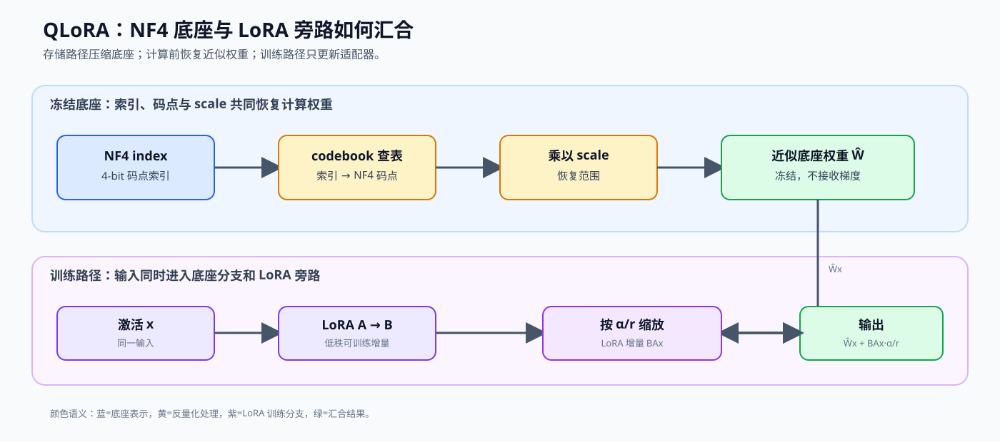

# 26. QLoRA and 4bit Quantization | QLoRA 与 4-bit 量化

**难度：** Hard | **环境：** CPU-first | **标签：** `量化压缩`, `QLoRA`, `4-bit` | **目标人群：** 量化压缩学习者

> 🚀 **云端运行环境**
>
> 本章节的实战代码可以点击以下链接在免费 GPU 算力平台上直接运行：
>
> [](https://colab.research.google.com/github/datawhalechina/llm-algo-leetcode/blob/main/02_PyTorch_Algorithms/26_QLoRA_and_4bit_Quantization.ipynb)
> [](https://modelscope.cn/my/mynotebook) *(国内推荐：魔搭社区免费实例)*


---

## 本节导读

微调时，底座模型除了占用权重显存，还会带来梯度、优化器状态和可训练参数的额外开销。QLoRA 将底座压成 4-bit 并冻结，再用少量 LoRA 参数学习任务变化，从而把“底座大小”和“需要更新的参数量”分开处理。

本节沿着一次训练前向观察三个对象：4-bit 底座如何保存，LoRA 旁路如何产生增量，以及两条路径如何合并。学习时重点比较底座压缩、旁路更新和输出误差之间的关系。

学完本节后，你可以继续理解 QLoRA 的训练配置、adapter 交付，以及它与 W8A16、GPTQ / AWQ 部署量化的区别。

**关键词：** `QLoRA`, `NF4`, `LoRA`

---

## 前置阅读

**导语：** 进入本节前，先理解权重压缩如何降低底座成本，再理解 LoRA 旁路如何承担可训练参数。
- [10. LoRA Tutorial | LoRA 教程](./10_LoRA_Tutorial.md)
- [13. End-to-End Fine-Tuning Experiment | 端到端微调实验](./13_End_to_End_Fine_Tuning_Experiment.md)
- [25. W8A16 Quantization | W8A16 量化](./25_Quantization_W8A16.md)
- [P1: 21. Quantization Theory and INT4/INT8 | 量化理论与 INT4/INT8](../01_Hardware_Math_and_Systems/21_Quantization_Theory_and_INT4_INT8.md)
- [P1: 06. VRAM Calculation and ZeRO | 显存计算与 ZeRO 优化](../01_Hardware_Math_and_Systems/06_VRAM_Calculation_and_ZeRO.md)
- [P1: 12. TensorCore and Mixed Precision | Tensor Core 与混合精度](../01_Hardware_Math_and_Systems/12_TensorCore_and_Mixed_Precision.md)

---

### Step 1: QLoRA 如何组织底座与训练分支

QLoRA 面向显存受限的参数高效微调：底座权重压缩为 4-bit 并冻结，LoRA 旁路保留少量可训练参数。一次前向的输入是激活 `x`、压缩底座权重和 LoRA 参数，输出是底座结果与适配器增量合并后的结果；反向时主要更新 LoRA 参数。4-bit 只描述底座的存储表示，激活、LoRA 梯度和 optimizer state 仍需要各自的精度与显存账本。
先区分每个对象在存储、计算和训练中的角色，再沿着主图观察底座路径与训练路径如何汇合。

| 参与对象 | 存储或计算方式 | 是否更新 | 在训练流中的作用 |
|---|---|---|---|
| 底座权重 `W` | NF4 索引，前向时查表恢复 | 冻结 | 提供压缩后的基础模型能力 |
| NF4 码点与 scale | 查表和缩放信息 | 不作为训练参数 | 把 4-bit 表示还原为计算权重 |
| LoRA 旁路 `A、B` | 高精度低秩矩阵 | 更新 | 学习任务相关的权重变化 |
| LoRA optimizer state | 仅为 `A、B` 保存的一阶 / 二阶状态 | 随 adapter 更新 | 不应误计为冻结底座的训练状态 |
| 前向输出 | `W_nf4 x` 与 `BAx` 合并 | 由 LoRA 梯度驱动 | 同时利用底座能力与微调增量 |


### Step 2: NF4 如何用 4-bit 码点表示权重
NF4 的核心是一个预计算的 16 码点 lookup table。它基于标准正态分布的 CDF / 分位数函数（quantile function）构造，使码点在 0 附近更密集、在尾部更稀疏，因此比均匀 4-bit 更贴合神经网络权重的统计特性。

从直观上看，INT4 是"均匀铺点"，而 NF4 是"按概率密度聚集铺点"：权重出现概率高的区域（靠近 0）码点更密，尾部区域码点更疏。

其码点构造可概括为：

$$
q_i = \Phi^{-1}(p_i), \quad p_i = \frac{i - 0.5}{16}, \quad i = 1,2,\dots,16
$$

其中 $\Phi$ 表示标准正态分布的累积分布函数（CDF），$\Phi^{-1}$ 是其反函数（分位数函数）。实际实现中，这些码点会预先计算并存为 lookup table。

例如，一个权重值先被归一化为 `0.20`，再映射到最接近的 NF4 码点 `0.161`，最后乘以该分组的 scale 恢复近似权重。这个例子说明 NF4 保存的是索引，真正的浮点值来自“码点 × scale”。Double Quantization 还可以进一步压缩 scale 等量化元数据；它属于 NF4 存储路径的扩展，不改变“底座冻结、LoRA 更新”的训练分工。它降低的是 scale 的驻留成本，不会自动降低 activation、LoRA 梯度或 optimizer state 的峰值。

| 表示方式 | 码点来源 | 码点分布 | 对微调的意义 |
|---|---|---|---|
| INT4 | 等间隔整数码点 | 均匀铺点 | 实现简单，但不一定贴合权重分布 |
| NF4 | 标准正态分布分位点 | 0 附近更密、尾部更疏 | 在相同 4-bit 索引下更贴近常见权重分布 |
| NF4 + Double Quantization | NF4 码点与再次量化的 scale | 权重和元数据都压缩 | 进一步降低底座存储开销 |
### Step 3: NF4 反量化、LoRA 前向与训练状态
NF4 码点负责压缩底座表示；本步继续追踪它们如何进入一次前向：先用索引查表得到近似底座权重，再与 LoRA 旁路产生的低秩增量合并。

底座路径和旁路路径的关系可以写成：

$$
(x A^\top) B^\top \cdot \mathrm{scaling}
$$

其中 $W_{NF4}$ 在反向传播中保持冻结，$A$ 和 $B$ 承担可训练更新。下面的表格把表示、计算和梯度流向对应起来。

| 前向环节 | 使用的表示 | 产生的结果 | 梯度归属 |
| --- | --- | --- | --- |
| 查表与缩放 | NF4 index、codebook、scale | 近似底座权重 `Ŵ` | 底座保持冻结 |
| 底座计算 | `Ŵ` 与激活 `x` | `Ŵx` | 不更新底座 index |
| LoRA 旁路 | 高精度 `A`、`B`、`α/r` | `BAx · α/r` | 更新 `A`、`B` |
| 输出合并 | 底座结果 + LoRA 增量 | 训练输出 | 反向主要经过 LoRA |


### Step 4：实现并验证 QLoRA 前向路径

题目区模拟一次 QLoRA 前向：NF4 索引先经查表和 scale 恢复近似底座权重，再与 LoRA 的低秩增量合并。两个 TODO 分别负责这两条路径；测试随后检查码点、输出、冻结底座和 LoRA 梯度。

| TODO | 实现对象 | 机制责任 | 关键测试 |
|:---|:---|:---|:---|
| TODO 1 | NF4 底座路径 | 把 0–15 的 index 查表并乘 scale，恢复近似底座权重 | 索引 dtype、恢复形状、有限值 |
| TODO 2 | LoRA 旁路与合并 | 分别计算底座输出和低秩增量，再按 scaling 合并 | 输出参考式、旁路贡献、梯度流向 |
| TODO 3 | `qlora_trainable_state_ledger` | 区分冻结底座存储与 adapter / optimizer state | 可训练参数、base bytes、optimizer bytes |
| 骨架状态 | buffer 与参数 | 底座状态冻结，`lora_A/B` 可训练 | base 无梯度、adapter 有梯度 |


```python
import torch
import torch.nn as nn
import torch.nn.functional as F
```


```python
# 题目区只挖空两个机制：NF4 查表恢复底座，以及 LoRA 旁路与输出合并。
# 码点、冻结 buffer 和可训练 adapter 的初始化由骨架提供。

def create_nf4_lookup_table() -> torch.Tensor:
    """返回教学用的 16 个 NF4 近似码点。"""
    nf4_values = [
        -1.0, -0.696, -0.525, -0.395, -0.284, -0.185, -0.091, 0.0,
        0.080, 0.161, 0.246, 0.338, 0.441, 0.563, 0.723, 1.0,
    ]
    return torch.tensor(nf4_values)


class QLoRALinearSim(nn.Module):
    """用 INT8 索引模拟 NF4 底座，并用 LoRA 参数学习增量。"""

    def __init__(self, in_features: int, out_features: int, r: int = 8, alpha: float = 16.0):
        super().__init__()
        self.register_buffer('weight_nf4_indices', torch.randint(0, 16, (out_features, in_features), dtype=torch.int8))
        self.register_buffer('weight_scale', torch.tensor(1.0))
        self.register_buffer('nf4_table', create_nf4_lookup_table())
        self.lora_A = nn.Parameter(torch.randn(r, in_features) * 0.01)
        self.lora_B = nn.Parameter(torch.zeros(out_features, r))
        self.register_buffer('scaling', torch.tensor(alpha / r))

    def forward(self, x: torch.Tensor) -> torch.Tensor:
        """计算冻结 NF4 底座输出与可训练 LoRA 增量的和。"""
        # TODO 1（NF4 查表）：索引必须转为 long，再从 nf4_table 取值并乘 weight_scale。
        # indices = ???                  # dtype 为 torch.long，shape 与 weight_nf4_indices 相同。
        # dequantized_base_weight = ???  # shape 为 [out_features, in_features]。

        # TODO 2（LoRA 旁路）：底座和低秩旁路分别计算，再用 scaling 合并。
        # base_out = ???  # 使用 F.linear(x, dequantized_base_weight)。
        # lora_out = ???  # 依次经过 lora_A、lora_B，并乘 self.scaling。
        return base_out + lora_out


def qlora_trainable_state_ledger(
    layer: QLoRALinearSim, *, optimizer_bytes_per_parameter: int = 8
) -> dict[str, int]:
    """Separate frozen NF4 base storage from trainable adapter state.""
    if optimizer_bytes_per_parameter <= 0:
        raise ValueError('optimizer_bytes_per_parameter must be positive')
    # TODO 3（训练状态账本）：只统计可训练 LoRA 参数及其 optimizer state。
    # trainable_parameters = ???  # 只累加 requires_grad=True 的参数。
    # base_storage_bytes = ???    # NF4 index 与 scale 的驻留字节，不计为可训练状态。
    # optimizer_state_bytes = ??? # trainable_parameters × optimizer_bytes_per_parameter。
    return {
        'trainable_parameters': trainable_parameters,
        'base_storage_bytes': base_storage_bytes,
        'optimizer_state_bytes': optimizer_state_bytes,
    }

```


```python
def _build_qlora_fixture():
    """构造固定 NF4 index、scale 与 LoRA 参数，供各机制测试复用。"""
    layer = QLoRALinearSim(in_features=4, out_features=3, r=2, alpha=8.0)
    with torch.no_grad():
        layer.weight_nf4_indices.copy_(torch.tensor([
            [0, 1, 2, 3], [4, 5, 6, 7], [8, 9, 10, 11],
        ], dtype=torch.int8))
        layer.weight_scale.copy_(torch.tensor(0.5))
        layer.lora_A.copy_(torch.tensor([
            [0.1, 0.2, 0.3, 0.4], [0.5, 0.6, 0.7, 0.8],
        ], dtype=layer.lora_A.dtype))
        layer.lora_B.copy_(torch.tensor([
            [0.9, -0.1], [0.2, 0.3], [-0.4, 0.7],
        ], dtype=layer.lora_B.dtype))
    return layer


# 机制测试：分别检查码点表示、旁路贡献、冻结约束和前向等价性。
def test_nf4_lookup_and_dequantization():
    """验证 NF4 表包含 16 个有限码点，并能恢复对应权重形状。"""
    table = create_nf4_lookup_table()
    assert table.shape == (16,)
    assert table[0] < 0 < table[-1]
    layer = _build_qlora_fixture()
    restored = layer.nf4_table[layer.weight_nf4_indices.long()] * layer.weight_scale
    assert restored.shape == layer.weight_nf4_indices.shape
    assert torch.isfinite(restored).all()


def test_lora_branch_contract():
    """验证 LoRA 旁路确实改变底座输出且保持输出形状。"""
    layer = _build_qlora_fixture()
    x = torch.tensor([[[0.1, -0.2, 0.3, -0.4], [0.5, 0.6, -0.7, 0.8]]])
    base_weight = layer.nf4_table[layer.weight_nf4_indices.long()] * layer.weight_scale
    base_out = F.linear(x, base_weight)
    out = layer(x)
    assert out.shape == (1, 2, 3)
    assert not torch.allclose(out, base_out, atol=1e-6)


def test_qlora_trainable_state_ledger_contract():
    """验证底座驻留与 LoRA 训练状态不能混为同一账本。"""
    layer = _build_qlora_fixture()
    ledger = qlora_trainable_state_ledger(layer, optimizer_bytes_per_parameter=8)
    expected_trainable = layer.lora_A.numel() + layer.lora_B.numel()
    assert ledger['trainable_parameters'] == expected_trainable
    assert ledger['optimizer_state_bytes'] == expected_trainable * 8
    assert ledger['base_storage_bytes'] > 0


def test_frozen_base_gradient_contract():
    """验证梯度流向 LoRA 参数，而不是 NF4 底座状态。"""
    layer = _build_qlora_fixture()
    x = torch.randn(1, 2, 4, requires_grad=True)
    layer(x).sum().backward()
    assert x.grad is not None
    assert layer.lora_A.grad is not None
    assert layer.lora_B.grad is not None
    assert not layer.weight_nf4_indices.requires_grad
    assert layer.weight_nf4_indices.grad is None
    assert layer.weight_scale.grad is None


def test_qlora_output_contract():
    """验证实现输出与显式底座加 LoRA 参考式一致。"""
    layer = _build_qlora_fixture()
    x = torch.randn(1, 2, 4)
    out = layer(x)
    reference_weight = layer.nf4_table[layer.weight_nf4_indices.long()] * layer.weight_scale
    reference = F.linear(x, reference_weight) + (x @ layer.lora_A.T) @ layer.lora_B.T * layer.scaling
    assert torch.allclose(out, reference, atol=1e-5)


def run_qlora_tests():
    """依次运行 NF4、LoRA 旁路、梯度和输出契约测试。"""
    for test in (
        test_nf4_lookup_and_dequantization,
        test_lora_branch_contract,
        test_qlora_trainable_state_ledger_contract,
        test_frozen_base_gradient_contract,
        test_qlora_output_contract,
    ):
        test()
    print('✅ QLoRA 机制测试通过：NF4、LoRA 旁路、冻结基座与梯度流向均已验证。')


run_qlora_tests()

```

## 参考代码与解析

### 代码

```python
def create_nf4_lookup_table() -> torch.Tensor:
    """返回教学用的 16 个 NF4 近似码点。"""
    nf4_values = [
        -1.0, -0.696, -0.525, -0.395, -0.284, -0.185, -0.091, 0.0,
        0.080, 0.161, 0.246, 0.338, 0.441, 0.563, 0.723, 1.0,
    ]
    return torch.tensor(nf4_values)


class QLoRALinearSim(nn.Module):
    """用 INT8 索引模拟 NF4 底座，并用 LoRA 参数学习增量。"""

    def __init__(self, in_features: int, out_features: int, r: int = 8, alpha: float = 16.0):
        super().__init__()
        self.register_buffer('weight_nf4_indices', torch.randint(0, 16, (out_features, in_features), dtype=torch.int8))
        self.register_buffer('weight_scale', torch.tensor(1.0))
        self.register_buffer('nf4_table', create_nf4_lookup_table())
        self.lora_A = nn.Parameter(torch.randn(r, in_features) * 0.01)
        self.lora_B = nn.Parameter(torch.zeros(out_features, r))
        self.register_buffer('scaling', torch.tensor(alpha / r))

    def forward(self, x: torch.Tensor) -> torch.Tensor:
        """计算冻结 NF4 底座输出与可训练 LoRA 增量的和。"""
        # TODO 1：用 long index 查表并恢复近似底座权重。
        indices = self.weight_nf4_indices.long()
        dequantized_base_weight = self.nf4_table[indices] * self.weight_scale

        # TODO 2：分别计算底座与 LoRA 旁路，再按 scaling 合并。
        base_out = F.linear(x, dequantized_base_weight)
        lora_out = (x @ self.lora_A.T) @ self.lora_B.T * self.scaling
        return base_out + lora_out


def qlora_trainable_state_ledger(
    layer: QLoRALinearSim, *, optimizer_bytes_per_parameter: int = 8
) -> dict[str, int]:
    """TODO 3：只把 LoRA 参数及其 optimizer state 计入训练状态。"""
    if optimizer_bytes_per_parameter <= 0:
        raise ValueError('optimizer_bytes_per_parameter must be positive')
    trainable_parameters = sum(parameter.numel() for parameter in layer.parameters() if parameter.requires_grad)
    base_storage_bytes = (
        layer.weight_nf4_indices.numel() * layer.weight_nf4_indices.element_size()
        + layer.weight_scale.numel() * layer.weight_scale.element_size()
    )
    optimizer_state_bytes = trainable_parameters * optimizer_bytes_per_parameter
    return {
        'trainable_parameters': trainable_parameters,
        'base_storage_bytes': base_storage_bytes,
        'optimizer_state_bytes': optimizer_state_bytes,
    }

```

### 解析

**TODO 1：从 NF4 index 恢复底座权重**

- `weight_nf4_indices` 保存的是 0–15 的码点索引，不是可直接参与矩阵乘法的浮点权重。
- PyTorch 查表要求 `long` index；查表结果再乘 `weight_scale`，得到与原权重形状相同的近似底座权重。
- 这个底座放在 buffer 中，不参与梯度更新。

**TODO 2：计算 LoRA 旁路并合并**

- 底座路径用 `F.linear(x, dequantized_base_weight)`；旁路先投影到秩 `r` 的空间，再投影回输出维度。
- `scaling = alpha / r` 控制旁路增量的幅度。测试将合并输出与显式参考式比较，并检查 `lora_A/B` 有梯度而底座状态没有梯度。

**把模拟与真实训练连接起来**

- 本题用一个 scale 和 INT8 索引讲清查表关系；真实 QLoRA 通常按块保存 4-bit 权重与 scale，并可对量化元数据做 double quantization。
- 因此本题的输出正确性说明“底座冻结 + LoRA 更新”的机制成立；实际显存、吞吐和 adapter 交付请在 Step 5 的 bitsandbytes smoke 中复测。

### Step 5：可选 GPU 实验——验证 NF4 底座与 adapter 交付

#### 5.1 环境、训练/评测样本与 adapter 配置

实验使用 bitsandbytes 加载 NF4 底座、PEFT 注入 LoRA，并用 Transformers Trainer 完成少量更新。训练样本与评测样本分开，结果不仅检查“训练能跑”，还检查 eval loss、峰值显存以及 adapter 保存后能否重新加载。

| 对象 | 固定配置 | 验证目标 |
|---|---|---|
| 底座 | NF4 + double quant | 低比特 checkpoint 能否进入训练路径 |
| 可训练参数 | `q_proj` / `v_proj` LoRA | 只更新 adapter 参数 |
| 评测 | 独立短文本 | 训练前后 eval loss 是否可比较 |
| 交付物 | adapter + tokenizer + JSON | 保存与重新加载是否闭环 |


```python
# 5.1 只定义模型、数据与 adapter 配置；默认不下载模型、不启动训练。
from pathlib import Path

RUN_MODE = "dry_run"  # dry_run / real_gpu
MODEL_ID = "Qwen/Qwen2.5-0.5B-Instruct"
TRAIN_TEXTS = [
    "Explain why NF4 reduces the storage cost of a frozen model.",
    "Describe how a LoRA adapter changes a quantized base model.",
]
EVAL_TEXTS = ["Why can QLoRA train adapters without updating the NF4 base weights?"]
MAX_LENGTH = 64
TRAIN_BATCH_SIZE = 1
MAX_STEPS = 2
LEARNING_RATE = 2e-4
LORA_RANK = 8
LORA_ALPHA = 16
LORA_DROPOUT = 0.05
RUN_LABEL = "default"  # 修改标签可保留多次 adapter 复测结果
OUTPUT_DIR = Path("benchmarks/results/26_qlora_gpu_smoke") / RUN_LABEL
OUTPUT_JSON = OUTPUT_DIR / "qlora_gpu_smoke.json"
ADAPTER_DIR = OUTPUT_DIR / "adapter"

```

#### 5.2 执行 QLoRA smoke 并保存 adapter

真实模式先准备 k-bit 训练，再注入 LoRA；训练前后在独立样本上计算 eval loss，最后保存并重新加载 adapter。依赖、显卡或复载失败会进入结构化 `failure` 字段。


```python
# 5.2 使用 bitsandbytes、PEFT 与 Transformers 完成真实 QLoRA smoke。
import importlib.metadata
import json
import platform
import time

import torch


def package_version(name):
    """读取依赖版本；缺失时返回 None。"""
    try:
        return importlib.metadata.version(name)
    except importlib.metadata.PackageNotFoundError:
        return None


result = {
    "schema_version": "quantization-mechanism-gpu/v2",
    "chapter": "26",
    "run_mode": RUN_MODE,
    "framework": {
        "python": platform.python_version(),
        "torch": torch.__version__,
        "transformers": package_version("transformers"),
        "peft": package_version("peft"),
        "bitsandbytes": package_version("bitsandbytes"),
        "datasets": package_version("datasets"),
    },
    "hardware": {
        "cuda_available": torch.cuda.is_available(),
        "cuda": torch.version.cuda,
        "device": torch.cuda.get_device_name(0) if torch.cuda.is_available() else None,
    },
    "workload": {
        "model_id": MODEL_ID,
        "train_samples": len(TRAIN_TEXTS),
        "eval_samples": len(EVAL_TEXTS),
        "max_length": MAX_LENGTH,
        "batch_size": TRAIN_BATCH_SIZE,
        "steps": MAX_STEPS,
    },
    "baseline": {"name": "nf4_base_before_adapter_update"},
    "candidate": {
        "name": "nf4_base_plus_lora_adapter",
        "quant_type": "nf4",
        "double_quant": True,
        "lora_rank": LORA_RANK,
        "lora_alpha": LORA_ALPHA,
        "lora_dropout": LORA_DROPOUT,
    },
    "artifact": {"adapter_path": str(ADAPTER_DIR)},
    "failure": None,
    "evidence_level": "environment_preflight",
    "decision": "ready_to_measure",
}

if RUN_MODE == "real_gpu":
    try:
        if not torch.cuda.is_available():
            raise RuntimeError("RUN_MODE=real_gpu 但 CUDA 不可用")
        if ADAPTER_DIR.exists():
            raise FileExistsError(
                f"adapter 目录已存在：{ADAPTER_DIR}；请修改 RUN_LABEL 后复测"
            )

        from datasets import Dataset
        from peft import (
            LoraConfig,
            PeftModel,
            get_peft_model,
            prepare_model_for_kbit_training,
        )
        from transformers import (
            AutoModelForCausalLM,
            AutoTokenizer,
            BitsAndBytesConfig,
            DataCollatorForLanguageModeling,
            Trainer,
            TrainingArguments,
        )

        quant_config = BitsAndBytesConfig(
            load_in_4bit=True,
            bnb_4bit_quant_type="nf4",
            bnb_4bit_use_double_quant=True,
            bnb_4bit_compute_dtype=torch.float16,
        )
        tokenizer = AutoTokenizer.from_pretrained(MODEL_ID, use_fast=True)
        if tokenizer.pad_token is None:
            tokenizer.pad_token = tokenizer.eos_token

        def tokenize_dataset(texts):
            """把固定文本转换为因果语言模型训练/评测数据。"""
            dataset = Dataset.from_dict({"text": texts})
            return dataset.map(
                lambda batch: tokenizer(
                    batch["text"],
                    truncation=True,
                    padding="max_length",
                    max_length=MAX_LENGTH,
                ),
                batched=True,
                remove_columns=["text"],
            )

        train_dataset = tokenize_dataset(TRAIN_TEXTS)
        eval_dataset = tokenize_dataset(EVAL_TEXTS)
        model = AutoModelForCausalLM.from_pretrained(
            MODEL_ID,
            quantization_config=quant_config,
            device_map="auto",
        )
        model.config.use_cache = False
        model = prepare_model_for_kbit_training(model)
        model = get_peft_model(
            model,
            LoraConfig(
                r=LORA_RANK,
                lora_alpha=LORA_ALPHA,
                lora_dropout=LORA_DROPOUT,
                target_modules=["q_proj", "v_proj"],
                task_type="CAUSAL_LM",
            ),
        )
        trainable_parameters = sum(
            parameter.numel() for parameter in model.parameters() if parameter.requires_grad
        )
        total_parameters = sum(parameter.numel() for parameter in model.parameters())

        trainer = Trainer(
            model=model,
            train_dataset=train_dataset,
            eval_dataset=eval_dataset,
            data_collator=DataCollatorForLanguageModeling(tokenizer, mlm=False),
            args=TrainingArguments(
                output_dir=str(OUTPUT_DIR / "trainer"),
                per_device_train_batch_size=TRAIN_BATCH_SIZE,
                per_device_eval_batch_size=TRAIN_BATCH_SIZE,
                max_steps=MAX_STEPS,
                learning_rate=LEARNING_RATE,
                logging_steps=1,
                report_to=[],
            ),
        )
        initial_eval_loss = float(trainer.evaluate()["eval_loss"])
        torch.cuda.reset_peak_memory_stats()
        started = time.perf_counter()
        train_output = trainer.train()
        elapsed_ms = (time.perf_counter() - started) * 1000.0
        final_eval_loss = float(trainer.evaluate()["eval_loss"])

        model.save_pretrained(ADAPTER_DIR)
        tokenizer.save_pretrained(ADAPTER_DIR)
        reload_base = AutoModelForCausalLM.from_pretrained(
            MODEL_ID,
            quantization_config=quant_config,
            device_map="auto",
        )
        reloaded_adapter = PeftModel.from_pretrained(reload_base, ADAPTER_DIR).eval()
        adapter_files = sorted(item.name for item in ADAPTER_DIR.iterdir() if item.is_file())
        required_files_present = (
            "adapter_config.json" in adapter_files
            and any(name.startswith("adapter_model") for name in adapter_files)
        )

        result.update({
            "baseline": {**result["baseline"], "eval_loss": initial_eval_loss},
            "candidate": {
                **result["candidate"],
                "eval_loss": final_eval_loss,
                "train_loss": float(train_output.training_loss),
                "elapsed_ms": elapsed_ms,
                "peak_allocated_bytes": int(torch.cuda.max_memory_allocated()),
                "trainable_parameters": trainable_parameters,
                "total_parameters": total_parameters,
            },
            "artifact": {
                "adapter_path": str(ADAPTER_DIR),
                "files": adapter_files,
                "required_files_present": required_files_present,
                "reload_ok": reloaded_adapter is not None,
            },
            "evidence_level": "matched_bitsandbytes_peft_qlora_smoke",
            "decision": "accept" if required_files_present and final_eval_loss <= initial_eval_loss else "tune",
        })
        del model, reload_base, reloaded_adapter
        torch.cuda.empty_cache()
    except Exception as exc:
        result.update({
            "failure": {"type": type(exc).__name__, "message": str(exc)},
            "evidence_level": "failed_real_gpu_attempt",
            "decision": "reject_until_environment_fixed",
        })

OUTPUT_DIR.mkdir(parents=True, exist_ok=True)
OUTPUT_JSON.write_text(json.dumps(result, ensure_ascii=False, indent=2), encoding="utf-8")
print(json.dumps(result, ensure_ascii=False, indent=2))

```

#### 5.3 读取训练与 adapter 结果

读取单元只展示评测损失、可训练参数、显存、交付文件、复载状态和失败证据。


```python
# 5.3 只读取 5.2 保存的 JSON，不重新启动训练。
if OUTPUT_JSON.exists():
    saved = json.loads(OUTPUT_JSON.read_text(encoding="utf-8"))
    keys = (
        "framework", "hardware", "workload", "baseline", "candidate",
        "artifact", "failure", "evidence_level", "decision",
    )
    print({key: saved.get(key) for key in keys})
else:
    print(f"等待 QLoRA smoke 结果：{OUTPUT_JSON}")

```

#### 5.4 解释训练、资源与交付结果

QLoRA smoke 的通过条件不只是 loss 能反向传播：底座必须保持低比特加载、可训练参数必须集中在 adapter、独立 eval loss 应可解释，并且交付文件能够重新加载。

| 观察项 | 读取字段 | 判断问题 |
|---|---|---|
| 训练效果 | `baseline.eval_loss`、`candidate.eval_loss` | 少量更新是否沿预期方向变化 |
| 参数责任 | `trainable_parameters` / `total_parameters` | 是否只训练 adapter |
| 资源代价 | `elapsed_ms`、`peak_allocated_bytes` | 当前环境能否承担 QLoRA |
| 交付闭环 | `required_files_present`、`reload_ok` | adapter 是否可保存、可复载 |
| 下一步 | `decision` | accept / tune / reject_until_environment_fixed |

## 相关阅读

- [QLoRA 原论文](https://arxiv.org/abs/2305.14314)
- [Transformers：bitsandbytes quantization](https://huggingface.co/docs/transformers/main/quantization/bitsandbytes)
- [PEFT：LoRA](https://huggingface.co/docs/peft/main/package_reference/lora)
- [62. Instruction Fine-Tuning Project | 指令微调项目](./62_Instruction_Fine_Tuning_Project.md)
