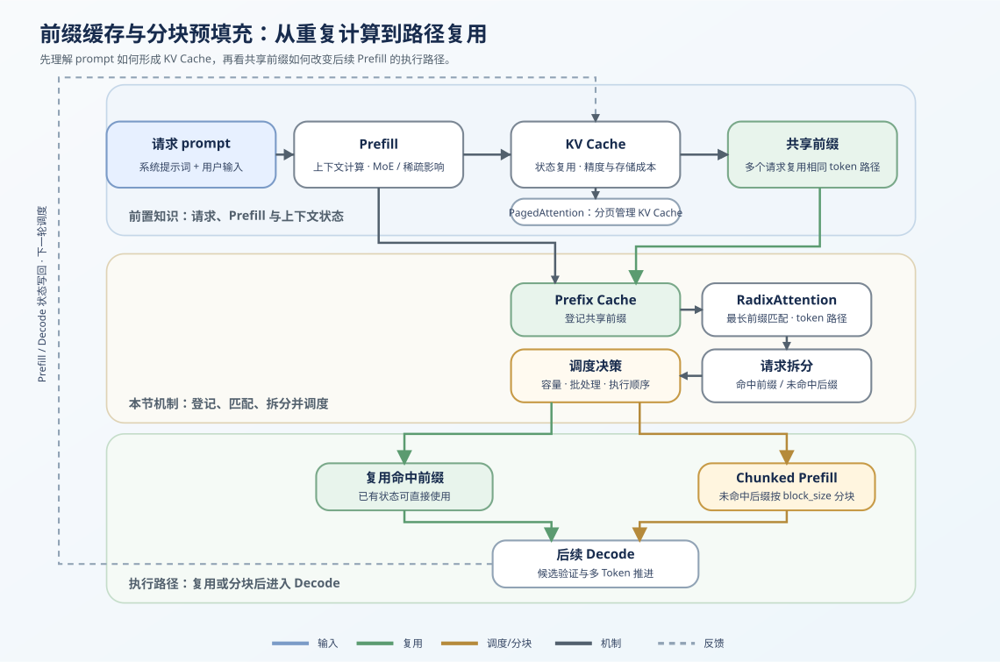
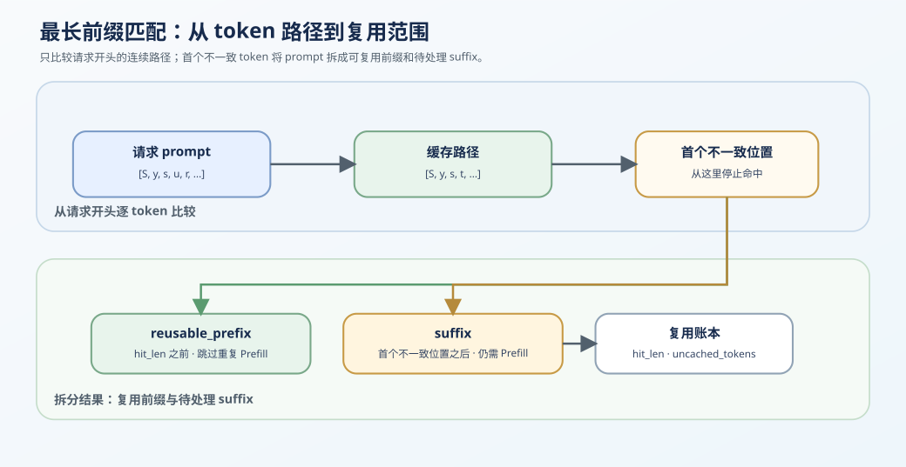

# 34. Prefix Cache Matching and Reuse | Prefix Cache 匹配与复用
**难度：** Hard | **环境：** CPU-first | **标签：** `推理优化`, `KV Cache`, `Prefix Cache` | **目标人群：** 推理优化学习者

> 🚀 **云端运行环境**
>
> 本章节的实战代码可以点击以下链接在免费 GPU 算力平台上直接运行：
>
> [](https://colab.research.google.com/github/datawhalechina/llm-algo-leetcode/blob/main/02_PyTorch_Algorithms/34_Prefix_Cache_Matching_and_Reuse.ipynb)
> [](https://modelscope.cn/my/mynotebook) *(国内推荐：魔搭社区免费实例)*


---

## 本节导读

许多请求会共享 system prompt、工具说明或多轮历史的开头。若每次都重新 Prefill，这段相同输入对应的 KV Cache 会被重复计算；Prefix Cache 的任务是识别这段连续共享前缀，并让后续请求直接复用已有状态。

本节沿着“登记 → 最长匹配 → 复用账本 → 写回新状态”理解前缀缓存。未命中的 suffix 仍需要 Prefill；它如何被切分并与 Decode 协调，放到 [38 Prefill/Decode 调度](./38_Prefill_Decode_Scheduling.md) 继续讨论。

**关键词：** `prefix cache`, `longest-prefix match`, `cache reuse`
## 前置阅读

**导语：** 进入本节前，先能说明 KV Cache 怎样保存已处理 token 的状态；再观察多个请求为何只能复用从开头连续相同的那段输入。

- [P1: 11. KV Cache and Memory Growth | KV Cache 与显存增长](../01_Hardware_Math_and_Systems/11_KV_Cache_and_Memory_Growth.md)
- [22. vLLM PagedAttention | vLLM 分页注意力](./22_vLLM_PagedAttention.md)
- [24. SGLang RadixAttention | SGLang 基数注意力](./24_SGLang_RadixAttention.md)
### Step 1: 共享前缀为什么值得复用

请求经过 Prefill 后形成 KV Cache。若多个请求从开头开始拥有连续相同的 token，这一段状态可以登记到 Prefix Cache；后续请求命中后不必再次计算。第一个不一致 token 之后的内容是本次仍需处理的 suffix。



这张总览图先把请求、KV Cache、Prefix Cache、匹配、拆分和后续执行路径放在同一条概念链上；下面三个 Step 再分别解释匹配范围、复用账本和代码实现。

| 概念 | 它在请求路径中的含义 | 本次请求如何处理 |
|---|---|---|
| 请求 prompt | 可能包含重复的 system prompt、工具说明或历史上下文 | 与已登记路径比较 |
| 共享前缀 | 从 prompt 开头连续相同的 token 区间 | 复用对应 KV Cache 状态 |
| 未命中 suffix | 从第一个不一致 token 开始的剩余内容 | 继续 Prefill 并产生新状态 |
| 新状态 | 本次 suffix 对应的新增 KV Cache | 写回 Prefix Cache 或进入 Decode |

### Step 2: 最长前缀匹配如何确定复用范围

新请求从 prompt 开头逐 token 与缓存路径比较。连续命中的部分可以复用；从第一个不一致 token 开始直到请求末尾的部分称为 suffix。中间位置偶然相同的 token 不构成命中，因为它之前的状态并不一致。

$$



图中只强调匹配机制：连续命中的 `reusable_prefix` 可以跳过重复 Prefill，首个不一致位置之后的 `suffix` 仍需计算；具体调度不在本 Step 展开。
\text{prompt} = \text{reusable\_prefix} + \text{suffix}
$$

| 字段 | 含义 | 后续用途 |
|---|---|---|
| `hit_len` | 从 prompt 开头连续命中的 token 数 | 确定可复用状态范围 |
| `reusable_prefix` | 已缓存且命中的前缀 | 跳过这段 Prefill |
| `suffix` | 首个不一致 token 之后的剩余部分 | 产生本次新增状态 |
| 无命中 | `hit_len = 0` | 整个 prompt 仍需 Prefill |

### Step 3: 用复用账本判断本次新增工作

命中不会让请求“没有计算”，而是把本次工作从完整 prompt 缩为 suffix。先记录命中 token、未命中 token 和复用比例，才能把 Prefix Cache 的作用与后续的容量、淘汰和调度问题区分开。

| 账本字段 | 含义 | 不能直接推出什么 |
|---|---|---|
| `hit_tokens` | 本次可复用的前缀 token 数 | 真实 KV 显存节省量 |
| `uncached_tokens` | 仍需执行 Prefill 的 suffix 长度 | GPU 延迟或吞吐收益 |
| `reuse_ratio` | `hit_tokens / prompt_tokens` | 不同 workload 下的命中率 |
| 新增状态 | suffix 计算后写入的 KV Cache | 何时淘汰或迁移 |

Chunked Prefill 处理的是 suffix 如何分块参与批次和调度，而不是前缀是否命中；下一节 [38](./38_Prefill_Decode_Scheduling.md) 会承接这段未命中工作。

### Step 4: 实现匹配、拆分与复用账本

本节用最小 `PrefixCacheManager` 表示前缀登记、最长匹配、请求拆分和复用统计。真实系统还需要将命中范围映射到物理 KV block、引用计数、淘汰策略与跨 worker 生命周期。

| 实现阶段 | 需要完成的内容 | 输出与检查项 |
|---|---|---|
| 统一表示 | 规范 token 输入并拒绝非法值 | 可比较的 token 序列 |
| 前缀登记 | 保存非空且不重复的共享前缀 | 缓存索引稳定 |
| 最长匹配 | 只允许从开头连续命中 | `hit_len` 正确 |
| 请求拆分与账本 | 分出 prefix / suffix 并统计新增工作 | `reuse_ratio` 与 token 数守恒 |


```python
from typing import List, Sequence, Tuple

```


```python
class PrefixCacheManager:
    """登记共享前缀，并计算一次请求可复用与仍需 Prefill 的 token 账本。

    `cached_prefixes` 是逻辑索引；本题不实现真实 KV Tensor、物理 block 或淘汰策略。
    """

    def __init__(self):
        self.cached_prefixes: List[Tuple[int, ...]] = []

    def _normalize(self, tokens: Sequence[int]) -> List[int]:
        # ==========================================
        # TODO 1: 统一 token 表示，便于做前缀匹配
        # 提示：将输入转换为 list，并确认每个 token 都是整数。
        # normalized = ???
        # ==========================================
        return normalized

    def add_prefix(self, prefix_tokens: Sequence[int]) -> None:
        # ==========================================
        # TODO 2: 登记一个可复用的共享前缀
        # 提示：空前缀应拒绝；重复前缀不应重复登记。
        # prefix = ???
        # ==========================================
        if prefix not in self.cached_prefixes:
            self.cached_prefixes.append(prefix)

    def match_prefix(self, prompt_tokens: Sequence[int]) -> int:
        # ==========================================
        # TODO 3: 返回 prompt 能命中的最长缓存前缀长度
        # 提示：只允许从 prompt 开头连续命中，不能把中间子串当作命中。
        # is_match = ???
        # ==========================================
        prompt = self._normalize(prompt_tokens)
        best_len = 0
        for cached_prefix in self.cached_prefixes:
            if len(cached_prefix) > len(prompt):
                continue
            if is_match:
                best_len = max(best_len, len(cached_prefix))
        return best_len

    def split_prompt(self, prompt_tokens: Sequence[int]) -> Tuple[List[int], List[int], int]:
        # ==========================================
        # TODO 4: 拆出可复用前缀和待处理 suffix
        # 提示：hit_len 之前是 reusable_prefix，之后是 suffix。
        # reusable_prefix = ???
        # suffix = ???
        # ==========================================
        prompt = self._normalize(prompt_tokens)
        hit_len = self.match_prefix(prompt)
        return reusable_prefix, suffix, hit_len

    def cache_stats(self, prompt_tokens: Sequence[int]) -> dict:
        """返回 token 级复用账本；不代表真实 KV 显存收益或吞吐。"""
        # ==========================================
        # TODO 5: 统计命中、未命中与复用比例
        # 提示：空 prompt 的 reuse_ratio 定义为 0.0，避免除零。
        # hit_tokens = ???
        # uncached_tokens = ???
        # reuse_ratio = ???
        # ==========================================
        return {'hit_tokens': hit_tokens, 'uncached_tokens': uncached_tokens, 'reuse_ratio': reuse_ratio}
```

### 测试


```python
# 运行此单元格以测试你的实现
def test_prefix_cache_manager():
    try:
        manager = PrefixCacheManager()
        for invalid_prefix in ([], [1, 'bad']):
            try:
                manager.add_prefix(invalid_prefix)
            except (ValueError, TypeError):
                pass
            else:
                raise AssertionError('空前缀或非整数 token 应被拒绝')
        manager.add_prefix([1, 2, 3])
        manager.add_prefix([1, 2, 9])
        manager.add_prefix([1, 2, 3])
        assert manager.cached_prefixes == [(1, 2, 3), (1, 2, 9)]
        assert manager.match_prefix([1, 2, 3, 9]) == 3
        assert manager.match_prefix([1, 2, 9, 8]) == 3
        assert manager.match_prefix([1, 2, 0]) == 0
        prefix, suffix, hit_len = manager.split_prompt([1, 2, 3, 9])
        assert (prefix, suffix, hit_len) == ([1, 2, 3], [9], 3)
        assert manager.cache_stats([1, 2, 3, 9]) == {'hit_tokens': 3, 'uncached_tokens': 1, 'reuse_ratio': 0.75}
        assert manager.cache_stats([]) == {'hit_tokens': 0, 'uncached_tokens': 0, 'reuse_ratio': 0.0}
        print('✅ PrefixCacheManager 测试通过')
    except NotImplementedError:
        raise
    except (AttributeError, NameError, TypeError, ValueError, AssertionError) as error:
        raise NotImplementedError('请先完成 TODO 代码或检查输入契约！') from error


test_prefix_cache_manager()
```

---

🛑 **STOP HERE** 🛑
<br><br><br><br><br><br><br><br><br><br>
> 请先尝试自己完成代码并跑通测试。<br>
> 如果你正在 Colab 中运行，并且遇到困难没有思路，可以向下滚动查看参考答案。
<br><br><br><br><br><br><br><br><br><br>

---

## 参考代码与解析

### 代码


```python
class PrefixCacheManager:
    """登记共享前缀，并计算一次请求可复用与仍需 Prefill 的 token 账本。

    `cached_prefixes` 是逻辑索引；本题不实现真实 KV Tensor、物理 block 或淘汰策略。
    """

    def __init__(self):
        self.cached_prefixes: List[Tuple[int, ...]] = []

    def _normalize(self, tokens: Sequence[int]) -> List[int]:
        # TODO 1: 统一 token 表示，便于做前缀匹配
        normalized = list(tokens)
        if any(not isinstance(token, int) for token in normalized):
            raise TypeError('tokens 必须是整数序列')
        return normalized

    def add_prefix(self, prefix_tokens: Sequence[int]) -> None:
        # TODO 2: 登记一个可复用的共享前缀
        prefix = tuple(self._normalize(prefix_tokens))
        if not prefix:
            raise ValueError('prefix_tokens 不能为空')
        if prefix not in self.cached_prefixes:
            self.cached_prefixes.append(prefix)

    def match_prefix(self, prompt_tokens: Sequence[int]) -> int:
        # TODO 3: 返回 prompt 能命中的最长缓存前缀长度
        prompt = self._normalize(prompt_tokens)
        best_len = 0
        for cached_prefix in self.cached_prefixes:
            if len(cached_prefix) > len(prompt):
                continue
            is_match = prompt[:len(cached_prefix)] == list(cached_prefix)
            if is_match:
                best_len = max(best_len, len(cached_prefix))
        return best_len

    def split_prompt(self, prompt_tokens: Sequence[int]) -> Tuple[List[int], List[int], int]:
        # TODO 4: 拆出可复用前缀和待处理 suffix
        prompt = self._normalize(prompt_tokens)
        hit_len = self.match_prefix(prompt)
        reusable_prefix = prompt[:hit_len]
        suffix = prompt[hit_len:]
        return reusable_prefix, suffix, hit_len

    def cache_stats(self, prompt_tokens: Sequence[int]) -> dict:
        """返回 token 级复用账本；不代表真实 KV 显存收益或吞吐。"""
        # TODO 5: 统计命中、未命中与复用比例
        prompt = self._normalize(prompt_tokens)
        hit_tokens = self.match_prefix(prompt)
        uncached_tokens = len(prompt) - hit_tokens
        reuse_ratio = hit_tokens / len(prompt) if prompt else 0.0
        return {'hit_tokens': hit_tokens, 'uncached_tokens': uncached_tokens, 'reuse_ratio': round(reuse_ratio, 4)}
```

### 解析

**1. 前缀登记与最长匹配**

`PrefixCacheManager` 保存完整的逻辑前缀；登记时拒绝空前缀与非整数 token，避免无意义命中或表示不一致。匹配时只比较 `prompt` 的开头，并在所有候选中返回最长命中长度。

**2. prefix / suffix 拆分**

`hit_len` 之前的 token 对应可复用状态，之后的 `suffix` 仍需执行 Prefill。这个拆分解释了 Prefix Cache 的直接收益：命中越长，本次新增计算的 token 越少；它不等同于显存或吞吐收益。

**3. 复用账本的用途**

`hit_tokens`、`uncached_tokens` 和 `reuse_ratio` 让一次请求的复用范围可检查。真实系统还需要把它们映射到物理 KV block、引用计数、容量上限和淘汰策略；这些状态管理问题分别由 PagedAttention、RadixAttention 与后续 benchmark 承接。

**4. 与 Chunked Prefill 的衔接**

本节只确定“哪些 token 不必重算”。未命中 suffix 如何切分、何时让出 batch、何时进入独立 Prefill 池，属于调度问题，在 [38](./38_Prefill_Decode_Scheduling.md) 中继续。
## 相关阅读

完成前缀登记、最长命中和复用账本后，可以继续阅读物理 KV block 管理、Radix 树复用与真实 benchmark。

- [SGLang 原论文：Efficient Execution of Structured Language Model Programs](https://arxiv.org/abs/2312.07104)
- [vLLM Automatic Prefix Caching 文档](https://docs.vllm.ai/en/latest/features/automatic_prefix_caching.html)
- [24. SGLang RadixAttention | SGLang 基数注意力](./24_SGLang_RadixAttention.md)
- [38. Prefill/Decode 调度](./38_Prefill_Decode_Scheduling.md)
- [69. Prefix Caching Benchmark | 前缀缓存基准](./69_Prefix_Caching_Benchmark.md)