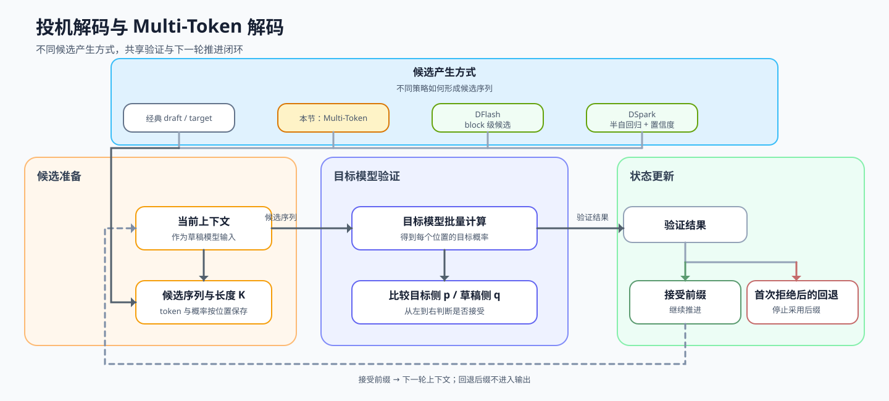

# 35. Multi Token Decoding | 多 Token 投机解码
**难度：** Hard | **环境：** CPU-first | **标签：** `推理优化`, `投机解码`, `Multi-Token Decoding` | **目标人群：** 推理优化学习者

> 🚀 **云端运行环境**
>
> 本章节的实战代码可以点击以下链接在免费 GPU 算力平台上直接运行：
>
> [](https://colab.research.google.com/github/datawhalechina/llm-algo-leetcode/blob/main/02_PyTorch_Algorithms/35_Multi_Token_Decoding.ipynb)
> [](https://modelscope.cn/my/mynotebook) *(国内推荐：魔搭社区免费实例)*


---

## 本节导读

经典投机解码由独立草稿模型提出候选；另一类策略会通过多 token 预测头、多个候选或其他并行路径，在一轮中尝试推进更多 token。它们同样需要验证与回退，但候选来源、验证组织和质量保证方式可能不同。

本节把多 Token 推进作为投机式生成的一条策略分支：先观察候选如何形成，再看连续接受、首次拒绝和回退如何决定有效推进量，最后把候选长度与验证成本放进同一条收益判断。

**关键词：** `multi-token decoding`, `speculative decoding`, `verification`, `rollback`
## 前置阅读

**导语：** 先理解单 token 解码怎样更新状态，以及投机验证怎样按位置推进；再观察一次请求如何在一轮中处理多个候选 token。
- [21. Decoding Strategies | 解码策略](./21_Decoding_Strategies.md)
- [23. Speculative Decoding | 投机解码](./23_Speculative_Decoding.md)

---

### Step 1: 多 Token 推进在投机策略谱系中的位置

多 Token 解码与经典 draft / target 投机解码共享“候选 → 验证 → 有效推进”的骨架，但不要求候选一定来自独立草稿模型。候选可以来自草稿模型、多预测头或多条候选路径；因此先明确候选来源与验证语义，不能把所有实现都默认视为同一种无损采样算法。

| 路径 | 候选来源 | 验证与回退重点 | 阅读入口 |
|---|---|---|---|
| 经典投机解码 | 独立 draft model | 概率接受、residual correction、bonus | [23](./23_Speculative_Decoding.md) |
| 多 Token 推进 | 多 token 候选序列或预测头 | 连续接受、首次拒绝、有效前缀 | 本节 |
| 多候选 / 树验证 | 多条并行候选路径 | 覆盖范围与验证开销 | 扩展概念 |

单 token 解码每轮只推进一个 token，需要反复进入 decoder 并更新 KV Cache。Multi-Token Decoding 先提出一段候选，再由目标模型顺序验证；连续通过的候选可以在同一轮推进，首次拒绝后则回退到更保守的生成路径。

本节先用接受长度和有效推进比例描述一轮到底推进了多少 token，再把验证成本纳入收益判断。这样可以先看清控制流，再理解候选更长并不自动带来端到端收益。

| 参与对象 | 输入 | 输出 | 本节观察重点 |
|---|---|---|---|
| 草稿模型（draft） | 当前上下文 | 候选 token 序列与概率 | 一轮提出多少候选 |
| 目标模型（target） | 候选序列与当前前缀 | 每个候选的验证结果 | 从左到右接受到哪里 |
| 解码状态 | 接受前缀、首次拒绝位置、回退后缀 | 下一轮的有效前缀 | 本轮实际推进多少 token |


### Step 2: 候选序列与验证状态

先固定一轮验证所需的输入和状态，再观察候选如何从提议进入顺序验证。`draft_tokens`、`draft_probs` 和 `target_probs` 分别表示候选 token、草稿概率和目标概率；状态沿着“提议 → 顺序验证 → 首次拒绝 → 切分结果”变化。


| 机制阶段 | 输入 / 状态 | 作用 |
|------|----------|------|
| 提议序列 | 草稿 token 与最大提议长度 | 截取本轮最多可尝试的候选序列 |
| 接受判断 | 草稿概率与目标概率 | 判断单个候选 token 是否可靠 |
| 顺序验证 | 候选序列与当前前缀 | 从左到右验证，首次拒绝后停止 |
| 结果汇总 | 接受前缀、拒绝位置、回退后缀 | 区分可直接推进的 token 与待重新生成的 token |

### Step 3: 连续接受、首次拒绝与有效推进

多 token 解码的收益取决于连续接受长度。若 4 个候选中前 3 个通过验证，本轮就实际推进 3 个 token；若第 1 个被拒绝，则需要回到保守路径。`progress_per_round = accepted_len / len(proposed_tokens)` 表示候选中真正写入输出前缀的比例。

本节用“目标概率达到草稿概率的一定比例”作为教学接受规则；项目 benchmark 可进一步记录 `accepted_tokens_per_round`，并把验证成本纳入比较。

| 参数 | 过大时的问题 | 过小时的问题 |
|------|--------------|--------------|
| `max_proposal_len` | 候选更激进，拒绝和回退概率更高 | 单轮推进短，加速效果有限 |
| `min_accept_ratio` | 接受规则更严格，通过率下降 | 接受规则更宽松，可能引入更大偏差 |


### Step 4: 实现多 Token 解码器

请补全下方 `MultiTokenDecoderSim`，实现一轮候选提议、逐 token 验证、首次拒绝停止和回退后缀切分。这里的回退后缀只标记待丢弃或重新生成的候选，不在本题中真正生成 correction token。
| 实现部分 | TODO 关注点 | 结果检查 |
|---|---|---|
| 候选提议 | 按 `max_proposal_len` 截取候选 | 不超过最大提议长度 |
| 接受判断 | 使用草稿概率、目标概率和 `min_accept_ratio` | 接受结果稳定且可解释 |
| 顺序验证 | 从左到右验证，首次拒绝后停止 | `accepted_tokens` 与拒绝位置一致 |
| 回退切分 | 区分接受前缀和拒绝后缀 | 全部接受时后缀为空 |


```python
from typing import List, Sequence, Tuple
import torch
```


```python
class MultiTokenDecoderSim:
    """教学用的多 token 提议—验证模拟器。

    本类只模拟候选前缀、首次拒绝和回退后缀，不代表真实推理 backend 的
    概率校正、KV Cache 管理或吞吐收益。"""

    def __init__(self, max_proposal_len: int = 4, min_accept_ratio: float = 0.5):
        if not isinstance(max_proposal_len, int) or isinstance(max_proposal_len, bool) or max_proposal_len <= 0:
            raise ValueError("max_proposal_len must be positive")
        if not (0.0 < min_accept_ratio <= 1.0):
            raise ValueError("min_accept_ratio must be in (0, 1]")
        self.max_proposal_len = max_proposal_len
        self.min_accept_ratio = min_accept_ratio
        self.history: List[dict] = []

    def propose(self, draft_tokens: Sequence[int]) -> List[int]:
        """把草稿序列截断为本轮允许验证的候选前缀。

        空序列返回空列表；返回长度不超过 `max_proposal_len`。"""
        # ==========================================
        # TODO 1: 从草稿 token 中生成本轮候选序列
        # 提示：先把 draft_tokens 转成 list，再截取前 max_proposal_len 个 token。
        # 这个结果决定本轮最多验证多少个位置，不要修改输入序列。
        # ==========================================
        # proposed = ???
        return proposed

    def _accept_token(self, draft_prob: float, target_prob: float) -> bool:
        """按教学用概率阈值判断一个候选是否通过验证。

        这里的阈值规则用于观察控制流，不等同于严格的分布保持算法。"""
        # ==========================================
        # TODO 2: 判断单个候选 token 是否被目标模型接受
        # 提示：正常情况下，target_prob 至少要达到
        # draft_prob * min_accept_ratio；draft_prob <= 0 时单独处理，并保持布尔返回值。
        # ==========================================
        if draft_prob <= 0:
            return target_prob > 0
        # accepted = ???
        return accepted

    def verify(
        self,
        draft_probs: torch.Tensor,
        target_probs: torch.Tensor,
        draft_tokens: Sequence[int],
    ) -> Tuple[List[int], int | None]:
        """从左到右验证候选，并在首次拒绝处停止。

        `draft_probs` 和 `target_probs` 的第 i 行对应第 i 个候选位置；
        返回已接受前缀以及首次拒绝的位置。"""
        proposed = self.propose(draft_tokens)
        accepted_tokens: List[int] = []
        rejected_at = None
        draft_probs = torch.as_tensor(draft_probs)
        target_probs = torch.as_tensor(target_probs)

        if draft_probs.ndim != 2 or target_probs.ndim != 2:
            raise ValueError("draft_probs 和 target_probs 必须是二维张量")
        if draft_probs.shape != target_probs.shape or draft_probs.shape[0] < len(proposed):
            raise ValueError("概率矩阵必须具有相同形状，并覆盖所有候选位置")
        vocab_size = draft_probs.shape[1]
        if any(not isinstance(token_id, int) or not 0 <= token_id < vocab_size for token_id in proposed):
            raise ValueError("draft token id 必须是词表范围内的整数")

        for i, token_id in enumerate(proposed):
            draft_prob = float(draft_probs[i, token_id])
            target_prob = float(target_probs[i, token_id])
            # ==========================================
            # TODO 3: 逐个验证候选 token，遇到第一次拒绝就停止
            # 提示：调用 _accept_token 得到 accepted；只有当前 token 被接受才能继续，
            #       第一个拒绝位置写入 rejected_at，并立即停止后续验证。
            # ==========================================
            # accepted = ???

            if accepted:
                accepted_tokens = accepted_tokens + [token_id]
            else:
                rejected_at = i
                break

        return accepted_tokens, rejected_at

    def decode(
        self,
        draft_probs: torch.Tensor,
        target_probs: torch.Tensor,
        draft_tokens: Sequence[int],
    ) -> dict:
        """汇总接受前缀、拒绝位置、回退后缀和本轮推进比例。

        `progress_per_round` 只表示本轮接受比例，不代表真实吞吐提升。"""
        proposed = self.propose(draft_tokens)
        accepted_tokens, rejected_at = self.verify(draft_probs, target_probs, draft_tokens)
        # ==========================================
        # TODO 4: 切出待丢弃或重新生成的回退后缀
        # 提示：rejected_at 为 None 表示全部接受，返回空后缀；否则从 rejected_at 开始切出。
        # ==========================================
        # rejected_suffix = ???

        result = {
            "proposed_tokens": proposed,
            "accepted_tokens": accepted_tokens,
            "accepted_len": len(accepted_tokens),
            # 本轮真正推进的 token 占提议长度的比例，和项目 benchmark 的指标对应
            "progress_per_round": (len(accepted_tokens) / len(proposed)) if proposed else 0.0,
            "rejected_at": rejected_at,
            "rejected_suffix": rejected_suffix,
        }
        self.history.append(result)
        return result

```


```python
def test_multi_token_decoder():
    try:
        sim = MultiTokenDecoderSim(max_proposal_len=3, min_accept_ratio=0.6)
        draft_tokens = [10, 20, 30, 31]
        draft_probs = torch.zeros(4, 40)
        target_probs = torch.zeros(4, 40)

        for i, tok in enumerate(draft_tokens):
            draft_probs[i, tok] = 0.5
            target_probs[i, tok] = 0.8 if i < 2 else 0.2

        assert sim.propose(draft_tokens) == [10, 20, 30]
        assert sim._accept_token(0.5, 0.31) is True
        assert sim._accept_token(0.5, 0.2) is False

        accepted, rejected_at = sim.verify(draft_probs, target_probs, draft_tokens)
        assert accepted == [10, 20]
        assert rejected_at == 2

        result = sim.decode(draft_probs, target_probs, draft_tokens)
        assert result["proposed_tokens"] == [10, 20, 30]
        assert result["accepted_tokens"] == [10, 20]
        assert result["accepted_len"] == 2
        assert result["progress_per_round"] == 2 / 3
        assert result["rejected_at"] == 2
        assert result["rejected_suffix"] == [30]
        assert len(sim.history) == 1

        # 全部接受：本轮推进比例应为 1，且没有回退后缀
        all_target = torch.zeros(4, 40)
        for i, tok in enumerate([10, 20, 30, 31]):
            all_target[i, tok] = 0.8
        all_result = sim.decode(draft_probs, all_target, draft_tokens)
        assert all_result["accepted_len"] == 3
        assert all_result["progress_per_round"] == 1.0
        assert all_result["rejected_at"] is None
        assert all_result["rejected_suffix"] == []

        # 改变提议长度时，推进量应随实际接受前缀变化
        for proposal_len in (1, 2, 4):
            variable_sim = MultiTokenDecoderSim(max_proposal_len=proposal_len, min_accept_ratio=0.6)
            variable_tokens = [10, 20, 30, 31]
            variable_result = variable_sim.decode(draft_probs, all_target, variable_tokens)
            assert variable_result["accepted_len"] == proposal_len
            assert variable_result["progress_per_round"] == 1.0

        print("✅ MultiTokenDecoderSim 测试通过！")
    except NotImplementedError as e:
        raise NotImplementedError("请先完成 TODO 代码！") from e
    except (AttributeError, NameError, TypeError, ValueError, IndexError) as e:
        raise NotImplementedError("请先完成 TODO 代码！") from e
    except AssertionError as e:
        raise AssertionError("测试未通过，请检查提议、验证和回退逻辑。") from e


test_multi_token_decoder()

```

---

🛑 **STOP HERE** 🛑
<br><br><br><br><br><br><br><br><br><br>
> 请先尝试自己完成代码并跑通测试。<br>
> 如果你正在 Colab 中运行，并且遇到困难没有思路，可以向下滚动查看参考答案。
<br><br><br><br><br><br><br><br><br><br>

---

## 参考代码与解析

### 代码


```python
# TODO：下面是题目区的参考实现。

class MultiTokenDecoderSim:
    """教学用的多 token 提议—验证模拟器。

    本类只模拟候选前缀、首次拒绝和回退后缀，不代表真实推理 backend 的
    概率校正、KV Cache 管理或吞吐收益。"""

    def __init__(self, max_proposal_len: int = 4, min_accept_ratio: float = 0.5):
        if not isinstance(max_proposal_len, int) or isinstance(max_proposal_len, bool) or max_proposal_len <= 0:
            raise ValueError("max_proposal_len must be positive")
        if not (0.0 < min_accept_ratio <= 1.0):
            raise ValueError("min_accept_ratio must be in (0, 1]")
        self.max_proposal_len = max_proposal_len
        self.min_accept_ratio = min_accept_ratio
        self.history: List[dict] = []

    def propose(self, draft_tokens: Sequence[int]) -> List[int]:
        """把草稿序列截断为本轮允许验证的候选前缀。

        空序列返回空列表；返回长度不超过 `max_proposal_len`。"""
        # ==========================================
        # TODO 1: 从草稿 token 中生成本轮候选序列
        # 提示：先把 draft_tokens 转成 list，再截取前 max_proposal_len 个 token。
        # 这个结果决定本轮最多验证多少个位置，不要修改输入序列。
        # ==========================================
        proposed = list(draft_tokens)[: self.max_proposal_len]
        return proposed

    def _accept_token(self, draft_prob: float, target_prob: float) -> bool:
        """按教学用概率阈值判断一个候选是否通过验证。

        这里的阈值规则用于观察控制流，不等同于严格的分布保持算法。"""
        # ==========================================
        # TODO 2: 判断单个候选 token 是否被目标模型接受
        # 提示：正常情况下，target_prob 至少要达到
        # draft_prob * min_accept_ratio；draft_prob <= 0 时单独处理，并保持布尔返回值。
        # ==========================================
        if draft_prob <= 0:
            return target_prob > 0
        accepted = target_prob >= draft_prob * self.min_accept_ratio
        return accepted

    def verify(
        self,
        draft_probs: torch.Tensor,
        target_probs: torch.Tensor,
        draft_tokens: Sequence[int],
    ) -> Tuple[List[int], int | None]:
        """从左到右验证候选，并在首次拒绝处停止。

        `draft_probs` 和 `target_probs` 的第 i 行对应第 i 个候选位置；
        返回已接受前缀以及首次拒绝的位置。"""
        proposed = self.propose(draft_tokens)
        accepted_tokens: List[int] = []
        rejected_at = None
        draft_probs = torch.as_tensor(draft_probs)
        target_probs = torch.as_tensor(target_probs)

        if draft_probs.ndim != 2 or target_probs.ndim != 2:
            raise ValueError("draft_probs 和 target_probs 必须是二维张量")
        if draft_probs.shape != target_probs.shape or draft_probs.shape[0] < len(proposed):
            raise ValueError("概率矩阵必须具有相同形状，并覆盖所有候选位置")
        vocab_size = draft_probs.shape[1]
        if any(not isinstance(token_id, int) or not 0 <= token_id < vocab_size for token_id in proposed):
            raise ValueError("draft token id 必须是词表范围内的整数")

        for i, token_id in enumerate(proposed):
            draft_prob = float(draft_probs[i, token_id])
            target_prob = float(target_probs[i, token_id])
            # ==========================================
            # TODO 3: 逐个验证候选 token，遇到第一次拒绝就停止
            # 提示：调用 _accept_token 得到 accepted；只有当前 token 被接受才能继续，
            #       第一个拒绝位置写入 rejected_at，并立即停止后续验证。
            # ==========================================
            accepted = self._accept_token(draft_prob, target_prob)

            if accepted:
                accepted_tokens = accepted_tokens + [token_id]
            else:
                rejected_at = i
                break

        return accepted_tokens, rejected_at

    def decode(
        self,
        draft_probs: torch.Tensor,
        target_probs: torch.Tensor,
        draft_tokens: Sequence[int],
    ) -> dict:
        """汇总接受前缀、拒绝位置、回退后缀和本轮推进比例。

        `progress_per_round` 只表示本轮接受比例，不代表真实吞吐提升。"""
        proposed = self.propose(draft_tokens)
        accepted_tokens, rejected_at = self.verify(draft_probs, target_probs, draft_tokens)
        # ==========================================
        # TODO 4: 切出待丢弃或重新生成的回退后缀
        # 提示：rejected_at 为 None 表示全部接受，返回空后缀；否则从 rejected_at 开始切出。
        # ==========================================
        rejected_suffix = proposed[rejected_at:] if rejected_at is not None else []

        result = {
            "proposed_tokens": proposed,
            "accepted_tokens": accepted_tokens,
            "accepted_len": len(accepted_tokens),
            # 本轮真正推进的 token 占提议长度的比例，和项目 benchmark 的指标对应
            "progress_per_round": (len(accepted_tokens) / len(proposed)) if proposed else 0.0,
            "rejected_at": rejected_at,
            "rejected_suffix": rejected_suffix,
        }
        self.history.append(result)
        return result

```

### 解析

**1. TODO 1: 生成本轮候选序列**
- **实现方式**：`proposed = list(draft_tokens)[: self.max_proposal_len]`
- **关键点**：一次只截取最多 `max_proposal_len` 个候选，避免提议过长导致回退成本过高
- **技术细节**：这里不实现真实采样器，而是用已给定的 `draft_tokens` 模拟草稿模型提出的候选序列

**2. TODO 2: 单 token 接受判断**
- **实现方式**：`accepted = target_prob >= draft_prob * self.min_accept_ratio`
- **关键点**：用目标概率相对草稿概率的比例，近似表示目标模型是否认可这个候选 token
- **技术细节**：`draft_prob <= 0` 的边界分支已经提前返回；正常分支只需要比较 `target_prob` 是否达到接受阈值

**3. TODO 3: 接入逐 token 验证**
- **实现方式**：`accepted = self._accept_token(draft_prob, target_prob)`
- **关键点**：验证循环必须从左到右执行，只有当前 token 被接受，后面的候选才仍然处在正确前缀下
- **技术细节**：接受后的追加逻辑和拒绝后的 `rejected_at + break` 已经给出；一旦首次拒绝，后续候选不能继续直接采用

**4. TODO 4: 切分回退后缀**
- **实现方式**：`rejected_suffix = proposed[rejected_at:] if rejected_at is not None else []`
- **关键点**：`accepted_tokens` 是可以直接写入输出序列的前缀，`rejected_suffix` 是需要丢弃或重新生成的部分
- **技术细节**：当 `rejected_at is None` 时表示本轮候选全部接受，因此回退后缀为空列表

**Multi-Token Decoding 核心机制**
- **单 token 解码的瓶颈**：每次只推进一个 token，会带来频繁的 decoder 调用、kernel 调度和 KV Cache 更新
- **多 token 推进**：草稿路径一次提出多个候选，目标路径验证后尽可能接受连续前缀，从而减少 token-level 往返
- **首次拒绝原则**：候选序列具有前缀依赖，一旦某个位置被拒绝，它之后的候选就不再可靠，需要回退

**工程优化要点**
- **接受率权衡**：提议越长，理论加速空间越大，但被拒绝和回退的概率也越高
- **验证成本**：多 token 解码只有在验证成本低于逐 token 生成成本时才有收益
- **系统联动**：真实实现通常还要和 KV Cache 管理、batch 调度、采样策略和投机解码校正规则一起设计

## 相关阅读

完成候选生成、顺序验证和回退处理后，可以继续比较不同投机式生成路径的候选来源、验证成本与真实 benchmark。

- [Medusa 原论文：Simple LLM Inference Acceleration Framework with Multiple Decoding Heads](https://arxiv.org/abs/2401.10782)
- [Speculative Sampling 原论文](https://arxiv.org/abs/2302.01318)
- [vLLM Speculative Decoding 文档](https://docs.vllm.ai/en/latest/features/spec_decode.html)
- [23. Speculative Decoding | 投机解码](./23_Speculative_Decoding.md)
- [36. Decode Scheduling | Decode 调度](./36_Decode_Scheduling.md)
- [68. Speculative Decoding Benchmark | 投机解码基准](./68_Speculative_Decoding_Benchmark.md)