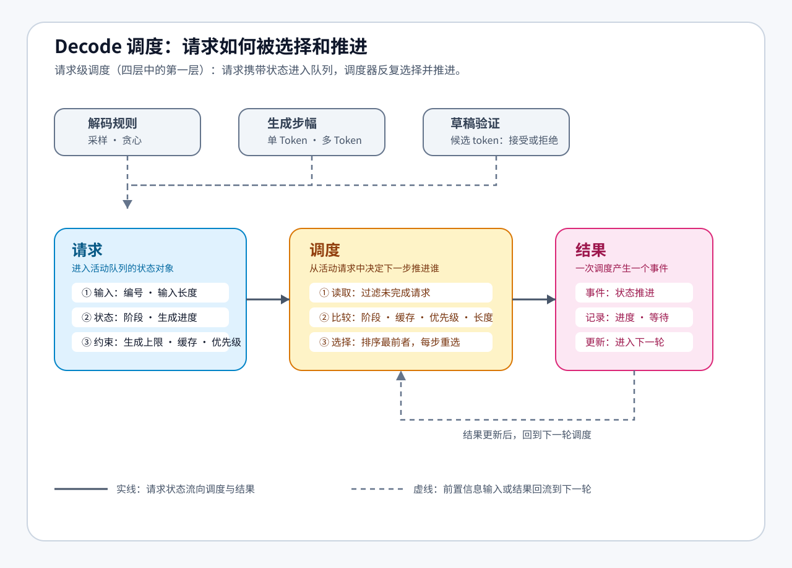

# 36. Decode Scheduling | 解码调度
**难度：** Hard | **环境：** CPU-first | **标签：** `推理优化`, `解码`, `Scheduling` | **目标人群：** 推理优化学习者

> 🚀 **云端运行环境**
>
> 本章节的实战代码可以点击以下链接在免费 GPU 算力平台上直接运行：
>
> [](https://colab.research.google.com/github/datawhalechina/llm-algo-leetcode/blob/main/02_PyTorch_Algorithms/36_Decode_Scheduling.ipynb)
> [](https://modelscope.cn/my/mynotebook) *(国内推荐：魔搭社区免费实例)*


---

## 本节导读

前面几节已经看过投机解码和多 Token 生成。现在把视角从单个请求扩展到一组同时生成的请求：有的刚完成输入处理，有的正在逐 Token 生成，有的即将结束。调度器需要根据这些状态决定下一步推进谁。

本节关注请求状态、选择依据和调度结果之间的关系：同一批请求采用不同的选择规则时，服务顺序、等待时间和生成进度会如何变化。

**关键词：** `decode scheduling`, `prefill`, `batch reordering`

---

## 前置阅读

**导语：** 进入本节前，先能区分请求的 prefill、decode 和完成状态，再观察调度器如何依据状态选择下一步请求。
- [21. Decoding Strategies | 解码策略](./21_Decoding_Strategies.md)
- [23. Speculative Decoding | 投机解码](./23_Speculative_Decoding.md)
- [35. Multi-Token Decoding | 多 Token 解码](./35_Multi_Token_Decoding.md)

---

### Step 1: 多请求为什么需要解码调度

把多个请求放进同一个等待队列后，它们可能处于不同阶段，拥有不同的生成进度、优先级和缓存状态。调度器需要先把这些信息组织成请求状态，再依据选择规则决定下一步推进谁。本节位于四层调度的第一层：请求级调度，关注“这一轮推进哪个请求”，而不是批次如何重组或资源池如何拆分。

调度器选择的不只是请求，还包括一次推进多少工作：普通 Decode 通常推进一个 token，而投机或多 Token 路径可能一次接受一段 token。推进量、等待时间和公平性共同影响服务顺序。

本节先把请求状态、选择依据和调度目标放进同一张表，再沿着状态变化和排序键进入实现。

图中的请求是带有阶段、进度、生成上限和缓存状态的活动对象；调度器每轮从未完成请求中选择一个并推进。草稿验证只作为请求状态中的生成进度来源。

| 观察对象 | 要回答的问题 | 对调度的影响 |
| --- | --- | --- |
| 请求状态 | 请求当前处于哪个生成阶段？ | 决定是否优先完成 `prefill` 或继续 `decode` |
| 选择依据 | 为什么这次选择了某个请求？ | 受到 cache、优先级和总长度影响 |
| 调度目标 | 希望改善哪类服务表现？ | 影响生成进度、响应延迟和公平性 |



### Step 2: 请求状态与生命周期机制

调度前先把一个请求看成一个会变化的状态对象。它从 prefill（处理输入）进入 decode（逐步生成），每次被选中后前进一小步，达到生成上限后离开活动集合；调度器的工作就是反复读取这些状态并推进其中一个请求。

| 机制环节 | 状态或动作 | 机制含义 |
|---|---|---|
| 状态对象 | 输入、阶段、生成进度、生成上限和缓存信息 | 说明请求当前处于什么阶段，还需要生成多少内容 |
| 状态转移 | prefill → decode | 请求完成输入处理，进入逐步生成阶段 |
| 活动集合 | 尚未完成的请求 | 只保留仍需要推进的请求，已完成请求退出队列 |
| 单步推进 | 选中一个请求前进一轮 | 每一轮只推进当前选中的请求，其他请求继续等待 |
| 完成条件 | 达到生成上限 | 请求完成并从活动集合中退出 |

### Step 3: 调度策略与排序优先级

有了请求生命周期，还需要一条选择规则来比较多个活动请求。调度策略把请求阶段、缓存状态、业务优先级和序列长度组织成有先后顺序的排序键；字段越靠前，决策优先级越高，排序键越小的请求越早获得推进机会。

下面的图展示排序字段的优先级，以及第一个不同字段如何决定两个请求的先后。具体字段如何写入 `_schedule_key`，留到 Step 4 的代码实现中完成。


### Step 4: 动手实现与结果观察

**动手任务**：请补全下方 `DecodeSchedulerSim`，跑通“入队 → 排序 → 单步推进 → 持续调度”这条链路。需要完成三个位置：构造请求状态、定义排序键和选择本轮请求；执行步数的更新已经给出，作为 `max_steps` 的防护计数。代码中的检查负责保证输入长度和生成上限有效；这些约束属于调度器的输入契约，不是新的调度策略。

完成代码后，按下面的表格逐项核对事件：先看触发条件，再看状态变化，最后结合排序键解释事件顺序。

| 事件 | 发生条件 | 状态变化 | 观察重点 |
| --- | --- | --- | --- |
| `prefill_to_decode` | 选中的请求仍处于 `prefill` | `phase` 切换为 `decode` | 请求完成输入处理，获得生成资格 |
| `decode_one_step` | 选中的请求处于 `decode`，尚未达到生成上限 | `generated_len` 增加 1 | 当前请求推进一步，其他请求继续等待 |
| `finish` | 生成后达到 `max_new_tokens` | 请求从 active 集合中退出 | 对照完成时间和 `wait_steps`，观察调度公平性 |


```python
from dataclasses import dataclass
from typing import Dict, List, Literal

```


```python
Phase = Literal['prefill', 'decode']


@dataclass
class RequestState:
    """记录一个请求在 prefill/decode 调度过程中的最小状态。"""
    request_id: int
    prompt_len: int
    max_new_tokens: int
    generated_len: int = 0
    phase: Phase = 'prefill'
    priority: int = 0
    cache_hit: bool = False
    wait_steps: int = 0  # 仅用于观察等待，不参与当前排序键

    @property
    def total_len(self) -> int:
        return self.prompt_len + self.generated_len

    @property
    def done(self) -> bool:
        return self.generated_len >= self.max_new_tokens


class DecodeSchedulerSim:
    """用事件序列观察多个请求如何在 prefill 与 decode 之间推进。"""

    def __init__(self):
        self.queue: List[RequestState] = []
        self.timeline: List[Dict[str, int | str]] = []

    def enqueue(self, request_id: int, prompt_len: int, max_new_tokens: int = 2, priority: int = 0, cache_hit: bool = False) -> None:
        """校验并登记请求；请求从 prefill 阶段开始。"""
        if request_id in {item.request_id for item in self.queue}:
            raise ValueError(f'重复的 request_id: {request_id}')
        if prompt_len <= 0 or max_new_tokens <= 0:
            raise ValueError('prompt_len 和 max_new_tokens 必须为正数')
        # ==========================================
        # TODO 1: 构造请求状态，并加入调度队列
        # 提示: RequestState 默认处于 prefill 阶段；分别传入输入长度和生成上限
        # ==========================================
        # request = ???
        self.queue.append(request)

    def _schedule_key(self, req: RequestState) -> tuple[int, int, int, int, int]:
        """返回当前示例策略的排序键；wait_steps 暂不参与排序。"""
        # ==========================================
        # TODO 2: 定义调度排序键
        # 提示: prefill 优先于 decode，cache hit 优先于 cache miss，高 priority 更靠前；
        #       tuple 会按从左到右的顺序比较字段
        # ==========================================
        phase_rank = 0 if req.phase == 'prefill' else 1
        cache_rank = 0 if req.cache_hit else 1
        # key = ???
        return key

    def step(self) -> Dict[str, int | str] | None:
        """选择并推进一个活动请求，同时记录事件和等待步数。"""
        active = [req for req in self.queue if not req.done]
        if not active:
            return None

        # ==========================================
        # TODO 3: 从 active 请求中选择本轮要调度的请求
        # 提示: 使用 min(..., key=self._schedule_key) 选择排序最靠前的请求
        # ==========================================
        # chosen = ???

        for req in active:
            if req is not chosen:
                req.wait_steps += 1

        if chosen.phase == 'prefill':
            chosen.phase = 'decode'
            action = 'prefill_to_decode'
        else:
            chosen.generated_len += 1
            action = 'finish' if chosen.done else 'decode_one_step'

        event = {
            'request_id': chosen.request_id,
            'phase': 'prefill' if action == 'prefill_to_decode' else 'decode',
            'action': action,
            'prompt_len': chosen.prompt_len,
            'generated_len': chosen.generated_len,
            'max_new_tokens': chosen.max_new_tokens,
            'wait_steps': chosen.wait_steps,
        }
        self.timeline.append(event)
        return event

    def run(self, max_steps: int = 100) -> List[Dict[str, int | str]]:
        """持续推进请求，直到全部完成或达到步数上限。"""
        if max_steps < 0:
            raise ValueError('max_steps 不能为负数')
        steps = 0
        while steps < max_steps:
            event = self.step()
            if event is None:
                break
            # 每个成功事件消耗一个调度步；这是 max_steps 的防护计数，不是调度策略。
            steps = steps + 1
        return self.timeline

```


```python
# 测试你的实现
def test_decode_scheduler():
    try:
        sim = DecodeSchedulerSim()
        sim.enqueue(request_id=1, prompt_len=2, max_new_tokens=2, priority=2, cache_hit=True)
        sim.enqueue(request_id=2, prompt_len=3, max_new_tokens=3, priority=1, cache_hit=False)
        sim.enqueue(request_id=3, prompt_len=1, max_new_tokens=1, priority=3, cache_hit=True)

        assert len(sim.queue) == 3
        assert sim.queue[0].phase == 'prefill'
        assert sim.queue[0].prompt_len == 2
        assert sim.queue[0].max_new_tokens == 2
        assert sim._schedule_key(sim.queue[2]) < sim._schedule_key(sim.queue[1])

        # 其他字段相同时，request_id 提供稳定的最终排序
        stable = DecodeSchedulerSim()
        stable.enqueue(request_id=9, prompt_len=4, max_new_tokens=1)
        stable.enqueue(request_id=3, prompt_len=4, max_new_tokens=1)
        assert stable._schedule_key(stable.queue[1]) < stable._schedule_key(stable.queue[0])
        assert stable.step()['request_id'] == 3

        first_event = sim.step()
        assert first_event['request_id'] == 3
        assert first_event['action'] == 'prefill_to_decode'
        assert sim.queue[0].wait_steps == 1 and sim.queue[1].wait_steps == 1
        events = sim.run(max_steps=20)
        assert len(events) == 9
        assert any(e['action'] == 'finish' for e in events)
        assert all(req.done for req in sim.queue)
        assert all(event['max_new_tokens'] >= event['generated_len'] for event in events)
        assert any(event['wait_steps'] > 0 for event in events)

        limited = DecodeSchedulerSim()
        limited.enqueue(request_id=4, prompt_len=8, max_new_tokens=8)
        assert len(limited.run(max_steps=2)) == 2

        invalid = DecodeSchedulerSim()
        try:
            invalid.enqueue(request_id=5, prompt_len=0, max_new_tokens=1)
            raise AssertionError('应拒绝非正 prompt_len')
        except ValueError:
            pass
        invalid.enqueue(request_id=5, prompt_len=1, max_new_tokens=1)
        try:
            invalid.enqueue(request_id=5, prompt_len=1, max_new_tokens=1)
            raise AssertionError('应拒绝重复 request_id')
        except ValueError:
            pass
        try:
            invalid.run(max_steps=-1)
            raise AssertionError('应拒绝负数 max_steps')
        except ValueError:
            pass

        assert sim.timeline is events

        print('✅ DecodeSchedulerSim 测试通过')
    except NotImplementedError as e:
        raise NotImplementedError('请先完成 TODO 代码！') from e
    except NameError as e:
        raise NotImplementedError('请先完成 TODO 代码！') from e


test_decode_scheduler()

```

---

🛑 **STOP HERE** 🛑
<br><br><br><br><br><br><br><br><br><br>
> 请先尝试自己完成代码并跑通测试。<br>
> 如果你正在 Colab 中运行，并且遇到困难没有思路，可以向下滚动查看参考答案。
<br><br><br><br><br><br><br><br><br><br>

---
## 参考代码与解析

### 代码

```python
# TODO：下面是题目区的参考实现。

Phase = Literal['prefill', 'decode']


@dataclass
class RequestState:
    """记录一个请求在 prefill/decode 调度过程中的最小状态。"""
    request_id: int
    prompt_len: int
    max_new_tokens: int
    generated_len: int = 0
    phase: Phase = 'prefill'
    priority: int = 0
    cache_hit: bool = False
    wait_steps: int = 0  # 仅用于观察等待，不参与当前排序键

    @property
    def total_len(self) -> int:
        return self.prompt_len + self.generated_len

    @property
    def done(self) -> bool:
        return self.generated_len >= self.max_new_tokens


class DecodeSchedulerSim:
    """用事件序列观察多个请求如何在 prefill 与 decode 之间推进。"""

    def __init__(self):
        self.queue: List[RequestState] = []
        self.timeline: List[Dict[str, int | str]] = []

    def enqueue(self, request_id: int, prompt_len: int, max_new_tokens: int = 2, priority: int = 0, cache_hit: bool = False) -> None:
        """校验并登记请求；请求从 prefill 阶段开始。"""
        if request_id in {item.request_id for item in self.queue}:
            raise ValueError(f'重复的 request_id: {request_id}')
        if prompt_len <= 0 or max_new_tokens <= 0:
            raise ValueError('prompt_len 和 max_new_tokens 必须为正数')
        # ==========================================
        # TODO 1: 构造请求状态，并加入调度队列
        # 提示: RequestState 默认处于 prefill 阶段；分别传入输入长度和生成上限
        # ==========================================
        request = RequestState(
            request_id=request_id,
            prompt_len=prompt_len,
            max_new_tokens=max_new_tokens,
            priority=priority,
            cache_hit=cache_hit,
        )
        self.queue.append(request)

    def _schedule_key(self, req: RequestState) -> tuple[int, int, int, int, int]:
        """返回当前示例策略的排序键；wait_steps 暂不参与排序。"""
        # ==========================================
        # TODO 2: 定义调度排序键
        # 提示: prefill 优先于 decode，cache hit 优先于 cache miss，高 priority 更靠前；
        #       tuple 会按从左到右的顺序比较字段
        # ==========================================
        phase_rank = 0 if req.phase == 'prefill' else 1
        cache_rank = 0 if req.cache_hit else 1
        key = (phase_rank, cache_rank, -req.priority, req.total_len, req.request_id)
        return key

    def step(self) -> Dict[str, int | str] | None:
        """选择并推进一个活动请求，同时记录事件和等待步数。"""
        active = [req for req in self.queue if not req.done]
        if not active:
            return None

        # ==========================================
        # TODO 3: 从 active 请求中选择本轮要调度的请求
        # 提示: 使用 min(..., key=self._schedule_key) 选择排序最靠前的请求
        # ==========================================
        chosen = min(active, key=self._schedule_key)
        for req in active:
            if req is not chosen:
                req.wait_steps += 1
        if chosen.phase == 'prefill':
            chosen.phase = 'decode'
            action = 'prefill_to_decode'
        else:
            chosen.generated_len += 1
            action = 'finish' if chosen.done else 'decode_one_step'

        event = {
            'request_id': chosen.request_id,
            'phase': 'prefill' if action == 'prefill_to_decode' else 'decode',
            'action': action,
            'prompt_len': chosen.prompt_len,
            'generated_len': chosen.generated_len,
            'max_new_tokens': chosen.max_new_tokens,
            'wait_steps': chosen.wait_steps,
        }
        self.timeline.append(event)
        return event

    def run(self, max_steps: int = 100) -> List[Dict[str, int | str]]:
        """持续推进请求，直到全部完成或达到步数上限。"""
        if max_steps < 0:
            raise ValueError('max_steps 不能为负数')
        steps = 0
        while steps < max_steps:
            event = self.step()
            if event is None:
                break
            # 每个成功事件消耗一个调度步；这是 max_steps 的防护计数，不是调度策略。
            steps = steps + 1
        return self.timeline

```

### 解析

**1. TODO 1: 构造请求状态**
- **实现方式**：`request = RequestState(request_id=request_id, prompt_len=prompt_len, max_new_tokens=max_new_tokens, priority=priority, cache_hit=cache_hit)`
- **关键点**：请求入队时默认处于 `prefill` 阶段，`generated_len` 从 0 开始，`max_new_tokens` 单独记录输出上限
- **技术细节**：`RequestState` 把输入长度、生成上限、阶段、优先级、cache 命中和等待步数收在一起，后续调度只需要读取这个状态对象

**2. TODO 2: 定义调度排序键**
- **实现方式**：`key = (phase_rank, cache_rank, -req.priority, req.total_len, req.request_id)`
- **关键点**：排序键越小越优先，因此 `prefill` 用 0、`decode` 用 1，cache hit 用 0、cache miss 用 1
- **技术细节**：Python 按 tuple 从左到右比较；`-req.priority` 让更高优先级排在前面，`total_len` 和 `request_id` 用作稳定的 tie-breaker

**3. TODO 3: 选择本轮调度请求**
- **实现方式**：`chosen = min(active, key=self._schedule_key)`
- **关键点**：调度器不是按入队顺序直接执行，而是每一步都根据当前状态重新选择最适合推进的请求
- **技术细节**：`active` 已经过滤掉完成请求，`min(..., key=...)` 会把排序规则集中交给 `_schedule_key`；未被选中的 active 请求会累加 `wait_steps`，用于观察等待情况。测试还检查了排序字段完全相同时由 `request_id` 稳定打破平局。

**运行保护：调度步数上限**
- `steps = steps + 1` 是给定的循环保护逻辑，不属于本节需要设计的调度策略。
- 只有 `step()` 返回事件时才增加步数；没有活动请求时立即退出，`max_steps` 用于防止规则异常导致无限循环。

**输入契约与测试**
- `enqueue` 拒绝非正的 `prompt_len` / `max_new_tokens`，也拒绝重复的 `request_id`；`run` 拒绝负数 `max_steps`。这些检查保证状态机收到可解释的输入。
- 测试同时检查请求状态、排序先后、稳定 tie-breaker、首轮等待步数、事件数量、请求完成和上述异常输入；它验证的是状态转移和调度规则，不是 GPU 性能。

**Decode Scheduling 核心机制**
- **阶段差异**：`prefill` 通常一次处理较长输入；`decode` 每次推进少量新 token，但会重复执行多步，因此直接影响 token latency
- **排序规则**：当前规则同时考虑请求阶段、cache 命中、业务优先级和序列长度；它是一个可解释的示例策略，不等同于生产系统的完整调度器
- **状态推进**：一次 prefill 会把请求切到 decode；decode 每执行一步就增加 `generated_len`，直到请求完成

**工程优化要点**
- **吞吐与延迟权衡**：过度追求大 batch 会增加等待时间，过度追求低延迟又会降低 GPU 利用率
- **等待与公平性**：本实现记录 `wait_steps` 作为观察指标，但当前排序键尚未使用它；若某请求长期等待，可进一步设计 aging 或多队列策略
- **真实系统扩展**：生产调度器还会加入 token budget、KV Cache 容量、请求超时、抢占和多队列策略

### Step 5: 可选 GPU 微基准

本步用人工构造的 GPU 矩阵乘法负载比较 FIFO 与本节排序键，观察调度顺序和执行开销。代码不加载大模型，因此不替代真实模型或 vLLM / SGLang Serving 实验。

运行前确认当前 Notebook 内核就是目标 GPU 环境；仓库根目录可执行 `python tools/environment_preflight.py --gpu --packages torch`。本步只依赖 PyTorch CUDA。

配置单元先选择是否运行、dtype、请求规格、重复次数和结果路径；执行单元会自动查找项目根目录、创建 `benchmarks/results/` 并保存 JSON，不需要手动填写绝对路径。真实 Serving 指标和 backend 对比统一在 [70. Serving Scheduler Benchmark](./70_Serving_Scheduler_Benchmark.md) 中验证。

| 实验内容 | 固定或改变的条件 | 观察目的 |
|---|---|---|
| GPU 负载 | 人工构造的矩阵乘法；`GPU_HIDDEN_SIZE` 控制规模 | 观察调度执行的 GPU 时间和峰值显存 |
| 请求集合 | `REQUEST_SPECS` 固定输入长度、生成上限、优先级和缓存状态 | 保持两种策略使用同一批请求 |
| 对照变量 | FIFO vs 本节排序键 | 比较请求完成顺序和等待步数 |
| 运行条件 | dtype、重复次数、随机种子保持一致 | 让结果可以复查 |
| 结果指标 | 总耗时、token/s、完成步、`wait_steps`、峰值显存、OOM | 判断调度代价，不输出 Serving 结论 |
| 证据范围 | 人工构造的 GPU 矩阵乘法微基准 | 不推导 TTFT、TPOT、P50/P99、连续批处理或 backend 结论 |


```python
# Step 5 配置单元：先运行本 cell，再运行下面的 GPU 执行单元。
RUN_GPU_MICROBENCH = False  # False 只检查代码；True 才运行 GPU 并保存结果。
GPU_RESULT_PATH = 'benchmarks/results/36_decode_scheduling_gpu.json'  # 相对项目根目录，无需填写绝对路径。
GPU_REPEATS = 3  # 两种策略使用相同重复次数。
GPU_HIDDEN_SIZE = 512  # 人工构造矩阵的宽度；只改变 workload 时再修改。
GPU_DTYPE = 'float16'  # 可改为 bfloat16，但必须确认硬件原生支持。
GPU_SEED = 42
REQUEST_SPECS = [
    {'request_id': 1, 'prompt_len': 64, 'max_new_tokens': 16, 'priority': 1, 'cache_hit': False},
    {'request_id': 2, 'prompt_len': 128, 'max_new_tokens': 16, 'priority': 2, 'cache_hit': True},
    {'request_id': 3, 'prompt_len': 256, 'max_new_tokens': 16, 'priority': 1, 'cache_hit': False},
]

```


```python
# Step 5 GPU 执行单元：依赖上面的配置单元；默认不启动 GPU。
def _run_gpu_schedule_policy(policy):
    import time
    import torch

    if not torch.cuda.is_available():
        raise RuntimeError('GPU 微基准需要 CUDA；请先切换到 GPU runtime。')
    if GPU_DTYPE not in {'float16', 'bfloat16'}:
        raise ValueError('GPU_DTYPE 只能是 float16 或 bfloat16')
    if GPU_DTYPE == 'bfloat16' and not torch.cuda.is_bf16_supported(including_emulation=False):
        raise RuntimeError('当前 GPU 不支持原生 BF16，请改用 float16。')
    torch.manual_seed(GPU_SEED)
    torch.cuda.manual_seed_all(GPU_SEED)
    device = torch.device('cuda')
    dtype = getattr(torch, GPU_DTYPE)
    weight = torch.randn(GPU_HIDDEN_SIZE, GPU_HIDDEN_SIZE, device=device, dtype=dtype)
    inputs = {spec['request_id']: torch.randn(1, GPU_HIDDEN_SIZE, device=device, dtype=dtype) for spec in REQUEST_SPECS}
    generated = {spec['request_id']: 0 for spec in REQUEST_SPECS}
    wait_steps = {spec['request_id']: 0 for spec in REQUEST_SPECS}
    completion_step = {}
    total_events = sum(spec['max_new_tokens'] + 1 for spec in REQUEST_SPECS)

    for _ in range(2):
        _ = inputs[REQUEST_SPECS[0]['request_id']] @ weight
    torch.cuda.synchronize()
    torch.cuda.reset_peak_memory_stats()
    sim = DecodeSchedulerSim() if policy == 'priority_cache_aware' else None
    if sim is not None:
        for spec in REQUEST_SPECS:
            sim.enqueue(**spec)
    torch.cuda.synchronize()
    start = time.perf_counter()
    for step_index in range(total_events):
        if policy == 'fifo':
            request_id = next(
                spec['request_id'] for spec in REQUEST_SPECS
                if spec['request_id'] not in completion_step
            )
            spec = next(item for item in REQUEST_SPECS if item['request_id'] == request_id)
            if generated[request_id] < spec['max_new_tokens']:
                generated[request_id] += 1
            else:
                completion_step[request_id] = step_index + 1
        else:
            event = sim.step()
            if event is None:
                break
            request_id = event['request_id']
            generated[request_id] = event['generated_len']
            wait_steps[request_id] = event['wait_steps']
            if event['action'] == 'finish':
                completion_step[request_id] = step_index + 1
        _ = inputs[request_id] @ weight
        if policy == 'fifo':
            for other_id in wait_steps:
                if other_id != request_id and other_id not in completion_step:
                    wait_steps[other_id] += 1
    torch.cuda.synchronize()
    elapsed = time.perf_counter() - start
    total_tokens = sum(generated.values())
    return {
        'policy': policy,
        'dtype': GPU_DTYPE,
        'elapsed_ms': round(elapsed * 1000, 3),
        'tokens_per_s': round(total_tokens / elapsed, 3) if elapsed else 0.0,
        'completion_step': completion_step,
        'wait_steps': wait_steps,
        'peak_memory_mb': round(torch.cuda.max_memory_allocated() / (1024 ** 2), 2),
    }

if RUN_GPU_MICROBENCH:
    import json
    from pathlib import Path

    gpu_results = {
        policy: [_run_gpu_schedule_policy(policy) for _ in range(GPU_REPEATS)]
        for policy in ('fifo', 'priority_cache_aware')
    }
    # 自动向上查找包含 benchmarks/ 的项目根目录，兼容从仓库根目录或 Notebook 子目录启动。
    project_root = next((p for p in [Path.cwd(), *Path.cwd().parents] if (p / 'benchmarks').is_dir()), Path.cwd())
    output_path = project_root / GPU_RESULT_PATH
    output_path.parent.mkdir(parents=True, exist_ok=True)
    report = {
        'task': 'decode_scheduling_gpu_microbenchmark',
        'evidence_level': 'synthetic_gpu_microbenchmark',
        'config': {
            'workload': 'synthetic_matmul',
            'request_count': len(REQUEST_SPECS),
            'request_specs': REQUEST_SPECS,
            'hidden_size': GPU_HIDDEN_SIZE,
            'dtype': GPU_DTYPE,
            'repeats': GPU_REPEATS,
            'seed': GPU_SEED,
            'torch': torch.__version__,
            'torch_cuda': torch.version.cuda,
            'device': torch.cuda.get_device_name(0),
        },
        'results': gpu_results,
        'decision': {'decision': 'measure', 'reason': '仅比较人工构造的 GPU 矩阵乘法负载下的调度顺序和执行开销。'},
    }
    output_path.write_text(json.dumps(report, ensure_ascii=False, indent=2), encoding='utf-8')
    print(f'GPU 微基准结果已保存：{output_path}')
    print(json.dumps(report, ensure_ascii=False, indent=2))
else:
    print('GPU 微基准未启动：将 RUN_GPU_MICROBENCH 改为 True 后运行。')

```

#### GPU 实验记录

完成 GPU 执行单元后填写下面这张总表。共同条件写入第三列，FIFO 与本节排序键分别填写对应结果；调整请求规格后新增一组记录，不覆盖已有结果。

| 类别 | 项目 | 共同条件 / 本次配置 | FIFO | 本节排序键 | 说明 |
|---|---|---|---:|---:|---|
| 环境 | GPU 工作负载 | 人工构造的 GPU 矩阵乘法；`GPU_HIDDEN_SIZE` 控制矩阵规模 |  |  | 记录 GPU、PyTorch / CUDA 和矩阵规模 |
| 环境 | dtype | `GPU_DTYPE`；默认 `float16` |  |  | BF16 需确认硬件原生支持 |
| workload | 请求规格 | `REQUEST_SPECS` 固定请求数、输入长度、优先级和 `max_new_tokens` |  |  | 改变请求规格时新增一组记录 |
| workload | 重复与随机性 | `GPU_REPEATS`、`GPU_SEED` |  |  | 两种策略使用相同设置 |
| 结果 | 总耗时（ms） | 预热后重复运行 |  |  | 越低越好，但需结合等待和完成步数 |
| 结果 | 吞吐（token/s） | 固定输出 token 数 |  |  | 仅表示本人工构造负载的执行吞吐 |
| 结果 | 最晚完成步 / 最大 `wait_steps` | 从事件记录计算 |  |  | 观察服务顺序和等待情况 |
| 结果 | 峰值显存（MB） / OOM | 从 CUDA 统计和运行状态记录 |  |  | OOM 时保留失败状态 |
| 结果 | JSON 报告 | `GPU_RESULT_PATH` |  |  | 每组实验使用独立路径 |

## 相关阅读

完成请求状态、选择规则和推进顺序的模拟后，可以继续阅读推理服务调度的论文与真实基准项目。

- [Orca 原论文：A Distributed Serving System for Transformer-Based Generative Models](https://www.usenix.org/conference/osdi22/presentation/yu)
- [vLLM 官方仓库](https://github.com/vllm-project/vllm)
- [37. KV Cache Scheduling | KV Cache 调度](./37_KV_Cache_Scheduling.md)
- [38. Prefill/Decode Scheduling | Prefill/Decode 调度](./38_Prefill_Decode_Scheduling.md)
- [70. Serving Scheduler Benchmark | 服务调度基准项目](./70_Serving_Scheduler_Benchmark.md)
