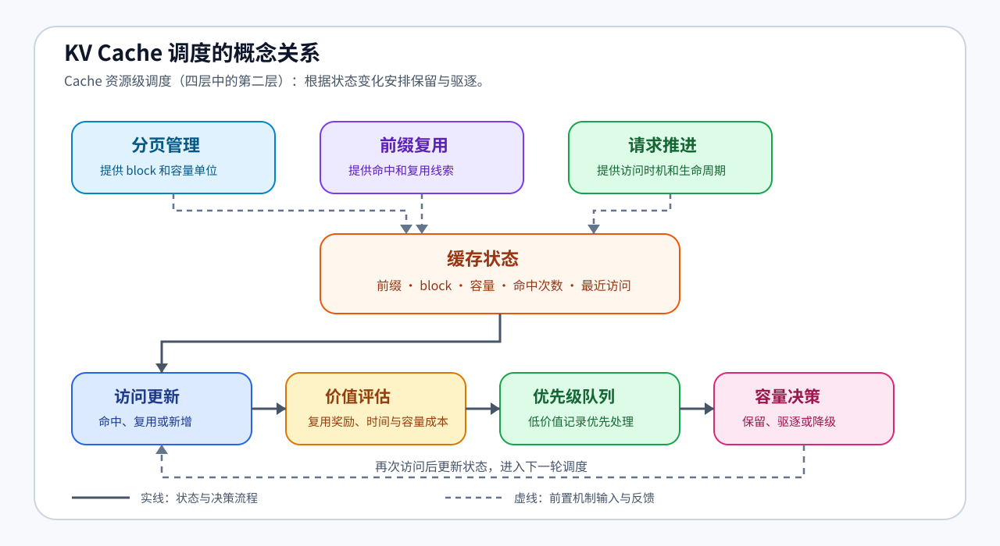

# 37. KV Cache Scheduling | KV Cache 调度
**难度：** Hard | **环境：** CPU-first | **标签：** `推理优化`, `KV Cache`, `调度` | **目标人群：** 推理优化学习者

> 🚀 **云端运行环境**
>
> 本章节的实战代码可以点击以下链接在免费 GPU 算力平台上直接运行：
>
> [](https://colab.research.google.com/github/datawhalechina/llm-algo-leetcode/blob/main/02_PyTorch_Algorithms/37_KV_Cache_Scheduling.ipynb)
> [](https://modelscope.cn/my/mynotebook) *(国内推荐：魔搭社区免费实例)*


---

## 本节导读

当多个请求共享前缀并持续生成时，KV Cache 会同时面临复用和容量压力。调度器需要记录每个缓存的大小、命中次数和最近访问时间，再根据这些状态决定缓存的保留顺序和驱逐顺序。

本节沿着“请求访问 → 缓存状态 → 价值评分 → 优先级队列 → 容量驱逐”的顺序理解 KV Cache 调度。重点是看清访问热度、缓存容量和驱逐顺序之间如何相互影响，并建立从状态变化到调度决策的完整认知链。


**关键词：** `KV Cache 调度`、`缓存复用`、`容量驱逐`

---

## 前置阅读

**导语：** 进入本节前，先能读出一个缓存块的容量、命中和最近访问状态，再观察这些状态如何影响保留与驱逐顺序。
- [22. vLLM PagedAttention | vLLM 分页注意力](./22_vLLM_PagedAttention.md)
- [34. Prefix Cache Matching and Reuse | Prefix Cache 匹配与复用](./34_Prefix_Cache_Matching_and_Reuse.md)
- [36. Decode Scheduling | 解码调度](./36_Decode_Scheduling.md)

---

### Step 1: 为什么 KV Cache 需要调度

多个请求同时生成时，KV Cache 不仅要保存可复用状态，还要在容量有限时决定保留谁、驱逐谁。前缀缓存提供复用线索，分页管理提供可分配的 block，请求访问过程持续更新命中次数和最近访问时间。本节位于四层调度的第二层：Cache 资源级调度，关注“谁还能继续占用状态空间”，不替代 36 的请求选择。

本节的输入是缓存访问事件、单条缓存的大小与访问状态，以及全局容量；输出是可比较的缓存价值、驱逐顺序和容量快照。

| 观察入口 | 发生了什么 | 形成的调度依据 |
|---|---|---|
| 内容复用 | 同一前缀再次被访问 | 命中次数和复用价值 |
| 空间占用 | 新请求需要更多 KV Cache block | 当前容量和驱逐压力 |
| 访问热度 | 命中次数和最近访问不断变化 | 当前缓存价值和优先级 |




### Step 2: 缓存状态与容量账本

先把每段可复用缓存看成一条状态记录，再把所有记录放进同一份容量账本。单条记录描述一个前缀的占用和访问历史，全局字段描述当前容量；这些字段共同决定下一步的保留与驱逐。

| 字段层级 | 记录什么 | 对调度的作用 |
|---|---|---|
| 单条缓存：标识 | prefix 对应的缓存记录 | 判断访问是否命中同一前缀 |
| 单条缓存：大小 | 这段缓存占用多少字节 | 计算新增缓存带来的容量压力 |
| 单条缓存：命中次数 | 该前缀已经复用多少次 | 估计继续保留的复用价值 |
| 单条缓存：最近访问 | 最近一次访问发生的时间 | 反映当前访问热度 |
| 全局账本：容量 | 总容量和当前已分配容量 | 判断何时需要触发驱逐 |

### Step 3: 评分、堆队列与过期记录

Step 2 的状态字段进入价值评估：复用次数体现未来命中机会，最近访问体现当前热度，缓存大小体现容量成本。教学实现把三者合成为一个可比较的保留分数，再交给优先级队列处理：`score = 复用奖励 + 最近访问奖励 - 容量惩罚`。分数变化后不直接修改堆中的旧记录，而是在弹出时核对它是否仍然有效。


| 机制 | 作用 | 设计时关注 |
|---|---|---|
| 评分 | 把缓存价值变成可比较的数字 | 复用、时间和容量共同影响分数 |
| 堆队列 | 让低优先级缓存可以先被找到 | 刷新时追加当前记录，保留可追溯状态 |
| 过期检查（stale check） | 弹出时重新核对当前 entry | 让驱逐依据跟随最新状态 |
| 驱逐 | 容量不足时释放低价值缓存 | 超过容量时选择驱逐或降级路径 |


### Step 4: 实现缓存评分、刷新与驱逐

把前面的状态账本和评分机制落到代码中，再用访问事件复查缓存状态如何变化。实现链是“访问 → 评分 → 队列刷新 → 过期检查 → 驱逐 → 快照”，表格列出各环节的输入、动作和观察重点。

| 实现位置 | 输入或状态 | 应完成的动作 | 测试时观察 |
| --- | --- | --- | --- |
| `_score` | 命中次数、容量、最近访问 | 合成可比较的保留分数 | 复用多、访问近的缓存分数更高 |
| `_refresh_queue` | 当前 entry | 追加最新的评分、时间和前缀 | 历史记录保留，等待弹出时核对 |
| `_evict_until_fit` | 堆顶记录、当前 entry | 核对状态后释放所需容量 | 过期记录跳过，有效低分记录参与驱逐 |
| `touch` / `snapshot` | 新旧前缀与当前状态 | 处理新增、复用并输出排序快照 | `snapshot` 只展示状态，`current_bytes` 维持容量约束 |


```python
import heapq
from dataclasses import dataclass, field
from typing import Dict, List, Tuple

```


```python
@dataclass(order=True)
class CacheEntry:
    priority: float
    last_used: int
    prefix: str = field(compare=False)
    hits: int = field(default=0, compare=False)
    bytes: int = field(default=0, compare=False)


class KVCacheSchedulerSim:
    """用优先级堆模拟可复用前缀的容量调度。"""

    def __init__(self, capacity_bytes: int = 1024):
        """初始化容量账本、缓存状态和优先级队列。"""
        if capacity_bytes <= 0:
            raise ValueError('capacity_bytes must be positive')
        self.capacity_bytes = capacity_bytes
        self.current_bytes = 0
        self.time = 0
        self.entries: Dict[str, CacheEntry] = {}
        self.queue: List[Tuple[float, int, str]] = []
        self.log: List[str] = []

    def _score(self, hits: int, size: int, last_used: int) -> float:
        """根据复用次数、访问热度和容量成本计算保留分数。"""
        recency = 1.0 / (1.0 + max(self.time - last_used, 0))
        reuse_bonus = float(hits)
        size_penalty = size / max(self.capacity_bytes, 1)
        # ==========================================
        # TODO 1: 计算 cache entry 的保留优先级
        # 提示: 复用次数越多越该保留，越新越该保留，越大越需要惩罚
        # 可用变量: reuse_bonus、recency、size_penalty；结果应为 float
        # ==========================================
        # score = ???
        return score

    def _refresh_queue(self, prefix: str):
        """把当前 entry 的最新评分追加到优先级堆。"""
        entry = self.entries[prefix]
        entry.priority = self._score(entry.hits, entry.bytes, entry.last_used)
        # ==========================================
        # TODO 2: 把最新优先级写入堆队列
        # 提示: 这里要弹出低 priority 的缓存，因此不要对 priority 取负
        # queue_item 应包含 (priority, last_used, prefix) 三个字段
        # ==========================================
        # queue_item = ???
        heapq.heappush(self.queue, queue_item)

    def _evict_until_fit(self, needed: int):
        """在新增缓存前驱逐低价值 entry，直到容量可以容纳它。"""
        while self.current_bytes + needed > self.capacity_bytes and self.entries:
            while self.queue:
                priority, last_used, prefix = heapq.heappop(self.queue)
                entry = self.entries.get(prefix)
                if entry is None:
                    continue
                # ==========================================
                # TODO 3: 跳过堆中的过期记录
                # 提示: entry 的 priority 或 last_used 已变化时，旧堆项不再有效
                # 可比较堆顶的 priority、last_used 与 entry 的当前字段
                # ==========================================
                # is_stale = ???
                if is_stale:
                    continue
                break
            else:
                entry = min(self.entries.values(), key=lambda e: (e.priority, e.last_used))
                prefix = entry.prefix

            self.current_bytes -= entry.bytes
            self.entries.pop(prefix, None)
            self.log.append(f"evict:{prefix}")

    def touch(self, prefix: str, bytes_: int):
        """访问一个前缀，更新命中状态或创建新的缓存 entry。"""
        if not isinstance(prefix, str) or not prefix:
            raise ValueError('prefix must be a non-empty string')
        if bytes_ <= 0:
            raise ValueError('bytes_ must be positive')
        if bytes_ > self.capacity_bytes:
            raise ValueError("single cache entry exceeds capacity")

        self.time += 1
        if prefix in self.entries:
            entry = self.entries[prefix]
            entry.hits += 1
            entry.last_used = self.time
            self._refresh_queue(prefix)
            self.log.append(f"reuse:{prefix}")
            return

        self._evict_until_fit(bytes_)
        # ==========================================
        # TODO 4: 创建新的 cache entry
        # 提示: 新 entry 的 hits 从 1 开始，last_used 使用当前 time
        # entry 需要保存 prefix、bytes_、当前 time，并先使用 0.0 作为初始 priority
        # ==========================================
        # entry = ???
        self.entries[prefix] = entry
        self.current_bytes += bytes_
        self._refresh_queue(prefix)
        self.log.append(f"add:{prefix}")

    def schedule(self, requests: List[Tuple[str, int]]) -> List[str]:
        """按给定访问顺序处理前缀请求并返回事件日志。"""
        for prefix, bytes_ in requests:
            self.touch(prefix, bytes_)
        return list(self.log)

    def snapshot(self) -> List[Tuple[str, int, float, int]]:
        """按保留价值从高到低导出当前缓存状态。"""
        # ==========================================
        # TODO 5: 按优先级导出当前 cache 状态
        # 提示: 高 priority 在前；priority 相同则按 last_used 和 prefix 稳定排序
        # ordered_entries 应是 CacheEntry 列表，不能修改 self.entries
        # ==========================================
        # ordered_entries = ???
        return [(e.prefix, e.bytes, round(e.priority, 4), e.hits) for e in ordered_entries]

```

### 测试

运行下面的测试单元，确认缓存评分、驱逐和快照输出都符合预期。

```python
# 测试你的实现
def test_kv_cache_scheduler():
    try:
        def expect_value_error(action, label):
            try:
                action()
            except ValueError:
                return
            raise AssertionError(f'{label} 应拒绝非法输入')

        expect_value_error(lambda: KVCacheSchedulerSim(capacity_bytes=0), 'capacity_bytes=0')
        sim = KVCacheSchedulerSim(capacity_bytes=128)
        requests = [
            ('a', 40),
            ('b', 48),
            ('a', 40),
            ('c', 56),
            ('d', 48),
            ('a', 40),
        ]
        log = sim.schedule(requests)
        snap = sim.snapshot()

        assert len(log) >= len(requests)
        assert any(item.startswith('reuse:a') for item in log)
        assert any(item.startswith('evict:') for item in log)
        assert sim.current_bytes <= sim.capacity_bytes
        assert isinstance(snap, list)
        assert all(len(item) == 4 for item in snap)
        priorities = [item[2] for item in snap]
        assert priorities == sorted(priorities, reverse=True)

        # 评分应体现三条机制：更多复用、更近访问和更小容量成本。
        hot_score = sim._score(hits=3, size=16, last_used=sim.time)
        cold_score = sim._score(hits=1, size=16, last_used=0)
        small_score = sim._score(hits=1, size=16, last_used=sim.time)
        large_score = sim._score(hits=1, size=64, last_used=sim.time)
        assert hot_score > cold_score
        assert small_score > large_score

        # 同一前缀被访问后，旧堆记录必须被识别为 stale，而不是重复驱逐同一 entry。
        stale_sim = KVCacheSchedulerSim(capacity_bytes=80)
        stale_sim.touch('hot', 32)
        stale_sim.touch('hot', 32)
        assert len(stale_sim.queue) >= 2
        stale_sim.touch('cold', 64)
        assert stale_sim.current_bytes <= stale_sim.capacity_bytes
        assert len(stale_sim.entries) == len(set(stale_sim.entries))
        assert stale_sim.current_bytes == sum(item.bytes for item in stale_sim.entries.values())

        # 输入校验属于容量账本的边界条件，不应被宽泛异常处理吞掉。
        expect_value_error(lambda: sim.touch('', 8), '空 prefix')
        expect_value_error(lambda: sim.touch('bad-size', 0), '非正 bytes')
        expect_value_error(lambda: sim.touch('too-large', 129), '超过容量的 entry')

        print('✅ KVCacheSchedulerSim 测试通过')
    except NotImplementedError as e:
        raise NotImplementedError('请先完成 TODO 代码！') from e
    except (NameError, AttributeError) as e:
        raise NotImplementedError('请先完成 TODO 代码或检查字段名！') from e


test_kv_cache_scheduler()

```

---

🛑 **STOP HERE** 🛑
<br><br><br><br><br><br><br><br><br><br>
> 请先尝试自己完成代码并跑通测试。<br>
> 如果你正在 Colab 中运行，并且遇到困难没有思路，可以向下滚动查看参考答案。
<br><br><br><br><br><br><br><br><br><br>

---

## 参考代码与解析

### 代码


```python
# TODO：下面是题目区的参考实现。

@dataclass(order=True)
class CacheEntry:
    priority: float
    last_used: int
    prefix: str = field(compare=False)
    hits: int = field(default=0, compare=False)
    bytes: int = field(default=0, compare=False)


class KVCacheSchedulerSim:
    """用优先级堆模拟可复用前缀的容量调度。"""

    def __init__(self, capacity_bytes: int = 1024):
        """初始化容量账本、缓存状态和优先级队列。"""
        if capacity_bytes <= 0:
            raise ValueError('capacity_bytes must be positive')
        self.capacity_bytes = capacity_bytes
        self.current_bytes = 0
        self.time = 0
        self.entries: Dict[str, CacheEntry] = {}
        self.queue: List[Tuple[float, int, str]] = []
        self.log: List[str] = []

    def _score(self, hits: int, size: int, last_used: int) -> float:
        """根据复用次数、访问热度和容量成本计算保留分数。"""
        recency = 1.0 / (1.0 + max(self.time - last_used, 0))
        reuse_bonus = float(hits)
        size_penalty = size / max(self.capacity_bytes, 1)
        # ==========================================
        # TODO 1: 计算 cache entry 的保留优先级
        # 提示: 复用次数越多越该保留，越新越该保留，越大越需要惩罚
        # 可用变量: reuse_bonus、recency、size_penalty；结果应为 float
        # ==========================================
        score = reuse_bonus + 0.5 * recency - 0.25 * size_penalty
        return score

    def _refresh_queue(self, prefix: str):
        """把当前 entry 的最新评分追加到优先级堆。"""
        entry = self.entries[prefix]
        entry.priority = self._score(entry.hits, entry.bytes, entry.last_used)
        # ==========================================
        # TODO 2: 把最新优先级写入堆队列
        # 提示: 这里要弹出低 priority 的缓存，因此不要对 priority 取负
        # queue_item 应包含 (priority, last_used, prefix) 三个字段
        # ==========================================
        queue_item = (entry.priority, entry.last_used, prefix)
        heapq.heappush(self.queue, queue_item)

    def _evict_until_fit(self, needed: int):
        """在新增缓存前驱逐低价值 entry，直到容量可以容纳它。"""
        while self.current_bytes + needed > self.capacity_bytes and self.entries:
            while self.queue:
                priority, last_used, prefix = heapq.heappop(self.queue)
                entry = self.entries.get(prefix)
                if entry is None:
                    continue
                # ==========================================
                # TODO 3: 跳过堆中的过期记录
                # 提示: entry 的 priority 或 last_used 已变化时，旧堆项不再有效
                # 可比较堆顶的 priority、last_used 与 entry 的当前字段
                # ==========================================
                is_stale = (priority, last_used) != (entry.priority, entry.last_used)
                if is_stale:
                    continue
                break
            else:
                entry = min(self.entries.values(), key=lambda e: (e.priority, e.last_used))
                prefix = entry.prefix

            self.current_bytes -= entry.bytes
            self.entries.pop(prefix, None)
            self.log.append(f"evict:{prefix}")

    def touch(self, prefix: str, bytes_: int):
        """访问一个前缀，更新命中状态或创建新的缓存 entry。"""
        if not isinstance(prefix, str) or not prefix:
            raise ValueError('prefix must be a non-empty string')
        if bytes_ <= 0:
            raise ValueError('bytes_ must be positive')
        if bytes_ > self.capacity_bytes:
            raise ValueError("single cache entry exceeds capacity")

        self.time += 1
        if prefix in self.entries:
            entry = self.entries[prefix]
            entry.hits += 1
            entry.last_used = self.time
            self._refresh_queue(prefix)
            self.log.append(f"reuse:{prefix}")
            return

        self._evict_until_fit(bytes_)
        # ==========================================
        # TODO 4: 创建新的 cache entry
        # 提示: 新 entry 的 hits 从 1 开始，last_used 使用当前 time
        # entry 需要保存 prefix、bytes_、当前 time，并先使用 0.0 作为初始 priority
        # ==========================================
        entry = CacheEntry(priority=0.0, last_used=self.time, prefix=prefix, hits=1, bytes=bytes_)
        self.entries[prefix] = entry
        self.current_bytes += bytes_
        self._refresh_queue(prefix)
        self.log.append(f"add:{prefix}")

    def schedule(self, requests: List[Tuple[str, int]]) -> List[str]:
        """按给定访问顺序处理前缀请求并返回事件日志。"""
        for prefix, bytes_ in requests:
            self.touch(prefix, bytes_)
        return list(self.log)

    def snapshot(self) -> List[Tuple[str, int, float, int]]:
        """按保留价值从高到低导出当前缓存状态。"""
        # ==========================================
        # TODO 5: 按优先级导出当前 cache 状态
        # 提示: 高 priority 在前；priority 相同则按 last_used 和 prefix 稳定排序
        # ordered_entries 应是 CacheEntry 列表，不能修改 self.entries
        # ==========================================
        ordered_entries = sorted(self.entries.values(), key=lambda e: (-e.priority, e.last_used, e.prefix))
        return [(e.prefix, e.bytes, round(e.priority, 4), e.hits) for e in ordered_entries]

```

### 解析

题目区和答案区保留同样的 5 个 TODO；答案区只补全实现，不改变函数接口。下面的解析按 TODO 顺序解释机制，测试函数则用可观察的不变量检查实现是否正确。

| TODO | 题目区要完成的机制 | 测试函数中的对应检查 |
|---|---|---|
| 1 | 评分函数把复用、热度和容量成本合成保留分数 | 评分方向单调性 |
| 2 | 将最新状态追加到优先级堆 | 复用后堆中保留历史记录 |
| 3 | 跳过过期堆记录，避免旧状态参与驱逐 | stale record 与容量不变量 |
| 4 | 创建并登记新的缓存条目 | 新增、复用和非法输入 |
| 5 | 以稳定顺序导出当前缓存快照 | priority 降序与账本一致性 |

**1. TODO 1: 计算缓存保留优先级**
- **实现方式**：`score = reuse_bonus + 0.5 * recency - 0.25 * size_penalty`
- **关键点**：复用次数越多、最近访问越近，优先级越高；缓存越大，保留成本越高
- **技术细节**：`recency = 1 / (1 + time_gap)` 会随时间间隔衰减，避免长期未访问的缓存一直占据热路径

**2. TODO 2: 刷新堆队列**
- **实现方式**：`queue_item = (entry.priority, entry.last_used, prefix)`，再调用 `heapq.heappush`
- **关键点**：这里的堆用于驱逐，因此低 priority 应该更早被弹出，不需要对 priority 取负
- **技术细节**：同一个 prefix 可能多次刷新优先级，堆里会残留旧记录，后续需要用 stale check 跳过

**3. TODO 3: 跳过过期堆项**
- **实现方式**：`is_stale = (priority, last_used) != (entry.priority, entry.last_used)`
- **关键点**：堆中的记录不一定代表当前最新状态，必须和 `entries` 里的 entry 再核对一次
- **技术细节**：这是懒删除策略：刷新时只压入新记录，不立即删除旧记录；弹出时再判断是否过期

**4. TODO 4: 创建新的缓存条目**
- **实现方式**：`entry = CacheEntry(priority=0.0, last_used=self.time, prefix=prefix, hits=1, bytes=bytes_)`
- **关键点**：新缓存第一次写入时，命中次数从 1 开始，最近访问时间就是当前 `time`
- **技术细节**：新 entry 加入 `entries` 后再调用 `_refresh_queue`，由统一逻辑计算 priority 并写入堆

**5. TODO 5: 导出缓存状态**
- **实现方式**：`ordered_entries = sorted(self.entries.values(), key=lambda e: (-e.priority, e.last_used, e.prefix))`
- **关键点**：快照按高 priority 在前排序，便于观察当前哪些缓存最应该保留
- **技术细节**：`round(e.priority, 4)` 只影响展示，不影响内部调度精度

**KV Cache Scheduling 核心机制**
- **复用价值**：命中次数高的前缀代表未来继续复用的概率更高，通常应该提高保留优先级
- **容量压力**：KV Cache 会随上下文长度和并发请求增长，容量不足时必须选择低价值缓存驱逐
- **懒删除堆**：优先级队列允许重复记录，通过 stale check 保证真正驱逐的是最新的低优先级 entry

**工程优化要点**
- **驱逐策略**：真实系统通常会混合 LRU、LFU、prefix sharing、租户优先级和请求 deadline
- **显存安全**：单个 cache block 不能超过容量，否则应直接拒绝或走降级路径
- **调度联动**：KV Cache 调度通常要和 decode scheduling、prefix caching、PagedAttention block 管理一起设计

### Step 5: 可选 GPU：观察代表性 KV block 的显存占用

本步把 Step 2 的容量账本连接到一次可复核的 CUDA 分配实验。它不加载模型，也不复现 vLLM / SGLang 的真实 KV Cache 调度；实验只回答一个问题：在给定 block 形状和 dtype 下，block 数量增加时，理论字节数与实际分配峰值如何变化。评分、堆队列和驱逐顺序仍由 CPU 题目区验证。

开始实验前，先确认当前 Notebook 使用的是 GPU 内核；配置单元默认关闭实验，改为 `True` 后自动检查 CUDA、原生 BF16、参数范围、项目根目录和结果路径，并将运行条件与结果保存为 JSON。

| 实验路径 | 使用资产 | 学习者操作 | 可以验证 / 不能直接推出 |
| --- | --- | --- | --- |
| CPU 机制验证 | 题目区 `KVCacheSchedulerSim` | 运行评分、堆队列、过期记录、驱逐顺序和容量账本测试 | 可以验证调度逻辑；不能推出 CUDA allocator 峰值或真实 KV block 布局 |
| GPU 环境预检 | `tools/environment_preflight.py`、当前 Notebook runtime | 检查 CUDA、GPU、显存和 dtype 支持；需要时执行 `python tools/environment_preflight.py --gpu --packages torch` | 判断当前环境能否执行；不产生 backend 性能结论 |
| GPU block probe | 配置单元、执行单元和 JSON 输出 | 固定 block 形状，单独改变 block 数量、token 数或 dtype；将 `RUN_GPU_BLOCK_PROBE` 改为 `True` | 可以比较代表性 block 的理论大小与实际分配；不能推出命中率、驱逐策略、TTFT 或吞吐 |
| 真实 backend 扩展 | vLLM / SGLang、69 和 70 | 在匹配的单 GPU backend 中测量 KV Cache、并发和请求延迟 | 可以验证 backend 行为；本节的 synthetic probe 不能替代 backend 对比 |
| 结果登记 | 本节最后的 GPU 实验记录表 | 每组新配置新增一行，不覆盖已有结果 | 形成可比较的 block footprint 记录 |

真实 backend 数据应转到 [69 Prefix Caching Benchmark](./69_Prefix_Caching_Benchmark.md) 和 [70 Serving Scheduler Benchmark](./70_Serving_Scheduler_Benchmark.md)；本步结果只作为容量账本和实验设计的补充证据。

#### 配置与测量

配置单元只负责选择实验参数；执行单元负责环境检查、分配代表性 block、同步 CUDA、生成 JSON。每次只改变一个主要变量，便于把显存变化归因到 block 数量、token 数或 dtype。

| 实验内容 | 固定或改变的条件 | 观察目的 |
| --- | --- | --- |
| 代表性 block | GPU_BLOCK_TOKENS、KV head 数、head dim | 对照理论字节数和实际分配 |
| 容量压力 | GPU_BLOCK_COUNT | 观察 block 数量与峰值显存的关系 |
| dtype | GPU_DTYPE | 比较 dtype 对 block footprint 的影响 |
| 证据范围 | synthetic GPU block probe | 不推导真实 backend 的命中率、驱逐策略或吞吐 |


```python
"""配置单元：默认只检查配置，不启动 GPU。"""
RUN_GPU_BLOCK_PROBE = False  # 改为 True 才会分配代表性 KV block。
GPU_RESULT_PATH = 'benchmarks/results/37_kv_cache_block_probe.json'  # 相对项目根目录。
GPU_BLOCK_COUNT = 16  # 只改变容量压力时修改；先从小规模开始。
GPU_BLOCK_TOKENS = 128  # 每个 block 代表的 token 数。
GPU_KV_HEADS = 8
GPU_HEAD_DIM = 64
GPU_DTYPE = 'float16'  # 可改为 bfloat16，但必须确认硬件原生支持。
GPU_REPEATS = 3

```


```python
"""执行单元：只测代表性 block 的分配，不启动模型或 backend。"""
if RUN_GPU_BLOCK_PROBE:
    import json
    import time
    from pathlib import Path
    import torch

    if not torch.cuda.is_available():
        raise RuntimeError('GPU block probe 需要 CUDA；请先切换到 GPU runtime。')
    if GPU_DTYPE not in {'float16', 'bfloat16'}:
        raise ValueError('GPU_DTYPE 只能是 float16 或 bfloat16。')
    if GPU_DTYPE == 'bfloat16' and not torch.cuda.is_bf16_supported(including_emulation=False):
        raise RuntimeError('当前 GPU 不支持原生 BF16，请改用 float16。')
    if any(value < 1 for value in (GPU_BLOCK_COUNT, GPU_BLOCK_TOKENS, GPU_KV_HEADS, GPU_HEAD_DIM, GPU_REPEATS)):
        raise ValueError('block 数量、token 数、KV head 数、head dim 和 repeats 必须为正数。')

    dtype = getattr(torch, GPU_DTYPE)
    block_shape = (2, GPU_BLOCK_TOKENS, GPU_KV_HEADS, GPU_HEAD_DIM)
    bytes_per_block = 1
    for dim in block_shape:
        bytes_per_block *= dim
    bytes_per_block *= torch.empty((), dtype=dtype).element_size()
    device = torch.device('cuda')
    runs = []
    for repeat_index in range(GPU_REPEATS):
        torch.cuda.empty_cache()
        torch.cuda.reset_peak_memory_stats()
        start = time.perf_counter()
        blocks = [torch.empty(block_shape, device=device, dtype=dtype) for _ in range(GPU_BLOCK_COUNT)]
        torch.cuda.synchronize()
        elapsed_ms = (time.perf_counter() - start) * 1000
        peak_mb = torch.cuda.max_memory_allocated() / (1024 ** 2)
        runs.append({'repeat': repeat_index, 'allocation_ms': round(elapsed_ms, 3), 'peak_memory_mb': round(peak_mb, 2), 'block_count': GPU_BLOCK_COUNT})
        del blocks

    project_root = next((p for p in [Path.cwd(), *Path.cwd().parents] if (p / 'benchmarks').is_dir()), Path.cwd())
    output_path = project_root / GPU_RESULT_PATH
    output_path.parent.mkdir(parents=True, exist_ok=True)
    report = {
        'task': 'kv_cache_block_footprint_probe',
        'evidence_level': 'synthetic_gpu_block_probe',
        'runtime': {'device': torch.cuda.get_device_name(0), 'gpu_memory_gb': round(torch.cuda.get_device_properties(0).total_memory / (1024 ** 3), 2), 'torch': torch.__version__, 'torch_cuda': torch.version.cuda, 'native_bf16_supported': torch.cuda.is_bf16_supported(including_emulation=False)},
        'config': {'block_shape': block_shape, 'bytes_per_block_theoretical': bytes_per_block, 'total_bytes_theoretical': bytes_per_block * GPU_BLOCK_COUNT, 'block_count': GPU_BLOCK_COUNT, 'dtype': GPU_DTYPE, 'repeats': GPU_REPEATS},
        'runs': runs,
        'decision': {'decision': 'measure', 'reason': '仅观察代表性 KV block 的显存占用，不代表真实 backend 调度结论。'},
    }
    output_path.write_text(json.dumps(report, ensure_ascii=False, indent=2), encoding='utf-8')
    print(json.dumps(report, ensure_ascii=False, indent=2))
else:
    print('GPU block probe 未启动：将 RUN_GPU_BLOCK_PROBE 改为 True 后运行。')

```

#### GPU 实验记录

完成执行单元后，每次改变 block 数量、token 数或 dtype 都新增一行；不要覆盖已有记录。

| 配置组 | GPU / dtype | block shape | block 数量 | 理论单 block 字节数 | 峰值显存（MB） | 结果文件 |
| --- | --- | --- | ---: | ---: | ---: | --- |
| 例：本机 | 待填写 | 待填写 | 待填写 | 待填写 | 待填写 | 待填写 |
|  |  |  |  |  |  |  |
|  |  |  |  |  |  |  |

## 相关阅读

完成缓存状态、价值评分和容量驱逐的模拟后，可以继续阅读 PagedAttention、前缀缓存和服务调度的实现。

- [PagedAttention 原论文：Efficient Memory Management for Large Language Model Serving](https://arxiv.org/abs/2309.06180)
- [vLLM 官方仓库](https://github.com/vllm-project/vllm)
- [38. Prefill/Decode Scheduling | Prefill/Decode 调度](./38_Prefill_Decode_Scheduling.md)
- [39. Hetero PD and Serving Tiers | 异构 PD 与服务分层](./39_Hetero_PD_and_Serving_Tiers.md)
- [70. Serving Scheduler Benchmark | 服务调度基准项目](./70_Serving_Scheduler_Benchmark.md)
