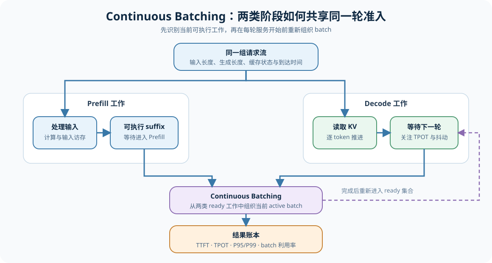
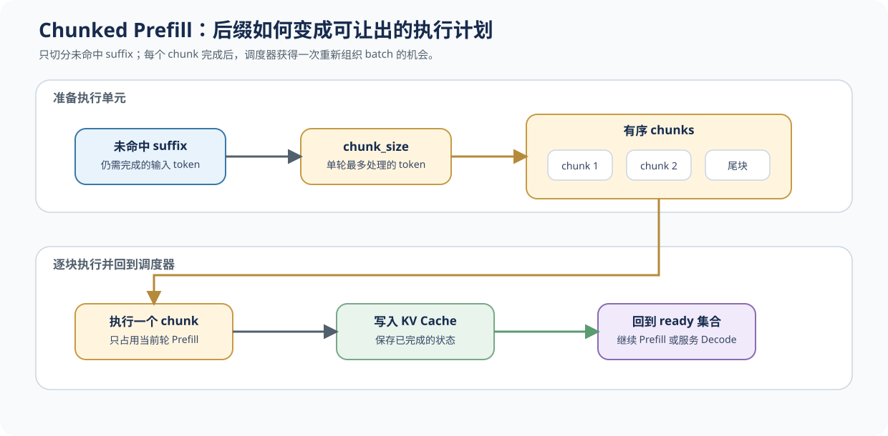

# 38. Prefill Decode Scheduling | Prefill/Decode 调度
**难度：** Medium | **环境：** CPU-first | **标签：** `推理优化`, `Serving`, `Chunked Prefill`, `PD Disaggregation` | **目标人群：** 推理优化学习者

> 🚀 **云端运行环境**
>
> 本章节的实战代码可以点击以下链接在免费 GPU 算力平台上直接运行：
>
> [](https://colab.research.google.com/github/datawhalechina/llm-algo-leetcode/blob/main/02_PyTorch_Algorithms/38_Prefill_Decode_Scheduling.ipynb)
> [](https://modelscope.cn/my/mynotebook) *(国内推荐：魔搭社区免费实例)*


---

## 本节导读

长 prompt 到达时，完整 Prefill 可能占住一整轮批次，使正在生成的请求等待更久。Chunked Prefill 先把未处理输入切成可让出的执行块；当 Prefill 与 Decode 的资源压力长期不同，再考虑把它们组织成独立服务池。

本节建立“请求压力 → 分块推进 → 分池与交接 → 服务决策”的链路。它先解释调度如何减少请求间的相互阻塞，再判断 PD 分离的吞吐和延迟收益能否覆盖交接成本。

**关键词：** `chunked prefill`, `continuous batching`, `PD disaggregation`, `handoff`
## 前置阅读

**导语：** 先能区分 Prefill 的突发输入处理与 Decode 的持续 KV 读取，再观察未命中 suffix 为什么要按可让出的粒度进入批次。

- [34. Prefix Cache Matching and Reuse | Prefix Cache 匹配与复用](./34_Prefix_Cache_Matching_and_Reuse.md)
- [36. Decode Scheduling | Decode 调度](./36_Decode_Scheduling.md)
- [37. KV Cache Scheduling | KV Cache 调度](./37_KV_Cache_Scheduling.md)
### Step 1: 请求为什么需要同时考虑 Prefill 与 Decode

一次请求先处理完整输入，再逐 token 生成输出。长 prompt 往往带来集中的 Prefill 计算和访存；长生成则长期占用 KV Cache，并对 Decode 等待敏感。把它们混在同一批次并非一定错误，但需要先看两类压力是否已经互相干扰。本节位于四层调度的第三层：迭代级调度，关注“这一轮批次如何重组、长 Prefill 何时让出”，不是单个请求的优先级规则。

| 请求形态 | 更突出的压力 | 首先观察什么 |
|---|---|---|
| 长输入、短生成 | Prefill 计算、输入访存与批次占用 | TTFT、Prefill 队列、Decode 抖动 |
| 短输入、长生成 | KV Cache 驻留、逐步 Decode 与排队 | TPOT、KV 使用量、Decode 队列 |
| 输入和生成都长 | 两类压力叠加 | E2E、P95/P99、池利用率 |



### Step 2: Chunked Prefill 如何让长输入让出执行机会

Prefix Cache 未命中的 suffix 仍要 Prefill。Chunked Prefill 将它切成有限大小的块：每完成一个 chunk，调度器可以重新选择是否继续该请求，或先服务等待中的 Decode 请求。它改变的是批次内的执行粒度与公平性，不改变 prefix 是否命中。

| 调度对象 | 含义 | 影响 |
|---|---|---|
| `suffix` | 本次仍需处理的未命中输入 | 决定新增 Prefill 工作量 |
| `chunk_size` | 单次进入 Prefill 的最大 token 数 | 控制单轮占用和让出频率 |
| `chunk_plan` | suffix 的有序分块计划 | 让调度器在块边界重新选请求 |
| `yield_point` | 一个 chunk 完成后的可重排位置 | 缓解长 Prefill 对 Decode 的阻塞 |



### Step 3: 何时从分块调度升级到 PD 分离

若 Chunked Prefill 后两类请求仍长期争用同一资源池，可以把 Prefill 与 Decode 分配给不同的逻辑池。拆分带来的收益必须与状态交接、链路传输和容量闲置一起比较；单纯提高吞吐而恶化 P95，不能视为可保留的方案。

| 决策层次 | 主要动作 | 需要同时记录 |
|---|---|---|
| 同池分块调度 | 在 chunk 边界重排 Prefill / Decode | TTFT、TPOT、Decode 抖动 |
| 逻辑 PD 分池 | 将请求分到 prefill / decode / shared 池 | 吞吐、P95、池利用率 |
| 跨池交接 | Prefill 结束后交接状态给 Decode 池 | 交接时间、传输量、失败状态 |
| 保留或调整 | 比较共享池与拆分方案 | `accept / tune / reject` |


### Step 4: 实现分块计划、分池与收益判断

题目区用 CPU 账本实现四个职责：识别请求形态、把 suffix 切成 chunk、生成逻辑 PD 分池，以及把吞吐、P95 与交接预算收成决策。真实 backend 的 KV 传输和 worker 运行由 Step 5 记录证据。

| 实现阶段 | 机制责任 | 验证重点 |
|---|---|---|
| 请求分类 | 区分 prefill-heavy、decode-heavy 与 mixed | 分类数量守恒与阈值边界 |
| 分块计划 | 仅切分未命中 suffix | 块边界与尾块正确 |
| 分池计划 | 每个请求只进入一个逻辑池 | 覆盖完整、顺序可追踪 |
| 收益判断 | 同时检查吞吐、P95 与交接成本 | 不只凭单一指标保留 PD |

```python
from typing import Dict, List

```


```python
def summarize_request_mix(requests: List[Dict[str, int]], long_prompt_threshold: int) -> Dict[str, int]:
    """统计 prefill-heavy、decode-heavy 与 mixed 请求数量。"""
    # ==========================================
    # TODO 1: 按请求的输入和生成长度完成三类统计
    # result = ???
    # prompt_tokens = ???
    # decode_tokens = ???
    # ==========================================
    raise NotImplementedError


def build_chunked_prefill_plan(suffix_tokens: List[int], chunk_size: int) -> List[List[int]]:
    """把未命中 suffix 切成有序 chunk；尾块可以小于 chunk_size。"""
    # ==========================================
    # TODO 2: 生成 Chunked Prefill 的执行计划
    # suffix = ???
    # chunks = ???
    # ==========================================
    raise NotImplementedError


def plan_pd_split(requests: List[Dict[str, int]], long_prompt_threshold: int, long_decode_threshold: int) -> Dict[str, List[str]]:
    """按请求压力生成 prefill、decode 与 shared 三个逻辑池。"""
    # ==========================================
    # TODO 3: 每个请求只进入一个逻辑池
    # prefill_pool = ???
    # decode_pool = ???
    # shared_pool = ???
    # ==========================================
    raise NotImplementedError


def evaluate_pd_decision(baseline: Dict[str, float], split_run: Dict[str, float], max_handoff_ms: float) -> Dict[str, object]:
    """比较共享池与 PD 分池，并同时检查吞吐、P95 和交接预算。"""
    # ==========================================
    # TODO 4: 输出是否保留当前 PD 方案
    # throughput_gain = ???
    # latency_delta_ms = ???
    # handoff_ok = ???
    # ==========================================
    raise NotImplementedError
```


```python
def test_prefill_decode_scheduling():
    try:
        requests = [
            {'name': 'a', 'prompt_tokens': 4000, 'decode_tokens': 64},
            {'name': 'b', 'prompt_tokens': 256, 'decode_tokens': 512},
            {'name': 'c', 'prompt_tokens': 1500, 'decode_tokens': 128},
        ]
        summary = summarize_request_mix(requests, long_prompt_threshold=2048)
        assert summary == {'prefill_heavy': 1, 'decode_heavy': 1, 'mixed': 1}
        assert sum(summary.values()) == len(requests), '请求分类数量必须守恒'
        assert build_chunked_prefill_plan([9, 10, 11, 12, 13], chunk_size=2) == [[9, 10], [11, 12], [13]]
        try:
            build_chunked_prefill_plan([1], chunk_size=0)
        except ValueError:
            pass
        else:
            raise AssertionError('非正 chunk_size 必须拒绝')
        plan = plan_pd_split(requests, long_prompt_threshold=2048, long_decode_threshold=256)
        assert plan == {'prefill_pool': ['a'], 'decode_pool': ['b'], 'shared_pool': ['c']}
        decision = evaluate_pd_decision({'throughput': 100, 'p95_latency_ms': 180}, {'throughput': 126, 'p95_latency_ms': 150, 'handoff_ms': 8}, max_handoff_ms=10)
        assert decision['keep_split'] is True
        reject = evaluate_pd_decision({'throughput': 100, 'p95_latency_ms': 180}, {'throughput': 126, 'p95_latency_ms': 150, 'handoff_ms': 18}, max_handoff_ms=10)
        assert reject['keep_split'] is False, '交接超过预算时不能直接保留 PD'
        print('✅ Prefill/Decode 调度测试通过')
    except NotImplementedError:
        raise
    except (NameError, AttributeError, TypeError, ValueError, AssertionError) as error:
        raise NotImplementedError('请先完成 TODO 代码或检查字段名！') from error


test_prefill_decode_scheduling()
```

---

🛑 **STOP HERE** 🛑
<br><br><br><br><br><br><br><br><br><br>
> 请先尝试自己完成代码并跑通测试。<br>
> 如果你正在 Colab 中运行，并且遇到困难没有思路，可以向下滚动查看参考答案。
<br><br><br><br><br><br><br><br><br><br>

---

## 参考代码与解析

### 代码


```python
def summarize_request_mix(requests: List[Dict[str, int]], long_prompt_threshold: int) -> Dict[str, int]:
    """统计 prefill-heavy、decode-heavy 与 mixed 请求数量。"""
    # TODO 1: 按请求的输入和生成长度完成三类统计
    result = {'prefill_heavy': 0, 'decode_heavy': 0, 'mixed': 0}
    for request in requests:
        prompt_tokens = request.get('prompt_tokens', 0)
        decode_tokens = request.get('decode_tokens', 0)
        if prompt_tokens > long_prompt_threshold and decode_tokens <= long_prompt_threshold // 8:
            result['prefill_heavy'] += 1
        elif decode_tokens > long_prompt_threshold // 8 and prompt_tokens <= long_prompt_threshold:
            result['decode_heavy'] += 1
        else:
            result['mixed'] += 1
    return result


def build_chunked_prefill_plan(suffix_tokens: List[int], chunk_size: int) -> List[List[int]]:
    """把未命中 suffix 切成有序 chunk；尾块可以小于 chunk_size。"""
    # TODO 2: 生成 Chunked Prefill 的执行计划
    if chunk_size <= 0:
        raise ValueError('chunk_size 必须为正数')
    suffix = list(suffix_tokens)
    return [suffix[start:start + chunk_size] for start in range(0, len(suffix), chunk_size)]


def plan_pd_split(requests: List[Dict[str, int]], long_prompt_threshold: int, long_decode_threshold: int) -> Dict[str, List[str]]:
    """按请求压力生成 prefill、decode 与 shared 三个逻辑池。"""
    # TODO 3: 每个请求只进入一个逻辑池
    prefill_pool, decode_pool, shared_pool = [], [], []
    for request in requests:
        name = request.get('name', 'request')
        if request.get('prompt_tokens', 0) > long_prompt_threshold and request.get('decode_tokens', 0) <= long_decode_threshold:
            prefill_pool.append(name)
        elif request.get('decode_tokens', 0) > long_decode_threshold and request.get('prompt_tokens', 0) <= long_prompt_threshold:
            decode_pool.append(name)
        else:
            shared_pool.append(name)
    return {'prefill_pool': prefill_pool, 'decode_pool': decode_pool, 'shared_pool': shared_pool}


def evaluate_pd_decision(baseline: Dict[str, float], split_run: Dict[str, float], max_handoff_ms: float) -> Dict[str, object]:
    """比较共享池与 PD 分池，并同时检查吞吐、P95 和交接预算。"""
    # TODO 4: 输出是否保留当前 PD 方案
    throughput_gain = split_run.get('throughput', 0.0) - baseline.get('throughput', 0.0)
    latency_delta_ms = split_run.get('p95_latency_ms', 0.0) - baseline.get('p95_latency_ms', 0.0)
    handoff_ms = split_run.get('handoff_ms', 0.0)
    handoff_ok = handoff_ms <= max_handoff_ms
    keep_split = throughput_gain > 0 and latency_delta_ms <= 0 and handoff_ok
    return {'throughput_gain': throughput_gain, 'latency_delta_ms': latency_delta_ms, 'handoff_ms': handoff_ms, 'keep_split': keep_split}
```

### 解析

**1. Chunked Prefill 与 Prefix Cache 的分工**

Prefix Cache 先决定哪些 token 可以跳过；`build_chunked_prefill_plan` 再把仍需处理的 suffix 切成有序执行块。chunk 边界提供可让出点，调度器可在此处优先运行等待中的 Decode 请求。

**2. 分池不等于已经获得收益**

`plan_pd_split` 只生成逻辑池账本。它要求每个请求恰好进入一个池，避免重复服务或请求遗漏；真实 worker 启动、KV 传输和跨设备同步仍需要 backend。

**3. 为什么必须检查交接预算**

`evaluate_pd_decision` 同时比较吞吐、P95 与 `handoff_ms`。PD 不是只要吞吐变高就应保留：交接超出预算、尾延迟变差，或一侧资源持续闲置时都应进入 `tune` 或 `reject`。

**4. 与异构 PD 的衔接**

本节假定 prefill / decode 池只是逻辑上不同。若两池的 GPU、显存、链路或 backend 能力不同，下一节 [39](./39_Hetero_PD_and_Serving_Tiers.md) 需要进一步决定状态传输、重算或同池执行。
### Step 5: 可选 GPU / backend：验证调度、分池与交接代价

CPU 题目区只验证请求分类、suffix 分块、逻辑分池和决策规则。真实实验至少需要统一 workload；要证明 PD 交接收益，则还需要可运行的两类 worker 池与实际状态交接。单 GPU smoke test 可以建立基线，但不能代替跨池结论。

| 实验路径 | 使用资产 | 学习者操作 | 可以验证 / 不能直接推出 |
| --- | --- | --- | --- |
| CPU 机制验证 | 题目区四个函数和测试单元 | 检查分块、分池、P95 与交接预算判断 | 机制账本；不能推出真实 worker 性能 |
| 环境预检 | `tools/environment_preflight.py`、当前 Notebook runtime | 检查 CUDA、GPU、显存、PyTorch 与可选 backend | 环境可执行性；不产生 Serving 结论 |
| 单 GPU backend | vLLM / SGLang 与统一请求集 | 建立 shared pool、Chunked Prefill 或单 worker baseline | 请求指标；不能证明跨设备交接 |
| 多 GPU / serving backend | 两类 worker、状态交接和统一 workload | 对比 shared、chunked 与 PD split | TTFT、TPOT、吞吐、P95、交接时间与池利用率 |
| 异构 PD | 能力不同的资源池和链路记录 | 进入 39 的路由、传输/重算与回退判断 | 当前资源组合；不能外推到其他拓扑 |

真实 backend 验证优先参考 [70 Serving Scheduler Benchmark](./70_Serving_Scheduler_Benchmark.md)、[39 异构 PD 与服务分层](./39_Hetero_PD_and_Serving_Tiers.md) 与 [81 Distributed Inference Project](./81_Distributed_Inference_Project.md)。每组结果必须记录 `evidence_level`；CPU 模拟值不能写成真实 PD 收益。

```python
"""GPU/backend 配置：先明确 PD 资源形态，默认只做环境预检。"""
RUN_PD_GPU_PREFLIGHT = False
PD_RESULT_PATH = 'benchmarks/results/38_prefill_decode_scheduling.json'
PD_BACKEND = 'vllm'  # vllm / sglang / multi_backend
PD_RESOURCE_MODE = 'homogeneous'  # homogeneous / heterogeneous；异构 PD 的路由逻辑见 39。
PD_MODEL_ID = 'Qwen/Qwen2.5-0.5B-Instruct'
PD_DTYPE = 'float16'
PD_PROMPT_TOKENS = 2048
PD_DECODE_TOKENS = 256
PD_CONCURRENCY = 2
PD_WORKER_COUNT = 2
```


```python
"""GPU/backend 执行单元：记录环境和实验计划，不伪造 backend 结果。"""
if RUN_PD_GPU_PREFLIGHT:
    import importlib.util
    import json
    from pathlib import Path
    import torch

    if not torch.cuda.is_available():
        raise RuntimeError('PD 实验预检需要 CUDA；请先切换到 GPU runtime。')
    if PD_BACKEND not in {'vllm', 'sglang', 'multi_backend'}:
        raise ValueError('PD_BACKEND 必须是 vllm、sglang 或 multi_backend。')
    if any(value < 1 for value in (PD_PROMPT_TOKENS, PD_DECODE_TOKENS, PD_CONCURRENCY, PD_WORKER_COUNT)):
        raise ValueError('token 数、并发度和 worker 数必须为正数。')

    project_root = next((p for p in [Path.cwd(), *Path.cwd().parents] if (p / 'benchmarks').is_dir()), Path.cwd())
    report = {
        'task': 'prefill_decode_scheduling_preflight',
        'evidence_level': 'gpu_environment_preflight_only',
        'runtime': {
            'device': torch.cuda.get_device_name(0),
            'gpu_memory_gb': round(torch.cuda.get_device_properties(0).total_memory / (1024 ** 3), 2),
            'torch': torch.__version__,
            'torch_cuda': torch.version.cuda,
            'backend_installed': importlib.util.find_spec(PD_BACKEND) is not None if PD_BACKEND != 'multi_backend' else False,
        },
        'config': {'model': PD_MODEL_ID, 'dtype': PD_DTYPE, 'prompt_tokens': PD_PROMPT_TOKENS, 'decode_tokens': PD_DECODE_TOKENS, 'concurrency': PD_CONCURRENCY, 'worker_count': PD_WORKER_COUNT, 'backend': PD_BACKEND, 'resource_mode': PD_RESOURCE_MODE},
        'decision': {'decision': 'measure', 'reason': '环境预检完成；真实 PD split 仍需两个 worker 池和统一 workload。'},
    }
    output_path = project_root / PD_RESULT_PATH
    output_path.parent.mkdir(parents=True, exist_ok=True)
    output_path.write_text(json.dumps(report, ensure_ascii=False, indent=2), encoding='utf-8')
    print(json.dumps(report, ensure_ascii=False, indent=2))
else:
    print('PD GPU/backend 预检未启动：将 RUN_PD_GPU_PREFLIGHT 改为 True 后运行。')
```

#### Prefill/Decode 实验记录

完成 CPU 或 GPU/backend 实验后，每组新条件新增一行；没有真实 worker 交接数据时，保留为空，不用 CPU 模拟值代填。

| 配置组 | GPU / backend | 资源形态 | 模型与 dtype | worker 配置 | chunk size | prompt / decode tokens | 并发 | TTFT / TPOT | 吞吐 | P95 | 交接时间 | 峰值显存 | evidence level | decision | 结果文件 |
| --- | --- | --- | --- | --- | ---: | --- | ---: | --- | ---: | ---: | ---: | ---: | --- | --- | --- |
| 示例：CPU 账本 | CPU / 模拟 | logical pools | 待填写 | shared / split 计划 | 待填写 | 待填写 | 待填写 | 不适用 | 不适用 | 不适用 | 不适用 | 不适用 | cpu_simulation | 待填写 | 待填写 |
|  |  |  |  |  |  |  |  |  |  |  |  |  |  |  |  |
## 相关阅读

完成 Chunked Prefill、分池与交接预算判断后，可以继续阅读异构 PD、真实服务调度和多实例验证。

- [DistServe 原论文：Disaggregating Prefill and Decoding for Goodput-optimized Large Language Model Serving](https://arxiv.org/abs/2401.09670)
- [vLLM 官方仓库](https://github.com/vllm-project/vllm)
- [SGLang PD Disaggregation 文档](https://docs.sglang.ai/advanced_features/pd_disaggregation.html)
- [39. Hetero PD and Serving Tiers | 异构 PD 与服务分层](./39_Hetero_PD_and_Serving_Tiers.md)
- [70. Serving Scheduler Benchmark | 推理服务调度基准](./70_Serving_Scheduler_Benchmark.md)