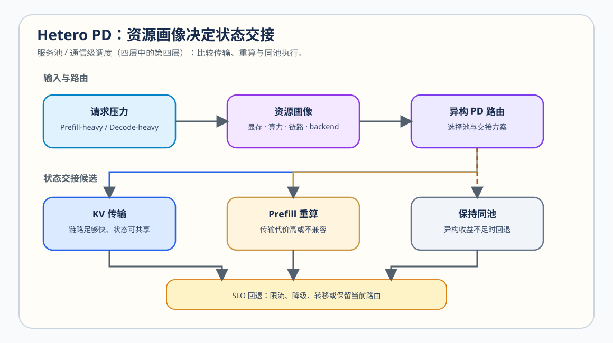

# 39. Hetero PD and Serving Tiers | 异构 PD 与服务分层
**难度：** Hard | **环境：** CPU-first | **标签：** `推理优化`, `Serving`, `Hetero PD`, `SLO` | **目标人群：** 推理服务学习者

> 🚀 **云端运行环境**
>
> 本章节的实战代码可以点击以下链接在免费 GPU 算力平台上直接运行：
>
> [](https://colab.research.google.com/github/datawhalechina/llm-algo-leetcode/blob/main/02_PyTorch_Algorithms/39_Hetero_PD_and_Serving_Tiers.ipynb)
> [](https://modelscope.cn/my/mynotebook) *(国内推荐：魔搭社区免费实例)*


---

## 本节导读

当 Prefill 与 Decode 不只位于不同逻辑池，而是运行在算力、显存、带宽或 backend 能力不同的资源上，分离本身不再足够。系统还要决定请求该路由到哪里、KV 状态该传输还是重算，以及资源紧张时如何保护服务目标。

本节把异构 PD 收成一条可检查的决策链：识别请求压力与资源画像，选择状态交接方式，再按照延迟和可运行性目标执行分层、回退或同池处理。

**关键词：** `heterogeneous PD`, `KV handoff`, `routing`, `SLO`, `fallback`
## 前置阅读

**导语：** 先理解 Chunked Prefill 如何减少批次内阻塞、PD 分离如何形成两类服务池；再进入本节比较资源能力和状态交接是否足以支撑跨池执行。

- [37. KV Cache Scheduling | KV Cache 调度](./37_KV_Cache_Scheduling.md)
- [38. Prefill/Decode Scheduling | Prefill/Decode 调度](./38_Prefill_Decode_Scheduling.md)
- [70. Serving Scheduler Benchmark | 服务调度基准](./70_Serving_Scheduler_Benchmark.md)
### Step 1: 请求压力如何匹配异构资源

异构 PD 的起点不是“有两张不同 GPU 就拆分”，而是请求阶段与资源能力确实不同：Prefill 更需要突发计算和输入带宽，Decode 更依赖持续 KV 容量、稳定读带宽与低排队。先将请求压力和资源画像写成同一张账本，才能判断是否存在合理的路由。本节承接前两层调度，进入服务池与通信级：关注“请求进入哪个池，以及状态如何跨池交接”。

| 对象 | 需要记录的特征 | 它影响的决策 |
|---|---|---|
| Prefill-heavy 请求 | prompt 长度、TTFT 目标、输入处理压力 | 是否进入计算更强的 prefill 池 |
| Decode-heavy 请求 | 生成长度、KV 驻留、TPOT 目标 | 是否进入显存/带宽更合适的 decode 池 |
| 资源池 | 计算能力、可用显存、链路和 backend 支持 | 能否承接对应阶段 |
| 服务等级 | P95/P99、超时与质量约束 | 是否允许排队、降级或回退 |

### Step 2: KV 状态交接应传输、重算还是同池执行

Prefill 完成后，Decode 不能脱离已形成的 KV 状态独立开始。交接方式至少要比较传输、重算和保持同池三种选择；不同链路与状态大小会改变它们的代价。

| 交接方式 | 适合条件 | 主要代价 | 必须验证 |
|---|---|---|---|
| KV 传输 | 链路足够快，状态传输低于重算预算 | 传输时间、通信拥塞、兼容性 | transfer bytes、handoff ms、P99 |
| 重算 Prefill | 链路慢或状态难以共享 | 额外 Prefill 计算与 TTFT | recompute ms、算力占用 |
| 保持同池 | 跨池交接代价高或资源未明显分化 | 失去隔离收益 | 队列、利用率、尾延迟 |



### Step 3: 服务分层与回退如何保护 SLO

资源压力、链路退化或某个池持续饱和时，系统不应仍按同一条路由执行。它需要根据请求等级和当前风险选择继续路由、排队、限流、降级或回到同池；这些动作保护的目标不同，必须保留可复查记录。

| 触发信号 | 首选动作 | 保护目标 | 需要记录 |
|---|---|---|---|
| Decode 池显存接近上限 | 回到同池或限制新接纳 | 可运行性与已有请求 | memory pressure、拒绝数 |
| 交接超过预算 | 选择重算或同池执行 | P95/P99 | handoff、recompute、尾延迟 |
| 队列超出 SLO | 路由、限流或扩容 | 等待时间与公平性 | queue delay、超时率 |
| 两池均稳定 | 保持当前异构路由 | 吞吐与资源利用率 | pool utilization、throughput |

### Step 4: 实现资源路由、交接与服务动作

题目区使用最小 CPU 账本验证四件事：请求属于哪类压力、交接应传输还是重算、资源压力下选择什么服务动作，以及最终路由记录是否可解释。真实 GPU 或 backend 实验需要在统一 workload 下补充链路与池利用率证据。

| 实现阶段 | 机制责任 | 验证重点 |
|---|---|---|
| 请求分类 | 根据 prompt / decode 长度区分资源需要 | 阈值边界清楚 |
| 交接选择 | 比较传输时间与重算时间 | 慢链路不会错误选择传输 |
| 服务动作 | 根据显存、队列和 SLO 选择动作 | 风险优先级正确 |
| 路由记录 | 汇总阶段、交接和服务动作 | 决策理由可追踪 |

```python
from typing import Dict, List

```


```python
def classify_resource_need(request: Dict[str, int], long_prompt_threshold: int, long_decode_threshold: int) -> str:
    """根据请求长度返回 prefill、decode 或 shared 的资源需求。"""
    # ==========================================
    # TODO 1: 区分请求主要压力
    # prompt_tokens = ???
    # decode_tokens = ???
    # return ???
    # ==========================================
    raise NotImplementedError


def choose_handoff_mode(link_gbps: float, cache_transfer_mb: float, recompute_ms: float) -> Dict[str, object]:
    """比较 KV 传输与重算的教学成本模型，并选择较低代价的交接方式。"""
    # ==========================================
    # TODO 2: 估算传输时间并选择 transfer / recompute
    # transfer_ms = ???
    # mode = ???
    # ==========================================
    raise NotImplementedError


def select_serving_action(memory_pressure: float, queue_delay_ms: float, slo_queue_budget_ms: float) -> Dict[str, str]:
    """按可运行性、SLO 与稳定运行的优先级选择服务动作。"""
    # ==========================================
    # TODO 3: 返回 route、fallback 或 throttle 对应的服务动作
    # if ???:
    #     return ???
    # ==========================================
    raise NotImplementedError


def build_route_record(request: Dict[str, int], handoff: Dict[str, object], action: Dict[str, str]) -> Dict[str, str]:
    """把请求阶段、状态交接和服务动作收成可复查的路由记录。"""
    # ==========================================
    # TODO 4: 组合路由决策，不遗漏关键字段
    # resource_need = ???
    # return ???
    # ==========================================
    raise NotImplementedError
```


```python
def test_heterogeneous_pd_policy():
    try:
        assert classify_resource_need({'prompt_tokens': 3000, 'decode_tokens': 64}, 2048, 256) == 'prefill'
        assert classify_resource_need({'prompt_tokens': 128, 'decode_tokens': 512}, 2048, 256) == 'decode'
        assert classify_resource_need({'prompt_tokens': 800, 'decode_tokens': 128}, 2048, 256) == 'shared'
        fast_link = choose_handoff_mode(link_gbps=200, cache_transfer_mb=100, recompute_ms=12)
        assert fast_link == {'mode': 'transfer', 'transfer_ms': 4.0, 'recompute_ms': 12}
        slow_link = choose_handoff_mode(link_gbps=25, cache_transfer_mb=100, recompute_ms=12)
        assert slow_link['mode'] == 'recompute'
        memory_action = select_serving_action(memory_pressure=0.92, queue_delay_ms=20, slo_queue_budget_ms=80)
        assert memory_action == {'action': 'fallback_to_shared', 'protect': 'residency'}
        latency_action = select_serving_action(memory_pressure=0.4, queue_delay_ms=120, slo_queue_budget_ms=80)
        assert latency_action == {'action': 'route_or_throttle', 'protect': 'latency'}
        record = build_route_record({'resource_need': 'prefill'}, fast_link, latency_action)
        assert record == {'resource_need': 'prefill', 'handoff_mode': 'transfer', 'service_action': 'route_or_throttle', 'protect': 'latency'}
        print('✅ 异构 PD 路由测试通过')
    except NotImplementedError:
        raise
    except (NameError, AttributeError, TypeError, ValueError, AssertionError) as error:
        raise NotImplementedError('请先完成 TODO 代码或检查字段名！') from error


test_heterogeneous_pd_policy()
```

---

🛑 **STOP HERE** 🛑
<br><br><br><br><br><br><br><br><br><br>
> 请先尝试自己完成代码并跑通测试。<br>
> 如果你正在 Colab 中运行，并且遇到困难没有思路，可以向下滚动查看参考答案。
<br><br><br><br><br><br><br><br><br><br>

---

## 参考代码与解析

### 代码


```python
def classify_resource_need(request: Dict[str, int], long_prompt_threshold: int, long_decode_threshold: int) -> str:
    """根据请求长度返回 prefill、decode 或 shared 的资源需求。"""
    # TODO 1: 区分请求主要压力
    prompt_tokens = request.get('prompt_tokens', 0)
    decode_tokens = request.get('decode_tokens', 0)
    if prompt_tokens > long_prompt_threshold and decode_tokens <= long_decode_threshold:
        return 'prefill'
    if decode_tokens > long_decode_threshold and prompt_tokens <= long_prompt_threshold:
        return 'decode'
    return 'shared'


def choose_handoff_mode(link_gbps: float, cache_transfer_mb: float, recompute_ms: float) -> Dict[str, object]:
    """比较 KV 传输与重算的教学成本模型，并选择较低代价的交接方式。"""
    # TODO 2: 估算传输时间并选择 transfer / recompute
    if link_gbps <= 0 or cache_transfer_mb < 0 or recompute_ms < 0:
        raise ValueError('链路、状态大小和重算时间必须合法')
    transfer_ms = (cache_transfer_mb * 8) / link_gbps
    mode = 'transfer' if transfer_ms <= recompute_ms else 'recompute'
    return {'mode': mode, 'transfer_ms': round(transfer_ms, 4), 'recompute_ms': recompute_ms}


def select_serving_action(memory_pressure: float, queue_delay_ms: float, slo_queue_budget_ms: float) -> Dict[str, str]:
    """按可运行性、SLO 与稳定运行的优先级选择服务动作。"""
    # TODO 3: 返回 route、fallback 或 throttle 对应的服务动作
    if memory_pressure > 0.9:
        return {'action': 'fallback_to_shared', 'protect': 'residency'}
    if queue_delay_ms > slo_queue_budget_ms:
        return {'action': 'route_or_throttle', 'protect': 'latency'}
    return {'action': 'keep_heterogeneous_route', 'protect': 'throughput'}


def build_route_record(request: Dict[str, int], handoff: Dict[str, object], action: Dict[str, str]) -> Dict[str, str]:
    """把请求阶段、状态交接和服务动作收成可复查的路由记录。"""
    # TODO 4: 组合路由决策，不遗漏关键字段
    resource_need = request.get('resource_need', 'shared')
    return {'resource_need': resource_need, 'handoff_mode': str(handoff['mode']), 'service_action': action['action'], 'protect': action['protect']}
```

### 解析

**1. 异构 PD 的判断入口**

请求分类不是硬件选择本身，而是先建立“哪一阶段更突出”的事实。只有 prefill-heavy 与 decode-heavy 请求长期存在、两类资源能力也确实不同，拆池与异构路由才值得继续测量。

**2. 状态交接的三种处理**

`choose_handoff_mode` 用简化成本模型比较 KV 传输和重算：`transfer_ms = cache_transfer_mb × 8 / link_gbps`。真实系统还要考虑协议、序列化、拥塞、拓扑与 backend 兼容性；当交接代价过高时，保持同池也是合理候选，而非失败。

**3. 服务动作的优先级**

可运行性优先于延迟，延迟优先于吞吐：Decode 池接近 OOM 时先保护已有 KV；队列超过 SLO 时再路由、限流或扩容；只有资源稳定时才持续追求吞吐。

**4. 证据与项目出口**

CPU 题目区验证路由与决策逻辑。真实异构 PD 需要记录每个池的 GPU / backend、链路、KV 传输量、交接时间、TTFT、TPOT、P95/P99、池利用率和失败状态；[70](./70_Serving_Scheduler_Benchmark.md) 与 79–81 负责补足这些实际证据。
### Step 5: 可选多资源验证：把路由决策变成服务证据

异构 PD 不能由单一 GPU 上的 CPU 模拟证明。真实验证需要分别记录两类资源池的 GPU / backend、可用显存、链路、模型与 dtype，并用同一请求分布对比“同池、KV 传输、重算 Prefill”三种路径。

| 对照项 | 必须固定或记录 | 用于判断 |
|---|---|---|
| workload 与 SLO | prompt / decode 分布、并发、质量门槛、P95/P99 目标 | 路由是否在同一服务目标下比较 |
| 资源画像 | prefill / decode 池的 GPU、显存、backend 与链路 | 异构性是否真实存在 |
| 状态交接 | KV transfer bytes、handoff ms、recompute ms、失败状态 | 传输、重算或同池哪条更可行 |
| 服务结果 | TTFT、TPOT、吞吐、P95/P99、池利用率、回退率 | 收益是否覆盖交接和资源代价 |

用 [70](./70_Serving_Scheduler_Benchmark.md) 建立统一 Serving workload，再用 79–81 的多卡项目补充通信与拓扑证据。没有两类资源池或状态交接能力时，本节保留 CPU 决策记录，不将其写成异构 PD 性能结论。
## 相关阅读

完成资源画像、状态交接和服务动作判断后，可以继续阅读真实 PD 实现、多实例 Serving 与通信验证。

- [DistServe 原论文：Disaggregating Prefill and Decoding for Goodput-optimized Large Language Model Serving](https://arxiv.org/abs/2401.09670)
- [SGLang PD Disaggregation 文档](https://docs.sglang.ai/advanced_features/pd_disaggregation.html)
- [vLLM 官方仓库](https://github.com/vllm-project/vllm)
- [70. Serving Scheduler Benchmark | 服务调度基准](./70_Serving_Scheduler_Benchmark.md)
- [79–81 分布式推理项目](./79_Distributed_Parallel_Benchmark.md)