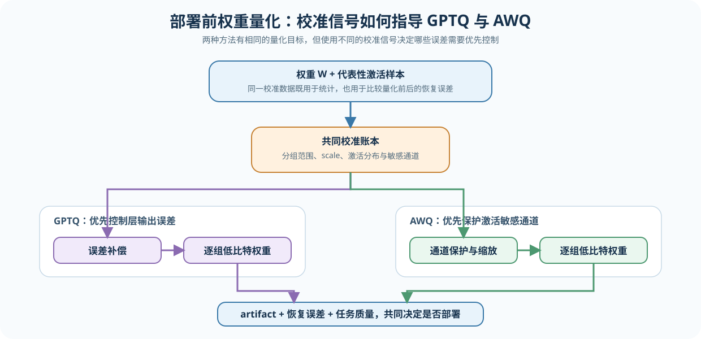
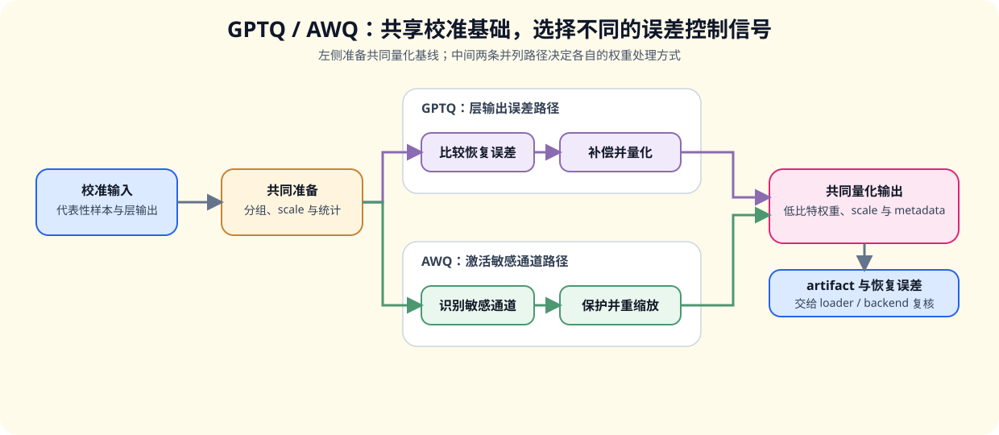

# 40. GPTQ and AWQ Weight Quantization | GPTQ 与 AWQ 权重量化
**难度：** Hard | **环境：** CPU-first | **标签：** `量化压缩`, `权重量化`, `GPTQ/AWQ` | **目标人群：** 量化压缩学习者

> 🚀 **云端运行环境**
>
> 本章节的实战代码可以点击以下链接在免费 GPU 算力平台上直接运行：
>
> [](https://colab.research.google.com/github/datawhalechina/llm-algo-leetcode/blob/main/02_PyTorch_Algorithms/40_GPTQ_and_AWQ_Weight_Quantization.ipynb)
> [](https://modelscope.cn/my/mynotebook) *(国内推荐：魔搭社区免费实例)*


---

## 本节导读

第 25 节和第 26 节已经把量化的两条主线铺开：W8A16 说明了 weight-only 量化如何减少权重读取压力，QLoRA 说明了 4-bit 权重如何服务于低成本微调。但部署阶段还会遇到一个更细的问题：同样是把权重压到低比特，哪些权重更敏感，哪些误差可以接受，校准数据又应该如何参与量化决策？

本节用一个极简 `WeightQuantizerSim` 模拟 GPTQ / AWQ 的核心直觉：GPTQ 更关注校准后的重构误差，AWQ 更强调激活感知和敏感通道保护。学完后，你应该能看清“校准 -> 分组 -> 量化 -> 保护 -> 反量化 -> 误差检查”这条权重量化链路。

本节还会把三类对象放到同一条链路中比较：GPTQ 关注校准后的误差补偿，AWQ 关注激活感知和敏感通道保护，GGUF 负责量化权重的文件格式与部署封装。真实 artifact、backend 和 kernel 的验证继续连接到 [67. 量化推理与部署](./67_Quantized_Inference_and_Deployment.md)。

**关键词：** `GPTQ`, `AWQ`, `weight quantization`

---

## 前置阅读

**导语：** 进入本节前，先能区分权重、激活和 KV Cache 的量化对象，再观察校准数据如何影响低比特权重的误差。
- [25. Quantization W8A16 | W8A16 量化](./25_Quantization_W8A16.md)
- [26. QLoRA and 4bit Quantization | QLoRA 与 4-bit 量化](./26_QLoRA_and_4bit_Quantization.md)
- [P1: 21. Quantization Theory and INT4/INT8 | 量化理论与 INT4/INT8](../01_Hardware_Math_and_Systems/21_Quantization_Theory_and_INT4_INT8.md)

---

### Step 1: 低比特权重如何进入部署前校准

W8A16 已经说明低比特可以减少权重存储，但继续压到 4-bit 后，量化误差会更容易影响敏感通道。先把一轮校准看成一条数据流：输入权重和代表性激活，提取校准统计，按分组确定 scale，再输出低比特权重、保护信息和可检查的重构误差。

量化结果还要经过保存、读取和执行三个环节：先形成可追溯的 artifact，再由 loader 读取并映射到 backend，最后由 kernel 执行。训练侧也可能量化梯度或优化器状态，但那服务于训练显存和更新稳定性，不属于本节的部署主线。

| 部署环节 | 需要确认什么 | 学习时观察什么 |
|---|---|---|
| 校准与量化 | 校准样本、bit、group size、保护策略 | 统计是否稳定、误差是否可解释 |
| Artifact | 权重、scale、保护信息和版本是否可追溯 | 表示是否完整、配置是否可复查 |
| Loader / backend | 是否按目标 dtype 和格式读取，是否发生 fallback | 实际加载路径和 dtype |
| Kernel / 服务 | 是否执行目标低比特路径，端到端是否受益 | 延迟、吞吐、显存和质量 |



### Step 2: 校准数据与分组 scale

校准样本不是训练数据，而是用来观察激活分布的代表性输入。模拟器先按输入通道汇总激活强度，再把权重按 `group_size` 划分，每组使用独立 scale。先比较样本量对统计稳定性的影响，再比较量化粒度对误差和元数据成本的影响。

| 变量 / 粒度 | 改变什么 | 主要收益 | 主要代价与观察结果 |
|---|---|---|---|
| `calibration_samples` | 激活统计的样本量 | 统计更稳定 | 样本少时敏感通道判断可能抖动 |
| per-tensor | 整个权重张量共享 scale | 元数据少、实现简单 | 局部异常值影响整层 |
| per-channel | 每个通道独立 scale | 适应通道差异 | scale 数量增加 |
| group-wise / `group_size` | 固定数量输入通道共享 scale | 在误差与元数据之间折中 | 分组越粗越容易受异常值影响，边界组需要单独处理 |

### Step 3: GPTQ 与 AWQ 的策略差异

两种方法都使用代表性输入帮助决定低比特权重如何处理，但观察对象不同。先比较它们使用的校准信号，再观察量化决策如何影响敏感通道、重构误差和元数据。可以把共同过程具体化为：校准激活 → 统计重要性 → 计算分组 scale → 保护或调整敏感权重 → 反量化 → 比较输出误差。

本节的 GPTQ/AWQ 模拟器把两种方法的核心决策信号放在同一组输入上：GPTQ 观察重构误差，AWQ 观察激活感知的通道重要性。真实工具链还会涉及 Hessian 或近似二阶信息、逐层误差补偿、缩放搜索和权重打包；学习者可以先用模拟结果建立判断，再把这些判断带到真实模型和部署结果中。

| 方法 | 校准时主要观察什么 | 典型处理思路 | 本节可观察的结果 |
|---|---|---|---|
| GPTQ | 量化前后层输出的重构误差 | 根据校准信息调整量化结果，使层输出尽量接近原始输出 | 重构误差与分组配置的关系 |
| AWQ | 激活统计中的敏感通道 | 对高影响通道采取保护或重缩放，再量化其余权重 | 敏感通道标记与误差变化 |
| 共同基础 | 代表性校准输入、分组 scale 和低比特权重 | 先取得统计，再生成可部署的权重表示 | 权重恢复形状、误差和元数据成本 |



### Step 4: 实现、测试与结果解读

题目区采用“固定骨架 + 机制 TODO”的设计：`WeightQuantizerSim` 已提供输入契约、状态字段、循环结构和错误检查，学习者只补全校准统计、分组数量、敏感通道掩码、scale、反量化和误差计算。每个 TODO 对应一个可验证的机制责任，并保留变量级提示；答案区与题目区使用相同的函数签名和控制流，只补上这些 TODO。

| 实现部分 | 代码需要完成的工作 | 验证重点 |
|---|---|---|
| 校准统计 | 汇总输入通道激活强度 | 能识别用于保护的敏感通道 |
| 分组量化 | 计算分组数量和 scale，并生成低比特权重 | dtype、scale 形状和边界分组正确 |
| 反量化与误差 | 恢复权重并计算重构误差 | 输出形状一致，误差可计算且无异常值 |
| 量化状态契约 | 保留量化配置、scale 和保护信息 | 能区分模拟结果与真实 artifact / backend 证据 |


```python
import torch
import torch.nn as nn
import torch.nn.functional as F

```


```python
class WeightQuantizerSim(nn.Module):
    """教学用 GPTQ / AWQ 权重量化模拟器。

    它只保留校准统计、分组 scale、敏感通道保护、反量化和重构误差
    这些机制骨架，不生成真实 GPTQ / AWQ artifact，也不代表目标
    backend 已经使用低比特 kernel。"""

    def __init__(self, bits: int = 4, group_size: int = 32, method: str = "gptq", protect_ratio: float = 0.05, eps: float = 1e-8):
        super().__init__()
        if bits < 2:
            raise ValueError("bits must be >= 2")
        if group_size <= 0:
            raise ValueError("group_size must be positive")
        self.bits = bits
        self.group_size = group_size
        self.method = method.lower()
        self.protect_ratio = protect_ratio
        self.eps = eps
        self.qmax = 2 ** (bits - 1) - 1

        self.register_buffer("qweight", torch.empty(0, dtype=torch.int8), persistent=False)
        self.register_buffer("scales", torch.empty(0), persistent=False)
        self.register_buffer("protected_weight", torch.empty(0), persistent=False)
        self.register_buffer("protected_mask", torch.empty(0, dtype=torch.bool), persistent=False)
        self.register_buffer("importance", torch.empty(0), persistent=False)
        self.weight_shape = None

    def _collect_importance(self, activations: torch.Tensor, in_features: int) -> torch.Tensor:
        act = activations.detach().float()
        if act.ndim == 1:
            importance = act.abs()
        else:
            reduce_dims = tuple(range(act.ndim - 1))
            # ==========================================
            # TODO 1: 根据校准激活统计输入通道重要性
            # 提示: 对除最后一维外的维度求 RMS，最后一维对应 in_features
            # ==========================================
            # importance = ???
        if importance.numel() != in_features:
            raise ValueError(f"Calibration importance dim mismatch: expected {in_features}, got {importance.numel()}")
        return importance

    def fit(self, weight: torch.Tensor, activations: torch.Tensor | None = None) -> "WeightQuantizerSim":
        w = weight.detach().float()
        if w.ndim != 2:
            raise ValueError("WeightQuantizerSim only supports 2D linear weights.")

        out_features, in_features = w.shape
        self.weight_shape = (out_features, in_features)
        importance = torch.ones(in_features, device=w.device, dtype=w.dtype) if activations is None else self._collect_importance(activations, in_features)
        self.importance = importance

        # ==========================================
        # TODO 2: 计算输入维度需要被切成多少个 group
        # 提示: 使用向上取整，最后一组可以不足 group_size
        # ==========================================
        # n_groups = ???
        qweight = torch.zeros_like(w, dtype=torch.int8)
        scales = torch.zeros((out_features, n_groups), dtype=w.dtype, device=w.device)
        protected_weight = torch.zeros_like(w)
        protected_mask = torch.zeros_like(w, dtype=torch.bool)

        for row in range(out_features):
            for g in range(n_groups):
                start = g * self.group_size
                end = min(start + self.group_size, in_features)
                wg = w[row, start:end]
                ig = importance[start:end]
                if wg.numel() == 0:
                    continue

                mask = torch.zeros_like(ig, dtype=torch.bool)
                if self.method == "awq":
                    k = max(1, int(round(wg.numel() * self.protect_ratio)))
                    k = min(k, wg.numel())
                    topk = torch.topk(ig, k=k, largest=True).indices
                    # ==========================================
                    # TODO 3: 标记本组中需要保护的敏感通道
                    # 提示: topk 是通道下标，把这些位置在 mask 中置为 True
                    # ==========================================
                    # mask[topk] = ???
                    protected_mask[row, start:end] = mask
                    protected_weight[row, start:end] = wg * mask.to(wg.dtype)

                base = wg[~mask]
                if base.numel() == 0:
                    base = wg
                # ==========================================
                # TODO 4: 为未保护的普通通道计算分组 scale
                # 提示: 对称量化 scale = absmax / qmax，并用 eps 避免除零
                # ==========================================
                # scale = ???

                q_group = torch.zeros_like(wg, dtype=torch.int8)
                q_group[~mask] = torch.clamp(torch.round(wg[~mask] / scale), -self.qmax, self.qmax).to(torch.int8)
                qweight[row, start:end] = q_group
                scales[row, g] = scale

        self.qweight = qweight
        self.scales = scales
        self.protected_weight = protected_weight
        self.protected_mask = protected_mask
        return self

    def dequantize(self) -> torch.Tensor:
        if self.weight_shape is None:
            raise RuntimeError("Call fit() before dequantize().")

        out_features, in_features = self.weight_shape
        n_groups = self.scales.size(1)
        weight = torch.zeros((out_features, in_features), dtype=self.scales.dtype, device=self.scales.device)

        for row in range(out_features):
            for g in range(n_groups):
                start = g * self.group_size
                end = min(start + self.group_size, in_features)
                scale = self.scales[row, g]
                q_group = self.qweight[row, start:end].to(self.scales.dtype)
                # ==========================================
                # TODO 5: 将整数权重反量化回浮点近似值
                # 提示: 量化时除以 scale，恢复时乘回 scale
                # ==========================================
                # dequant = ???
                protected = self.protected_mask[row, start:end]
                if protected.any():
                    dequant = dequant.clone()
                    dequant[protected] = self.protected_weight[row, start:end][protected]
                weight[row, start:end] = dequant

        return weight

    def forward(self, x: torch.Tensor) -> torch.Tensor:
        if self.weight_shape is None:
            raise RuntimeError("Call fit() before forward().")
        weight = self.dequantize().to(x.dtype)
        return F.linear(x, weight)

    def mse(self, weight: torch.Tensor) -> torch.Tensor:
        recon = self.dequantize().to(weight.dtype)
        # ==========================================
        # TODO 6: 计算原始权重和恢复权重之间的均方误差
        # 提示: 先相减、平方，再求平均
        # ==========================================
        # error = ???
        return error

```


```python
def test_calibration_importance_contract():
    torch.manual_seed(0)
    sim = WeightQuantizerSim(bits=4, group_size=4, method='awq', protect_ratio=0.25)
    acts = torch.randn(16, 8)
    importance = sim._collect_importance(acts, 8)
    assert importance.shape == (8,)
    assert torch.isfinite(importance).all()


def test_group_partition_contract():
    weight = torch.randn(4, 10)
    sim = WeightQuantizerSim(bits=4, group_size=4, method='gptq').fit(weight)
    assert sim.scales.shape == (4, 3)
    assert sim.qweight.shape == weight.shape
    assert sim.dequantize().shape == weight.shape


def test_awq_protection_contract():
    torch.manual_seed(0)
    weight = torch.randn(4, 8)
    acts = torch.randn(16, 8)
    sim = WeightQuantizerSim(bits=4, group_size=4, method='awq', protect_ratio=0.25).fit(weight, acts)
    assert sim.protected_mask.any()
    assert sim.protected_weight[sim.protected_mask].numel() > 0
    restored = sim.dequantize()
    assert torch.allclose(restored[sim.protected_mask], sim.protected_weight[sim.protected_mask])


def test_dequantization_contract():
    weight = torch.randn(4, 8)
    sim = WeightQuantizerSim(bits=4, group_size=4, method='gptq').fit(weight)
    restored = sim.dequantize()
    assert restored.shape == weight.shape
    assert torch.isfinite(restored).all()
    assert float(sim.mse(weight)) >= 0.0


def test_gptq_awq_difference_contract():
    torch.manual_seed(0)
    weight = torch.randn(4, 8)
    acts = torch.randn(16, 8)
    gptq = WeightQuantizerSim(bits=4, group_size=4, method='gptq').fit(weight, acts)
    awq = WeightQuantizerSim(bits=4, group_size=4, method='awq', protect_ratio=0.25).fit(weight, acts)
    assert not gptq.protected_mask.any()
    assert awq.protected_mask.any()
    assert awq.dequantize().shape == gptq.dequantize().shape


def run_gptq_awq_tests():
    for test in (
        test_calibration_importance_contract,
        test_group_partition_contract,
        test_awq_protection_contract,
        test_dequantization_contract,
        test_gptq_awq_difference_contract,
    ):
        test()
    print('✅ GPTQ/AWQ 模拟机制测试通过：校准、分组、保护、反量化与方法差异均已验证。')


run_gptq_awq_tests()

```

---

🛑 **STOP HERE** 🛑
<br><br><br><br><br><br><br><br><br><br>
> 请先尝试自己完成代码并跑通测试。<br>
> 如果你正在 Colab 中运行，并且遇到困难没有思路，可以向下滚动查看参考答案。
<br><br><br><br><br><br><br><br><br><br>

---

## 参考代码与解析

### 代码


```python

class WeightQuantizerSim(nn.Module):
    """极简版 GPTQ / AWQ 权重量化模拟器。"""

    def __init__(self, bits: int = 4, group_size: int = 32, method: str = "gptq", protect_ratio: float = 0.05, eps: float = 1e-8):
        super().__init__()
        if bits < 2:
            raise ValueError("bits must be >= 2")
        if group_size <= 0:
            raise ValueError("group_size must be positive")
        self.bits = bits
        self.group_size = group_size
        self.method = method.lower()
        self.protect_ratio = protect_ratio
        self.eps = eps
        self.qmax = 2 ** (bits - 1) - 1

        self.register_buffer("qweight", torch.empty(0, dtype=torch.int8), persistent=False)
        self.register_buffer("scales", torch.empty(0), persistent=False)
        self.register_buffer("protected_weight", torch.empty(0), persistent=False)
        self.register_buffer("protected_mask", torch.empty(0, dtype=torch.bool), persistent=False)
        self.register_buffer("importance", torch.empty(0), persistent=False)
        self.weight_shape = None

    def _collect_importance(self, activations: torch.Tensor, in_features: int) -> torch.Tensor:
        act = activations.detach().float()
        if act.ndim == 1:
            importance = act.abs()
        else:
            reduce_dims = tuple(range(act.ndim - 1))
            # ==========================================
            # TODO 1: 根据校准激活统计输入通道重要性
            # 提示: 对除最后一维外的维度求 RMS，最后一维对应 in_features
            # ==========================================
            importance = act.pow(2).mean(dim=reduce_dims).sqrt()
        if importance.numel() != in_features:
            raise ValueError(f"Calibration importance dim mismatch: expected {in_features}, got {importance.numel()}")
        return importance

    def fit(self, weight: torch.Tensor, activations: torch.Tensor | None = None) -> "WeightQuantizerSim":
        w = weight.detach().float()
        if w.ndim != 2:
            raise ValueError("WeightQuantizerSim only supports 2D linear weights.")

        out_features, in_features = w.shape
        self.weight_shape = (out_features, in_features)
        importance = torch.ones(in_features, device=w.device, dtype=w.dtype) if activations is None else self._collect_importance(activations, in_features)
        self.importance = importance

        # ==========================================
        # TODO 2: 计算输入维度需要被切成多少个 group
        # 提示: 使用向上取整，最后一组可以不足 group_size
        # ==========================================
        n_groups = (in_features + self.group_size - 1) // self.group_size
        qweight = torch.zeros_like(w, dtype=torch.int8)
        scales = torch.zeros((out_features, n_groups), dtype=w.dtype, device=w.device)
        protected_weight = torch.zeros_like(w)
        protected_mask = torch.zeros_like(w, dtype=torch.bool)

        for row in range(out_features):
            for g in range(n_groups):
                start = g * self.group_size
                end = min(start + self.group_size, in_features)
                wg = w[row, start:end]
                ig = importance[start:end]
                if wg.numel() == 0:
                    continue

                mask = torch.zeros_like(ig, dtype=torch.bool)
                if self.method == "awq":
                    k = max(1, int(round(wg.numel() * self.protect_ratio)))
                    k = min(k, wg.numel())
                    topk = torch.topk(ig, k=k, largest=True).indices
                    # ==========================================
                    # TODO 3: 标记本组中需要保护的敏感通道
                    # 提示: topk 是通道下标，把这些位置在 mask 中置为 True
                    # ==========================================
                    mask[topk] = True
                    protected_mask[row, start:end] = mask
                    protected_weight[row, start:end] = wg * mask.to(wg.dtype)

                base = wg[~mask]
                if base.numel() == 0:
                    base = wg
                # ==========================================
                # TODO 4: 为未保护的普通通道计算分组 scale
                # 提示: 对称量化 scale = absmax / qmax，并用 eps 避免除零
                # ==========================================
                scale = (base.abs().max() / self.qmax).clamp_min(self.eps)

                q_group = torch.zeros_like(wg, dtype=torch.int8)
                q_group[~mask] = torch.clamp(torch.round(wg[~mask] / scale), -self.qmax, self.qmax).to(torch.int8)
                qweight[row, start:end] = q_group
                scales[row, g] = scale

        self.qweight = qweight
        self.scales = scales
        self.protected_weight = protected_weight
        self.protected_mask = protected_mask
        return self

    def dequantize(self) -> torch.Tensor:
        if self.weight_shape is None:
            raise RuntimeError("Call fit() before dequantize().")

        out_features, in_features = self.weight_shape
        n_groups = self.scales.size(1)
        weight = torch.zeros((out_features, in_features), dtype=self.scales.dtype, device=self.scales.device)

        for row in range(out_features):
            for g in range(n_groups):
                start = g * self.group_size
                end = min(start + self.group_size, in_features)
                scale = self.scales[row, g]
                q_group = self.qweight[row, start:end].to(self.scales.dtype)
                # ==========================================
                # TODO 5: 将整数权重反量化回浮点近似值
                # 提示: 量化时除以 scale，恢复时乘回 scale
                # ==========================================
                dequant = q_group * scale
                protected = self.protected_mask[row, start:end]
                if protected.any():
                    dequant = dequant.clone()
                    dequant[protected] = self.protected_weight[row, start:end][protected]
                weight[row, start:end] = dequant

        return weight

    def forward(self, x: torch.Tensor) -> torch.Tensor:
        if self.weight_shape is None:
            raise RuntimeError("Call fit() before forward().")
        weight = self.dequantize().to(x.dtype)
        return F.linear(x, weight)

    def mse(self, weight: torch.Tensor) -> torch.Tensor:
        recon = self.dequantize().to(weight.dtype)
        # ==========================================
        # TODO 6: 计算原始权重和恢复权重之间的均方误差
        # 提示: 先相减、平方，再求平均
        # ==========================================
        error = torch.mean((weight.float() - recon.float()) ** 2)
        return error

```

### 解析

**1. TODO 1: 统计通道重要性**
- **实现方式**：`importance = act.pow(2).mean(dim=reduce_dims).sqrt()`
- **关键点**：最后一维对应输入通道，其他维度是 batch 或序列维度，需要被聚合掉
- **技术细节**：这里用 RMS 近似衡量通道激活强度；激活越大的通道，权重误差越容易影响输出

**2. TODO 2: 计算分组数量**
- **实现方式**：`n_groups = (in_features + self.group_size - 1) // self.group_size`
- **关键点**：分组数要向上取整，因为最后一组可能不足 `group_size`
- **技术细节**：分组量化让每组拥有独立 scale，比整层共享一个 scale 更能适应局部数值范围

**3. TODO 3: 标记 AWQ 敏感通道**
- **实现方式**：`mask[topk] = True`
- **关键点**：`topk` 来自本组内 importance 最大的通道，这些位置会被 `protected_mask` 记录
- **技术细节**：本节用“保留原始浮点权重”模拟 AWQ 的敏感通道保护，真实实现通常会采用更细的 scale 搜索和重缩放策略

**4. TODO 4: 计算分组 scale**
- **实现方式**：`scale = (base.abs().max() / self.qmax).clamp_min(self.eps)`
- **关键点**：对称量化用本组绝对最大值确定动态范围，并用 `eps` 避免全零分组除零
- **技术细节**：`qmax = 2 ** (bits - 1) - 1`，4-bit 对称量化时有效正向上限是 7

**5. TODO 5: 反量化恢复权重**
- **实现方式**：`dequant = q_group * scale`
- **关键点**：量化时是 `round(w / scale)`，恢复时就乘回同一个 scale
- **技术细节**：如果当前位置被 `protected_mask` 标记，反量化结果会被原始 `protected_weight` 覆盖

**6. TODO 6: 计算重构误差**
- **实现方式**：`error = torch.mean((weight.float() - recon.float()) ** 2)`
- **关键点**：MSE 用来衡量量化恢复权重和原始权重之间的平均平方偏差
- **技术细节**：这个误差只检查权重重构，不等价于最终模型精度；真实评估还要看校准集或下游任务指标

**GPTQ / AWQ 核心机制**
- **GPTQ 直觉**：利用校准数据估计量化对层输出的影响，让低比特权重尽量维持原始层行为
- **AWQ 直觉**：激活越强的通道越敏感，少量通道需要更保守地量化或直接保护
- **分组量化**：按 group 计算 scale，可以减少极端值对整层量化范围的支配

**工程优化要点**
- **存储收益**：4-bit 权重量化能显著降低模型权重显存和加载带宽
- **元数据成本**：分组越细，scale 越多，精度通常更好，但元数据开销也更大
- **部署实践**：真实 GPTQ / AWQ 还涉及校准集选择、kernel 支持、group size、zero point、packing 格式和端到端精度评估

### Step 5：可选 GPU 实验——测量 GPTQ / AWQ 模拟器


实验从真实模型的 q_proj forward hook 取得校准激活，再在 GPU 上比较 GPTQ / AWQ 教学模拟器的校准耗时、分组和重构误差。它验证的是“真实模型状态上的机制模拟”，不生成真实 GPTQ / AWQ artifact，也不启动 vLLM / SGLang；证据等级记为 gpu_simulation_on_real_model_state。

#### 5.1 环境与校准 workload

先确认 CUDA、模型版本、dtype 和校准文本数量。CALIBRATION_SAMPLES 控制校准文本数量；每次复测都应保留相同输入、bits、group_size、protect_ratio、warmup 和重复次数。

#### 5.2 执行校准并保存 JSON

先运行 dry_run 检查环境，再切换到 real_gpu。代码保存校准耗时、分组配置、runtime、失败状态和重构误差，便于复测。真实 artifact、kernel、吞吐和任务质量转到 67 节。

#### 5.3 读取结果并解释证据

结果只用于判断真实模型状态上的 GPTQ / AWQ 模拟路径；模拟误差只反映校准样本上的局部关系，不代表真实量化后端收益。

#### 5.4 GPU 实验结果记录

成熟库 artifact 还必须经过 backend 加载、kernel、延迟、吞吐和任务质量验证。

| role | baseline / candidate | artifact | method | bits | group_size | calibration samples | runtime | weight MSE | output MSE | failure | evidence level | decision |
|---|---|---|---|---:|---:|---:|---|---:|---:|---|---|---|
| reference | baseline | FP16 layer / JSON path | none |  |  |  |  |  |  |  | gpu_simulation_on_real_model_state |  |
| simulated | candidate | teaching artifact / JSON path | GPTQ or AWQ |  |  |  |  |  |  |  | gpu_simulation_on_real_model_state | accept / tune / reject |
| mature path | candidate artifact | saved model artifact / backend path | GPTQ or AWQ |  |  |  |  |  |  |  | mature_library_artifact / backend_benchmark_pending | accept / tune / reject |


```python
import json
import platform
import time
from pathlib import Path

RUN_MODE = 'dry_run'  # cpu / dry_run / real_gpu；dry_run 只做环境检查
MODEL_ID = 'Qwen/Qwen2.5-0.5B-Instruct'  # real_gpu 使用真实权重和真实层输入
CALIBRATION_PROMPTS = ['Explain quantization.', 'Why does KV Cache grow?', 'Compare GPTQ and AWQ.']
SEED = 42
OUT_FEATURES = 1024
IN_FEATURES = 1024
CALIBRATION_SAMPLES = 32
GROUP_SIZE = 32
BITS = 4
PROTECT_RATIO = 0.05
WARMUP = 2
ITERS = 10
OUTPUT_PATH = Path('benchmarks/results/40_gptq_awq_gpu.json')
ARTIFACT_DIR = Path('benchmarks/results/40_gptq_awq_artifacts')

torch.manual_seed(SEED)
cuda_available = torch.cuda.is_available()
if RUN_MODE == 'real_gpu' and not cuda_available:
    raise RuntimeError('RUN_MODE=real_gpu 但 CUDA 不可用，请先完成 GPU 环境预检。')
device = torch.device('cuda' if RUN_MODE == 'real_gpu' else 'cpu')
runtime = {'python': platform.python_version(), 'torch': torch.__version__, 'cuda': torch.version.cuda,
           'cuda_available': cuda_available, 'device': torch.cuda.get_device_name(0) if cuda_available else 'cpu'}

def _sync():
    """确保 CUDA 异步操作完成后再读取计时或显存。"""
    if device.type == 'cuda': torch.cuda.synchronize()

def _measure(fn):
    """测量一次校准模拟的平均耗时。"""
    for _ in range(WARMUP): fn()
    _sync(); start = time.perf_counter()
    for _ in range(ITERS): fn()
    _sync()
    return round((time.perf_counter() - start) * 1000 / ITERS, 4)

evidence_level = 'environment_preflight' if RUN_MODE == 'dry_run' else 'gpu_simulation_on_real_model_state'
result = {'stage': evidence_level, 'run_mode': RUN_MODE, 'runtime': runtime, 'json_path': str(OUTPUT_PATH),
          'workload': {'model_id': MODEL_ID, 'layer_scope': 'q_proj',
                       'calibration_samples': CALIBRATION_SAMPLES, 'calibration_prompts': CALIBRATION_PROMPTS},
          'config': {
    'out_features': OUT_FEATURES, 'in_features': IN_FEATURES, 'calibration_samples': CALIBRATION_SAMPLES,
    'bits': BITS, 'group_size': GROUP_SIZE, 'protect_ratio': PROTECT_RATIO,
    'warmup': WARMUP, 'iters': ITERS, 'seed': SEED, 'model_id': MODEL_ID,
}, 'evidence_level': evidence_level, 'baseline': 'FP16 layer and calibration output',
   'candidate': ['GPTQ simulation', 'AWQ simulation'], 'artifact_dir': str(ARTIFACT_DIR),
   'failure': None}
if RUN_MODE == 'dry_run':
    result['decision'] = {'decision': 'ready_to_measure', 'reason': '仅完成环境与配置检查，尚未运行 GPU 校准测量。'}
else:
    # real_gpu 通过 forward hook 读取真实 q_proj 输入；cpu 模式保留小型确定性张量。
    if RUN_MODE == 'real_gpu':
        from transformers import AutoModelForCausalLM, AutoTokenizer
        tokenizer = AutoTokenizer.from_pretrained(MODEL_ID, use_fast=True)
        model = AutoModelForCausalLM.from_pretrained(MODEL_ID, dtype=torch.float16).to(device).eval()
        if tokenizer.pad_token is None: tokenizer.pad_token = tokenizer.eos_token
        calibration_texts = [CALIBRATION_PROMPTS[i % len(CALIBRATION_PROMPTS)] for i in range(CALIBRATION_SAMPLES)]
        batch = tokenizer(calibration_texts, return_tensors='pt', padding=True, truncation=True, max_length=128).to(device)
        source = model.model.layers[0].self_attn.q_proj
        captured = {}
        handle = source.register_forward_hook(lambda _m, inputs, _out: captured.setdefault('activations', inputs[0].detach()))
        with torch.no_grad(): model(input_ids=batch['input_ids'], attention_mask=batch.get('attention_mask'), use_cache=False)
        handle.remove()
        weight = source.weight.detach().float()
        activations = captured['activations'].reshape(-1, weight.shape[-1]).float()
        OUT_FEATURES, IN_FEATURES = weight.shape
        del model, source, batch, captured
        if device.type == 'cuda': torch.cuda.empty_cache()
    else:
        weight = torch.randn(OUT_FEATURES, IN_FEATURES, device=device)
        activations = torch.randn(CALIBRATION_SAMPLES, IN_FEATURES, device=device)
    runs = {}
    calibration_output = activations @ weight.t()
    for method in ('gptq', 'awq'):
        if device.type == 'cuda': torch.cuda.reset_peak_memory_stats()
        sim = WeightQuantizerSim(bits=BITS, group_size=GROUP_SIZE, method=method, protect_ratio=PROTECT_RATIO).to(device)
        elapsed = _measure(lambda: sim.fit(weight, activations))
        restored = sim.dequantize()
        approx_output = activations @ restored.t()
        artifact_path = ARTIFACT_DIR / f'{method}_simulation.pt'
        ARTIFACT_DIR.mkdir(parents=True, exist_ok=True)
        torch.save({'method': method, 'bits': BITS, 'group_size': GROUP_SIZE,
                    'protect_ratio': PROTECT_RATIO, 'qweight': sim.qweight.cpu(),
                    'scales': sim.scales.cpu(), 'protected_mask': sim.protected_mask.cpu(),
                    'weight_shape': sim.weight_shape, 'evidence_level': 'teaching_simulation_artifact'},
                   artifact_path)
        peak = torch.cuda.max_memory_allocated() / 2**20 if device.type == 'cuda' else None
        runs[method] = {'latency_ms': elapsed, 'peak_memory_mb': None if peak is None else round(peak, 2),
                       'weight_reconstruction_mse': round(float(sim.mse(weight)), 8),
                       'calibration_output_mse': round(float(torch.mean((calibration_output - approx_output) ** 2)), 8),
                       'calibration_samples': int(activations.shape[0]),
                       'protected_channels': int(sim.protected_mask.any(dim=0).sum()),
                       'artifact_path': str(artifact_path),
                       'evidence_level': 'teaching_simulation_artifact'}
    result['config'].update({'out_features': OUT_FEATURES, 'in_features': IN_FEATURES,
                            'actual_activation_shape': list(activations.shape), 'actual_calibration_samples': int(batch['input_ids'].shape[0]) if RUN_MODE == 'real_gpu' else CALIBRATION_SAMPLES,
                            'state_source': 'real_model_q_proj_hook' if RUN_MODE == 'real_gpu' else 'synthetic_cpu'})
    result.update({'runs': runs, 'decision': {'decision': 'measure',
        'reason': '比较真实模型状态上的 GPTQ/AWQ 模拟误差；不代表真实 artifact 或 backend 收益。'}})
OUTPUT_PATH.parent.mkdir(parents=True, exist_ok=True)
OUTPUT_PATH.write_text(json.dumps(result, ensure_ascii=False, indent=2), encoding='utf-8')
print(json.dumps(result, ensure_ascii=False, indent=2))
```

**成熟库探针（可选）**：GPTQ 使用 Transformers 当前推荐的 GPT-QModel 路径；AWQ 使用 AutoAWQ 或加载已有 AWQ artifact。两者依赖和 kernel 兼容性不同，不在默认 CPU 验证中执行。

GPTQ / AWQ 的成熟库探针只记录校准数据、配置、artifact 路径和加载状态；真正的延迟、吞吐和任务质量仍需在固定 backend 中验证。

```python
RUN_MATURE_QUANT_PROBE = False  # 默认关闭；量化过程可能耗时且依赖独立 profile
MATURE_QUANT_METHOD = 'gptq'  # gptq / awq；awq 默认加载已有兼容 artifact
AWQ_MODEL_ID = ''  # 可选：已有 AWQ 模型目录或 Hub ID；不填写时不会伪造 AWQ 量化
MATURE_OUTPUT_PATH = Path('benchmarks/results/40_mature_quant_probe.json')

if not RUN_MATURE_QUANT_PROBE:
    print('mature GPTQ/AWQ probe skipped; use the dedicated quantization profile to enable it.')
else:
    if not torch.cuda.is_available():
        raise RuntimeError('RUN_MATURE_QUANT_PROBE=True requires CUDA.')
    from transformers import AutoTokenizer
    tokenizer = AutoTokenizer.from_pretrained(MODEL_ID, use_fast=True)
    if MATURE_QUANT_METHOD == 'gptq':
        from transformers import AutoModelForCausalLM, GPTQConfig
        quant_config = GPTQConfig(bits=BITS, dataset=CALIBRATION_PROMPTS, tokenizer=tokenizer)
        model = AutoModelForCausalLM.from_pretrained(MODEL_ID, device_map='auto',
                                                     quantization_config=quant_config)
        artifact_dir = Path('benchmarks/results/40_gptq_awq_artifacts/gptq_model')
        model.to('cpu')
        model.save_pretrained(artifact_dir)
        tokenizer.save_pretrained(artifact_dir)
        library = 'transformers + gptqmodel'
    elif MATURE_QUANT_METHOD == 'awq':
        if not AWQ_MODEL_ID:
            raise ValueError('AWQ 需要已有 AutoAWQ/llm-awq 兼容 artifact；请先填写 AWQ_MODEL_ID。')
        from transformers import AutoModelForCausalLM, AwqConfig
        model = AutoModelForCausalLM.from_pretrained(AWQ_MODEL_ID, device_map='auto',
                                                     quantization_config=AwqConfig(bits=BITS, group_size=GROUP_SIZE))
        artifact_dir = Path('benchmarks/results/40_gptq_awq_artifacts/awq_loaded_model')
        model.to('cpu')
        model.save_pretrained(artifact_dir)
        tokenizer.save_pretrained(artifact_dir)
        library = 'transformers + AutoAWQ-compatible artifact'
    else:
        raise ValueError('MATURE_QUANT_METHOD must be gptq or awq.')
    mature_result = {'json_path': str(MATURE_OUTPUT_PATH),
                     'workload': {'model_id': MODEL_ID, 'calibration_prompts': CALIBRATION_PROMPTS,
                                  'bits': BITS, 'group_size': GROUP_SIZE},
                     'baseline': 'FP16 model or source artifact',
                     'candidate': f'{MATURE_QUANT_METHOD} saved model artifact',
                     'method': MATURE_QUANT_METHOD, 'library': library,
                     'model_id': MODEL_ID, 'calibration_prompts': CALIBRATION_PROMPTS,
                     'bits': BITS, 'artifact_path': str(artifact_dir),
                     'evidence_level': 'mature_library_artifact', 'failure': None,
                     'decision': 'artifact_created_backend_benchmark_pending'}
    MATURE_OUTPUT_PATH.parent.mkdir(parents=True, exist_ok=True)
    MATURE_OUTPUT_PATH.write_text(json.dumps(mature_result, ensure_ascii=False, indent=2), encoding='utf-8')
    print(json.dumps(mature_result, ensure_ascii=False, indent=2))

```

#### 5.4 GPU 实验结果记录

模拟器的 weight MSE 和 calibration output MSE 只说明校准样本上的局部误差关系；成熟库 artifact 还必须经过 backend 加载、kernel、延迟、吞吐和任务质量验证。

| role | baseline / candidate | artifact | method | bits | group_size | calibration samples | runtime | weight MSE | output MSE | failure | evidence level | decision |
|---|---|---|---|---:|---:|---:|---|---:|---:|---|---|---|
| reference | baseline | FP16 layer / JSON path | none |  |  |  |  |  |  |  | gpu_simulation_on_real_model_state |  |
| simulated | candidate | `.pt` teaching artifact / JSON path | GPTQ or AWQ |  |  |  |  |  |  |  | gpu_simulation_on_real_model_state | accept / tune / reject |
| mature path | candidate artifact | saved model artifact / backend path | GPTQ or AWQ |  |  |  |  |  |  |  | mature_library_artifact / backend_benchmark_pending | accept / tune / reject |
## 相关阅读

完成校准、分组、敏感通道保护和误差检查后，可以继续阅读 GPTQ / AWQ 原论文与真实部署项目。

- [GPTQ 原论文：GPTQ: Accurate Post-Training Quantization for Generative Pre-trained Transformers](https://arxiv.org/abs/2210.17323)
- [AWQ 原论文：Activation-aware Weight Quantization for LLM Compression and Acceleration](https://arxiv.org/abs/2306.00978)
- [Transformers GPTQ 官方文档（GPT-QModel）](https://huggingface.co/docs/transformers/quantization/gptq)
- [Transformers AWQ 官方文档](https://huggingface.co/docs/transformers/quantization/awq)
- [41. FP8 and KV Cache Quantization | FP8 与 KV Cache 量化](./41_FP8_and_KV_Cache_Quantization.md)
- [67. Quantized Inference and Deployment | 量化推理与部署](./67_Quantized_Inference_and_Deployment.md)
- [75. Memory Budget Compression Project | 显存预算压缩项目](./75_Memory_Budget_Compression_Project.md)
