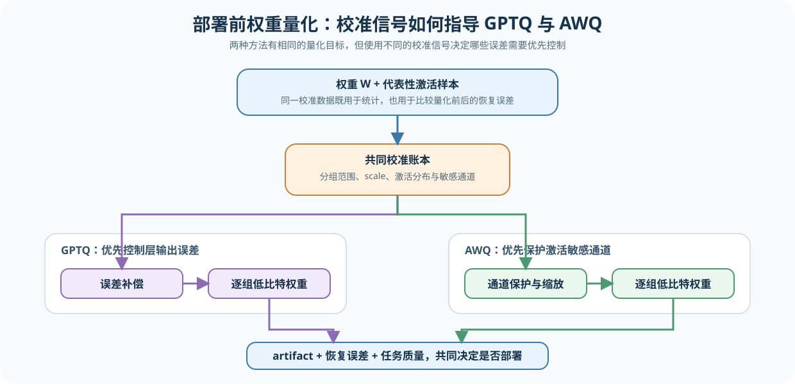
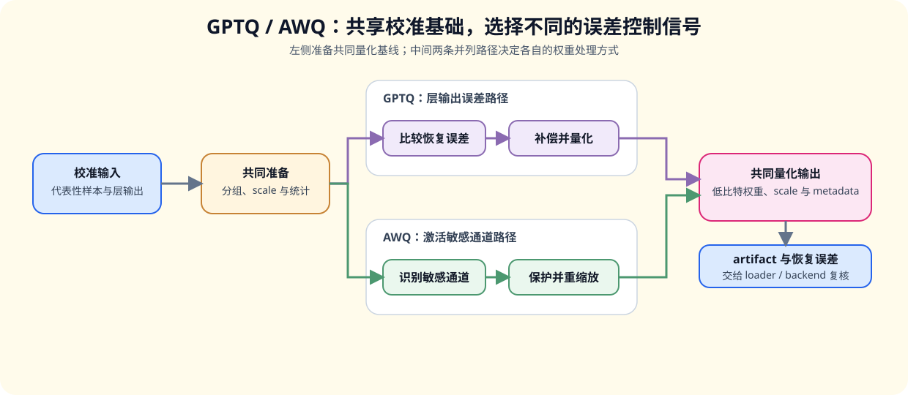

# 40. GPTQ and AWQ Weight Quantization | GPTQ 与 AWQ 权重量化
**难度：** Hard | **环境：** CPU-first，GPU 可选 | **标签：** `量化压缩`, `GPTQ`, `AWQ`, `artifact` | **目标人群：** 希望理解校准统计如何形成权重量化产物的学习者

> 🚀 **云端运行环境**
>
> 本章节的实战代码可以点击以下链接在免费 GPU 算力平台上直接运行：
>
> [](https://colab.research.google.com/github/datawhalechina/llm-algo-leetcode/blob/main/02_PyTorch_Algorithms/40_GPTQ_and_AWQ_Weight_Quantization.ipynb)
> [](https://modelscope.cn/my/mynotebook) *(国内推荐：魔搭社区免费实例)*


---

## 本节导读

W8A16 建立了整数码、量化参数和粒度的基础；继续压缩到 4-bit 后，不同通道对层输出的影响差异会变得更重要。GPTQ 使用校准激活近似二阶敏感度，降低量化误差对层输出的影响；AWQ 使用激活统计识别显著通道，通过缩放或保护减少关键权重的损失。

本节沿“校准统计 → group-wise 候选 → 层输出误差 → artifact metadata”分析两种方法。它负责说明产物必须保存什么，不代替 loader 兼容性、真实 kernel 和服务 benchmark。

**关键词：** `GPTQ`, `AWQ`, `Hessian proxy`, `activation statistics`, `quantized artifact`

---

## 前置阅读

**导语：** 先掌握独立校准协议和 group-wise 表示，再比较 GPTQ 与 AWQ 使用校准激活的不同方式。

- [52. Quantization Calibration and Error | 量化校准与误差控制](./52_Quantization_Calibration_and_Error.md)
- [25. W8A16 Quantization | W8A16 表示基础](./25_Quantization_W8A16.md)

---

### Step 1：校准统计怎样变成权重量化产物

权重量化产物不只是 packed weight。生成候选时需要固定源模型 revision、校准样本、bit width 和 group size；保存时还要记录 scale、zero point 或对称约定、packing layout、目标模块和方法专属统计。缺失这些信息，即使权重文件存在，也无法可靠恢复或交给 loader。

| 阶段 | 输入 | 产生的状态 | 进入下一阶段的条件 |
|---|---|---|---|
| 校准 | 独立 calibration 样本、浮点权重 | 激活 RMS、Hessian 近似或显著通道 | 统计维度与目标层一致 |
| 分组量化 | bit、group size、方法配置 | qweight、scale、保护/补偿状态 | 尾组完整、误差有限 |
| 层输出复核 | 同一校准输入与浮点输出 | 权重误差、加权误差、层输出误差 | 通过局部候选门槛 |
| artifact 生成 | 量化状态与模型身份 | 权重文件、配置与 manifest | metadata 完整后进入 82 |



### Step 2：GPTQ 如何使用激活统计近似输出敏感度

线性层输出为 `Y = XWᵀ`。同样大小的权重误差，如果落在输入经常激活的方向上，会造成更大的输出偏移。GPTQ 使用校准矩阵构造二阶信息；教学实现使用 `mean(X²)` 作为 Hessian 对角近似，对各输入通道的重构误差加权，从而区分普通权重 MSE 与输出敏感度代理。

| 统计或配置 | 机制意义 | 需要检查 |
|---|---|---|
| calibration matrix `X` | 代表目标 workload 的层输入 | 样本隔离、shape 与覆盖范围 |
| `XᵀX / N` 或对角近似 | 描述输入方向的局部敏感度 | 数值稳定性与通道对应关系 |
| `group_size` | 限制共享 scale 的权重范围 | 误差、元数据与 kernel 支持 |
| 加权重构误差 | 估计权重误差对层输出的影响 | 仍需独立任务质量复核 |

### Step 3：AWQ 如何使用激活统计保护显著通道

AWQ 关注输入激活幅度较大的通道，因为这些通道对应的权重误差更容易影响输出。教学路径先计算通道 RMS，再在每个 group 内标出显著通道；真实方法通常通过缩放把量化难度从激活与显著权重之间重新分配，而不是简单永久保存一份浮点权重。

| 方法 | 校准信号 | 决策重点 | 产物需要记录 |
|---|---|---|---|
| GPTQ | Hessian 或其近似 | 量化误差如何影响层输出 | bit、group size、scale、packing 与方法配置 |
| AWQ | 激活幅度与显著通道 | 哪些通道需要缩放或保护 | scale、显著性/缩放配置与 packing |
| 共同部分 | 独立校准输入 | 生成可复现的 group-wise 权重状态 | 模型 revision、目标模块与校准摘要 |



### Step 4：实现校准统计、显著通道与 artifact contract

题目区实现三个机制：从校准激活得到 RMS 和 Hessian 对角近似；为 AWQ 路径标记显著通道；为每个 group 生成安全 scale。分组循环、恢复、加权误差和 artifact manifest 由骨架提供，使测试能够核对统计、方法差异和产物元数据。

| TODO | 机制责任 | 关键测试 |
|:---|:---|:---|
| TODO 1 | `_collect_statistics` 生成 activation RMS 与 Hessian 对角近似 | shape、有限值、通道语义 |
| TODO 2 | `_awq_protection_mask` 标记 group 内显著通道 | 保护比例、局部下标、GPTQ/AWQ 差异 |
| TODO 3 | `fit` 生成未保护权重的 group scale | 全零 group、尾组、INT4 范围 |


```python
import torch
import torch.nn as nn
import torch.nn.functional as F

```


```python
class WeightQuantizerSim(nn.Module):
    """教学化比较 GPTQ 敏感度代理与 AWQ 显著通道策略。"""

    def __init__(self, bits: int = 4, group_size: int = 32, method: str = "gptq",
                 protect_ratio: float = 0.05, eps: float = 1e-8):
        super().__init__()
        if bits < 2 or group_size <= 0:
            raise ValueError("bits must be >= 2 and group_size must be positive")
        if method.lower() not in {"gptq", "awq"}:
            raise ValueError("method must be gptq or awq")
        if not 0.0 <= protect_ratio <= 1.0:
            raise ValueError("protect_ratio must be in [0, 1]")
        self.bits, self.group_size = bits, group_size
        self.method, self.protect_ratio, self.eps = method.lower(), protect_ratio, eps
        self.qmax = 2 ** (bits - 1) - 1
        self.register_buffer("qweight", torch.empty(0, dtype=torch.int8), persistent=False)
        self.register_buffer("scales", torch.empty(0), persistent=False)
        self.register_buffer("protected_weight", torch.empty(0), persistent=False)
        self.register_buffer("protected_mask", torch.empty(0, dtype=torch.bool), persistent=False)
        self.register_buffer("activation_rms", torch.empty(0), persistent=False)
        self.register_buffer("hessian_diag", torch.empty(0), persistent=False)
        self.weight_shape = None

    def _collect_statistics(self, activations: torch.Tensor, in_features: int):
        """返回每个输入通道的 activation RMS 与 Hessian 对角近似。"""
        flat = activations.detach().float().reshape(-1, activations.shape[-1])
        if flat.shape[-1] != in_features:
            raise ValueError("calibration activation dim does not match weight")
        # TODO 1（校准统计）：mean(X²) 是 Hessian 对角代理，RMS 是其平方根。
        # hessian_diag = ???
        # activation_rms = ???
        return activation_rms, hessian_diag

    def _awq_protection_mask(self, importance: torch.Tensor) -> torch.Tensor:
        """在当前 group 内按 activation RMS 标出需要保护的通道。"""
        mask = torch.zeros_like(importance, dtype=torch.bool)
        if self.method != "awq" or importance.numel() == 0 or self.protect_ratio == 0:
            return mask
        count = min(importance.numel(), max(1, int(round(importance.numel() * self.protect_ratio))))
        topk = torch.topk(importance, k=count, largest=True).indices
        # TODO 2（AWQ 显著通道）：把 topk 局部下标写入布尔 mask。
        # mask[topk] = ???
        return mask

    def fit(self, weight: torch.Tensor, activations: torch.Tensor) -> "WeightQuantizerSim":
        w = weight.detach().float()
        if w.ndim != 2:
            raise ValueError("weight must be a 2D Linear weight")
        out_features, in_features = w.shape
        self.weight_shape = (out_features, in_features)
        self.activation_rms, self.hessian_diag = self._collect_statistics(activations, in_features)
        n_groups = (in_features + self.group_size - 1) // self.group_size
        qweight = torch.zeros_like(w, dtype=torch.int8)
        scales = torch.zeros((out_features, n_groups), dtype=w.dtype, device=w.device)
        protected_weight = torch.zeros_like(w)
        protected_mask = torch.zeros_like(w, dtype=torch.bool)

        for row in range(out_features):
            for group in range(n_groups):
                start, end = group * self.group_size, min((group + 1) * self.group_size, in_features)
                chunk = w[row, start:end]
                mask = self._awq_protection_mask(self.activation_rms[start:end])
                protected_mask[row, start:end] = mask
                protected_weight[row, start:end] = chunk * mask.to(chunk.dtype)
                quantized_source = chunk[~mask] if (~mask).any() else chunk
                # TODO 3（group scale）：按未保护权重的 absmax 生成安全 scale。
                # scale = ???
                q_chunk = torch.zeros_like(chunk, dtype=torch.int8)
                q_chunk[~mask] = torch.clamp(torch.round(chunk[~mask] / scale), -self.qmax, self.qmax).to(torch.int8)
                qweight[row, start:end] = q_chunk
                scales[row, group] = scale

        self.qweight, self.scales = qweight, scales
        self.protected_weight, self.protected_mask = protected_weight, protected_mask
        return self

    def dequantize(self) -> torch.Tensor:
        """按 group 恢复权重，并回填教学化 AWQ 保护位置。"""
        if self.weight_shape is None:
            raise RuntimeError("Call fit() before dequantize().")
        out_features, in_features = self.weight_shape
        restored = torch.zeros((out_features, in_features), dtype=self.scales.dtype, device=self.scales.device)
        for row in range(out_features):
            for group in range(self.scales.shape[1]):
                start, end = group * self.group_size, min((group + 1) * self.group_size, in_features)
                chunk = self.qweight[row, start:end].to(self.scales.dtype) * self.scales[row, group]
                mask = self.protected_mask[row, start:end]
                chunk[mask] = self.protected_weight[row, start:end][mask]
                restored[row, start:end] = chunk
        return restored

    def mse(self, weight: torch.Tensor) -> torch.Tensor:
        return torch.mean((weight.float() - self.dequantize().float()) ** 2)

    def weighted_reconstruction_error(self, weight: torch.Tensor) -> torch.Tensor:
        """用 Hessian 对角代理加权各输入通道的权重误差。"""
        error = (weight.float() - self.dequantize().float()).square()
        return torch.mean(error * self.hessian_diag.reshape(1, -1))

    def artifact_manifest(self) -> dict[str, object]:
        """返回 loader/backend 后续验证所需的最小量化 metadata。"""
        if self.weight_shape is None:
            raise RuntimeError("Call fit() before artifact_manifest().")
        return {
            "schema_version": "weight-quant-artifact/v1",
            "method": self.method,
            "bits": self.bits,
            "group_size": self.group_size,
            "weight_shape": list(self.weight_shape),
            "scale_shape": list(self.scales.shape),
            "symmetric": True,
            "packing_layout": "teaching_int8_container",
            "calibration_statistics": ["activation_rms", "hessian_diag"],
            "protected_count": int(self.protected_mask.sum()),
        }

    def forward(self, x: torch.Tensor) -> torch.Tensor:
        return F.linear(x, self.dequantize().to(x.dtype))

```


```python
# 机制测试：校准统计、分组边界、AWQ 显著通道、GPTQ 误差代理与 artifact contract。
def test_calibration_statistics_contract():
    """RMS 与 Hessian 对角代理保持通道 shape 和平方关系。"""
    acts = torch.randn(3, 5, 8)
    rms, hessian = WeightQuantizerSim()._collect_statistics(acts, 8)
    assert rms.shape == hessian.shape == (8,)
    assert torch.allclose(rms.square(), hessian, atol=1e-6)


def test_group_partition_and_tail_contract():
    """不能整除的输入维度仍保留尾组。"""
    weight, acts = torch.randn(4, 10), torch.randn(16, 10)
    sim = WeightQuantizerSim(bits=4, group_size=4, method="gptq").fit(weight, acts)
    assert sim.scales.shape == (4, 3)
    assert sim.qweight.shape == weight.shape


def test_awq_protection_contract():
    """AWQ 保护高激活通道，GPTQ 不创建保护状态。"""
    weight = torch.randn(4, 8)
    acts = torch.ones(16, 8)
    acts[:, 3] = 20
    gptq = WeightQuantizerSim(group_size=4, method="gptq").fit(weight, acts)
    awq = WeightQuantizerSim(group_size=4, method="awq", protect_ratio=0.25).fit(weight, acts)
    assert not gptq.protected_mask.any()
    assert awq.protected_mask[:, 3].all()


def test_weighted_error_contract():
    """普通 MSE 与 Hessian 加权误差都可比较且保持有限。"""
    weight, acts = torch.randn(4, 8), torch.randn(16, 8)
    sim = WeightQuantizerSim(group_size=4, method="gptq").fit(weight, acts)
    assert torch.isfinite(sim.mse(weight))
    assert torch.isfinite(sim.weighted_reconstruction_error(weight))


def test_artifact_manifest_contract():
    """artifact manifest 保留恢复与后续兼容性检查所需 metadata。"""
    sim = WeightQuantizerSim(bits=4, group_size=4, method="awq", protect_ratio=0.25)
    sim.fit(torch.randn(4, 8), torch.randn(16, 8))
    manifest = sim.artifact_manifest()
    required = {"method", "bits", "group_size", "weight_shape", "scale_shape",
                "symmetric", "packing_layout", "calibration_statistics"}
    assert required <= set(manifest)
    assert manifest["method"] == "awq" and manifest["scale_shape"] == [4, 2]


for test in (
    test_calibration_statistics_contract,
    test_group_partition_and_tail_contract,
    test_awq_protection_contract,
    test_weighted_error_contract,
    test_artifact_manifest_contract,
):
    test()
print("✅ GPTQ/AWQ 机制测试通过：统计、分组、显著通道、误差代理与 artifact 均已验证。")

```

## 参考代码与解析

### 代码


```python
class WeightQuantizerSim(nn.Module):
    """教学化比较 GPTQ 敏感度代理与 AWQ 显著通道策略。"""

    def __init__(self, bits: int = 4, group_size: int = 32, method: str = "gptq",
                 protect_ratio: float = 0.05, eps: float = 1e-8):
        super().__init__()
        if bits < 2 or group_size <= 0:
            raise ValueError("bits must be >= 2 and group_size must be positive")
        if method.lower() not in {"gptq", "awq"}:
            raise ValueError("method must be gptq or awq")
        if not 0.0 <= protect_ratio <= 1.0:
            raise ValueError("protect_ratio must be in [0, 1]")
        self.bits, self.group_size = bits, group_size
        self.method, self.protect_ratio, self.eps = method.lower(), protect_ratio, eps
        self.qmax = 2 ** (bits - 1) - 1
        self.register_buffer("qweight", torch.empty(0, dtype=torch.int8), persistent=False)
        self.register_buffer("scales", torch.empty(0), persistent=False)
        self.register_buffer("protected_weight", torch.empty(0), persistent=False)
        self.register_buffer("protected_mask", torch.empty(0, dtype=torch.bool), persistent=False)
        self.register_buffer("activation_rms", torch.empty(0), persistent=False)
        self.register_buffer("hessian_diag", torch.empty(0), persistent=False)
        self.weight_shape = None

    def _collect_statistics(self, activations: torch.Tensor, in_features: int):
        """返回每个输入通道的 activation RMS 与 Hessian 对角近似。"""
        flat = activations.detach().float().reshape(-1, activations.shape[-1])
        if flat.shape[-1] != in_features:
            raise ValueError("calibration activation dim does not match weight")
        # TODO 1（校准统计）：mean(X²) 是 Hessian 对角代理，RMS 是其平方根。
        hessian_diag = flat.square().mean(dim=0)
        activation_rms = hessian_diag.sqrt()
        return activation_rms, hessian_diag

    def _awq_protection_mask(self, importance: torch.Tensor) -> torch.Tensor:
        """在当前 group 内按 activation RMS 标出需要保护的通道。"""
        mask = torch.zeros_like(importance, dtype=torch.bool)
        if self.method != "awq" or importance.numel() == 0 or self.protect_ratio == 0:
            return mask
        count = min(importance.numel(), max(1, int(round(importance.numel() * self.protect_ratio))))
        topk = torch.topk(importance, k=count, largest=True).indices
        # TODO 2（AWQ 显著通道）：把 topk 局部下标写入布尔 mask。
        mask[topk] = True
        return mask

    def fit(self, weight: torch.Tensor, activations: torch.Tensor) -> "WeightQuantizerSim":
        w = weight.detach().float()
        if w.ndim != 2:
            raise ValueError("weight must be a 2D Linear weight")
        out_features, in_features = w.shape
        self.weight_shape = (out_features, in_features)
        self.activation_rms, self.hessian_diag = self._collect_statistics(activations, in_features)
        n_groups = (in_features + self.group_size - 1) // self.group_size
        qweight = torch.zeros_like(w, dtype=torch.int8)
        scales = torch.zeros((out_features, n_groups), dtype=w.dtype, device=w.device)
        protected_weight = torch.zeros_like(w)
        protected_mask = torch.zeros_like(w, dtype=torch.bool)

        for row in range(out_features):
            for group in range(n_groups):
                start, end = group * self.group_size, min((group + 1) * self.group_size, in_features)
                chunk = w[row, start:end]
                mask = self._awq_protection_mask(self.activation_rms[start:end])
                protected_mask[row, start:end] = mask
                protected_weight[row, start:end] = chunk * mask.to(chunk.dtype)
                quantized_source = chunk[~mask] if (~mask).any() else chunk
                # TODO 3（group scale）：按未保护权重的 absmax 生成安全 scale。
                scale = (quantized_source.abs().max() / self.qmax).clamp_min(self.eps)
                q_chunk = torch.zeros_like(chunk, dtype=torch.int8)
                q_chunk[~mask] = torch.clamp(torch.round(chunk[~mask] / scale), -self.qmax, self.qmax).to(torch.int8)
                qweight[row, start:end] = q_chunk
                scales[row, group] = scale

        self.qweight, self.scales = qweight, scales
        self.protected_weight, self.protected_mask = protected_weight, protected_mask
        return self

    def dequantize(self) -> torch.Tensor:
        """按 group 恢复权重，并回填教学化 AWQ 保护位置。"""
        if self.weight_shape is None:
            raise RuntimeError("Call fit() before dequantize().")
        out_features, in_features = self.weight_shape
        restored = torch.zeros((out_features, in_features), dtype=self.scales.dtype, device=self.scales.device)
        for row in range(out_features):
            for group in range(self.scales.shape[1]):
                start, end = group * self.group_size, min((group + 1) * self.group_size, in_features)
                chunk = self.qweight[row, start:end].to(self.scales.dtype) * self.scales[row, group]
                mask = self.protected_mask[row, start:end]
                chunk[mask] = self.protected_weight[row, start:end][mask]
                restored[row, start:end] = chunk
        return restored

    def mse(self, weight: torch.Tensor) -> torch.Tensor:
        return torch.mean((weight.float() - self.dequantize().float()) ** 2)

    def weighted_reconstruction_error(self, weight: torch.Tensor) -> torch.Tensor:
        """用 Hessian 对角代理加权各输入通道的权重误差。"""
        error = (weight.float() - self.dequantize().float()).square()
        return torch.mean(error * self.hessian_diag.reshape(1, -1))

    def artifact_manifest(self) -> dict[str, object]:
        """返回 loader/backend 后续验证所需的最小量化 metadata。"""
        if self.weight_shape is None:
            raise RuntimeError("Call fit() before artifact_manifest().")
        return {
            "schema_version": "weight-quant-artifact/v1",
            "method": self.method,
            "bits": self.bits,
            "group_size": self.group_size,
            "weight_shape": list(self.weight_shape),
            "scale_shape": list(self.scales.shape),
            "symmetric": True,
            "packing_layout": "teaching_int8_container",
            "calibration_statistics": ["activation_rms", "hessian_diag"],
            "protected_count": int(self.protected_mask.sum()),
        }

    def forward(self, x: torch.Tensor) -> torch.Tensor:
        return F.linear(x, self.dequantize().to(x.dtype))

```

### 解析

**TODO 1：校准统计。** `mean(X²)` 是 Hessian 对角的教学代理，RMS 是其平方根。二者共享通道语义，但分别适合解释 GPTQ 的误差敏感度与 AWQ 的显著通道。

**TODO 2：AWQ 显著通道。** `topk` 只在当前 group 内排序，保护比例不会跨 group 混用。教学实现用原值回填展示保护效果；真实 AWQ 更常通过缩放迁移量化难度。

**TODO 3：group scale。** scale 来自当前 group 中未保护权重的局部范围；尾组和全零范围必须保持有效。恢复时只能使用同一行、同一 group 的 scale。

`artifact_manifest` 保存恢复和兼容性检查所需 metadata，但 `packing_layout=teaching_int8_container` 明确表示它不是可直接部署的 GPTQ/AWQ artifact。真实 loader 与 backend 验证由 82、67 承担。

### Step 5：可选 GPU 实验——用 LLM Compressor 生成 GPTQ / AWQ 产物

#### 5.1 环境、校准集与候选 recipe

实验让 GPTQ 与 AWQ 使用同一浮点 checkpoint、同一校准集和同一 W4A16 表示，再分别生成 compressed-tensors artifact。这样比较的是校准策略，而不是模型、数据或位宽差异。

| 路径 | LLM Compressor recipe | 本节产物 |
|---|---|---|
| GPTQ | `GPTQModifier(W4A16)` | GPTQ 校准后的 W4A16 artifact |
| AWQ | `AWQModifier` + `QuantizationModifier(W4A16)` | 激活感知缩放后的 W4A16 artifact |
| 浮点参考 | Transformers BF16 | 固定 greedy 输出基线 |


```python
# 5.1 只定义模型、校准文本与 artifact 目录；默认不下载模型、不占用 GPU。
from pathlib import Path

RUN_MODE = "dry_run"  # dry_run / real_gpu
MODEL_ID = "Qwen/Qwen2.5-0.5B-Instruct"
CALIBRATION_TEXTS = [
    "GPTQ uses calibration activations to reduce output reconstruction error.",
    "AWQ uses activation statistics to protect salient weight channels.",
    "Group size controls the sharing range of quantization parameters.",
    "Calibration data and evaluation prompts must remain separate.",
    "A quantized artifact needs a compatible loader and inference kernel.",
    "Weight-only quantization keeps runtime activations in floating point.",
    "Quantization quality must be checked on an independent workload.",
    "The same model and bit width are required for an algorithm comparison.",
]
EVAL_PROMPT = "Compare GPTQ and AWQ in one concise paragraph."
NUM_CALIBRATION_SAMPLES = len(CALIBRATION_TEXTS)
MAX_SEQ_LENGTH = 256
MAX_NEW_TOKENS = 32
SCHEME = "W4A16"
SEED = 42
RUN_LABEL = "default"  # 修改标签可保留多次复测产物，避免覆盖旧结果
ARTIFACT_ROOT = Path("benchmarks/artifacts/40_gptq_awq") / RUN_LABEL
OUTPUT_PATH = Path("benchmarks/results/40_llmcompressor_gptq_awq_artifacts.json")

```


```python
# 5.2 使用 LLM Compressor 在同一校准集上分别生成 GPTQ 与 AWQ artifact。
import importlib.metadata
import json
import platform
import time

import torch


def package_version(name):
    """读取依赖版本；缺失时返回 None。"""
    try:
        return importlib.metadata.version(name)
    except importlib.metadata.PackageNotFoundError:
        return None


def directory_bytes(path):
    """统计 artifact 目录中的文件总字节数。"""
    return sum(item.stat().st_size for item in path.rglob("*") if item.is_file())


def token_prefix_agreement(reference, candidate):
    """计算固定 greedy 输出的公共前缀比例。"""
    width = max(1, min(len(reference), len(candidate)))
    matched = 0
    for left, right in zip(reference, candidate):
        if left != right:
            break
        matched += 1
    return matched / width


result = {
    "schema_version": "quantization-mechanism-gpu/v2",
    "chapter": "40",
    "run_mode": RUN_MODE,
    "framework": {
        "python": platform.python_version(),
        "torch": torch.__version__,
        "transformers": package_version("transformers"),
        "llmcompressor": package_version("llmcompressor"),
        "compressed_tensors": package_version("compressed-tensors"),
    },
    "hardware": {
        "cuda_available": torch.cuda.is_available(),
        "cuda": torch.version.cuda,
        "device": torch.cuda.get_device_name(0) if torch.cuda.is_available() else None,
    },
    "workload": {
        "model_id": MODEL_ID,
        "calibration_samples": NUM_CALIBRATION_SAMPLES,
        "max_seq_length": MAX_SEQ_LENGTH,
        "eval_prompt": EVAL_PROMPT,
        "max_new_tokens": MAX_NEW_TOKENS,
        "scheme": SCHEME,
        "seed": SEED,
        "run_label": RUN_LABEL,
    },
    "baseline": {"name": "bf16"},
    "candidates": {
        "gptq": {"recipe": "GPTQModifier(W4A16)"},
        "awq": {"recipe": "AWQModifier + QuantizationModifier(W4A16)"},
    },
    "failure": None,
    "evidence_level": "environment_preflight",
    "decision": "ready_to_measure",
}

if RUN_MODE == "real_gpu":
    try:
        if not torch.cuda.is_available():
            raise RuntimeError("RUN_MODE=real_gpu 但 CUDA 不可用")
        if ARTIFACT_ROOT.exists():
            raise FileExistsError(
                f"artifact 目录已存在：{ARTIFACT_ROOT}；请修改 RUN_LABEL 后复测"
            )

        from compressed_tensors.offload import dispatch_model
        from datasets import Dataset
        from llmcompressor import oneshot
        from llmcompressor.modifiers.gptq import GPTQModifier
        from llmcompressor.modifiers.quantization import QuantizationModifier
        from llmcompressor.modifiers.transform.awq import AWQModifier
        from transformers import AutoModelForCausalLM, AutoTokenizer

        torch.manual_seed(SEED)
        tokenizer = AutoTokenizer.from_pretrained(MODEL_ID, use_fast=True)
        eval_inputs = tokenizer(EVAL_PROMPT, return_tensors="pt")
        calibration = Dataset.from_dict({"text": CALIBRATION_TEXTS})
        calibration = calibration.map(
            lambda row: tokenizer(
                row["text"],
                padding=False,
                truncation=True,
                max_length=MAX_SEQ_LENGTH,
                add_special_tokens=False,
            ),
            remove_columns=["text"],
        )

        def load_model():
            """每条路径从同一浮点 checkpoint 独立加载。"""
            return AutoModelForCausalLM.from_pretrained(
                MODEL_ID,
                torch_dtype=torch.bfloat16,
                device_map="auto",
            ).eval()

        def generate_tokens(model):
            """执行固定 prompt 的 greedy 生成。"""
            dispatch_model(model)
            device = next(model.parameters()).device
            inputs = {key: value.to(device) for key, value in eval_inputs.items()}
            with torch.inference_mode():
                output = model.generate(
                    **inputs,
                    max_new_tokens=MAX_NEW_TOKENS,
                    do_sample=False,
                    pad_token_id=tokenizer.eos_token_id,
                )
            return output[0, inputs["input_ids"].shape[1]:].detach().cpu().tolist()

        baseline_model = load_model()
        baseline_tokens = generate_tokens(baseline_model)
        result["baseline"]["generated_tokens"] = len(baseline_tokens)
        del baseline_model
        torch.cuda.empty_cache()

        recipes = {
            "gptq": [GPTQModifier(targets="Linear", scheme=SCHEME, ignore=["lm_head"])],
            "awq": [
                AWQModifier(),
                QuantizationModifier(targets="Linear", scheme=SCHEME, ignore=["lm_head"]),
            ],
        }
        metrics = {}
        for name, recipe in recipes.items():
            artifact_dir = ARTIFACT_ROOT / name
            model = load_model()
            torch.cuda.reset_peak_memory_stats()
            started = time.perf_counter()
            oneshot(
                model=model,
                tokenizer=tokenizer,
                dataset=calibration,
                recipe=recipe,
                num_calibration_samples=NUM_CALIBRATION_SAMPLES,
                max_seq_length=MAX_SEQ_LENGTH,
                output_dir=str(artifact_dir),
                clear_sparse_session=True,
            )
            calibration_seconds = time.perf_counter() - started
            candidate_tokens = generate_tokens(model)
            metrics[name] = {
                "artifact_path": str(artifact_dir),
                "artifact_bytes": directory_bytes(artifact_dir),
                "calibration_seconds": calibration_seconds,
                "peak_allocated_bytes": int(torch.cuda.max_memory_allocated()),
                "generated_tokens": len(candidate_tokens),
                "greedy_prefix_agreement": token_prefix_agreement(
                    baseline_tokens, candidate_tokens
                ),
            }
            del model
            torch.cuda.empty_cache()

        result.update({
            "candidates": metrics,
            "evidence_level": "matched_llmcompressor_gptq_awq_artifact_experiment",
            "decision": "accept" if all(
                item["greedy_prefix_agreement"] >= 0.8 for item in metrics.values()
            ) else "tune",
        })
    except Exception as exc:
        result.update({
            "failure": {"type": type(exc).__name__, "message": str(exc)},
            "evidence_level": "failed_real_gpu_attempt",
            "decision": "reject_until_environment_fixed",
        })

OUTPUT_PATH.parent.mkdir(parents=True, exist_ok=True)
OUTPUT_PATH.write_text(json.dumps(result, ensure_ascii=False, indent=2), encoding="utf-8")
print(json.dumps(result, ensure_ascii=False, indent=2))

```

#### 5.3 读取 artifact 与校准结果

读取单元集中检查两类 artifact 的路径、大小、校准成本、输出稳定性和失败状态，不重新运行量化。


```python
# 5.3 只读取 5.2 保存的 JSON。
if OUTPUT_PATH.exists():
    saved = json.loads(OUTPUT_PATH.read_text(encoding="utf-8"))
    keys = (
        "framework",
        "hardware",
        "workload",
        "baseline",
        "candidates",
        "failure",
        "evidence_level",
        "decision",
    )
    print({key: saved.get(key) for key in keys})
else:
    print(f"等待 GPTQ/AWQ artifact 结果：{OUTPUT_PATH}")

```

#### 5.4 解释校准策略与产物证据

两条路径只有在模型、校准集、位宽和评测 prompt 全部一致时才可比较。本节确认算法能够产生可追踪 artifact，并用固定 greedy 输出做最小质量门槛；是否命中高效 kernel、是否提升端到端吞吐，应交给兼容 backend 继续验证。

| 观察项 | 读取字段 | 判断问题 |
|---|---|---|
| 校准策略 | `recipe`、`calibration_seconds` | GPTQ 与 AWQ 付出了什么校准成本 |
| 产物契约 | `artifact_path`、`artifact_bytes` | 是否生成可加载、可版本化的压缩产物 |
| 最小质量门槛 | `greedy_prefix_agreement` | 固定输出是否出现明显退化 |
| 证据可信度 | `failure`、`evidence_level` | 是否真实执行成熟库 recipe |
| 下一步 | `decision` | accept / tune / reject_until_environment_fixed |

## 相关阅读

- [GPTQ 原论文](https://arxiv.org/abs/2210.17323)
- [AWQ 原论文](https://arxiv.org/abs/2306.00978)
- [LLM Compressor：GPTQ W4A16 示例](https://github.com/vllm-project/llm-compressor/tree/main/examples/quantization_w4a16)
- [LLM Compressor：AWQ 说明与示例](https://github.com/vllm-project/llm-compressor/tree/main/examples/awq)
- [82. Quantization Artifact Evaluation Project | 量化产物评估](./82_Quantization_Artifact_Evaluation_Project.md)
