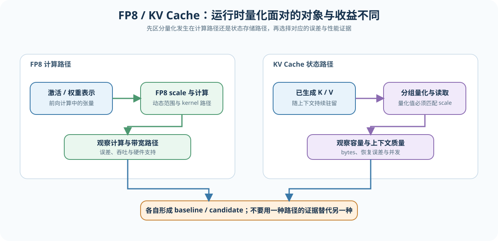
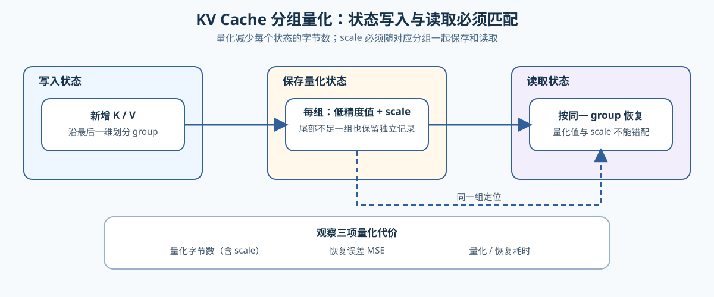

# 41. FP8 and KV Cache Quantization | FP8 与 KV Cache 量化
**难度：** Hard | **环境：** CPU-first | **标签：** `量化压缩`, `FP8`, `KV Cache` | **目标人群：** 量化压缩学习者

> 🚀 **云端运行环境**
>
> 本章节的实战代码可以点击以下链接在免费 GPU 算力平台上直接运行：
>
> [](https://colab.research.google.com/github/datawhalechina/llm-algo-leetcode/blob/main/02_PyTorch_Algorithms/41_FP8_and_KV_Cache_Quantization.ipynb)
> [](https://modelscope.cn/my/mynotebook) *(国内推荐：魔搭社区免费实例)*


---

## 本节导读

第 40 节关注的是权重量化：把模型参数压得更小，降低加载和访存成本。但推理阶段的压力不只来自权重。长上下文生成时，KV Cache 会随着序列长度和并发请求持续增长；同时，部分激活或中间张量也会带来带宽压力。只压权重，不能完全解决长上下文推理的显存和带宽瓶颈。

本节用一个极简 `FP8KVCacheSim` 模拟两类推理量化：用对称低精度量化近似 FP8 张量，用分组 scale 量化 KV Cache。学完后，你应该能看清“量化值、scale、反量化、误差检查”这条闭环，以及为什么 KV Cache 通常需要按最后一维分组处理；还要能区分存储压缩、运行时反量化和真实低比特 kernel 三种不同证据。

本节关注运行时张量和 KV Cache：CPU 模拟解释 scale、分组和误差，`40` 继续处理 GPTQ/AWQ 权重量化，`67` 负责 GGUF、真实 FP8 kernel 和 backend 验证。

**关键词：** `FP8`, `KV cache quantization`, `deployment`


---

## 前置阅读

**导语：** 进入本节前，先能区分权重量化与运行时张量量化，再观察 FP8 和 KV Cache 量化如何改变存储、带宽与误差。
- [22. vLLM PagedAttention | vLLM 分页注意力](./22_vLLM_PagedAttention.md)
- [25. Quantization W8A16 | W8A16 量化](./25_Quantization_W8A16.md)
- [40. GPTQ and AWQ Weight Quantization | GPTQ 与 AWQ 权重量化](./40_GPTQ_and_AWQ_Weight_Quantization.md)

---

### Step 1: 运行时量化如何改变推理状态

生成式推理会持续追加 KV Cache；上下文越长、并发越高，缓存越容易成为显存容量和带宽压力。本节从运行时量化出发，追踪“浮点状态 → 量化值与 scale → 恢复结果”的闭环。Decode 下一轮可以保留量化表示、按需反量化，或交给支持低精度输入的 kernel，因此缓存字节数和 Decode 延迟需要分别测量。

先区分普通激活与 KV Cache，再沿主图观察它们共享的量化状态。分页、前缀匹配、驱逐和请求调度属于 Cache 管理策略，Step 3 会把它们与量化路径区分开。

| 量化对象 | 发生时机 | 主要成本 | 需要保留的状态 |
|---|---|---|---|
| 普通激活 / 中间张量 | 算子执行或数据传递过程中 | 存储与带宽 | 低精度值、scale、原始 shape |
| KV Cache | 请求执行过程中持续追加和读取 | 长上下文显存与缓存带宽 | 分组量化值、每组 scale、缓存 shape |
| 共同验证 | 量化后恢复时 | 误差与额外处理时间 | 恢复结果、MSE、耗时和字节数 |



### Step 2: FP8 近似量化如何保存和恢复张量

本节用 INT8 容器模拟低精度张量的保存路径：先根据 `absmax` 得到 scale，再把浮点值映射为整数，恢复时用同一个 scale 还原近似值。可以把它写成 `q = round(x * scale)`、`x_hat = q / scale`；因此 scale、量化值和原始 shape 缺一不可。

这里重点观察动态范围变化如何影响量化误差和存储字节数。真实 FP8 不只是把 FP32 截成更少的 bit，还要选择格式、保存 scale，并确认输入、累加和输出 dtype 的组合；不同硬件和 backend 可能选择不同的执行路径。

| 维度 | E4M3 | E5M2 | 对推理路径的影响 |
|---|---|---|---|
| 指数位 / 尾数位 | 4 / 3 | 5 / 2 | 精度与动态范围取舍不同 |
| 更关注的场景 | 前向计算、权重或激活表示 | 梯度或动态范围更大的数值 | 不能只看存储 bit 数 |
| 需要记录 | dtype、scale、硬件支持 | dtype、scale、硬件支持 | 判断是否进入目标 kernel |

### Step 3: KV Cache 如何按分组量化并参与复用

KV Cache 沿最后一维分组，每组保存一套 scale。`kv_group_size` 越小，scale 对局部数值范围的适应性通常越强，但元数据和量化处理次数也会增加。追加新 token 时，需要按相同的分组规则更新状态；读取历史状态时，还要保证 scale 与对应的 K/V 数据一起定位。先通过表格明确实验变量，再同时观察缓存字节数、恢复误差和量化/恢复耗时。

量化和 Cache 管理解决的是不同问题：量化减少每个状态的字节数，分页减少物理分配碎片，Prefix Cache 减少重复 Prefill，驱逐控制驻留容量。对照实验应一次只改变一个主要变量。一个简化的 KV Cache 账本可以写成 `bytes = tokens × layers × 2(K/V) × kv_heads × head_dim × dtype_bytes`；量化主要改变最后一项，但 scale 元数据和恢复开销仍需单独记录。

| 变量 | 影响对象 | 主要观察 |
|---|---|---|
| `seq_len` | 缓存总量 | 长上下文压力 |
| `kv_group_size` | scale 数量与局部误差 | 压缩比、MSE、耗时 |
| `dtype` / 容器位宽 | 单元素存储 | 原始字节与量化字节 |



### Step 4: 实现并验证运行时量化状态

题目区接收浮点张量和量化配置，完成对称量化、FP8 近似状态记录、KV Cache 分组量化、反量化与误差计算，输出量化值、scale、shape、恢复结果和 MSE。实现时要保持量化状态和原始 shape 可追溯，并让同一份 scale 规则贯穿量化、追加、恢复和误差检查。先按表格定位每个函数的输入输出，再实现最小闭环。

| 实现部分 | 代码需要完成的工作 | 验证重点 |
|---|---|---|
| 对称量化 | 用 `absmax` 计算 scale，并生成受范围约束的低精度值 | 全零输入不产生 NaN/Inf，dtype 正确 |
| FP8 近似状态 | 保存量化值、scale 和原始 shape | 反量化后 shape 一致，误差可计算 |
| KV Cache 分组 | 沿最后一维切分并保存每组 scale | 分组边界、字节数和恢复结果正确 |
| 误差评估 | 恢复张量并计算 MSE | 量化与恢复流程可重复比较 |


```python
import torch
import torch.nn as nn

```


```python
# 任务目标：在同一状态契约下完成运行时量化、KV Cache 分组和误差验证。
# TODO 1 对称量化 → TODO 2 保存 FP8 状态 → TODO 3 分组保存 KV Cache → TODO 4 恢复 KV Cache → TODO 5 评估误差。

class FP8KVCacheSim(nn.Module):
    """保存量化值、scale 和 shape 的最小运行时量化模拟器。

    `fp8_qmax` 是量化整数范围上限，`kv_group_size` 是 KV Cache 最后一维共享
    一套 scale 的元素数，`eps` 用于避免全零或极小动态范围下的除零。
    """

    def __init__(self, fp8_qmax: int = 127, kv_group_size: int = 64, eps: float = 1e-8):
        super().__init__()
        if kv_group_size <= 0:
            raise ValueError("kv_group_size must be positive")
        self.fp8_qmax = fp8_qmax
        self.kv_group_size = kv_group_size
        self.eps = eps

        self.register_buffer("fp8_q", torch.empty(0, dtype=torch.int8), persistent=False)
        self.register_buffer("fp8_scale", torch.tensor(1.0), persistent=False)
        self.register_buffer("kv_q", torch.empty(0, dtype=torch.int8), persistent=False)
        self.register_buffer("kv_scale", torch.empty(0), persistent=False)
        self.fp8_shape = None
        self.kv_shape = None

    def _sym_quantize(self, x: torch.Tensor, qmax: int):
        x = x.detach().float()
        # ==========================================
        # TODO 1: 补完对称量化闭环
        # 提示: 先算 absmax，再算 scale = qmax / absmax.clamp_min(self.eps)，
        # 最后做 round + clamp + int8 转换得到 q。
        # ==========================================
        # absmax = ???
        # scale = ???
        # q = ???
        return q, scale

    def _sym_dequantize(self, q: torch.Tensor, scale: torch.Tensor):
        return q.to(scale.dtype) / scale.clamp_min(self.eps)

    def quantize_fp8(self, x: torch.Tensor):
        q, scale = self._sym_quantize(x, self.fp8_qmax)
        self.fp8_q = q
        self.fp8_scale = scale
        # ==========================================
        # TODO 2: 保存 FP8 状态契约中的原始 shape
        # 提示: 这里先记录 self.fp8_shape = tuple(x.shape)。
        # 后面 quantize_kv_cache 里再补 n_groups，用它初始化 scales。
        # ==========================================
        # self.fp8_shape = ???
        return q, scale

    def dequantize_fp8(self):
        if self.fp8_shape is None:
            raise RuntimeError("Call quantize_fp8() before dequantize_fp8().")
        return self._sym_dequantize(self.fp8_q, self.fp8_scale)

    def quantize_kv_cache(self, kv_cache: torch.Tensor):
        kv = kv_cache.detach().float()
        if kv.ndim < 2:
            raise ValueError("KV cache should have at least 2 dimensions.")

        last_dim = kv.size(-1)
        # ==========================================
        # TODO 3: 计算 KV Cache 的分组状态
        # 提示: n_groups 用向上取整计算，最后一组可以不足 kv_group_size。
        # ==========================================
        # n_groups = ???
        qkv = torch.zeros_like(kv, dtype=torch.int8)
        scales = torch.zeros(kv.shape[:-1] + (n_groups,), dtype=kv.dtype, device=kv.device)

        flat = kv.reshape(-1, last_dim)
        flat_q = qkv.reshape(-1, last_dim)
        flat_scale = scales.reshape(-1, n_groups)

        for row in range(flat.size(0)):
            for g in range(n_groups):
                start = g * self.kv_group_size
                end = min(start + self.kv_group_size, last_dim)
                chunk = flat[row, start:end]
                if chunk.numel() == 0:
                    continue
                q, scale = self._sym_quantize(chunk, self.fp8_qmax)
                flat_q[row, start:end] = q
                flat_scale[row, g] = scale

        self.kv_q = qkv
        self.kv_scale = scales
        self.kv_shape = tuple(kv.shape)
        return qkv, scales

    def dequantize_kv_cache(self):
        if self.kv_shape is None:
            raise RuntimeError("Call quantize_kv_cache() before dequantize_kv_cache().")

        kv = self.kv_q.to(self.kv_scale.dtype)
        last_dim = kv.size(-1)
        n_groups = self.kv_scale.size(-1)
        flat = kv.reshape(-1, last_dim)
        flat_out = torch.zeros_like(flat, dtype=self.kv_scale.dtype)
        flat_scale = self.kv_scale.reshape(-1, n_groups)

        for row in range(flat.size(0)):
            for g in range(n_groups):
                start = g * self.kv_group_size
                end = min(start + self.kv_group_size, last_dim)
                scale = flat_scale[row, g]
                # ==========================================
                # TODO 4: 恢复当前 KV Cache 分组
                # 提示: 先用当前 group 的 scale 恢复 flat[row, start:end]，
                # 再把 restored_chunk 写回 flat_out 的同一区间。
                # ==========================================
                # restored_chunk = ???
                flat_out[row, start:end] = restored_chunk

        return flat_out.reshape(self.kv_shape)

    def fit(self, hidden_states: torch.Tensor, kv_cache: torch.Tensor | None = None):
        self.quantize_fp8(hidden_states)
        if kv_cache is not None:
            self.quantize_kv_cache(kv_cache)
        return self

    def forward(self, hidden_states: torch.Tensor, kv_cache: torch.Tensor | None = None):
        fp8_q, fp8_scale = self._sym_quantize(hidden_states, self.fp8_qmax)
        fp8_restored = self._sym_dequantize(fp8_q, fp8_scale)

        if kv_cache is None:
            return fp8_restored

        self.quantize_kv_cache(kv_cache)
        kv_restored = self.dequantize_kv_cache()
        return fp8_restored, kv_restored

    def mse(self, original: torch.Tensor, restored: torch.Tensor) -> torch.Tensor:
        # ==========================================
        # TODO 5: 完成恢复后的误差评估
        # 提示: 把 original / restored 转成 float 后，相减平方再求平均。
        # ==========================================
        # error = ???
        return error

```


```python
def test_symmetric_quantization_contract():
    sim = FP8KVCacheSim(fp8_qmax=127, kv_group_size=4)
    x = torch.tensor([-2.0, 0.0, 1.0, 2.0])
    q, scale = sim._sym_quantize(x, sim.fp8_qmax)
    restored = sim._sym_dequantize(q, scale)
    assert q.dtype == torch.int8
    assert torch.isfinite(scale).all()
    assert torch.isfinite(restored).all()
    assert float((restored - x).abs().max()) < 0.03


def test_fp8_state_contract():
    sim = FP8KVCacheSim(fp8_qmax=127, kv_group_size=4)
    hidden = torch.randn(2, 8)
    sim.quantize_fp8(hidden)
    assert sim.fp8_q.dtype == torch.int8
    assert sim.fp8_shape == tuple(hidden.shape)
    assert sim.dequantize_fp8().shape == hidden.shape


def test_kv_group_partition_contract():
    sim = FP8KVCacheSim(fp8_qmax=127, kv_group_size=4)
    kv = torch.randn(2, 3, 7)
    sim.quantize_kv_cache(kv)
    assert sim.kv_q.dtype == torch.int8
    assert sim.kv_scale.shape == (2, 3, 2)
    assert sim.kv_shape == tuple(kv.shape)


def test_kv_dequantization_contract():
    sim = FP8KVCacheSim(fp8_qmax=127, kv_group_size=4)
    kv = torch.randn(2, 3, 8)
    sim.quantize_kv_cache(kv)
    restored = sim.dequantize_kv_cache()
    assert restored.shape == kv.shape
    assert torch.isfinite(restored).all()
    assert float((restored - kv).abs().mean()) < 0.03


def test_zero_input_and_error_metric_contract():
    sim = FP8KVCacheSim(fp8_qmax=127, kv_group_size=4)
    hidden = torch.zeros(2, 7)
    kv = torch.zeros(1, 2, 7)
    sim.fit(hidden, kv)
    assert torch.isfinite(sim.dequantize_fp8()).all()
    assert torch.isfinite(sim.dequantize_kv_cache()).all()
    assert sim.kv_scale.shape[-1] == 2
    assert float(sim.mse(hidden, sim.dequantize_fp8())) == 0.0


def run_fp8_kv_cache_tests():
    for test in (
        test_symmetric_quantization_contract,
        test_fp8_state_contract,
        test_kv_group_partition_contract,
        test_kv_dequantization_contract,
        test_zero_input_and_error_metric_contract,
    ):
        test()
    print('✅ FP8/KV Cache 机制测试通过：量化、状态、分组、恢复与误差均已验证。')


run_fp8_kv_cache_tests()

```

---

🛑 **STOP HERE** 🛑
<br><br><br><br><br><br><br><br><br><br>
> 请先尝试自己完成代码并跑通测试。<br>
> 如果你正在 Colab 中运行，并且遇到困难没有思路，可以向下滚动查看参考答案。
<br><br><br><br><br><br><br><br><br><br>

---

## 参考代码与解析

### 代码


```python
# 参考实现：与题目区保持同一结构，仅补全 TODO 1–4。

class FP8KVCacheSim(nn.Module):
    """保存量化值、scale 和 shape 的最小运行时量化模拟器。

    `fp8_qmax` 是量化整数范围上限，`kv_group_size` 是 KV Cache 最后一维共享
    一套 scale 的元素数，`eps` 用于避免全零或极小动态范围下的除零。
    """

    def __init__(self, fp8_qmax: int = 127, kv_group_size: int = 64, eps: float = 1e-8):
        super().__init__()
        if kv_group_size <= 0:
            raise ValueError("kv_group_size must be positive")
        self.fp8_qmax = fp8_qmax
        self.kv_group_size = kv_group_size
        self.eps = eps

        self.register_buffer("fp8_q", torch.empty(0, dtype=torch.int8), persistent=False)
        self.register_buffer("fp8_scale", torch.tensor(1.0), persistent=False)
        self.register_buffer("kv_q", torch.empty(0, dtype=torch.int8), persistent=False)
        self.register_buffer("kv_scale", torch.empty(0), persistent=False)
        self.fp8_shape = None
        self.kv_shape = None

    def _sym_quantize(self, x: torch.Tensor, qmax: int):
        x = x.detach().float()
        # ==========================================
        # TODO 1: 补完对称量化闭环
        # 提示: 先算 absmax，再算 scale = qmax / absmax.clamp_min(self.eps)，
        # 最后做 round + clamp + int8 转换得到 q。
        # ==========================================
        # absmax = ???
        absmax = torch.max(torch.abs(x))
        # scale = ???
        scale = qmax / absmax.clamp_min(self.eps)
        # q = ???
        q = torch.clamp(torch.round(x * scale), -qmax, qmax).to(torch.int8)
        return q, scale

    def _sym_dequantize(self, q: torch.Tensor, scale: torch.Tensor):
        return q.to(scale.dtype) / scale.clamp_min(self.eps)

    def quantize_fp8(self, x: torch.Tensor):
        q, scale = self._sym_quantize(x, self.fp8_qmax)
        self.fp8_q = q
        self.fp8_scale = scale
        # ==========================================
        # TODO 2: 保存 FP8 状态契约中的原始 shape
        # 提示: 这里先记录 self.fp8_shape = tuple(x.shape)。
        # 后面 quantize_kv_cache 里再补 n_groups，用它初始化 scales。
        # ==========================================
        # self.fp8_shape = ???
        self.fp8_shape = tuple(x.shape)
        return q, scale

    def dequantize_fp8(self):
        if self.fp8_shape is None:
            raise RuntimeError("Call quantize_fp8() before dequantize_fp8().")
        return self._sym_dequantize(self.fp8_q, self.fp8_scale)

    def quantize_kv_cache(self, kv_cache: torch.Tensor):
        kv = kv_cache.detach().float()
        if kv.ndim < 2:
            raise ValueError("KV cache should have at least 2 dimensions.")

        last_dim = kv.size(-1)
        # ==========================================
        # TODO 3: 计算 KV Cache 的分组状态
        # 提示: n_groups 用向上取整计算，最后一组可以不足 kv_group_size。
        # ==========================================
        # n_groups = ???
        n_groups = (last_dim + self.kv_group_size - 1) // self.kv_group_size
        qkv = torch.zeros_like(kv, dtype=torch.int8)
        scales = torch.zeros(kv.shape[:-1] + (n_groups,), dtype=kv.dtype, device=kv.device)

        flat = kv.reshape(-1, last_dim)
        flat_q = qkv.reshape(-1, last_dim)
        flat_scale = scales.reshape(-1, n_groups)

        for row in range(flat.size(0)):
            for g in range(n_groups):
                start = g * self.kv_group_size
                end = min(start + self.kv_group_size, last_dim)
                chunk = flat[row, start:end]
                if chunk.numel() == 0:
                    continue
                q, scale = self._sym_quantize(chunk, self.fp8_qmax)
                flat_q[row, start:end] = q
                flat_scale[row, g] = scale

        self.kv_q = qkv
        self.kv_scale = scales
        self.kv_shape = tuple(kv.shape)
        return qkv, scales

    def dequantize_kv_cache(self):
        if self.kv_shape is None:
            raise RuntimeError("Call quantize_kv_cache() before dequantize_kv_cache().")

        kv = self.kv_q.to(self.kv_scale.dtype)
        last_dim = kv.size(-1)
        n_groups = self.kv_scale.size(-1)
        flat = kv.reshape(-1, last_dim)
        flat_out = torch.zeros_like(flat, dtype=self.kv_scale.dtype)
        flat_scale = self.kv_scale.reshape(-1, n_groups)

        for row in range(flat.size(0)):
            for g in range(n_groups):
                start = g * self.kv_group_size
                end = min(start + self.kv_group_size, last_dim)
                scale = flat_scale[row, g]
                # ==========================================
                # TODO 4: 恢复当前 KV Cache 分组
                # 提示: 先用当前 group 的 scale 恢复 flat[row, start:end]，
                # 再把 restored_chunk 写回 flat_out 的同一区间。
                # ==========================================
                # restored_chunk = ???
                restored_chunk = self._sym_dequantize(flat[row, start:end], scale)
                flat_out[row, start:end] = restored_chunk

        return flat_out.reshape(self.kv_shape)

    def fit(self, hidden_states: torch.Tensor, kv_cache: torch.Tensor | None = None):
        self.quantize_fp8(hidden_states)
        if kv_cache is not None:
            self.quantize_kv_cache(kv_cache)
        return self

    def forward(self, hidden_states: torch.Tensor, kv_cache: torch.Tensor | None = None):
        fp8_q, fp8_scale = self._sym_quantize(hidden_states, self.fp8_qmax)
        fp8_restored = self._sym_dequantize(fp8_q, fp8_scale)

        if kv_cache is None:
            return fp8_restored

        self.quantize_kv_cache(kv_cache)
        kv_restored = self.dequantize_kv_cache()
        return fp8_restored, kv_restored

    def mse(self, original: torch.Tensor, restored: torch.Tensor) -> torch.Tensor:
        # ==========================================
        # TODO 5: 完成恢复后的误差评估
        # 提示: 把 original / restored 转成 float 后，相减平方再求平均。
        # ==========================================
        # error = ???
        error = torch.mean((original.float() - restored.float()) ** 2)
        return error

```

### 解析

TODO 1：`_sym_quantize` 负责补完最小对称量化闭环。先用 `absmax = torch.max(torch.abs(x))` 找到动态范围，再用 `scale = qmax / absmax.clamp_min(self.eps)` 计算缩放系数，最后做 `round + clamp + int8` 得到低精度张量 `q`。

TODO 2：`quantize_fp8` 保存 `self.fp8_shape = tuple(x.shape)`，让反量化结果保留原始状态的形状契约。

TODO 3：`quantize_kv_cache` 用 `n_groups = (last_dim + self.kv_group_size - 1) // self.kv_group_size` 向上取整，允许最后一组不足 `kv_group_size`，并为每组保存独立 scale。

TODO 4：`dequantize_kv_cache` 用当前 group 的 scale 恢复并写回原区间，`mse` 再计算重构误差，完成“量化 -> 恢复 -> 评估”的最小闭环。

**FP8 与 KV Cache 量化核心机制**
- **FP8 近似**：用低精度值和 scale 保存张量，降低带宽和存储压力
- **KV Cache 分组**：对最后一维分组保存 scale，使长上下文缓存可以更细粒度地压缩和恢复
- **量化闭环**：任何推理量化都要同时记录低精度值、scale、shape 和恢复误差

**工程优化要点**
- **硬件格式**：真实 FP8 通常涉及 E4M3 / E5M2、Tensor Core 支持和 kernel 路径，本节只模拟核心思想
- **缓存收益**：KV Cache 量化对长上下文和高并发更有价值，因为缓存大小会随序列长度线性增长
- **精度边界**：KV Cache 参与后续 attention，过度压缩可能影响生成质量，需要结合 perplexity、任务指标和在线效果验证

### Step 5：可选 GPU 实验——测量 FP8 / KV Cache 模拟路径


实验从真实模型的 past_key_values 取得一段实际 KV 状态，再比较分组量化的原始字节数、量化字节数、恢复误差、耗时和峰值显存。当前使用 INT8 容器模拟量化闭环，并把 K/V 拼成统一教学张量；它不代表真实 FP8 Tensor Core、backend 内部 KV 布局或 serving 收益，证据等级记为 gpu_simulation_on_real_kv_state。

#### 5.1 环境与输入 workload

先确认 CUDA、模型版本、dtype、batch size 和输入长度。结果必须同时记录配置的最大长度和实际 prompt_tokens；研究长上下文增长时，应改变输入长度并分别保存报告。

#### 5.2 执行量化模拟并保存 JSON

先运行 dry_run 检查环境，再切换到 real_gpu。代码保存原始/量化字节数、恢复误差、耗时、runtime、失败状态和峰值显存，便于复测。

#### 5.3 读取结果并解释证据

结果只用于判断真实 KV 状态上的量化模拟路径；容器模拟不能直接解释为真实 FP8 kernel 或 serving 收益。FP8 probe 和 backend 实测必须使用独立 evidence level。

#### 5.4 GPU 实验结果记录

量化字节数包含 scale 元数据；真实 FP8 kernel、KV Cache serving 和端到端质量需要转到对应 backend 项目验证。

| role | baseline / candidate | artifact | shape | kv_group_size | runtime | 原始字节 | 量化字节（含 scale） | 压缩比 | MSE | peak memory (MB) | failure | evidence level | decision |
|---|---|---|---|---:|---|---:|---:|---:|---:|---:|---|---|---|
| reference | baseline | FP16 KV state / JSON path |  |  |  |  |  |  |  |  |  | gpu_simulation_on_real_kv_state |  |
| simulated | candidate | INT8 container in memory / JSON path |  |  |  |  |  |  |  |  |  | gpu_simulation_on_real_kv_state | accept / tune / reject |
| FP8 probe | candidate probe | torchao module / JSON path |  |  |  |  |  |  |  |  |  | mature_library_gpu_probe | accept / tune / reject |
| serving | candidate backend | KV Cache backend artifact / result JSON |  |  |  |  |  |  |  |  |  | backend_benchmark_pending | accept / tune / reject |


```python
import json
import platform
import time
from pathlib import Path

RUN_MODE = 'dry_run'  # cpu / dry_run / real_gpu；dry_run 只做环境检查
MODEL_ID = 'Qwen/Qwen2.5-0.5B-Instruct'  # real_gpu 使用真实模型生成 KV Cache
PROMPT = 'Explain how KV Cache grows during generation.'
SEED = 42
BATCH_SIZE = 1
NUM_HEADS = 16
SEQ_LEN = 512
HEAD_DIM = 64
KV_GROUP_SIZE = 32
WARMUP = 5
ITERS = 20
OUTPUT_PATH = Path('benchmarks/results/41_fp8_kv_gpu.json')

torch.manual_seed(SEED)
cuda_available = torch.cuda.is_available()
if RUN_MODE == 'real_gpu' and not cuda_available:
    raise RuntimeError('RUN_MODE=real_gpu 但 CUDA 不可用，请先完成 GPU 环境预检。')
device = torch.device('cuda' if RUN_MODE == 'real_gpu' else 'cpu')
runtime = {'python': platform.python_version(), 'torch': torch.__version__, 'cuda': torch.version.cuda,
           'cuda_available': cuda_available, 'device': torch.cuda.get_device_name(0) if cuda_available else 'cpu'}

def _sync():
    """确保 CUDA 异步操作完成后再读取计时或显存。"""
    if device.type == 'cuda': torch.cuda.synchronize()

def _measure(fn):
    """测量量化和恢复过程的平均耗时。"""
    for _ in range(WARMUP): fn()
    _sync(); start = time.perf_counter()
    for _ in range(ITERS): fn()
    _sync()
    return round((time.perf_counter() - start) * 1000 / ITERS, 4)

shape = (BATCH_SIZE, NUM_HEADS, SEQ_LEN, HEAD_DIM)
evidence_level = 'environment_preflight' if RUN_MODE == 'dry_run' else 'gpu_simulation_on_real_kv_state'
result = {'stage': evidence_level, 'run_mode': RUN_MODE, 'runtime': runtime, 'json_path': str(OUTPUT_PATH),
          'workload': {'model_id': MODEL_ID, 'batch_size': BATCH_SIZE, 'seq_len': SEQ_LEN,
                       'kv_group_size': KV_GROUP_SIZE, 'state_scope': 'one model KV state'},
          'config': {
    'shape': list(shape), 'kv_group_size': KV_GROUP_SIZE, 'warmup': WARMUP, 'iters': ITERS, 'seed': SEED, 'model_id': MODEL_ID,
}, 'evidence_level': evidence_level, 'baseline': 'FP16 KV state in memory',
   'candidate': 'INT8 container simulation in memory', 'artifact_path': None, 'failure': None}
if RUN_MODE == 'dry_run':
    result['decision'] = {'decision': 'ready_to_measure', 'reason': '仅完成环境与配置检查，尚未运行 GPU KV Cache 测量。'}
else:
    # real_gpu 从真实模型的 past_key_values 读取 KV；cpu 模式保留小型确定性张量。
    if RUN_MODE == 'real_gpu':
        from transformers import AutoModelForCausalLM, AutoTokenizer
        tokenizer = AutoTokenizer.from_pretrained(MODEL_ID, use_fast=True)
        model = AutoModelForCausalLM.from_pretrained(MODEL_ID, dtype=torch.float16).to(device).eval()
        inputs = tokenizer(PROMPT, return_tensors='pt', truncation=True, max_length=SEQ_LEN).to(device)
        actual_prompt_tokens = int(inputs['input_ids'].shape[1])
        with torch.no_grad(): outputs = model(**inputs, use_cache=True, return_dict=True)
        past = outputs.past_key_values
        if hasattr(past, 'to_legacy_cache'): past = past.to_legacy_cache()
        key, value = past[0][0], past[0][1]
        kv = torch.cat([key, value], dim=1).float()
        shape = tuple(kv.shape)
        del model, outputs, past, inputs
        if device.type == 'cuda': torch.cuda.empty_cache()
    else:
        kv = torch.randn(*shape, device=device)
    result['config'].update({'shape': list(shape), 'prompt_tokens': actual_prompt_tokens if RUN_MODE == 'real_gpu' else None,
                             'state_source': 'real_model_past_key_values' if RUN_MODE == 'real_gpu' else 'synthetic_cpu',
                             'layout_note': 'K/V concatenated on head axis for teaching'})
    sim = FP8KVCacheSim(kv_group_size=KV_GROUP_SIZE).to(device)
    def quantize_and_restore():
        sim.quantize_kv_cache(kv)
        return sim.dequantize_kv_cache()
    latency = _measure(quantize_and_restore)
    restored = sim.dequantize_kv_cache()
    raw_bytes = int(kv.numel() * kv.element_size())
    quant_bytes = int(sim.kv_q.numel() * sim.kv_q.element_size() + sim.kv_scale.numel() * sim.kv_scale.element_size())
    peak = torch.cuda.max_memory_allocated() / 2**20 if device.type == 'cuda' else None
    result.update({'metrics': {'raw_bytes': raw_bytes, 'quantized_bytes_with_scale': quant_bytes,
        'compression_ratio': round(raw_bytes / quant_bytes, 4), 'mse': round(float(sim.mse(kv, restored)), 8),
        'quantize_restore_latency_ms': latency, 'peak_memory_mb': None if peak is None else round(peak, 2),
        'restored_shape': list(restored.shape)},
        'decision': {'decision': 'measure', 'reason': '仅观察 KV Cache 分组量化的容量、误差和恢复代价；不代表真实 serving 收益。'}})
OUTPUT_PATH.parent.mkdir(parents=True, exist_ok=True)
OUTPUT_PATH.write_text(json.dumps(result, ensure_ascii=False, indent=2), encoding='utf-8')
print(json.dumps(result, ensure_ascii=False, indent=2))
```

**成熟库 GPU 探针（可选）**：FP8 路径使用 PyTorch 原生 `torchao` 的 Float8 weight-only 配置；KV Cache 仍由本节模拟器验证。该探针只验证 FP8 模块 API 和当前设备的执行路径，不代表 KV Cache backend 已经启用。


```python
RUN_FP8_TORCHAO_PROBE = False  # 默认关闭；需要兼容 CUDA / torchao 环境时改为 True
FP8_OUTPUT_PATH = Path('benchmarks/results/41_fp8_torchao_probe.json')

if not RUN_FP8_TORCHAO_PROBE:
    print('torchao FP8 probe skipped; set RUN_FP8_TORCHAO_PROBE=True on a compatible environment.')
else:
    if not torch.cuda.is_available():
        raise RuntimeError('RUN_FP8_TORCHAO_PROBE=True requires CUDA.')
    try:
        from torchao.quantization import Float8WeightOnlyConfig, quantize_
    except ImportError as exc:
        raise ImportError('请安装与当前 PyTorch 兼容的 torchao，再运行 FP8 探针。') from exc
    fp8_probe = nn.Linear(HEAD_DIM, HEAD_DIM, device='cuda', dtype=torch.bfloat16).eval()
    fp8_input = torch.randn(BATCH_SIZE, SEQ_LEN, HEAD_DIM, device='cuda', dtype=torch.bfloat16)
    quantize_(fp8_probe, Float8WeightOnlyConfig())
    torch.cuda.synchronize()
    with torch.inference_mode():
        fp8_output = fp8_probe(fp8_input)
    torch.cuda.synchronize()
    fp8_result = {'json_path': str(FP8_OUTPUT_PATH),
                  'workload': {'batch_size': BATCH_SIZE, 'seq_len': SEQ_LEN, 'head_dim': HEAD_DIM},
                  'baseline': 'BF16 Linear in memory', 'candidate': 'torchao Float8WeightOnlyConfig',
                  'library': 'torchao', 'config': 'Float8WeightOnlyConfig',
                  'input_shape': list(fp8_input.shape), 'output_shape': list(fp8_output.shape),
                  'device': torch.cuda.get_device_name(0),
                  'evidence_level': 'mature_library_gpu_probe',
                  'decision': 'fp8_api_path_executed_kv_backend_pending', 'artifact_path': None, 'failure': None}
    FP8_OUTPUT_PATH.parent.mkdir(parents=True, exist_ok=True)
    FP8_OUTPUT_PATH.write_text(json.dumps(fp8_result, ensure_ascii=False, indent=2), encoding='utf-8')
    print(json.dumps(fp8_result, ensure_ascii=False, indent=2))

```

#### 5.4 GPU 实验结果记录

量化字节数包含 scale 元数据；真实 FP8 kernel、KV Cache serving 和端到端质量需要转到对应 backend 项目验证。

| role | baseline / candidate | artifact | shape | kv_group_size | runtime | 原始字节 | 量化字节（含 scale） | 压缩比 | MSE | peak memory (MB) | failure | evidence level | decision |
|---|---|---|---|---:|---|---:|---:|---:|---:|---:|---|---|---|
| reference | baseline | FP16 KV state / JSON path |  |  |  |  |  |  |  |  |  | gpu_simulation_on_real_kv_state |  |
| simulated | candidate | INT8 container in memory / JSON path |  |  |  |  |  |  |  |  |  | gpu_simulation_on_real_kv_state | accept / tune / reject |
| FP8 probe | candidate probe | torchao module / JSON path |  |  |  |  |  |  |  |  |  | mature_library_gpu_probe | accept / tune / reject |
| serving | candidate backend | KV Cache backend artifact / result JSON |  |  |  |  |  |  |  |  |  | backend_benchmark_pending | accept / tune / reject |
## 相关阅读

完成 FP8 scale、KV Cache 分组和误差检查后，可以继续阅读 FP8 格式、缓存调度和真实部署 backend。

- [FP8 原论文：FP8 Formats for Deep Learning](https://arxiv.org/abs/2209.05433)
- [torchao 官方工作流：Inference Quantization](https://docs.pytorch.org/ao/stable/workflows/inference.html)
- [NVIDIA Transformer Engine 官方仓库](https://github.com/NVIDIA/TransformerEngine)
- [37. KV Cache Scheduling | KV Cache 调度](./37_KV_Cache_Scheduling.md)
- [67. Quantized Inference and Deployment | 量化推理与部署](./67_Quantized_Inference_and_Deployment.md)
- [75. Memory Budget Compression Project | 显存预算压缩项目](./75_Memory_Budget_Compression_Project.md)
