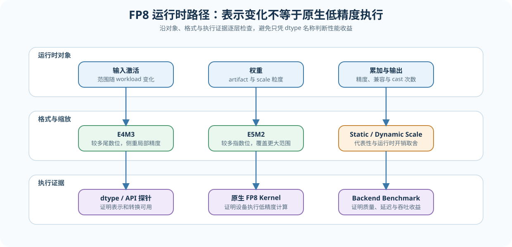

# 41. FP8 and KV Cache Quantization | FP8 运行时低精度路径
**难度：** Hard | **环境：** CPU-first，GPU 可选 | **标签：** `量化压缩`, `FP8`, `runtime` | **目标人群：** 希望理解 FP8 执行条件与证据层级的学习者

> 🚀 **云端运行环境**
>
> 本章节的实战代码可以点击以下链接在免费 GPU 算力平台上直接运行：
>
> [](https://colab.research.google.com/github/datawhalechina/llm-algo-leetcode/blob/main/02_PyTorch_Algorithms/41_FP8_and_KV_Cache_Quantization.ipynb)
> [](https://modelscope.cn/my/mynotebook) *(国内推荐：魔搭社区免费实例)*


---

## 本节导读

权重量化改变模型参数的保存与读取方式，FP8 运行时路径进一步改变矩阵乘输入、权重、累加与输出之间的数据类型组合。是否真正得到收益，不只取决于“使用了 8 bit”，还取决于格式、缩放策略、累加精度以及当前硬件和 backend 是否进入原生 FP8 kernel。

本节从运行时张量出发，依次分析 E4M3 / E5M2 的范围取舍、static / dynamic scaling 和执行路径判定。KV Cache 具有持续追加、反复读取和 K/V 异轴量化等独立状态问题，集中在第 54 节讨论。

**关键词：** `FP8`, `E4M3`, `E5M2`, `scaling`, `runtime kernel`

---

## 前置阅读

**导语：** 先建立校准范围与误差口径，再比较运行时 FP8 与整数权重量化在对象、执行位置和证据要求上的差异。

- [52. Quantization Calibration and Error | 量化校准与误差控制](./52_Quantization_Calibration_and_Error.md)
- [25. W8A16 Quantization | W8A16 量化](./25_Quantization_W8A16.md)
- [可选：53. Activation Quantization and SmoothQuant | 激活量化与 SmoothQuant](./53_Activation_Quantization_and_SmoothQuant.md)

---

### Step 1：FP8 运行时路径改变哪些对象

一次低精度矩阵乘至少涉及输入激活、权重、累加和输出四个位置。仅把权重保存为 FP8，并不等于激活也以 FP8 进入计算，更不等于硬件执行了原生 FP8 kernel。判断运行时路径时，需要把“表示格式”和“实际执行”分开记录。

| 对象 | 可选表示 | 主要风险 | 需要记录的证据 |
|---|---|---|---|
| 输入激活 | FP16 / BF16 / FP8 | 动态范围随 workload 变化 | 输入 dtype、scale 来源 |
| 权重 | FP16 / BF16 / FP8 | 离线 scale 与模型质量 | artifact dtype、scale 粒度 |
| 累加 | FP16 / BF16 / FP32 | 累积误差或溢出 | accumulation dtype |
| 输出 | FP16 / BF16 / FP8 | 下游算子兼容与再次量化 | output dtype、cast 次数 |
| 执行路径 | 原生 kernel / cast-only / fallback | 位宽变化但没有性能收益 | kernel、backend、硬件能力 |



### Step 2：格式与缩放如何共同决定可表示范围

E4M3 用更多尾数位换取局部精度，E5M2 用更多指数位覆盖更大的动态范围。格式只规定可表示范围，scale 决定当前张量如何映射到该范围：static scaling 复用校准统计，dynamic scaling 使用当前张量范围，delayed scaling 则用历史 `amax` 更新下一次执行的 scale。

| 维度 | 选择 | 收益 | 风险与证据 |
|---|---|---|---|
| FP8 格式 | E4M3 / E5M2 | 精度或动态范围 | 溢出率、恢复误差、累加 dtype |
| static scale | 固定校准统计 | 执行开销稳定 | workload 漂移后可能饱和 |
| dynamic scale | 当前张量 `amax` | 适应当前分布 | 统计与融合开销 |
| delayed scale | 历史 `amax` 窗口 | 减少同步并平滑波动 | 陈旧 scale、窗口与更新频率 |

真正的 FP8 路径还要明确累加精度。输入和权重采用 FP8，并不意味着累加器或输出也必须采用 FP8；常见实现会使用更高精度累加来控制误差。
### Step 3：从 dtype 声明到原生 kernel 需要经过哪些检查

框架能够创建 FP8 dtype，只能证明表示和 API 可用。运行时应按“设备能力 → backend 与算子支持 → shape/布局条件 → kernel 命中 → 指标复测”的顺序检查；任一条件不满足，都应记录实际回退路径，而不是继续把候选标为 FP8 kernel。

| 实际路径 | 已证明什么 | 尚未证明什么 | 后续动作 |
|---|---|---|---|
| CPU 教学模拟 | scale 与格式误差可计算 | GPU API 与 kernel | 进入环境预检 |
| dtype 环境预检 | FP8 dtype 可创建、可转换 | 原生低精度矩阵乘 | 检查设备和 backend |
| cast + 高精度计算 | 输入可转换但计算发生回退 | FP8 性能收益 | 记录 fallback，不做性能结论 |
| native FP8 kernel | 当前算子与 shape 可执行 | 端到端模型收益 | 固定 workload 比较质量、延迟与显存 |
### Step 4：实现并验证 FP8 缩放与运行时路径判断

题目区使用教学化 FP8 网格验证三个机制：先从张量范围生成 dynamic scale，再按格式的尾数位近似舍入，最后根据设备与 backend 条件判断证据路径。测试不要求本机具备 FP8 GPU，因此能够稳定验证格式、误差和路径选择。

| TODO | 实现对象 | 机制责任 | 关键测试 |
|:---|:---|:---|:---|
| TODO 1 | `compute_dynamic_scale` | 把当前张量范围映射到格式可表示范围 | 全零输入、有限正 scale |
| TODO 2 | `simulate_roundtrip` | 按尾数位近似 FP8 网格并恢复浮点值 | shape、有限值、格式误差差异 |
| TODO 3 | `select_runtime_path` | 区分原生 kernel、dtype 环境预检和模拟 fallback | 三类条件组合 |


```python
import torch
import torch.nn as nn

```


```python
# 题目区只挖空 FP8 缩放、格式舍入和运行时路径选择三个机制。

class FP8RuntimeSim(nn.Module):
    """教学化模拟 FP8 缩放，并区分表示可用与原生 kernel 可用。

    `format_name` 支持 `e4m3` 与 `e5m2`。本类不冒充真实 FP8 kernel；
    它用于观察 scale、尾数精度和运行时 gate 如何共同影响证据等级。
    """

    FORMAT_SPECS = {
        "e4m3": {"max_value": 448.0, "mantissa_bits": 3},
        "e5m2": {"max_value": 57344.0, "mantissa_bits": 2},
    }

    def __init__(self, format_name: str = "e4m3", eps: float = 1e-8):
        super().__init__()
        if format_name not in self.FORMAT_SPECS:
            raise ValueError(f"unsupported FP8 format: {format_name}")
        self.format_name = format_name
        self.eps = eps

    def compute_dynamic_scale(self, x: torch.Tensor) -> torch.Tensor:
        """让当前绝对最大值映射到所选格式的最大有限值。"""
        fp8_max = self.FORMAT_SPECS[self.format_name]["max_value"]
        # TODO 1（动态缩放）：计算安全的 absmax，并得到有限正 scale。
        # absmax = ???
        # scale = ???
        return scale

    def simulate_roundtrip(self, x: torch.Tensor):
        """在缩放后空间按尾数位构造教学化 FP8 舍入网格。"""
        x = x.detach().float()
        spec = self.FORMAT_SPECS[self.format_name]
        scale = self.compute_dynamic_scale(x)
        scaled = torch.clamp(x * scale, -spec["max_value"], spec["max_value"])
        magnitude = scaled.abs().clamp_min(self.eps)
        exponent = torch.floor(torch.log2(magnitude))
        # TODO 2（格式舍入）：由 exponent 和 mantissa_bits 得到局部步长，再恢复浮点近似值。
        # step = ???
        # rounded_scaled = ???
        # restored = ???
        return restored, scale

    @staticmethod
    def select_runtime_path(device_type: str, dtype_available: bool, native_kernel: bool) -> str:
        """根据环境能力返回 native_kernel、dtype_preflight 或 cpu_simulation。"""
        # TODO 3（运行时 gate）：只有 CUDA 且 backend 命中原生 kernel 才能形成 kernel 证据。
        # path = ???
        return path

    def summarize(self, x: torch.Tensor, *, device_type: str = "cpu", dtype_available: bool = False,
                  native_kernel: bool = False):
        restored, scale = self.simulate_roundtrip(x)
        return {
            "format": self.format_name,
            "scale": float(scale),
            "mse": float(torch.mean((x.float() - restored) ** 2)),
            "runtime_path": self.select_runtime_path(device_type, dtype_available, native_kernel),
        }

```


```python
# 机制测试：分别检查 scale、格式舍入、误差和运行时 gate。
def test_dynamic_scale_contract():
    """动态 scale 对普通输入和全零输入都保持有限正值。"""
    sim = FP8RuntimeSim("e4m3")
    assert float(sim.compute_dynamic_scale(torch.tensor([-2.0, 0.0, 1.0]))) > 0
    assert torch.isfinite(sim.compute_dynamic_scale(torch.zeros(4)))


def test_roundtrip_contract():
    """教学化舍入保持 shape，且恢复值有限。"""
    x = torch.tensor([[-2.0, -0.25, 0.0, 0.75, 3.0]])
    restored, scale = FP8RuntimeSim("e4m3").simulate_roundtrip(x)
    assert restored.shape == x.shape
    assert torch.isfinite(restored).all() and torch.isfinite(scale)


def test_format_precision_tradeoff():
    """相同输入下，两种格式产生可比较但不强制相同的误差。"""
    x = torch.linspace(-3.0, 3.0, 33)
    e4m3 = FP8RuntimeSim("e4m3").summarize(x)
    e5m2 = FP8RuntimeSim("e5m2").summarize(x)
    assert e4m3["mse"] >= 0 and e5m2["mse"] >= 0
    assert e4m3["format"] != e5m2["format"]


def test_runtime_path_contract():
    """表示可用、原生 kernel 与 CPU 模拟对应不同证据等级。"""
    select = FP8RuntimeSim.select_runtime_path
    assert select("cuda", True, True) == "native_fp8_kernel"
    assert select("cuda", True, False) == "dtype_preflight"
    assert select("cpu", False, False) == "cpu_simulation"


def run_fp8_runtime_tests():
    """汇总四组 FP8 运行时机制测试。"""
    for test in (test_dynamic_scale_contract, test_roundtrip_contract,
                 test_format_precision_tradeoff, test_runtime_path_contract):
        test()
    print("✅ FP8 运行时机制测试通过：scale、格式舍入、误差和路径 gate 均已验证。")


run_fp8_runtime_tests()

```

## 参考代码与解析

### 代码


```python
# 题目区只挖空 FP8 缩放、格式舍入和运行时路径选择三个机制。

class FP8RuntimeSim(nn.Module):
    """教学化模拟 FP8 缩放，并区分表示可用与原生 kernel 可用。

    `format_name` 支持 `e4m3` 与 `e5m2`。本类不冒充真实 FP8 kernel；
    它用于观察 scale、尾数精度和运行时 gate 如何共同影响证据等级。
    """

    FORMAT_SPECS = {
        "e4m3": {"max_value": 448.0, "mantissa_bits": 3},
        "e5m2": {"max_value": 57344.0, "mantissa_bits": 2},
    }

    def __init__(self, format_name: str = "e4m3", eps: float = 1e-8):
        super().__init__()
        if format_name not in self.FORMAT_SPECS:
            raise ValueError(f"unsupported FP8 format: {format_name}")
        self.format_name = format_name
        self.eps = eps

    def compute_dynamic_scale(self, x: torch.Tensor) -> torch.Tensor:
        """让当前绝对最大值映射到所选格式的最大有限值。"""
        fp8_max = self.FORMAT_SPECS[self.format_name]["max_value"]
        # TODO 1（动态缩放）：计算安全的 absmax，并得到有限正 scale。
        absmax = x.detach().float().abs().max().clamp_min(self.eps)
        scale = fp8_max / absmax
        return scale

    def simulate_roundtrip(self, x: torch.Tensor):
        """在缩放后空间按尾数位构造教学化 FP8 舍入网格。"""
        x = x.detach().float()
        spec = self.FORMAT_SPECS[self.format_name]
        scale = self.compute_dynamic_scale(x)
        scaled = torch.clamp(x * scale, -spec["max_value"], spec["max_value"])
        magnitude = scaled.abs().clamp_min(self.eps)
        exponent = torch.floor(torch.log2(magnitude))
        # TODO 2（格式舍入）：由 exponent 和 mantissa_bits 得到局部步长，再恢复浮点近似值。
        step = torch.pow(2.0, exponent - spec["mantissa_bits"])
        rounded_scaled = torch.round(scaled / step) * step
        restored = rounded_scaled / scale
        return restored, scale

    @staticmethod
    def select_runtime_path(device_type: str, dtype_available: bool, native_kernel: bool) -> str:
        """根据环境能力返回 native_kernel、dtype_preflight 或 cpu_simulation。"""
        # TODO 3（运行时 gate）：只有 CUDA 且 backend 命中原生 kernel 才能形成 kernel 证据。
        if device_type == "cuda" and native_kernel:
            path = "native_fp8_kernel"
        elif dtype_available:
            path = "dtype_preflight"
        else:
            path = "cpu_simulation"
        return path

    def summarize(self, x: torch.Tensor, *, device_type: str = "cpu", dtype_available: bool = False,
                  native_kernel: bool = False):
        restored, scale = self.simulate_roundtrip(x)
        return {
            "format": self.format_name,
            "scale": float(scale),
            "mse": float(torch.mean((x.float() - restored) ** 2)),
            "runtime_path": self.select_runtime_path(device_type, dtype_available, native_kernel),
        }

```

### 解析

**TODO 1：动态缩放。** 当前张量的绝对最大值决定 scale；全零输入通过 `eps` 保持有限正值。scale 只建立表示映射，不能证明硬件执行路径。

**TODO 2：格式舍入。** exponent 决定当前数值所在区间，mantissa bits 决定该区间的局部步长。E4M3 与 E5M2 的误差差异来自动态范围和尾数精度的取舍。

**TODO 3：运行时 gate。** `native_fp8_kernel` 才能作为 kernel 证据；`dtype_preflight` 只证明框架表示或转换可用，`cpu_simulation` 只验证机制。

### Step 5：可选 GPU 实验——用 torchao 比较 BF16 与 FP8

#### 5.1 环境、模型与固定 workload

实验在同一模型、prompt、输入长度和前向次数下比较 BF16 baseline 与 torchao FP8 candidate。默认只生成预检记录；开启后分别加载两条路径，避免把 dtype 转换成功误写成 FP8 执行收益。


```python
# 5.1 只定义模型、FP8 配置与测量次数；默认不下载模型、不占用 GPU。
from pathlib import Path

RUN_MODE = "dry_run"  # dry_run / real_gpu
MODEL_ID = "Qwen/Qwen2.5-0.5B-Instruct"
PROMPT = "Explain why FP8 scaling affects numerical range."
FP8_MODE = "dynamic_w8a8"  # dynamic_w8a8 / weight_only
WARMUP_STEPS = 2
REPEAT_STEPS = 5
SEED = 42
OUTPUT_PATH = Path("benchmarks/results/41_fp8_torchao_microbenchmark.json")

```


```python
# 5.2 使用成熟库执行 BF16/FP8 配对微基准，并保存可复测 JSON。
import importlib.metadata
import json
import statistics
import time


def package_version(name: str):
    """返回已安装包版本；缺失时返回 None，供失败记录使用。"""
    try:
        return importlib.metadata.version(name)
    except importlib.metadata.PackageNotFoundError:
        return None


def state_dict_bytes(model) -> int:
    """按 state_dict 张量统计候选表示字节，作为同模型的容量近似。"""
    return sum(value.numel() * value.element_size() for value in model.state_dict().values())


def benchmark_forward(model, inputs):
    """在固定输入上执行同步前向，分开记录延迟和峰值显存。"""
    with torch.inference_mode():
        for _ in range(WARMUP_STEPS):
            model(**inputs, use_cache=False, return_dict=True)
    torch.cuda.synchronize()
    torch.cuda.reset_peak_memory_stats()
    latencies_ms = []
    logits = None
    with torch.inference_mode():
        for _ in range(REPEAT_STEPS):
            started = time.perf_counter()
            logits = model(**inputs, use_cache=False, return_dict=True).logits
            torch.cuda.synchronize()
            latencies_ms.append((time.perf_counter() - started) * 1000)
    return {
        "latency_median_ms": statistics.median(latencies_ms),
        "latency_min_ms": min(latencies_ms),
        "peak_memory_bytes": torch.cuda.max_memory_allocated(),
        "state_dict_bytes": state_dict_bytes(model),
    }, logits.detach().float().cpu()


result = {
    "schema_version": "quantization-mechanism-gpu/v2",
    "chapter": "41",
    "run_mode": RUN_MODE,
    "framework": {
        "torch": torch.__version__,
        "transformers": package_version("transformers"),
        "torchao": package_version("torchao"),
    },
    "hardware": {
        "cuda_available": torch.cuda.is_available(),
        "cuda": torch.version.cuda,
        "device": torch.cuda.get_device_name(0) if torch.cuda.is_available() else None,
        "compute_capability": list(torch.cuda.get_device_capability(0)) if torch.cuda.is_available() else None,
    },
    "workload": {
        "model_id": MODEL_ID,
        "prompt": PROMPT,
        "warmup_steps": WARMUP_STEPS,
        "repeat_steps": REPEAT_STEPS,
        "seed": SEED,
    },
    "baseline": {"name": "bf16"},
    "candidate": {"name": FP8_MODE},
    "failure": None,
    "evidence_level": "environment_preflight",
    "decision": "ready_to_measure",
}

if RUN_MODE == "real_gpu":
    try:
        if not torch.cuda.is_available():
            raise RuntimeError("CUDA is unavailable")
        if result["framework"]["transformers"] is None or result["framework"]["torchao"] is None:
            raise RuntimeError("real_gpu requires transformers and torchao")

        from transformers import AutoModelForCausalLM, AutoTokenizer
        from torchao import quantize_
        from torchao.quantization import (
            Float8DynamicActivationFloat8WeightConfig,
            Float8WeightOnlyConfig,
        )

        torch.manual_seed(SEED)
        tokenizer = AutoTokenizer.from_pretrained(MODEL_ID, use_fast=True)
        inputs = tokenizer(PROMPT, return_tensors="pt").to("cuda")

        baseline_model = AutoModelForCausalLM.from_pretrained(
            MODEL_ID, dtype=torch.bfloat16
        ).to("cuda").eval()
        baseline_metrics, baseline_logits = benchmark_forward(baseline_model, inputs)
        del baseline_model
        torch.cuda.empty_cache()

        candidate_model = AutoModelForCausalLM.from_pretrained(
            MODEL_ID, dtype=torch.bfloat16
        ).to("cuda").eval()
        fp8_config = (
            Float8DynamicActivationFloat8WeightConfig()
            if FP8_MODE == "dynamic_w8a8"
            else Float8WeightOnlyConfig()
        )
        quantize_(candidate_model, fp8_config)
        candidate_metrics, candidate_logits = benchmark_forward(candidate_model, inputs)

        logit_mse = torch.mean((baseline_logits - candidate_logits) ** 2).item()
        result.update({
            "baseline": {"name": "bf16", "metrics": baseline_metrics},
            "candidate": {
                "name": FP8_MODE,
                "config_class": type(fp8_config).__name__,
                "metrics": candidate_metrics,
            },
            "mechanism_metrics": {"logit_mse": logit_mse},
            "evidence_level": "matched_torchao_fp8_microbenchmark",
            "decision": "continue" if torch.isfinite(torch.tensor(logit_mse)) else "reject",
        })
        del candidate_model, baseline_logits, candidate_logits
        torch.cuda.empty_cache()
    except Exception as exc:
        result.update({
            "failure": {"type": type(exc).__name__, "message": str(exc)},
            "evidence_level": "failed_library_microbenchmark",
            "decision": "tune",
        })

OUTPUT_PATH.parent.mkdir(parents=True, exist_ok=True)
OUTPUT_PATH.write_text(json.dumps(result, ensure_ascii=False, indent=2), encoding="utf-8")
print(json.dumps(result, ensure_ascii=False, indent=2))

```

#### 5.3 读取配对实验结果

结果读取单元核对 torchao 配置是否实际应用，并并列展示 BF16/FP8 的状态字节、同步延迟、峰值显存和 logits 误差；不重新加载模型。

```python
# 5.3 只读取 5.2 保存的 JSON，不重新执行模型加载或量化。
import json

if OUTPUT_PATH.exists():
    saved_result = json.loads(OUTPUT_PATH.read_text(encoding="utf-8"))
    print({key: saved_result.get(key) for key in (
        "framework", "hardware", "workload", "baseline", "candidate",
        "mechanism_metrics", "failure", "evidence_level", "decision",
    )})
else:
    print(f"等待 torchao FP8 配对结果：{OUTPUT_PATH}")

```

#### 5.4 机制结果与下一步

本节的 `continue` 表示成熟库 FP8 路径可执行且结果有限；它不等于已经满足完整模型的 Serving SLO。

| baseline / candidate | 机制指标 | 运行指标 | failure | evidence level | decision |
|---|---|---|---|---|---|
| BF16 / torchao FP8 | config class、state bytes、logit MSE | median/min latency、peak memory | 依赖、硬件或 kernel 错误 | environment preflight / matched torchao microbenchmark | continue / tune / reject |
## 相关阅读

- [FP8 Formats for Deep Learning](https://arxiv.org/abs/2209.05433)
- [torchao Quantized Inference](https://docs.pytorch.org/ao/stable/workflows/inference.html)
- [Transformers torchao integration](https://huggingface.co/docs/transformers/main/quantization/torchao)
- [NVIDIA Transformer Engine](https://docs.nvidia.com/deeplearning/transformer-engine/index.html)
- [54. KV Cache Quantization Strategies | KV Cache 量化策略](./54_KV_Cache_Quantization_Strategies.md)
