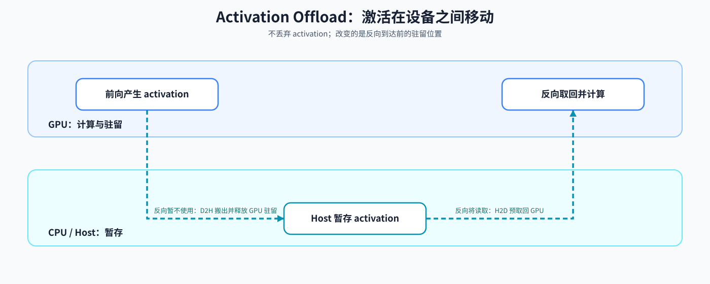
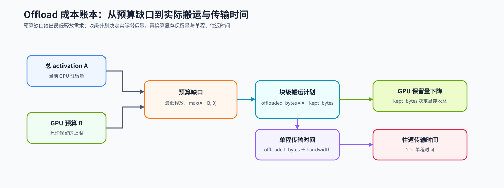
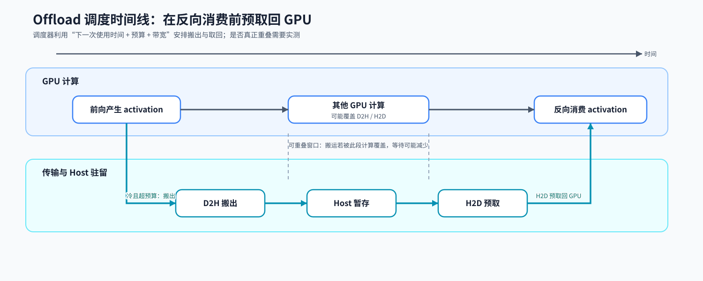

# 42. Activation Offload | 激活卸载

**难度：** Hard | **环境：** CPU-first

> 🚀 **云端运行环境**
>
> 本章节的实战代码可以点击以下链接在免费 GPU 算力平台上直接运行：
>
> [](https://colab.research.google.com/github/datawhalechina/llm-algo-leetcode/blob/main/02_PyTorch_Algorithms/42_Activation_Offload.ipynb)
> [](https://modelscope.cn/my/mynotebook) *(国内推荐：魔搭社区免费实例)*

**标签：** `显存优化`, `激活值`, `Offload` | **目标人群：** 显存优化学习者

---

## 本节导读

训练前向会在 GPU 上产生供反向使用的 activation。当这些中间状态接近显存预算时，activation offload 可以把暂时不用的状态移到 CPU 或 host memory，并在反向需要时取回；GPU 显存压力因而下降，但数据搬运进入训练关键路径。

本节从 activation 的设备间生命周期出发，先判断哪些状态值得搬出，再将搬运量换算为传输时间，最后完成一个预算与策略判断的 CPU 实现。可选 GPU 复测会在固定 workload 下记录显存、搬运量、时间与梯度一致性；跨对象的统一训练内存账本留到 43 节。

**关键词：** `offload`, `transfer`, `bandwidth`

---

## 前置阅读

**导语：** 阅读本节前，先确认你能说清 activation 为什么会在反向阶段被使用，以及 checkpoint 如何以重算减少 activation 驻留；本节将在同一训练链路中把代价从额外计算改为设备间搬运。

- [18. Activation and Loss Backward | 激活与损失反向](./18_Activation_and_Loss_Backward.md)：理解 activation 如何参与反向传播。
- [19. Activation Checkpointing | 激活检查点](./19_Activation_Checkpointing.md)：对照另一条“以重算换驻留”的激活策略。
- [Part 01 · 03. GPU 物理架构与内存层级](../01_Hardware_Math_and_Systems/03_GPU_Architecture_and_Memory.md)：回顾 GPU 与 host 之间的数据路径和带宽层级。

---
### Step 1: Activation Offload 如何改变激活的生命周期

Activation offload 处理的是“反向仍需要、当前暂不使用”的 activation：前向后将它从 GPU 移到 CPU 或 host memory，反向到达对应位置时再取回 GPU。activation 在整个训练过程中仍可供反向读取，变化的是它从 GPU 到 host、再回到 GPU 的驻留位置。

以一个连续模型 Block 串为例，前向产生的 activation 先位于 GPU。这里的“冷”指反向再次读取它之前，还会经过较长一段计算；被选中的冷 activation 因而可以在等待期间暂存于 host。下表对照两条降低 GPU 驻留的路径，主图呈现 offload 的设备间移动。

| 生命周期阶段 | Checkpointing：以重算换驻留 | Offload：以搬运换驻留 | 主要代价 |
| --- | --- | --- | --- |
| 前向产生后 | 保存 segment 边界 | 将冷 activation 从 GPU 搬到 host | GPU 驻留下降；D2H 搬运 |
| 等待反向时 | 区段内部 activation 不驻留 | activation 暂存在 host | 重算范围；host 内存占用 |
| 反向需要时 | 重算对应 segment | 将 activation 预取回 GPU | 重算计算量；H2D 与等待 |



### Step 2: 搬运量如何转化为时间代价

Step 2 将一份已给出的 offload 计划翻译为容量账本与传输账本：先用总 activation `A` 和 GPU 预算 `B` 算出最低需要释放的空间，再由块级计划得到实际保留量 `kept_bytes` 与实际搬运量 `offloaded_bytes`。由于 activation 按块搬运，实际搬运量可以大于预算缺口。

实际搬运量是传输时间的分子：除以带宽得到单程时间，搬出与搬回构成往返时间。容量账本说明 GPU 能释放多少空间，传输账本说明可能增加多少等待；若搬运与其他计算重叠，部分传输时间可以被覆盖。

| 账本量 | 计算关系 | 它说明什么 | 后续用途 |
| --- | --- | --- | --- |
| 预算缺口 | `max(A - B, 0)` | 至少需要释放多少 GPU 空间 | 判断是否需要调整 activation 驻留 |
| 实际搬运量 | `offloaded_bytes = A - kept_bytes` | 当前块级计划实际移走多少 activation | 作为传输时间的分子 |
| 单程时间 | `offloaded_bytes / bw` | 搬出或搬回一次的理论代价 | 判断预取可利用的计算窗口 |
| 往返时间 | `2 × 单程时间` | 一次完整 offload 生命周期的传输代价 | 与显存收益共同参与策略判断 |



### Step 3: 如何选择驻留对象并做预算决策

真实训练中的 offload 调度器会结合状态何时再被反向读取、链路带宽和可用 host 内存，决定何时搬出、何时预取回 GPU，并尽量让搬运与计算重叠。本节先从可搬运且距下一次使用较远的 activation 中选择候选，再检查搬出后是否回到 GPU 预算内；`reuse_delay_layers` 只是近似冷热程度的教学字段。

预算可行不等于值得采用：还要将节省比例与理论传输时间一起判断。下面的表格把候选选择、容量核对、搬运估算和策略输出组织为同一条决策链。

| 决策环节 | 需要回答的问题 | 本题中的观察量 | 读数如何解释 |
| --- | --- | --- | --- |
| 选择对象 | 哪些激活距离下一次使用较远，且允许搬运？ | 激活冷热程度、是否允许搬运 | 越冷越适合优先评估，但不等于真实调度顺序 |
| 计算容量 | 搬出后 GPU 是否回到预算内？ | 保留量、超预算量 | 仍然超预算表示当前计划不可行 |
| 计算搬运 | 为释放空间需要搬多少数据、多久？ | 搬运量、单程与往返理论时间 | 不包含重叠、同步与真实链路波动 |
| 输出策略 | 节省比例和传输代价是否达到教学阈值？ | 可行性、节省比例、策略判断 | 输出当前预算模型下的 `accept / tune / reject` |



### Step 4：实现 Offload 预算计划并验证

题目区将前面的决策链落实为四步：先根据预算筛选可搬运 activation，再计算单程与往返的理论传输时间，然后给出 offload 策略，最后与 checkpoint 的教学成本模型做同条件比较。`reuse_delay_layers` 越大表示越适合优先评估搬出，`bandwidth_gbps` 按 GiB/s 的理论有效带宽解释。

本节 CPU 代码只验证容量、带宽和阈值决策的机制关系。例如总 activation 为 736 MiB、GPU 预算为 384 MiB 时，计划需要搬出 352 MiB；真实设备间 copy、同步和重叠将在 Step 5 的 GPU workload 中观察。

| 实现对象 | 输入与职责 | 输出 | 验证重点 |
|---|---|---|---|
| `ActivationChunkSpec` | 激活块大小、复用距离、是否可搬运 | 激活块描述 | 元数据合法且名称唯一 |
| `summarize_activation_offload` | 按预算选择搬出对象并汇总容量 | 保留量、搬运量、压力与节省比例 | 预算可行性、候选顺序与尾部压力 |
| `estimate_round_trip_transfer_ms` | 用搬运量和带宽估算往返时间 | 理论时间（ms） | 单位换算、零值与非法带宽 |
| `recommend_offload_policy` | 根据预算、收益与代价阈值判断 | `accept / tune / reject` | 先判断可行性，再判断收益 |
| `compare_offload_vs_checkpointing` | 在同一教学成本口径下比较两条路线 | 两个 score 与 `preferred` | 零时间与比较方向 |

```python
from dataclasses import dataclass
```


```python
# 任务目标：在 CPU 账本中完成 activation offload 的容量—传输—决策链；不执行真实设备间 copy。
# 骨架已给出候选排序；请按“容量汇总 → 往返传输 → 策略判断 → checkpoint 对照”完成 TODO 1–4。

@dataclass
class ActivationChunkSpec:
    """描述一个用于预算模拟的激活块。

    这里只记录选择依据和理论大小，不代表真实 CUDA tensor，也不包含 pinned memory、
    异步拷贝或实际生命周期。"""
    name: str  # 激活块名称，便于解释最终搬出/保留了谁
    bytes_: int  # 激活块大小，单位 byte
    reuse_delay_layers: int  # 距离下一次使用的预计层数，越大越冷
    offloadable: bool = True  # 是否允许本策略搬出

@dataclass
class ActivationOffloadSummary:
    """记录一次 offload 预算计划的容量、传输和可行性结果。

    `transfer_ms` 是单程理论时间；真实训练还要测量搬回、同步和重叠。
    `feasible` 只表示当前不可搬运状态没有超过 GPU 激活预算。"""
    total_bytes: int
    gpu_budget_bytes: int
    kept_bytes: int
    offloaded_bytes: int
    transfer_ms: float
    pressure_ratio: float
    saved_ratio: float
    offloaded_names: list
    kept_names: list
    feasible: bool
    overflow_bytes: int


def summarize_activation_offload(chunks, gpu_budget_bytes, bandwidth_gbps=12.0):
    """汇总一次 activation offload 预算计划，不执行真实 tensor 搬运。

    Args:
        chunks: ActivationChunkSpec 或等价 dict 的序列。
        gpu_budget_bytes: 允许保留在 GPU 的 activation 预算，单位 byte。
        bandwidth_gbps: 理论有效带宽，代码按 GiB/s 解释。

    Returns:
        ActivationOffloadSummary；feasible 表示不可搬运对象也没有超预算。
    """
    if gpu_budget_bytes <= 0:
        raise ValueError("gpu_budget_bytes must be positive")
    if bandwidth_gbps <= 0:
        raise ValueError("bandwidth_gbps must be positive")

    normalized = []
    for c in chunks:
        if isinstance(c, ActivationChunkSpec):
            normalized.append(c)
        elif isinstance(c, dict):
            normalized.append(ActivationChunkSpec(**c))
        else:
            raise TypeError("chunks must contain ActivationChunkSpec or dict")

    names = [c.name for c in normalized]
    if len(names) != len(set(names)):
        raise ValueError("chunk names must be unique")
    if any(c.bytes_ < 0 for c in normalized):
        raise ValueError("chunk bytes must be non-negative")
    if any(c.reuse_delay_layers < 0 for c in normalized):
        raise ValueError("reuse_delay_layers must be non-negative")

    total_bytes = sum(c.bytes_ for c in normalized)
    kept_bytes = total_bytes
    offloaded_names = []

    candidates = sorted(
        [c for c in normalized if c.offloadable],
        key=lambda c: (-c.reuse_delay_layers, -c.bytes_, c.name),
    )

    for chunk in candidates:
        if kept_bytes <= gpu_budget_bytes:
            break
        kept_bytes -= chunk.bytes_
        offloaded_names.append(chunk.name)

    kept_names = [c.name for c in normalized if c.name not in offloaded_names]

    # ==========================================
    # TODO 1: 汇总 offload 结果和显存/带宽指标
    # 作用：把上面的对象选择转换成可比较的容量和时间指标。
    # 输入：total_bytes、kept_bytes、gpu_budget_bytes、bandwidth_gbps。
    # 顺序：先算 offloaded_bytes，再按 GiB/s 估算单程 transfer_ms，最后计算 pressure_ratio / saved_ratio。
    # 要求：overflow_bytes > 0 时 feasible 为 False；total_bytes 为 0 时比例取 0。
    # offloaded_bytes = ???  # 本次从 GPU 移走的 activation 字节数
    # transfer_ms = ???      # 单程理论传输时间，单位 ms
    # pressure_ratio = ???  # 原始 activation 总量 / GPU 预算
    # saved_ratio = ???     # 已搬出 activation / 原始 activation 总量
    # ==========================================
    overflow_bytes = max(kept_bytes - gpu_budget_bytes, 0)
    feasible = overflow_bytes == 0
    raise NotImplementedError("TODO 1：请汇总 offload 容量与单程传输指标")

    return ActivationOffloadSummary(
        total_bytes=total_bytes,
        gpu_budget_bytes=gpu_budget_bytes,
        kept_bytes=kept_bytes,
        offloaded_bytes=offloaded_bytes,
        transfer_ms=round(transfer_ms, 2),
        pressure_ratio=round(pressure_ratio, 3),
        saved_ratio=round(saved_ratio, 3),
        offloaded_names=offloaded_names,
        kept_names=kept_names,
        feasible=feasible,
        overflow_bytes=overflow_bytes,
    )


def estimate_round_trip_transfer_ms(offloaded_bytes: int, bandwidth_gbps: float):
    """估算 activation 搬出 GPU 再搬回的理论时间，不执行真实 copy。

    Args:
        offloaded_bytes: 单次搬运的数据量，单位 byte。
        bandwidth_gbps: 假设有效带宽，代码按 GiB/s 解释。

    Returns:
        搬出加搬回的理论时间，单位 ms；不包含同步和重叠效果。"""
    if offloaded_bytes < 0:
        raise ValueError("offloaded_bytes must be non-negative")
    if bandwidth_gbps <= 0:
        raise ValueError("bandwidth_gbps must be positive")

    # ==========================================
    # TODO 2: 计算往返搬运时间
    # 作用：把一次搬出和一次搬回的理论代价合并为毫秒。
    # 输入：offloaded_bytes（单程数据量，byte）和 bandwidth_gbps（按 GiB/s 解释）。
    # 计算：单程为 bytes / (bandwidth_gbps * 2**30)，往返乘以 2；输入为 0 时返回 0.0。
    # one_way_ms = ???  # 单程理论时间，单位 ms
    # return_ms = ???   # 搬出加搬回的理论时间，单位 ms
    # ==========================================
    return round(return_ms, 2)


def recommend_offload_policy(summary: ActivationOffloadSummary, min_saved_ratio=0.25, max_transfer_ms=60.0):
    """根据教学阈值返回策略建议。

    Args:
        summary: summarize_activation_offload 返回的预算摘要。
        min_saved_ratio: 教学用最低显存节省比例。
        max_transfer_ms: 教学用单程理论传输时间上限。

    Returns:
        'accept'、'tune' 或 'reject'；不代表真实工程决策。
    """
    if summary.offloaded_bytes <= 0:
        return "reject"
    if min_saved_ratio < 0 or max_transfer_ms < 0:
        raise ValueError("policy thresholds must be non-negative")

    if not summary.feasible:
        return "reject"
    # ==========================================
    # TODO 3: 补全策略判断逻辑
    # 作用：根据预算可行性、显存节省比例和理论传输时间输出策略建议。
    # 顺序：先 reject 不可行或无收益方案；再判断严格阈值 accept；最后判断放宽阈值 tune，其余 reject。
    # 输出：只能是 accept、tune 或 reject；这是教学决策，不是真实 GPU 结论。
    # ==========================================
    # meets_strict = ???  # 同时满足节省比例与单程传输时间的严格阈值
    # meets_relaxed = ??? # 同时满足放宽后节省比例与传输时间阈值
    # if meets_strict:
    #     return "accept"
    # if meets_relaxed:
    #     return "tune"

    return "reject"


def compare_offload_vs_checkpointing(offload_summary: ActivationOffloadSummary, checkpoint_saved_bytes, checkpoint_extra_ms):
    """用理论节省字节数除以理论额外代价做教学比较。

    Args:
        offload_summary: offload 预算摘要。
        checkpoint_saved_bytes: checkpoint 理论节省字节数。
        checkpoint_extra_ms: checkpoint 理论额外时间，单位 ms。

    Returns:
        包含两种 score 和 preferred 的字典；不替代真实 benchmark。
    """
    if checkpoint_saved_bytes < 0 or checkpoint_extra_ms < 0:
        raise ValueError("checkpoint values must be non-negative")
    # ==========================================
    # TODO 4: 完成 offload 与 checkpointing 的性价比比较
    # 作用：用一个教学 score 比较两条“用代价换显存”的路线。
    # 输入：两条路线各自的理论节省字节数和额外时间；单位分别为 byte、ms。
    # 计算：score = 理论节省字节数 / 理论额外时间；用 max(..., 1e-6) 处理零时间，返回分数更大的路线。
    # 注意：该 score 只用于当前模拟配置的排序，不等于真实吞吐或端到端收益。
    # ==========================================
    # offload_score = ???
    # checkpoint_score = ???
    # preferred = ???
    return {
        "offload_score": round(offload_score, 3),
        "checkpoint_score": round(checkpoint_score, 3),
        "preferred": preferred,
    }

```

### 测试

运行下方 CPU 机制测试，检查 offload 候选选择、预算与传输账本、策略判断和 checkpoint 对照是否一致。Step 5 再记录真实 GPU 的设备间搬运与显存—时间证据。

```python
# 测试设计：以同一组 activation 元数据验证四段机制链。
# TODO 1 容量账本 → TODO 2 往返时间 → TODO 3 策略分支 → TODO 4 checkpoint 对照。


def build_activation_fixture():
    """返回所有机制测试共用的 activation 元数据。"""
    return [
        ActivationChunkSpec("embed", 256 * 1024 * 1024, 0),
        ActivationChunkSpec("mid_a", 192 * 1024 * 1024, 2),
        ActivationChunkSpec("mid_b", 160 * 1024 * 1024, 3),
        ActivationChunkSpec("tail", 128 * 1024 * 1024, 1),
    ]


def test_offload_ledger(chunks):
    """TODO 1：验证候选顺序、容量账本与输入契约。"""
    summary = summarize_activation_offload(
        chunks, gpu_budget_bytes=384 * 1024 * 1024, bandwidth_gbps=8.0
    )
    assert summary.total_bytes == 736 * 1024 * 1024
    assert summary.offloaded_bytes == 352 * 1024 * 1024
    assert summary.kept_bytes == 384 * 1024 * 1024
    assert summary.offloaded_names == ["mid_b", "mid_a"]
    assert summary.kept_names == ["embed", "tail"]
    assert 42.0 < summary.transfer_ms < 44.0
    assert summary.pressure_ratio == 1.917
    assert 0.47 < summary.saved_ratio < 0.49

    zero_total = summarize_activation_offload([], gpu_budget_bytes=1024, bandwidth_gbps=8.0)
    assert zero_total.total_bytes == 0
    assert zero_total.pressure_ratio == 0.0
    assert zero_total.saved_ratio == 0.0

    blocked = summarize_activation_offload(
        [ActivationChunkSpec("fixed", 512 * 1024 * 1024, 0, offloadable=False)],
        gpu_budget_bytes=256 * 1024 * 1024,
        bandwidth_gbps=8.0,
    )
    assert blocked.feasible is False
    assert blocked.overflow_bytes == 256 * 1024 * 1024

    invalid_specs = [
        [ActivationChunkSpec("bad", -1, 0)],
        [ActivationChunkSpec("bad", 1, -1)],
        [ActivationChunkSpec("dup", 1, 0), ActivationChunkSpec("dup", 1, 1)],
    ]
    for invalid in invalid_specs:
        try:
            summarize_activation_offload(invalid, gpu_budget_bytes=1, bandwidth_gbps=1.0)
        except ValueError:
            pass
        else:
            raise AssertionError("invalid activation metadata should be rejected")
    return summary, blocked


def test_round_trip_cost(summary):
    """TODO 2：验证单程字节量到往返时间的换算。"""
    assert estimate_round_trip_transfer_ms(summary.offloaded_bytes, 8.0) == 85.94
    assert estimate_round_trip_transfer_ms(0, 8.0) == 0.0
    for args in [(-1, 8.0), (1, 0.0)]:
        try:
            estimate_round_trip_transfer_ms(*args)
        except ValueError:
            pass
        else:
            raise AssertionError("invalid transfer input should be rejected")


def test_offload_policy(chunks, summary, blocked):
    """TODO 3：验证 accept、tune、reject 三条策略分支。"""
    assert recommend_offload_policy(summary) == "accept"
    assert recommend_offload_policy(blocked) == "reject"

    tuned = summarize_activation_offload(
        chunks, gpu_budget_bytes=384 * 1024 * 1024, bandwidth_gbps=4.0
    )
    rejected = summarize_activation_offload(
        chunks, gpu_budget_bytes=384 * 1024 * 1024, bandwidth_gbps=1.0
    )
    empty = summarize_activation_offload(
        chunks, gpu_budget_bytes=1024 * 1024 * 1024, bandwidth_gbps=8.0
    )
    assert recommend_offload_policy(tuned) == "tune"
    assert recommend_offload_policy(rejected) == "reject"
    assert empty.offloaded_bytes == 0
    assert recommend_offload_policy(empty) == "reject"

    for kwargs in [{"min_saved_ratio": -0.1}, {"max_transfer_ms": -1.0}]:
        try:
            recommend_offload_policy(summary, **kwargs)
        except ValueError:
            pass
        else:
            raise AssertionError("negative policy thresholds should be rejected")


def test_offload_vs_checkpointing(summary):
    """TODO 4：验证同一教学成本口径下的路线比较。"""
    better_offload = compare_offload_vs_checkpointing(
        summary, checkpoint_saved_bytes=300 * 1024 * 1024, checkpoint_extra_ms=80.0
    )
    better_ckpt = compare_offload_vs_checkpointing(
        summary, checkpoint_saved_bytes=500 * 1024 * 1024, checkpoint_extra_ms=20.0
    )
    assert better_offload["preferred"] == "offload"
    assert better_ckpt["preferred"] == "checkpointing"

    for args in [(summary, -1, 10.0), (summary, 100, -1.0)]:
        try:
            compare_offload_vs_checkpointing(*args)
        except ValueError:
            pass
        else:
            raise AssertionError("negative checkpoint values should be rejected")


def run_activation_offload_tests():
    """按 TODO 顺序运行四组机制测试。"""
    try:
        chunks = build_activation_fixture()
        summary, blocked = test_offload_ledger(chunks)
        test_round_trip_cost(summary)
        test_offload_policy(chunks, summary, blocked)
        test_offload_vs_checkpointing(summary)
    except NotImplementedError:
        print("请先完成 TODO 部分的代码！")
        raise
    except Exception as error:
        print(f"❌ 测试失败: {error}")
        raise
    print("✅ CPU 机制测试通过：容量账本、传输时间、策略分支与 checkpoint 对照均符合预期。")


run_activation_offload_tests()
```

## 参考代码与解析

### 代码

```python
@dataclass
class ActivationChunkSpec:
    name: str  # 激活块名称，便于解释最终搬出/保留了谁
    bytes_: int  # 激活块大小，单位 byte
    reuse_delay_layers: int  # 距离下一次使用的预计层数，越大越冷
    offloadable: bool = True  # 是否允许本策略搬出

@dataclass
class ActivationOffloadSummary:
    """记录一次 offload 预算计划的容量、传输和可行性结果。

    `transfer_ms` 是单程理论时间；真实训练还要测量搬回、同步和重叠。
    `feasible` 只表示当前不可搬运状态没有超过 GPU 激活预算。"""
    total_bytes: int
    gpu_budget_bytes: int
    kept_bytes: int
    offloaded_bytes: int
    transfer_ms: float
    pressure_ratio: float
    saved_ratio: float
    offloaded_names: list
    kept_names: list
    feasible: bool
    overflow_bytes: int


def summarize_activation_offload(chunks, gpu_budget_bytes, bandwidth_gbps=12.0):
    """汇总一次 activation offload 预算计划，不执行真实 tensor 搬运。

    Args:
        chunks: ActivationChunkSpec 或等价 dict 的序列。
        gpu_budget_bytes: GPU activation 预算，单位 byte。
        bandwidth_gbps: 理论有效带宽，代码按 GiB/s 解释。

    Returns:
        ActivationOffloadSummary；feasible 表示最终保留量未超过预算。
    """
    if gpu_budget_bytes <= 0:
        raise ValueError("gpu_budget_bytes must be positive")
    if bandwidth_gbps <= 0:
        raise ValueError("bandwidth_gbps must be positive")

    normalized = []
    for c in chunks:
        if isinstance(c, ActivationChunkSpec):
            normalized.append(c)
        elif isinstance(c, dict):
            normalized.append(ActivationChunkSpec(**c))
        else:
            raise TypeError("chunks must contain ActivationChunkSpec or dict")

    names = [c.name for c in normalized]
    if len(names) != len(set(names)):
        raise ValueError("chunk names must be unique")
    if any(c.bytes_ < 0 for c in normalized):
        raise ValueError("chunk bytes must be non-negative")
    if any(c.reuse_delay_layers < 0 for c in normalized):
        raise ValueError("reuse_delay_layers must be non-negative")

    total_bytes = sum(c.bytes_ for c in normalized)
    kept_bytes = total_bytes
    offloaded_names = []

    candidates = sorted(
        [c for c in normalized if c.offloadable],
        key=lambda c: (-c.reuse_delay_layers, -c.bytes_, c.name),
    )

    for chunk in candidates:
        if kept_bytes <= gpu_budget_bytes:
            break
        kept_bytes -= chunk.bytes_
        offloaded_names.append(chunk.name)

    kept_names = [c.name for c in normalized if c.name not in offloaded_names]

    # ==========================================
    # TODO 1: 汇总 offload 结果和显存/带宽指标
    # 作用：把对象选择转换成可比较的容量和时间指标。
    # 计算顺序：offloaded_bytes → transfer_ms → pressure_ratio / saved_ratio。
    # ==========================================
    overflow_bytes = max(kept_bytes - gpu_budget_bytes, 0)
    feasible = overflow_bytes == 0
    # TODO 1：汇总搬运字节、单程理论时间、预算压力与节省比例。
    offloaded_bytes = total_bytes - kept_bytes
    transfer_ms = offloaded_bytes / (bandwidth_gbps * (1024 ** 3)) * 1000 if offloaded_bytes else 0.0
    pressure_ratio = total_bytes / gpu_budget_bytes
    saved_ratio = offloaded_bytes / total_bytes if total_bytes else 0.0

    return ActivationOffloadSummary(
        total_bytes=total_bytes,
        gpu_budget_bytes=gpu_budget_bytes,
        kept_bytes=kept_bytes,
        offloaded_bytes=offloaded_bytes,
        transfer_ms=round(transfer_ms, 2),
        pressure_ratio=round(pressure_ratio, 3),
        saved_ratio=round(saved_ratio, 3),
        offloaded_names=offloaded_names,
        kept_names=kept_names,
        feasible=feasible,
        overflow_bytes=overflow_bytes,
    )


def estimate_round_trip_transfer_ms(offloaded_bytes: int, bandwidth_gbps: float):
    """估算 activation 搬出 GPU 再搬回的理论时间，不执行真实 copy。

    Args:
        offloaded_bytes: 单次搬运的数据量，单位 byte。
        bandwidth_gbps: 假设有效带宽，代码按 GiB/s 解释。

    Returns:
        搬出加搬回的理论时间，单位 ms；不包含同步和重叠效果。"""
    if offloaded_bytes < 0:
        raise ValueError("offloaded_bytes must be non-negative")
    if bandwidth_gbps <= 0:
        raise ValueError("bandwidth_gbps must be positive")
    # TODO 2: 计算往返搬运时间
    # 先计算单程时间，再将搬出和搬回两次代价合并为 return_ms。
    one_way_ms = offloaded_bytes / (bandwidth_gbps * (1024 ** 3)) * 1000
    # TODO 2：合并一次搬出与一次搬回的理论时间。
    return_ms = 2 * one_way_ms
    return round(return_ms, 2)


def recommend_offload_policy(summary: ActivationOffloadSummary, min_saved_ratio=0.25, max_transfer_ms=60.0):
    """根据教学阈值返回策略建议。

    Args:
        summary: summarize_activation_offload 返回的预算摘要。
        min_saved_ratio: 教学用最低显存节省比例。
        max_transfer_ms: 教学用单程理论传输时间上限。

    Returns:
        'accept'、'tune' 或 'reject'；不代表真实工程决策。
    """
    if summary.offloaded_bytes <= 0:
        return "reject"
    if min_saved_ratio < 0 or max_transfer_ms < 0:
        raise ValueError("policy thresholds must be non-negative")

    # ==========================================
    # TODO 3: 补全策略判断逻辑
    # 顺序：先 reject 不可行或无收益方案，再判断严格阈值 accept，最后判断放宽阈值 tune。
    # ==========================================
    if not summary.feasible:
        return "reject"
    # TODO 3：判断是否同时满足节省比例与单程传输时间的严格阈值。
    meets_strict = (
        summary.kept_bytes <= summary.gpu_budget_bytes
        and summary.saved_ratio >= min_saved_ratio
        and summary.transfer_ms <= max_transfer_ms
    )
    if meets_strict:
        return "accept"
    # TODO 3：判断收益或传输代价接近阈值的待调优方案。
    meets_relaxed = summary.saved_ratio >= min_saved_ratio / 2 and summary.transfer_ms <= max_transfer_ms * 2
    if meets_relaxed:
        return "tune"

    return "reject"


def compare_offload_vs_checkpointing(offload_summary: ActivationOffloadSummary, checkpoint_saved_bytes, checkpoint_extra_ms):
    """用理论节省字节数除以理论额外代价做教学比较。

    Args:
        offload_summary: offload 预算摘要。
        checkpoint_saved_bytes: checkpoint 理论节省字节数。
        checkpoint_extra_ms: checkpoint 理论额外时间，单位 ms。

    Returns:
        包含两种 score 和 preferred 的字典；不替代真实 benchmark。
    """
    if checkpoint_saved_bytes < 0 or checkpoint_extra_ms < 0:
        raise ValueError("checkpoint values must be non-negative")
    # ==========================================
    # TODO 4: 完成 offload 与 checkpointing 的性价比比较
    # 计算：比较两条路线的“理论节省字节数 / 理论额外时间” score。
    # 注意：该 score 仅用于当前模拟配置排序，不等于真实吞吐或端到端收益。
    # ==========================================
    # TODO 4：在同一教学口径下计算两条路线的 score 并选择更高者。
    offload_score = offload_summary.offloaded_bytes / max(offload_summary.transfer_ms, 1e-6)
    checkpoint_score = checkpoint_saved_bytes / max(checkpoint_extra_ms, 1e-6)
    preferred = "offload" if offload_score >= checkpoint_score else "checkpointing"
    return {
        "offload_score": round(offload_score, 3),
        "checkpoint_score": round(checkpoint_score, 3),
        "preferred": preferred,
    }
```

### 解析

**TODO 1：汇总容量与单程传输指标**

- 用 `total_bytes - kept_bytes` 得到本次计划搬出的 activation 字节数。
- 再按假设带宽计算单程 `transfer_ms`，并给出预算压力和节省比例；这些均是 CPU 账本结果。

**TODO 2：估算往返搬运时间**

- 单程时间由字节数除以 GiB/s 带宽得到，搬出与搬回各发生一次，因此往返时间约为单程的两倍。
- 这里不包含 pinned memory、异步 copy、传输重叠或同步调度。

**TODO 3：形成预算策略**

- 先拒绝没有搬出 activation 或仍超预算的计划，再用节省比例与理论传输时间区分 `accept`、`tune` 与 `reject`。

**TODO 4：与 checkpoint 做教学比较**

- 两条路线均使用“理论节省字节数 / 理论额外时间”的最小 score 排序。
- score 只服务于当前模拟配置的比较，不替代 Step 5 的 GPU 证据或端到端吞吐结论。
### Step 5：可选 GPU 复测——Activation Offload 单策略显存—时间对照

#### 5.1 环境检查与实验配置

在本地或 Colab 的仓库根目录依次运行本节前面的 imports、答案区和本配置单元。配置会优先使用当前工作目录；若当前目录不是教程仓库，则尝试 Colab 的 `/content/llm-algo-leetcode`。本轮只确定运行位置和比较口径，结果保存将在后续单元补充。

下方实验固定模型规模与输入 workload，对比 activation 全部驻留 GPU 与通过 autograd saved-tensor hook 移到 CPU 后再取回两条路径。hook 记录的是本次被 Autograd 保存并搬运的 tensor 字节数；它是可观察的数据搬运实现，不等于生产训练框架的完整 offload 调度。

| 比较设置 | 固定条件与记录指标 | 如何解读 |
| --- | --- | --- |
| GPU 驻留 vs CPU offload | 固定模型、dtype、batch、序列长度、层数、warmup 与 repeats；记录 peak GPU memory、step time、D2H/H2D 字节数、输出与输入梯度 | offload 路径应保持数值与梯度一致；显存下降是否值得额外搬运时间需结合 workload 判断 |
| Hook 证据边界 | pack/unpack hook 搬运 Autograd 保存的 tensor | 记录的是该教学 hook 的真实搬运量，可能包含实现保存的其他状态 | 不将该结果直接外推为 DeepSpeed、FSDP 或生产运行时的吞吐结论 |
| 运行位置与结果目录 | `REPO_ROOT` 指向教程根目录；`RESULTS_DIR` 预留给本节 JSON 结果 | Colab 可设置 `LLM_ALGO_REPO_DIR` 覆盖默认路径 |


```python
# GPU 配置：按显存容量调整 workload；本 cell 不属于 CPU 题目区或答案测试。
import copy
import os
from pathlib import Path
import torch
import torch.nn as nn

def resolve_tutorial_root() -> Path:
    """解析本地或 Colab 中的教程根目录，不创建目录也不下载依赖。"""
    configured = os.environ.get("LLM_ALGO_REPO_DIR")
    candidates = [Path(configured).expanduser()] if configured else []
    candidates.extend([Path.cwd(), Path("/content/llm-algo-leetcode")])
    for candidate in candidates:
        if (candidate / "02_PyTorch_Algorithms").is_dir():
            return candidate
    raise RuntimeError(
        "未找到教程根目录；请在仓库根目录运行，或设置 LLM_ALGO_REPO_DIR。"
    )

REPO_ROOT = resolve_tutorial_root()
RESULTS_DIR = REPO_ROOT / "benchmarks" / "results" / "42_activation_offload"

GPU_CONFIG = {
    # 存储与计算精度；不支持 bf16 时可选择 fp16 或 fp32。
    "dtype": "fp16",
    # 单次训练 step 的样本数与 token 数；两者共同影响 activation 压力。
    "batch_size": 2,
    "seq_len": 512,
    # 简化 Block 的隐藏宽度与堆叠层数；层数也影响反向保存的状态数量。
    "dim": 512,
    "num_layers": 8,
    # 预热不计入统计；repeats 用于降低单次测量波动。
    "warmup": 2,
    "repeats": 5,
}
GPU_RUN_LABEL = "resident_vs_offload"  # 仅用于结果文件名；详细 workload 写入 JSON。

if not torch.cuda.is_available():
    raise RuntimeError("未检测到可用 CUDA GPU；请跳过本可选实验或改在支持 CUDA 的环境运行。")
DEVICE = torch.device("cuda")
DTYPE = {"fp32": torch.float32, "fp16": torch.float16, "bf16": torch.bfloat16}[GPU_CONFIG["dtype"]]
try:
    torch.empty(1, device=DEVICE, dtype=DTYPE)
except RuntimeError as error:
    raise RuntimeError("当前 PyTorch/CUDA 构建无法在此 GPU 上运行；请检查驱动与 PyTorch CUDA 兼容性。") from error
torch.manual_seed(42)
torch.cuda.manual_seed_all(42)
print(f"GPU: {torch.cuda.get_device_name(DEVICE)} | dtype={GPU_CONFIG['dtype']}")
print(f"教程根目录: {REPO_ROOT}")
print(f"结果目录（后续写入）: {RESULTS_DIR}")

```

#### 5.2 执行对照并保存证据

运行下方单元会比较 GPU 驻留与 CPU offload，先检查输出和输入梯度，再将环境、配置、双向搬运量和汇总指标保存为带时间戳的 JSON。每次运行生成独立文件，不覆盖历史复测。


```python
class TinyOffloadBlock(nn.Module):
    """产生可由 Autograd 保存的中间状态，用于 offload 单策略复测。"""
    def __init__(self, dim):
        super().__init__()
        self.ffn = nn.Sequential(nn.LayerNorm(dim), nn.Linear(dim, dim * 4), nn.GELU(), nn.Linear(dim * 4, dim))

    def forward(self, x):
        return x + self.ffn(x)

class SavedTensorTransferCounter:
    """将 Autograd 保存的 tensor 移至 CPU，并记录双向搬运字节数。

    这是教学 hook：同步 copy 便于观察字节与时间，不代表生产 offload 调度。
    """
    def __init__(self):
        self.d2h_bytes = 0
        self.h2d_bytes = 0

    def pack(self, tensor):
        bytes_ = tensor.numel() * tensor.element_size()
        self.d2h_bytes += bytes_
        return tensor.detach().to("cpu", non_blocking=False), tensor.device, bytes_

    def unpack(self, packed):
        cpu_tensor, device, bytes_ = packed
        self.h2d_bytes += bytes_
        return cpu_tensor.to(device, non_blocking=False)

def _run_offload_gpu_step(template_blocks, input_template, use_offload):
    blocks = copy.deepcopy(template_blocks)
    for parameter in blocks.parameters():
        parameter.grad = None
    x = input_template.detach().clone().requires_grad_(True)
    counter = SavedTensorTransferCounter()
    torch.cuda.synchronize(DEVICE)
    torch.cuda.reset_peak_memory_stats(DEVICE)
    start, end = torch.cuda.Event(enable_timing=True), torch.cuda.Event(enable_timing=True)
    start.record()
    if use_offload:
        with torch.autograd.graph.saved_tensors_hooks(counter.pack, counter.unpack):
            output = blocks(x)
            output.float().square().mean().backward()
    else:
        output = blocks(x)
        output.float().square().mean().backward()
    end.record()
    torch.cuda.synchronize(DEVICE)
    return {
        "output": output.detach(),
        "input_grad": x.grad.detach(),
        "step_ms": start.elapsed_time(end),
        "peak_allocated_mb": torch.cuda.max_memory_allocated(DEVICE) / 2**20,
        "peak_reserved_mb": torch.cuda.max_memory_reserved(DEVICE) / 2**20,
        "d2h_mb": counter.d2h_bytes / 2**20,
        "h2d_mb": counter.h2d_bytes / 2**20,
    }

def _measure_offload_gpu_path(label, template_blocks, input_template, use_offload):
    for _ in range(GPU_CONFIG["warmup"]):
        _run_offload_gpu_step(template_blocks, input_template, use_offload)
    samples = [_run_offload_gpu_step(template_blocks, input_template, use_offload) for _ in range(GPU_CONFIG["repeats"])]
    last = samples[-1]
    return {
        "label": label,
        "step_ms": sum(item["step_ms"] for item in samples) / len(samples),
        "peak_allocated_mb": max(item["peak_allocated_mb"] for item in samples),
        "peak_reserved_mb": max(item["peak_reserved_mb"] for item in samples),
        "d2h_mb": max(item["d2h_mb"] for item in samples),
        "h2d_mb": max(item["h2d_mb"] for item in samples),
        "output": last["output"],
        "input_grad": last["input_grad"],
    }

template_blocks = nn.Sequential(*[TinyOffloadBlock(GPU_CONFIG["dim"]) for _ in range(GPU_CONFIG["num_layers"])]).to(DEVICE, dtype=DTYPE)
input_template = torch.randn(GPU_CONFIG["batch_size"], GPU_CONFIG["seq_len"], GPU_CONFIG["dim"], device=DEVICE, dtype=DTYPE)
GPU_RESULTS = {
    "GPU 驻留": _measure_offload_gpu_path("GPU 驻留", template_blocks, input_template, use_offload=False),
    "CPU offload": _measure_offload_gpu_path("CPU offload", template_blocks, input_template, use_offload=True),
}
baseline, offload = GPU_RESULTS["GPU 驻留"], GPU_RESULTS["CPU offload"]
output_max_abs_diff = (baseline["output"] - offload["output"]).abs().max().item()
input_grad_max_abs_diff = (baseline["input_grad"] - offload["input_grad"]).abs().max().item()
assert torch.allclose(baseline["output"], offload["output"], atol=5e-3, rtol=5e-3)
assert torch.allclose(baseline["input_grad"], offload["input_grad"], atol=5e-3, rtol=5e-3)
for result in GPU_RESULTS.values():
    print(f"{result['label']}: step={result['step_ms']:.2f} ms, allocated={result['peak_allocated_mb']:.1f} MB, reserved={result['peak_reserved_mb']:.1f} MB, D2H={result['d2h_mb']:.1f} MB, H2D={result['h2d_mb']:.1f} MB")

from datetime import datetime, timezone
import json

def _offload_metrics(result):
    keys = ("step_ms", "peak_allocated_mb", "peak_reserved_mb", "d2h_mb", "h2d_mb")
    return {key: round(float(result[key]), 4) for key in keys}

run_timestamp = datetime.now(timezone.utc).strftime("%Y%m%dT%H%M%SZ")
GPU_RESULT_RECORD = {
    "schema_version": 1,
    "experiment": "activation_offload",
    "created_at_utc": run_timestamp,
    "environment": {
        "gpu": torch.cuda.get_device_name(DEVICE),
        "torch": torch.__version__,
        "cuda": torch.version.cuda,
    },
    "config": GPU_CONFIG,
    "paths": {
        "baseline": _offload_metrics(baseline),
        "candidate": _offload_metrics(offload),
    },
    "correctness": {
        "output_max_abs_diff": output_max_abs_diff,
        "input_grad_max_abs_diff": input_grad_max_abs_diff,
    },
}
RESULTS_DIR.mkdir(parents=True, exist_ok=True)
RESULT_PATH = RESULTS_DIR / f"gpu_{GPU_RUN_LABEL}_{run_timestamp}.json"
RESULT_PATH.write_text(json.dumps(GPU_RESULT_RECORD, ensure_ascii=False, indent=2), encoding="utf-8")
print(f"已保存 GPU 结果: {RESULT_PATH}")

```

#### 5.3 读取结果并解释对照

下方单元读取刚保存的结果；如果当前会话没有 `RESULT_PATH`，则读取结果目录中最新的一次复测。先确认数值差异在容差内，再比较显存、step time 与 D2H/H2D 搬运量。


```python
import json

result_path = globals().get("RESULT_PATH")
if result_path is None:
    candidates = sorted(RESULTS_DIR.glob("gpu_*.json"))
    if not candidates:
        raise FileNotFoundError(f"未找到 GPU 结果，请先运行 5.2：{RESULTS_DIR}")
    result_path = candidates[-1]
record = json.loads(Path(result_path).read_text(encoding="utf-8"))
baseline_metrics = record["paths"]["baseline"]
candidate_metrics = record["paths"]["candidate"]
memory_delta = candidate_metrics["peak_allocated_mb"] - baseline_metrics["peak_allocated_mb"]
time_delta = candidate_metrics["step_ms"] - baseline_metrics["step_ms"]
print(f"结果文件: {result_path}")
print(f"环境: {record['environment']['gpu']} | torch={record['environment']['torch']} | CUDA={record['environment']['cuda']}")
print(f"数值差异: output={record['correctness']['output_max_abs_diff']:.3e}, input_grad={record['correctness']['input_grad_max_abs_diff']:.3e}")
print(f"CPU offload - GPU 驻留: peak allocated={memory_delta:.2f} MB, step={time_delta:.2f} ms, D2H={candidate_metrics['d2h_mb']:.2f} MB, H2D={candidate_metrics['h2d_mb']:.2f} MB")
print("解读：先以数值一致性为前提；再结合显存变化、双向搬运量与额外 step time 判断当前 workload 下的交换是否值得。")

```

## 相关阅读

Offload 适合放回显存预算和性能证据链中理解：先看设备间传输机制，再用真实 workload 判断显存收益是否值得时延代价。

- [PyTorch `saved_tensors_hooks` 官方文档](https://pytorch.org/docs/stable/autograd.html#saved-tensors-hooks)
- [ZeRO-Infinity 原论文：状态分层与 Offload 扩展](https://arxiv.org/abs/2104.07857)
- [DeepSpeed Activation Checkpointing 文档：与重算路线对照](https://deepspeed.readthedocs.io/en/latest/activation-checkpointing.html)
- [Part 01 · 07. CPU/GPU 异构调度](../01_Hardware_Math_and_Systems/07_CPU_GPU_Heterogeneous_Scheduling.md)
- [19. 激活检查点](./19_Activation_Checkpointing.md)
- [73. 训练性能分析](./73_Training_Performance_Analysis.md)
- [75. 显存预算压缩项目](./75_Memory_Budget_Compression_Project.md)
- [76. Checkpoint 与 Offload 对比项目](./76_Activation_Checkpoint_Offload_Benchmark.md)
