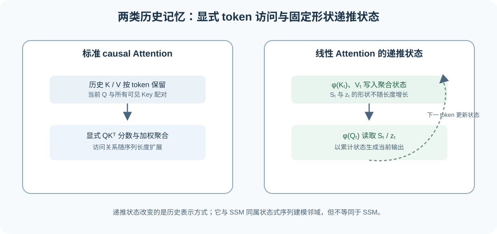
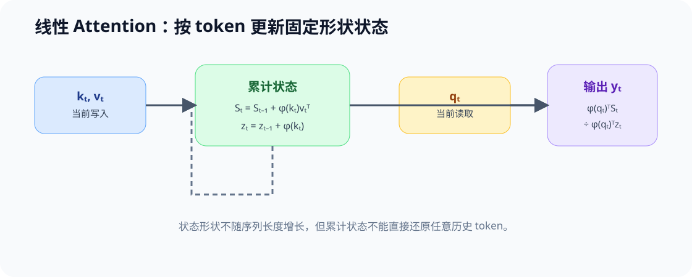

# 45. Linear Attention and Recurrent State | 线性注意力与递推状态

**难度：** Hard | **环境：** CPU-first | **标签：** `Attention`, `线性注意力`, `递推状态`

> 🚀 **云端运行环境**
>
> 本章节的实战代码可以点击以下链接在免费 GPU 算力平台上直接运行：
>
> [](https://colab.research.google.com/github/datawhalechina/llm-algo-leetcode/blob/main/02_PyTorch_Algorithms/45_Linear_Attention_and_Recurrent_State.ipynb)
> [](https://modelscope.cn/my/mynotebook) *(国内推荐：魔搭社区免费实例)*


## 本节导读

标准 causal Attention 会把当前 Query 与历史 Key 两两比较，因此显式保留了随序列长度增长的访问关系。线性 Attention 使用特征映射和累积状态，把历史信息压缩为可递推更新的统计量；它改变的不是“模型是否依赖历史”，而是历史以什么形式被保存和读取。

本节用一个简化的正特征映射，观察递推状态如何替代完整分数矩阵，并把线性 Attention 与 SSM 放在相邻但不同的位置比较：前者仍是一类 Attention 近似，后者是另一类状态更新架构。

**关键词：** `Linear Attention`, `Feature Map`, `Recurrent State`, `SSM`

## 前置阅读

**导语：** 先理解标准 Attention 的 Q/K/V、因果可见性和 KV 状态，再比较显式历史访问与固定大小递推状态的差异。

- [Part 02 · 04 Attention（MHA / GQA）](./04_Attention_MHA_GQA.md)
- [大模型架构 · Attention 演化](../topic_discussion/llm_architecture_evolution/04_attention_evolution.md)

### Step 1：显式访问与递推状态

Dense Attention 在第 `t` 步保留当前 Query 与全部历史 Key 的关系；线性 Attention 则把历史 Key/Value 汇总为状态，在新 token 到来时更新状态并生成输出。两者都依赖历史，但一个显式处理 token 对，另一个把历史压缩为固定形状的累积量。



### Step 2：线性 Attention 的状态更新

用正特征映射 `φ` 近似相似度后，可以把历史压缩为两个累积量：`S_t = Σ φ(k_i)v_iᵀ` 保存 Key/Value 的联合状态，`z_t = Σ φ(k_i)` 保存归一化项。当前输出由 `φ(q_t)` 与这两个状态计算，而不显式构造完整的 `S×S` 分数矩阵。

| 对象 | Dense causal Attention | 线性 Attention 的递推形式 |
| --- | --- | --- |
| 历史表示 | 历史 K/V 与当前 Query 的成对关系 | `S_t` 与 `z_t` 两个累积状态 |
| 当前输出 | 对全部历史位置归一化加权 | `φ(q_t)ᵀS_t / (φ(q_t)ᵀz_t)` |
| 序列增长 | 分数关系随 token 对增加 | 状态形状由特征维度与 Value 维度决定 |
| 需要验证 | 全局依赖与因果 mask | 状态更新、归一化稳定性与近似误差 |



### Step 3：线性 Attention、KV Cache 与 SSM 的关系

线性 Attention 不等于“免费替代”标准 Attention：特征映射改变了相似度形式，固定大小状态也不天然保留所有精确 token 对关系。它与 KV Cache 的差别在于，KV Cache 保存可按 token 读取的历史 K/V；递推状态保存的是聚合统计量。SSM 同样使用状态更新，但其选择性更新规则和参数化方式不必经过 Attention 的 Q/K 相似度。

| 机制 | 历史保存形式 | 是否能直接读取单个历史 token | 主要取舍 |
| --- | --- | --- | --- |
| 标准 Attention + KV Cache | 每个历史 token 的 K/V | 可以 | 状态与读取量随长度增长 |
| 线性 Attention | 特征映射的累积状态 | 不可以，读取的是聚合统计量 | 近似形式与数值稳定性需验证 |
| SSM / Mamba | 选择性递推状态 | 不以 Query-Key 检索方式读取 | 不是标准 Attention 的简单等价替换 |

### Step 4：实现线性 Attention 的递推账本

本题用小矩阵和正特征映射复现线性 Attention 的状态更新。骨架已提供输入契约和输出容器；你将补全特征映射、`S_t/z_t` 递推以及归一化输出。测试覆盖状态形状、前缀因果性和非法维度，不把该教学实现写成真实模型的吞吐结论。

| 任务与目的 | 已知条件 | 完成标准 | 测试验证 |
| --- | --- | --- | --- |
| TODO 1：构造正特征映射，提供正的归一化项。 | `queries`、`keys` 的非空二维输入 | 输出与输入同形且元素为正 | 正常输入、空序列与维度契约 |
| TODO 2：递推更新历史状态。 | 当前 `φ(k_t)`、`v_t`、初始 `S/z` | 每步只使用当前 token 与此前状态 | 状态形状与逐步更新 |
| TODO 3：由当前 Query 和状态生成输出。 | `φ(q_t)`、`S_t`、`z_t` | 输出有限，分母稳定 | 前缀因果性与有限值 |


```python
import numpy as np

```


```python
def positive_feature_map(x: np.ndarray) -> np.ndarray:
    """返回与 x 同形的正特征映射，避免归一化项为零。"""
    if x.ndim != 2 or x.shape[0] == 0:
        raise ValueError('x 必须是非空 [seq_len, feature_dim] 二维数组')
    # TODO 1：构造逐元素为正的特征映射。
    # features = 与 x 同形、逐元素 > 0 的数组。
    # features = ???
    return features

def linear_attention_scan(queries: np.ndarray, keys: np.ndarray, values: np.ndarray) -> tuple[np.ndarray, np.ndarray, np.ndarray]:
    """按 token 递推 S_t、z_t，并返回 outputs、final_state、final_normalizer。"""
    if queries.shape != keys.shape or queries.ndim != 2 or values.ndim != 2 or queries.shape[0] != values.shape[0] or queries.shape[0] == 0:
        raise ValueError('queries、keys、values 必须共享非空序列长度，且 Q/K 形状一致')
    query_features, key_features = positive_feature_map(queries), positive_feature_map(keys)
    state = np.zeros((queries.shape[1], values.shape[1]), dtype=float)
    normalizer = np.zeros(queries.shape[1], dtype=float)
    outputs = []
    for query_feature, key_feature, value in zip(query_features, key_features, values):
        # TODO 2：更新 state 与 normalizer。
        # state = [feature_dim, value_dim]；normalizer = [feature_dim]。
        # state = ???
        # normalizer = ???
        # TODO 3：计算当前输出，分母需要保持正值。
        # output = [value_dim]；分母由 query_feature 与 normalizer 的内积给出。
        # output = ???
        outputs.append(output)
    return np.stack(outputs), state, normalizer

```


```python
# 测试递推不变量：状态形状固定，当前输出不依赖未来 token，非法输入必须拒绝。
def _linear_fixture():
    queries = np.array([[1.0, -1.0], [0.5, 2.0], [3.0, -0.5]])
    keys = np.array([[0.0, 1.0], [2.0, -1.0], [1.5, 1.5]])
    values = np.array([[1.0], [2.0], [4.0]])
    return queries, keys, values

def test_state_contract():
    """验证输出、状态和归一化项的形状。"""
    queries, keys, values = _linear_fixture()
    outputs, state, normalizer = linear_attention_scan(queries, keys, values)
    assert outputs.shape == values.shape and state.shape == (2, 1) and normalizer.shape == (2,)
    assert np.isfinite(outputs).all() and (normalizer > 0).all()

def test_prefix_causality():
    """修改未来 token 后，先前输出必须保持不变。"""
    queries, keys, values = _linear_fixture()
    original, _, _ = linear_attention_scan(queries, keys, values)
    changed_keys, changed_values = keys.copy(), values.copy()
    changed_keys[-1] += 100.0
    changed_values[-1] += 100.0
    changed, _, _ = linear_attention_scan(queries, changed_keys, changed_values)
    assert np.allclose(original[:-1], changed[:-1])

def test_input_contract():
    """验证 Q/K 维度不一致和空序列会被拒绝。"""
    invalid_inputs = [
        (np.ones((2, 2)), np.ones((2, 3)), np.ones((2, 1))),
        (np.empty((0, 2)), np.empty((0, 2)), np.empty((0, 1))),
    ]
    for queries, keys, values in invalid_inputs:
        try:
            linear_attention_scan(queries, keys, values)
        except ValueError:
            continue
        raise AssertionError('非法输入必须拒绝')

def test_feature_map_contract():
    """验证特征映射为正，并拒绝空序列。"""
    assert (positive_feature_map(np.array([[-2.0, 0.0]])) > 0).all()
    try:
        positive_feature_map(np.empty((0, 2)))
    except ValueError:
        return
    raise AssertionError('空序列必须拒绝')

test_state_contract()
test_prefix_causality()
test_input_contract()
test_feature_map_contract()
print('✅ 线性 Attention 递推状态测试通过。')

```

---

🛑 **STOP HERE**：先完成递推状态更新并运行测试，再查看参考答案。

## 参考代码与解析


```python
def positive_feature_map(x: np.ndarray) -> np.ndarray:
    """返回与 x 同形的正特征映射，避免归一化项为零。"""
    if x.ndim != 2 or x.shape[0] == 0:
        raise ValueError('x 必须是非空 [seq_len, feature_dim] 二维数组')
    # TODO 1：正特征映射。
    features = np.maximum(x, 0.0) + 1.0
    return features

def linear_attention_scan(queries: np.ndarray, keys: np.ndarray, values: np.ndarray) -> tuple[np.ndarray, np.ndarray, np.ndarray]:
    """按 token 递推 S_t、z_t，并返回 outputs、final_state、final_normalizer。"""
    if queries.shape != keys.shape or queries.ndim != 2 or values.ndim != 2 or queries.shape[0] != values.shape[0] or queries.shape[0] == 0:
        raise ValueError('queries、keys、values 必须共享非空序列长度，且 Q/K 形状一致')
    query_features, key_features = positive_feature_map(queries), positive_feature_map(keys)
    state = np.zeros((queries.shape[1], values.shape[1]), dtype=float)
    normalizer = np.zeros(queries.shape[1], dtype=float)
    outputs = []
    for query_feature, key_feature, value in zip(query_features, key_features, values):
        # TODO 2：更新递推状态。
        state = state + np.outer(key_feature, value)
        normalizer = normalizer + key_feature
        # TODO 3：使用当前 Query 读取状态。
        denominator = float(query_feature @ normalizer)
        output = (query_feature @ state) / denominator
        outputs.append(output)
    return np.stack(outputs), state, normalizer

```

### 答案解析

- **TODO 1：** `relu(x)+1` 只是教学用的正特征映射；它保证归一化项为正，但不代表某个真实线性 Attention 的完整核函数。
- **TODO 2：** `state` 累积 `φ(k_t)v_tᵀ`，`normalizer` 累积 `φ(k_t)`；两者形状不随序列长度增长。
- **TODO 3：** 当前 Query 只能读取本步更新后的历史状态，所以修改未来 token 不应改变此前输出。该不变量证明递推的因果性，不证明它与 softmax Attention 数值等价。

### Step 5：可选 GPU 复测——显式历史与固定递推状态

CPU 实验验证线性 Attention 的递推更新不变量；本实验固定单层、Head、dtype 和长度阶梯，比较标准 Attention 的显式 K/V 历史与固定大小递推状态。两条路径使用不同记忆机制，因此只比较状态增长和单步代价，不比较输出数值或任务质量。

| CPU 机制价值 | GPU 实验价值 | 后续入口 |
| --- | --- | --- |
| 验证递推状态形状、因果性与更新顺序 | 比较状态字节、单步时间与峰值显存随长度的变化 | ARCH-HYBRID 比较多层混合计划；77 验证真实 checkpoint 的长序列质量 |

#### 5.1 固定单层状态 workload


```python
# 默认关闭；本实验不下载模型，也不调用专用 Linear Attention kernel。
RUN_GPU_EXPERIMENT = False
SEQUENCE_LENGTHS = [512, 2048, 8192]  # 显式历史随长度增长，递推状态保持固定。
NUM_HEADS = 8
HEAD_DIM = 64
DTYPE = 'bfloat16'
WARMUP = 3
REPEATS = 10
RESULT_PATH = 'benchmarks/results/45_linear_recurrent_state.json'
print({'run': RUN_GPU_EXPERIMENT, 'lengths': SEQUENCE_LENGTHS, 'heads': NUM_HEADS, 'head_dim': HEAD_DIM, 'result': RESULT_PATH})

```

#### 5.2 执行两种状态接口


```python
if RUN_GPU_EXPERIMENT:
    import subprocess, sys
    command = [
        sys.executable, 'tools/run_architecture_mechanism_benchmark.py',
        '--mode', 'linear_recurrence', '--output', RESULT_PATH,
        '--sequence-lengths', ','.join(map(str, SEQUENCE_LENGTHS)),
        '--query-heads', str(NUM_HEADS), '--head-dim', str(HEAD_DIM),
        '--dtype', DTYPE, '--warmup', str(WARMUP), '--repeats', str(REPEATS),
    ]
    subprocess.run(command, check=True)
else:
    print('线性递推 GPU 实验默认关闭。')

```

#### 5.3 读取状态增长证据


```python
import json
from pathlib import Path
result_path = Path(RESULT_PATH)
if result_path.exists():
    result = json.loads(result_path.read_text(encoding='utf-8'))
    required = {'mechanism', 'workload', 'hardware', 'metrics', 'evidence_level', 'failure', 'decision'}
    missing = required - set(result)
    if missing:
        raise ValueError(f'结果 JSON 缺少字段：{sorted(missing)}')
    print(result)
else:
    print(f'尚无线性递推结果：{RESULT_PATH}')

```

## 相关阅读

- [Transformers are RNNs: Fast Autoregressive Transformers with Linear Attention](https://arxiv.org/abs/2006.16236)
- [Mamba: Linear-Time Sequence Modeling with Selective State Spaces](https://arxiv.org/abs/2312.00752)
- [大模型架构 · Attention 演化](../topic_discussion/llm_architecture_evolution/04_attention_evolution.md)
- [ARCH-HYBRID-MEMORY：Attention、SSM 与混合记忆](./ARCH-HYBRID-MEMORY_Attention_SSM_Hybrid.md)
- [77 长序列记忆架构基准](./77_Long_Sequence_Memory_Architecture_Benchmark.md)
