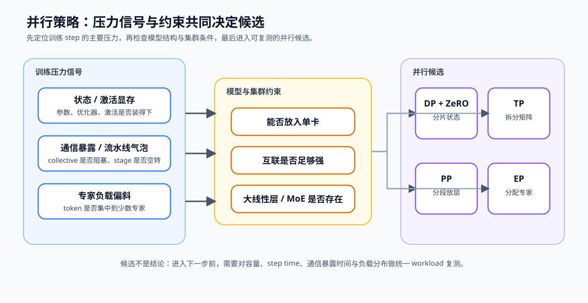

# 49. Parallelism Strategy Selection | 并行策略选型
**难度：** Medium | **环境：** CPU-first | **标签：** `并行通信`, `并行策略`, `策略选择` | **目标人群：** 并行通信学习者

> 🚀 **云端运行环境**
>
> 本章节的实战代码可以点击以下链接在免费 GPU 算力平台上直接运行：
>
> [](https://colab.research.google.com/github/datawhalechina/llm-algo-leetcode/blob/main/02_PyTorch_Algorithms/49_Parallelism_Strategy_Selection.ipynb)
> [](https://modelscope.cn/my/mynotebook) *(国内推荐：魔搭社区免费实例)*


---

## 本节导读

模型训练与推理都可能遇到单卡容量、层内计算、长上下文、流水线气泡和负载不均问题，但这些压力对应的切分维度不同。本节把观测信号转成 TP、PP、CP、EP、训练状态分片或 Serving 副本候选，并为组合方案保留复测证据。

**关键词：** `ZeRO`, `TP`, `PP`, `CP`, `EP`, `replica routing`

---

## 前置阅读

**导语：** 先回顾四类并行各自切分什么，再把显存、通信和负载信号连接到合适的候选方案。
- [27. ZeRO Optimizer Sim | ZeRO 优化器模拟](./27_ZeRO_Optimizer_Sim.md)
- [28. Pipeline Parallelism MicroBatch | Pipeline 并行与 MicroBatch](./28_Pipeline_Parallelism_MicroBatch.md)
- [29. Tensor Parallelism Sim | Tensor Parallelism 模拟](./29_Tensor_Parallelism_Sim.md)
- [PAR-CONTEXT. Context and Sequence Parallelism | 上下文与序列并行](./PAR-CONTEXT_Context_and_Sequence_Parallelism.md)
- [47. MoE Expert Parallel | MoE 专家并行](./47_MoE_Expert_Parallel.md)
- [PAR-REPLICA. Serving Replica Routing | Serving 副本与请求路由](./PAR-REPLICA_Serving_Replica_Routing.md)

---

### Step 1：从 workload 信号识别切分对象

先判断压力来自训练状态、单层张量、模型层、序列上下文、专家路由，还是 Serving 请求队列。切分对象判断错误，会用新的 collective 或路由开销掩盖原有问题。

| 观察到的信号 | 首先要追问的问题 | 常见候选方向 |
| --- | --- | --- |
| optimizer state 或参数显存高 | 状态能否按 rank 分片？ | DP + ZeRO |
| 单层矩阵过大且互联强 | 张量维度能否拆到多卡？ | TP |
| 模型无法放入单卡、stage 时长不同 | 层能否分段且气泡是否可接受？ | PP |
| MoE token 分布不均 | 专家负载和 dispatch 能否均衡？ | EP |
| 长上下文导致单 rank 序列状态过大 | 序列维是否需要跨 rank 切分？ | CP / Sequence Parallel |
| Serving 队列或副本负载不均 | 请求能否按队列、缓存或会话路由？ | 模型副本 + 请求路由 |



### Step 2: 用约束生成并行候选

并行方式不是互斥菜单。ZeRO 处理训练状态，TP 切层内张量，PP 切模型层，CP 切长序列，EP 切专家；Serving 副本不切模型，而是分发独立请求。候选排序还要满足模型结构、workload 与互联条件。

| 候选 | 适用约束 | 主要收益 | 首先复测的风险 |
| --- | --- | --- | --- |
| DP + ZeRO | 状态显存压力大 | 分片参数、梯度或优化器状态 | collective 频率与单卡峰值显存 |
| TP | 大线性层且互联强 | 拆分矩阵计算与权重 | all-reduce 暴露时间 |
| PP | 模型不能放入单卡 | 分段放置模型层 | bubble 与 stage 不均衡 |
| EP | 存在 MoE 路由 | 分配专家计算 | all-to-all 与专家负载偏斜 |
| CP / Sequence Parallel | 长上下文状态成为单 rank 瓶颈 | 切分序列状态与 Attention 工作 | all-gather、reduce-scatter 或 ring 通信 |
| Serving 副本 | 模型可由单实例承载且请求可独立执行 | 扩展请求吞吐并隔离队列 | cache locality、sticky session 与尾延迟 |


### Step 3：比较风险并设计复测

候选排序只是开始。对每个候选固定同一模型、batch、序列长度和精度后，再同时读取容量、step time、通信暴露时间和负载分布；否则无法判断收益来自策略本身还是 workload 变化。

| 方案已被排到前列时 | 需要保留的证据 | 出现什么情况要回调策略 |
| --- | --- | --- |
| DP + ZeRO | 单卡峰值显存、collective 时间 | 显存下降但同步时间显著增长 |
| TP | all-reduce payload、暴露时间、矩阵吞吐 | 互联不足导致通信主导 |
| PP | bubble ratio、各 stage 时长、micro-batch 数 | 一个 stage 长期拖慢全流水线 |
| EP | all-to-all 时间、专家 token 分布 | 热门专家或 dispatch 造成长尾 |
| CP / Sequence Parallel | 序列通信量、暴露通信时间、单 rank 状态 | 通信增长抵消长上下文容量收益 |
| Serving 副本 | 各副本队列、缓存命中、P95 / P99 | 吞吐增加但请求或缓存分布持续偏斜 |


### Step 4：CPU 机制实现——从约束到候选方案

题目区用归一化信号模拟选型：先识别最强压力，再结合模型容量、互联、结构、上下文长度和 Serving workload 生成候选，最后给出复测所需的证据。

| TODO | 函数 / 机制 | 输入与关键变量 | 输出与不变量 | 测试关注点 |
| --- | --- | --- | --- | --- |
| 1 | `classify_parallel_bottleneck`：压力归因 | `signals`、最大信号、0.50 次要风险阈值 | 输出 `primary`、`severity`、`secondary_risks`；主压力只能有一个 | 最大信号映射与次要风险保留是否正确 |
| 2 | `rank_parallel_candidates`：候选生成与排序 | `summary`、模型与 workload 约束、`scores` | 每项候选保留 `name / score / risk`；不满足条件的候选不进入列表 | 训练、长上下文、MoE 与 Serving 条件是否改变排序 |
| 3 | `recommend_parallel_followup`：复测决策 | 首选候选、风险、次要风险 | 输出 `accept / tune / collect_more_evidence` 与测量字段 | 风险或证据不足是否触发正确决策 |

### 题目区

`signals` 中每个值已归一化到 0–1，越大表示该问题越接近关键路径。`constraints` 用布尔字段表达当前模型与集群条件；题目只要求根据这些条件建立透明的优先级，不假装替代真实多卡基准。


```python
from typing import Any, Dict, List

```


```python
def classify_parallel_bottleneck(signals: Dict[str, float]) -> Dict[str, Any]:
    """
    TODO 1：从 workload 信号归因当前最强的并行压力。

    `signals` 的值在 0–1 之间；除训练状态、激活、通信、bubble 和
    rank 不均衡外，也可包含长上下文与 Serving 队列压力。
    """
    signal_to_bottleneck = {
        'state_memory_pressure': 'state_memory',
        'activation_memory_pressure': 'activation_memory',
        'comm_exposed_ratio': 'communication',
        'pipeline_bubble_ratio': 'pipeline_bubble',
        'rank_imbalance_ratio': 'load_imbalance',
        'long_context_pressure': 'long_context',
        'serving_queue_pressure': 'serving_queue',
    }
    # 提示：primary_signal, severity = ???；再用映射得到 primary。
    # 提示：secondary_risks 只保留不等于 primary 且不低于 0.50 的问题。
    raise NotImplementedError


def rank_parallel_candidates(summary: Dict[str, Any], constraints: Dict[str, bool]) -> List[Dict[str, Any]]:
    """
    TODO 2：用主压力和硬件 / workload 约束为 ZeRO、TP、PP、EP、CP、Replica 排序。

    constraints 包含 model_fits_single_gpu、strong_interconnect、
    large_linear_layer、has_moe、long_context、serving_workload；返回项应保留
    name、score 和 risk。
    """
    primary = summary['primary']
    secondary = set(summary['secondary_risks'])
    scores = {'dp_zero': 0, 'tp': 0, 'pp': 0, 'ep': 0, 'cp': 0, 'replica': 0}

    # 提示：state_memory 时提高 dp_zero；activation_memory 或模型不能单卡容纳时提高 pp。
    # 提示：large_linear_layer 且 strong_interconnect 时提高 tp；has_moe 时提高 ep。
    # 提示：long_context 时提高 cp；serving_workload 且模型可由单实例承载时提高 replica。
    # 提示：通信压力或互联不足应降低 tp；负载不均应让 ep 保留但附带风险。
    # scores[...] = ???
    raise NotImplementedError


def recommend_parallel_followup(
    summary: Dict[str, Any],
    ranked: List[Dict[str, Any]],
) -> Dict[str, Any]:
    """
    TODO 3：把首选候选转成下一轮的复测决策。

    `accept` 表示可作为下一轮 baseline；`tune` 表示先处理明显风险；
    `collect_more_evidence` 表示信号不足，不能直接选择并行方案。
    """
    if not ranked or ranked[0]['score'] <= 0:
        return {
            'decision': 'collect_more_evidence',
            'plan': None,
            'reason': '没有足够强的约束支持某个并行候选',
            'required_measurements': ['peak_memory_mb', 'step_time_ms'],
        }

    candidate = ranked[0]
    # 提示：candidate['risk'] 不为 None 或 secondary_risks 非空时，decision = ???。
    # 提示：根据 candidate['name'] 填写最相关的 required_measurements。
    raise NotImplementedError

```


```python
# 这些测试分别验证归因、候选排序和风险决策；它们不替代真实多卡基准。
def test_parallel_bottleneck_classification():
    try:
        summary = classify_parallel_bottleneck({
            'state_memory_pressure': 0.85,
            'activation_memory_pressure': 0.20,
            'comm_exposed_ratio': 0.40,
            'pipeline_bubble_ratio': 0.10,
            'rank_imbalance_ratio': 0.55,
        })
        assert summary == {
            'primary': 'state_memory',
            'severity': 0.85,
            'secondary_risks': ['load_imbalance'],
        }
    except NotImplementedError:
        raise
    except (AttributeError, KeyError, NameError, TypeError, ValueError, AssertionError) as e:
        raise NotImplementedError('请先完成 TODO 1：并行压力归因。') from e


def test_parallel_candidate_ranking():
    try:
        summary = {'primary': 'state_memory', 'severity': 0.85, 'secondary_risks': []}
        ranked = rank_parallel_candidates(summary, {
            'model_fits_single_gpu': True,
            'strong_interconnect': False,
            'large_linear_layer': False,
            'has_moe': False,
        })
        assert ranked == [{'name': 'dp_zero', 'score': 3, 'risk': 'inspect_collective_frequency'}]

        ep_ranked = rank_parallel_candidates(
            {'primary': 'load_imbalance', 'severity': 0.80, 'secondary_risks': ['communication']},
            {'model_fits_single_gpu': True, 'strong_interconnect': True, 'large_linear_layer': False, 'has_moe': True},
        )
        assert ep_ranked[0]['name'] == 'ep'
        assert ep_ranked[0]['risk'] == 'inspect_expert_load_and_all_to_all'

        cp_ranked = rank_parallel_candidates(
            {'primary': 'long_context', 'severity': 0.90, 'secondary_risks': ['communication']},
            {'model_fits_single_gpu': False, 'strong_interconnect': True, 'large_linear_layer': False,
             'has_moe': False, 'long_context': True, 'serving_workload': False},
        )
        assert cp_ranked[0]['name'] == 'cp'

        replica_ranked = rank_parallel_candidates(
            {'primary': 'serving_queue', 'severity': 0.80, 'secondary_risks': []},
            {'model_fits_single_gpu': True, 'strong_interconnect': False, 'large_linear_layer': False,
             'has_moe': False, 'long_context': False, 'serving_workload': True},
        )
        assert replica_ranked[0]['name'] == 'replica'
    except NotImplementedError:
        raise
    except (AttributeError, KeyError, NameError, TypeError, ValueError, AssertionError) as e:
        raise NotImplementedError('请先完成 TODO 2：并行候选排序。') from e


def test_parallel_followup_decision():
    try:
        accepted = recommend_parallel_followup(
            {'primary': 'state_memory', 'severity': 0.85, 'secondary_risks': []},
            [{'name': 'dp_zero', 'score': 3, 'risk': None}],
        )
        assert accepted['decision'] == 'accept'
        assert 'peak_memory_mb' in accepted['required_measurements']

        tuned = recommend_parallel_followup(
            {'primary': 'load_imbalance', 'severity': 0.80, 'secondary_risks': ['communication']},
            [{'name': 'ep', 'score': 4, 'risk': 'inspect_expert_load_and_all_to_all'}],
        )
        assert tuned['decision'] == 'tune'
        assert 'expert_token_cv' in tuned['required_measurements']

        missing = recommend_parallel_followup(
            {'primary': 'communication', 'severity': 0.10, 'secondary_risks': []}, []
        )
        assert missing['decision'] == 'collect_more_evidence'
        print('✅ 并行候选与复测决策通过')
    except NotImplementedError:
        raise
    except (AttributeError, KeyError, NameError, TypeError, ValueError, AssertionError) as e:
        raise NotImplementedError('请先完成 TODO 3：复测决策。') from e


test_parallel_bottleneck_classification()
test_parallel_candidate_ranking()
test_parallel_followup_decision()

```

---

🛑 **STOP HERE** 🛑
<br><br><br><br><br><br><br><br><br><br>
> 请先尝试自己完成代码并跑通测试。<br>
> 如果你正在 Colab 中运行，并且遇到困难没有思路，可以向下滚动查看参考答案。
<br><br><br><br><br><br><br><br><br><br>

---

## 参考代码与解析

### 代码


```python
def classify_parallel_bottleneck(signals: Dict[str, float]) -> Dict[str, Any]:
    """
    TODO 1：从 workload 信号归因当前最强的并行压力。

    `signals` 的值在 0–1 之间；除训练状态、激活、通信、bubble 和
    rank 不均衡外，也可包含长上下文与 Serving 队列压力。
    """
    signal_to_bottleneck = {
        'state_memory_pressure': 'state_memory',
        'activation_memory_pressure': 'activation_memory',
        'comm_exposed_ratio': 'communication',
        'pipeline_bubble_ratio': 'pipeline_bubble',
        'rank_imbalance_ratio': 'load_imbalance',
        'long_context_pressure': 'long_context',
        'serving_queue_pressure': 'serving_queue',
    }
    primary_signal, severity = max(signals.items(), key=lambda item: item[1])
    primary = signal_to_bottleneck[primary_signal]
    secondary_risks = [
        signal_to_bottleneck[name]
        for name, value in signals.items()
        if name != primary_signal and value >= 0.50
    ]
    return {'primary': primary, 'severity': severity, 'secondary_risks': secondary_risks}


def rank_parallel_candidates(summary: Dict[str, Any], constraints: Dict[str, bool]) -> List[Dict[str, Any]]:
    """
    TODO 2：用主压力和硬件 / workload 约束为 ZeRO、TP、PP、EP、CP、Replica 排序。

    constraints 包含 model_fits_single_gpu、strong_interconnect、
    large_linear_layer、has_moe、long_context、serving_workload；返回项保留
    name、score 和 risk。
    """
    primary = summary['primary']
    secondary = set(summary['secondary_risks'])
    scores = {'dp_zero': 0, 'tp': 0, 'pp': 0, 'ep': 0, 'cp': 0, 'replica': 0}

    if primary == 'state_memory':
        scores['dp_zero'] += 3
    if primary == 'activation_memory' or not constraints['model_fits_single_gpu']:
        scores['pp'] += 3
    if constraints['large_linear_layer'] and constraints['strong_interconnect']:
        scores['tp'] += 3
    if constraints['has_moe']:
        scores['ep'] += 3
    if constraints.get('long_context', False):
        scores['cp'] += 3
    if constraints.get('serving_workload', False) and constraints['model_fits_single_gpu']:
        scores['replica'] += 3

    if 'communication' in secondary or primary == 'communication' or not constraints['strong_interconnect']:
        scores['tp'] -= 2
    if primary == 'pipeline_bubble':
        scores['pp'] -= 1
    if primary == 'load_imbalance':
        scores['ep'] += 2
    if primary == 'long_context':
        scores['cp'] += 2
    if primary == 'serving_queue':
        scores['replica'] += 2

    risks = {
        'dp_zero': 'inspect_collective_frequency' if primary == 'state_memory' else None,
        'tp': 'inspect_all_reduce_exposure' if scores['tp'] > 0 else None,
        'pp': 'inspect_bubble_and_stage_balance' if scores['pp'] > 0 else None,
        'ep': 'inspect_expert_load_and_all_to_all' if constraints['has_moe'] else None,
        'cp': 'inspect_sequence_collective_exposure' if scores['cp'] > 0 else None,
        'replica': 'inspect_queue_balance_and_cache_locality' if scores['replica'] > 0 else None,
    }
    candidates = [
        {'name': name, 'score': score, 'risk': risks[name]}
        for name, score in scores.items()
        if score > 0
    ]
    return sorted(candidates, key=lambda item: item['score'], reverse=True)


def recommend_parallel_followup(
    summary: Dict[str, Any],
    ranked: List[Dict[str, Any]],
) -> Dict[str, Any]:
    """
    TODO 3：把首选候选转成下一轮的复测决策。

    `accept` 表示可作为下一轮 baseline；`tune` 表示先处理明显风险；
    `collect_more_evidence` 表示信号不足，不能直接选择并行方案。
    """
    if not ranked or ranked[0]['score'] <= 0:
        return {
            'decision': 'collect_more_evidence',
            'plan': None,
            'reason': '没有足够强的约束支持某个并行候选',
            'required_measurements': ['peak_memory_mb', 'step_time_ms'],
        }

    candidate = ranked[0]
    measurements = {
        'dp_zero': ['peak_memory_mb', 'collective_time_ms', 'step_time_ms'],
        'tp': ['all_reduce_payload_mb', 'exposed_comm_ms', 'step_time_ms'],
        'pp': ['bubble_ratio', 'stage_time_ms', 'peak_memory_mb'],
        'ep': ['expert_token_cv', 'all_to_all_time_ms', 'p95_step_time_ms'],
        'cp': ['sequence_payload_mb', 'exposed_comm_ms', 'peak_memory_mb'],
        'replica': ['queue_wait_p95_ms', 'cache_hit_rate', 'throughput_requests_per_s'],
    }
    needs_tuning = candidate['risk'] is not None or bool(summary['secondary_risks'])
    return {
        'decision': 'tune' if needs_tuning else 'accept',
        'plan': candidate['name'],
        'reason': candidate['risk'] or '主压力与候选约束一致',
        'required_measurements': measurements[candidate['name']],
    }

```

### 解析

TODO 1：先把最大信号映射成主压力，并保留仍然较高的次要风险。这样即使 DP+ZeRO 缓解了状态显存，也不会忽略随后的专家负载或通信问题。

TODO 2：候选分数来自约束，而不是预先写死的一列排名。TP 需要大线性层和较强互联；PP 适合模型无法放入单卡；EP 只有存在 MoE 时才有意义；CP 对应长上下文切分，Replica 对应可独立路由的 Serving 请求。每个候选同时携带下一轮要检查的风险。

TODO 3：`accept` 只表示可以进入统一 workload 的下一轮 baseline，`tune` 表示候选合理但风险已明确，`collect_more_evidence` 则要求先补齐关键测量。它们都不是最终的多卡性能结论。

## 相关阅读

完成训练状态、张量、层、序列、专家与请求副本的切分对象比较后，可以继续阅读并行框架实现和分布式基准，验证候选组合是否可靠。

- [Megatron-LM 原论文](https://arxiv.org/abs/2104.04473)
- [DeepSpeed 官方仓库](https://github.com/microsoft/DeepSpeed)
- [79. Distributed Parallel Benchmark | 分布式并行基准](./79_Distributed_Parallel_Benchmark.md)
- [80. MoE Expert Parallel Benchmark | MoE 专家并行基准](./80_MoE_Expert_Parallel_Benchmark.md)
