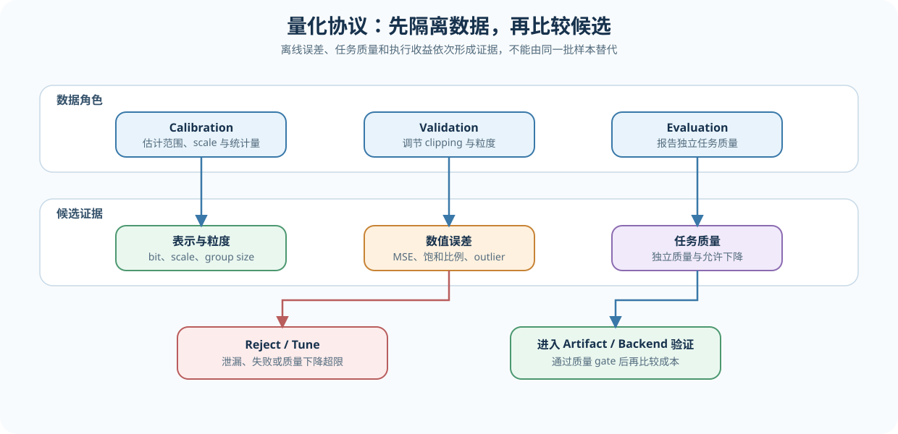

# 52. Quantization Calibration and Error | 量化校准与误差控制

**难度：** Medium | **环境：** CPU-first | **标签：** `量化`, `校准`, `误差`, `评测隔离` | **目标人群：** 希望建立量化候选比较协议的学习者

> 🚀 **云端运行环境**
>
> 本章节的实战代码可以点击以下链接在免费 GPU 算力平台上直接运行：
>
> [](https://colab.research.google.com/github/datawhalechina/llm-algo-leetcode/blob/main/02_PyTorch_Algorithms/52_Quantization_Calibration_and_Error.ipynb)
> [](https://modelscope.cn/my/mynotebook) *(国内推荐：魔搭社区免费实例)*


## 本节导读

量化候选是否可信，首先取决于测量协议：校准数据用于估计范围，独立评测数据用于检查误差和任务质量，两者不能因样本重合而相互泄漏。本节从数据角色出发，分析异常值、截断和粒度如何改变误差，再用统一 gate 判断候选能否进入模型与 backend 实验。

学完后，你应该能够解释一个低离线误差候选为什么仍可能被拒绝，并能保留候选的校准配置、数值误差、质量变化和容量成本。

**关键词：** `calibration set`, `evaluation isolation`, `clipping`, `granularity`, `quality gate`

## 前置阅读

**导语：** 量化校准需要基本的整数表示与张量范围概念；本节负责建立后续各类量化共同使用的误差口径。

- [Part 01 · 21 Quantization Theory | 量化理论与 INT4/INT8](../01_Hardware_Math_and_Systems/21_Quantization_Theory_and_INT4_INT8.md)

### Step 1：校准、验证与评测数据承担什么职责

校准集估计量化范围或统计量，验证集用于调整 clipping、group size 等候选配置，评测集负责报告最终任务质量。三个集合可以来自同一数据域，但样本身份必须隔离；否则候选可能只是在重复利用已见样本，而不具备可推广的质量证据。

| 数据角色 | 用途 | 可以影响什么 | 不应做什么 |
|:---|:---|:---|:---|
| calibration | 统计范围、scale、异常值或 Hessian/激活信息 | 量化参数与候选生成 | 直接充当最终质量结论 |
| validation | 比较 clipping、粒度和超参数 | 候选调节与早期淘汰 | 反复调参后再冒充独立评测 |
| evaluation | 测量任务质量与回归 | accept / tune / reject | 回流修改当前候选 |
| deployment workload | 验证真实 shape、kernel 和服务指标 | backend 决策 | 替代独立质量评测 |



### Step 2：异常值、舍入和截断如何形成误差

对称量化用校准范围确定 scale。若直接使用绝对最大值，少数 outlier 会扩大整数网格间隔，使大多数普通值只能使用较少的有效码点；主动 clipping 可以缩小步长，但超出范围的值会产生截断误差。因此候选必须同时记录恢复误差和饱和比例。

| 误差来源 | 形成原因 | 观察指标 | 常见调整 |
|:---|:---|:---|:---|
| 舍入误差 | 浮点值无法落在整数网格上 | MSE、余弦相似度 | 增加 bit 或细化粒度 |
| 截断误差 | 数值超过候选范围 | 最大误差、饱和比例 | 调整 clipping 或保留异常值 |
| 统计偏移 | 校准分布与目标 workload 不一致 | 分桶误差、任务质量 | 更换或扩充校准样本 |
| 累积误差 | 多层近似向下游传播 | 层输出误差、端到端质量 | 混合精度、QAT 或 fallback |

对称量化仍满足 `scale = range / qmax`、`q = clamp(round(x / scale))` 和 `x_hat = q × scale`；区别在于 `range` 可以来自绝对最大值，也可以来自 clipping 后的统计范围。

### Step 3：怎样比较不同粒度并通过质量 gate

per-tensor、per-channel 和 per-group 会产生不同数量的 scale，也会改变恢复误差、元数据和目标 kernel 的支持情况。统一协议先在独立数据上记录数值误差与任务质量，再淘汰超过质量门槛或执行失败的候选；压缩比和延迟只在通过质量 gate 的候选之间比较。

| 候选证据 | 回答的问题 | 进入下一阶段的条件 |
|:---|:---|:---|
| granularity、bit、scale 数量 | 候选使用了什么表示 | 配置完整且可复现 |
| MSE、最大误差、余弦相似度、饱和比例 | 数值近似是否稳定 | 无异常误差或未解释的 outlier |
| 独立任务质量与 quality drop | 模型行为是否仍可接受 | 不超过预设质量门槛 |
| 估算字节与目标 backend | 是否可能形成容量或执行收益 | 通过 gate 后进入 artifact / backend 验证 |

选择顺序固定为“先质量、再成本”：更小的 artifact 不能补偿不可接受的任务质量下降。

### Step 4：实现数据隔离、clipping 校准与候选选择

题目区实现一条最小量化评测协议：先检查 calibration 与 evaluation 样本是否重叠，再从指定 clipping quantile 计算安全 scale，最后在通过质量门槛的候选中选择容量成本更低、数值误差更小的一项。量化—反量化和报告字段由骨架提供。

| TODO | 机制责任 | 关键测试 |
|:---|:---|:---|
| TODO 1 | `validate_dataset_isolation` 检查样本身份重叠 | 无重叠、重复样本、空集合 |
| TODO 2 | `calibrate_symmetric_scale` 使用 clipping quantile 计算 scale | 全零输入、异常值、非法 quantile |
| TODO 3 | `select_candidate` 执行质量优先的候选 gate | 低质量小模型、失败候选、无可行候选 |


```python
import torch
import torch.nn.functional as F

```


```python
def validate_dataset_isolation(calibration_ids: list[str], evaluation_ids: list[str]) -> dict[str, int]:
    """确认 calibration 与 evaluation 使用互不重叠的样本身份。"""
    if not calibration_ids or not evaluation_ids:
        raise ValueError("calibration_ids and evaluation_ids must be non-empty")
    # TODO 1（数据隔离）：找出两个集合的交集；存在重叠时拒绝当前协议。
    # overlap = ???
    if overlap:
        raise ValueError(f"calibration/evaluation leakage: {sorted(overlap)}")
    return {"calibration_count": len(set(calibration_ids)), "evaluation_count": len(set(evaluation_ids))}


def calibrate_symmetric_scale(
    values: torch.Tensor, qmax: int = 127, clipping_quantile: float = 1.0
) -> torch.Tensor:
    """使用绝对值 quantile 估计对称量化范围，并返回正 scale。"""
    if values.numel() == 0 or qmax <= 0:
        raise ValueError("values must be non-empty and qmax must be positive")
    if not 0.0 < clipping_quantile <= 1.0:
        raise ValueError("clipping_quantile must be in (0, 1]")
    # TODO 2（clipping 校准）：由绝对值 quantile 得到范围，再映射到 qmax。
    # calibrated_range = ???
    # scale = ???
    return scale


def quantize_dequantize_symmetric(
    values: torch.Tensor, scale: torch.Tensor, qmax: int = 127
) -> tuple[torch.Tensor, torch.Tensor, float]:
    """执行对称量化闭环，并返回整数码、恢复值和饱和比例。"""
    if qmax <= 0 or scale.numel() != 1 or scale.item() <= 0:
        raise ValueError("scale must be a positive scalar and qmax must be positive")
    raw_codes = torch.round(values / scale)
    saturation_rate = float((raw_codes.abs() > qmax).float().mean())
    codes = torch.clamp(raw_codes, -qmax, qmax).to(torch.int8)
    reconstructed = codes.to(values.dtype) * scale
    return codes, reconstructed, saturation_rate


def summarize_candidate(
    name: str,
    granularity: str,
    reference: torch.Tensor,
    reconstructed: torch.Tensor,
    *,
    baseline_quality: float,
    candidate_quality: float,
    estimated_bytes: int,
    saturation_rate: float,
    failure: str | None = None,
) -> dict[str, object]:
    """生成候选选择器需要的统一数值、质量和容量记录。"""
    if reference.shape != reconstructed.shape or estimated_bytes <= 0:
        raise ValueError("shape must match and estimated_bytes must be positive")
    delta = reference.float() - reconstructed.float()
    return {
        "name": name,
        "granularity": granularity,
        "mse": float(delta.square().mean()),
        "max_abs_error": float(delta.abs().max()),
        "cosine_similarity": float(F.cosine_similarity(reference.flatten(), reconstructed.flatten(), dim=0)),
        "quality_drop": float(baseline_quality - candidate_quality),
        "estimated_bytes": int(estimated_bytes),
        "saturation_rate": float(saturation_rate),
        "failure": failure,
    }


def select_candidate(candidates: list[dict[str, object]], max_quality_drop: float) -> dict[str, object]:
    """先执行质量与失败 gate，再按容量和 MSE 选择候选。"""
    if not candidates or max_quality_drop < 0:
        raise ValueError("candidates must be non-empty and max_quality_drop must be non-negative")
    # TODO 3（质量优先 gate）：排除失败或质量下降超限的候选，再选择 bytes 更小、MSE 更低者。
    # eligible = ???
    if not eligible:
        raise RuntimeError("no quantization candidate passed the quality gate")
    # selected = ???
    return selected

```

## 测试

测试分别覆盖数据泄漏、异常值 clipping、量化闭环、质量优先选择和无可行候选五类失败模式。


```python
def test_dataset_isolation_contract() -> None:
    """独立集合可通过，样本重叠必须显式失败。"""
    result = validate_dataset_isolation(["cal-1", "cal-2"], ["eval-1"])
    assert result == {"calibration_count": 2, "evaluation_count": 1}
    try:
        validate_dataset_isolation(["shared"], ["shared"])
    except ValueError as exc:
        assert "leakage" in str(exc)
    else:
        raise AssertionError("overlap must be rejected")


def test_clipping_calibration_contract() -> None:
    """clipping 应缩小 outlier 主导的范围，全零输入仍保持正 scale。"""
    values = torch.tensor([-100.0, -1.0, 0.0, 1.0, 2.0])
    full_scale = calibrate_symmetric_scale(values, clipping_quantile=1.0)
    clipped_scale = calibrate_symmetric_scale(values, clipping_quantile=0.8)
    assert clipped_scale < full_scale
    assert calibrate_symmetric_scale(torch.zeros(4)).item() > 0


def test_quantization_and_report_contract() -> None:
    """量化闭环保留 shape，并生成统一误差、质量和容量字段。"""
    values = torch.tensor([-3.0, 0.0, 3.0])
    codes, reconstructed, saturation_rate = quantize_dequantize_symmetric(values, torch.tensor(1.0))
    candidate = summarize_candidate(
        "tensor-int8", "per_tensor", values, reconstructed,
        baseline_quality=0.90, candidate_quality=0.89,
        estimated_bytes=3, saturation_rate=saturation_rate,
    )
    assert codes.tolist() == [-3, 0, 3]
    assert candidate["quality_drop"] > 0
    assert {"mse", "max_abs_error", "cosine_similarity", "estimated_bytes"} <= set(candidate)


def test_quality_first_candidate_selection() -> None:
    """更小但质量不合格的候选不能越过质量 gate。"""
    candidates = [
        {"name": "int4", "quality_drop": 0.08, "estimated_bytes": 4, "mse": 0.01, "failure": None},
        {"name": "int8", "quality_drop": 0.01, "estimated_bytes": 8, "mse": 0.02, "failure": None},
        {"name": "failed", "quality_drop": 0.0, "estimated_bytes": 2, "mse": 0.0, "failure": "unsupported"},
    ]
    selected = select_candidate(candidates, max_quality_drop=0.02)
    assert selected["name"] == "int8"


def test_no_eligible_candidate_contract() -> None:
    """全部候选失败时必须给出明确失败，而不是返回任意配置。"""
    try:
        select_candidate(
            [{"name": "int4", "quality_drop": 0.1, "estimated_bytes": 4, "mse": 0.01, "failure": None}],
            max_quality_drop=0.01,
        )
    except RuntimeError as exc:
        assert "quality gate" in str(exc)
    else:
        raise AssertionError("no eligible candidate must fail")


for test in (
    test_dataset_isolation_contract,
    test_clipping_calibration_contract,
    test_quantization_and_report_contract,
    test_quality_first_candidate_selection,
    test_no_eligible_candidate_contract,
):
    test()
print("✅ calibration, isolation, clipping and candidate gate checks passed")

```

## 参考代码与解析


```python
def validate_dataset_isolation(calibration_ids: list[str], evaluation_ids: list[str]) -> dict[str, int]:
    """确认 calibration 与 evaluation 使用互不重叠的样本身份。"""
    if not calibration_ids or not evaluation_ids:
        raise ValueError("calibration_ids and evaluation_ids must be non-empty")
    # TODO 1（数据隔离）：找出两个集合的交集；存在重叠时拒绝当前协议。
    overlap = set(calibration_ids) & set(evaluation_ids)
    if overlap:
        raise ValueError(f"calibration/evaluation leakage: {sorted(overlap)}")
    return {"calibration_count": len(set(calibration_ids)), "evaluation_count": len(set(evaluation_ids))}


def calibrate_symmetric_scale(
    values: torch.Tensor, qmax: int = 127, clipping_quantile: float = 1.0
) -> torch.Tensor:
    """使用绝对值 quantile 估计对称量化范围，并返回正 scale。"""
    if values.numel() == 0 or qmax <= 0:
        raise ValueError("values must be non-empty and qmax must be positive")
    if not 0.0 < clipping_quantile <= 1.0:
        raise ValueError("clipping_quantile must be in (0, 1]")
    # TODO 2（clipping 校准）：由绝对值 quantile 得到范围，再映射到 qmax。
    calibrated_range = torch.quantile(values.detach().float().abs().flatten(), clipping_quantile)
    scale = calibrated_range.clamp_min(torch.finfo(torch.float32).eps) / qmax
    return scale


def quantize_dequantize_symmetric(
    values: torch.Tensor, scale: torch.Tensor, qmax: int = 127
) -> tuple[torch.Tensor, torch.Tensor, float]:
    """执行对称量化闭环，并返回整数码、恢复值和饱和比例。"""
    if qmax <= 0 or scale.numel() != 1 or scale.item() <= 0:
        raise ValueError("scale must be a positive scalar and qmax must be positive")
    raw_codes = torch.round(values / scale)
    saturation_rate = float((raw_codes.abs() > qmax).float().mean())
    codes = torch.clamp(raw_codes, -qmax, qmax).to(torch.int8)
    reconstructed = codes.to(values.dtype) * scale
    return codes, reconstructed, saturation_rate


def summarize_candidate(
    name: str,
    granularity: str,
    reference: torch.Tensor,
    reconstructed: torch.Tensor,
    *,
    baseline_quality: float,
    candidate_quality: float,
    estimated_bytes: int,
    saturation_rate: float,
    failure: str | None = None,
) -> dict[str, object]:
    """生成候选选择器需要的统一数值、质量和容量记录。"""
    if reference.shape != reconstructed.shape or estimated_bytes <= 0:
        raise ValueError("shape must match and estimated_bytes must be positive")
    delta = reference.float() - reconstructed.float()
    return {
        "name": name,
        "granularity": granularity,
        "mse": float(delta.square().mean()),
        "max_abs_error": float(delta.abs().max()),
        "cosine_similarity": float(F.cosine_similarity(reference.flatten(), reconstructed.flatten(), dim=0)),
        "quality_drop": float(baseline_quality - candidate_quality),
        "estimated_bytes": int(estimated_bytes),
        "saturation_rate": float(saturation_rate),
        "failure": failure,
    }


def select_candidate(candidates: list[dict[str, object]], max_quality_drop: float) -> dict[str, object]:
    """先执行质量与失败 gate，再按容量和 MSE 选择候选。"""
    if not candidates or max_quality_drop < 0:
        raise ValueError("candidates must be non-empty and max_quality_drop must be non-negative")
    # TODO 3（质量优先 gate）：排除失败或质量下降超限的候选，再选择 bytes 更小、MSE 更低者。
    eligible = [candidate for candidate in candidates
                if candidate.get("failure") is None
                and float(candidate["quality_drop"]) <= max_quality_drop]
    if not eligible:
        raise RuntimeError("no quantization candidate passed the quality gate")
    selected = min(eligible, key=lambda candidate: (int(candidate["estimated_bytes"]), float(candidate["mse"])))
    return selected

```

### 解析

- **TODO 1：数据隔离。** calibration 与 evaluation 的样本身份交集必须为空；仅仅使用两个不同变量名并不能形成独立评测。
- **TODO 2：clipping 校准。** quantile 小于 1 时允许少量 outlier 饱和，以换取更细的常规值网格；因此 scale、饱和比例和恢复误差必须一起记录。
- **TODO 3：质量优先 gate。** 先排除运行失败和质量下降超限的候选，再比较容量与 MSE。这样可以避免“更小但不可用”的候选赢得排序。

候选通过本节协议后，只获得进入下一阶段的资格；artifact 完整性、kernel 命中和服务收益仍需分别验证。

## 相关阅读

- [25. W8A16 Quantization | W8A16 表示基础](./25_Quantization_W8A16.md)
- [40. GPTQ and AWQ | GPTQ / AWQ 权重量化](./40_GPTQ_and_AWQ_Weight_Quantization.md)
- [53. Activation Quantization and SmoothQuant | 激活量化与 SmoothQuant](./53_Activation_Quantization_and_SmoothQuant.md)
- [Hugging Face Transformers: Quantization](https://huggingface.co/docs/transformers/main/quantization_compression/overview)
