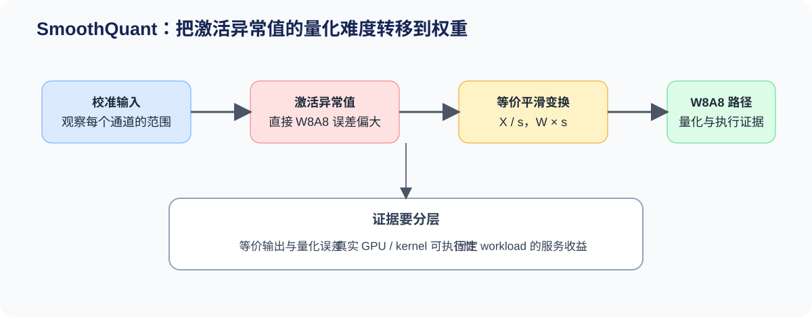
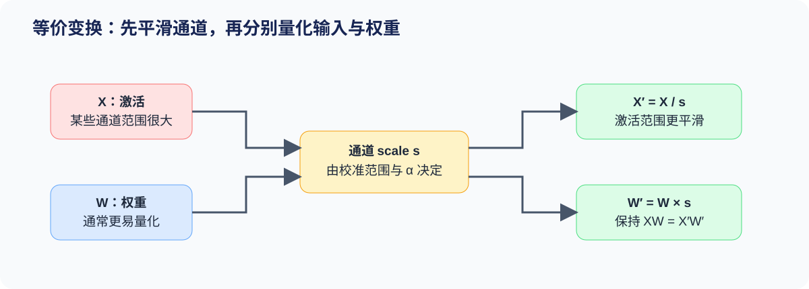

# 53. Activation Quantization and SmoothQuant | 激活量化与 SmoothQuant

**难度：** Hard　**环境：** CPU-first，GPU 可选　**标签：** `量化`, `激活`, `SmoothQuant`

> 🚀 **云端运行环境**
>
> 本章节的实战代码可以点击以下链接在免费 GPU 算力平台上直接运行：
>
> [](https://colab.research.google.com/github/datawhalechina/llm-algo-leetcode/blob/main/02_PyTorch_Algorithms/53_Activation_Quantization_and_SmoothQuant.ipynb)
> [](https://modelscope.cn/my/mynotebook) *(国内推荐：魔搭社区免费实例)*


## 本节导读

W8A8 同时压缩权重和激活，但两者的数值分布并不对称：权重通常较平稳，激活却可能在少数通道出现远大于其他通道的异常值。SmoothQuant 通过保持线性层输出不变的通道变换，把部分量化难度从激活迁移到权重。本节依次分析异常通道、等价平滑和 `alpha` 选择，并用真实模型状态检查确认校准对象是否可获取。
## 前置阅读

**导语：** 先理解量化值、scale 与反量化，再进入“为什么激活比权重更难量化”的问题。

- [52 量化校准与误差控制](./52_Quantization_Calibration_and_Error.md)
- [25 W8A16 量化](./25_Quantization_W8A16.md)
- [40 GPTQ / AWQ 权重量化](./40_GPTQ_and_AWQ_Weight_Quantization.md)
### Step 1：识别阻塞 W8A8 的激活异常通道

在线性层 `Y = XWᵀ` 中，`X` 的最后一维和 `W` 的输入维表示同一组通道。若少数激活通道的绝对值范围远大于其余通道，per-tensor 激活 scale 必须覆盖这些异常值，普通通道可用的整数码点随之减少。判断是否需要 SmoothQuant，应先比较逐通道范围，而不是只看整个张量的最大值。

| 观察对象 | 需要记录的统计量 | 对 W8A8 的影响 |
|---|---|---|
| 激活通道 | 校准样本上的 `absmax`、异常值比率 | 决定激活量化的动态范围 |
| 权重输入通道 | 每个输入通道的 `absmax` | 决定可承接多少范围压力 |
| 线性层输出 | 浮点输出与量化输出误差 | 判断范围迁移是否真正有效 |


### Step 2：用等价变换迁移量化难度

对每个输入通道选择正数 `s`，令 `X′ = X / s`、`W′ = W × s`，则 `XWᵀ = X′W′ᵀ`。激活异常通道被压低的同时，对应权重通道会被放大；SmoothQuant 并未消除范围，而是在两个更容易共同量化的张量之间重新分配范围。

常用 scale 形式为 `s = act_max^alpha / weight_max^(1-alpha)`。`alpha` 越大，越优先压低激活范围，也越可能放大权重范围；因此它必须通过校准候选比较确定。

| `alpha` 位置 | 激活侧变化 | 权重侧变化 | 校准时重点观察 |
|---|---|---|---|
| 接近 0 | 平滑较弱 | 权重放大较少 | 激活误差是否仍由异常值主导 |
| 中间区域 | 两侧共同承担范围 | 两侧共同变化 | 端到端输出误差是否最低 |
| 接近 1 | 激活压缩更强 | 权重放大更明显 | 权重量化误差是否反超 |


### Step 3：从误差迁移判断 W8A8 是否成立

SmoothQuant 候选需要连续通过三项检查：平滑前后的浮点输出保持等价；平滑后的 W8A8 输出误差低于未平滑基线或满足质量阈值；目标硬件实际命中低精度执行路径。前两项可以在 CPU 上验证，第三项需要 GPU 或 backend 证据。

| 证据 | 判断问题 | 失败时的处理 |
|---|---|---|
| 浮点等价误差 | 通道变换是否正确 | 修正广播维度或 scale 方向 |
| 激活/权重恢复误差 | 误差是否只是从一侧转移到另一侧 | 调整 `alpha` 或量化粒度 |
| 输出误差 | 当前候选是否通过质量门槛 | 保留浮点或换用更高精度路径 |
| GPU/backend 结果 | 是否命中 W8A8 kernel 并带来收益 | 检查 loader、kernel 与硬件支持 |
### Step 4：实现通道平滑与 `alpha` 校准

题目区保留三个机制决策：由逐通道范围计算 scale、执行保持线性层等价的范围迁移、在候选集合中选择输出误差最低的 `alpha`。量化与反量化由骨架提供，让练习集中在 SmoothQuant 本身。

| TODO | 机制责任 | 关键测试 |
|---|---|---|
| TODO 1 | 从激活与权重的逐通道范围生成正 scale | shape、有限值、异常通道响应 |
| TODO 2 | 在同一输入通道上完成 `X/s` 与 `W×s` | 浮点输出等价 |
| TODO 3 | 比较候选 `alpha` 的 W8A8 输出误差 | 最优候选、非法候选与误差记录 |

```python
import torch
```


```python
# 题目区：补全范围迁移与 alpha 校准；量化、反量化和结果记录由骨架提供。
class SmoothQuantSimulator:
    """在输入通道上执行 SmoothQuant 等价平滑与教学 W8A8 对照。

    `activations` 的最后一维与 `weight` 的输入维相同；`weight` 形状为
    `[out_features, in_features]`。本实现比较机制误差，不代表生产 W8A8 kernel。
    """

    def __init__(self, qmax: int = 127, eps: float = 1e-8):
        self.qmax = qmax
        self.eps = eps

    def channel_scale(self, activations: torch.Tensor, weight: torch.Tensor, alpha: float):
        """根据校准激活与权重的逐输入通道范围计算平滑 scale。"""
        if activations.shape[-1] != weight.shape[-1]:
            raise ValueError('activations and weight must share the input-channel dimension.')
        if not 0.0 <= alpha <= 1.0:
            raise ValueError('alpha must be in [0, 1].')

        # TODO 1（通道范围）：分别沿样本维和输出维统计输入通道 absmax，
        # 再计算 s = act_max**alpha / weight_max**(1-alpha)。
        # act_max = ???
        # weight_max = ???
        # scale = ???
        return scale

    def smooth(self, activations: torch.Tensor, weight: torch.Tensor, alpha: float):
        """返回 X/s、W*s 和 s；变换前后的浮点线性层输出应保持一致。"""
        scale = self.channel_scale(activations, weight, alpha)

        # TODO 2（等价迁移）：激活除以逐通道 scale，权重在输入通道维乘以同一 scale。
        # smooth_activations = ???
        # smooth_weight = ???
        return smooth_activations, smooth_weight, scale

    def _quantize_dequantize_per_tensor(self, tensor: torch.Tensor):
        """执行对称 per-tensor INT8 量化并立即恢复为浮点张量。"""
        absmax = tensor.detach().float().abs().max().clamp_min(self.eps)
        quant_scale = self.qmax / absmax
        quantized = torch.clamp(
            torch.round(tensor.float() * quant_scale), -self.qmax, self.qmax
        ).to(torch.int8)
        return quantized.float() / quant_scale

    def compare(self, activations: torch.Tensor, weight: torch.Tensor, alpha: float):
        """返回一个 alpha 对应的浮点等价误差和教学 W8A8 输出误差。"""
        smooth_x, smooth_w, channel_scale = self.smooth(activations, weight, alpha)
        reference = activations.float() @ weight.float().t()
        smooth_float = smooth_x.float() @ smooth_w.float().t()
        restored_x = self._quantize_dequantize_per_tensor(smooth_x)
        restored_w = self._quantize_dequantize_per_tensor(smooth_w)
        quantized_output = restored_x @ restored_w.t()
        return {
            'alpha': float(alpha),
            'channel_scale': channel_scale,
            'reference': reference,
            'smooth_float': smooth_float,
            'quantized_output': quantized_output,
            'equivalence_mse': float(torch.mean((reference - smooth_float) ** 2)),
            'quantized_mse': float(torch.mean((reference - quantized_output) ** 2)),
            'activation_absmax': float(smooth_x.abs().max()),
            'weight_absmax': float(smooth_w.abs().max()),
        }

    def select_alpha(self, activations: torch.Tensor, weight: torch.Tensor, candidates):
        """比较候选 alpha，并返回 W8A8 输出误差最低的结果及全部校准记录。"""
        candidates = list(candidates)
        if not candidates:
            raise ValueError('candidates must not be empty.')

        # TODO 3（校准选择）：逐个调用 compare，并按 quantized_mse 选择最佳候选。
        # records = ???
        # best = ???
        return {'best': best, 'records': records}

```

### 测试

测试不评价某个 `alpha` 是否对所有模型最佳，只验证通道 scale、等价变换和量化恢复的机制契约。

```python
# 机制测试：覆盖逐通道范围、等价迁移、异常值响应和 alpha 校准。
def make_smoothquant_fixture():
    """构造包含显著激活异常通道的固定校准样本。"""
    activations = torch.tensor([
        [1.0, 120.0, 0.5, -1.0],
        [2.0, -90.0, -0.5, 0.5],
        [-1.0, 80.0, 1.5, 2.0],
    ])
    weight = torch.tensor([
        [1.0, 0.25, -2.0, 0.5],
        [-0.5, 0.50, 1.0, -1.5],
    ])
    return activations, weight


def test_channel_scale_contract_and_outlier_response():
    """每个输入通道应有正 scale，异常激活通道应获得更强平滑。"""
    activations, weight = make_smoothquant_fixture()
    scale = SmoothQuantSimulator().channel_scale(activations, weight, alpha=0.5)
    assert scale.shape == (activations.shape[-1],)
    assert torch.isfinite(scale).all() and torch.all(scale > 0)
    assert scale[1] > scale[0]


def test_smoothing_preserves_float_product():
    """XWᵀ 与 (X/s)(W*s)ᵀ 在浮点路径上应等价。"""
    torch.manual_seed(0)
    activations, weight = torch.randn(2, 3, 6), torch.randn(4, 6)
    result = SmoothQuantSimulator().compare(activations, weight, alpha=0.6)
    assert result['equivalence_mse'] < 1e-10


def test_smoothing_reduces_activation_peak_for_outlier_fixture():
    """较大的 alpha 应压低固定样本的激活峰值，同时允许权重范围上升。"""
    activations, weight = make_smoothquant_fixture()
    sim = SmoothQuantSimulator()
    weak = sim.compare(activations, weight, alpha=0.0)
    strong = sim.compare(activations, weight, alpha=0.8)
    assert strong['activation_absmax'] < weak['activation_absmax']
    assert strong['weight_absmax'] > weak['weight_absmax']


def test_alpha_selection_returns_lowest_error_candidate():
    """最佳候选必须来自给定集合，并具有集合中的最低 W8A8 输出误差。"""
    activations, weight = make_smoothquant_fixture()
    selection = SmoothQuantSimulator().select_alpha(activations, weight, [0.0, 0.5, 0.8])
    errors = [record['quantized_mse'] for record in selection['records']]
    assert selection['best']['alpha'] in {0.0, 0.5, 0.8}
    assert selection['best']['quantized_mse'] == min(errors)


def test_invalid_alpha_candidates_are_rejected():
    """空候选集合和越界 alpha 都应给出明确错误。"""
    activations, weight = make_smoothquant_fixture()
    sim = SmoothQuantSimulator()
    try:
        sim.select_alpha(activations, weight, [])
        raise AssertionError('empty candidates should fail')
    except ValueError:
        pass
    try:
        sim.channel_scale(activations, weight, alpha=1.1)
        raise AssertionError('alpha outside [0, 1] should fail')
    except ValueError:
        pass


def run_smoothquant_tests():
    """汇总 SmoothQuant 的五项机制测试。"""
    tests = (
        test_channel_scale_contract_and_outlier_response,
        test_smoothing_preserves_float_product,
        test_smoothing_reduces_activation_peak_for_outlier_fixture,
        test_alpha_selection_returns_lowest_error_candidate,
        test_invalid_alpha_candidates_are_rejected,
    )
    for test in tests:
        test()
    print('✅ SmoothQuant 机制测试通过：范围统计、等价迁移、误差转移与 alpha 选择均已验证。')


run_smoothquant_tests()

```

## 参考代码与解析

### 代码

```python
# 题目区：补全范围迁移与 alpha 校准；量化、反量化和结果记录由骨架提供。
class SmoothQuantSimulator:
    """在输入通道上执行 SmoothQuant 等价平滑与教学 W8A8 对照。

    `activations` 的最后一维与 `weight` 的输入维相同；`weight` 形状为
    `[out_features, in_features]`。本实现比较机制误差，不代表生产 W8A8 kernel。
    """

    def __init__(self, qmax: int = 127, eps: float = 1e-8):
        self.qmax = qmax
        self.eps = eps

    def channel_scale(self, activations: torch.Tensor, weight: torch.Tensor, alpha: float):
        """根据校准激活与权重的逐输入通道范围计算平滑 scale。"""
        if activations.shape[-1] != weight.shape[-1]:
            raise ValueError('activations and weight must share the input-channel dimension.')
        if not 0.0 <= alpha <= 1.0:
            raise ValueError('alpha must be in [0, 1].')

        # TODO 1（通道范围）：分别沿样本维和输出维统计输入通道 absmax，
        # 再计算 s = act_max**alpha / weight_max**(1-alpha)。
        act_max = activations.detach().float().abs().reshape(-1, activations.shape[-1]).amax(dim=0).clamp_min(self.eps)
        weight_max = weight.detach().float().abs().amax(dim=0).clamp_min(self.eps)
        scale = (act_max.pow(alpha) / weight_max.pow(1.0 - alpha)).clamp_min(self.eps)
        return scale

    def smooth(self, activations: torch.Tensor, weight: torch.Tensor, alpha: float):
        """返回 X/s、W*s 和 s；变换前后的浮点线性层输出应保持一致。"""
        scale = self.channel_scale(activations, weight, alpha)

        # TODO 2（等价迁移）：激活除以逐通道 scale，权重在输入通道维乘以同一 scale。
        smooth_activations = activations.float() / scale
        smooth_weight = weight.float() * scale.unsqueeze(0)
        return smooth_activations, smooth_weight, scale

    def _quantize_dequantize_per_tensor(self, tensor: torch.Tensor):
        """执行对称 per-tensor INT8 量化并立即恢复为浮点张量。"""
        absmax = tensor.detach().float().abs().max().clamp_min(self.eps)
        quant_scale = self.qmax / absmax
        quantized = torch.clamp(
            torch.round(tensor.float() * quant_scale), -self.qmax, self.qmax
        ).to(torch.int8)
        return quantized.float() / quant_scale

    def compare(self, activations: torch.Tensor, weight: torch.Tensor, alpha: float):
        """返回一个 alpha 对应的浮点等价误差和教学 W8A8 输出误差。"""
        smooth_x, smooth_w, channel_scale = self.smooth(activations, weight, alpha)
        reference = activations.float() @ weight.float().t()
        smooth_float = smooth_x.float() @ smooth_w.float().t()
        restored_x = self._quantize_dequantize_per_tensor(smooth_x)
        restored_w = self._quantize_dequantize_per_tensor(smooth_w)
        quantized_output = restored_x @ restored_w.t()
        return {
            'alpha': float(alpha),
            'channel_scale': channel_scale,
            'reference': reference,
            'smooth_float': smooth_float,
            'quantized_output': quantized_output,
            'equivalence_mse': float(torch.mean((reference - smooth_float) ** 2)),
            'quantized_mse': float(torch.mean((reference - quantized_output) ** 2)),
            'activation_absmax': float(smooth_x.abs().max()),
            'weight_absmax': float(smooth_w.abs().max()),
        }

    def select_alpha(self, activations: torch.Tensor, weight: torch.Tensor, candidates):
        """比较候选 alpha，并返回 W8A8 输出误差最低的结果及全部校准记录。"""
        candidates = list(candidates)
        if not candidates:
            raise ValueError('candidates must not be empty.')

        # TODO 3（校准选择）：逐个调用 compare，并按 quantized_mse 选择最佳候选。
        records = [self.compare(activations, weight, alpha) for alpha in candidates]
        best = min(records, key=lambda record: record['quantized_mse'])
        return {'best': best, 'records': records}

```

### 解析

**TODO 1：逐通道范围。** 校准激活需要先把除最后一维以外的维度展平，再沿样本维取 `absmax`；权重沿输出维取 `absmax`。这样得到的两个向量都对应输入通道，才能计算平滑 scale。

**TODO 2：等价迁移。** 对激活除以 `s`、对权重输入通道乘以同一个 `s`，不会改变浮点线性层输出。测试先验证这一不变量，避免把广播错误误判成量化误差。

**TODO 3：`alpha` 校准。** 不直接填写某个固定值，而是保留每个候选的激活峰值、权重峰值和 W8A8 输出误差，再选择当前校准 workload 下误差最低的候选。最终部署仍需独立质量集和真实 backend 复测。
### Step 5：可选 GPU 实验——用 LLM Compressor 验证 SmoothQuant

#### 5.1 环境、校准集与三路候选

实验固定模型、校准文本和生成 prompt，对比 BF16、直接 W8A8 与 SmoothQuant + W8A8。直接 W8A8 暴露激活异常值带来的困难；加入 SmoothQuant 后，可以判断范围迁移是否改善同一量化方案的输出稳定性。默认使用 `dry_run`，不下载模型。

| 路径 | 成熟库 recipe | 本节观察 |
|---|---|---|
| BF16 | Transformers 浮点模型 | 输出与运行资源基线 |
| W8A8 | `GPTQModifier(scheme="W8A8")` | 不平滑时的低精度结果 |
| SmoothQuant W8A8 | `SmoothQuantModifier` + `GPTQModifier` | 范围迁移后的结果与 artifact |


```python
# 5.1 只定义模型、校准 workload 与候选 recipe；默认不下载模型、不占用 GPU。
from pathlib import Path

RUN_MODE = "dry_run"  # dry_run / real_gpu
MODEL_ID = "Qwen/Qwen2.5-0.5B-Instruct"  # 单卡可完成的小模型
EVAL_PROMPT = "Explain why activation outliers make W8A8 quantization difficult."
CALIBRATION_TEXTS = [
    "Activation outliers can dominate a shared quantization scale.",
    "Per-channel ranges reveal which hidden dimensions are unusually large.",
    "SmoothQuant moves part of the activation range into the weights.",
    "Calibration data and evaluation data must remain separate.",
    "W8A8 quantizes both linear weights and runtime activations.",
    "A compressed artifact still needs a compatible inference backend.",
    "Quantization error must be checked together with task quality.",
    "The same workload is required for a fair candidate comparison.",
]
MAX_SEQ_LENGTH = 256
MAX_NEW_TOKENS = 32
SMOOTHING_STRENGTH = 0.8  # SmoothQuant 的 alpha，控制范围迁移强度
SEED = 42
ARTIFACT_ROOT = Path("benchmarks/artifacts/53_smoothquant")
OUTPUT_PATH = Path("benchmarks/results/53_llmcompressor_smoothquant_comparison.json")

```

#### 5.2 执行 BF16 / W8A8 / SmoothQuant W8A8

两条低精度路径分别从同一浮点 checkpoint 加载，并使用同一批校准文本。实验保存压缩 artifact、校准耗时、峰值显存和固定 prompt 输出；真实 serving kernel 的吞吐与延迟仍需在 artifact 通过质量门槛后复测。


```python
# 5.2 使用 LLM Compressor 执行真实校准与压缩，而不是只采集激活 hook。
import importlib.metadata
import json
import platform
import time

import torch


def package_version(name):
    """读取依赖版本；依赖缺失时返回 None 并保留在失败证据中。"""
    try:
        return importlib.metadata.version(name)
    except importlib.metadata.PackageNotFoundError:
        return None


def directory_bytes(path):
    """统计压缩 artifact 的文件总量。"""
    return sum(item.stat().st_size for item in path.rglob("*") if item.is_file())


def token_prefix_agreement(reference, candidate):
    """计算固定 greedy 输出从起点开始保持一致的 token 比例。"""
    width = max(1, min(len(reference), len(candidate)))
    matched = 0
    for left, right in zip(reference, candidate):
        if left != right:
            break
        matched += 1
    return matched / width


result = {
    "schema_version": "quantization-mechanism-gpu/v2",
    "chapter": "53",
    "run_mode": RUN_MODE,
    "framework": {
        "python": platform.python_version(),
        "torch": torch.__version__,
        "transformers": package_version("transformers"),
        "llmcompressor": package_version("llmcompressor"),
        "compressed_tensors": package_version("compressed-tensors"),
        "datasets": package_version("datasets"),
    },
    "hardware": {
        "cuda_available": torch.cuda.is_available(),
        "cuda": torch.version.cuda,
        "device": torch.cuda.get_device_name(0) if torch.cuda.is_available() else None,
    },
    "workload": {
        "model_id": MODEL_ID,
        "calibration_samples": len(CALIBRATION_TEXTS),
        "max_seq_length": MAX_SEQ_LENGTH,
        "eval_prompt": EVAL_PROMPT,
        "max_new_tokens": MAX_NEW_TOKENS,
        "seed": SEED,
    },
    "baseline": {"name": "bf16"},
    "candidates": {
        "w8a8": {"recipe": "GPTQModifier(W8A8)"},
        "smoothquant_w8a8": {
            "recipe": "SmoothQuantModifier + GPTQModifier(W8A8)",
            "smoothing_strength": SMOOTHING_STRENGTH,
        },
    },
    "mechanism_metrics": None,
    "failure": None,
    "evidence_level": "environment_preflight",
    "decision": "ready_to_measure",
}

if RUN_MODE == "real_gpu":
    try:
        if not torch.cuda.is_available():
            raise RuntimeError("RUN_MODE=real_gpu 但 CUDA 不可用")

        from compressed_tensors.offload import dispatch_model
        from datasets import Dataset
        from llmcompressor import oneshot
        from llmcompressor.modifiers.gptq import GPTQModifier
        from llmcompressor.modifiers.transform.smoothquant import SmoothQuantModifier
        from transformers import AutoModelForCausalLM, AutoTokenizer

        torch.manual_seed(SEED)
        tokenizer = AutoTokenizer.from_pretrained(MODEL_ID, use_fast=True)
        eval_inputs = tokenizer(EVAL_PROMPT, return_tensors="pt")
        calibration = Dataset.from_dict({"text": CALIBRATION_TEXTS})
        calibration = calibration.map(
            lambda row: tokenizer(
                row["text"],
                padding=False,
                truncation=True,
                max_length=MAX_SEQ_LENGTH,
                add_special_tokens=False,
            ),
            remove_columns=["text"],
        )

        def load_model():
            """每条候选从相同 checkpoint 独立加载，避免 recipe 状态串扰。"""
            return AutoModelForCausalLM.from_pretrained(
                MODEL_ID,
                torch_dtype=torch.bfloat16,
                device_map="auto",
            ).eval()

        def generate_tokens(model):
            """对固定 prompt 执行 greedy 生成并记录同步延迟。"""
            dispatch_model(model)
            device = next(model.parameters()).device
            inputs = {key: value.to(device) for key, value in eval_inputs.items()}
            torch.cuda.synchronize()
            started = time.perf_counter()
            with torch.inference_mode():
                output = model.generate(
                    **inputs,
                    max_new_tokens=MAX_NEW_TOKENS,
                    do_sample=False,
                    pad_token_id=tokenizer.eos_token_id,
                )
            torch.cuda.synchronize()
            tokens = output[0, inputs["input_ids"].shape[1]:].detach().cpu().tolist()
            return tokens, (time.perf_counter() - started) * 1000.0

        torch.cuda.reset_peak_memory_stats()
        baseline_model = load_model()
        baseline_tokens, baseline_latency = generate_tokens(baseline_model)
        result["baseline"].update({
            "generation_latency_ms": baseline_latency,
            "peak_allocated_bytes": int(torch.cuda.max_memory_allocated()),
            "generated_tokens": len(baseline_tokens),
        })
        del baseline_model
        torch.cuda.empty_cache()

        candidate_specs = {
            "w8a8": [GPTQModifier(targets="Linear", scheme="W8A8", ignore=["lm_head"])],
            "smoothquant_w8a8": [
                SmoothQuantModifier(smoothing_strength=SMOOTHING_STRENGTH),
                GPTQModifier(targets="Linear", scheme="W8A8", ignore=["lm_head"]),
            ],
        }
        candidate_metrics = {}
        for name, recipe in candidate_specs.items():
            artifact_dir = ARTIFACT_ROOT / name
            if artifact_dir.exists():
                raise FileExistsError(
                    f"artifact 目录已存在：{artifact_dir}；请修改 ARTIFACT_ROOT 后复测"
                )
            torch.cuda.reset_peak_memory_stats()
            model = load_model()
            started = time.perf_counter()
            oneshot(
                model=model,
                tokenizer=tokenizer,
                dataset=calibration,
                recipe=recipe,
                num_calibration_samples=len(calibration),
                max_seq_length=MAX_SEQ_LENGTH,
                output_dir=str(artifact_dir),
                clear_sparse_session=True,
            )
            calibration_seconds = time.perf_counter() - started
            tokens, generation_latency = generate_tokens(model)
            candidate_metrics[name] = {
                "calibration_seconds": calibration_seconds,
                "generation_latency_ms": generation_latency,
                "peak_allocated_bytes": int(torch.cuda.max_memory_allocated()),
                "artifact_path": str(artifact_dir),
                "artifact_bytes": directory_bytes(artifact_dir),
                "generated_tokens": len(tokens),
                "greedy_prefix_agreement": token_prefix_agreement(baseline_tokens, tokens),
            }
            del model
            torch.cuda.empty_cache()

        smooth_gain = (
            candidate_metrics["smoothquant_w8a8"]["greedy_prefix_agreement"]
            - candidate_metrics["w8a8"]["greedy_prefix_agreement"]
        )
        result.update({
            "candidates": candidate_metrics,
            "mechanism_metrics": {"smoothquant_prefix_agreement_gain": smooth_gain},
            "evidence_level": "matched_llmcompressor_w8a8_artifact_experiment",
            "decision": "accept" if candidate_metrics["smoothquant_w8a8"]["greedy_prefix_agreement"] >= 0.8 else "tune",
        })
    except Exception as exc:
        result.update({
            "failure": {"type": type(exc).__name__, "message": str(exc)},
            "evidence_level": "failed_real_gpu_attempt",
            "decision": "reject_until_environment_fixed",
        })

OUTPUT_PATH.parent.mkdir(parents=True, exist_ok=True)
OUTPUT_PATH.write_text(json.dumps(result, ensure_ascii=False, indent=2), encoding="utf-8")
print(json.dumps(result, ensure_ascii=False, indent=2))

```

#### 5.3 读取三路实验结果

读取单元只展示环境、校准 workload、候选 artifact 与机制指标，不重新加载模型。


```python
# 5.3 只读取 5.2 保存的 JSON，便于在 CPU 环境复核证据。
if OUTPUT_PATH.exists():
    saved = json.loads(OUTPUT_PATH.read_text(encoding="utf-8"))
    keys = (
        "framework",
        "hardware",
        "workload",
        "baseline",
        "candidates",
        "mechanism_metrics",
        "failure",
        "evidence_level",
        "decision",
    )
    print({key: saved.get(key) for key in keys})
else:
    print(f"等待三路实验结果：{OUTPUT_PATH}")

```

#### 5.4 解释范围迁移、artifact 与质量代理

先比较两条 W8A8 路径的 greedy 前缀一致率，再检查 artifact、校准成本和失败记录。这里验证的是 SmoothQuant 对 W8A8 校准结果的影响；真实 kernel 吞吐需要把通过质量门槛的 artifact 交给兼容 backend 复测。

| 观察项 | 读取字段 | 判断问题 |
|---|---|---|
| 范围迁移收益 | `smoothquant_prefix_agreement_gain` | SmoothQuant 是否改善同一 W8A8 方案的输出稳定性 |
| 校准代价 | `calibration_seconds`、`peak_allocated_bytes` | 候选 artifact 的生成成本是否可接受 |
| 产物契约 | `artifact_path`、`artifact_bytes` | 是否产生可交给 loader/backend 的压缩产物 |
| 证据可信度 | `failure`、`evidence_level` | 是否真实执行 LLM Compressor recipe |
| 下一步 | `decision` | accept / tune / reject_until_environment_fixed |

## 相关阅读

- [SmoothQuant 原论文](https://arxiv.org/abs/2211.10438)
- [LLM Compressor：oneshot 入口](https://docs.vllm.ai/projects/llm-compressor/en/latest/guides/entrypoints/oneshot/)
- [LLM Compressor：W8A8 SmoothQuant 示例](https://github.com/vllm-project/llm-compressor/tree/main/examples/quantization_w8a8_int8)
- [SmoothQuant 开源实现](https://github.com/mit-han-lab/smoothquant)
