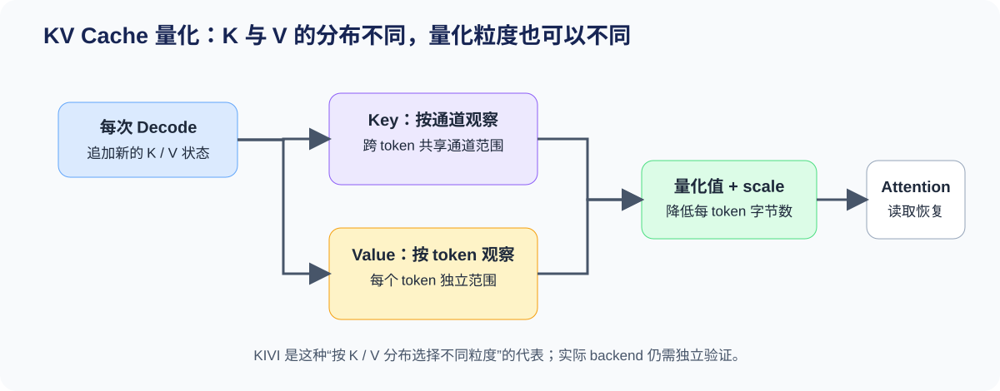
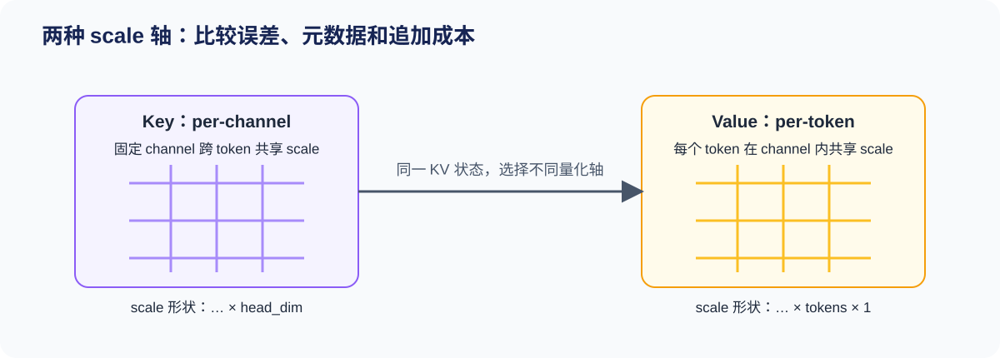

# 54. KV Cache Quantization Strategies | KV Cache 量化策略

**难度：** Hard　**环境：** CPU-first，GPU 可选　**标签：** `量化`, `KV Cache`, `KIVI`

> 🚀 **云端运行环境**
>
> 本章节的实战代码可以点击以下链接在免费 GPU 算力平台上直接运行：
>
> [](https://colab.research.google.com/github/datawhalechina/llm-algo-leetcode/blob/main/02_PyTorch_Algorithms/54_KV_Cache_Quantization_Strategies.ipynb)
> [](https://modelscope.cn/my/mynotebook) *(国内推荐：魔搭社区免费实例)*


## 本节导读

长上下文与高并发会让 KV Cache 成为推理显存和带宽的持续成本。K 和 V 虽然一起参与 Attention，却不必共享同一种量化轴。以 KIVI 为代表的方法从二者的分布差异出发，分别选择更合适的 scale 粒度。本节把“状态追加—量化轴—恢复误差—容量证据”连接起来。
## 前置阅读

**导语：** 先了解 KV Cache 为什么随请求增长，再区分分页管理与量化：前者决定状态如何分配和复用，后者改变每个状态的表示与字节数。

- [52. 量化校准与误差控制](./52_Quantization_Calibration_and_Error.md)
- [Part 01 · 11 KV Cache 与显存增长](../01_Hardware_Math_and_Systems/11_KV_Cache_and_Memory_Growth.md)
- [22. vLLM PagedAttention](./22_vLLM_PagedAttention.md)

### Step 1：为什么 K 和 V 可以采用不同量化策略

每个 Decode 步都会追加新的 Key 和 Value，并在后续 Attention 中被反复读取。若统一采用一种全局 scale，既可能放大量化误差，也可能忽略 K 与 V 的不同分布。KIVI 的核心启发是：先按状态角色观察范围，再选择量化轴。

| 状态 | 在 Attention 中的作用 | 量化时关注 | 典型收益 |
|---|---|---|---|
| Key | 参与与 query 的匹配 | 通道范围、历史 token 的聚合 | 更低缓存容量与读取带宽 |
| Value | 参与加权汇聚 | 每个 token 的局部范围 | 更稳定的恢复误差 |
| 分页 / 前缀复用 | 管理状态的分配与复用 | 页、前缀与驻留策略 | 与量化互补，不改变位宽 |


### Step 2：两种量化轴如何决定 scale 形状

本节采用 `[batch, heads, tokens, head_dim]` 的教学形状。Key per-channel 在 token 维聚合范围，得到每个 channel 的 scale；Value per-token 在 head_dim 聚合范围，得到每个 token 的 scale。两者都要求 scale 能与量化张量正确广播。

| 方案 | 归约维度 | scale 形状 | 适合回答的问题 |
|---|---|---|---|
| Key per-channel | token 维 | `[..., 1, head_dim]` | 历史 token 上同一 channel 如何共享范围 |
| Value per-token | head_dim | `[..., tokens, 1]` | 一个 token 内各 channel 如何共享范围 |
| 单一分组策略 | 固定大小局部组 | 依 group 而定 | 实现简单，但未必适配 K/V 分布 |


### Step 3：追加状态、residual window 与 Decode 成本

KV Cache 在每个 Decode 步追加新 token。KIVI 类策略不会要求所有状态在同一时刻以同一形式保存：较新的 token 暂留在高精度 residual window 中，窗口溢出后，较旧状态再按 Key / Value 各自的轴进入量化区。这样避免每追加一个 token 就重写整段缓存，但 Decode 仍要承担 scale 元数据读取、量化前缀恢复或量化 kernel 的执行成本。

| 状态或成本 | 更新方式 | 需要记录的证据 |
|---|---|---|
| 量化前缀 | 窗口溢出时批量进入低比特区 | token 数、数据字节、scale 元数据字节 |
| 高精度窗口 | 每步追加最新 K/V | `residual_length`、溢出频率 |
| Attention 读取 | 读取量化前缀与高精度窗口 | 是否融合反量化、每步读取字节 |
| Decode 代价 | 量化、恢复与 kernel 调度 | TPOT、吞吐、峰值显存和质量 |

容量收益必须与 TPOT 一起判断：更小的状态可以提升并发，但若每步恢复开销过高，单请求 Decode 反而可能变慢。
### Step 4：实现 K/V 异轴量化与追加状态

题目区实现三项机制：Key 沿 token 维建立 channel scale，Value 沿 head dim 建立 token scale；新状态追加后，再按 `residual_length` 把旧前缀送入量化区，把最新 token 留在高精度窗口。恢复与字节账本由骨架提供，测试重点检查轴、窗口边界和追加后的状态守恒。

| TODO | 机制责任 | 关键测试 |
|---|---|---|
| TODO 1 | Key per-channel 的 scale 与 INT8 状态 | scale 为 `[..., 1, head_dim]` |
| TODO 2 | Value per-token 的 scale 与 INT8 状态 | scale 为 `[..., tokens, 1]` |
| TODO 3 | 追加 K/V 并划分量化前缀与高精度窗口 | token 总数守恒、溢出边界、尾部长度 |


```python
import torch
```


```python
# 题目区：实现 K/V 异轴量化，并维护追加状态的 residual window。
class KVQuantizationStrategies:
    """教学化模拟 KIVI 的量化轴与追加状态。

    输入形状为 [batch, heads, tokens, head_dim]。Key 沿 token 维聚合范围，
    Value 沿 head_dim 聚合范围；最新 token 保留在高精度 residual window 中。
    """

    def __init__(self, qmax: int = 127, eps: float = 1e-8):
        self.qmax = qmax
        self.eps = eps

    def _quantize(self, x: torch.Tensor, scale: torch.Tensor):
        return torch.clamp(torch.round(x.float() * scale), -self.qmax, self.qmax).to(torch.int8)

    def restore(self, quantized: torch.Tensor, scale: torch.Tensor):
        """用与量化轴兼容的 scale 恢复浮点近似值。"""
        return quantized.to(scale.dtype) / scale.clamp_min(self.eps)

    def quantize_key_per_channel(self, key: torch.Tensor):
        """沿 token 维估计每个 channel 的范围，得到 [..., 1, head_dim] scale。"""
        if key.ndim != 4:
            raise ValueError("key must have shape [batch, heads, tokens, head_dim].")
        # TODO 1（Key 量化轴）：沿 token 维取 absmax，并生成可广播 scale 与 INT8 Key。
        # key_absmax = ???
        # key_scale = ???
        # key_q = ???
        return key_q, key_scale

    def quantize_value_per_token(self, value: torch.Tensor):
        """沿 head_dim 聚合每个 token 的范围，得到 [..., tokens, 1] scale。"""
        if value.ndim != 4:
            raise ValueError("value must have shape [batch, heads, tokens, head_dim].")
        # TODO 2（Value 量化轴）：沿 head_dim 取 absmax，并生成可广播 scale 与 INT8 Value。
        # value_absmax = ???
        # value_scale = ???
        # value_q = ???
        return value_q, value_scale

    def append_and_partition(self, key_cache: torch.Tensor, value_cache: torch.Tensor,
                             new_key: torch.Tensor, new_value: torch.Tensor,
                             residual_length: int):
        """追加新状态，并把旧前缀与最新高精度窗口分开。"""
        if residual_length <= 0:
            raise ValueError("residual_length must be positive")
        if key_cache.shape[:-2] != new_key.shape[:-2] or key_cache.shape[-1] != new_key.shape[-1]:
            raise ValueError("key cache and new key must share batch, heads and head_dim")
        if value_cache.shape[:-2] != new_value.shape[:-2] or value_cache.shape[-1] != new_value.shape[-1]:
            raise ValueError("value cache and new value must share batch, heads and head_dim")

        # TODO 3（追加状态）：沿 token 维追加，并计算应进入量化前缀的 token 数。
        # key_all = ???
        # value_all = ???
        # quantized_tokens = ???

        key_prefix, key_residual = key_all[..., :quantized_tokens, :], key_all[..., quantized_tokens:, :]
        value_prefix, value_residual = value_all[..., :quantized_tokens, :], value_all[..., quantized_tokens:, :]

        if quantized_tokens:
            key_q, key_scale = self.quantize_key_per_channel(key_prefix)
            value_q, value_scale = self.quantize_value_per_token(value_prefix)
        else:
            key_q = torch.empty_like(key_prefix, dtype=torch.int8)
            value_q = torch.empty_like(value_prefix, dtype=torch.int8)
            key_scale = torch.empty(key_prefix.shape[:-2] + (1, key_prefix.shape[-1]), device=key_all.device)
            value_scale = torch.empty(value_prefix.shape[:-1] + (1,), device=value_all.device)

        return {
            "key_q": key_q,
            "key_scale": key_scale,
            "value_q": value_q,
            "value_scale": value_scale,
            "key_residual": key_residual,
            "value_residual": value_residual,
            "total_tokens": key_all.shape[-2],
            "quantized_tokens": quantized_tokens,
        }

    def compare(self, key: torch.Tensor, value: torch.Tensor):
        """返回两种量化状态的 shape、字节与恢复误差。"""
        key_q, key_scale = self.quantize_key_per_channel(key)
        value_q, value_scale = self.quantize_value_per_token(value)
        key_restored = self.restore(key_q, key_scale)
        value_restored = self.restore(value_q, value_scale)
        return {
            "key_scale_shape": tuple(key_scale.shape),
            "value_scale_shape": tuple(value_scale.shape),
            "key_mse": torch.mean((key.float() - key_restored) ** 2),
            "value_mse": torch.mean((value.float() - value_restored) ** 2),
            "raw_bytes": key.numel() * key.element_size() + value.numel() * value.element_size(),
            "quantized_bytes": (key_q.numel() * key_q.element_size()
                                + value_q.numel() * value_q.element_size()
                                + key_scale.numel() * key_scale.element_size()
                                + value_scale.numel() * value_scale.element_size()),
        }

```

### 测试

测试分别验证 K/V 量化轴、追加后的 token 守恒、residual window 边界和字节账本。


```python
# 机制测试：K/V 量化轴、追加状态、residual window 与容量账本。
def test_key_per_channel_scale_shape():
    """Key scale 在 token 维为 1，并保留 head_dim。"""
    key = torch.randn(1, 2, 5, 8)
    key_q, key_scale = KVQuantizationStrategies().quantize_key_per_channel(key)
    assert key_q.shape == key.shape
    assert key_scale.shape == (1, 2, 1, 8)


def test_value_per_token_scale_shape():
    """Value scale 为每个 token 保留一个标量。"""
    value = torch.randn(1, 2, 5, 8)
    value_q, value_scale = KVQuantizationStrategies().quantize_value_per_token(value)
    assert value_q.shape == value.shape
    assert value_scale.shape == (1, 2, 5, 1)


def test_append_and_residual_window_contract():
    """追加后 token 总数守恒，最新 token 留在高精度窗口。"""
    key = torch.randn(1, 2, 3, 8)
    value = torch.randn(1, 2, 3, 8)
    new_key = torch.randn(1, 2, 2, 8)
    new_value = torch.randn(1, 2, 2, 8)
    state = KVQuantizationStrategies().append_and_partition(key, value, new_key, new_value, residual_length=2)
    assert state["total_tokens"] == 5
    assert state["quantized_tokens"] == 3
    assert state["key_q"].shape[-2] == 3
    assert state["key_residual"].shape[-2] == 2
    assert state["value_residual"].shape[-2] == 2


def test_window_without_overflow_contract():
    """缓存尚未超过窗口时，不应伪造量化前缀。"""
    key = torch.randn(1, 1, 1, 4)
    value = torch.randn(1, 1, 1, 4)
    new_key = torch.randn(1, 1, 1, 4)
    new_value = torch.randn(1, 1, 1, 4)
    state = KVQuantizationStrategies().append_and_partition(key, value, new_key, new_value, residual_length=4)
    assert state["quantized_tokens"] == 0
    assert state["key_residual"].shape[-2] == 2


def test_restore_and_budget_contract():
    """两种状态可恢复为有限值，并把 scale 元数据计入字节账本。"""
    torch.manual_seed(0)
    key, value = torch.randn(1, 2, 7, 8), torch.randn(1, 2, 7, 8)
    result = KVQuantizationStrategies().compare(key, value)
    assert torch.isfinite(result["key_mse"]) and torch.isfinite(result["value_mse"])
    assert result["quantized_bytes"] < result["raw_bytes"]


def run_kv_strategy_tests():
    """汇总 K/V 异轴量化与追加状态的五项机制测试。"""
    for test in (test_key_per_channel_scale_shape, test_value_per_token_scale_shape,
                 test_append_and_residual_window_contract, test_window_without_overflow_contract,
                 test_restore_and_budget_contract):
        test()
    print("✅ KV Cache 策略测试通过：量化轴、追加状态、窗口边界与字节账本均已验证。")


run_kv_strategy_tests()

```

## 参考代码与解析

### 代码

```python
# 题目区：实现 K/V 异轴量化，并维护追加状态的 residual window。
class KVQuantizationStrategies:
    """教学化模拟 KIVI 的量化轴与追加状态。

    输入形状为 [batch, heads, tokens, head_dim]。Key 沿 token 维聚合范围，
    Value 沿 head_dim 聚合范围；最新 token 保留在高精度 residual window 中。
    """

    def __init__(self, qmax: int = 127, eps: float = 1e-8):
        self.qmax = qmax
        self.eps = eps

    def _quantize(self, x: torch.Tensor, scale: torch.Tensor):
        return torch.clamp(torch.round(x.float() * scale), -self.qmax, self.qmax).to(torch.int8)

    def restore(self, quantized: torch.Tensor, scale: torch.Tensor):
        """用与量化轴兼容的 scale 恢复浮点近似值。"""
        return quantized.to(scale.dtype) / scale.clamp_min(self.eps)

    def quantize_key_per_channel(self, key: torch.Tensor):
        """沿 token 维估计每个 channel 的范围，得到 [..., 1, head_dim] scale。"""
        if key.ndim != 4:
            raise ValueError("key must have shape [batch, heads, tokens, head_dim].")
        # TODO 1（Key 量化轴）：沿 token 维取 absmax，并生成可广播 scale 与 INT8 Key。
        key_absmax = key.float().abs().amax(dim=-2, keepdim=True)
        key_scale = self.qmax / key_absmax.clamp_min(self.eps)
        key_q = self._quantize(key, key_scale)
        return key_q, key_scale

    def quantize_value_per_token(self, value: torch.Tensor):
        """沿 head_dim 聚合每个 token 的范围，得到 [..., tokens, 1] scale。"""
        if value.ndim != 4:
            raise ValueError("value must have shape [batch, heads, tokens, head_dim].")
        # TODO 2（Value 量化轴）：沿 head_dim 取 absmax，并生成可广播 scale 与 INT8 Value。
        value_absmax = value.float().abs().amax(dim=-1, keepdim=True)
        value_scale = self.qmax / value_absmax.clamp_min(self.eps)
        value_q = self._quantize(value, value_scale)
        return value_q, value_scale

    def append_and_partition(self, key_cache: torch.Tensor, value_cache: torch.Tensor,
                             new_key: torch.Tensor, new_value: torch.Tensor,
                             residual_length: int):
        """追加新状态，并把旧前缀与最新高精度窗口分开。"""
        if residual_length <= 0:
            raise ValueError("residual_length must be positive")
        if key_cache.shape[:-2] != new_key.shape[:-2] or key_cache.shape[-1] != new_key.shape[-1]:
            raise ValueError("key cache and new key must share batch, heads and head_dim")
        if value_cache.shape[:-2] != new_value.shape[:-2] or value_cache.shape[-1] != new_value.shape[-1]:
            raise ValueError("value cache and new value must share batch, heads and head_dim")

        # TODO 3（追加状态）：沿 token 维追加，并计算应进入量化前缀的 token 数。
        key_all = torch.cat((key_cache, new_key), dim=-2)
        value_all = torch.cat((value_cache, new_value), dim=-2)
        quantized_tokens = max(key_all.shape[-2] - residual_length, 0)

        key_prefix, key_residual = key_all[..., :quantized_tokens, :], key_all[..., quantized_tokens:, :]
        value_prefix, value_residual = value_all[..., :quantized_tokens, :], value_all[..., quantized_tokens:, :]

        if quantized_tokens:
            key_q, key_scale = self.quantize_key_per_channel(key_prefix)
            value_q, value_scale = self.quantize_value_per_token(value_prefix)
        else:
            key_q = torch.empty_like(key_prefix, dtype=torch.int8)
            value_q = torch.empty_like(value_prefix, dtype=torch.int8)
            key_scale = torch.empty(key_prefix.shape[:-2] + (1, key_prefix.shape[-1]), device=key_all.device)
            value_scale = torch.empty(value_prefix.shape[:-1] + (1,), device=value_all.device)

        return {
            "key_q": key_q,
            "key_scale": key_scale,
            "value_q": value_q,
            "value_scale": value_scale,
            "key_residual": key_residual,
            "value_residual": value_residual,
            "total_tokens": key_all.shape[-2],
            "quantized_tokens": quantized_tokens,
        }

    def compare(self, key: torch.Tensor, value: torch.Tensor):
        """返回两种量化状态的 shape、字节与恢复误差。"""
        key_q, key_scale = self.quantize_key_per_channel(key)
        value_q, value_scale = self.quantize_value_per_token(value)
        key_restored = self.restore(key_q, key_scale)
        value_restored = self.restore(value_q, value_scale)
        return {
            "key_scale_shape": tuple(key_scale.shape),
            "value_scale_shape": tuple(value_scale.shape),
            "key_mse": torch.mean((key.float() - key_restored) ** 2),
            "value_mse": torch.mean((value.float() - value_restored) ** 2),
            "raw_bytes": key.numel() * key.element_size() + value.numel() * value.element_size(),
            "quantized_bytes": (key_q.numel() * key_q.element_size()
                                + value_q.numel() * value_q.element_size()
                                + key_scale.numel() * key_scale.element_size()
                                + value_scale.numel() * value_scale.element_size()),
        }

```

### 解析

**TODO 1：Key 量化轴。** 沿 token 维聚合范围，使每个 channel 保留独立 scale；scale 形状为 `[..., 1, head_dim]`。

**TODO 2：Value 量化轴。** 沿 head dim 聚合范围，使每个 token 保留独立 scale；scale 形状为 `[..., tokens, 1]`。

**TODO 3：追加状态与 residual window。** 新 K/V 沿 token 维追加；超过 `residual_length` 的旧前缀进入量化区，最新状态保持高精度。量化值、scale 与高精度尾部都必须进入容量账本。

### Step 5：可选 GPU 实验——用 Transformers 比较浮点与量化 KV Cache

#### 5.1 环境、缓存策略与固定 workload

同一模型、输入长度和生成长度下，分别运行 `DynamicCache` 与 `QuantizedCache`。这个配对实验直接观察缓存策略对峰值显存、生成时间和输出一致性的影响；默认使用 `dry_run` 完成环境预检，不下载模型。

| 配置项 | 本节取值 | 作用 |
|---|---|---|
| baseline | `dynamic` | 保留浮点 K/V，作为容量与延迟基线 |
| candidate | `quantized` + HQQ | 对历史 K/V 做低比特存储，保留 residual window |
| workload | 固定输入 token 与生成 token | 让两条路径面对相同缓存增长量 |
| 输出 | JSON | 保存环境、指标、失败原因、证据等级与决策 |


```python
# 5.1 只定义模型、缓存策略与测量口径；默认不下载模型、不占用 GPU。
from pathlib import Path

RUN_MODE = "dry_run"  # dry_run / real_gpu
MODEL_ID = "Qwen/Qwen2.5-0.5B-Instruct"  # 小模型便于在单卡环境完成机制复测
PROMPT = "Explain why KV Cache grows with context length."
TARGET_INPUT_TOKENS = 512  # 拉长输入，使缓存容量差异具有可观察性
MAX_NEW_TOKENS = 64  # 两条路径使用相同生成长度
CACHE_BACKEND = "hqq"  # Transformers QuantizedCache 支持的量化 backend
KV_NBITS = 4  # 历史 K/V 的目标位宽
RESIDUAL_LENGTH = 128  # 最近 token 保持原精度，避免每步重复量化
WARMUP_STEPS = 1
REPEAT_STEPS = 3
SEED = 42
OUTPUT_PATH = Path("benchmarks/results/54_transformers_quantized_cache_microbenchmark.json")

```

#### 5.2 执行浮点 / 量化缓存配对实验

真实运行复用同一个模型，只切换 `cache_implementation`。若当前 Transformers 版本、量化依赖或 GPU 不支持候选路径，失败原因会写入 JSON，而不是被误记为量化收益。


```python
# 5.2 使用 Transformers 的真实缓存实现执行配对实验，并保存可复测 JSON。
import importlib.metadata
import json
import platform
import statistics
import time

import torch


def package_version(name):
    """返回依赖版本；依赖缺失时返回 None，供失败记录使用。"""
    try:
        return importlib.metadata.version(name)
    except importlib.metadata.PackageNotFoundError:
        return None


def synchronize():
    """在 CUDA 计时边界同步设备，避免只测到异步提交时间。"""
    if torch.cuda.is_available():
        torch.cuda.synchronize()


result = {
    "schema_version": "quantization-mechanism-gpu/v2",
    "chapter": "54",
    "run_mode": RUN_MODE,
    "framework": {
        "python": platform.python_version(),
        "torch": torch.__version__,
        "transformers": package_version("transformers"),
        "hqq": package_version("hqq"),
    },
    "hardware": {
        "cuda_available": torch.cuda.is_available(),
        "cuda": torch.version.cuda,
        "device": torch.cuda.get_device_name(0) if torch.cuda.is_available() else None,
        "compute_capability": list(torch.cuda.get_device_capability(0)) if torch.cuda.is_available() else None,
    },
    "workload": {
        "model_id": MODEL_ID,
        "target_input_tokens": TARGET_INPUT_TOKENS,
        "max_new_tokens": MAX_NEW_TOKENS,
        "warmup_steps": WARMUP_STEPS,
        "repeat_steps": REPEAT_STEPS,
        "seed": SEED,
    },
    "baseline": {"name": "dynamic_cache"},
    "candidate": {
        "name": "quantized_cache",
        "backend": CACHE_BACKEND,
        "nbits": KV_NBITS,
        "residual_length": RESIDUAL_LENGTH,
    },
    "mechanism_metrics": None,
    "failure": None,
    "evidence_level": "environment_preflight",
    "decision": "ready_to_measure",
}

if RUN_MODE == "real_gpu":
    try:
        if not torch.cuda.is_available():
            raise RuntimeError("RUN_MODE=real_gpu 但 CUDA 不可用")

        from transformers import AutoModelForCausalLM, AutoTokenizer

        torch.manual_seed(SEED)
        tokenizer = AutoTokenizer.from_pretrained(MODEL_ID, use_fast=True)
        model = AutoModelForCausalLM.from_pretrained(
            MODEL_ID,
            torch_dtype=torch.float16,
        ).to("cuda").eval()

        # 重复固定文本并截断到目标长度，保证两条缓存路径处理相同 token。
        repeated_prompt = ((PROMPT + " ") * (TARGET_INPUT_TOKENS + 1)).strip()
        encoded = tokenizer(repeated_prompt, return_tensors="pt", add_special_tokens=True)
        input_ids = encoded["input_ids"][:, :TARGET_INPUT_TOKENS].to("cuda")
        attention_mask = torch.ones_like(input_ids)
        result["workload"]["actual_input_tokens"] = int(input_ids.shape[1])

        def run_cache(cache_implementation, cache_config=None):
            """测量一种 Transformers 缓存实现的同步延迟、峰值显存与输出 token。"""
            generate_kwargs = {
                "input_ids": input_ids,
                "attention_mask": attention_mask,
                "max_new_tokens": MAX_NEW_TOKENS,
                "do_sample": False,
                "use_cache": True,
                "cache_implementation": cache_implementation,
                "pad_token_id": tokenizer.eos_token_id,
            }
            if cache_config is not None:
                generate_kwargs["cache_config"] = cache_config

            with torch.inference_mode():
                for _ in range(WARMUP_STEPS):
                    model.generate(**generate_kwargs)

                torch.cuda.empty_cache()
                torch.cuda.reset_peak_memory_stats()
                timings_ms = []
                generated = None
                for _ in range(REPEAT_STEPS):
                    synchronize()
                    started = time.perf_counter()
                    generated = model.generate(**generate_kwargs)
                    synchronize()
                    timings_ms.append((time.perf_counter() - started) * 1000.0)

            generated_tokens = generated[:, input_ids.shape[1]:].detach().cpu()
            return {
                "median_latency_ms": statistics.median(timings_ms),
                "min_latency_ms": min(timings_ms),
                "generated_tokens": int(generated_tokens.shape[1]),
                "generation_ms_per_token": statistics.median(timings_ms) / max(1, generated_tokens.shape[1]),
                "peak_allocated_bytes": int(torch.cuda.max_memory_allocated()),
                "peak_reserved_bytes": int(torch.cuda.max_memory_reserved()),
                "output_token_ids": generated_tokens.tolist(),
            }

        baseline_metrics = run_cache("dynamic")
        candidate_metrics = run_cache(
            "quantized",
            {
                "backend": CACHE_BACKEND,
                "nbits": KV_NBITS,
                "axis-key": 1,
                "axis-value": 1,
                "residual_length": RESIDUAL_LENGTH,
            },
        )
        same_output = baseline_metrics.pop("output_token_ids") == candidate_metrics.pop("output_token_ids")
        peak_reduction = 1.0 - (
            candidate_metrics["peak_allocated_bytes"] / max(1, baseline_metrics["peak_allocated_bytes"])
        )
        latency_ratio = candidate_metrics["median_latency_ms"] / max(1e-9, baseline_metrics["median_latency_ms"])

        result.update({
            "baseline": {**result["baseline"], **baseline_metrics},
            "candidate": {**result["candidate"], **candidate_metrics},
            "mechanism_metrics": {
                "peak_allocated_reduction_ratio": peak_reduction,
                "latency_ratio_candidate_over_baseline": latency_ratio,
                "greedy_output_exact_match": same_output,
            },
            "evidence_level": "matched_transformers_quantized_cache_microbenchmark",
            "decision": "accept" if peak_reduction > 0 and same_output else "tune",
        })
        del model, input_ids, attention_mask
        torch.cuda.empty_cache()
    except Exception as exc:
        result.update({
            "failure": {"type": type(exc).__name__, "message": str(exc)},
            "evidence_level": "failed_real_gpu_attempt",
            "decision": "reject_until_environment_fixed",
        })

OUTPUT_PATH.parent.mkdir(parents=True, exist_ok=True)
OUTPUT_PATH.write_text(json.dumps(result, ensure_ascii=False, indent=2), encoding="utf-8")
print(json.dumps(result, ensure_ascii=False, indent=2))

```

#### 5.3 读取配对实验结果

结果读取与模型执行分开，便于在无 GPU 环境复核 workload、失败原因和证据等级。


```python
# 5.3 只读取 5.2 保存的 JSON，不重新加载模型或生成 token。
if OUTPUT_PATH.exists():
    saved = json.loads(OUTPUT_PATH.read_text(encoding="utf-8"))
    keys = (
        "framework",
        "hardware",
        "workload",
        "baseline",
        "candidate",
        "mechanism_metrics",
        "failure",
        "evidence_level",
        "decision",
    )
    print({key: saved.get(key) for key in keys})
else:
    print(f"等待配对实验结果：{OUTPUT_PATH}")

```

#### 5.4 解释容量、代价与输出变化

先确认候选路径真实执行且没有依赖失败，再联合判断显存、生成时间和输出一致性。短上下文中量化开销可能超过容量收益，应增加输入长度复测，而不是直接否定量化缓存。

| 观察项 | 读取字段 | 判断问题 |
|---|---|---|
| 缓存容量收益 | `peak_allocated_reduction_ratio` | 峰值分配显存是否下降 |
| 生成代价 | `generation_ms_per_token`、`latency_ratio_candidate_over_baseline` | 量化与反量化是否拖慢生成 |
| 输出变化 | `greedy_output_exact_match` | 固定 greedy workload 是否产生 token 分歧 |
| 执行可信度 | `failure`、`evidence_level` | 是否真实进入 Transformers 量化缓存路径 |
| 下一步 | `decision` | accept / tune / reject_until_environment_fixed |

## 相关阅读

- [Transformers：KV Cache strategies](https://huggingface.co/docs/transformers/main/kv_cache)
- [KIVI 原论文](https://arxiv.org/abs/2402.02750)
- [KIVI 开源实现](https://github.com/jy-yuan/KIVI)
- [41. FP8 Runtime Low-Precision Paths | FP8 运行时低精度路径](./41_FP8_and_KV_Cache_Quantization.md)
- [24. Prefix Cache 匹配与复用](./24_Prefix_Cache_Matching_and_Reuse.md)
