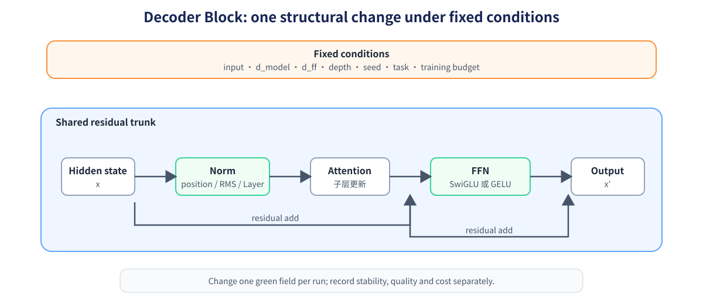
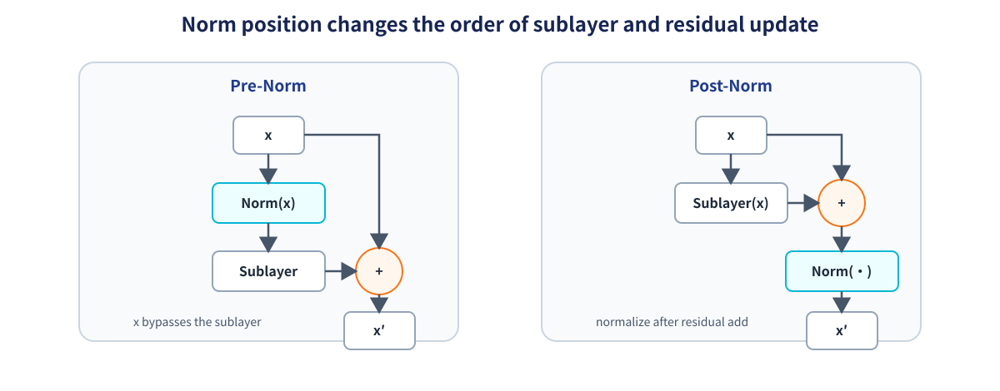

# 60. Decoder Block Stability Benchmark | Decoder Block 稳定性基准

**难度：** Hard  

> 🚀 **云端运行环境**
>
> 本章节的实战代码可以点击以下链接在免费 GPU 算力平台上直接运行：
>
> [](https://colab.research.google.com/github/datawhalechina/llm-algo-leetcode/blob/main/02_PyTorch_Algorithms/60_Decoder_Block_Stability_Benchmark.ipynb)
> [](https://modelscope.cn/my/mynotebook) *(国内推荐：魔搭社区免费实例)*

**环境：** CPU-first；GPU 可选  
**标签：** `模型架构`, `Decoder Block`, `Pre-Norm`, `RMSNorm`, `SwiGLU`, `Benchmark`  
**目标人群：** 已理解 Decoder Block 组件，准备比较结构变体的学习者

---

## 本节导读

现代 Decoder Block 通常由 Norm、Attention、FFN 与两条 residual 路径组成。组件名称相同，不代表训练行为相同：Norm 放置、Norm 类型和 FFN 激活都会改变梯度路径、激活尺度与参数成本。本节把这些选择写成单变量候选，在固定输入和深度下先做 CPU 稳定性检查；有匹配 checkpoint 时，再用 GPU 记录质量、step time 与峰值显存。
## 前置阅读

**导语：** 先理解 hidden state 如何经过 Norm、Attention、FFN 与 residual 形成一个 Decoder Block，再比较同一骨架中一个结构选择改变后会影响什么。

- [01. RMSNorm Tutorial | RMSNorm 教程](./01_RMSNorm_Tutorial.md)
- [02. SwiGLU Activation | SwiGLU 激活](./02_SwiGLU_Activation.md)
- [05. LLaMA3 Block Tutorial | LLaMA3 Block 组装](./05_LLaMA3_Block_Tutorial.md)
- [模型架构演进 · Block 与 Residual 主干](../topic_discussion/llm_architecture_evolution/06_block_residual_path.md)
### Step 1：把 Block 变体写成受控候选

本节以 `Pre-Norm + RMSNorm + SwiGLU` 为基线。每个候选只改变一个结构字段：Norm 位置、Norm 类型或 FFN 激活；模型宽度、层数、输入、随机种子和训练预算保持一致。这样，梯度或成本的变化才可以归因到该字段。

| 候选维度 | 基线 | 单变量候选 | 先观察什么 |
| --- | --- | --- | --- |
| Norm 位置 | Pre-Norm | Post-Norm | 深层 residual 路径与梯度尺度 |
| Norm 类型 | RMSNorm | LayerNorm | 激活尺度、参数与稳定性代理 |
| FFN 激活 | SwiGLU | GELU | FFN 参数量与输出变化 |
| 固定条件 | `d_model`、`d_ff`、层数、输入、seed | 不变 | 保证候选可比 |


### Step 2：稳定性来自 residual 路径与尺度控制

Pre-Norm 先把 hidden state 调整到可控尺度，再送入 Attention 或 FFN，子层输出通过 residual 回到主干；Post-Norm 则在 residual 相加后再归一化。RMSNorm 和 LayerNorm 都控制尺度，但 LayerNorm 还会重新中心化。它们不是“谁一定更好”的结论，而是不同深度、学习率和数据条件下需要复测的候选。

| 机制 | 直接改变 | CPU 代理证据 | GPU 需要补的证据 |
| --- | --- | --- | --- |
| Norm 位置 | 子层输入与 residual 的顺序 | 输出是否有限、输入梯度范数 | loss 曲线、梯度异常、收敛稳定性 |
| Norm 类型 | 是否减均值与缩放方式 | 激活标准差、参数量 | step time、验证集质量 |
| FFN 激活 | 通道门控与非线性 | 参数量、输出尺度 | 同预算质量与吞吐 |


### Step 3：质量、稳定性与成本分别记录

一次 Block benchmark 至少保留三类证据。CPU 只能检查结构、数值与梯度是否可达；GPU 才能测量真实 step time、峰值显存和验证质量。质量变好而成本超预算，或成本下降而质量失守，都不能直接采用候选。

| 证据层 | 最少字段 | 用于回答的问题 |
| --- | --- | --- |
| 结构契约 | baseline、candidate、唯一变化字段、固定条件 | 比较是否真的只改了一个设计 |
| CPU 稳定性代理 | finite、loss、input grad norm、activation std、参数量 | 结构是否可运行、梯度是否可达 |
| GPU 实测 | checkpoint、eval metric、step time、peak memory、失败记录 | 候选能否在真实训练中保留 |
| 决策 | 质量门槛、成本预算、evidence level、`accept / tune / reject` | 下一步是否值得扩大实验 |
### Step 4：代码设计——Block 契约、稳定性探针与决策

题目区先校验一个 Block 规格是否成立，再确保候选只改变一个字段。随后用小型多层 Block 检查前向数值、输入梯度、激活尺度和参数量，最后将基线与候选放入质量—成本决策。这个 CPU 探针不替代真实训练，但能阻止不合法或不可比的候选进入 GPU 实验。

| TODO | 机制责任 | 变量级提示 | 测试重点 |
| --- | --- | --- | --- |
| TODO 1 | 校验 Block 规格 | `norm_position`、`norm_kind`、`activation`、维度 | 合法结构与 FFN 宽度 |
| TODO 2 | 识别唯一结构差异 | `changed_fields`、`declared_field` | 只允许一个候选变量 |
| TODO 3 | 运行稳定性探针 | `loss`、`input_grad_norm`、`activation_std`、`finite` | 前向与反向均可达 |
| TODO 4 | 汇总质量—成本决策 | `quality_ok`、`cost_ok`、`decision` | 证据等级与拒绝分支 |

```python
from __future__ import annotations

from dataclasses import dataclass
from typing import Any, Dict

import torch
from torch import nn
import torch.nn.functional as F

```


```python
@dataclass(frozen=True)
class BlockSpec:
    """A single Decoder Block design under a fixed width and FFN budget."""

    norm_position: str
    norm_kind: str
    activation: str
    d_model: int = 16
    d_ff: int = 32


# TODO 1：校验 Block 规格。
def validate_block_spec(spec: BlockSpec) -> Dict[str, Any]:
    """Return a ready flag and issues for one Block candidate.

    Variables to determine:
    # norm_position = ???  # pre_norm / post_norm
    # norm_kind = ???      # rmsnorm / layernorm
    # activation = ???     # swiglu / gelu
    # issues = ???         # include invalid dimensions or incompatible FFN width
    """
    raise NotImplementedError('请先完成 TODO 1')


# TODO 2：确认基线与候选只改变一个结构字段。
def validate_single_block_change(baseline: BlockSpec, candidate: BlockSpec, declared_field: str) -> Dict[str, Any]:
    """Return the changed field only when the comparison is controlled.

    Variables to determine:
    # changed_fields = ???  # compare norm_position / norm_kind / activation
    # ready = ???           # exactly one changed field and it equals declared_field
    # return {'ready': ready, 'changed_fields': changed_fields, 'issues': issues}
    """
    raise NotImplementedError('请先完成 TODO 2')


class _RMSNorm(nn.Module):
    def __init__(self, d_model: int, eps: float = 1e-6):
        super().__init__()
        self.weight = nn.Parameter(torch.ones(d_model))
        self.eps = eps

    def forward(self, x: torch.Tensor) -> torch.Tensor:
        scale = torch.rsqrt(x.pow(2).mean(dim=-1, keepdim=True) + self.eps)
        return x * scale * self.weight


class _ToyDecoderBlock(nn.Module):
    """Small attention-like Block for a deterministic stability probe, not a pretrained LLM."""

    def __init__(self, spec: BlockSpec):
        super().__init__()
        norm = _RMSNorm if spec.norm_kind == 'rmsnorm' else nn.LayerNorm
        self.spec = spec
        self.norm1, self.norm2 = norm(spec.d_model), norm(spec.d_model)
        self.token_mixer = nn.Linear(spec.d_model, spec.d_model, bias=False)
        if spec.activation == 'swiglu':
            self.ff_in = nn.Linear(spec.d_model, 2 * spec.d_ff, bias=False)
            self.ff_out = nn.Linear(spec.d_ff, spec.d_model, bias=False)
        else:
            self.ff_in = nn.Linear(spec.d_model, spec.d_ff, bias=False)
            self.ff_out = nn.Linear(spec.d_ff, spec.d_model, bias=False)

    def _ffn(self, x: torch.Tensor) -> torch.Tensor:
        h = self.ff_in(x)
        if self.spec.activation == 'swiglu':
            gate, value = h.chunk(2, dim=-1)
            h = F.silu(gate) * value
        else:
            h = F.gelu(h)
        return self.ff_out(h)

    def forward(self, x: torch.Tensor) -> torch.Tensor:
        if self.spec.norm_position == 'pre_norm':
            x = x + self.token_mixer(self.norm1(x))
            return x + self._ffn(self.norm2(x))
        x = self.norm1(x + self.token_mixer(x))
        return self.norm2(x + self._ffn(x))


# TODO 3：对固定输入运行多层 Block，返回稳定性代理。
def run_block_stability_probe(spec: BlockSpec, *, depth: int = 4, seed: int = 0) -> Dict[str, Any]:
    """Measure a CPU-only forward/backward probe for one valid Block spec.

    Variables to determine:
    # blocks = ???          # repeat _ToyDecoderBlock(spec) depth times
    # loss = ???            # scalar objective from final hidden states
    # input_grad_norm = ??? # gradient norm of the original input
    # activation_std = ???  # output standard deviation
    # finite = ???          # forward and backward values are finite
    """
    raise NotImplementedError('请先完成 TODO 3')


# TODO 4：在质量、成本和证据等级下形成下一步建议。
def decide_block_candidate(baseline: Dict[str, Any], candidate: Dict[str, Any], *, max_param_ratio: float = 1.25) -> Dict[str, str]:
    """Return accept/tune/reject for one controlled candidate.

    Variables to determine:
    # quality_ok = ???  # both probes are finite and candidate gradient is finite
    # cost_ok = ???     # candidate parameter ratio is within max_param_ratio
    # decision = ???    # reject invalid probes; tune CPU-only evidence; accept real matched evidence
    """
    raise NotImplementedError('请先完成 TODO 4')

```


```python
# Tests are split by responsibility: contract, controlled change, probe, and decision.
def test_block_spec_contract():
    baseline = BlockSpec('pre_norm', 'rmsnorm', 'swiglu')
    assert validate_block_spec(baseline)['ready']
    assert not validate_block_spec(BlockSpec('unknown', 'rmsnorm', 'swiglu'))['ready']
    assert not validate_block_spec(BlockSpec('pre_norm', 'rmsnorm', 'swiglu', d_model=16, d_ff=31))['ready']
    return baseline


def test_single_change_contract(baseline):
    candidate = BlockSpec('post_norm', 'rmsnorm', 'swiglu')
    result = validate_single_block_change(baseline, candidate, 'norm_position')
    assert result['ready'] and result['changed_fields'] == ['norm_position']
    invalid = validate_single_block_change(baseline, BlockSpec('post_norm', 'layernorm', 'swiglu'), 'norm_position')
    assert not invalid['ready']
    return candidate


def test_stability_probe(baseline):
    record = run_block_stability_probe(baseline, depth=3, seed=7)
    assert record['finite']
    assert record['input_grad_norm'] > 0
    assert record['param_count'] > 0
    return record


def test_block_decision(baseline_record):
    cpu_only = {**baseline_record, 'evidence_level': 'cpu_stability_probe'}
    result = decide_block_candidate(baseline_record, cpu_only)
    assert result['decision'] == 'tune'
    reject = decide_block_candidate(baseline_record, {**cpu_only, 'finite': False})
    assert reject['decision'] == 'reject'


_base = test_block_spec_contract()
_candidate = test_single_change_contract(_base)
_probe = test_stability_probe(_base)
test_block_decision(_probe)
print('测试通过：Block 契约、单变量比较、稳定性探针与决策口径一致。')

```

---

🛑 **STOP HERE**

先完成题目区并运行测试，再查看参考实现。

---
## 参考代码与解析

### 代码

```python
from dataclasses import dataclass
from typing import Any, Dict

import torch
from torch import nn
import torch.nn.functional as F


@dataclass(frozen=True)
class BlockSpec:
    """A single Decoder Block design under a fixed width and FFN budget."""

    norm_position: str
    norm_kind: str
    activation: str
    d_model: int = 16
    d_ff: int = 32


class _RMSNorm(nn.Module):
    def __init__(self, d_model: int, eps: float = 1e-6):
        super().__init__()
        self.weight = nn.Parameter(torch.ones(d_model))
        self.eps = eps

    def forward(self, x: torch.Tensor) -> torch.Tensor:
        scale = torch.rsqrt(x.pow(2).mean(dim=-1, keepdim=True) + self.eps)
        return x * scale * self.weight


class _ToyDecoderBlock(nn.Module):
    """Small attention-like Block for a deterministic stability probe, not a pretrained LLM."""

    def __init__(self, spec: BlockSpec):
        super().__init__()
        norm = _RMSNorm if spec.norm_kind == 'rmsnorm' else nn.LayerNorm
        self.spec = spec
        self.norm1, self.norm2 = norm(spec.d_model), norm(spec.d_model)
        self.token_mixer = nn.Linear(spec.d_model, spec.d_model, bias=False)
        if spec.activation == 'swiglu':
            self.ff_in = nn.Linear(spec.d_model, 2 * spec.d_ff, bias=False)
            self.ff_out = nn.Linear(spec.d_ff, spec.d_model, bias=False)
        else:
            self.ff_in = nn.Linear(spec.d_model, spec.d_ff, bias=False)
            self.ff_out = nn.Linear(spec.d_ff, spec.d_model, bias=False)

    def _ffn(self, x: torch.Tensor) -> torch.Tensor:
        h = self.ff_in(x)
        if self.spec.activation == 'swiglu':
            gate, value = h.chunk(2, dim=-1)
            h = F.silu(gate) * value
        else:
            h = F.gelu(h)
        return self.ff_out(h)

    def forward(self, x: torch.Tensor) -> torch.Tensor:
        if self.spec.norm_position == 'pre_norm':
            x = x + self.token_mixer(self.norm1(x))
            return x + self._ffn(self.norm2(x))
        x = self.norm1(x + self.token_mixer(x))
        return self.norm2(x + self._ffn(x))


def validate_block_spec(spec: BlockSpec) -> Dict[str, Any]:
    """TODO 1：校验 Block 的结构字段与 FFN 宽度契约。"""
    issues = []
    if spec.norm_position not in {'pre_norm', 'post_norm'}:
        issues.append('norm_position must be pre_norm or post_norm')
    if spec.norm_kind not in {'rmsnorm', 'layernorm'}:
        issues.append('norm_kind must be rmsnorm or layernorm')
    if spec.activation not in {'swiglu', 'gelu'}:
        issues.append('activation must be swiglu or gelu')
    if min(spec.d_model, spec.d_ff) <= 0:
        issues.append('d_model and d_ff must be positive')
    if spec.activation == 'swiglu' and spec.d_ff % 2:
        issues.append('swiglu d_ff must be even for a balanced gate/value split')
    return {'ready': not issues, 'issues': issues}


def validate_single_block_change(baseline: BlockSpec, candidate: BlockSpec, declared_field: str) -> Dict[str, Any]:
    """TODO 2：只接受一个声明字段与真实差分一致的候选。"""
    fields = ('norm_position', 'norm_kind', 'activation')
    changed_fields = [field for field in fields if getattr(baseline, field) != getattr(candidate, field)]
    issues = []
    if not validate_block_spec(baseline)['ready'] or not validate_block_spec(candidate)['ready']:
        issues.append('baseline or candidate spec is invalid')
    if baseline.d_model != candidate.d_model or baseline.d_ff != candidate.d_ff:
        issues.append('width and FFN budget must stay fixed')
    if len(changed_fields) != 1:
        issues.append(f'expected one structure change, got: {changed_fields}')
    elif declared_field != changed_fields[0]:
        issues.append(f'declared_field should be {changed_fields[0]}')
    return {'ready': not issues, 'changed_fields': changed_fields, 'issues': issues}


def run_block_stability_probe(spec: BlockSpec, *, depth: int = 4, seed: int = 0) -> Dict[str, Any]:
    """TODO 3：在固定输入和 seed 下测量玩具 Block 的数值与梯度代理。"""
    contract = validate_block_spec(spec)
    if not contract['ready']:
        return {'finite': False, 'issues': contract['issues']}
    torch.manual_seed(seed)
    blocks = nn.Sequential(*[_ToyDecoderBlock(spec) for _ in range(depth)])
    inputs = torch.randn(2, 5, spec.d_model, requires_grad=True)
    outputs = blocks(inputs)
    loss = outputs.pow(2).mean()
    loss.backward()
    input_grad_norm = float(inputs.grad.norm().item()) if inputs.grad is not None else 0.0
    activation_std = float(outputs.detach().std().item())
    finite = bool(torch.isfinite(outputs).all() and torch.isfinite(loss) and torch.isfinite(inputs.grad).all())
    return {
        'finite': finite,
        'loss': float(loss.detach().item()),
        'input_grad_norm': input_grad_norm,
        'activation_std': activation_std,
        'param_count': sum(parameter.numel() for parameter in blocks.parameters()),
        'depth': depth,
        'evidence_level': 'cpu_stability_probe',
    }


def decide_block_candidate(baseline: Dict[str, Any], candidate: Dict[str, Any], *, max_param_ratio: float = 1.25) -> Dict[str, str]:
    """TODO 4：把稳定性、参数预算和证据等级收成下一步动作。"""
    quality_ok = bool(baseline.get('finite') and candidate.get('finite') and candidate.get('input_grad_norm', 0.0) > 0.0)
    baseline_params = max(int(baseline.get('param_count', 0)), 1)
    cost_ok = int(candidate.get('param_count', 0)) / baseline_params <= max_param_ratio
    if not quality_ok:
        return {'decision': 'reject', 'reason': 'forward or backward stability probe failed', 'next_action': 'repair the Block contract before GPU replay'}
    if not cost_ok:
        return {'decision': 'reject', 'reason': 'candidate exceeds the parameter budget', 'next_action': 'adjust the FFN budget before comparison'}
    if candidate.get('evidence_level') != 'gpu_matched_checkpoint':
        return {'decision': 'tune', 'reason': 'CPU stability evidence does not establish training quality', 'next_action': 'run matched checkpoint replay with validation metrics'}
    return {'decision': 'accept', 'reason': 'matched quality and cost evidence passed', 'next_action': 'record the candidate in the architecture audit'}

```

### 解析

- **TODO 1** 先排除无法公平比较的规格：SwiGLU 的门和值必须等宽，候选不能偷偷改变模型宽度或 FFN 预算。
- **TODO 2** 将“只改一个结构选择”写成可验证契约；如果同时替换 Norm 位置和类型，结果不能归因。
- **TODO 3** 使用固定随机输入检查前向有限、反向可达、激活尺度和参数量。它是稳定性代理，不是语言任务质量。
- **TODO 4** 把 CPU 记录保留为 `tune`：只有匹配 checkpoint、独立验证指标和真实成本都齐全时，才可以 `accept`。
### Step 5：可选 GPU 实验——匹配 checkpoint 的 Block 复测

GPU 实验只接收已经按相同数据、预算和训练流程得到的 baseline / candidate checkpoint。它分别记录验证损失、step time、峰值显存、梯度范数与失败原因，输出独立 JSON；没有这对 checkpoint 时，保留 CPU 机制结论即可。Block 稳定性使用 PyTorch / Transformers 训练语义，不引入 Serving backend；版本、能力 profile 与预检方式统一见[模型、执行栈与环境资产表](../gpu_environment_assets.md)。

#### 5.1 环境、候选与固定条件

| 条目 | 固定或输入内容 | 记录目的 |
| --- | --- | --- |
| checkpoint | baseline / candidate 路径与 revision | 追溯实际 Block 变体 |
| workload | eval batch、seq_len、dtype、重复次数、seed | 保证结果可比较 |
| 指标 | validation loss、step time、peak memory、grad norm | 同时观察质量、稳定性与成本 |
| 输出 | `benchmarks/results/60_decoder_block_stability/` | 保存独立证据 |

```python
# 默认关闭：请填入已训练且仅有一个 Block 结构差异的两个 checkpoint 后再开启。
import json
import os
from datetime import datetime, timezone
from pathlib import Path

RUN_BLOCK_GPU_BENCHMARK = False
BLOCK_BASELINE_MODEL = ''
BLOCK_CANDIDATE_MODEL = ''
BLOCK_REVISION = 'main'
BLOCK_DTYPE = 'float16'
BLOCK_BATCH_SIZE = 1
BLOCK_SEQ_LEN = 128
BLOCK_REPEATS = 3
BLOCK_SEED = 7
BLOCK_CHANGED_FIELD = 'norm_kind'  # norm_position / norm_kind / activation
BLOCK_RESULT_DIR = Path('benchmarks/results/60_decoder_block_stability')

```

#### 5.2 环境与候选预检

预检确认 CUDA、Transformers、两个 checkpoint 和结构差分。条件不满足时停止，不下载模型或把单模型 smoke 写成结构对照。

```python
if RUN_BLOCK_GPU_BENCHMARK:
    if not torch.cuda.is_available():
        raise RuntimeError('需要 CUDA GPU；保持 RUN_BLOCK_GPU_BENCHMARK=False 可只运行 CPU 部分。')
    try:
        from transformers import AutoConfig, AutoModelForCausalLM
    except ImportError as exc:
        raise RuntimeError('GPU 复测需要 transformers。') from exc
    if not BLOCK_BASELINE_MODEL or not BLOCK_CANDIDATE_MODEL:
        raise ValueError('请同时配置 BLOCK_BASELINE_MODEL 与 BLOCK_CANDIDATE_MODEL。')
    print('GPU preflight passed; matched checkpoints will be loaded in 5.4.')
else:
    print('GPU benchmark skipped. Configure two matched checkpoints to enable it.')

```

#### 5.3 固定 workload 与评测协议

两个候选使用相同的 token 输入、dtype、batch、长度和重复次数。这里的随机 token loss 只检查运行期数值和成本；正式质量结论必须将独立验证集指标写入 JSON。

```python
GPU_WORKLOAD = {
    'batch_size': BLOCK_BATCH_SIZE,
    'seq_len': BLOCK_SEQ_LEN,
    'dtype': BLOCK_DTYPE,
    'repeats': BLOCK_REPEATS,
    'seed': BLOCK_SEED,
    'quality_metric': 'validation_loss_from_matched_eval',
}
print(GPU_WORKLOAD)

```

#### 5.4 执行 matched replay 并保存 JSON

每个 checkpoint 独立加载、warmup 后重复执行相同的前向/反向探针。输出记录是运行期证据；未提供验证集质量时会标记为 `runtime_probe_only`。

```python
if RUN_BLOCK_GPU_BENCHMARK:
    import time

    def _dtype_from_name(name: str) -> torch.dtype:
        return {'float16': torch.float16, 'bfloat16': torch.bfloat16, 'float32': torch.float32}[name]

    def _run_checkpoint_probe(model_id: str) -> dict:
        torch.manual_seed(BLOCK_SEED)
        dtype = _dtype_from_name(BLOCK_DTYPE)
        model = AutoModelForCausalLM.from_pretrained(model_id, revision=BLOCK_REVISION, torch_dtype=dtype).cuda().train()
        vocab_size = int(getattr(model.config, 'vocab_size', 32000))
        inputs = torch.randint(0, vocab_size, (BLOCK_BATCH_SIZE, BLOCK_SEQ_LEN), device='cuda')
        torch.cuda.reset_peak_memory_stats()
        for _ in range(1):
            model.zero_grad(set_to_none=True)
            model(input_ids=inputs, labels=inputs).loss.backward()
        torch.cuda.synchronize()
        elapsed_ms = []
        grad_norm = 0.0
        for _ in range(BLOCK_REPEATS):
            model.zero_grad(set_to_none=True)
            started = time.perf_counter()
            loss = model(input_ids=inputs, labels=inputs).loss
            loss.backward()
            torch.cuda.synchronize()
            elapsed_ms.append((time.perf_counter() - started) * 1000)
            grad_norm = float(next(parameter.grad.norm() for parameter in model.parameters() if parameter.grad is not None).item())
        result = {
            'checkpoint': model_id,
            'runtime_loss': float(loss.detach().item()),
            'step_time_ms_median': sorted(elapsed_ms)[len(elapsed_ms) // 2],
            'peak_memory_mb': round(torch.cuda.max_memory_allocated() / 1024**2, 2),
            'grad_norm_first_parameter': grad_norm,
            'quality': {'validation_loss': None, 'status': 'runtime_probe_only'},
        }
        del model
        torch.cuda.empty_cache()
        return result

    baseline_result = _run_checkpoint_probe(BLOCK_BASELINE_MODEL)
    candidate_result = _run_checkpoint_probe(BLOCK_CANDIDATE_MODEL)
    BLOCK_RESULT_DIR.mkdir(parents=True, exist_ok=True)
    BLOCK_RESULT_PATH = BLOCK_RESULT_DIR / f"60_decoder_block_{datetime.now(timezone.utc).strftime('%Y%m%dT%H%M%SZ')}.json"
    BLOCK_RESULT_PATH.write_text(json.dumps({
        'project': '60_decoder_block_stability',
        'changed_field': BLOCK_CHANGED_FIELD,
        'workload': GPU_WORKLOAD,
        'baseline': baseline_result,
        'candidate': candidate_result,
        'evidence_level': 'gpu_runtime_probe',
    }, indent=2), encoding='utf-8')
    print(f'Saved: {BLOCK_RESULT_PATH}')

```

#### 5.5 读取结果并补齐质量证据

先确认两组记录的 workload 相同，再比较运行期 loss、step time、峰值显存和梯度范数。正式验证集 loss 或任务分数应追加到同一 JSON；缺失时不能从 runtime probe 直接推导模型质量。

```python
result_path = globals().get('BLOCK_RESULT_PATH')
if result_path is None:
    print('No GPU result found. Run 5.4 after completing the preflight.')
else:
    record = json.loads(Path(result_path).read_text(encoding='utf-8'))
    for role in ('baseline', 'candidate'):
        item = record[role]
        print(role, {key: item[key] for key in ('checkpoint', 'runtime_loss', 'step_time_ms_median', 'peak_memory_mb')})
    print('quality status:', record['candidate']['quality']['status'])

```

#### 5.6 形成结构采用建议

只有在候选通过独立验证集质量门槛、满足成本预算、结构差异可追溯且没有运行失败时，才将证据提交给 61 的架构审计。否则保留 `tune` 或 `reject` 与失败原因。

```python
if result_path is not None:
    record = json.loads(Path(result_path).read_text(encoding='utf-8'))
    quality_ready = record['candidate']['quality'].get('validation_loss') is not None
    runtime_ok = all(record[role]['peak_memory_mb'] > 0 for role in ('baseline', 'candidate'))
    decision = 'tune' if runtime_ok and not quality_ready else ('accept' if runtime_ok else 'reject')
    next_action = 'append matched validation metrics before architecture adoption'

    # 定位仓库工具；兼容从仓库根目录或章节目录启动 Notebook。
    import sys
    repository_root = next(
        (path for path in (Path.cwd(), *Path.cwd().parents) if (path / 'tools' / 'architecture_result_schema.py').is_file()),
        None,
    )
    if repository_root is None:
        raise RuntimeError('未找到 tools/architecture_result_schema.py，请从教程仓库中运行本节。')
    if str(repository_root) not in sys.path:
        sys.path.insert(0, str(repository_root))

    from tools.architecture_result_schema import make_producer_record, save_record

    companion = make_producer_record(
        semantic_id='ARCH-BLOCK-STABILITY',
        comparison_mode='controlled',
        source={
            'notebook': '02_PyTorch_Algorithms/60_Decoder_Block_Stability_Benchmark.ipynb',
            'raw_result_path': str(result_path),
        },
        runtime={
            'framework': 'transformers',
            'device': 'cuda',
            'dtype': BLOCK_DTYPE,
            'model_revision': BLOCK_REVISION,
        },
        workload=record['workload'],
        baseline={'name': 'baseline', 'checkpoint': record['baseline']['checkpoint']},
        candidates=[{'name': 'candidate', 'checkpoint': record['candidate']['checkpoint']}],
        quality={
            'metric': 'validation_loss',
            'baseline': record['baseline']['quality'].get('validation_loss'),
            'candidate': record['candidate']['quality'].get('validation_loss'),
            'status': record['candidate']['quality']['status'],
        },
        cost={
            role: {
                'step_time_ms_median': record[role]['step_time_ms_median'],
                'peak_memory_mb': record[role]['peak_memory_mb'],
            }
            for role in ('baseline', 'candidate')
        },
        mechanism={
            'changed_field': record['changed_field'],
            'runtime_loss': {role: record[role]['runtime_loss'] for role in ('baseline', 'candidate')},
            'gradient_norm_first_parameter': {
                role: record[role]['grad_norm_first_parameter'] for role in ('baseline', 'candidate')
            },
        },
        evidence_level='gpu_smoke' if not quality_ready else 'real_benchmark',
        decision={'status': decision, 'reason': 'matched quality evidence is required before adoption', 'next_action': next_action},
    )
    companion_path = Path(result_path).with_name(Path(result_path).stem + '_architecture.json')
    if companion_path.exists():
        print(f'Companion already exists and was not overwritten: {companion_path}')
    else:
        save_record(companion_path, companion)
        print(f'Saved companion: {companion_path}')
    print({'decision': decision, 'next_action': next_action})

```

## 相关阅读

- [On Layer Normalization in the Transformer Architecture](https://arxiv.org/abs/2002.04745)
- [Root Mean Square Layer Normalization](https://arxiv.org/abs/1910.07467)
- [GLU Variants Improve Transformer](https://arxiv.org/abs/2002.05202)
- [模型架构演进 · 归一化演化](../topic_discussion/llm_architecture_evolution/03_norm_evolution.md)
- [模型架构演进 · Block 与 Residual 主干](../topic_discussion/llm_architecture_evolution/06_block_residual_path.md)
- [61. Model Architecture Exploration | 架构验证项目](./61_Model_Architecture_Exploration.md)：将本节的专项证据汇入架构审计。