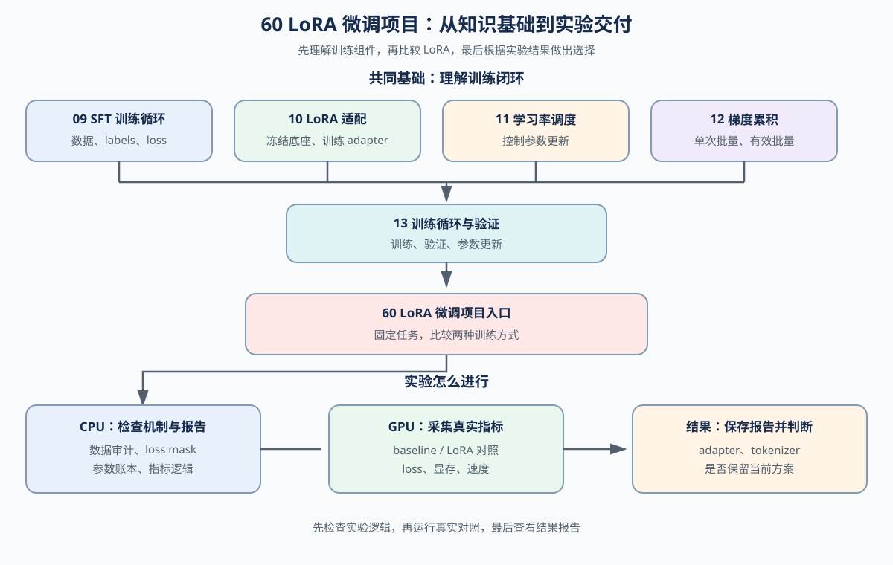
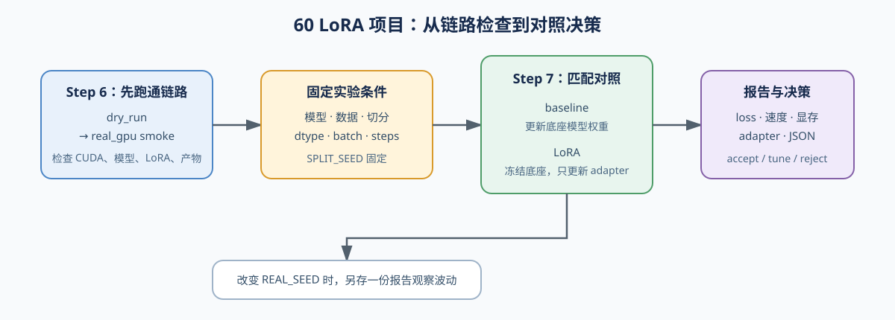
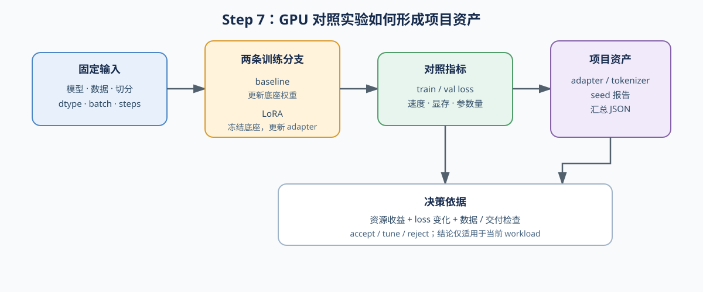

# 60. LoRA Fine Tuning Project | LoRA 微调项目

**难度：** Hard | **环境：** CPU-first | **标签：** `训练微调`, `LoRA`, `项目评估` | **目标人群：** 具备基础训练经验、开始做微调项目的学习者

> 🚀 **云端运行环境**
>
> 本章节的实战代码可以点击以下链接在免费 GPU 算力平台上直接运行：
>
> [](https://colab.research.google.com/github/datawhalechina/llm-algo-leetcode/blob/main/02_PyTorch_Algorithms/60_LoRA_Fine_Tuning_Project.ipynb)
> [](https://modelscope.cn/my/mynotebook) *(国内推荐：魔搭社区免费实例)*


---

## 本节导读

本节以指令跟随任务为例，比较全参数微调与 LoRA，观察 LoRA 是否能够减少训练成本并保持可接受的验证效果。实验同时检查可训练参数、训练速度、峰值显存和 adapter 产物。CPU 部分用于检查数据、loss mask、参数账本、指标汇总和决策逻辑；GPU 部分使用真实模型和数据，验证训练损失、验证损失、显存和速度。具体模型、数据集和运行条件见 Step 1。


**关键词：** `LoRA`, `training`, `project`, `profiling`, `report`

---
## 前置阅读

**导语：** 前置内容提供 LoRA 机制、有效 batch 口径和端到端训练闭环；进入本项目后，沿着这些基础比较 LoRA 方案的资源成本、质量变化和交付条件。
- [09. SFT Training Loop | SFT 训练循环](./09_SFT_Training_Loop.md)
- [10. LoRA Tutorial | LoRA 教程](./10_LoRA_Tutorial.md)
- [12. Gradient Accumulation | 梯度累积](./12_Gradient_Accumulation.md)
- [13. End-to-End Fine-Tuning Experiment | 端到端微调实验](./13_End_to_End_Fine_Tuning_Experiment.md)

## 相关阅读

**导语：** 做完基础 LoRA 项目后，可以继续比较 LoRA 变体，或回看训练成本是否符合当前任务需求。
- [11. LR Schedulers WSD Cosine | WSD 余弦学习率调度器](./11_LR_Schedulers_WSD_Cosine.md)
- [63. LoRA Variants Benchmark | LoRA 变体对比项目](./63_LoRA_Variants_Benchmark.md)
- [73. Training Performance Analysis | 训练性能分析](./73_Training_Performance_Analysis.md)

---
### Step 1（项目设计与运行入口）：明确实验目标与对照

本项目以指令跟随为任务，比较全参数微调与 LoRA 的训练成本和效果。每条样本由 `instruction / input` 组成输入，`output` 作为监督目标。

| 项目内容 | CPU：机制验证 | GPU：真实对照 | 实验约定 |
| :--- | :--- | :--- | :--- |
| 任务目标 | 用少量示例检查 `instruction / input → output` 的任务格式和判断逻辑 | 在指令跟随任务上比较全参数微调与 LoRA | 观察训练成本是否下降、效果是否可接受 |
| 指标与判断依据 | 用示例字段检查指标是否齐全、差值方向是否正确；不生成真实训练指标 | 记录可训练参数、峰值显存、每步耗时、token throughput、train loss 和 val loss | 资源指标用于比较训练成本，loss 指标用于检查效果变化，最终决策结合两类指标 |
| 实验对象 | 不加载模型；用示例参数计算全参数与 LoRA 的参数账本 | 默认加载 `Qwen/Qwen2.5-0.5B-Instruct` 的未微调权重 | 可选 `Qwen/Qwen2.5-1.5B-Instruct` 或 `deepseek-ai/DeepSeek-R1-Distill-Qwen-1.5B`；GPU 对照两组使用同一模型 ID / revision，CPU 只验证示例账本 |
| 输入数据 | 用少量内置示例模拟字段审计、loss mask 和报告字段 | 默认使用 `tatsu-lab/alpaca`，最多 32 条样本、最大长度 256 token | GPU 对照实验复用同一批样本、训练 / 验证切分、tokenizer 截断与 padding 规则；CPU 只使用内置示例验证机制 |
| 实验变量 | 用示例数字检查 baseline / LoRA 的比较逻辑 | baseline 更新底座权重；LoRA 冻结底座，只更新 LoRA 适配器 | 只改变参数更新方式 |
| 训练条件 | 不运行模型训练，只用示例结果测试汇总和决策函数 | 按硬件选择计算精度和训练配置 | 两组 GPU 实验保持训练条件一致 |
| 输出结果 | 生成数据审计、参数账本、指标汇总和决策逻辑；不包含真实训练指标 | 生成真实模型的 train / val loss、可训练参数、峰值显存和 step time，并保存 LoRA 适配器与 JSON 报告 | CPU 提供字段、计算逻辑和报告格式；GPU 填入真实结果 |



<div align="center"><strong>60 LoRA 微调项目学习与实验路径：</strong>09–13 提供训练口径，60 节依次组织 CPU 检查、GPU 对照和项目交付。</div>

### Step 2（项目设计）：固定两组对照条件

为了判断 LoRA 是否带来真实收益，两组实验都从同一个模型 ID 的未微调权重开始，使用同一批训练集和验证集，以及相同的 tokenizer、截断、padding、训练和评测设置。实验变量是参数更新方式：baseline 更新底座模型的全部可训练权重；LoRA 挂载适配器后冻结底座，只更新 LoRA 适配器参数。Step 6 / Step 7 的 GPU 对照实验用验证集上有效监督 token 的平均 `val_loss` 作为主要评测结果。

| 对照项 | 全参数更新组（baseline） | LoRA 更新组 | 必须保持一致 |
|:---|:---|:---|:---|
| 训练对象 | 更新底座模型的全部可训练权重（Embedding、Attention、MLP、Norm 和输出层） | 冻结底座模型，只更新 LoRA 适配器 | 只改变参数更新方式 |
| 模型起点 | 使用同一模型 ID 的未微调权重 | 使用同一份未微调权重，并挂载 LoRA 适配器 | 模型权重版本一致 |
| 数据与切分 | 当前默认使用 `tatsu-lab/alpaca` 的一批训练集和验证集 | 完全复用 baseline 的训练集和验证集 | 更换数据集时也要保持版本、样本顺序和 `SPLIT_SEED` 一致 |
| 训练条件 | 使用相同 dtype、micro-batch、序列长度、优化器、学习率和步数 | 与 baseline 完全相同 | 训练条件一致 |
| 评测方式 | 对同一验证集进行无梯度前向，只统计有效监督 token 的平均 `val_loss` | 使用相同验证集和 loss mask 规则 | tokenizer、截断、padding 和 loss 计算一致 |


### Step 3（项目设计）：确定项目检查内容

A–E 是本项目需要完成的五类检查。Step 5 使用示例数据验证这些检查的实现；Step 6 / Step 7 再把相同字段用于真实 GPU 实验报告。

| 环节 | 函数名 | 检查内容 | 作用 | CPU 验证方式 |
|:---|:---|:---|:---|:---|
| A | `build_lora_project_config` | 配置与有效批大小（micro-batch × 梯度累积步数） | 固定底座模型、LoRA 参数和训练条件 | 检查配置字段与有效批大小计算 |
| B | `lora_trainable_params`、`full_linear_params`、`lora_param_ratio` | 参数账本 | 比较完整参数与 LoRA 参数成本 | 使用维度和 rank 计算公式 |
| C | `summarize_lora_project` | baseline / LoRA 指标差值 | 汇总资源和损失变化 | 使用示例指标计算差值 |
| D | `audit_sft_examples`、`loss_mask_report`、`build_adapter_artifact_record`、`check_lora_project_readiness` | 数据、监督位置和产物检查 | 判断实验输入和输出是否可用 | 使用示例数据和路径状态检查 |
| E | `recommend_lora_decision` | 决策条件和原因 | 输出 `accept / tune / reject` | 使用示例指标测试决策分支 |


### Step 4（CPU 实验设计）：阅读 CPU 报告字段

下面先阅读 CPU 报告中的主要字段，理解每个字段记录什么、检查什么，以及它如何参与项目判断。Step 5 再实现对应函数。CPU 只验证数据审计、参数账本、指标计算和决策逻辑，不生成真实训练结果。


| 报告字段 | 记录内容 | CPU 中如何验证 | 用于判断 |
|:---|:---|:---|:---|
| 数据审计 | 样本数、空回答、重复样本、超长样本 | 使用示例数据调用审计函数 | 数据是否可以进入训练 |
| 监督 token | 参与 loss 的 token 数、padding 中误参与 loss 的 token 数 | 检查 `attention_mask` 与 `labels` | loss 监督位置是否正确 |
| LoRA 配置 | 底座模型、目标层、rank、alpha、dropout、有效批大小 | 读取配置对象 | 本轮使用了什么训练设置 |
| 参数账本 | 全参数量、LoRA 可训练参数量、参数占比 | 使用公式计算 | LoRA 是否减少训练参数 |
| 对照指标 | baseline 与 LoRA 的参数、显存、耗时、train loss、val loss 差值 | 使用示例数值调用汇总函数 | 比较逻辑是否正确 |
| 交付检查 | adapter 路径、tokenizer 路径、合并检查、生成检查 | 检查字段和布尔状态 | 产物是否具备交付条件 |
| 项目决策 | `accept / tune / reject` 及原因 | 使用示例指标和阈值测试分支 | 是否进入下一步实验 |


### Step 5（CPU 代码练习）：实现项目检查函数

下面只实现三项核心 TODO：数据审计、loss mask 核对和 baseline / LoRA 指标汇总。配置打包、参数公式、交付检查和决策规则作为给定实现；完成后先运行题目区测试，再进入 Step 6 / Step 7 的 GPU 实验。


```python
import math
```


```python

# 目标：把 09-13 的训练闭环收束为 baseline vs LoRA 的项目报告；本代码只验证 CPU 可检查的口径，不虚构 GPU 结果。
def audit_sft_examples(examples, max_total_chars):
    """统计 SFT 样本完整性；不执行 tokenizer，也不判断模型训练效果。

    参数:
        examples: 包含 prompt / response 字段的样本列表。
        max_total_chars: 单条样本 prompt 与 response 的字符预算。
    返回:
        样本数、空回答、重复样本、超长样本和平均字符数。
    """
    # ==========================================
    # TODO 1: 审计 SFT 样本
    # 提示：先用 seen / total_chars / 各计数器保存中间状态，再遍历样本。
    # prompt = example.get('prompt', ???)；response = example.get('response', ???)
    # pair = (prompt, response)；total = len(prompt) + len(response)
    # ==========================================
    # total_samples = ???
    # empty_response_count = ???
    # duplicate_count = ???
    # over_length_count = ???
    # avg_total_chars = ???
    raise NotImplementedError("请先完成 TODO 1")
    return {
        'total_samples': total_samples,
        'empty_response_count': empty_response_count,
        'duplicate_count': duplicate_count,
        'over_length_count': over_length_count,
        'avg_total_chars': round(avg_total_chars, 2),
    }

def loss_mask_report(attention_mask, labels, ignore_index=-100):
    """按 attention mask 和 labels 统计监督 token；不运行 backward。

    `labels == ignore_index` 的位置不参与 loss；padding 位置若仍被监督，
    应作为数据管线问题报告，而不是被静默忽略。
    """
    # ==========================================
    # TODO 2: 核对 loss mask
    # 提示：先展平并检查长度，再计算四个计数；不要把 supervised_tokens
    # 直接当成 response token 数，也不要把 padding_supervised_tokens 截断掉。
    # mask_flat = [value for row in attention_mask for value in row]
    # labels_flat = [value for row in labels for value in row]
    # ==========================================
    # total_tokens = ???
    # non_padding_tokens = ???
    # supervised_tokens = ???
    # padding_supervised_tokens = ???
    # supervised_ratio = ???
    raise NotImplementedError("请先完成 TODO 2")
    return {
        'total_tokens': total_tokens,
        'non_padding_tokens': non_padding_tokens,
        'supervised_tokens': supervised_tokens,
        'padding_supervised_tokens': padding_supervised_tokens,
        'supervised_ratio': round(supervised_ratio, 4),
    }

# A：汇总 LoRA 项目配置
def build_lora_project_config(
    base_model,
    target_modules,
    rank,
    alpha,
    dropout,
    learning_rate,
    micro_batch_size,
    accum_steps,
    scheduler,
):
    """打包一次 LoRA 训练的最小复现实验配置。

    参数：
        base_model: 底座模型标识。
        target_modules: 注入 LoRA 的线性层名称。
        rank: 低秩矩阵的秩。
        alpha: LoRA 缩放系数。
        dropout: adapter dropout。
        learning_rate: 优化器学习率。
        micro_batch_size: 单次前向使用的 micro-batch 大小。
        accum_steps: 梯度累积步数。
        scheduler: 学习率调度器名称。
    返回：包含原始配置和 effective_batch_size 的字典。
    """
    effective_batch_size = micro_batch_size * accum_steps
    return {
        'base_model': base_model,
        'target_modules': target_modules,
        'rank': rank,
        'alpha': alpha,
        'dropout': dropout,
        'learning_rate': learning_rate,
        'micro_batch_size': micro_batch_size,
        'accum_steps': accum_steps,
        'effective_batch_size': effective_batch_size,
        'scheduler': scheduler,
    }

# B：计算 LoRA adapter 参数量
def lora_trainable_params(in_dim, out_dim, rank):
    """估算单个线性层新增的 LoRA 参数量，不包含冻结底座权重。

    参数量为 `rank * in_dim + rank * out_dim`；这里只计算 adapter，
    不代表整个模型的可训练参数量。
    """
    trainable_params = rank * (in_dim + out_dim)
    return trainable_params

# C：计算完整线性层参数量
def full_linear_params(in_dim, out_dim):
    """计算对应完整线性层的 weight 参数量，不额外计入 bias。"""
    total_params = in_dim * out_dim
    return total_params

# D：计算 LoRA 参数占比
def lora_param_ratio(in_dim, out_dim, rank):
    """计算单个线性层中 LoRA 参数占完整 weight 参数的比例。"""
    trainable = lora_trainable_params(in_dim, out_dim, rank)
    total = full_linear_params(in_dim, out_dim)
    ratio = trainable / total
    return ratio

def summarize_lora_project(baseline_metrics, lora_metrics):
    """把 baseline 与 LoRA 的同口径指标收束成项目对比摘要。

    资源字段使用 `baseline - lora`，正数表示 LoRA 更省或更快；
    loss 字段使用 `lora - baseline`，正数表示 LoRA 的 loss 更高。
    """
    # ==========================================
    # TODO 3: 汇总 baseline 和 LoRA 的项目指标
    # 提示：只补 5 个项目判断量；参数/资源收益用 baseline - lora，
    # loss 代价用 lora - baseline，正负号必须在字段名中保持一致。
    # ==========================================
    # param_reduction = 1.0 - ??? / ???
    # memory_delta = ??? - ???
    # time_delta = ??? - ???
    # train_loss_delta = ??? - ???
    # val_loss_delta = ??? - ???
    raise NotImplementedError("请先完成 TODO 3")
    return {
        'param_reduction': round(param_reduction, 4),
        'peak_mem_delta_mb': round(memory_delta, 2),
        'step_time_delta_ms': round(time_delta, 2),
        'final_train_loss_delta': round(train_loss_delta, 4),
        'final_val_loss_delta': round(val_loss_delta, 4),
    }

# E：记录 adapter 交付物
def build_adapter_artifact_record(adapter_path, tokenizer_path, merge_checked, sanity_generation_checked):
    """记录 adapter 交付所需的路径和两项最小可用性检查。"""
    return {
        'adapter_path': adapter_path,
        'tokenizer_path': tokenizer_path,
        'merge_checked': merge_checked,
        'sanity_generation_checked': sanity_generation_checked,
    }

# 给定实现：生成报告、检查交付和输出项目决策
def build_lora_project_report(config, baseline, candidates, quality, resources, artifacts, decision, environment=None):
    """组装 `fine-tuning-project/v1` 的公共报告外壳。

    该函数只负责组织字段，不验证训练质量，也不替代 GPU 实验。
    """
    return {
        'schema_version': 'fine-tuning-project/v1',
        'project': '60_lora_fine_tuning',
        'stage': 'project_decision',
        'config': config,
        'baseline': baseline,
        'candidates': candidates,
        'quality': quality,
        'resources': resources,
        'artifacts': artifacts,
        'decision': decision,
        'environment': environment or {},
    }

def check_lora_project_readiness(data_audit, mask_report, artifact_record):
    """检查数据、loss 口径和交付产物是否满足项目要求。

    这是给定实现；学习者重点阅读 issues 如何阻断最终决策。
    """
    issues = []
    if data_audit['empty_response_count'] > 0:
        issues.append('empty_response')
    if data_audit['duplicate_count'] > 0:
        issues.append('duplicate_examples')
    if mask_report['padding_supervised_tokens'] > 0:
        issues.append('padding_supervised')
    if mask_report['supervised_tokens'] == 0:
        issues.append('no_supervised_tokens')
    if not artifact_record['merge_checked']:
        issues.append('merge_not_checked')
    if not artifact_record['sanity_generation_checked']:
        issues.append('sanity_generation_not_checked')
    return {'ready': len(issues) == 0, 'issues': issues}

def recommend_lora_decision(summary, readiness, min_param_reduction=0.5, max_val_loss_delta=0.03, min_peak_mem_delta_mb=128.0, min_step_time_delta_ms=-3.0):
    """根据项目摘要和交付检查结果输出 accept / tune / reject。

    这是给定实现；阈值由参数传入，学习者重点解释分支顺序。
    """
    memory_gain_ok = summary['peak_mem_delta_mb'] >= min_peak_mem_delta_mb
    speed_not_too_bad = summary['step_time_delta_ms'] >= min_step_time_delta_ms
    if not readiness['ready']:
        decision = 'tune'
        reason = '数据、loss mask 或 adapter 交付检查未通过，先修复项目可信度问题。'
    elif summary['param_reduction'] < min_param_reduction:
        decision = 'reject'
        reason = '参数节省不足，LoRA 没有带来足够训练成本收益。'
    elif summary['final_val_loss_delta'] > max_val_loss_delta:
        decision = 'tune'
        reason = '参数节省达标，但验证集 loss 损失偏大，优先调 rank、target modules 或学习率。'
    elif not (memory_gain_ok or speed_not_too_bad):
        decision = 'tune'
        reason = '参数节省和验证损失可接受，但显存收益偏弱且速度恶化，优先继续调 rank、插层范围或 batch 配置。'
    else:
        decision = 'accept'
        reason = '参数节省达标，验证集损失可接受，交付检查通过，可以保留当前 LoRA 配置。'
    return {'decision': decision, 'reason': reason}

```


```python
# 测试你的 CPU 逻辑实现
def test_lora_project_cpu_logic():
    try:
        examples = [
            {'prompt': '问：什么是 LoRA？', 'response': '答：LoRA 是低秩适配方法。'},
            {'prompt': '问：如何检查 loss？', 'response': '答：检查 labels 中参与监督的 token。'},
            {'prompt': '问：什么是 LoRA？', 'response': '答：LoRA 是低秩适配方法。'},
            {'prompt': '问：空回答？', 'response': ''},
        ]
        audit = audit_sft_examples(examples, max_total_chars=30)
        assert audit['total_samples'] == 4, "样本数统计不正确！"
        assert audit['empty_response_count'] == 1, "空 response 统计不正确！"
        assert audit['duplicate_count'] == 1, "重复样本统计不正确！"
        assert audit['over_length_count'] == 1, "超长样本统计不正确！"

        empty_audit = audit_sft_examples([], max_total_chars=30)
        assert empty_audit['total_samples'] == 0, "空数据集的样本数应为 0！"
        assert empty_audit['avg_total_chars'] == 0.0, "空数据集的平均长度应为 0！"

        mask = [[1, 1, 1, 0], [1, 1, 0, 0]]
        labels = [[-100, 7, 8, -100], [-100, 9, -100, 3]]
        report = loss_mask_report(mask, labels)
        assert report['total_tokens'] == 8, "total_tokens 统计不正确！"
        assert report['non_padding_tokens'] == 5, "non_padding_tokens 统计不正确！"
        assert report['supervised_tokens'] == 4, "supervised_tokens 统计不正确！"
        assert report['padding_supervised_tokens'] == 1, "padding_supervised_tokens 统计不正确！"
        assert report['supervised_ratio'] == 0.8, "supervised_ratio 计算不正确！"

        no_token_report = loss_mask_report([[0, 0]], [[-100, -100]])
        assert no_token_report['supervised_tokens'] == 0, "无有效 token 时监督数应为 0！"
        assert no_token_report['supervised_ratio'] == 0.0, "无有效 token 时监督比例应为 0！"
        try:
            loss_mask_report([[1]], [[-100, -100]])
        except ValueError:
            pass
        else:
            raise AssertionError("mask 与 labels 长度不一致时应抛出 ValueError！")

        config = build_lora_project_config(
            base_model='tiny-llama',
            target_modules=['q_proj', 'v_proj'],
            rank=8,
            alpha=16,
            dropout=0.05,
            learning_rate=2e-4,
            micro_batch_size=2,
            accum_steps=4,
            scheduler='wsd-cosine',
        )
        assert config['effective_batch_size'] == 8, "effective_batch_size 计算不正确！"
        assert config['target_modules'] == ['q_proj', 'v_proj'], "target_modules 应保留原始配置！"

        trainable = lora_trainable_params(8, 8, 2)
        total = full_linear_params(8, 8)
        ratio = lora_param_ratio(8, 8, 2)

        assert trainable == 32, "LoRA 可训练参数量计算不正确！"
        assert total == 64, "完整线性层参数量计算不正确！"
        assert abs(ratio - 0.5) < 1e-12, "LoRA 参数占比计算不正确！"

        baseline = {
            'trainable_params': 1000,
            'step_time_ms': 20.0,
            'peak_mem_mb': 1024.0,
            'final_train_loss': 0.40,
            'final_val_loss': 0.50,
        }
        lora = {
            'trainable_params': 100,
            'step_time_ms': 22.0,
            'peak_mem_mb': 768.0,
            'final_train_loss': 0.42,
            'final_val_loss': 0.52,
        }
        summary = summarize_lora_project(baseline, lora)
        assert summary['param_reduction'] == 0.9, "param_reduction 计算不正确！"
        assert summary['peak_mem_delta_mb'] == 256.0, "peak_mem_delta_mb 计算不正确！"
        assert summary['step_time_delta_ms'] == -2.0, "step_time_delta_ms 计算不正确！"
        assert summary['final_train_loss_delta'] == 0.02, "final_train_loss_delta 计算不正确！"
        assert summary['final_val_loss_delta'] == 0.02, "final_val_loss_delta 计算不正确！"

        artifact = build_adapter_artifact_record(
            adapter_path='outputs/lora-adapter',
            tokenizer_path='outputs/tokenizer',
            merge_checked=True,
            sanity_generation_checked=True,
        )
        project_report = build_lora_project_report(
            config={'model': 'tiny-llama', 'dtype': 'bf16', 'seed': 42},
            baseline=baseline,
            candidates=[{'name': 'lora', **lora}],
            quality={'train_loss': 0.42, 'val_loss': 0.52, 'task_metrics': {}},
            resources={'trainable_params': 100, 'peak_memory_mb': 768.0, 'step_time_ms': 22.0},
            artifacts={'adapter': artifact},
            decision={'decision': 'accept', 'reason': 'test'},
        )
        for section in ('config', 'baseline', 'candidates', 'quality', 'resources', 'artifacts', 'decision', 'environment'):
            assert section in project_report, f'报告缺少 {section} 区域！'
        clean_audit = {'total_samples': 2, 'empty_response_count': 0, 'duplicate_count': 0, 'over_length_count': 0, 'avg_total_chars': 12.0}
        clean_report = {'total_tokens': 8, 'non_padding_tokens': 5, 'supervised_tokens': 3, 'padding_supervised_tokens': 0, 'supervised_ratio': 0.6}
        readiness = check_lora_project_readiness(clean_audit, clean_report, artifact)
        assert readiness['ready'] is True, "干净项目应允许交付！"

        dirty_readiness = check_lora_project_readiness(audit, report, artifact)
        assert dirty_readiness['ready'] is False, "存在数据或 mask 问题时不能交付！"
        assert 'empty_response' in dirty_readiness['issues'], "应报告空 response 问题！"
        assert 'padding_supervised' in dirty_readiness['issues'], "应报告 padding 参与 loss 问题！"

        decision = recommend_lora_decision(summary, readiness, min_param_reduction=0.5, max_val_loss_delta=0.03, min_peak_mem_delta_mb=128.0, min_step_time_delta_ms=-3.0)
        assert decision['decision'] == 'accept', "LoRA 决策应为 accept！"

        assert recommend_lora_decision(summary, dirty_readiness)['decision'] == 'tune', "交付检查未通过时应建议 tune！"

        worse_summary = dict(summary)
        worse_summary['final_val_loss_delta'] = 0.08
        assert recommend_lora_decision(worse_summary, readiness)['decision'] == 'tune', "val loss 损失过大时应建议 tune！"

        weak_summary = dict(summary)
        weak_summary['param_reduction'] = 0.2
        assert recommend_lora_decision(weak_summary, readiness)['decision'] == 'reject', "参数节省不足时应建议 reject！"

        tradeoff_summary = dict(summary)
        tradeoff_summary['peak_mem_delta_mb'] = 32.0
        tradeoff_summary['step_time_delta_ms'] = -6.0
        assert recommend_lora_decision(tradeoff_summary, readiness)['decision'] == 'tune', "显存收益偏弱且速度恶化时应建议 tune！"

        print("✅ LoRA 项目数据审计、loss 核对、账本、交付检查和决策代码通过基础校验。")

    except NotImplementedError:
        print("请先完成 TODO 代码！")
        raise
    except (AttributeError, NameError, TypeError, ValueError, RuntimeError) as e:
        if isinstance(e, AttributeError):
            print("代码未完成，无法找到必要的属性")
        elif isinstance(e, NameError):
            print("代码可能未完成，导致了变量未定义")
        elif isinstance(e, TypeError):
            print("代码可能未完成，导致了操作错误")
        elif isinstance(e, ValueError):
            print("代码可能未完成，导致了数值错误")
        elif isinstance(e, RuntimeError):
            print("代码可能未完成，导致了运行时错误")
        raise
    except Exception as e:
        print(f"❌ 发生未知异常: {e}")
        raise


test_lora_project_cpu_logic()

```

完成上述 CPU 函数后，继续运行下面的决策模拟。它使用同一份项目摘要，每次只改变一个指标或决策阈值；比较输出，理解为什么同一个 LoRA 方案会因为质量要求或资源代价不同而得到不同决策。本练习只验证 CPU 决策逻辑，不代表真实训练结果。


```python
scenario_summary = {'param_reduction': 0.9, 'peak_mem_delta_mb': 256.0, 'step_time_delta_ms': -2.0, 'final_train_loss_delta': 0.02, 'final_val_loss_delta': 0.02}
scenario_readiness = {'ready': True, 'issues': []}
scenarios = {
    '基准条件': (scenario_summary, {}),
    '验证损失超过默认阈值': ({**scenario_summary, 'final_val_loss_delta': 0.08}, {}),
    '放宽验证损失阈值': ({**scenario_summary, 'final_val_loss_delta': 0.08}, {'max_val_loss_delta': 0.10}),
    '显存收益小且训练变慢': ({**scenario_summary, 'peak_mem_delta_mb': 32.0, 'step_time_delta_ms': -6.0}, {}),
}
for name, (metrics, policy) in scenarios.items():
    print(name, '->', recommend_lora_decision(metrics, scenario_readiness, **policy))

```

🛑 **STOP HERE** 🛑

## 参考代码与解析

### 代码


```python

# TODO 1: 审计 SFT 样本
def audit_sft_examples(examples, max_total_chars):
    """统计 SFT 样本完整性；不执行 tokenizer，也不判断模型训练效果。

    参数：
        examples: 包含 prompt / response 字段的样本列表。
        max_total_chars: 单条样本 prompt 与 response 的字符预算。
    返回：样本数、空回答、重复样本、超长样本和平均字符数。
    """
    seen = set()
    total_chars = 0
    empty_response_count = 0
    duplicate_count = 0
    over_length_count = 0

    for example in examples:
        prompt = example.get('prompt', '')
        response = example.get('response', '')
        pair = (prompt, response)
        total = len(prompt) + len(response)

        total_chars += total
        if not response.strip():
            empty_response_count += 1
        if pair in seen:
            duplicate_count += 1
        else:
            seen.add(pair)
        if total > max_total_chars:
            over_length_count += 1

    total_samples = len(examples)
    avg_total_chars = total_chars / total_samples if total_samples else 0.0
    return {
        'total_samples': total_samples,
        'empty_response_count': empty_response_count,
        'duplicate_count': duplicate_count,
        'over_length_count': over_length_count,
        'avg_total_chars': round(avg_total_chars, 2),
    }

# TODO 2: 核对 loss mask
def loss_mask_report(attention_mask, labels, ignore_index=-100):
    """按 attention mask 和 labels 统计监督 token；不运行 backward。

    `labels == ignore_index` 的位置不参与 loss；padding 位置若仍被监督，
    应作为数据管线问题报告，而不是被静默忽略。
    """
    mask_flat = [value for row in attention_mask for value in row]
    labels_flat = [value for row in labels for value in row]

    if len(mask_flat) != len(labels_flat):
        raise ValueError('attention_mask and labels must have the same number of tokens')

    total_tokens = len(labels_flat)
    non_padding_tokens = sum(1 for mask in mask_flat if mask == 1)
    supervised_tokens = sum(1 for label in labels_flat if label != ignore_index)
    padding_supervised_tokens = sum(
        1 for mask, label in zip(mask_flat, labels_flat)
        if mask == 0 and label != ignore_index
    )
    supervised_ratio = supervised_tokens / non_padding_tokens if non_padding_tokens else 0.0
    return {
        'total_tokens': total_tokens,
        'non_padding_tokens': non_padding_tokens,
        'supervised_tokens': supervised_tokens,
        'padding_supervised_tokens': padding_supervised_tokens,
        'supervised_ratio': round(supervised_ratio, 4),
    }

# A：汇总 LoRA 项目配置
def build_lora_project_config(
    base_model,
    target_modules,
    rank,
    alpha,
    dropout,
    learning_rate,
    micro_batch_size,
    accum_steps,
    scheduler,
):
    effective_batch_size = micro_batch_size * accum_steps
    return {
        'base_model': base_model,
        'target_modules': target_modules,
        'rank': rank,
        'alpha': alpha,
        'dropout': dropout,
        'learning_rate': learning_rate,
        'micro_batch_size': micro_batch_size,
        'accum_steps': accum_steps,
        'effective_batch_size': effective_batch_size,
        'scheduler': scheduler,
    }

# B：计算 LoRA adapter 参数量
def lora_trainable_params(in_dim, out_dim, rank):
    """Estimate trainable LoRA parameters for a single linear layer."""
    trainable_params = rank * (in_dim + out_dim)
    return trainable_params

# C：计算完整线性层参数量
def full_linear_params(in_dim, out_dim):
    total_params = in_dim * out_dim
    return total_params

# D：计算 LoRA 参数占比
def lora_param_ratio(in_dim, out_dim, rank):
    trainable = lora_trainable_params(in_dim, out_dim, rank)
    total = full_linear_params(in_dim, out_dim)
    ratio = trainable / total
    return ratio

# TODO 3: 汇总 baseline 和 LoRA 项目指标
def summarize_lora_project(baseline_metrics, lora_metrics):
    """把 baseline 与 LoRA 的同口径指标汇总成项目对比摘要。

    资源字段使用 `baseline - lora`，正数表示 LoRA 更省或更快；
    loss 字段使用 `lora - baseline`，正数表示 LoRA 的 loss 更高。
    """
    param_reduction = 1.0 - lora_metrics['trainable_params'] / baseline_metrics['trainable_params']
    memory_delta = baseline_metrics['peak_mem_mb'] - lora_metrics['peak_mem_mb']
    time_delta = baseline_metrics['step_time_ms'] - lora_metrics['step_time_ms']
    train_loss_delta = lora_metrics['final_train_loss'] - baseline_metrics['final_train_loss']
    val_loss_delta = lora_metrics['final_val_loss'] - baseline_metrics['final_val_loss']
    return {
        'param_reduction': round(param_reduction, 4),
        'peak_mem_delta_mb': round(memory_delta, 2),
        'step_time_delta_ms': round(time_delta, 2),
        'final_train_loss_delta': round(train_loss_delta, 4),
        'final_val_loss_delta': round(val_loss_delta, 4),
    }

# E：记录 adapter 交付物
def build_adapter_artifact_record(adapter_path, tokenizer_path, merge_checked, sanity_generation_checked):
    return {
        'adapter_path': adapter_path,
        'tokenizer_path': tokenizer_path,
        'merge_checked': merge_checked,
        'sanity_generation_checked': sanity_generation_checked,
    }

# 给定实现：生成报告、检查交付和输出项目决策
def build_lora_project_report(config, baseline, candidates, quality, resources, artifacts, decision, environment=None):
    return {
        'schema_version': 'fine-tuning-project/v1',
        'project': '60_lora_fine_tuning',
        'stage': 'project_decision',
        'config': config,
        'baseline': baseline,
        'candidates': candidates,
        'quality': quality,
        'resources': resources,
        'artifacts': artifacts,
        'decision': decision,
        'environment': environment or {},
    }

def check_lora_project_readiness(data_audit, mask_report, artifact_record):
    issues = []
    if data_audit['empty_response_count'] > 0:
        issues.append('empty_response')
    if data_audit['duplicate_count'] > 0:
        issues.append('duplicate_examples')
    if mask_report['padding_supervised_tokens'] > 0:
        issues.append('padding_supervised')
    if mask_report['supervised_tokens'] == 0:
        issues.append('no_supervised_tokens')
    if not artifact_record['merge_checked']:
        issues.append('merge_not_checked')
    if not artifact_record['sanity_generation_checked']:
        issues.append('sanity_generation_not_checked')
    return {'ready': len(issues) == 0, 'issues': issues}

def recommend_lora_decision(summary, readiness, min_param_reduction=0.5, max_val_loss_delta=0.03, min_peak_mem_delta_mb=128.0, min_step_time_delta_ms=-3.0):
    memory_gain_ok = summary['peak_mem_delta_mb'] >= min_peak_mem_delta_mb
    speed_not_too_bad = summary['step_time_delta_ms'] >= min_step_time_delta_ms
    if not readiness['ready']:
        decision = 'tune'
        reason = '数据、loss mask 或 adapter 交付检查未通过，先修复项目可信度问题。'
    elif summary['param_reduction'] < min_param_reduction:
        decision = 'reject'
        reason = '参数节省不足，LoRA 没有带来足够训练成本收益。'
    elif summary['final_val_loss_delta'] > max_val_loss_delta:
        decision = 'tune'
        reason = '参数节省达标，但验证集 loss 损失偏大，优先调 rank、target modules 或学习率。'
    elif not (memory_gain_ok or speed_not_too_bad):
        decision = 'tune'
        reason = '参数节省和验证损失可接受，但显存收益偏弱且速度恶化，优先继续调 rank、插层范围或 batch 配置。'
    else:
        decision = 'accept'
        reason = '参数节省达标，验证集损失可接受，交付检查通过，可以保留当前 LoRA 配置。'
    return {'decision': decision, 'reason': reason}

examples = [
    {'prompt': '问：什么是 LoRA？', 'response': '答：LoRA 是低秩适配方法。'},
    {'prompt': '问：如何检查 loss？', 'response': '答：检查 labels 中参与监督的 token。'},
]
audit = audit_sft_examples(examples, max_total_chars=64)
print(audit)

mask_report = loss_mask_report(
    attention_mask=[[1, 1, 1, 0]],
    labels=[[-100, 7, 8, -100]],
)
print(mask_report)

config = build_lora_project_config(
    base_model='tiny-llama',
    target_modules=['q_proj', 'v_proj'],
    rank=8,
    alpha=16,
    dropout=0.05,
    learning_rate=2e-4,
    micro_batch_size=2,
    accum_steps=4,
    scheduler='wsd-cosine',
)
print(config)

for hidden_size, rank in [(4096, 8), (4096, 16), (8192, 16)]:
    trainable = lora_trainable_params(hidden_size, hidden_size, rank)
    total = full_linear_params(hidden_size, hidden_size)
    ratio = lora_param_ratio(hidden_size, hidden_size, rank)
    print(f"hidden={hidden_size}, rank={rank} -> trainable={trainable:,}, full={total:,}, ratio={ratio:.4%}")

baseline = {'trainable_params': 1000, 'step_time_ms': 20.0, 'peak_mem_mb': 1024.0, 'final_train_loss': 0.40, 'final_val_loss': 0.50}
lora = {'trainable_params': 100, 'step_time_ms': 22.0, 'peak_mem_mb': 768.0, 'final_train_loss': 0.42, 'final_val_loss': 0.52}
summary = summarize_lora_project(baseline, lora)
artifact = build_adapter_artifact_record('outputs/lora-adapter', 'outputs/tokenizer', True, True)
readiness = check_lora_project_readiness(audit, mask_report, artifact)
project_report = build_lora_project_report(
    config={'model': 'tiny-llama', 'dtype': 'bf16', 'seed': 42},
    baseline=baseline,
    candidates=[{'name': 'lora', **lora}],
    quality={'train_loss': lora['final_train_loss'], 'val_loss': lora['final_val_loss'], 'task_metrics': {}},
    resources={'trainable_params': lora['trainable_params'], 'peak_memory_mb': lora['peak_mem_mb'], 'step_time_ms': lora['step_time_ms']},
    artifacts={'adapter': artifact},
    decision=recommend_lora_decision(summary, readiness),
)
print(summary)
print(readiness)
print(project_report)
print(recommend_lora_decision(summary, readiness))

```

### 解析

这一版题目区保留 `3` 个核心 TODO：数据审计、loss 核对和项目汇总；配置打包、参数公式、交付检查和决策规则作为给定实现，重点放在数据与指标口径，避免把项目练习变成大量重复分支填空。测试区之后的场景观察不新增 TODO，只用于理解单变量变化如何影响项目决策。


**1. TODO 1: 审计 SFT 样本**
- **实现方式**：遍历 `prompt / response` 样本，统计总样本数、空 response、重复样本、超长样本和平均长度。
- **关键点**：微调前先确认数据可信。空 response 会让样本没有有效监督，重复样本会放大小数据过拟合风险，超长样本会改变截断和显存口径。
- **项目意义**：这一步把第 09 节的数据正确性从单条样本扩展到项目级数据集检查。

**2. TODO 2: 核对 loss mask**
- **实现方式**：把 `attention_mask` 和 `labels` 展平后对齐检查，统计非 padding token、参与监督的 token，以及 padding 中错误参与 loss 的 token。
- **关键点**：`labels != -100` 的 token 会参与 loss；`attention_mask == 0` 的 padding token 不应该参与 loss。
- **项目意义**：这是 SFT 项目中需要优先检查的正确性问题之一。loss 下降不代表训练口径正确，还要确认监督 token 的位置。

| 环节 | 函数名 | 实现方式 | 关键点 | 项目意义 |
|:---|:---|:---|:---|:---|
| A | `build_lora_project_config` | 将 base model、target modules、rank、alpha、dropout、学习率、micro batch、accum steps 和 scheduler 放入同一个配置对象 | `effective_batch_size = micro_batch_size * accum_steps`，与第 12 节的梯度累积口径一致 | 提供可复现实验所需的配置 |
| B | `lora_trainable_params`、`full_linear_params`、`lora_param_ratio` | 分别计算 LoRA 参数量、完整线性层参数量和参数占比 | LoRA 参数只包含适配器，不包含冻结的底座权重；完整层暂不计 bias | 建立参数账本和节省比例参照 |
| C | `summarize_lora_project` | 汇总 baseline / LoRA 的参数、显存、耗时和 train / val loss 差值 | 资源收益使用 `baseline - lora`，损失变化使用 `lora - baseline` | 为项目判断提供对照指标 |
| D | `audit_sft_examples`、`loss_mask_report`、`build_adapter_artifact_record`、`check_lora_project_readiness` | 检查数据、监督位置和实验产物 | 空回答、padding 参与 loss、无监督 token 或产物检查失败时不能直接 accept | 判断实验输入和输出是否可用 |
| E | `recommend_lora_decision` | 根据指标、阈值和 readiness 输出决策及原因 | `accept / tune / reject` 不是单看参数比例 | 决定是否进入下一步实验 |

**3. TODO 3: 汇总 baseline 和 LoRA 项目指标**
- **实现方式**：资源类指标使用 `baseline - LoRA`，正数表示 LoRA 更省或更快；loss 指标使用 `LoRA - baseline`，正数表示 LoRA 效果更差。
- **关键点**：train loss 和 val loss 要分开看。train loss 接近不代表泛化可接受，最终决策更应该看 val loss delta。
- **工程判断**：如果参数和显存明显下降，但 val loss 损失很小，LoRA 方案通常值得保留；如果 val loss 明显变差，需要继续调整 rank、插层位置或学习率。

**给定实现：交付检查**
- **实现方式**：把数据审计、loss mask 报告和 artifact 记录合并检查，返回 `ready` 和问题列表。
- **关键点**：只要存在空 response、padding 参与 loss、无监督 token、merge 未检查或生成样例未检查，就不应该直接把项目判为 accept。
- **项目意义**：这一步让项目报告不只比较指标，也能说明指标是否可信。

**给定实现：输出采用建议**
- **accept**：交付检查通过，参数节省达标，val loss 损失在阈值内。
- **tune**：交付检查未通过，或参数节省达标但 val loss 损失偏大，或显存收益偏弱且速度恶化。
- **reject**：交付检查通过，但参数节省不足，LoRA 没有带来足够训练成本收益。
- **项目意义**：决策不再只看 LoRA 参数比例，而是同时看数据可信度、loss 口径、artifact 交付、资源收益和效果损失。

### Step 6（GPU 实验准备，可选）：运行真实模型 LoRA smoke test

Step 6 是 GPU 实验入口，先回答一个问题：当前环境能否加载选定的真实模型和数据，并完成一次最小 LoRA 更新。它只检查运行链路与产物，不比较 baseline 和 LoRA；对照实验放在 Step 7。


| 检查环节 | 学习者要做什么 | 看到结果后怎么做 |
|:---|:---|:---|
| 环境 | 运行 **【实验配置｜只修改这一格】** 和 `dry_run`，确认 CUDA、依赖、模型来源和 dtype | 通过后继续运行 smoke test；CUDA 或依赖缺失时先修复环境 |
| 最小训练 | 用 `real_gpu` 加载真实模型；使用 `inline` 数据完成一次 LoRA 更新 | loss 正常且无异常，说明训练链路可以进入 Step 7；正式对照再固定模型、数据和切分 |
| 产物 | 查看 adapter、tokenizer 和 JSON 报告路径 | 文件都已生成后再进入 Step 7；缺失时先检查保存路径 |
| 异常处理 | 记录下载、数据、显存或保存错误 | 修复错误后重新运行，不进入 Step 7 |



<div align="center"><strong>先确认环境和训练链路，再进入固定条件下的 baseline / LoRA 对照。</strong></div>


```python
# 【实验配置｜只修改这一格】默认只运行 CPU 代码。
RUN_MODE = 'cpu'  # cpu / dry_run / real_gpu；dry_run 只检查环境，不训练。
RUN_REAL_TRAINING = False  # 兼容旧入口；real_gpu 模式下再显式打开对应实验。
REAL_MODEL_SOURCE = 'huggingface'  # 模型来源：auto / modelscope / huggingface / local。
REAL_MODEL_ID = 'Qwen/Qwen2.5-0.5B-Instruct'  # 基座模型；小模型便于 Colab 和约 12 GB 显存设备运行。
# 缓存、结果和本地数据路径均由 Notebook 根据仓库根目录自动推导，不需要手填路径。
REAL_DTYPE = 'auto'  # auto 优先 BF16（硬件支持时），否则回退 FP16；也可写 bfloat16 / float16。
REAL_MAX_SEQ_LEN = 256  # 每条样本最大 token 长度；影响截断、显存和 step time。
REAL_STEPS = 3  # Step 6 smoke test 的更新步数；Step 7 使用 MATCHED_STEPS。
REAL_LR = 2e-4
AUTO_INSTALL_REAL_DEPS = True  # 自动安装当前内核缺失的普通依赖。
AUTO_INSTALL_ALLOW_BREAK_SYSTEM_PACKAGES = True  # 云端 PEP 668 环境允许安装普通依赖；不会重装 PyTorch。
REAL_DATA_SOURCE = 'huggingface'  # 数据来源：inline 仅适合 smoke test；正式比较用 huggingface / modelscope / local。
REAL_DATASET_ID = 'tatsu-lab/alpaca'
REAL_DATA_FILE = None  # None 时自动搜索 benchmarks/data/ 和 data/
REAL_MAX_SAMPLES = 32  # 最多读取样本数；baseline 和 LoRA 必须使用同一批数据。
REAL_SEED = 2024  # 模型初始化、训练随机性的种子；不同实验可改变它。
SPLIT_SEED = 42  # 训练/验证集划分种子；跨实验固定，避免验证集随 REAL_SEED 改变。
RUN_REAL_MATCHED = False  # Step 7：需要正式采集时显式改为 True。
MATCHED_BATCH_SIZE = 1  # 每次送入 GPU 的 micro-batch，不是有效 batch 总大小。
MATCHED_VAL_RATIO = 0.2  # 固定留作验证的数据比例。
MATCHED_STEPS = 20  # baseline 和 LoRA 必须使用相同更新步数。

```


```python
# 可选：打开真实模型验证后，自动为当前 Notebook 内核补齐依赖
# 必须先运行上一格配置，再运行这一格。
if (RUN_REAL_TRAINING or RUN_REAL_MATCHED) and AUTO_INSTALL_REAL_DEPS:
    import importlib.util
    import subprocess
    import sys
    from pathlib import Path
    packages = ['transformers', 'peft', 'accelerate', 'datasets', 'httpx[socks]']
    if REAL_MODEL_SOURCE == 'modelscope' or REAL_DATA_SOURCE == 'modelscope':
        packages.append('modelscope')
    module_names = [package.split('[', 1)[0] for package in packages]
    missing = [package for package, module in zip(packages, module_names) if importlib.util.find_spec(module) is None]
    if not missing:
        print('当前 Kernel 已具备真实实验依赖，跳过安装。')
    else:
        install_cmd = [sys.executable, '-m', 'pip', 'install', '-U', *missing]
        managed_markers = [Path(sys.prefix) / 'EXTERNALLY-MANAGED', Path(sys.executable).parent.parent / 'EXTERNALLY-MANAGED']
        is_managed_python = any(marker.is_file() for marker in managed_markers)
        if is_managed_python:
            if not AUTO_INSTALL_ALLOW_BREAK_SYSTEM_PACKAGES:
                raise RuntimeError('检测到 PEP 668 受管 Python。请将 AUTO_INSTALL_ALLOW_BREAK_SYSTEM_PACKAGES 设为 True，或改用独立虚拟环境。')
            install_cmd[3:3] = ['--break-system-packages']
            print('检测到 PEP 668 受管 Python：仅对缺失的普通依赖使用 --break-system-packages。')
        print('正在使用当前 Kernel 安装：', missing)
        subprocess.check_call(install_cmd)
        print('依赖安装完成；如当前 Kernel 仍找不到新包，请重启 Kernel 后继续。')
elif not (RUN_REAL_TRAINING or RUN_REAL_MATCHED):
    print('跳过依赖安装：真实模型验证未开启。')

```


```python
# dry_run 只做环境预检：不下载模型、不读取数据、不创建 optimizer。
if globals().get('RUN_MODE', 'cpu') == 'dry_run':
    import importlib.util
    import sys
    from pathlib import Path

    project_root = next((path for path in [Path.cwd(), *Path.cwd().parents] if (path / 'tools').is_dir()), None)
    if project_root is None:
        raise RuntimeError('未找到项目根目录，请先 clone 仓库或从仓库启动 Notebook。')
    if str(project_root) not in sys.path:
        sys.path.insert(0, str(project_root))
    try:
        import torch
        from tools.fine_tuning_project_runtime import preflight_runtime
        preflight = preflight_runtime(torch, run_mode='dry_run')
    except ImportError as exc:
        preflight = {'run_mode': 'dry_run', 'ready': False, 'reasons': [f'缺少运行依赖：{exc}'], 'next_action': 'install_dependencies'}
    dependencies = {name: importlib.util.find_spec(name) is not None for name in ('transformers', 'peft', 'datasets')}
    preflight['dependencies'] = dependencies
    print('dry_run 预检结果：')
    print(preflight)
    print('提示：预检通过后，将 RUN_MODE 改为 real_gpu，并显式打开对应 GPU 实验开关。')

```


```python
if RUN_REAL_TRAINING:
    import random
    def _real_audit(records, max_total_chars):
        pairs = [(item.get('prompt', ''), item.get('response', '')) for item in records]
        return {'total_samples': len(records), 'empty_response_count': sum(not response.strip() for _, response in pairs), 'duplicate_count': len(pairs) - len(set(pairs)), 'over_length_count': sum(len(prompt) + len(response) > max_total_chars for prompt, response in pairs), 'avg_total_chars': round(sum(len(prompt) + len(response) for prompt, response in pairs) / len(records), 2) if records else 0.0}
    def _real_report(**sections):
        return {'schema_version': 'fine-tuning-project/v1', 'project': '60_lora_fine_tuning', 'stage': 'project_decision', **sections}
    import json
    import os
    import sys
    import time
    from pathlib import Path

    import torch
    random.seed(REAL_SEED)
    torch.manual_seed(REAL_SEED)
    torch.cuda.manual_seed_all(REAL_SEED)
    from transformers import AutoModelForCausalLM, AutoTokenizer
    try:
        from peft import LoraConfig, get_peft_model
    except ImportError as exc:
        raise RuntimeError('真实 LoRA 验证需要 peft：请先安装 transformers peft accelerate。') from exc

    project_root = next((path for path in [Path.cwd(), *Path.cwd().parents] if (path / 'tools').is_dir()), None)
    if project_root is None:
        raise RuntimeError('未找到项目根目录，请从仓库根目录启动 Notebook。')
    os.chdir(project_root)
    if str(project_root) not in sys.path:
        sys.path.insert(0, str(project_root))
    from tools.model_runtime import resolve_model

    if not torch.cuda.is_available():
        raise RuntimeError('RUN_REAL_TRAINING=True 需要可用 CUDA GPU。')
    device = torch.device('cuda')
    if REAL_DTYPE == 'auto':
        try:
            bf16_supported = torch.cuda.is_bf16_supported(including_emulation=False)
        except TypeError:
            bf16_supported = torch.cuda.get_device_capability(0)[0] >= 8
        dtype = torch.bfloat16 if bf16_supported else torch.float16
    else:
        dtype = getattr(torch, REAL_DTYPE)
    model_path = resolve_model(REAL_MODEL_ID, REAL_MODEL_SOURCE)
    tokenizer = AutoTokenizer.from_pretrained(model_path, use_fast=True)
    if tokenizer.pad_token is None:
        tokenizer.pad_token = tokenizer.eos_token
    model = AutoModelForCausalLM.from_pretrained(model_path, torch_dtype=dtype)
    model.config.use_cache = False
    model = get_peft_model(model, LoraConfig(
        r=8, lora_alpha=16, lora_dropout=0.05,
        target_modules=['q_proj', 'v_proj'], task_type='CAUSAL_LM',
    ))
    model.to(device).train()
    model.print_trainable_parameters()

    if REAL_DATA_SOURCE == 'inline':
        examples = [
            {'prompt': '用一句话解释 LoRA。', 'response': 'LoRA 是一种低秩参数高效微调方法。'},
            {'prompt': '用一句话解释梯度累积。', 'response': '梯度累积通过多次小批量反向传播模拟更大的 batch。'},
            {'prompt': '用一句话解释验证集。', 'response': '验证集用于检查模型对未参与训练样本的泛化表现。'},
            {'prompt': '用一句话解释 adapter。', 'response': 'adapter 是挂载在基座模型上的可训练增量参数。'},
        ]
    elif REAL_DATA_SOURCE == 'local':
        search_roots = [project_root / 'benchmarks' / 'data', project_root / 'data']
        candidates = [path for root in search_roots if root.exists() for path in root.glob('*') if path.suffix.lower() in {'.json', '.jsonl'}]
        data_path = Path(REAL_DATA_FILE) if REAL_DATA_FILE else (candidates[0] if candidates else None)
        if data_path is None:
            raise FileNotFoundError('未在 benchmarks/data 或 data 中找到 JSON/JSONL 数据文件')
        if not data_path.exists():
            raise FileNotFoundError(f'本地数据文件不存在：{data_path}')
        if data_path.suffix.lower() == '.jsonl':
            records = [json.loads(line) for line in data_path.read_text(encoding='utf-8').splitlines() if line.strip()]
        else:
            records = json.loads(data_path.read_text(encoding='utf-8'))
    elif REAL_DATA_SOURCE == 'huggingface':
        from datasets import load_dataset
        records = load_dataset(REAL_DATASET_ID, split='train')
    elif REAL_DATA_SOURCE == 'modelscope':
        from modelscope.msdatasets import MsDataset
        records = MsDataset.load(REAL_DATASET_ID, split='train')
        if hasattr(records, 'to_hf_dataset'):
            records = records.to_hf_dataset()
    else:
        raise ValueError('REAL_DATA_SOURCE 必须是 inline / huggingface / modelscope / local')
    if REAL_DATA_SOURCE != 'inline':
        examples = []
        for record in list(records)[:REAL_MAX_SAMPLES]:
            if 'prompt' in record and 'response' in record:
                prompt, response = record['prompt'], record['response']
            else:
                prompt = str(record.get('instruction', '')) + str(record.get('input', ''))
                response = record.get('output', record.get('response', ''))
            if prompt and response:
                examples.append({'prompt': str(prompt), 'response': str(response)})
        if not examples:
            raise ValueError('数据集中没有识别到 prompt/response 或 instruction/input/output 字段')
    examples = examples[:REAL_MAX_SAMPLES]
    data_audit = _real_audit(examples, max_total_chars=REAL_MAX_SEQ_LEN * 4)
    texts = [item['prompt'] + '\n' + item['response'] for item in examples]
    batch = tokenizer(texts, return_tensors='pt', padding=True, truncation=True, max_length=REAL_MAX_SEQ_LEN)
    input_ids = batch['input_ids'].to(device)
    attention_mask = batch['attention_mask'].to(device)
    labels = input_ids.masked_fill(attention_mask == 0, -100)
    optimizer = torch.optim.AdamW((p for p in model.parameters() if p.requires_grad), lr=REAL_LR)
    for _ in range(2):
        optimizer.zero_grad(set_to_none=True)
        loss = model(input_ids=input_ids, attention_mask=attention_mask, labels=labels).loss
        loss.backward()
        optimizer.step()
    torch.cuda.synchronize()
    torch.cuda.reset_peak_memory_stats()
    started = time.perf_counter()
    losses = []
    for _ in range(REAL_STEPS):
        optimizer.zero_grad(set_to_none=True)
        loss = model(input_ids=input_ids, attention_mask=attention_mask, labels=labels).loss
        loss.backward()
        optimizer.step()
        losses.append(float(loss.detach().item()))
    torch.cuda.synchronize()
    elapsed = time.perf_counter() - started
    output_dir = project_root / 'benchmarks' / 'results' / '60_real_lora'
    output_dir.mkdir(parents=True, exist_ok=True)
    adapter_dir = output_dir / 'adapter'
    model.save_pretrained(adapter_dir)
    tokenizer.save_pretrained(output_dir / 'tokenizer')
    report_builder = globals().get('build_lora_project_report', _real_report)
    report = report_builder(
        config={'model': REAL_MODEL_ID, 'model_path': model_path, 'dtype': str(dtype), 'batch_size': len(examples), 'seq_len': REAL_MAX_SEQ_LEN, 'steps': REAL_STEPS, 'seed': REAL_SEED},
        baseline={'status': 'not_run', 'reason': 'real smoke test does not run a matched full-parameter baseline'},
        candidates=[{'name': 'real_lora_smoke', 'status': 'ok', 'losses': losses}],
        quality={'train_loss': losses[-1], 'val_loss': None, 'task_metrics': {}, 'data_audit': data_audit, 'quality_status': 'smoke_only'},
        resources={'trainable_params': sum(p.numel() for p in model.parameters() if p.requires_grad), 'peak_memory_mb': round(torch.cuda.max_memory_allocated() / 2**20, 2), 'step_time_ms': round(elapsed / REAL_STEPS * 1000, 2), 'tokens_per_s': round(input_ids.numel() * REAL_STEPS / elapsed, 2)},
        artifacts={'adapter': str(adapter_dir), 'tokenizer': str(output_dir / 'tokenizer'), 'report': str(output_dir / '60_real_lora.json')},
        decision={'decision': 'tune', 'reason': '真实 LoRA smoke test 已完成，但尚未与同口径 baseline 和验证集比较。', 'next_action': 'run_matched_baseline_and_validation'},
        environment={'python': sys.version, 'torch': torch.__version__, 'torch_cuda': torch.version.cuda, 'device': torch.cuda.get_device_name(0)},
    )
    (output_dir / '60_real_lora.json').write_text(json.dumps(report, ensure_ascii=False, indent=2) + '\n', encoding='utf-8')
    print(json.dumps(report, ensure_ascii=False, indent=2))
else:
    print('跳过真实模型验证：保持 CPU-first 模式。')

```

### Step 7（GPU 项目实验，可选）：采集 baseline / LoRA 对照数据

Step 7 做 GPU 对照实验：在相同模型、数据、切分和训练条件下比较 baseline 与 LoRA，唯一改变训练方式。`SPLIT_SEED` 固定数据切分，`REAL_SEED` 用于重复运行。

需要采集时，将 `RUN_REAL_MATCHED` 设为 `True`，运行 GPU 对照实验代码块；随后运行结果汇总代码块读取 JSON。具体指标和产物见下图，结论只适用于当前模型、数据和 workload。




```python
# matched 实验代码块：在固定条件下分别运行 baseline 与 LoRA，并保存报告。
if RUN_REAL_MATCHED:
    import random
    def _matched_audit(records, max_total_chars):
        pairs = [(item.get('prompt', ''), item.get('response', '')) for item in records]
        return {'total_samples': len(records), 'empty_response_count': sum(not response.strip() for _, response in pairs), 'duplicate_count': len(pairs) - len(set(pairs)), 'over_length_count': sum(len(prompt) + len(response) > max_total_chars for prompt, response in pairs), 'avg_total_chars': round(sum(len(prompt) + len(response) for prompt, response in pairs) / len(records), 2) if records else 0.0}
    def _matched_report(**sections):
        return {'schema_version': 'fine-tuning-project/v1', 'project': '60_lora_fine_tuning', 'stage': 'project_decision', **sections}
    import gc
    import json
    import os
    import sys
    import time
    from pathlib import Path

    import torch
    random.seed(REAL_SEED)
    torch.manual_seed(REAL_SEED)
    torch.cuda.manual_seed_all(REAL_SEED)
    from transformers import AutoModelForCausalLM, AutoTokenizer
    from peft import LoraConfig, get_peft_model

    project_root = next((path for path in [Path.cwd(), *Path.cwd().parents] if (path / 'tools').is_dir()), None)
    if project_root is None:
        raise RuntimeError('未找到项目根目录，请从仓库根目录启动 Notebook。')
    os.chdir(project_root)
    if not torch.cuda.is_available():
        raise RuntimeError('RUN_REAL_MATCHED=True 需要可用 CUDA GPU。')
    from tools.model_runtime import resolve_model

    model_path = resolve_model(REAL_MODEL_ID, REAL_MODEL_SOURCE)
    try:
        bf16_supported = torch.cuda.is_bf16_supported(including_emulation=False)
    except TypeError:
        bf16_supported = torch.cuda.get_device_capability(0)[0] >= 8
    dtype = torch.bfloat16 if REAL_DTYPE == 'auto' and bf16_supported else torch.float16
    if REAL_DTYPE != 'auto':
        dtype = getattr(torch, REAL_DTYPE)
    tokenizer = AutoTokenizer.from_pretrained(model_path, use_fast=True)
    if tokenizer.pad_token is None:
        tokenizer.pad_token = tokenizer.eos_token

    # 优先复用 Step 6 已经加载的数据；否则按同一配置自动加载。
    if 'examples' not in globals() or REAL_DATA_SOURCE != 'inline':
        if REAL_DATA_SOURCE == 'inline':
            records = [
                {'prompt': '用一句话解释 LoRA。', 'response': 'LoRA 是一种低秩参数高效微调方法。'},
                {'prompt': '用一句话解释梯度累积。', 'response': '梯度累积通过多次小批量反向传播模拟更大的 batch。'},
                {'prompt': '用一句话解释验证集。', 'response': '验证集用于检查模型对未参与训练样本的泛化表现。'},
                {'prompt': '用一句话解释 adapter。', 'response': 'adapter 是挂载在基座模型上的可训练增量参数。'},
            ]
        elif REAL_DATA_SOURCE == 'huggingface':
            from datasets import load_dataset
            records = load_dataset(REAL_DATASET_ID, split='train')
        elif REAL_DATA_SOURCE == 'modelscope':
            from modelscope.msdatasets import MsDataset
            records = MsDataset.load(REAL_DATASET_ID, split='train')
            if hasattr(records, 'to_hf_dataset'):
                records = records.to_hf_dataset()
        elif REAL_DATA_SOURCE == 'local':
            search_roots = [project_root / 'benchmarks' / 'data', project_root / 'data']
            data_candidates = [path for root in search_roots if root.exists() for path in root.glob('*') if path.suffix.lower() in {'.json', '.jsonl'}]
            data_path = Path(REAL_DATA_FILE) if REAL_DATA_FILE else (data_candidates[0] if data_candidates else None)
            if data_path is None:
                raise FileNotFoundError('未在 benchmarks/data 或 data 中找到 JSON/JSONL 数据文件')
            records = [json.loads(line) for line in data_path.read_text(encoding='utf-8').splitlines() if line.strip()] if data_path.suffix.lower() == '.jsonl' else json.loads(data_path.read_text(encoding='utf-8'))
        else:
            raise ValueError('REAL_DATA_SOURCE 必须是 inline / huggingface / modelscope / local')
        examples = []
        for record in list(records)[:REAL_MAX_SAMPLES]:
            prompt = record.get('prompt', record.get('instruction', ''))
            if 'prompt' not in record:
                prompt = str(prompt) + str(record.get('input', ''))
            response = record.get('response', record.get('output', ''))
            if prompt and response:
                examples.append({'prompt': str(prompt), 'response': str(response)})
        if not examples:
            raise ValueError('数据集中没有识别到 prompt/response 或 instruction/input/output 字段')
    examples = examples[:REAL_MAX_SAMPLES]
    # 数据划分使用独立且固定的种子；不要用 REAL_SEED，否则质量变化会混入切分变化。
    random.Random(SPLIT_SEED).shuffle(examples)
    split = max(1, int(len(examples) * (1 - MATCHED_VAL_RATIO)))
    train_examples, val_examples = examples[:split], examples[split:] or examples[-1:]

    def encode_records(records):
        texts = [item['prompt'] + '\n' + item['response'] for item in records]
        batch = tokenizer(texts, return_tensors='pt', padding=True, truncation=True, max_length=REAL_MAX_SEQ_LEN)
        batch['labels'] = batch['input_ids'].masked_fill(batch['attention_mask'] == 0, -100)
        return batch

    train_batch = encode_records(train_examples)
    val_batch = encode_records(val_examples)
    device = torch.device('cuda')

    def batches(encoded):
        size = encoded['input_ids'].shape[0]
        for start in range(0, size, MATCHED_BATCH_SIZE):
            yield {key: value[start:start + MATCHED_BATCH_SIZE].to(device) for key, value in encoded.items()}

    def run_candidate(name):
        random.seed(REAL_SEED)
        torch.manual_seed(REAL_SEED)
        torch.cuda.manual_seed_all(REAL_SEED)
        model = AutoModelForCausalLM.from_pretrained(model_path, torch_dtype=dtype)
        model.config.use_cache = False
        if name == 'lora':
            model = get_peft_model(model, LoraConfig(r=8, lora_alpha=16, lora_dropout=0.05, target_modules=['q_proj', 'v_proj'], task_type='CAUSAL_LM'))
        model.to(device).train()
        trainable_params = sum(parameter.numel() for parameter in model.parameters() if parameter.requires_grad)
        optimizer = torch.optim.AdamW((parameter for parameter in model.parameters() if parameter.requires_grad), lr=REAL_LR)
        torch.cuda.empty_cache()
        torch.cuda.reset_peak_memory_stats()
        losses = []
        processed_tokens = 0
        started = time.perf_counter()
        # 训练数据保留在 CPU；每个 step 只把当前 micro-batch 搬到 GPU，避免把整个数据集计入显存峰值。
        train_batch_iterator = batches(train_batch)
        for step in range(MATCHED_STEPS):
            batch = next(train_batch_iterator, None)
            if batch is None:
                train_batch_iterator = batches(train_batch)
                batch = next(train_batch_iterator)
            processed_tokens += int(batch['attention_mask'].sum().item())
            optimizer.zero_grad(set_to_none=True)
            loss = model(**batch).loss
            loss.backward()
            optimizer.step()
            losses.append(float(loss.detach().item()))
        torch.cuda.synchronize()
        elapsed = time.perf_counter() - started
        model.eval()
        with torch.no_grad():
            val_losses = [float(model(**batch).loss.item()) for batch in batches(val_batch)]
        peak_memory = round(torch.cuda.max_memory_allocated() / 2**20, 2)
        peak_reserved = round(torch.cuda.max_memory_reserved() / 2**20, 2)
        result = {'name': name, 'status': 'ok', 'train_losses': losses, 'train_loss': losses[-1], 'val_loss': sum(val_losses) / len(val_losses), 'trainable_params': trainable_params, 'peak_memory_mb': peak_memory, 'peak_reserved_mb': peak_reserved, 'processed_tokens': processed_tokens, 'step_time_ms': round(elapsed / MATCHED_STEPS * 1000, 2), 'tokens_per_s': round(processed_tokens / elapsed, 2)}
        if name == 'lora':
            output_dir = project_root / 'benchmarks' / 'results' / '60_real_lora'
            output_dir.mkdir(parents=True, exist_ok=True)
            model.save_pretrained(output_dir / 'matched_adapter')
        del optimizer, model
        gc.collect()
        torch.cuda.empty_cache()
        return result

    candidates = [run_candidate('baseline'), run_candidate('lora')]
    baseline = candidates[0]
    lora = candidates[1]
    baseline_for_summary = {'trainable_params': baseline['trainable_params'], 'peak_mem_mb': baseline['peak_memory_mb'], 'step_time_ms': baseline['step_time_ms'], 'final_train_loss': baseline['train_loss'], 'final_val_loss': baseline['val_loss']}
    lora_for_summary = {'trainable_params': lora['trainable_params'], 'peak_mem_mb': lora['peak_memory_mb'], 'step_time_ms': lora['step_time_ms'], 'final_train_loss': lora['train_loss'], 'final_val_loss': lora['val_loss']}
    summary = summarize_lora_project(baseline_for_summary, lora_for_summary) if 'summarize_lora_project' in globals() else {'param_reduction': round(1 - lora['trainable_params'] / baseline['trainable_params'], 4), 'peak_mem_delta_mb': round(baseline['peak_memory_mb'] - lora['peak_memory_mb'], 2), 'step_time_delta_ms': round(baseline['step_time_ms'] - lora['step_time_ms'], 2), 'final_train_loss_delta': round(lora['train_loss'] - baseline['train_loss'], 4), 'final_val_loss_delta': round(lora['val_loss'] - baseline['val_loss'], 4)}
    data_audit = _matched_audit(examples, REAL_MAX_SEQ_LEN * 4)
    mask_report = {'supervised_tokens': int((train_batch['labels'] != -100).sum().item()), 'padding_supervised_tokens': int(((train_batch['attention_mask'] == 0) & (train_batch['labels'] != -100)).sum().item())}
    artifact_record = {'merge_checked': False, 'sanity_generation_checked': False}
    readiness = check_lora_project_readiness(data_audit, mask_report, artifact_record) if 'check_lora_project_readiness' in globals() else {'ready': False, 'issues': ['artifact_checks_not_implemented']}
    decision = recommend_lora_decision(summary, readiness) if 'recommend_lora_decision' in globals() else {'decision': 'tune', 'reason': '缺少统一决策函数。', 'next_action': 'inspect_report'}
    report_builder = globals().get('build_lora_project_report', _matched_report)
    report = report_builder(
        config={'model': REAL_MODEL_ID, 'model_path': model_path, 'dtype': str(dtype), 'batch_size': MATCHED_BATCH_SIZE, 'seq_len': REAL_MAX_SEQ_LEN, 'steps': MATCHED_STEPS, 'val_ratio': MATCHED_VAL_RATIO, 'seed': REAL_SEED, 'split_seed': SPLIT_SEED},
        baseline=baseline, candidates=candidates,
        quality={'train_loss': lora['train_loss'], 'val_loss': lora['val_loss'], 'baseline_val_loss': baseline['val_loss'], 'data_audit': data_audit, 'mask_report': mask_report, 'comparison_summary': summary},
        resources={'trainable_params': lora['trainable_params'], 'peak_memory_mb': lora['peak_memory_mb'], 'step_time_ms': lora['step_time_ms'], 'tokens_per_s': lora['tokens_per_s']},
        artifacts={'adapter': str(project_root / 'benchmarks' / 'results' / '60_real_lora' / 'matched_adapter'), 'report': str(project_root / 'benchmarks' / 'results' / '60_real_lora' / '60_real_lora_matched.json')},
        decision=decision,
        environment={'python': sys.version, 'torch': torch.__version__, 'torch_cuda': torch.version.cuda, 'device': torch.cuda.get_device_name(0)},
    )
    report_dir = project_root / 'benchmarks' / 'results' / '60_real_lora'
    report_path = report_dir / '60_real_lora_matched.json'
    seed_report_path = report_dir / f'60_real_lora_matched_seed{REAL_SEED}.json'
    report_text = json.dumps(report, ensure_ascii=False, indent=2) + '\n'
    report_path.write_text(report_text, encoding='utf-8')
    seed_report_path.write_text(report_text, encoding='utf-8')
    print(f'报告已保存：{report_path}')
    print(f'按 seed 保存：{seed_report_path}')
    print(json.dumps(report, ensure_ascii=False, indent=2))
else:
    print('跳过 matched baseline：保持 CPU-first / smoke-test 模式。')

```


```python
# 结果汇总代码块：实验完成后读取 JSON，展示结果和实验计划，不启动模型。
import json
from pathlib import Path

import pandas as pd
from IPython.display import display

RESULT_DIR = Path('benchmarks/results/60_real_lora')
RESULT_FILES = sorted(RESULT_DIR.glob('60_real_lora_matched_seed*.json'))

rows = []
for path in RESULT_FILES:
    report = json.loads(path.read_text(encoding='utf-8'))
    cfg = report['config']
    audit = report['quality']['data_audit']
    baseline = report['baseline']
    # 兼容旧报告：早期版本把 LoRA 放在 candidates[name='lora'] 中。
    lora = report.get('lora')
    if lora is None:
        lora = next(item for item in report.get('candidates', []) if item.get('name') == 'lora')
    rows.append({
        'seed': cfg['seed'],
        'split_seed': cfg.get('split_seed', 'legacy'),
        'samples': audit['total_samples'],
        'val_ratio': cfg['val_ratio'],
        'baseline_val_loss': round(baseline['val_loss'], 4),
        'lora_val_loss': round(lora['val_loss'], 4),
        'baseline_peak_MB': round(baseline['peak_memory_mb'], 2),
        'lora_peak_MB': round(lora['peak_memory_mb'], 2),
        'baseline_step_ms': round(baseline['step_time_ms'], 2),
        'lora_step_ms': round(lora['step_time_ms'], 2),
        'baseline_tok/s': round(baseline['tokens_per_s'], 2),
        'lora_tok/s': round(lora['tokens_per_s'], 2),
        'over_length': audit['over_length_count'],
        'file': path.name,
    })

results_df = pd.DataFrame(rows).sort_values('seed') if rows else pd.DataFrame()
display(results_df)

# 后续实验矩阵：先画计划表，完成每组实验后再把 status 改为 measured。
EXPERIMENT_PLAN = pd.DataFrame([
    {'id': 'S1', 'variable': 'seed', 'value': 42, 'fixed': '真实数据 / batch=1 / seq=256 / steps=20', 'status': 'measured'},
    {'id': 'S2', 'variable': 'seed', 'value': 123, 'fixed': '真实数据 / batch=1 / seq=256 / steps=20', 'status': 'measured'},
    {'id': 'S3', 'variable': 'seed', 'value': 2024, 'fixed': '真实数据 / batch=1 / seq=256 / steps=20', 'status': 'measured'},
    {'id': 'B1', 'variable': 'matched_steps', 'value': 40, 'fixed': '固定 split seed / batch=1 / seq=256', 'status': 'planned'},
    {'id': 'B2', 'variable': 'seq_len', 'value': 512, 'fixed': '固定数据 / seed / batch=1 / steps=20', 'status': 'planned'},
    {'id': 'B3', 'variable': 'batch_size', 'value': 2, 'fixed': '固定数据 / seed / seq=256 / steps=20', 'status': 'planned'},
    {'id': 'B4', 'variable': 'task_metric', 'value': 'generation_eval', 'fixed': '固定 split / prompt / max_new_tokens', 'status': 'planned'},
])
display(EXPERIMENT_PLAN)
print('说明：一次只改变 variable；不要同时改变 seed、数据切分、seq_len、batch 或 steps。')

```

### 实验报告（运行 Step 7 后查看）：三组 GPU 对比结果

下面记录当前已经完成的三组个人 GPU 实测结果。三组实验使用同一模型、数据、切分和训练条件，只改变 `REAL_SEED`；`SPLIT_SEED=42` 始终固定，实验条件与结果总表如下。

在 RTX 5070 Ti Laptop GPU、12 GB 显存和当前 workload 下，下列结论由表格中的三组实测结果计算得到：LoRA 峰值显存约降低 63.6%，step time 约降低 64.9%，token 吞吐约提高 2.83 倍；LoRA validation loss 约为 2.029，低于 baseline 的 4.310。当前仍标记为 `tune`，原因是样本只有 32 条、每组有 3 条字符超长样本，且尚无生成质量指标。

学习者应使用自己的 GPU、实际 workload 和对应 JSON 填写表格，不能直接套用 5070 Ti 的数值。条件行记录固定设置，结果行按 baseline 和 LoRA 分开记录；调整 GPU、模型、数据或训练参数时，请新增一个配置区块并单独计算均值。


<table>
<thead><tr><th>类别</th><th>项目</th><th>单位</th><th>训练方式</th><th>seed=42</th><th>seed=123</th><th>seed=2024</th><th>均值</th><th>说明</th></tr></thead>
<tbody>
<tr><td rowspan=5>共同条件</td><td>GPU / 显存</td><td>—</td><td colspan=5>RTX 5070 Ti Laptop / 12 GB</td><td>个人实测环境</td></tr>
<tr><td>模型与数据</td><td>—</td><td colspan=5>Qwen/Qwen2.5-0.5B-Instruct；tatsu-lab/alpaca 32 条</td><td>三组使用同一缓存模型和数据版本</td></tr>
<tr><td>切分与训练</td><td>—</td><td colspan=5>SPLIT_SEED=42；val_ratio=0.2；micro-batch=1；seq_len=256；steps=20</td><td>baseline 与 LoRA 共享切分和训练条件</td></tr>
<tr><td>dtype 与评测</td><td>—</td><td colspan=5>BF16；同一验证集平均 val_loss</td><td>当前没有 task-level 生成指标</td></tr>
<tr><td>数据审计</td><td>条</td><td colspan=5>32 条；每组超长 3 条</td><td>字符超长是代理指标</td></tr>
<tr><td rowspan=11>结果</td><td rowspan=2>val loss</td><td>无量纲</td><td>baseline</td><td>4.3103</td><td>4.3103</td><td>4.3103</td><td>4.3103</td><td rowspan=2>越低越好</td></tr>
<tr><td>无量纲</td><td>LoRA</td><td>2.0299</td><td>2.0263</td><td>2.0307</td><td>2.0289</td></tr>
<tr><td rowspan=2>峰值显存</td><td>MB</td><td>baseline</td><td>4774.92</td><td>4786.98</td><td>4786.98</td><td>4782.96</td><td rowspan=2>越低越好</td></tr>
<tr><td>MB</td><td>LoRA</td><td>1741.94</td><td>1741.94</td><td>1741.94</td><td>1741.94</td></tr>
<tr><td rowspan=2>峰值保留显存</td><td>MB</td><td>baseline</td><td>未记录</td><td>未记录</td><td>未记录</td><td>未记录</td><td rowspan=2>后续补采</td></tr>
<tr><td>MB</td><td>LoRA</td><td>未记录</td><td>未记录</td><td>未记录</td><td>未记录</td></tr>
<tr><td rowspan=2>step time</td><td>ms</td><td>baseline</td><td>126.91</td><td>106.09</td><td>107.62</td><td>113.54</td><td rowspan=2>越低越好</td></tr>
<tr><td>ms</td><td>LoRA</td><td>39.14</td><td>41.87</td><td>38.62</td><td>39.88</td></tr>
<tr><td rowspan=2>token throughput</td><td>token/s</td><td>baseline</td><td>558.28</td><td>667.82</td><td>658.31</td><td>628.14</td><td rowspan=2>越高越好</td></tr>
<tr><td>token/s</td><td>LoRA</td><td>1810.38</td><td>1692.22</td><td>1834.62</td><td>1779.07</td></tr>
<tr><td>OOM / status</td><td>状态</td><td colspan=5>未记录</td><td>应由 JSON 报告写入</td></tr>
<tr><td rowspan=8>待采集</td><td>RTX 4090 / 24 GB</td><td>—</td><td>baseline</td><td>待填写</td><td>待填写</td><td>待填写</td><td>待填写</td><td>使用同一字段补充</td></tr>
<tr><td>RTX 4090 / 24 GB</td><td>—</td><td>LoRA</td><td>待填写</td><td>待填写</td><td>待填写</td><td>待填写</td><td>使用同一字段补充</td></tr>
<tr><td>其他 GPU / 显存</td><td>—</td><td>baseline</td><td>待填写</td><td>待填写</td><td>待填写</td><td>待填写</td><td>记录 GPU、显存和完整配置</td></tr>
<tr><td>其他 GPU / 显存</td><td>—</td><td>LoRA</td><td>待填写</td><td>待填写</td><td>待填写</td><td>待填写</td><td>记录 GPU、显存和完整配置</td></tr>
<tr><td>其他配置 1</td><td>—</td><td>baseline / LoRA</td><td>待填写</td><td>待填写</td><td>待填写</td><td>待填写</td><td>记录模型、数据和 workload</td></tr>
<tr><td>其他配置 2</td><td>—</td><td>baseline / LoRA</td><td>待填写</td><td>待填写</td><td>待填写</td><td>待填写</td><td>记录模型、数据和 workload</td></tr>
<tr><td>其他配置 3</td><td>—</td><td>baseline / LoRA</td><td>待填写</td><td>待填写</td><td>待填写</td><td>待填写</td><td>记录模型、数据和 workload</td></tr>
<tr><td>其他配置 4</td><td>—</td><td>baseline / LoRA</td><td>待填写</td><td>待填写</td><td>待填写</td><td>待填写</td><td>记录模型、数据和 workload</td></tr>
</tbody></table>
