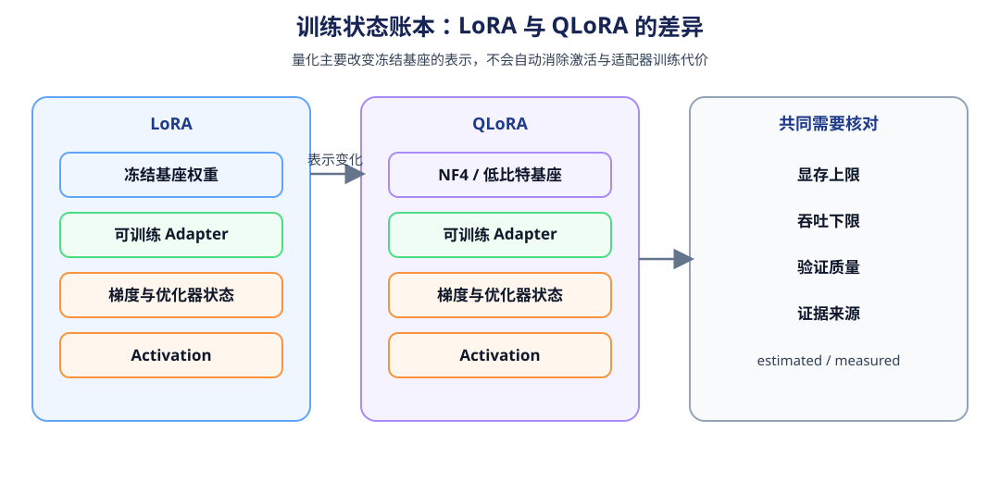
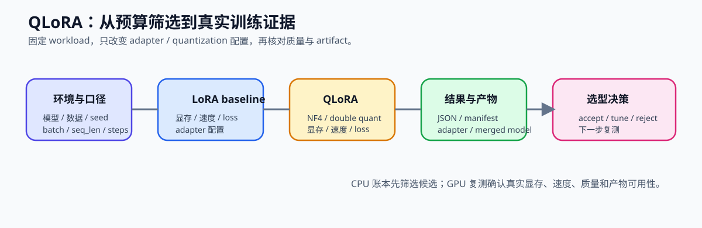

# 65. QLoRA Selection Project | QLoRA 选型项目

**难度：** Hard | **环境：** CPU-first | **标签：** `量化压缩`, `QLoRA`, `选型` | **目标人群：** 项目决策练习者

> 🚀 **云端运行环境**
>
> 本章节的实战代码可以点击以下链接在免费 GPU 算力平台上直接运行：
>
> [](https://colab.research.google.com/github/datawhalechina/llm-algo-leetcode/blob/main/02_PyTorch_Algorithms/65_QLoRA_Selection_Project.ipynb)
> [](https://modelscope.cn/my/mynotebook) *(国内推荐：魔搭社区免费实例)*


---

## 本节导读

本节要求你在显存预算和质量下限明确的情况下，比较全参数、LoRA 与 QLoRA 三种方案。统一记录显存、吞吐、训练稳定性和验证质量，确认量化收益是否足以覆盖额外误差与实现成本。最终输出当前预算下的方案选择及其适用边界。

本项目聚焦 NF4/QLoRA、LoRA 参数、训练显存和验证质量，并把结果与 `40` 的权重量化机制、`66` 的浮点推理 baseline、`67` 的量化部署验证连接起来。若生成 adapter 或 merged model，必须保留 artifact 路径、revision、配置和质量记录，才能进入后续 66 → 67 对照。

**关键词：** `QLoRA`, `budget`, `memory`, `selection`, `project`

---
## 前置阅读

**导语：** 进入本项目前，先能说明 LoRA、有效 batch 和低比特权重如何组合，再在预算约束下判断是否采用 QLoRA。
- [10. LoRA Tutorial | LoRA 教程](./10_LoRA_Tutorial.md)
- [12. Gradient Accumulation | 梯度累积](./12_Gradient_Accumulation.md)
- [13. End-to-End Fine-Tuning Experiment | 端到端微调实验](./13_End_to_End_Fine_Tuning_Experiment.md)
- [26. QLoRA and 4bit Quantization | QLoRA 与 4-bit 量化](./26_QLoRA_and_4bit_Quantization.md)
---

### Step 1：明确低资源微调问题与候选方案

在给定显存上限、最低吞吐和质量下限时，先确定候选，再决定哪些方案进入实验。C0 只做 CPU 账本筛选；G0/G1 提供 LoRA 与 QLoRA 的 GPU 对照；G2 只在需要扩展比较时启用。


| 阶段 | 本节角色 | 主要回答的问题 | 输出 |
|:---|:---|:---|:---|
| C0 CPU 账本 | 规则筛选 | 哪些候选理论上满足显存、吞吐和质量门槛？ | 预算账本与可行候选 |
| G0 baseline | LoRA 对照 | 在相同 workload 下，适配器训练的真实代价是多少？ | baseline JSON |
| G1 candidate | QLoRA 对照 | NF4/QLoRA 是否减少显存且保持可接受质量？ | candidate JSON 与 adapter |
| G2 optional | 全参数或另一组 QLoRA 配置 | 额外资源或配置变化是否值得？ | 扩展对照与复测记录 |

### Step 2：固定 baseline 与预算条件

先把所有候选放在同一条起跑线上，再只改变训练方式或量化配置。全参数方案的 optimizer state 与梯度通常是主要差异来源；QLoRA 重点减少冻结基座的权重表示，但不会自动消除 activation 或 adapter 状态。



| 条件类别 | 固定或变化内容 | 记录要求 |
|:---|:---|:---|
| 固定 workload | 模型 revision、数据 split、batch、seq_len、steps、seed、评测指标 | G0/G1 必须一致 |
| 唯一变化 | LoRA / QLoRA、NF4、double quant、rank、target modules | 每轮只改变一组主要变量 |
| 预算字段 | memory_cap_mb、min_tokens_per_s、max_val_loss | 进入候选筛选前必须完整 |
| 账本对象 | 冻结权重、adapter 参数、梯度、optimizer state、activation、量化元数据 | CPU 估算统一标记为 estimated |

### Step 3：确定量化机制、指标与证据协议

最小 GPU 对照是同一模型、数据 split、dtype、batch、seq_len、steps 和 seed 下的 LoRA 与 QLoRA；显存足够时再加入全参数方案。格式加载证据和训练性能证据需要分开记录，不能用加载成功代替性能验证。

| 证据层级 | 需要记录的内容 | 能够支持的结论 |
|:---|:---|:---|
| CPU ledger | 显存对象、预算阈值、候选可行性 | 理论筛选，不代表 GPU 峰值 |
| GPU smoke | 真实加载、短训练、OOM、基础质量 | 验证链路可运行 |
| GPU measured | peak_memory、step_time、tokens/s、val_loss、软件版本 | 比较当前 workload 的真实代价 |
| artifact | model revision、adapter 配置、结果 JSON、路径 | 支持复测和后续项目接入 |

### Step 4：CPU 实验——实现账本与选型决策

先用 CPU 账本检查显存上限、吞吐下限和质量门槛，再把 GPU 实测作为独立证据补入报告。候选失败时要保留具体约束，不能只输出“不可行”。

| 结果现象 | 决策方向 | 下一步 |
|:---|:---|:---|
| 没有候选同时满足三项门槛 | reject | 调整预算、数据或训练配置 |
| QLoRA 满足门槛且显存收益明确 | accept | 进入 GPU 复测或正式训练 |
| QLoRA 质量、吞吐或显存仍有一项不稳定 | tune | 调整 rank、量化配置、batch 或 activation 策略 |

#### 题目区与测试区：实现并测试 QLoRA 选型逻辑

题目区只实现账本约束、候选失败归因和 accept / tune / reject 决策。报告需要保留预算约束、候选配置、账本估算、GPU 结果、质量判断和下一步动作。


| 产物 | 你至少要记录什么 | 作用 |
|:---|:---|:---|
| 预算账本 | 显存上限、目标吞吐、质量下限 | 固定选型边界 |
| 候选配置 | baseline / LoRA / QLoRA 的关键配置 | 保证比较口径一致 |
| 结果对比 | peak memory、step time、val loss | 统一看收益与代价 |
| 项目结论 | accept / tune / reject | 输出方案选择 |


### 参数口径说明

`memory_cap_mb` 是显存上限，`min_tokens_per_s` 是最低吞吐，`max_val_loss` 是质量上限；三者共同定义 candidate 是否可行。`bit_width`、量化格式、double quant、LoRA rank 和 target modules 属于候选配置，比较时只能改变量化/适配器变量，不能同时改变数据、训练步数和质量评测口径。

显存账本建议至少拆成：`base_weight_mb`（冻结底座）、`trainable_param_mb`（LoRA 参数）、`gradient_mb`、`optimizer_state_mb`、`activation_mb` 和 `quant_metadata_mb`。这些字段用于解释显存来源；`estimated_total_mb` 是账本估算，`peak_memory_mb` / `peak_reserved_mb` 只有在 CUDA 训练中采集后才是实测值。

```python
from typing import Dict, List

```


```python
# TODO: 完成 QLoRA 选型项目的预算检查、候选汇总和项目结论
# 设计思路：先验证测量契约，再按显存、吞吐和质量门槛筛选候选，最后形成 accept / tune / reject。
# 题目区只补全机制判断；账本字段、测试数据和流程骨架已经提供。

import math

def build_memory_ledger(base_weight_mb: float, trainable_param_mb: float, gradient_mb: float, optimizer_state_mb: float, activation_mb: float, quant_metadata_mb: float = 0.0, peak_memory_mb: float = None, peak_reserved_mb: float = None, evidence: str = 'estimated') -> Dict[str, object]:
    """汇总训练显存对象，并区分账本估算与 CUDA 峰值。"""
    values = {
        'base_weight_mb': base_weight_mb, 'trainable_param_mb': trainable_param_mb,
        'gradient_mb': gradient_mb, 'optimizer_state_mb': optimizer_state_mb,
        'activation_mb': activation_mb, 'quant_metadata_mb': quant_metadata_mb,
    }
    if any(float(value) < 0 for value in values.values()):
        raise ValueError('显存账本中的各项不能为负数。')
    estimated_total_mb = sum(float(value) for value in values.values())
    report = {**values, 'estimated_total_mb': round(estimated_total_mb, 3), 'evidence': evidence}
    if peak_memory_mb is not None:
        report['peak_memory_mb'] = float(peak_memory_mb)
        report['reconciliation_gap_mb'] = round(float(peak_memory_mb) - estimated_total_mb, 3)
    if peak_reserved_mb is not None:
        report['peak_reserved_mb'] = float(peak_reserved_mb)
    return report


def validate_qlora_candidate(candidate: Dict[str, object]) -> List[str]:
    """检查候选是否具备进入预算筛选的完整测量与证据字段。"""
    # TODO 1：逐个检查 name、strategy、quantization、evidence、memory_mb、tokens_per_s、val_loss。
    # 变量提示：required = (...)；数值字段需 finite；memory_mb / tokens_per_s 不能为负。
    raise NotImplementedError('TODO 1：请完成候选字段校验')


def validate_budget_and_quality(budget: Dict[str, float], quality_floor: Dict[str, float]) -> Dict[str, object]:
    """检查显存上限、吞吐下限和验证损失上限是否完整。"""
    # TODO 2：分别生成 budget_missing、quality_missing，再合并为 missing_keys。
    # 变量提示：memory_cap_mb / min_tokens_per_s 必须为正；max_val_loss 不能为负且必须有限。
    raise NotImplementedError('TODO 2：请完成预算与质量阈值校验')


def summarize_low_resource_candidates(candidates: List[Dict[str, object]], budget: Dict[str, float], quality_floor: Dict[str, float]) -> Dict[str, object]:
    """按显存、吞吐和验证损失筛选候选，并保留每个失败约束。"""
    # TODO 3：补全 failure_reasons 和 is_feasible；不要改变返回字段。
    # 变量提示：memory_ok、speed_ok、quality_ok、failure_reasons、quality_failed_count。
    feasible: List[Dict[str, object]] = []
    rejected: List[Dict[str, object]] = []
    quality_failed_count = 0
    for candidate in candidates:
        errors = validate_qlora_candidate(candidate)
        if errors:
            raise ValueError(f'非法 QLoRA 候选 {candidate.get("name", "unknown")}: {errors}')
        memory_ok = candidate['memory_mb'] <= budget['memory_cap_mb']
        speed_ok = candidate['tokens_per_s'] >= budget['min_tokens_per_s']
        quality_ok = candidate['val_loss'] <= quality_floor['max_val_loss']
        if not quality_ok:
            quality_failed_count += 1
        failure_reasons = []
        # TODO 3：把不满足的约束分别记录为 memory / throughput / quality。
        is_feasible = None
        # TODO 3：is_feasible = memory_ok and speed_ok and quality_ok
        if is_feasible:
            feasible.append(candidate)
        else:
            rejected.append({'name': candidate['name'], 'reasons': failure_reasons})
    feasible.sort(key=lambda item: (item['memory_mb'], -item['tokens_per_s'], item['val_loss']))
    return {
        'candidate_count': len(candidates),
        'feasible_count': len(feasible),
        'best_candidate': feasible[0]['name'] if feasible else None,
        'quality_failed_count': quality_failed_count,
        'feasible_names': [item['name'] for item in feasible],
        'rejected': rejected,
    }


def decide_qlora_project(summary: Dict[str, object]) -> Dict[str, object]:
    """根据可行候选汇总给出 QLoRA 选型结论。"""
    # TODO 4：按 feasible_count、best_candidate 和 quality_failed_count 形成决策。
    # 变量提示：无可行候选 -> reject；QLoRA 最优 -> accept；其余 -> tune。
    raise NotImplementedError('TODO 4：请完成项目决策')


```


```python
# 测试目标按机制拆分：账本、候选契约、预算门槛、失败归因、最终决策。
# 最后的集成测试只检查 baseline -> candidate -> decision 是否连通。

def test_memory_ledger_contract():
    ledger = build_memory_ledger(100.0, 10.0, 10.0, 40.0, 200.0, quant_metadata_mb=5.0, peak_memory_mb=380.0, peak_reserved_mb=420.0)
    assert ledger['estimated_total_mb'] == 365.0
    assert ledger['reconciliation_gap_mb'] == 15.0
    try:
        build_memory_ledger(-1.0, 0.0, 0.0, 0.0, 0.0)
    except ValueError:
        return
    raise AssertionError('显存账本不应接受负数')


def test_candidate_validation_contract():
    errors = validate_qlora_candidate({'name': 'broken', 'memory_mb': -1})
    assert 'missing:strategy' in errors
    assert any(item.startswith('missing:') for item in errors)
    invalid = validate_qlora_candidate({
        'name': 'bad', 'strategy': 'qlora', 'quantization': 'nf4', 'evidence': 'estimated',
        'memory_mb': float('nan'), 'tokens_per_s': 1.0, 'val_loss': 1.0,
    })
    assert 'non_finite:memory_mb' in invalid


def test_budget_quality_contract():
    check = validate_budget_and_quality(
        {'memory_cap_mb': 12000.0, 'min_tokens_per_s': 18.0},
        {'max_val_loss': 1.20},
    )
    assert check['is_valid'] is True
    assert check['missing_keys'] == []
    invalid = validate_budget_and_quality({'memory_cap_mb': 'nan'}, {'max_val_loss': 1.20})
    assert invalid['is_valid'] is False


def _selection_fixtures():
    return [
        {'name': 'full_ft', 'strategy': 'full_ft', 'quantization': 'none', 'evidence': 'estimated', 'memory_mb': 22000.0, 'tokens_per_s': 10.0, 'val_loss': 1.05},
        {'name': 'lora', 'strategy': 'lora', 'quantization': 'none', 'evidence': 'estimated', 'memory_mb': 14500.0, 'tokens_per_s': 20.0, 'val_loss': 1.10},
        {'name': 'qlora', 'strategy': 'qlora', 'quantization': 'nf4', 'evidence': 'estimated', 'memory_mb': 9800.0, 'tokens_per_s': 19.0, 'val_loss': 1.16},
    ]


def test_candidate_summary_contract():
    summary = summarize_low_resource_candidates(
        _selection_fixtures(),
        {'memory_cap_mb': 12000.0, 'min_tokens_per_s': 18.0},
        {'max_val_loss': 1.20},
    )
    assert summary['feasible_count'] == 1
    assert summary['best_candidate'] == 'qlora'
    assert summary['rejected'][0]['name'] == 'full_ft'
    assert set(summary['rejected'][0]['reasons']) == {'memory', 'throughput'}


def test_decision_contract():
    summary = summarize_low_resource_candidates(
        _selection_fixtures(),
        {'memory_cap_mb': 12000.0, 'min_tokens_per_s': 18.0},
        {'max_val_loss': 1.20},
    )
    assert decide_qlora_project(summary)['decision'] == 'accept'
    tune_summary = summarize_low_resource_candidates(
        [
            {'name': 'lora', 'strategy': 'lora', 'quantization': 'none', 'evidence': 'estimated', 'memory_mb': 11000.0, 'tokens_per_s': 19.0, 'val_loss': 1.10},
            {'name': 'qlora', 'strategy': 'qlora', 'quantization': 'nf4', 'evidence': 'estimated', 'memory_mb': 10000.0, 'tokens_per_s': 20.0, 'val_loss': 1.28},
        ],
        {'memory_cap_mb': 12000.0, 'min_tokens_per_s': 18.0},
        {'max_val_loss': 1.20},
    )
    assert decide_qlora_project(tune_summary)['decision'] == 'tune'
    hard_summary = summarize_low_resource_candidates(
        [
            {'name': 'lora', 'strategy': 'lora', 'quantization': 'none', 'evidence': 'estimated', 'memory_mb': 13000.0, 'tokens_per_s': 17.0, 'val_loss': 1.18},
            {'name': 'qlora', 'strategy': 'qlora', 'quantization': 'nf4', 'evidence': 'estimated', 'memory_mb': 11000.0, 'tokens_per_s': 19.0, 'val_loss': 1.28},
        ],
        {'memory_cap_mb': 12000.0, 'min_tokens_per_s': 18.0},
        {'max_val_loss': 1.20},
    )
    assert decide_qlora_project(hard_summary)['decision'] == 'reject'


def test_qlora_selection_integration():
    budget = {'memory_cap_mb': 12000.0, 'min_tokens_per_s': 18.0}
    quality_floor = {'max_val_loss': 1.20}
    check = validate_budget_and_quality(budget, quality_floor)
    assert check['is_valid']
    summary = summarize_low_resource_candidates(_selection_fixtures(), budget, quality_floor)
    decision = decide_qlora_project(summary)
    assert decision['decision'] in {'accept', 'tune', 'reject'}


def run_qlora_selection_tests():
    for test in (
        test_memory_ledger_contract,
        test_candidate_validation_contract,
        test_budget_quality_contract,
        test_candidate_summary_contract,
        test_decision_contract,
        test_qlora_selection_integration,
    ):
        test()
    print('✅ QLoRA 选型机制测试通过：账本、候选契约、预算门槛、失败归因与决策均已验证。')


run_qlora_selection_tests()

```

🛑 **STOP HERE** 🛑

## 参考代码与解析

### 代码


```python
import math

def build_memory_ledger(base_weight_mb: float, trainable_param_mb: float, gradient_mb: float, optimizer_state_mb: float, activation_mb: float, quant_metadata_mb: float = 0.0, peak_memory_mb: float = None, peak_reserved_mb: float = None, evidence: str = 'estimated') -> Dict[str, object]:
    """汇总训练显存对象，并区分估算值与 CUDA 峰值。"""
    values = {
        'base_weight_mb': base_weight_mb, 'trainable_param_mb': trainable_param_mb,
        'gradient_mb': gradient_mb, 'optimizer_state_mb': optimizer_state_mb,
        'activation_mb': activation_mb, 'quant_metadata_mb': quant_metadata_mb,
    }
    if any(float(value) < 0 for value in values.values()):
        raise ValueError('显存账本中的各项不能为负数。')
    estimated_total_mb = sum(float(value) for value in values.values())
    report = {**values, 'estimated_total_mb': round(estimated_total_mb, 3), 'evidence': evidence}
    if peak_memory_mb is not None:
        report['peak_memory_mb'] = float(peak_memory_mb)
        report['reconciliation_gap_mb'] = round(float(peak_memory_mb) - estimated_total_mb, 3)
    if peak_reserved_mb is not None:
        report['peak_reserved_mb'] = float(peak_reserved_mb)
    return report


# TODO 1：检查候选字段，避免无效测量进入排序
def validate_qlora_candidate(candidate: Dict[str, object]) -> List[str]:
    errors = []
    required = ('name', 'strategy', 'quantization', 'evidence', 'memory_mb', 'tokens_per_s', 'val_loss')
    for key in required:
        if key not in candidate:
            errors.append(f'missing:{key}')
    if errors:
        return errors
    for key in ('memory_mb', 'tokens_per_s', 'val_loss'):
        try:
            value = float(candidate[key])
        except (TypeError, ValueError):
            errors.append(f'non_numeric:{key}')
            continue
        if not math.isfinite(value):
            errors.append(f'non_finite:{key}')
        if key in ('memory_mb', 'tokens_per_s') and value < 0:
            errors.append(f'negative:{key}')
    for key in ('strategy', 'quantization', 'evidence'):
        if not str(candidate[key]).strip():
            errors.append(f'empty:{key}')
    return errors


# TODO 2：检查预算与质量下限
def validate_budget_and_quality(budget: Dict[str, float], quality_floor: Dict[str, float]) -> Dict[str, object]:
    required_budget_keys = ['memory_cap_mb', 'min_tokens_per_s']
    required_quality_keys = ['max_val_loss']
    missing_keys = [key for key in required_budget_keys if key not in budget]
    missing_keys += [key for key in required_quality_keys if key not in quality_floor]
    for key in required_budget_keys:
        if key in budget:
            try:
                value = float(budget[key])
            except (TypeError, ValueError):
                missing_keys.append(f'non_numeric:{key}')
                continue
            if not math.isfinite(value) or value <= 0:
                missing_keys.append(f'invalid:{key}')
    if 'max_val_loss' in quality_floor:
        try:
            value = float(quality_floor['max_val_loss'])
        except (TypeError, ValueError):
            missing_keys.append('non_numeric:max_val_loss')
        else:
            if not math.isfinite(value) or value < 0:
                missing_keys.append('invalid:max_val_loss')
    return {'is_valid': len(missing_keys) == 0, 'missing_keys': missing_keys}


# TODO 3：汇总低资源微调候选
def summarize_low_resource_candidates(candidates: List[Dict[str, object]], budget: Dict[str, float], quality_floor: Dict[str, object]) -> Dict[str, object]:
    feasible: List[Dict[str, object]] = []
    rejected: List[Dict[str, object]] = []
    quality_failed_count = 0
    for candidate in candidates:
        errors = validate_qlora_candidate(candidate)
        if errors:
            raise ValueError(f'非法 QLoRA 候选 {candidate.get("name", "unknown")}: {errors}')
        memory_ok = candidate['memory_mb'] <= budget['memory_cap_mb']
        speed_ok = candidate['tokens_per_s'] >= budget['min_tokens_per_s']
        quality_ok = candidate['val_loss'] <= quality_floor['max_val_loss']
        if not quality_ok:
            quality_failed_count += 1
        failure_reasons = []
        if not memory_ok:
            failure_reasons.append('memory')
        if not speed_ok:
            failure_reasons.append('throughput')
        if not quality_ok:
            failure_reasons.append('quality')
        is_feasible = memory_ok and speed_ok and quality_ok
        if is_feasible:
            feasible.append(candidate)
        else:
            rejected.append({'name': candidate['name'], 'reasons': failure_reasons})
    feasible.sort(key=lambda x: (x['memory_mb'], -x['tokens_per_s'], x['val_loss']))
    return {
        'candidate_count': len(candidates), 'feasible_count': len(feasible),
        'best_candidate': feasible[0]['name'] if feasible else None,
        'quality_failed_count': quality_failed_count,
        'feasible_names': [item['name'] for item in feasible],
        'rejected': rejected,
    }


# TODO 4：输出项目结论
def decide_qlora_project(summary: Dict[str, object]) -> Dict[str, object]:
    feasible_count = summary['feasible_count']
    best_candidate = summary['best_candidate']
    quality_failed_count = summary['quality_failed_count']
    if feasible_count == 0:
        return {'decision': 'reject', 'reason': 'no_candidate_meets_budget_and_quality', 'next_action': 'relax_budget_or_improve_quality'}
    if best_candidate == 'qlora':
        return {'decision': 'accept', 'reason': 'qlora_is_best_feasible_option', 'next_action': 'promote_to_training_run'}
    if quality_failed_count > 0:
        return {'decision': 'tune', 'reason': 'qlora_needs_rank_or_quant_tuning', 'next_action': 'adjust_rank_or_quantization_bits'}
    return {'decision': 'tune', 'reason': 'qlora_not_best_under_current_budget', 'next_action': 'revisit_target_modules_or_batch_plan'}


```

### 解析

这一页保留 `4` 个核心 TODO：候选校验、预算检查、候选汇总和项目结论。它不要求把量化训练过程重写一遍，而是要求把低资源微调的预算约束收成清晰的选型判断。

**1. TODO 1：检查候选字段**
- **实现方式**：检查候选名称、显存、吞吐和验证损失是否存在且可比较。
- **关键点**：缺少真实测量的候选不能静默进入排序。

**2. TODO 2：检查预算与质量下限**
- **实现方式**：先把显存上限、吞吐下限和验证损失上限检查齐，再进入方案比较。
- **关键点**：没有统一预算口径时，候选方案的显存或吞吐比较都没有解释力。
- **项目意义**：这一步把 `65` 固定成预算约束下的选型页，而不是泛量化实验页。

**3. TODO 3：汇总低资源微调候选**
- **实现方式**：按显存、吞吐和验证损失统一过滤候选，再选出最省显存的可行方案。
- **关键点**：QLoRA 只有在质量和吞吐都没跌出边界时，显存收益才有意义。
- **项目意义**：这一步把 `10 / 40 / 41` 的机制知识收成真正可比较的工程候选。

**4. TODO 4：输出项目结论**
- **实现方式**：把候选可行性和最优方案统一收成 `accept / tune / reject`。
- **关键点**：项目结论必须回答“当前预算下 QLoRA 是否值得继续采用”，而不是只输出一个候选名字。
- **项目意义**：这一步把 `65` 收成低资源微调路线中的正式选型项目。

#### Step 4 产物导出与 artifact manifest
默认关闭。完成预算、吞吐和质量筛选后，再导出 QLoRA 选型报告。报告模板见 `docs/verification/fine_tuning_projects.md`。

导出的 `65_qlora_artifact_manifest.json` 是后续项目的输入契约：它描述 adapter / merged model 是否存在、基于哪个模型版本、使用什么量化与 adapter 配置，以及质量和证据是否齐全；它不替代 66 的推理 baseline，也不把 CPU 估算写成 GPU 实测。66/67 读取 manifest 时，遇到 `pending_artifact_export` 或缺少路径，应停止自动加载并要求补充 artifact。

```python
import json

try:
    from tools.fine_tuning_project_runtime import preflight_runtime, runtime_snapshot, save_project_report, validate_project_config
except ModuleNotFoundError:
    preflight_runtime = lambda torch_module, run_mode='cpu', **kwargs: {'run_mode': run_mode, 'ready': False, 'reasons': ['共享运行时工具不可用']}
    runtime_snapshot = lambda: {'device': 'unknown'}
    validate_project_config = lambda config: []
    save_project_report = None
RUN_MODE = 'cpu'  # cpu / dry_run / real_gpu；真实 QLoRA 训练作为后续扩展。
PROJECT_ID = '65_qlora_selection'
PROJECT_RESULT_PATH = 'benchmarks/results/65_qlora_selection.json'
ARTIFACT_MANIFEST_PATH = 'benchmarks/results/65_qlora_artifact_manifest.json'
PROJECT_CONFIG = {'project': PROJECT_ID, 'model': 'template', 'dtype': 'fp32', 'batch_size': 1, 'seq_len': 128, 'steps': 1, 'seed': 42, 'run_mode': RUN_MODE, 'result_json': PROJECT_RESULT_PATH, 'artifact_manifest': ARTIFACT_MANIFEST_PATH}
RUN_PROJECT_EXPORT = False  # True 只保存已完成的 QLoRA 选型报告。
config_errors = validate_project_config(PROJECT_CONFIG)
if config_errors:
    raise ValueError('; '.join(config_errors))
print('runtime:', runtime_snapshot())
if RUN_MODE == 'dry_run':
    import importlib.util
    try:
        import torch
        preflight = preflight_runtime(torch, run_mode='dry_run')
    except ImportError as exc:
        preflight = {'run_mode': 'dry_run', 'ready': False, 'reasons': [f'缺少 torch：{exc}']}
    preflight['bitsandbytes_available'] = importlib.util.find_spec('bitsandbytes') is not None
    print('dry_run:', preflight)
if RUN_PROJECT_EXPORT:
    if 'PROJECT_REPORT' not in globals():
        raise RuntimeError('请先组装完整的 PROJECT_REPORT')
    PROJECT_REPORT.setdefault('project', PROJECT_ID)
    PROJECT_REPORT.setdefault('config', PROJECT_CONFIG)
    PROJECT_REPORT.setdefault('environment', runtime_snapshot())
    PROJECT_REPORT.setdefault('artifact_manifest', {
        'schema_version': 'qlora-artifact/v1',
        'project': PROJECT_ID,
        'artifact_type': 'adapter_or_merged_model',
        'artifact_path': (PROJECT_REPORT.get('artifact_path') or PROJECT_REPORT.get('adapter_path') or PROJECT_REPORT.get('merged_model_path')),
        'artifact_format': PROJECT_REPORT.get('artifact_format') or ('adapter' if PROJECT_REPORT.get('adapter_path') else ('merged_model' if PROJECT_REPORT.get('merged_model_path') else None)),
        'model_revision': PROJECT_REPORT.get('model_revision') or PROJECT_CONFIG.get('model'),
        'tokenizer_path': PROJECT_REPORT.get('tokenizer_path') or PROJECT_REPORT.get('tokenizer'),
        'quantization_config': PROJECT_REPORT.get('quantization_config'),
        'adapter_config': PROJECT_REPORT.get('adapter_config'),
        'quality_report': PROJECT_REPORT.get('quality'),
        'result_json': PROJECT_RESULT_PATH,
        'evidence_level': PROJECT_REPORT.get('evidence_level') or 'cpu_selection',
        'status': 'ready' if (PROJECT_REPORT.get('artifact_path') or PROJECT_REPORT.get('adapter_path') or PROJECT_REPORT.get('merged_model_path')) else 'pending_artifact_export',
        'next_project': '66_baseline_then_67_deployment',
    })
    save_project_report(PROJECT_RESULT_PATH, PROJECT_REPORT)
    from pathlib import Path
    Path(ARTIFACT_MANIFEST_PATH).parent.mkdir(parents=True, exist_ok=True)
    Path(ARTIFACT_MANIFEST_PATH).write_text(json.dumps(PROJECT_REPORT['artifact_manifest'], ensure_ascii=False, indent=2), encoding='utf-8')

```

### Step 5（可选）：GPU/QLoRA 实验——验证真实训练代价

#### 5.1 环境、模型与固定 workload



固定模型、数据 split、dtype、batch、seq_len、steps、seed 和评测指标；LoRA 与 QLoRA 只改变 adapter / quantization 配置。

| 实验要素 | LoRA baseline | QLoRA candidate |
|---|---|---|
| 模型与数据 | 固定 | 与 baseline 相同 |
| 训练口径 | batch、seq_len、steps、seed 固定 | 与 baseline 相同 |
| 变化变量 | LoRA adapter | NF4 / double quant / adapter 配置 |
| 评测字段 | peak memory、step time、tokens/s、val loss | 与 baseline 相同 |

#### 5.2 环境启动检查

确认 CUDA、GPU、PyTorch、Transformers、PEFT、bitsandbytes 和数据来源可用，并记录实际 dtype、软件版本与显存容量。

#### 5.3 配置 LoRA/QLoRA 与数据

配置 `rank`、`alpha`、`target_modules`、NF4、double quant、compute dtype 和数据 split；把配置写入实验 JSON，避免只在 notebook 状态中保留。

#### 5.4 执行训练并保存 JSON

先运行 LoRA baseline，再只改变量化配置运行 QLoRA。每组记录 `peak_memory`、`peak_reserved`、`step_time`、`tokens_per_s`、`train_loss`、`val_loss` 和 OOM 状态。

#### 5.5 实测结果、artifact manifest 与复测记录

训练结束后保存 adapter 或 merged model，并记录模型 revision、adapter config、artifact path、量化格式、质量结果和 evidence level。

| 实验组 | GPU / 显存 | model revision | workload / JSON | quant / adapter | peak memory | step time | tokens/s | val loss | OOM / failure | artifact | evidence level | decision |
|---|---|---|---|---|---:|---:|---:|---:|---|---|---|---|
| LoRA baseline | 待填写 | 待填写 | 固定 workload / result JSON | LoRA | 待填写 | 待填写 | 待填写 | 待填写 | 否/待确认 | adapter/merged path | 待填写 | 待判断 |
| QLoRA candidate | 待填写 | 待填写 | 与 baseline 相同 / result JSON | NF4 + LoRA | 待填写 | 待填写 | 待填写 | 待填写 | 否/待确认 | adapter/merged path | 待填写 | 待判断 |

#### 5.6 解释结果与形成决策

同时比较显存、速度、训练稳定性、验证质量和 artifact 可用性，再输出 `accept / tune / reject`。只有路径、配置、质量和结果字段齐全时，adapter manifest 才能交给后续 66/67 使用。

```python
import json
import importlib.metadata as metadata
import platform
from datetime import datetime
from pathlib import Path

# 5.1：环境、模型与固定 workload；默认关闭，避免无 GPU 环境误启动。
RUN_GPU_EXPERIMENT = False
SAVE_ARTIFACTS = True
MODEL_ID = 'Qwen/Qwen2.5-0.5B-Instruct'
MAX_LENGTH = 128
MAX_STEPS = 3
SEED = 42
QUALITY_TOLERANCE = 0.10
RESULT_PATH = f'benchmarks/results/65_qlora_gpu_{datetime.now().strftime("%Y%m%d_%H%M%S")}.json'
ARTIFACT_MANIFEST_PATH = 'benchmarks/results/65_qlora_artifact_manifest.json'

TOY_TEXTS = [
    'Explain why a smaller batch can reduce memory but change the optimization dynamics.',
    'Compare LoRA and QLoRA when the quality floor and memory budget are fixed.',
    'Describe how NF4 changes the frozen base model while the adapter remains trainable.',
    'Give one reason to inspect validation loss after a low-bit fine-tuning run.',
]

# 5.2：环境启动检查；除了 CUDA，还记录可复现实验的运行时版本。
def _package_version(name):
    try:
        return metadata.version(name)
    except metadata.PackageNotFoundError:
        return 'not-installed'

def _require_gpu_dependencies():
    import torch
    if not torch.cuda.is_available():
        raise RuntimeError('未检测到 CUDA GPU；请保持 RUN_GPU_EXPERIMENT=False，先完成 CPU 实验。')
    from transformers import AutoModelForCausalLM, AutoTokenizer, Trainer, TrainingArguments
    from peft import LoraConfig, get_peft_model
    return torch, AutoModelForCausalLM, AutoTokenizer, Trainer, TrainingArguments, LoraConfig, get_peft_model

def _environment_snapshot(torch):
    return {
        'gpu': torch.cuda.get_device_name(0), 'torch': torch.__version__,
        'cuda': torch.version.cuda, 'python': platform.python_version(),
        'transformers': _package_version('transformers'), 'peft': _package_version('peft'),
        'bitsandbytes': _package_version('bitsandbytes'),
    }

def _tokenize_examples(tokenizer):
    rows = []
    for text in TOY_TEXTS:
        item = tokenizer(text, truncation=True, max_length=MAX_LENGTH, add_special_tokens=True)
        item['labels'] = list(item['input_ids'])
        rows.append(item)
    return rows

class _ListDataset:
    def __init__(self, rows): self.rows = rows
    def __len__(self): return len(self.rows)
    def __getitem__(self, index): return self.rows[index]

def _collate(tokenizer, rows):
    batch = tokenizer.pad(rows, padding=True, return_tensors='pt')
    batch['labels'] = batch['input_ids'].clone()
    batch['labels'][batch['attention_mask'] == 0] = -100
    return batch

# 5.3：配置 LoRA/QLoRA 与数据；baseline/candidate 只改变量化路径。
def run_qlora_variant(label, qlora, torch, AutoModelForCausalLM, AutoTokenizer, Trainer, TrainingArguments, LoraConfig, get_peft_model):
    import time
    from transformers import BitsAndBytesConfig
    from peft import prepare_model_for_kbit_training
    torch.manual_seed(SEED)
    tokenizer = AutoTokenizer.from_pretrained(MODEL_ID)
    if tokenizer.pad_token is None: tokenizer.pad_token = tokenizer.eos_token
    compute_dtype = torch.bfloat16 if torch.cuda.is_bf16_supported() else torch.float16
    model_kwargs = {'torch_dtype': compute_dtype, 'device_map': 'auto'}
    if qlora:
        model_kwargs['quantization_config'] = BitsAndBytesConfig(
            load_in_4bit=True, bnb_4bit_quant_type='nf4',
            bnb_4bit_use_double_quant=True, bnb_4bit_compute_dtype=compute_dtype,
        )
    model = AutoModelForCausalLM.from_pretrained(MODEL_ID, **model_kwargs)
    if qlora: model = prepare_model_for_kbit_training(model)
    model = get_peft_model(model, LoraConfig(
        r=8, lora_alpha=16, lora_dropout=0.05, bias='none',
        target_modules=['q_proj', 'k_proj', 'v_proj', 'o_proj'], task_type='CAUSAL_LM',
    ))
    rows = _tokenize_examples(tokenizer)
    dataset, eval_dataset = _ListDataset(rows[:3]), _ListDataset(rows[3:])
    args = TrainingArguments(
        output_dir=f'/tmp/65_{label}', per_device_train_batch_size=1,
        gradient_accumulation_steps=1, learning_rate=2e-4, max_steps=MAX_STEPS,
        logging_steps=1, save_strategy='no', report_to='none', seed=SEED,
        remove_unused_columns=False, fp16=compute_dtype == torch.float16,
        bf16=compute_dtype == torch.bfloat16,
    )
    trainer = Trainer(model=model, args=args, train_dataset=dataset, eval_dataset=eval_dataset,
                      data_collator=lambda batch_rows: _collate(tokenizer, batch_rows))
    torch.cuda.empty_cache(); torch.cuda.reset_peak_memory_stats()
    start = time.perf_counter(); trainer.train(); torch.cuda.synchronize()
    elapsed = time.perf_counter() - start
    eval_report = trainer.evaluate()
    logs = [item for item in trainer.state.log_history if 'loss' in item]
    artifact_path = Path(f'benchmarks/results/65_{label}_adapter')
    if SAVE_ARTIFACTS:
        artifact_path.mkdir(parents=True, exist_ok=True); model.save_pretrained(artifact_path)
    return {
        'label': label, 'model_id': MODEL_ID, 'quantization': 'nf4' if qlora else 'none',
        'compute_dtype': str(compute_dtype), 'steps': MAX_STEPS, 'seed': SEED,
        'step_time_s': round(elapsed / max(MAX_STEPS, 1), 4),
        'tokens_per_s': round(sum(len(x['input_ids']) for x in rows[:3]) / max(elapsed, 1e-9), 3),
        'peak_memory_mb': round(torch.cuda.max_memory_allocated() / 2**20, 3),
        'peak_memory_scope': 'train_and_eval',
        'peak_reserved_mb': round(torch.cuda.max_memory_reserved() / 2**20, 3),
        'last_train_loss': logs[-1].get('loss') if logs else None,
        'val_loss': eval_report.get('eval_loss'),
        'artifact_path': str(artifact_path) if SAVE_ARTIFACTS else None,
        'evidence_level': 'gpu_smoke_single_run',
    }

def _compare_reports(baseline, candidate):
    baseline_loss, candidate_loss = baseline.get('val_loss'), candidate.get('val_loss')
    quality_ok = baseline_loss is not None and candidate_loss is not None and candidate_loss <= baseline_loss + QUALITY_TOLERANCE
    memory_saved = candidate['peak_memory_mb'] < baseline['peak_memory_mb']
    decision = 'accept' if quality_ok and memory_saved else 'tune'
    return {
        'peak_memory_delta_mb': round(candidate['peak_memory_mb'] - baseline['peak_memory_mb'], 3),
        'step_time_delta_s': round(candidate['step_time_s'] - baseline['step_time_s'], 4),
        'tokens_per_s_delta': round(candidate['tokens_per_s'] - baseline['tokens_per_s'], 3),
        'val_loss_delta': round(candidate_loss - baseline_loss, 6) if quality_ok else None,
        'quality_tolerance': QUALITY_TOLERANCE, 'quality_ok': quality_ok,
        'memory_saved': memory_saved, 'decision': decision,
        'next_action': 'promote_adapter_for_full_run' if decision == 'accept' else 'tune_rank_data_or_steps',
    }

# 5.4–5.6：执行、保存 JSON、汇总对照并形成决策。
if RUN_GPU_EXPERIMENT:
    try:
        deps = _require_gpu_dependencies(); torch = deps[0]
        environment = _environment_snapshot(torch)
        reports = [run_qlora_variant('lora_baseline', False, *deps), run_qlora_variant('qlora_candidate', True, *deps)]
        comparison = _compare_reports(reports[0], reports[1])
        config = {'model_id': MODEL_ID, 'max_length': MAX_LENGTH, 'max_steps': MAX_STEPS, 'seed': SEED,
                  'batch_size': 1, 'gradient_accumulation_steps': 1, 'learning_rate': 2e-4,
                  'lora_r': 8, 'lora_alpha': 16, 'target_modules': ['q_proj', 'k_proj', 'v_proj', 'o_proj'],
                  'qlora_format': 'NF4 + double quant'}
        payload = {'schema_version': 'qlora-benchmark/v1', 'project': '65',
                   'json_path': RESULT_PATH,
                   'workload': {'model_id': MODEL_ID, 'max_length': MAX_LENGTH,
                                'steps': MAX_STEPS, 'seed': SEED, 'train_examples': len(TOY_TEXTS) - 1,
                                'eval_examples': 1},
                   'baseline': reports[0], 'candidate': reports[1],
                   'environment': environment, 'config': config, 'reports': reports,
                   'comparison': comparison, 'artifact_manifest': ARTIFACT_MANIFEST_PATH,
                   'failure': None, 'evidence_level': 'gpu_smoke_single_run',
                   'decision': comparison['decision']}
        Path(RESULT_PATH).parent.mkdir(parents=True, exist_ok=True)
        Path(RESULT_PATH).write_text(json.dumps(payload, ensure_ascii=False, indent=2), encoding='utf-8')
        manifest = {'schema_version': 'qlora-artifact/v2', 'project': '65', 'model_id': MODEL_ID,
                    'baseline_result': reports[0], 'candidate_result': reports[1],
                    'artifact_path': reports[-1]['artifact_path'], 'artifact_format': 'peft_adapter',
                    'adapter_config': {'r': 8, 'lora_alpha': 16, 'target_modules': ['q_proj', 'k_proj', 'v_proj', 'o_proj']},
                    'result_json': RESULT_PATH, 'comparison': comparison, 'status': 'ready',
                    'evidence_level': 'gpu_smoke_single_run'}
        Path(ARTIFACT_MANIFEST_PATH).write_text(json.dumps(manifest, ensure_ascii=False, indent=2), encoding='utf-8')
        print(json.dumps({'result_json': RESULT_PATH, 'artifact_manifest': ARTIFACT_MANIFEST_PATH, 'decision': comparison['decision']}, ensure_ascii=False, indent=2))
    except Exception as exc:
        failure = {'schema_version': 'qlora-benchmark/v1', 'project': '65',
                   'json_path': RESULT_PATH, 'workload': {'model_id': MODEL_ID, 'max_length': MAX_LENGTH, 'steps': MAX_STEPS},
                   'status': 'failed', 'baseline': None, 'candidate': None,
                   'error_type': type(exc).__name__, 'error': str(exc), 'evidence_level': 'gpu_attempt_failed'}
        Path(RESULT_PATH).parent.mkdir(parents=True, exist_ok=True)
        Path(RESULT_PATH).write_text(json.dumps(failure, ensure_ascii=False, indent=2), encoding='utf-8')
        raise
else:
    print('GPU runner 已关闭；设置 RUN_GPU_EXPERIMENT=True 后再运行。')

```

## 相关阅读

以下资料按“低比特微调论文 → 开源实现 → 量化部署项目”排列，用于把预算、质量和低比特 kernel 约束连接到真实部署。

- [QLoRA 原论文：Efficient Finetuning of Quantized Language Models](https://arxiv.org/abs/2305.14314)
- [bitsandbytes 官方仓库](https://github.com/bitsandbytes-foundation/bitsandbytes)
- [67. Quantized Inference and Deployment | 量化推理与部署](./67_Quantized_Inference_and_Deployment.md)
- [75. Memory Budget Compression Project | 显存预算压缩项目](./75_Memory_Budget_Compression_Project.md)
