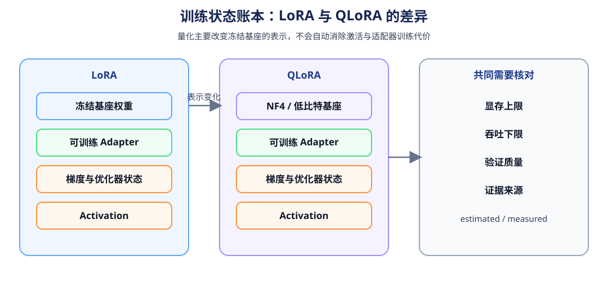
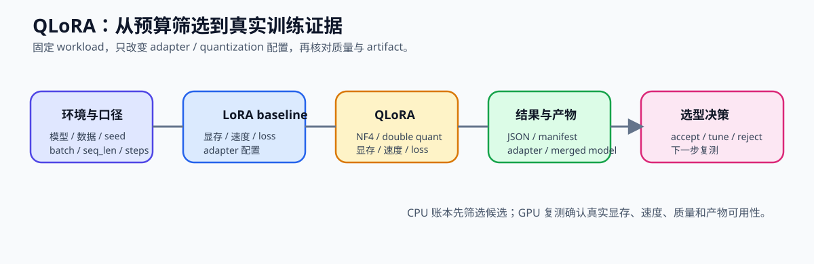

# 65. QLoRA Selection Project | QLoRA 选型项目

**难度：** Hard | **环境：** CPU-first | **标签：** `量化压缩`, `QLoRA`, `选型` | **目标人群：** 项目决策练习者

> 🚀 **云端运行环境**
>
> 本章节的实战代码可以点击以下链接在免费 GPU 算力平台上直接运行：
>
> [](https://colab.research.google.com/github/datawhalechina/llm-algo-leetcode/blob/main/02_PyTorch_Algorithms/65_QLoRA_Selection_Project.ipynb)
> [](https://modelscope.cn/my/mynotebook) *(国内推荐：魔搭社区免费实例)*


---

## 本节导读

当显存有限、又不能明显牺牲验证质量时，BF16 LoRA 和 NF4 QLoRA 应该怎样选择？本节在同一模型、数据、有效 batch 与评测口径下，对照峰值显存、可行规模、训练速度、验证损失和 adapter 产物，最后给出当前预算下的选型建议。

CPU 部分先筛选候选方案；可选 GPU 实验再记录真实训练代价和 adapter 产物，供后续实验复测模型来源。模型的 Norm、Attention、FFN 和权重共享配置应随 artifact 一起记录，因为它们会影响可训练参数、显存账本和结果复现；本节仍以低资源微调选型为主，而不是替代架构选型项目。

**关键词：** `QLoRA`, `budget`, `memory`, `selection`, `project`

---
## 前置阅读

**导语：** 进入本项目前，先能说明 LoRA、有效 batch 和低比特权重如何组合，再在预算约束下判断是否采用 QLoRA。
- [10. LoRA Tutorial | LoRA 教程](./10_LoRA_Tutorial.md)
- [12. Gradient Accumulation | 梯度累积](./12_Gradient_Accumulation.md)
- [13. End-to-End Fine-Tuning Experiment | 端到端微调实验](./13_End_to_End_Fine_Tuning_Experiment.md)
- [26. QLoRA and 4bit Quantization | QLoRA 与 4-bit 量化](./26_QLoRA_and_4bit_Quantization.md)
---

### Step 1：理解低资源微调的策略组合

本节的核心对照是同一 LoRA adapter 在 BF16 冻结底座和 NF4 冻结底座上的训练代价。rank、target modules、数据和评测不变时，显存、可行规模、训练速度和验证质量的变化才可以归因于低比特底座。

| 决策层 | 需要组合的因素 | 要回答的问题 |
|:---|:---|:---|
| 训练路径 | BF16 LoRA baseline、NF4 QLoRA candidate | adapter 的更新路径是否相同？ |
| 冻结底座表示 | BF16、NF4、double quant | 表示压缩能释放多少训练显存？ |
| adapter 配置 | rank、alpha、target modules（固定） | 排除 adapter 容量变化对结论的干扰 |
| workload | batch、seq_len、steps、数据 split | 当前任务的成本和质量如何测量？ |
| 选型门槛 | 显存上限、吞吐下限、质量下限 | 哪些候选值得进入复测？ |


### Step 2：固定训练任务，逐项比较候选

先固定模型版本、数据、随机种子、训练步数和评测方式；每轮只改变一种候选策略。这样，显存或质量变化才可以追溯到 LoRA、QLoRA 或 adapter 配置，而不是来自不同 workload。

| 信息类别 | 固定内容 | 每轮可改变的候选策略 | 用途 |
|:---|:---|:---|:---|
| 模型与数据 | model revision、tokenizer、data split、seed | 不变 | 保证质量结果可比较 |
| 训练口径 | steps、batch、seq_len、评测指标 | 不变 | 保证成本口径可比较 |
| 训练路径 | adapter、optimizer、学习率、有效 batch | 不变 | 保证更新语义可比较 |
| 冻结底座表示 | BF16 LoRA | NF4 + double quant QLoRA | 比较低比特表示与可训练容量 |
| 选型门槛 | memory cap、min tokens/s、max val loss | 不变 | 判断候选是否可行 |

### Step 3：从资源账本走到真实训练证据

先用资源账本排除明显无法运行的方案，再比较候选的速度和验证质量；GPU 复测负责确认真实峰值显存、训练时间和 adapter 是否能保存。下表也给出代码中常见参数的含义，避免把 CPU 估算当成 GPU 实测。

| 证据层级 | 记录内容 | 用于判断什么 |
|:---|:---|:---|
| CPU 账本 | 冻结权重、adapter、梯度、optimizer、activation、量化元数据 | 理论资源是否能容纳候选 |
| 候选门槛 | `memory_cap_mb`、`min_tokens_per_s`、`max_val_loss`、可行 micro-batch | 显存、速度、质量与规模能否同时接受 |
| GPU smoke | 真实加载、短训练、OOM、基本验证质量 | 训练链路是否可运行 |
| GPU measured | `peak_memory_mb`、`peak_reserved_mb`、可行 micro-batch、step time、tokens/s、val loss | 当前 workload 的真实代价 |
| artifact | model revision、adapter config、结果 JSON、保存路径 | 结果能否复测和交接 |



### Step 4（CPU 代码练习）：评估候选组合并形成选型决策

题目区先用账本候选验证“低比特底座是否值得进入真实训练”：先检查显存、速度、质量与可行规模，再比较可行候选，最后给出项目动作。真实 adapter 与结果 JSON 在 Step 5 一起保存。

| 类型 | 函数 | 学习者需要完成的内容 | 测试关注点 |
|:---|:---|:---|:---|
| 辅助函数 | `validate_qlora_candidate` / `validate_budget_and_quality` | 检查输入契约和预算字段 | 缺失、非法和非有限值 |
| TODO 1 | `candidate_passes_gates` | 组合显存、吞吐、质量与可行规模门槛 | 门槛同时通过与单项失败 |
| TODO 2 | `candidate_rank_key` | 定义可行候选的资源—规模—速度—质量排序 | 多候选的稳定排序 |
| TODO 3 | `choose_qlora_action` | 根据 QLoRA 可行性和最优性选择动作 | `accept / tune / reject` 的策略路径 |

```python
from typing import Dict, List

```


```python
# 题目区只挖空三项选型机制：门槛判断、候选排序与策略决策。
# 输入校验、失败原因和报告字段由骨架提供；每个 TODO 都能由对应测试独立验证。

import math

def build_memory_ledger(base_weight_mb: float, trainable_param_mb: float, gradient_mb: float, optimizer_state_mb: float, activation_mb: float, quant_metadata_mb: float = 0.0, peak_memory_mb: float = None, peak_reserved_mb: float = None, evidence: str = 'estimated') -> Dict[str, object]:
    """汇总训练显存对象，并区分账本估算与 CUDA 峰值。"""
    values = {
        'base_weight_mb': base_weight_mb, 'trainable_param_mb': trainable_param_mb,
        'gradient_mb': gradient_mb, 'optimizer_state_mb': optimizer_state_mb,
        'activation_mb': activation_mb, 'quant_metadata_mb': quant_metadata_mb,
    }
    if any(float(value) < 0 for value in values.values()):
        raise ValueError('显存账本中的各项不能为负数。')
    estimated_total_mb = sum(float(value) for value in values.values())
    report = {**values, 'estimated_total_mb': round(estimated_total_mb, 3), 'evidence': evidence}
    if peak_memory_mb is not None:
        report['peak_memory_mb'] = float(peak_memory_mb)
        report['reconciliation_gap_mb'] = round(float(peak_memory_mb) - estimated_total_mb, 3)
    if peak_reserved_mb is not None:
        report['peak_reserved_mb'] = float(peak_reserved_mb)
    return report

def validate_qlora_candidate(candidate: Dict[str, object]) -> List[str]:
    """检查候选是否具备进入预算筛选的完整测量与证据字段。"""
    errors = []
    required = ('name', 'strategy', 'quantization', 'evidence', 'memory_mb', 'max_micro_batch', 'tokens_per_s', 'val_loss')
    for key in required:
        if key not in candidate:
            errors.append(f'missing:{key}')
    if errors:
        return errors
    for key in ('memory_mb', 'max_micro_batch', 'tokens_per_s', 'val_loss'):
        try:
            value = float(candidate[key])
        except (TypeError, ValueError):
            errors.append(f'non_numeric:{key}')
            continue
        if not math.isfinite(value):
            errors.append(f'non_finite:{key}')
        if key in ('memory_mb', 'max_micro_batch', 'tokens_per_s') and value < 0:
            errors.append(f'negative:{key}')
    for key in ('strategy', 'quantization', 'evidence'):
        if not str(candidate[key]).strip():
            errors.append(f'empty:{key}')
    return errors

def validate_budget_and_quality(budget: Dict[str, float], quality_floor: Dict[str, float]) -> Dict[str, object]:
    """检查显存上限、吞吐下限和验证损失上限是否完整。"""
    required_budget_keys = ['memory_cap_mb', 'min_micro_batch', 'min_tokens_per_s']
    required_quality_keys = ['max_val_loss']
    missing_keys = [key for key in required_budget_keys if key not in budget]
    missing_keys += [key for key in required_quality_keys if key not in quality_floor]
    for key in required_budget_keys:
        if key in budget:
            try:
                value = float(budget[key])
            except (TypeError, ValueError):
                missing_keys.append(f'non_numeric:{key}')
                continue
            if not math.isfinite(value) or value <= 0:
                missing_keys.append(f'invalid:{key}')
    if 'max_val_loss' in quality_floor:
        try:
            value = float(quality_floor['max_val_loss'])
        except (TypeError, ValueError):
            missing_keys.append('non_numeric:max_val_loss')
        else:
            if not math.isfinite(value) or value < 0:
                missing_keys.append('invalid:max_val_loss')
    return {'is_valid': len(missing_keys) == 0, 'missing_keys': missing_keys}

def _candidate_failure_reasons(candidate: Dict[str, object], budget: Dict[str, float], quality_floor: Dict[str, float]) -> List[str]:
    """给出候选未通过的门槛；报告字段由骨架统一生成。"""
    reasons = []
    if candidate['memory_mb'] > budget['memory_cap_mb']:
        reasons.append('memory')
    if candidate['max_micro_batch'] < budget['min_micro_batch']:
        reasons.append('scale')
    if candidate['tokens_per_s'] < budget['min_tokens_per_s']:
        reasons.append('throughput')
    if candidate['val_loss'] > quality_floor['max_val_loss']:
        reasons.append('quality')
    return reasons


def candidate_passes_gates(candidate: Dict[str, object], budget: Dict[str, float], quality_floor: Dict[str, float]) -> bool:
    """判断候选是否同时通过显存、可行规模、吞吐和质量门槛。"""
    memory_ok = candidate['memory_mb'] <= budget['memory_cap_mb']
    scale_ok = candidate['max_micro_batch'] >= budget['min_micro_batch']
    throughput_ok = candidate['tokens_per_s'] >= budget['min_tokens_per_s']
    quality_ok = candidate['val_loss'] <= quality_floor['max_val_loss']
    # TODO 1（低比特训练门槛）：只有资源、规模、速度和质量同时通过，候选才可进入后续比较。
    # 变量提示：memory_ok、scale_ok、throughput_ok、quality_ok。
    raise NotImplementedError('TODO 1：请判断候选是否通过四项门槛')


def candidate_rank_key(candidate: Dict[str, object]) -> tuple[float, float, float, float]:
    """定义可行候选的比较顺序：更省显存，再更大可行规模、更高吞吐和更低损失。"""
    # TODO 2（低比特训练排序）：返回用于排序的四元组。
    # 变量提示：memory_mb 升序；max_micro_batch 降序；tokens_per_s 降序；val_loss 升序。
    raise NotImplementedError('TODO 2：请定义候选排序规则')


def choose_qlora_action(summary: Dict[str, object]) -> str:
    """根据 QLoRA 的可行性和最优性选择 accept / tune / reject。"""
    qlora_evaluation = summary.get('qlora_evaluation')
    # TODO 3（策略决策机制）：无可行候选 -> reject；QLoRA 可行且最优 -> accept；其余 -> tune。
    # 变量提示：summary['feasible_count']、summary['best_strategy']、qlora_evaluation。
    raise NotImplementedError('TODO 3：请完成 QLoRA 策略决策')


def evaluate_qlora_candidate(candidate: Dict[str, object], budget: Dict[str, float], quality_floor: Dict[str, float]) -> Dict[str, object]:
    """调用门槛机制，并由骨架生成候选评估记录。"""
    errors = validate_qlora_candidate(candidate)
    if errors:
        raise ValueError(f'非法 QLoRA 候选 {candidate.get("name", "unknown")}: {errors}')
    quality_ok = candidate['val_loss'] <= quality_floor['max_val_loss']
    return {
        'name': candidate['name'],
        'strategy': candidate['strategy'],
        'max_micro_batch': candidate['max_micro_batch'],
        'feasible': candidate_passes_gates(candidate, budget, quality_floor),
        'failure_reasons': _candidate_failure_reasons(candidate, budget, quality_floor),
        'quality_failed': not quality_ok,
    }


def summarize_low_resource_candidates(candidates: List[Dict[str, object]], budget: Dict[str, float], quality_floor: Dict[str, float]) -> Dict[str, object]:
    """汇总低比特训练候选并保留 QLoRA 对照结果；报告字段由骨架提供。"""
    evaluations = [evaluate_qlora_candidate(candidate, budget, quality_floor) for candidate in candidates]
    feasible = [candidate for candidate, evaluation in zip(candidates, evaluations) if evaluation['feasible']]
    feasible.sort(key=candidate_rank_key)
    rejected = [
        {'name': evaluation['name'], 'reasons': evaluation['failure_reasons']}
        for evaluation in evaluations if not evaluation['feasible']
    ]
    qlora_evaluation = next((item for item in evaluations if item['strategy'] == 'qlora'), None)
    return {
        'candidate_count': len(candidates),
        'feasible_count': len(feasible),
        'best_candidate': feasible[0]['name'] if feasible else None,
        'best_strategy': feasible[0]['strategy'] if feasible else None,
        'quality_failed_count': sum(item['quality_failed'] for item in evaluations),
        'feasible_names': [item['name'] for item in feasible],
        'rejected': rejected,
        'evaluations': evaluations,
        'qlora_evaluation': qlora_evaluation,
    }


def decide_qlora_project(summary: Dict[str, object]) -> Dict[str, object]:
    """将策略机制转换成项目报告；这部分不是题目挖空。"""
    decision = choose_qlora_action(summary)
    details = {
        'accept': ('qlora_is_best_feasible_option', 'promote_to_training_run'),
        'tune': ('qlora_needs_rank_or_quant_tuning', 'adjust_rank_or_quantization_bits'),
        'reject': ('no_candidate_meets_budget_and_quality', 'relax_budget_or_improve_quality'),
    }
    reason, next_action = details[decision]
    return {'decision': decision, 'reason': reason, 'next_action': next_action}

```


```python
# 测试目标：分别验证门槛组合、候选排序和项目决策；最后再检查完整链路。
# 这些测试复用题目区的输入契约与结果接口，不依赖 GPU 或真实模型加载。

def _budget():
    return {'memory_cap_mb': 12000.0, 'min_micro_batch': 1, 'min_tokens_per_s': 18.0}


def _quality_floor():
    return {'max_val_loss': 1.20}


def _selection_fixtures():
    return [
        {'name': 'lora_bf16', 'strategy': 'lora', 'quantization': 'bf16', 'evidence': 'estimated', 'memory_mb': 14500.0, 'max_micro_batch': 1, 'tokens_per_s': 20.0, 'val_loss': 1.10},
        {'name': 'qlora_nf4', 'strategy': 'qlora', 'quantization': 'nf4', 'evidence': 'estimated', 'memory_mb': 9800.0, 'max_micro_batch': 2, 'tokens_per_s': 19.0, 'val_loss': 1.16},
    ]


def test_memory_ledger_contract():
    ledger = build_memory_ledger(100.0, 10.0, 10.0, 40.0, 200.0, quant_metadata_mb=5.0, peak_memory_mb=380.0, peak_reserved_mb=420.0)
    assert ledger['estimated_total_mb'] == 365.0
    assert ledger['reconciliation_gap_mb'] == 15.0
    try:
        build_memory_ledger(-1.0, 0.0, 0.0, 0.0, 0.0)
    except ValueError:
        return
    raise AssertionError('显存账本不应接受负数')


def test_candidate_validation_contract():
    errors = validate_qlora_candidate({'name': 'broken', 'memory_mb': -1})
    assert 'missing:strategy' in errors
    invalid = validate_qlora_candidate({'name': 'bad', 'strategy': 'qlora', 'quantization': 'nf4', 'evidence': 'estimated', 'memory_mb': float('nan'), 'max_micro_batch': 1, 'tokens_per_s': 1.0, 'val_loss': 1.0})
    assert 'non_finite:memory_mb' in invalid
    assert validate_budget_and_quality(_budget(), _quality_floor())['is_valid'] is True


def test_gate_mechanism():
    qlora = _selection_fixtures()[-1]
    assert candidate_passes_gates(qlora, _budget(), _quality_floor()) is True
    too_small = {**_selection_fixtures()[0], 'memory_mb': 11000.0, 'max_micro_batch': 0}
    assert candidate_passes_gates(too_small, _budget(), _quality_floor()) is False


def test_candidate_ranking_mechanism():
    candidates = [
        {'name': 'qlora_rank_16', 'strategy': 'qlora', 'quantization': 'nf4', 'evidence': 'estimated', 'memory_mb': 9600.0, 'max_micro_batch': 1, 'tokens_per_s': 20.0, 'val_loss': 1.18},
        {'name': 'qlora_rank_32', 'strategy': 'qlora', 'quantization': 'nf4', 'evidence': 'estimated', 'memory_mb': 9800.0, 'max_micro_batch': 2, 'tokens_per_s': 23.0, 'val_loss': 1.12},
    ]
    summary = summarize_low_resource_candidates(candidates, _budget(), _quality_floor())
    assert summary['best_candidate'] == 'qlora_rank_16'
    assert candidate_rank_key(candidates[0]) < candidate_rank_key(candidates[1])


def test_project_decision_mechanism():
    accepted = summarize_low_resource_candidates(_selection_fixtures(), _budget(), _quality_floor())
    assert choose_qlora_action(accepted) == 'accept'
    tuning = summarize_low_resource_candidates([
        {'name': 'lora_bf16', 'strategy': 'lora', 'quantization': 'bf16', 'evidence': 'estimated', 'memory_mb': 11000.0, 'max_micro_batch': 1, 'tokens_per_s': 19.0, 'val_loss': 1.10},
        {'name': 'qlora_nf4', 'strategy': 'qlora', 'quantization': 'nf4', 'evidence': 'estimated', 'memory_mb': 10000.0, 'max_micro_batch': 2, 'tokens_per_s': 20.0, 'val_loss': 1.28},
    ], _budget(), _quality_floor())
    assert choose_qlora_action(tuning) == 'tune'
    rejected = summarize_low_resource_candidates([
        {'name': 'qlora_nf4', 'strategy': 'qlora', 'quantization': 'nf4', 'evidence': 'estimated', 'memory_mb': 13000.0, 'max_micro_batch': 0, 'tokens_per_s': 17.0, 'val_loss': 1.28},
    ], _budget(), _quality_floor())
    assert choose_qlora_action(rejected) == 'reject'


def test_qlora_selection_integration():
    summary = summarize_low_resource_candidates(_selection_fixtures(), _budget(), _quality_floor())
    result = decide_qlora_project(summary)
    assert summary['qlora_evaluation']['feasible'] is True
    assert result['decision'] == 'accept'
    assert result['next_action'] == 'promote_to_training_run'


def run_qlora_selection_tests():
    for test in (
        test_memory_ledger_contract,
        test_candidate_validation_contract,
        test_gate_mechanism,
        test_candidate_ranking_mechanism,
        test_project_decision_mechanism,
        test_qlora_selection_integration,
    ):
        test()
    print('✅ QLoRA 选型机制测试通过：门槛、排序、策略决策与完整链路均已验证。')


run_qlora_selection_tests()

```

🛑 **STOP HERE** 🛑

## 参考代码与解析

### 代码


```python
import math

def build_memory_ledger(base_weight_mb: float, trainable_param_mb: float, gradient_mb: float, optimizer_state_mb: float, activation_mb: float, quant_metadata_mb: float = 0.0, peak_memory_mb: float = None, peak_reserved_mb: float = None, evidence: str = 'estimated') -> Dict[str, object]:
    """汇总训练显存对象，并区分估算值与 CUDA 峰值。"""
    values = {
        'base_weight_mb': base_weight_mb, 'trainable_param_mb': trainable_param_mb,
        'gradient_mb': gradient_mb, 'optimizer_state_mb': optimizer_state_mb,
        'activation_mb': activation_mb, 'quant_metadata_mb': quant_metadata_mb,
    }
    if any(float(value) < 0 for value in values.values()):
        raise ValueError('显存账本中的各项不能为负数。')
    estimated_total_mb = sum(float(value) for value in values.values())
    report = {**values, 'estimated_total_mb': round(estimated_total_mb, 3), 'evidence': evidence}
    if peak_memory_mb is not None:
        report['peak_memory_mb'] = float(peak_memory_mb)
        report['reconciliation_gap_mb'] = round(float(peak_memory_mb) - estimated_total_mb, 3)
    if peak_reserved_mb is not None:
        report['peak_reserved_mb'] = float(peak_reserved_mb)
    return report

def validate_qlora_candidate(candidate: Dict[str, object]) -> List[str]:
    """检查候选是否具备进入预算筛选的完整测量与证据字段。"""
    errors = []
    required = ('name', 'strategy', 'quantization', 'evidence', 'memory_mb', 'max_micro_batch', 'tokens_per_s', 'val_loss')
    for key in required:
        if key not in candidate:
            errors.append(f'missing:{key}')
    if errors:
        return errors
    for key in ('memory_mb', 'max_micro_batch', 'tokens_per_s', 'val_loss'):
        try:
            value = float(candidate[key])
        except (TypeError, ValueError):
            errors.append(f'non_numeric:{key}')
            continue
        if not math.isfinite(value):
            errors.append(f'non_finite:{key}')
        if key in ('memory_mb', 'max_micro_batch', 'tokens_per_s') and value < 0:
            errors.append(f'negative:{key}')
    for key in ('strategy', 'quantization', 'evidence'):
        if not str(candidate[key]).strip():
            errors.append(f'empty:{key}')
    return errors

def validate_budget_and_quality(budget: Dict[str, float], quality_floor: Dict[str, float]) -> Dict[str, object]:
    """检查显存、可行规模、吞吐和验证损失门槛是否完整。"""
    required_budget_keys = ['memory_cap_mb', 'min_micro_batch', 'min_tokens_per_s']
    required_quality_keys = ['max_val_loss']
    missing_keys = [key for key in required_budget_keys if key not in budget]
    missing_keys += [key for key in required_quality_keys if key not in quality_floor]
    for key in required_budget_keys:
        if key in budget:
            try:
                value = float(budget[key])
            except (TypeError, ValueError):
                missing_keys.append(f'non_numeric:{key}')
                continue
            if not math.isfinite(value) or value <= 0:
                missing_keys.append(f'invalid:{key}')
    if 'max_val_loss' in quality_floor:
        try:
            value = float(quality_floor['max_val_loss'])
        except (TypeError, ValueError):
            missing_keys.append('non_numeric:max_val_loss')
        else:
            if not math.isfinite(value) or value < 0:
                missing_keys.append('invalid:max_val_loss')
    return {'is_valid': len(missing_keys) == 0, 'missing_keys': missing_keys}

def _candidate_failure_reasons(candidate: Dict[str, object], budget: Dict[str, float], quality_floor: Dict[str, float]) -> List[str]:
    """给出候选未通过的门槛；报告字段由骨架统一生成。"""
    reasons = []
    if candidate['memory_mb'] > budget['memory_cap_mb']:
        reasons.append('memory')
    if candidate['max_micro_batch'] < budget['min_micro_batch']:
        reasons.append('scale')
    if candidate['tokens_per_s'] < budget['min_tokens_per_s']:
        reasons.append('throughput')
    if candidate['val_loss'] > quality_floor['max_val_loss']:
        reasons.append('quality')
    return reasons


def candidate_passes_gates(candidate: Dict[str, object], budget: Dict[str, float], quality_floor: Dict[str, float]) -> bool:
    """判断候选是否同时通过显存、可行规模、吞吐和质量门槛。"""
    memory_ok = candidate['memory_mb'] <= budget['memory_cap_mb']
    scale_ok = candidate['max_micro_batch'] >= budget['min_micro_batch']
    throughput_ok = candidate['tokens_per_s'] >= budget['min_tokens_per_s']
    quality_ok = candidate['val_loss'] <= quality_floor['max_val_loss']
    # TODO 1（低比特训练门槛）：资源、规模、速度和质量同时通过，候选才可进入后续比较。
    return memory_ok and scale_ok and throughput_ok and quality_ok


def candidate_rank_key(candidate: Dict[str, object]) -> tuple[float, float, float, float]:
    """定义可行候选的比较顺序：更省显存，再更大可行规模、更高吞吐和更低损失。"""
    # TODO 2（低比特训练排序）：资源优先，其次是可行规模、速度和质量。
    return (candidate['memory_mb'], -candidate['max_micro_batch'], -candidate['tokens_per_s'], candidate['val_loss'])


def choose_qlora_action(summary: Dict[str, object]) -> str:
    """根据 QLoRA 的可行性和最优性选择 accept / tune / reject。"""
    qlora_evaluation = summary.get('qlora_evaluation')
    # TODO 3（策略决策机制）：无可行候选 -> reject；QLoRA 可行且最优 -> accept；其余 -> tune。
    if summary['feasible_count'] == 0:
        return 'reject'
    if qlora_evaluation and qlora_evaluation['feasible'] and summary['best_strategy'] == 'qlora':
        return 'accept'
    return 'tune'


def evaluate_qlora_candidate(candidate: Dict[str, object], budget: Dict[str, float], quality_floor: Dict[str, float]) -> Dict[str, object]:
    """调用门槛机制，并由骨架生成候选评估记录。"""
    errors = validate_qlora_candidate(candidate)
    if errors:
        raise ValueError(f'非法 QLoRA 候选 {candidate.get("name", "unknown")}: {errors}')
    quality_ok = candidate['val_loss'] <= quality_floor['max_val_loss']
    return {
        'name': candidate['name'],
        'strategy': candidate['strategy'],
        'max_micro_batch': candidate['max_micro_batch'],
        'feasible': candidate_passes_gates(candidate, budget, quality_floor),
        'failure_reasons': _candidate_failure_reasons(candidate, budget, quality_floor),
        'quality_failed': not quality_ok,
    }


def summarize_low_resource_candidates(candidates: List[Dict[str, object]], budget: Dict[str, float], quality_floor: Dict[str, float]) -> Dict[str, object]:
    """汇总低比特训练候选并保留 QLoRA 对照结果；报告字段由骨架提供。"""
    evaluations = [evaluate_qlora_candidate(candidate, budget, quality_floor) for candidate in candidates]
    feasible = [candidate for candidate, evaluation in zip(candidates, evaluations) if evaluation['feasible']]
    feasible.sort(key=candidate_rank_key)
    rejected = [
        {'name': evaluation['name'], 'reasons': evaluation['failure_reasons']}
        for evaluation in evaluations if not evaluation['feasible']
    ]
    qlora_evaluation = next((item for item in evaluations if item['strategy'] == 'qlora'), None)
    return {
        'candidate_count': len(candidates),
        'feasible_count': len(feasible),
        'best_candidate': feasible[0]['name'] if feasible else None,
        'best_strategy': feasible[0]['strategy'] if feasible else None,
        'quality_failed_count': sum(item['quality_failed'] for item in evaluations),
        'feasible_names': [item['name'] for item in feasible],
        'rejected': rejected,
        'evaluations': evaluations,
        'qlora_evaluation': qlora_evaluation,
    }


def decide_qlora_project(summary: Dict[str, object]) -> Dict[str, object]:
    """将策略机制转换成项目报告；这部分不是题目挖空。"""
    decision = choose_qlora_action(summary)
    details = {
        'accept': ('qlora_is_best_feasible_option', 'promote_to_training_run'),
        'tune': ('qlora_needs_rank_or_quant_tuning', 'adjust_rank_or_quantization_bits'),
        'reject': ('no_candidate_meets_budget_and_quality', 'relax_budget_or_improve_quality'),
    }
    reason, next_action = details[decision]
    return {'decision': decision, 'reason': reason, 'next_action': next_action}

```

### 解析

题目区的三处 TODO 分别对应低资源微调选型中的三个机制动作；候选字段检查、失败原因和项目报告由骨架提供。

**TODO 1：四项训练门槛**

- 显存、可行 micro-batch、吞吐和质量必须同时通过，候选才可以参与后续排序。
- `max_micro_batch` 记录在固定模型与序列长度下可承载的单卡 batch；它和固定 workload 的结果一起说明候选能否扩大训练规模。

**TODO 2：候选排序规则**

- 只在可行候选之间排序：优先更低显存，其次更大的可行 micro-batch、更高吞吐和更低验证损失。
- 这是预算受限时的默认顺序；质量要求更严格时，应先收紧质量门槛而不是只改排序。

**TODO 3：QLoRA 策略决策**

- 没有可行候选时 `reject`；QLoRA 既可行又最优时 `accept`；其余情况 `tune`。
- `tune` 对应可检查的下一步：rank、target modules、有效 batch、量化配置或数据质量。

#### CPU 选型报告（可选导出）

完成 CPU 候选筛选后，可以保存 `65_qlora_selection.json`，其中记录预算、速度、质量和选型结论。真实 adapter 或 merged model 的 artifact manifest 在 Step 5.5 读取 GPU 结果时生成。

```python
import json

try:
    from tools.fine_tuning_project_runtime import preflight_runtime, runtime_snapshot, save_project_report, validate_project_config
except ModuleNotFoundError:
    preflight_runtime = lambda torch_module, run_mode='cpu', **kwargs: {'run_mode': run_mode, 'ready': False, 'reasons': ['共享运行时工具不可用']}
    runtime_snapshot = lambda: {'device': 'unknown'}
    validate_project_config = lambda config: []
    save_project_report = None

RUN_MODE = 'cpu'  # cpu / dry_run / real_gpu。
PROJECT_ID = '65_qlora_selection'
PROJECT_RESULT_PATH = 'benchmarks/results/65_qlora_selection.json'
PROJECT_CONFIG = {
    'project': PROJECT_ID, 'model': 'template', 'dtype': 'fp32',
    'batch_size': 1, 'seq_len': 128, 'steps': 1, 'seed': 42,
    'run_mode': RUN_MODE, 'result_json': PROJECT_RESULT_PATH,
}
RUN_PROJECT_EXPORT = False  # True 时保存已完成的 CPU 选型报告。

config_errors = validate_project_config(PROJECT_CONFIG)
if config_errors:
    raise ValueError('; '.join(config_errors))
print('runtime:', runtime_snapshot())

if RUN_MODE == 'dry_run':
    import importlib.util
    try:
        import torch
        preflight = preflight_runtime(torch, run_mode='dry_run')
    except ImportError as exc:
        preflight = {'run_mode': 'dry_run', 'ready': False, 'reasons': [f'缺少 torch：{exc}']}
    preflight['bitsandbytes_available'] = importlib.util.find_spec('bitsandbytes') is not None
    print('dry_run:', preflight)

if RUN_PROJECT_EXPORT:
    if 'PROJECT_REPORT' not in globals():
        raise RuntimeError('请先组装完整的 PROJECT_REPORT')
    PROJECT_REPORT.setdefault('project', PROJECT_ID)
    PROJECT_REPORT.setdefault('config', PROJECT_CONFIG)
    PROJECT_REPORT.setdefault('environment', runtime_snapshot())
    if save_project_report is None:
        raise RuntimeError('需要从仓库根目录运行导出工具')
    save_project_report(PROJECT_RESULT_PATH, PROJECT_REPORT)
    print(f'已保存 CPU 选型报告：{PROJECT_RESULT_PATH}')
```

### Step 5（可选）：GPU/QLoRA 实验——验证真实训练代价

#### 5.1 环境、模型与固定 workload

固定模型、数据 split、dtype、batch、seq_len、steps、seed 和评测指标；LoRA 与 QLoRA 只改变 adapter / quantization 配置。

| 实验要素 | LoRA baseline | QLoRA candidate |
|---|---|---|
| 模型与数据 | 固定 | 与 baseline 相同 |
| 训练口径 | batch、seq_len、steps、seed 固定 | 与 baseline 相同 |
| 变化变量 | LoRA adapter | NF4 / double quant / adapter 配置 |
| 评测字段 | peak memory、step time、tokens/s、val loss | 与 baseline 相同 |



```python
# 5.1：固定本轮 LoRA / QLoRA 对照的模型、workload 与输出路径。
import json
import importlib.metadata as metadata
import platform
from datetime import datetime
from pathlib import Path

RUN_GPU_EXPERIMENT = False  # 默认关闭；确认环境后再改为 True。
SAVE_ARTIFACTS = True
MODEL_ID = 'Qwen/Qwen2.5-0.5B-Instruct'
MAX_LENGTH = 128
MAX_STEPS = 3
FIXED_MICRO_BATCH = 1  # baseline 与 candidate 共用的训练 batch。
MICRO_BATCH_CANDIDATES = (1, 2, 4)  # 可选容量探针从小到大尝试的 batch。
RUN_SCALE_PROBE = False  # 默认关闭，避免短教程实验重复启动多次训练。
SEED = 42
QUALITY_TOLERANCE = 0.10
RESULT_PATH = f'benchmarks/results/65_qlora_gpu_{datetime.now().strftime("%Y%m%d_%H%M%S")}.json'
ARTIFACT_MANIFEST_PATH = 'benchmarks/results/65_qlora_artifact_manifest.json'

TOY_TEXTS = [
    'Explain why a smaller batch can reduce memory but change the optimization dynamics.',
    'Compare LoRA and QLoRA when the quality floor and memory budget are fixed.',
    'Describe how NF4 changes the frozen base model while the adapter remains trainable.',
    'Give one reason to inspect validation loss after a low-bit fine-tuning run.',
]
print({'model': MODEL_ID, 'max_length': MAX_LENGTH, 'steps': MAX_STEPS, 'fixed_micro_batch': FIXED_MICRO_BATCH, 'scale_probe': RUN_SCALE_PROBE, 'result_json': RESULT_PATH})
```

#### 5.2 环境启动检查

确认 CUDA、GPU、PyTorch、Transformers、PEFT、bitsandbytes 和数据来源可用，并记录实际 dtype、软件版本与显存容量。

```python
# 5.2：只检查环境和依赖；不会下载模型或启动训练。
def _package_version(name):
    try:
        return metadata.version(name)
    except metadata.PackageNotFoundError:
        return 'not-installed'


def _require_gpu_dependencies():
    import torch
    if not torch.cuda.is_available():
        raise RuntimeError('未检测到 CUDA GPU；请保持 RUN_GPU_EXPERIMENT=False，先完成 CPU 实验。')
    from transformers import AutoModelForCausalLM, AutoTokenizer, Trainer, TrainingArguments
    from peft import LoraConfig, get_peft_model
    return torch, AutoModelForCausalLM, AutoTokenizer, Trainer, TrainingArguments, LoraConfig, get_peft_model


def _environment_snapshot(torch):
    return {
        'gpu': torch.cuda.get_device_name(0), 'torch': torch.__version__,
        'cuda': torch.version.cuda, 'python': platform.python_version(),
        'transformers': _package_version('transformers'), 'peft': _package_version('peft'),
        'bitsandbytes': _package_version('bitsandbytes'),
    }


if RUN_GPU_EXPERIMENT:
    try:
        _preflight_deps = _require_gpu_dependencies()
        print('GPU preflight:', _environment_snapshot(_preflight_deps[0]))
    except Exception as error:
        print({'preflight': 'failed', 'error_type': type(error).__name__, 'error': str(error)})
        raise
else:
    print('GPU preflight 未启动；保持 RUN_GPU_EXPERIMENT=False。')
```

#### 5.3 配置 LoRA/QLoRA 与数据

固定 adapter、数据 split 和有效 batch；只让冻结底座在 BF16 LoRA 与 NF4 QLoRA 之间变化。容量探针会在相同序列长度和训练步数下逐步提高 micro-batch，和固定 workload 的速度、质量结果分开记录。

```python
# 5.3：准备数据、LoRA/QLoRA 配置和单组训练函数；本单元不执行训练。
def _tokenize_examples(tokenizer):
    rows = []
    for text in TOY_TEXTS:
        item = tokenizer(text, truncation=True, max_length=MAX_LENGTH, add_special_tokens=True)
        item['labels'] = list(item['input_ids'])
        rows.append(item)
    return rows


class _ListDataset:
    def __init__(self, rows): self.rows = rows
    def __len__(self): return len(self.rows)
    def __getitem__(self, index): return self.rows[index]


def _collate(tokenizer, rows):
    batch = tokenizer.pad(rows, padding=True, return_tensors='pt')
    batch['labels'] = batch['input_ids'].clone()
    batch['labels'][batch['attention_mask'] == 0] = -100
    return batch


def run_qlora_variant(label, qlora, torch, AutoModelForCausalLM, AutoTokenizer, Trainer, TrainingArguments, LoraConfig, get_peft_model, micro_batch_size=FIXED_MICRO_BATCH, save_artifact=SAVE_ARTIFACTS):
    import time
    from transformers import BitsAndBytesConfig
    from peft import prepare_model_for_kbit_training
    torch.manual_seed(SEED)
    tokenizer = AutoTokenizer.from_pretrained(MODEL_ID)
    if tokenizer.pad_token is None: tokenizer.pad_token = tokenizer.eos_token
    compute_dtype = torch.bfloat16 if torch.cuda.is_bf16_supported() else torch.float16
    model_kwargs = {'torch_dtype': compute_dtype, 'device_map': 'auto'}
    if qlora:
        model_kwargs['quantization_config'] = BitsAndBytesConfig(
            load_in_4bit=True, bnb_4bit_quant_type='nf4',
            bnb_4bit_use_double_quant=True, bnb_4bit_compute_dtype=compute_dtype,
        )
    model = AutoModelForCausalLM.from_pretrained(MODEL_ID, **model_kwargs)
    if qlora: model = prepare_model_for_kbit_training(model)
    model = get_peft_model(model, LoraConfig(
        r=8, lora_alpha=16, lora_dropout=0.05, bias='none',
        target_modules=['q_proj', 'k_proj', 'v_proj', 'o_proj'], task_type='CAUSAL_LM',
    ))
    rows = _tokenize_examples(tokenizer)
    dataset, eval_dataset = _ListDataset(rows[:3]), _ListDataset(rows[3:])
    args = TrainingArguments(
        output_dir=f'/tmp/65_{label}', per_device_train_batch_size=micro_batch_size,
        gradient_accumulation_steps=1, learning_rate=2e-4, max_steps=MAX_STEPS,
        logging_steps=1, save_strategy='no', report_to='none', seed=SEED,
        remove_unused_columns=False, fp16=compute_dtype == torch.float16,
        bf16=compute_dtype == torch.bfloat16,
    )
    trainer = Trainer(model=model, args=args, train_dataset=dataset, eval_dataset=eval_dataset,
                      data_collator=lambda batch_rows: _collate(tokenizer, batch_rows))
    torch.cuda.empty_cache(); torch.cuda.reset_peak_memory_stats()
    start = time.perf_counter(); trainer.train(); torch.cuda.synchronize()
    elapsed = time.perf_counter() - start
    eval_report = trainer.evaluate()
    logs = [item for item in trainer.state.log_history if 'loss' in item]
    artifact_path = Path(f'benchmarks/results/65_{label}_adapter')
    if save_artifact:
        artifact_path.mkdir(parents=True, exist_ok=True); model.save_pretrained(artifact_path)
    return {
        'label': label, 'model_id': MODEL_ID, 'quantization': 'nf4' if qlora else 'bf16',
        'fixed_micro_batch': micro_batch_size,
        'compute_dtype': str(compute_dtype), 'steps': MAX_STEPS, 'seed': SEED,
        'step_time_s': round(elapsed / max(MAX_STEPS, 1), 4),
        'tokens_per_s': round(sum(len(x['input_ids']) for x in rows[:3]) / max(elapsed, 1e-9), 3),
        'peak_memory_mb': round(torch.cuda.max_memory_allocated() / 2**20, 3),
        'peak_memory_scope': 'train_and_eval',
        'peak_reserved_mb': round(torch.cuda.max_memory_reserved() / 2**20, 3),
        'last_train_loss': logs[-1].get('loss') if logs else None,
        'val_loss': eval_report.get('eval_loss'),
        'artifact_path': str(artifact_path) if save_artifact else None,
        'evidence_level': 'gpu_smoke_single_run',
    }
```

#### 5.4 执行训练并保存 JSON

先用相同 micro-batch 运行 LoRA baseline 与 QLoRA candidate，再按需启动容量探针。固定 workload 的结果回答显存、速度和质量；容量探针单独记录最大可行 micro-batch 与失败状态。

```python
# 5.4：执行两组短训练并保存原始 JSON；默认关闭。
if RUN_GPU_EXPERIMENT:
    try:
        deps = _require_gpu_dependencies()
        torch = deps[0]
        environment = _environment_snapshot(torch)
        reports = [
            run_qlora_variant('lora_baseline', False, *deps),
            run_qlora_variant('qlora_candidate', True, *deps),
        ]
        config = {
            'model_id': MODEL_ID, 'max_length': MAX_LENGTH, 'max_steps': MAX_STEPS, 'seed': SEED,
            'fixed_micro_batch': FIXED_MICRO_BATCH, 'gradient_accumulation_steps': 1, 'effective_batch_size': FIXED_MICRO_BATCH, 'learning_rate': 2e-4,
            'lora_r': 8, 'lora_alpha': 16,
            'target_modules': ['q_proj', 'k_proj', 'v_proj', 'o_proj'],
            'qlora_format': 'NF4 + double quant',
        }
        scale_probe = {'status': 'not_run', 'candidates': list(MICRO_BATCH_CANDIDATES), 'reports': []}
        if RUN_SCALE_PROBE:
            scale_probe['status'] = 'completed'
            for label, use_qlora in [('lora_baseline', False), ('qlora_candidate', True)]:
                attempts = []
                for micro_batch in MICRO_BATCH_CANDIDATES:
                    try:
                        attempts.append(run_qlora_variant(f'{label}_mb{micro_batch}', use_qlora, *deps, micro_batch_size=micro_batch, save_artifact=False))
                    except RuntimeError as error:
                        if 'out of memory' not in str(error).lower():
                            raise
                        torch.cuda.empty_cache()
                        attempts.append({'label': f'{label}_mb{micro_batch}', 'fixed_micro_batch': micro_batch, 'status': 'oom', 'error': str(error)})
                        break
                max_micro_batch = max((item['fixed_micro_batch'] for item in attempts if item.get('status') != 'oom'), default=0)
                scale_probe['reports'].append({'label': label, 'max_micro_batch': max_micro_batch, 'attempts': attempts})
        payload = {
            'schema_version': 'qlora-benchmark/v1', 'project': '65', 'json_path': RESULT_PATH,
            'workload': {'model_id': MODEL_ID, 'max_length': MAX_LENGTH, 'steps': MAX_STEPS, 'seed': SEED,
                         'train_examples': len(TOY_TEXTS) - 1, 'eval_examples': 1, 'fixed_micro_batch': FIXED_MICRO_BATCH, 'gradient_accumulation_steps': 1},
            'baseline': reports[0], 'candidate': reports[1], 'environment': environment,
            'config': config, 'reports': reports, 'scale_probe': scale_probe, 'failure': None,
            'evidence_level': 'gpu_smoke_single_run', 'decision': 'pending_analysis',
        }
        Path(RESULT_PATH).parent.mkdir(parents=True, exist_ok=True)
        Path(RESULT_PATH).write_text(json.dumps(payload, ensure_ascii=False, indent=2), encoding='utf-8')
        print({'result_json': RESULT_PATH, 'groups': [item['label'] for item in reports]})
    except Exception as exc:
        failure = {
            'schema_version': 'qlora-benchmark/v1', 'project': '65', 'json_path': RESULT_PATH,
            'workload': {'model_id': MODEL_ID, 'max_length': MAX_LENGTH, 'steps': MAX_STEPS},
            'status': 'failed', 'baseline': None, 'candidate': None,
            'error_type': type(exc).__name__, 'error': str(exc), 'evidence_level': 'gpu_attempt_failed',
        }
        Path(RESULT_PATH).parent.mkdir(parents=True, exist_ok=True)
        Path(RESULT_PATH).write_text(json.dumps(failure, ensure_ascii=False, indent=2), encoding='utf-8')
        raise
else:
    print('训练未启动；设置 RUN_GPU_EXPERIMENT=True 后再运行。')
```

#### 5.5 读取结果、artifact manifest 与复测记录

读取训练 JSON 后，先核对固定 workload 与环境，再查看两组的显存、速度、质量、容量探针和失败状态。若 QLoRA adapter 已保存，再写入 artifact manifest，供后续项目确认训练来源。

| 实验组 | 固定 workload / JSON | 表示与 adapter | 峰值显存 | tokens/s | val loss | 最大可行 micro-batch | 失败 / artifact | evidence | decision |
|---|---|---|---:|---:|---:|---:|---|---|---|
| LoRA baseline | 相同模型、数据、steps、micro-batch | BF16 + LoRA | 待填写 | 待填写 | 待填写 | 待探测 | 待填写 | 待填写 | 待判断 |
| QLoRA candidate | 同 baseline | NF4 + double quant + LoRA | 待填写 | 待填写 | 待填写 | 待探测 | adapter path / 待填写 | 待填写 | 待判断 |

```python
# 5.5：读取训练结果；有 adapter 时写入训练来源 manifest。
saved_gpu_result = None
result_file = Path(RESULT_PATH)
if result_file.exists():
    saved_gpu_result = json.loads(result_file.read_text(encoding='utf-8'))
    if saved_gpu_result.get('failure') or saved_gpu_result.get('status') == 'failed':
        print({'result_json': str(result_file), 'status': 'failed', 'failure': saved_gpu_result.get('error')})
    else:
        baseline, candidate = saved_gpu_result['baseline'], saved_gpu_result['candidate']
        manifest = {
            'schema_version': 'qlora-artifact/v2', 'project': '65',
            'manifest_role': 'training_provenance_only', 'artifact_type': 'adapter_or_merged_model',
            'base_model_id': MODEL_ID, 'model_revision': MODEL_ID, 'tokenizer_path': MODEL_ID,
            'baseline_result': baseline, 'candidate_result': candidate,
            'artifact_path': candidate.get('artifact_path'), 'artifact_format': 'peft_adapter',
            'training_config': saved_gpu_result['config'],
            'quantization_config': {'base_model': 'nf4 + double quant', 'compute_dtype': candidate['compute_dtype']},
            'adapter_config': {'r': 8, 'lora_alpha': 16, 'target_modules': ['q_proj', 'k_proj', 'v_proj', 'o_proj']},
            'quality_report': {'baseline_val_loss': baseline['val_loss'], 'candidate_val_loss': candidate['val_loss'], 'quality_tolerance': QUALITY_TOLERANCE},
            'scale_probe': saved_gpu_result.get('scale_probe'),
            'environment': saved_gpu_result['environment'], 'result_json': RESULT_PATH,
            'status': 'ready' if candidate.get('artifact_path') else 'pending_artifact_export',
            'evidence_level': saved_gpu_result['evidence_level'],
            'next_project': '66_baseline_then_67_deployment',
            'quantization_artifact_note': '此 adapter 不能替代 GPTQ/AWQ/GGUF 量化 artifact。',
        }
        Path(ARTIFACT_MANIFEST_PATH).parent.mkdir(parents=True, exist_ok=True)
        Path(ARTIFACT_MANIFEST_PATH).write_text(json.dumps(manifest, ensure_ascii=False, indent=2), encoding='utf-8')
        print({'result_json': RESULT_PATH, 'artifact_manifest': ARTIFACT_MANIFEST_PATH, 'artifact_status': manifest['status']})
else:
    print(f'等待 5.4 生成训练结果：{RESULT_PATH}')
```

#### 5.6 解释结果与形成决策

先检查运行状态和验证质量，再比较峰值显存、吞吐与可行 micro-batch；四项证据共同决定本轮的 `accept / tune / reject`。容量探针未运行时，结果只能说明固定 workload，不能把 batch 容量写成已验证结论。

```python
# 5.6：根据已保存的两组结果计算差值并更新项目决策。
def _compare_reports(baseline, candidate):
    baseline_loss, candidate_loss = baseline.get('val_loss'), candidate.get('val_loss')
    quality_ok = baseline_loss is not None and candidate_loss is not None and candidate_loss <= baseline_loss + QUALITY_TOLERANCE
    memory_saved = candidate['peak_memory_mb'] < baseline['peak_memory_mb']
    throughput_ok = candidate['tokens_per_s'] > 0
    decision = 'accept' if quality_ok and memory_saved and throughput_ok else 'tune'
    return {
        'peak_memory_delta_mb': round(candidate['peak_memory_mb'] - baseline['peak_memory_mb'], 3),
        'step_time_delta_s': round(candidate['step_time_s'] - baseline['step_time_s'], 4),
        'tokens_per_s_delta': round(candidate['tokens_per_s'] - baseline['tokens_per_s'], 3),
        'val_loss_delta': round(candidate_loss - baseline_loss, 6) if quality_ok else None,
        'quality_tolerance': QUALITY_TOLERANCE, 'quality_ok': quality_ok,
        'memory_saved': memory_saved, 'throughput_ok': throughput_ok, 'decision': decision,
        'next_action': 'promote_adapter_for_full_run' if decision == 'accept' else 'tune_rank_data_or_steps',
    }


if saved_gpu_result is None and Path(RESULT_PATH).exists():
    saved_gpu_result = json.loads(Path(RESULT_PATH).read_text(encoding='utf-8'))
if saved_gpu_result is None:
    print('尚无训练 JSON，等待完成 5.4。')
elif saved_gpu_result.get('failure') or saved_gpu_result.get('status') == 'failed':
    print({'decision': 'tune', 'reason': saved_gpu_result.get('error', '训练失败记录')})
else:
    comparison = _compare_reports(saved_gpu_result['baseline'], saved_gpu_result['candidate'])
    saved_gpu_result['comparison'] = comparison
    saved_gpu_result['decision'] = comparison['decision']
    Path(RESULT_PATH).write_text(json.dumps(saved_gpu_result, ensure_ascii=False, indent=2), encoding='utf-8')
    manifest_path = Path(ARTIFACT_MANIFEST_PATH)
    if manifest_path.exists():
        manifest = json.loads(manifest_path.read_text(encoding='utf-8'))
        manifest['comparison'] = comparison
        manifest['decision'] = comparison['decision']
        manifest_path.write_text(json.dumps(manifest, ensure_ascii=False, indent=2), encoding='utf-8')
    print(json.dumps({'decision': comparison['decision'], 'comparison': comparison}, ensure_ascii=False, indent=2))
```

## 相关阅读

以下资料按“低比特微调论文 → 开源实现 → 量化部署项目”排列，用于把预算、质量和低比特 kernel 约束连接到真实部署。

- [QLoRA 原论文：Efficient Finetuning of Quantized Language Models](https://arxiv.org/abs/2305.14314)
- [bitsandbytes 官方仓库](https://github.com/bitsandbytes-foundation/bitsandbytes)
- [67. Quantized Inference and Deployment | 量化推理与部署](./67_Quantized_Inference_and_Deployment.md)
- [75. Memory Budget Compression Project | 显存预算压缩项目](./75_Memory_Budget_Compression_Project.md)
