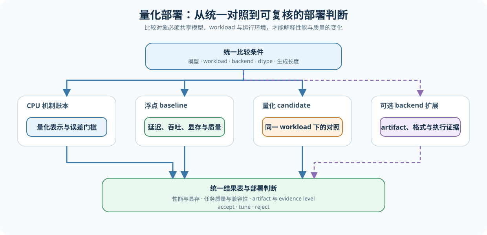
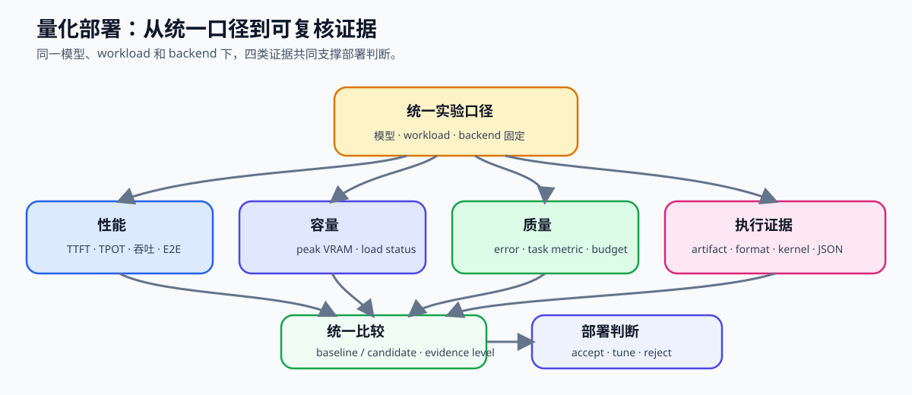
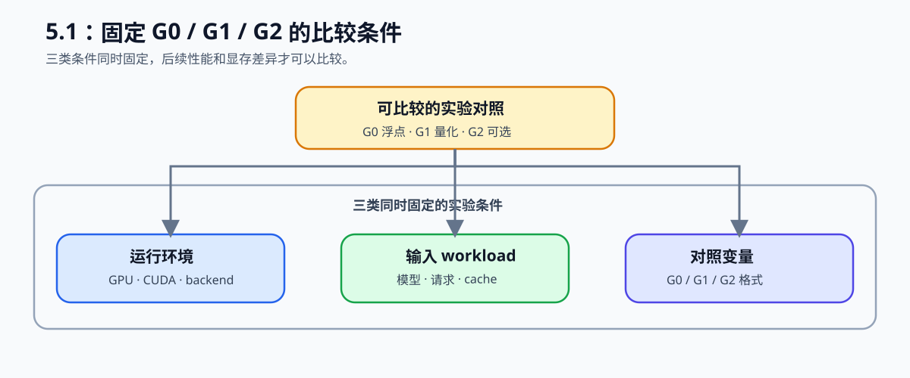

# 67. Quantized Inference and Deployment | 量化推理与部署

**难度：** Hard | **环境：** CPU-first | **标签：** `量化压缩`, `量化推理`, `部署` | **目标人群：** 项目决策练习者

> 🚀 **云端运行环境**
>
> 本章节的实战代码可以点击以下链接在免费 GPU 算力平台上直接运行：
>
> [](https://colab.research.google.com/github/datawhalechina/llm-algo-leetcode/blob/main/02_PyTorch_Algorithms/67_Quantized_Inference_and_Deployment.ipynb)
> [](https://modelscope.cn/my/mynotebook) *(国内推荐：魔搭社区免费实例)*


---

## 本节导读

本节带你完成一次量化部署判断：固定模型、workload、backend 和误差阈值，比较 baseline 与量化方案的延迟、吞吐、显存和输出质量，最后写出部署建议。

**关键词：** `quantization`, `inference`, `deployment`

---

## 前置阅读

**导语：** 先了解量化对象、常见权重量化格式和推理性能指标，再开始部署对照实验。
- [25. Quantization W8A16 | W8A16 量化](./25_Quantization_W8A16.md)
- [65. QLoRA Selection Project | QLoRA 选型项目（需要训练适配时）](./65_QLoRA_Selection_Project.md)
- [40. GPTQ and AWQ Weight Quantization | GPTQ 与 AWQ 权重量化](./40_GPTQ_and_AWQ_Weight_Quantization.md)
- [66. Inference Performance Comparison | 推理性能对比实验](./66_Inference_Performance_Comparison.md)

完成前置阅读后，先做 CPU 对照，再按需复测真实 GPU/backend。

### Step 1：定义量化部署问题与对照组
先回答一个具体问题：在同一模型、请求负载、硬件和服务 backend 下，量化 artifact 是否带来足够的显存或性能收益，同时保持质量和兼容性在预算内。低 bit 只是候选条件，不是部署结论。

先按 66 的 G0/G1/G2 方式划分实验组：完成 C0/C1 的机制和决策练习，再按 G0→G1→G2 进行真实对照；每次只改变一个主要变量，并记录 bit、dtype 和 backend。

| 组别 | 环境 | 实验内容 | 主要回答的问题 |
|---|---|---|---|
| C0 量化机制 | CPU | 改变 bits、group size 和权重分布 | 存储量、元数据和误差如何变化？ |
| C1 决策模拟 | CPU | 输入 baseline / candidate 指标和误差预算 | 什么条件下值得继续部署？ |
| G0 浮点 baseline | GPU/backend | 固定模型和 workload，运行 FP16/BF16 | 当前硬件和 backend 的基线是什么？ |
| G1 真实量化 | GPU/backend | 只改变一种量化格式或 artifact | 量化是否真的降低显存或延迟？ |
| G2 扩展或组合对照 | GPU/backend | 在 G0/G1 后比较另一个格式、backend 或组合 | 收益是否来自可复核的变化且值得迁移？ |



### Step 2：确认模型、artifact 与运行口径

先确认浮点 baseline 能够加载，再检查量化 artifact、模型版本和目标 backend。下面先固定两组实验的输入和环境，再核对候选格式需要补齐的证据：

| 检查项 | G0 baseline | G1/G2 candidate | 需要留下的记录 |
|---|---|---|---|
| 模型与 tokenizer | 固定版本 | 与 G0 相同 | 模型版本、tokenizer 版本 |
| workload | prompt、生成长度、batch、并发、cache policy | 与 G0 相同 | workload 配置文件 |
| 运行环境 | GPU、driver、PyTorch/CUDA、backend 版本 | 尽量相同 | 环境快照 |
| 唯一变量 | FP16/BF16 浮点权重 | 量化 artifact、格式或明确 backend | 变化字段 |
| artifact / 格式 | 浮点权重 | GPTQ、AWQ 或 GGUF | artifact 路径、格式元数据、加载状态 |
| 校准与验证 | 不适用 | split、样本数、最大长度、版本 | calibration / evaluation manifest |
| 执行证据 | 浮点执行路径 | 量化格式与目标 kernel | backend、kernel evidence、结果 JSON |

### Step 3：建立性能、质量与证据协议

同时比较加载、性能、显存、数值误差和任务质量，并把每个指标关联到同一组 workload、artifact 和结果文件；比较结果时一并核对格式和 kernel 路径。



| 指标组 | 记录字段 | 用来回答什么 |
|---|---|---|
| 性能 | load time / TTFT / TPOT / E2E / throughput | 是否更快，是否适合当前请求负载 |
| 容量 | peak VRAM / load status | 是否装得下，是否提高并发或上下文上限 |
| 质量 | error / task metric | 量化误差是否超过预算 |
| 兼容性与证据 | format / kernel evidence / backend version / artifact path | 收益是否来自可复核的执行路径 |

### Step 4：CPU 实验——设计决策实现并形成部署结论

把题目区拆成四类机制辅助函数：校验配置与 artifact、汇总 baseline/candidate 指标、计算差值与误差预算、输出 `accept / tune / reject`。

按质量、兼容性和性能收益输出 accept / tune / reject；报告保留量化格式、粒度、校准信息、backend、硬件和完整 workload。本 Step 用 CPU 代码实现量化账本、模拟耗时、指标比较和部署决策。

| 决策 | 条件 | 下一步 |
|---|---|---|
| accept | 真实 artifact 加载成功、kernel/格式已确认、质量达标且性能或容量有收益 | 保留配置并扩大 workload 回归 |
| tune | 质量达标但收益不稳定，或校准、粒度、backend 仍需调整 | 补采数据或调整单一变量 |
| reject | 质量超预算、无法加载、kernel 不支持或没有可接受收益 | 更换格式、backend 或回到 baseline |


```python
import math
import time
from typing import Dict, List

```


```python
def simulate_weight_quantization(weights: List[float], bits: int = 8, group_size: int = 2) -> Dict[str, float]:
    """用对称 per-group 量化模拟存储压缩和反量化误差。

    bits 决定有符号量化范围，group_size 决定每个 scale 覆盖的权重数；
    返回的是权重重构误差和存储估算，不是模型任务质量或真实 artifact 大小。
    """
    # 提示：每组 scale 使用该组最大绝对值；全零组要避免除零。
    #       量化误差按 reconstructed - original 计算，元数据也要计入 quantized_bytes。
    if bits < 2 or bits > 8 or group_size < 1 or not weights:
        raise ValueError('bits 应在 2-8 之间，group_size >= 1，weights 不能为空')
    qmax = (1 << (bits - 1)) - 1
    reconstructed, group_count = [], 0
    for start in range(0, len(weights), group_size):
        group = [float(value) for value in weights[start:start + group_size]]
        scale = max(abs(value) for value in group) / qmax
        scale = scale if scale > 0 else 1.0
        reconstructed.extend(max(-qmax, min(qmax, round(value / scale))) * scale for value in group)
        group_count += 1
    errors = [estimate - actual for estimate, actual in zip(reconstructed, weights)]
    max_abs_error = max(abs(error) for error in errors)
    mse = sum(error * error for error in errors) / len(errors)
    original_bytes = len(weights) * 4
    scale_dtype_bits = 16  # 本模拟按 FP16 scale 估算元数据；真实格式需按 artifact 记录。
    quantized_bytes = math.ceil((len(weights) * bits + group_count * scale_dtype_bits) / 8)
    return {
        'parameter_count': len(weights), 'bits': bits, 'group_size': group_size,
        'groups': group_count, 'original_bytes': original_bytes,
        'quantized_bytes': quantized_bytes, 'scale_dtype_bits': scale_dtype_bits,
        'compression_ratio': round(original_bytes / quantized_bytes, 4),
        'max_abs_error': round(max_abs_error, 8), 'mse': round(mse, 8),
    }


def benchmark_fn(fn, warmup=2, iters=5):
    """测量一个候选函数的 CPU 平均耗时，返回毫秒。

    该函数不执行 CUDA synchronize，也不代表量化 kernel 或 backend 延迟。
    """
    # ==========================================
    # TODO 1: 先做 warmup，再测量平均耗时
    # 提示：用 time.perf_counter() 记录起止时间；warmup 不计入平均值。
    #       iters 必须为正，返回单位统一为 ms，方便和 latency 对齐。
    # ==========================================
    for _ in range(warmup):
        fn()

    # start = ???
    for _ in range(iters):
        fn()
    # total = ???
    # avg_latency_ms = ???
    return avg_latency_ms


def summarize_quantized_result(base_metrics, quant_metrics):
    """统一比较 baseline 与量化候选的收益、资源和重构误差。

    两个输入必须来自同一 workload；error_delta 表示候选误差相对 baseline 的变化，
    不能把 max_abs_error / mse 直接解释成任务质量下降。
    """
    # ==========================================
    # TODO 2: 汇总 baseline / quantized 的核心指标差异
    # 提示：latency / vram / error 越低越好，throughput 越高越好。
    #       latency_delta、vram_delta 使用 baseline - quantized；throughput_delta 使用 quantized - baseline。
    # 正数表示 quantized 相比 baseline 有改善，error_delta 除外
    # ==========================================
    # latency_delta = ???
    # throughput_delta = ???
    # vram_delta = ???
    # error_delta = ???

    summary = {
        'latency_delta_ms': round(latency_delta, 2),
        'throughput_delta': round(throughput_delta, 2),
        'vram_delta_mb': round(vram_delta, 2),
        'error_delta': round(error_delta, 4),
        'latency_improved': latency_delta > 0,
        'throughput_improved': throughput_delta > 0,
        'vram_improved': vram_delta > 0,
        'error_within_budget': error_delta <= quant_metrics['error_budget'],
    }
    return summary


def format_deployment_report(quant_name, summary, recommendation):
    """把量化候选的收益、误差和部署建议整理成可读报告。

    报告必须同时展示四类指标和 decision；不能只保留压缩率或延迟。
    """
    # ==========================================
    # TODO 3: 生成量化部署报告
    # 提示：rows 必须覆盖 latency、throughput、VRAM、error 四类证据，
    #       每行同时展示变化值和判断结果；不要只报告压缩率或显存下降。
    #       conclusion 需要同时包含 recommendation['decision'] 和 recommendation['next_action']；
    #       error 仍是模拟/重构指标，不能直接写成真实任务质量结论。
    # ==========================================
    header = "| 指标 | 变化 | 判断 |"
    sep = "| --- | --- | --- |"
    rows = [
        # f"| latency | {summary['latency_delta_ms']} ms | {'改善' if summary['latency_improved'] else '未改善'} |",
        # f"| throughput | {summary['throughput_delta']} | {'改善' if summary['throughput_improved'] else '未改善'} |",
        # f"| VRAM | {summary['vram_delta_mb']} MB | {'改善' if summary['vram_improved'] else '未改善'} |",
        # f"| error | {summary['error_delta']} | {'满足预算' if summary['error_within_budget'] else '超出预算'} |",
    ]
    # conclusion = ???
    return "\n".join([f"量化方案：{quant_name}", header, sep] + rows + [conclusion])


def recommend_quantized_deployment(summary, min_latency_delta_ms=5.0, min_throughput_delta=5.0, min_vram_delta_mb=256.0):
    """根据收益、误差和预算约束输出量化部署建议。

    返回 decision、reason、next_action；阈值属于当前 workload，不是所有 backend 的 SLA。
    """
    # ==========================================
    # TODO 4: 输出部署决策
    # 决策顺序：先检查误差预算，再检查显存收益，最后检查延迟或吞吐收益。
    # - error 超预算：无论速度是否提升，都必须 reject。
    # - 误差合格但收益不足：tune，并指出应继续调整粒度、校准集或 backend。
    # - 误差合格且显存、延迟/吞吐收益均达标：accept。
    # 提示：先计算四个布尔变量，再完成三种 decision 的 reason 和 next_action。
    # ==========================================
    # strong_latency_gain = ???
    # strong_throughput_gain = ???
    # strong_vram_gain = ???
    # error_ok = ???
    # decision = ???
    # reason = ???
    # next_action = ???
    # return {'decision': decision, 'reason': reason, 'next_action': next_action}

```

### 测试


```python
def test_quantization_accounting_contract():
    report = simulate_weight_quantization([0.0, 1.0, -2.0, 3.0, 0.5], bits=4, group_size=2)
    assert report['parameter_count'] == 5 and report['groups'] == 3
    assert report['quantized_bytes'] < report['original_bytes']
    print('✅ quantization accounting contract')

def test_quantization_timing_contract():
    counter = {'n': 0}
    def fn():
        counter['n'] += 1
    latency = benchmark_fn(fn, warmup=1, iters=2)
    assert counter['n'] == 3 and latency >= 0.0
    print('✅ quantization timing contract')

def test_quantization_comparison_contract():
    baseline = {'latency_ms': 100.0, 'throughput': 80.0, 'vram_mb': 12000.0, 'error': 0.0}
    quantized = {'latency_ms': 72.0, 'throughput': 120.0, 'vram_mb': 7000.0, 'error': 0.012, 'error_budget': 0.02}
    summary = summarize_quantized_result(baseline, quantized)
    assert summary['latency_delta_ms'] == 28.0 and summary['throughput_delta'] == 40.0
    assert summary['vram_delta_mb'] == 5000.0 and summary['error_within_budget'] is True
    print('✅ quantization comparison contract')

def test_quantization_decision_contract():
    summary = {'latency_delta_ms': 28.0, 'throughput_delta': 40.0, 'vram_delta_mb': 5000.0, 'error_within_budget': True, 'latency_improved': True, 'throughput_improved': True, 'vram_improved': True}
    decision = recommend_quantized_deployment(summary, 5.0, 5.0, 256.0)
    assert decision['decision'] == 'accept'
    rejected = dict(summary, error_within_budget=False)
    assert recommend_quantized_deployment(rejected, 5.0, 5.0, 256.0)['decision'] == 'reject'
    print('✅ quantization decision contract')

def test_quantized_project_template():
    try:
        weights = [0.0, 1.0, -2.0, 3.0, 0.5]
        quant_report = simulate_weight_quantization(weights, bits=4, group_size=2)
        assert quant_report['parameter_count'] == 5
        assert quant_report['groups'] == 3
        assert quant_report['quantized_bytes'] < quant_report['original_bytes']
        assert quant_report['max_abs_error'] >= 0.0 and quant_report['mse'] >= 0.0
        try:
            simulate_weight_quantization(weights, bits=16)
        except ValueError:
            pass
        else:
            raise AssertionError('不支持的 bit 数应明确拒绝！')
        counter = {'n': 0}

        def fn():
            counter['n'] += 1

        avg = benchmark_fn(fn, warmup=0, iters=2)
        assert counter['n'] == 2, "benchmark 应该运行 iters 次"
        assert avg >= 0.0, "平均耗时应该非负"

        baseline = {
            'latency_ms': 100.0,
            'throughput': 80.0,
            'vram_mb': 12000.0,
            'error': 0.0,
        }
        quantized = {
            'latency_ms': 72.0,
            'throughput': 120.0,
            'vram_mb': 7000.0,
            'error': 0.012,
            'error_budget': 0.02,
        }
        summary = summarize_quantized_result(baseline, quantized)

        assert summary['latency_delta_ms'] == 28.0
        assert summary['throughput_delta'] == 40.0
        assert summary['vram_delta_mb'] == 5000.0
        assert summary['error_delta'] == 0.012
        assert summary['latency_improved'] is True
        assert summary['throughput_improved'] is True
        assert summary['vram_improved'] is True
        assert summary['error_within_budget'] is True

        decision = recommend_quantized_deployment(summary, min_latency_delta_ms=5.0, min_throughput_delta=5.0, min_vram_delta_mb=256.0)
        assert decision['decision'] == 'accept'
        assert decision['next_action'] == 'promote_to_extended_regression'

        weak_summary = dict(summary)
        weak_summary['latency_delta_ms'] = 1.0
        weak_summary['throughput_delta'] = 2.0
        weak_summary['vram_delta_mb'] = 128.0
        weak_summary['latency_improved'] = True
        weak_summary['throughput_improved'] = True
        weak_summary['vram_improved'] = True
        weak_decision = recommend_quantized_deployment(weak_summary, min_latency_delta_ms=5.0, min_throughput_delta=5.0, min_vram_delta_mb=256.0)
        assert weak_decision['decision'] == 'tune'

        bad_summary = dict(summary)
        bad_summary['error_within_budget'] = False
        bad_decision = recommend_quantized_deployment(bad_summary, min_latency_delta_ms=5.0, min_throughput_delta=5.0, min_vram_delta_mb=256.0)
        assert bad_decision['decision'] == 'reject'

        report = format_deployment_report('W8A16', summary, decision)
        assert 'W8A16' in report
        assert '| 指标 | 变化 | 判断 |' in report
        for metric in ('latency', 'throughput', 'VRAM', 'error'):
            assert metric in report, f'报告缺少 {metric} 证据'
        assert '值得推进到更大样本部署回归' in report
        assert 'promote_to_extended_regression' in report

        print("✅ 量化推理与部署项目模板代码通过基础校验。")
    except NotImplementedError:
        print("请先完成 TODO 代码！")
        raise
    except (AttributeError, NameError, TypeError, ValueError) as e:
        print("代码可能未完成，导致变量未定义")
        raise NotImplementedError("请先完成 TODO 代码！") from e
    except AssertionError as e:
        print(f"❌ 测试失败: {e}")
        raise NotImplementedError("请先完成 TODO 代码！") from e


def run_quantized_project_tests():
    for test in (test_quantization_accounting_contract, test_quantization_timing_contract, test_quantization_comparison_contract, test_quantization_decision_contract, test_quantized_project_template):
        test()
    print('✅ 量化部署项目：机制测试与集成测试全部通过。')

run_quantized_project_tests()

```

---

🛑 **STOP HERE** 🛑
<br><br><br><br><br><br><br><br><br><br>
> 请先尝试自己完成代码并跑通测试。<br>
> 如果你正在 Colab 中运行，并且遇到困难没有思路，可以向下滚动查看参考答案。
<br><br><br><br><br><br><br><br><br><br>

---
## 参考代码与解析

### 代码


```python

def simulate_weight_quantization(weights: List[float], bits: int = 8, group_size: int = 2) -> Dict[str, float]:
    """用对称 per-group 量化模拟存储压缩和反量化误差。"""
    if bits < 2 or bits > 8 or group_size < 1 or not weights:
        raise ValueError('bits 应在 2-8 之间，group_size >= 1，weights 不能为空')
    qmax = (1 << (bits - 1)) - 1
    reconstructed, group_count = [], 0
    for start in range(0, len(weights), group_size):
        group = [float(value) for value in weights[start:start + group_size]]
        scale = max(abs(value) for value in group) / qmax
        scale = scale if scale > 0 else 1.0
        reconstructed.extend(max(-qmax, min(qmax, round(value / scale))) * scale for value in group)
        group_count += 1
    errors = [estimate - actual for estimate, actual in zip(reconstructed, weights)]
    max_abs_error = max(abs(error) for error in errors)
    mse = sum(error * error for error in errors) / len(errors)
    original_bytes = len(weights) * 4
    scale_dtype_bits = 16  # 本模拟按 FP16 scale 估算元数据；真实格式需按 artifact 记录。
    quantized_bytes = math.ceil((len(weights) * bits + group_count * scale_dtype_bits) / 8)
    return {
        'parameter_count': len(weights), 'bits': bits, 'group_size': group_size,
        'groups': group_count, 'original_bytes': original_bytes,
        'quantized_bytes': quantized_bytes, 'scale_dtype_bits': scale_dtype_bits,
        'compression_ratio': round(original_bytes / quantized_bytes, 4),
        'max_abs_error': round(max_abs_error, 8), 'mse': round(mse, 8),
    }


def benchmark_fn(fn, warmup=2, iters=5):
    # ==========================================
    # TODO 1: 先做 warmup，再测量平均耗时
    # 提示: 用 time.perf_counter() 记录起止时间
    # 返回单位统一为 ms，方便和 latency 对齐
    # ==========================================
    for _ in range(warmup):
        fn()

    start = time.perf_counter()
    for _ in range(iters):
        fn()
    total = time.perf_counter() - start
    avg_latency_ms = total / iters * 1000
    return avg_latency_ms


def summarize_quantized_result(base_metrics, quant_metrics):
    # ==========================================
    # TODO 2: 汇总 baseline / quantized 的核心指标差异
    # 提示: latency / vram / error 越低越好，throughput 越高越好
    # 正数表示 quantized 相比 baseline 有改善，error_delta 除外
    # ==========================================
    latency_delta = base_metrics['latency_ms'] - quant_metrics['latency_ms']
    throughput_delta = quant_metrics['throughput'] - base_metrics['throughput']
    vram_delta = base_metrics['vram_mb'] - quant_metrics['vram_mb']
    error_delta = quant_metrics['error'] - base_metrics['error']

    summary = {
        'latency_delta_ms': round(latency_delta, 2),
        'throughput_delta': round(throughput_delta, 2),
        'vram_delta_mb': round(vram_delta, 2),
        'error_delta': round(error_delta, 4),
        'latency_improved': latency_delta > 0,
        'throughput_improved': throughput_delta > 0,
        'vram_improved': vram_delta > 0,
        'error_within_budget': error_delta <= quant_metrics['error_budget'],
    }
    return summary


def format_deployment_report(quant_name, summary, recommendation):
    # ==========================================
    # TODO 3: 生成量化部署报告
    # 提示: 把指标变化、误差约束和部署建议放在一起
    # ==========================================
    header = "| 指标 | 变化 | 判断 |"
    sep = "| --- | --- | --- |"
    rows = [
        f"| latency | {summary['latency_delta_ms']} ms | {'改善' if summary['latency_improved'] else '未改善'} |",
        f"| throughput | {summary['throughput_delta']} | {'改善' if summary['throughput_improved'] else '未改善'} |",
        f"| VRAM | {summary['vram_delta_mb']} MB | {'改善' if summary['vram_improved'] else '未改善'} |",
        f"| error | {summary['error_delta']} | {'满足预算' if summary['error_within_budget'] else '超出预算'} |",
    ]
    conclusion = (
        f"部署建议：{recommendation['decision']}；"
        f"原因：{recommendation['reason']}；下一步：{recommendation['next_action']}。"
    )
    return "\n".join([f"量化方案：{quant_name}", header, sep] + rows + [conclusion])


def recommend_quantized_deployment(summary, min_latency_delta_ms=5.0, min_throughput_delta=5.0, min_vram_delta_mb=256.0):
    strong_latency_gain = summary['latency_delta_ms'] >= min_latency_delta_ms
    strong_throughput_gain = summary['throughput_delta'] >= min_throughput_delta
    strong_vram_gain = summary['vram_delta_mb'] >= min_vram_delta_mb
    error_ok = summary['error_within_budget']

    if error_ok and (strong_latency_gain or strong_throughput_gain) and strong_vram_gain:
        decision = 'accept'
        reason = '收益和误差预算都达标，值得推进到更大样本部署回归。'
        next_action = 'promote_to_extended_regression'
    elif error_ok and (summary['latency_improved'] or summary['throughput_improved'] or summary['vram_improved']):
        decision = 'tune'
        reason = '误差仍在预算内，但收益还不够稳，先继续调量化粒度、校准集或后端。'
        next_action = 'refine_quant_granularity_or_backend'
    else:
        decision = 'reject'
        reason = '误差超预算，或收益不足以支撑部署切换。'
        next_action = 'fallback_to_baseline_or_rework_quant_scheme'
    return {'decision': decision, 'reason': reason, 'next_action': next_action}

```

### 解析

这页现在按 `simulate -> measure -> compare -> report -> decide` 的最小量化部署项目闭环组织，不再只是单独比较 bit 数或显存收益。

#### TODO 0

- 实现方式：按 group 切分权重，用对称 scale 做量化和反量化，统计量化存储、元数据开销以及最大绝对误差 / MSE。
- 关键点：压缩比不是简单的 `32 / bits`，还要计入每组 scale 等元数据；误差指标也不能直接等同于任务精度。
- 项目意义：CPU 可以验证 bit、分组粒度、存储账本与误差之间的关系；真实低比特 kernel 的速度、workspace、显存峰值和部署兼容性仍需 GPU/backend 验证。

#### TODO 1

- 实现方式：先做 warmup，再统计 `iters` 轮的总耗时，最后换算成单次平均 latency。
- 关键点：返回值统一用 ms，方便后面和部署报告里的延迟指标直接对齐。
- 项目意义：量化部署不是只看模型大小，先要把测量口径收平，后面才谈收益是否可信。

#### TODO 2

- 实现方式：统一计算 `latency_delta`、`throughput_delta`、`vram_delta` 和 `error_delta`。
- 关键点：前三类指标正数表示改善，`error_delta` 是部署约束，不应该误读成性能收益。
- 项目意义：这一步把量化方案从“压低 bit 数”转成“速度、显存和误差能否一起成立”的项目比较。

#### TODO 3

- 实现方式：把 latency、throughput、VRAM、error 放到同一张表，再补一句部署建议。
- 关键点：报告必须同时呈现收益和误差预算，避免只凭显存下降就直接上线。
- 项目意义：量化部署项目最后要回答的不是“能不能量化”，而是“这套方案是否满足部署约束，下一轮该扩大回归还是继续校准”。

### Step 5（可选）：GPU/backend 实验——真实量化部署

#### 5.1 环境、输入与固定条件



**实验条件表**

| 项目 | G0 baseline | G1 量化候选 | G2 格式/backend 对照 |
|---|---|---|---|
| 模型与 workload | 固定 | 与 G0 相同 | 与 G0 相同 |
| dtype / 量化格式 | FP16 或 BF16 | 只改变一种真实量化格式 | 明确列出各格式 |
| calibration / evaluation | 不适用 / 独立评估 | 记录数据集、split、样本数 | 分别记录 |
| backend / 硬件 | 固定 | 固定 | 尽量固定 |

#### 5.2 环境启动检查

先确认当前 Python、PyTorch、CUDA、GPU、backend 和模型来源可用，再继续配置量化实验。没有 GPU 或真实 artifact 时，保留检查结果并完成 CPU 练习，不填写虚构的量化收益。

在 Colab / ModelScope 中，先确保 Notebook 位于仓库根目录（或先 clone 仓库），再运行下面单元；没有 GPU 时保留 `False`。

#### 5.3 配置数据、artifact 与对照组

推荐使用 Qwen2.5-1.5B-Instruct；WikiText-2 train 子集用于 calibration，validation 子集用于评估，0.5B 作为快速 smoke 档。数据准备单元保存独立 split 和口径清单；真正执行 GPTQ/AWQ 前，使用目标 tokenizer 重新截断和打包。

配置 G0 浮点 baseline、G1 量化 candidate 和可选 G2 对照，记录 artifact 路径、格式元数据、模型版本、backend、硬件和 workload。GGUF 使用独立 backend 路径，不与 vLLM 的 GPTQ/AWQ 启动参数混用。

#### 5.4 执行实验并保存 JSON

先运行 G0，再只替换量化 artifact 或启动参数运行 G1，最后把另一种格式、backend 或已验证组合作为 G2 单独重跑。每组保留 `load_status`、`format`、`kernel_evidence`、`TTFT/latency`、`throughput`、`peak_vram` 和 `quality`，并将原始结果写入独立 JSON。

默认使用 Practice-P1 的本地/模拟量化实验；接入 backend 时，将 `RUN_REAL_BACKEND` 改为 `True`。模型来源支持 `auto`、`modelscope`、`huggingface` 或本地目录，dtype 与端口由共享 helper 自动选择。vLLM 路径会依次启动 G0 和 G1，并合并保存结果；G2 通过修改 `QUANTIZATION_FORMAT` 或 backend 单独运行。

#### 5.5 实测结果与复测记录

读取结果后，先比较同一 workload 下的加载状态、TTFT、TPOT、吞吐、峰值显存、质量和 kernel evidence。当前没有统一的历史量化结果时，保留下面的复测表，学习者应填写自己的 G0/G1/G2 记录。运行失败、artifact 不存在、kernel 不支持或 OOM 也要写入结果文件，便于区分“未执行”“执行失败”和“量化收益未成立”。

| 实验组 | GPU / 显存 | 模型与 artifact | backend | format | workload / JSON | TTFT / TPOT | throughput | peak VRAM | quality | kernel evidence | evidence level | failure | decision |
|---|---|---|---|---|---|---:|---:|---:|---|---|---|---|---|
| G0 baseline | 待填写 | 浮点模型路径 | 待填写 | FP16/BF16 | 待填写 / JSON | 待填写 | 待填写 | 待填写 | 参考输出 | 待确认 | 待填写 | none / 待记录 | pending |
| G1 candidate | 待填写 | 量化 artifact 路径 | 待填写 | GPTQ/AWQ/GGUF | 与 G0 相同 / JSON | 待填写 | 待填写 | 待填写 | 待填写 | 待确认 | 待填写 | none / 待记录 | pending |
| G2 optional | 待填写 | 另一 artifact 路径 | 待填写 | 另一格式/backend | 与 G0 相同 / JSON | 待填写 | 待填写 | 待填写 | 待填写 | 待确认 | 待填写 | none / 待记录 | pending |

#### 5.6 解释结果与形成决策

比较 TTFT、TPOT、吞吐、显存、质量和 kernel evidence，并核对真实量化权重是否加载、目标 kernel 或格式是否生效；字段完整且质量达标后，再输出 `accept / tune / reject`。

```python
import json
from datetime import datetime
from pathlib import Path

try:
    from tools.inference_project_runtime import locate_repo_root
    REPO_ROOT = locate_repo_root()
    from tools.inference_project_runtime import (
        shared_project_config, save_project_result, start_optional_vllm,
        stop_optional_vllm, start_external_openai_backend, run_backend_benchmark,
    )
    from tools.backend_runtime import (
        probe_vllm_quantization_support, build_vllm_quantization_args, find_free_port,
    )
except ModuleNotFoundError:
    # 题目测试或纯 CPU 环境可能没有仓库工具；真实 backend 入口保持关闭。
    RUN_REAL_BACKEND = False
    def shared_project_config(**kwargs): return kwargs
    def save_project_result(*args, **kwargs): raise RuntimeError('需要从仓库根目录运行真实 backend 入口')

RUN_REAL_BACKEND = False  # 是否启动真实 backend；默认只练习量化决策模板。
MODEL_PROFILES = {
    'smoke': 'Qwen/Qwen2.5-0.5B-Instruct',
    'gpu_quant': 'Qwen/Qwen2.5-1.5B-Instruct',
}
MODEL_PROFILE = 'smoke'  # smoke 适合快速链路；gpu_quant 用于真实量化收益实验。
MODEL_ID = MODEL_PROFILES[MODEL_PROFILE]  # 量化前后必须保持同一基座模型。
MODEL_SOURCE = 'auto'  # 模型来源：auto / modelscope / huggingface / local。
MODEL_CACHE_DIR = 'model_cache'  # 模型缓存目录；相对路径从仓库根目录解析。
DTYPE = 'auto'  # 非量化计算 dtype；auto 根据当前 GPU 选择。
QUANTIZATION_FORMAT = 'none'  # none / gptq / awq / gguf；none 只表示浮点 baseline。
QUANTIZATION_BACKEND = 'vllm'  # 真实量化的执行后端；GGUF 不应直接沿用 vLLM 路径。
GGUF_COMMAND_TEMPLATE = None  # 例如 ['llama-server', '-m', '{model_path}', '--port', '{port}']；需由目标引擎确认。
RUN_DATA_PREP = False  # 是否下载并准备独立的 calibration/evaluation 文本。
CALIBRATION_DATASET = 'wikitext'  # Hugging Face 数据集名称。
DATASET_CONFIG = 'wikitext-2-raw-v1'  # WikiText-2 的配置名称。
CALIBRATION_SPLIT = 'train'  # 校准只使用 train 子集。
CALIBRATION_SAMPLES = 128  # Colab/小显存先用小子集，正式实验再扩大。
CALIBRATION_MAX_LENGTH = 512  # 校准样本截断长度。
EVAL_DATASET = 'wikitext'  # 与 calibration 分开的评估数据集名称。
EVAL_SPLIT = 'validation'  # 评估使用独立 split。
EVAL_SAMPLES = 128  # 先做固定小样本 perplexity/质量评估。
QUANTIZATION_ARTIFACT = None  # 真实量化权重或目录；None 时不能宣称量化收益。
KERNEL_EVIDENCE = 'pending_manual_confirmation'  # backend 启动不等于目标量化 kernel 已确认。
BATCH_SIZE = 1  # baseline 与量化候选必须保持一致。
CONCURRENCY = 1  # 只在单独的并发实验中修改。
NUM_PROMPTS = 5  # smoke 请求数；正式实验应扩大并重复。
MAX_TOKENS = 64  # 每个请求的生成上限。
WARMUP = 1  # 不计入正式统计的预热请求数。
REPEATS = 3  # G0/G1 每组正式重复次数；smoke 可暂时改为 1。
MAX_MODEL_LEN = 2048  # backend 的上下文上限，影响 KV Cache 预算。
BACKEND = 'vllm'  # 推理运行时；更换 backend 会改变 kernel 支持范围。
CACHE_POLICY = 'default'  # KV Cache 策略；对照实验中应固定。
RUN_ID = datetime.now().strftime('%Y%m%d_%H%M%S')
RESULT_PATH = f'benchmarks/results/67_quantized_deployment_{RUN_ID}.json'  # 每次 GPU 运行独立保存。
UPSTREAM_BASELINE_RESULT = 'benchmarks/results/66_g0_vllm_baseline.json'  # 由 66 提供的固定 workload baseline。
UPSTREAM_ADAPTER_MANIFEST = 'benchmarks/results/65_qlora_artifact_manifest.json'  # 仅在 65 生成训练适配产物时填写。
DATA_MANIFEST_PATH = 'benchmarks/results/67_quantization_data_manifest.json'  # 只保存数据口径，不保存数据正文。

project_config = shared_project_config(
    model=MODEL_ID, backend=BACKEND, dtype=DTYPE,
    quantization_format=QUANTIZATION_FORMAT, quantization_backend=QUANTIZATION_BACKEND,
    quantization_artifact=QUANTIZATION_ARTIFACT,
    kernel_evidence=KERNEL_EVIDENCE,
    calibration_split=CALIBRATION_SPLIT, calibration_samples=CALIBRATION_SAMPLES,
    calibration_max_length=CALIBRATION_MAX_LENGTH, eval_dataset=EVAL_DATASET,
    eval_split=EVAL_SPLIT, eval_samples=EVAL_SAMPLES,
    generated_tokens=MAX_TOKENS, batch=BATCH_SIZE, concurrency=CONCURRENCY, repeats=REPEATS,
    cache_policy=CACHE_POLICY,
    upstream_baseline_result=UPSTREAM_BASELINE_RESULT,
    upstream_adapter_manifest=UPSTREAM_ADAPTER_MANIFEST,
    result_json=RESULT_PATH,
)
def inspect_upstream_contract():
    """检查 66 基线和可选 65 artifact 是否具备可复用的公开字段。"""
    baseline_path = Path(UPSTREAM_BASELINE_RESULT)
    if not baseline_path.exists():
        return {'status': 'pending_baseline', 'path': str(baseline_path), 'missing': ['result_json']}
    baseline_payload = json.loads(baseline_path.read_text(encoding='utf-8'))
    contract = baseline_payload.get('experiment_contract') or baseline_payload.get('baseline_contract') or {}
    required = {'schema_version', 'project', 'role', 'model_revision', 'backend', 'workload_path', 'dtype', 'evidence_level'}
    missing = sorted(required - set(contract))
    manifest_status = 'not_required'
    if UPSTREAM_ADAPTER_MANIFEST:
        manifest_path = Path(UPSTREAM_ADAPTER_MANIFEST)
        if not manifest_path.exists():
            manifest_status = 'pending_manifest'
        else:
            manifest = json.loads(manifest_path.read_text(encoding='utf-8'))
            manifest_status = 'ready' if manifest.get('artifact_path') and manifest.get('status') == 'ready' else 'not_ready'
    return {'status': 'ready' if not missing else 'incomplete', 'path': str(baseline_path), 'missing': missing, 'manifest': manifest_status}

UPSTREAM_CONTRACT = inspect_upstream_contract()
project_config['upstream_contract'] = UPSTREAM_CONTRACT
print('upstream contract:', UPSTREAM_CONTRACT)
print(project_config)

def validate_quantization_setup():
    """阻止把普通浮点服务误报成真实量化实验。"""
    valid_formats = {'none', 'gptq', 'awq', 'gguf'}
    if QUANTIZATION_FORMAT not in valid_formats:
        raise ValueError(f'QUANTIZATION_FORMAT 必须是 {sorted(valid_formats)} 之一。')
    if not str(QUANTIZATION_BACKEND).strip():
        raise ValueError('QUANTIZATION_BACKEND 不能为空；请明确记录实际执行后端。')
    if QUANTIZATION_FORMAT == 'none' and QUANTIZATION_ARTIFACT is not None:
        raise ValueError('QUANTIZATION_FORMAT=none 时不能填写 QUANTIZATION_ARTIFACT。')
    if QUANTIZATION_FORMAT != 'none' and not QUANTIZATION_ARTIFACT:
        raise ValueError('真实量化实验必须提供 QUANTIZATION_ARTIFACT。')
    if QUANTIZATION_ARTIFACT and not Path(QUANTIZATION_ARTIFACT).exists():
        raise FileNotFoundError(f'量化 artifact 不存在：{QUANTIZATION_ARTIFACT}')
    if QUANTIZATION_FORMAT == 'gguf' and QUANTIZATION_BACKEND == 'vllm':
        raise ValueError('GGUF 必须使用已确认支持 GGUF 的独立 backend，不能直接沿用 vLLM 启动路径。')
    if QUANTIZATION_FORMAT != 'none' and QUANTIZATION_BACKEND != BACKEND:
        raise ValueError('量化 backend 与服务 backend 不一致；请先拆成独立实验，避免把格式切换和服务栈切换混为一个变量。')
    if QUANTIZATION_FORMAT in {'gptq', 'awq'} and QUANTIZATION_BACKEND not in {'vllm', 'sglang', 'transformers'}:
        raise ValueError('GPTQ/AWQ 的 backend 需先登记为 vllm、sglang 或 transformers，并确认实际支持。')
    if MODEL_PROFILE == 'gpu_quant' and QUANTIZATION_FORMAT == 'none':
        print('提示：gpu_quant 当前仍是浮点 baseline；请设置真实量化格式后再运行 G1。')
    return {
        'artifact_required': QUANTIZATION_FORMAT != 'none',
        'artifact_configured': bool(QUANTIZATION_ARTIFACT),
        'format': QUANTIZATION_FORMAT,
        'backend': QUANTIZATION_BACKEND,
        'same_as_serving_backend': QUANTIZATION_BACKEND == BACKEND,
    }

def inspect_quantization_artifact() -> dict:
    """检查 artifact 的基本格式，不把检查结果当作 kernel 兼容性证明。"""
    if QUANTIZATION_FORMAT == 'none':
        return {'status': 'baseline', 'format': 'none'}
    artifact = Path(QUANTIZATION_ARTIFACT)
    if QUANTIZATION_FORMAT == 'gguf':
        files = [artifact] if artifact.is_file() else sorted(artifact.glob('*.gguf'))
        if not files:
            raise ValueError('GGUF artifact 必须是 .gguf 文件，或包含 .gguf 文件的目录。')
        return {'status': 'metadata_present', 'format': 'gguf', 'files': [str(item) for item in files]}
    config_path = artifact / 'config.json' if artifact.is_dir() else artifact.parent / 'config.json'
    if not config_path.exists():
        raise ValueError(f'{QUANTIZATION_FORMAT.upper()} artifact 缺少 config.json，无法确认格式元数据。')
    metadata = json.loads(config_path.read_text(encoding='utf-8'))
    quant_config = metadata.get('quantization_config') or metadata.get('quantization')
    if not isinstance(quant_config, dict):
        raise ValueError(f'{QUANTIZATION_FORMAT.upper()} artifact 未发现 quantization_config 元数据。')
    declared = json.dumps(quant_config, ensure_ascii=False).lower()
    if QUANTIZATION_FORMAT not in declared:
        raise ValueError(f'artifact 元数据未声明 {QUANTIZATION_FORMAT.upper()}，请不要把普通浮点目录当作量化模型。')
    return {'status': 'metadata_present', 'format': QUANTIZATION_FORMAT, 'config_path': str(config_path), 'quantization_config': quant_config}

QUANTIZATION_SETUP = validate_quantization_setup()
ARTIFACT_INSPECTION = inspect_quantization_artifact()
project_config['artifact_inspection'] = ARTIFACT_INSPECTION
if RUN_REAL_BACKEND and QUANTIZATION_FORMAT == 'gguf' and not GGUF_COMMAND_TEMPLATE:
    raise ValueError('GGUF 实验必须提供包含 {model_path} 和 {port} 的 GGUF_COMMAND_TEMPLATE。')

QUANTIZATION_LAUNCH_ARGS = None
if RUN_REAL_BACKEND and QUANTIZATION_FORMAT in {'gptq', 'awq'}:
    quant_capability = probe_vllm_quantization_support()
    QUANTIZATION_LAUNCH_ARGS = build_vllm_quantization_args(quant_capability, QUANTIZATION_FORMAT)

# 量化候选完成本地测量后，用下面的调用保存统一结果：
# save_project_result(RESULT_PATH, project='67', strategy='w8a16',
#     config=project_config, metrics=metrics, quality=quality, decision=decision)

def load_calibration_and_eval_texts():
    """加载独立 split 的小型文本子集；不执行量化，也不替代任务评估。"""
    try:
        from datasets import load_dataset
    except ImportError as exc:
        raise RuntimeError('数据准备需要 datasets，请先安装 requirements 中的依赖。') from exc
    calibration = load_dataset(
        CALIBRATION_DATASET, DATASET_CONFIG,
        split=f'{CALIBRATION_SPLIT}[:{CALIBRATION_SAMPLES}]',
    )
    evaluation = load_dataset(
        EVAL_DATASET, DATASET_CONFIG,
        split=f'{EVAL_SPLIT}[:{EVAL_SAMPLES}]',
    )
    max_chars = CALIBRATION_MAX_LENGTH * 4  # 这里只做近似字符截断；正式量化前仍需 tokenizer 截断。
    calibration_texts = [row['text'].strip()[:max_chars] for row in calibration if row.get('text', '').strip()]
    evaluation_texts = [row['text'].strip()[:max_chars] for row in evaluation if row.get('text', '').strip()]
    if not calibration_texts or not evaluation_texts:
        raise ValueError('calibration/evaluation split 没有可用文本。')
    return {'calibration': calibration_texts, 'evaluation': evaluation_texts}

if RUN_DATA_PREP:
    DATASET_BUNDLE = load_calibration_and_eval_texts()
    manifest = {
        'dataset': CALIBRATION_DATASET, 'config': DATASET_CONFIG,
        'calibration_split': CALIBRATION_SPLIT,
        'calibration_samples': len(DATASET_BUNDLE['calibration']),
        'calibration_max_length': CALIBRATION_MAX_LENGTH,
        'evaluation_split': EVAL_SPLIT,
        'evaluation_samples': len(DATASET_BUNDLE['evaluation']),
    }
    manifest_path = Path(DATA_MANIFEST_PATH)
    manifest_path.parent.mkdir(parents=True, exist_ok=True)
    manifest_path.write_text(json.dumps(manifest, ensure_ascii=False, indent=2), encoding='utf-8')
    print(manifest)
    print(f'数据口径清单已保存：{manifest_path}')
else:
    print('跳过数据下载：RUN_DATA_PREP=False；当前仅打印量化实验配置。')

# 真实 backend 先验证服务链路；量化格式专用启动参数需要按实际引擎补充。
if RUN_REAL_BACKEND and QUANTIZATION_FORMAT == 'gguf':
    from tools.model_runtime import resolve_model
    serving_model = QUANTIZATION_ARTIFACT
    model_path = resolve_model(serving_model, MODEL_SOURCE, cache_dir=MODEL_CACHE_DIR)
    port = find_free_port()
    server, log_path = start_external_openai_backend(
        GGUF_COMMAND_TEMPLATE, model_path=str(model_path), port=port,
        log_path='benchmarks/results/67_gguf_backend.log',
    )
    try:
        report = run_backend_benchmark(
            project='67', base_url=f'http://127.0.0.1:{port}', model=MODEL_ID,
            label='gguf-deployment-smoke', output=RESULT_PATH, backend=QUANTIZATION_BACKEND,
            dtype=DTYPE, cache_policy=CACHE_POLICY, batch=BATCH_SIZE,
            concurrency=CONCURRENCY, num_prompts=NUM_PROMPTS, max_tokens=MAX_TOKENS,
            warmup=WARMUP, repeats=REPEATS,
        )
        print(report['normalized_result'])
    finally:
        stop_optional_vllm(server, log_path)

def run_vllm_candidate(label, model_id, model_source, quantization_args, output_path):
    """启动一个候选、运行固定 workload，并返回可与另一候选配对的报告。

    G0 与 G1 只允许改变模型 artifact / 量化启动参数；服务名、dtype、
    上下文长度和请求配置沿用同一组配置。函数不把服务启动成功解释为
    量化收益，kernel 和任务质量仍需在报告中单独确认。
    """
    server, log_path, port, selected_dtype, model_path = start_optional_vllm(
        model_id=model_id, model_source=model_source, dtype=DTYPE,
        max_model_len=MAX_MODEL_LEN, served_model_name=MODEL_ID,
        quantization_args=quantization_args,
    )
    try:
        report = run_backend_benchmark(
            project='67', base_url=f'http://127.0.0.1:{port}', model=MODEL_ID,
            label=label, output=output_path, backend=BACKEND,
            dtype=selected_dtype, cache_policy=CACHE_POLICY,
            batch=BATCH_SIZE, concurrency=CONCURRENCY, num_prompts=NUM_PROMPTS,
            max_tokens=MAX_TOKENS, warmup=WARMUP, repeats=REPEATS,
        )
        return {
            'label': label, 'model_path': str(model_path),
            'dtype': selected_dtype, 'port': port,
            'report_path': str(output_path),
            'load_status': 'backend_started_and_benchmark_completed',
            'kernel_evidence': KERNEL_EVIDENCE,
            'normalized_result': report.get('normalized_result', report),
        }
    finally:
        stop_optional_vllm(server, log_path)


if RUN_REAL_BACKEND and QUANTIZATION_FORMAT != 'gguf':
    if BACKEND != 'vllm':
        raise RuntimeError('当前 G0/G1 自动配对入口使用 vLLM；SGLang 请沿用独立 backend 入口并保持相同报告字段。')
    if QUANTIZATION_FORMAT == 'none':
        raise ValueError('配对实验需要 QUANTIZATION_FORMAT=gptq 或 awq；none 只运行 CPU/配置检查。')

    result_root = Path(RESULT_PATH)
    baseline_path = result_root.with_name(f'{result_root.stem}_g0_baseline.json')
    candidate_path = result_root.with_name(f'{result_root.stem}_g1_{QUANTIZATION_FORMAT}.json')
    baseline = run_vllm_candidate(
        'g0-float-baseline', MODEL_ID, MODEL_SOURCE, None, baseline_path,
    )
    candidate = run_vllm_candidate(
        f'g1-{QUANTIZATION_FORMAT}', QUANTIZATION_ARTIFACT, 'local',
        QUANTIZATION_LAUNCH_ARGS, candidate_path,
    )
    paired_result = {
        'schema_version': 'quantized-inference-project/v1',
        'project': '67_quantized_inference_and_deployment',
        'upstream': {
            'baseline_result': UPSTREAM_BASELINE_RESULT,
            'adapter_manifest': UPSTREAM_ADAPTER_MANIFEST or None,
        },
        'stage': 'matched_backend_measurement',
        'experiment_groups': {'baseline': 'G0', 'candidate': 'G1', 'extension': 'G2'},
        'config': project_config,
        'comparison': {
            'fixed': ['model_tokenizer', 'workload', 'backend', 'hardware', 'dtype_policy', 'cache_policy'],
            'changed': ['quantization_artifact', 'quantization_format', 'quantization_launch_args'],
        },
        'baseline': baseline,
        'candidate': candidate,
        'quality': {
            'status': 'pending_task_evaluation',
            'note': 'backend benchmark 已完成；需补充相同输入的输出质量或 perplexity 后才能判定部署接受。',
        },
        'evidence_checks': {
            'baseline_and_candidate_backend_started': True,
            'quantization_format_metadata': ARTIFACT_INSPECTION.get('status'),
            'kernel_evidence': KERNEL_EVIDENCE,
            'task_quality': 'pending',
        },
        'decision': {
            'decision': 'tune',
            'reason': 'G0/G1 已完成同口径 backend 测量，但质量与 kernel 证据仍需人工核对。',
            'next_action': 'verify_kernel_and_task_quality_then_compare_metrics',
        },
        'evidence_level': 'matched_backend_measurement_pending_quality',
    }
    result_root.parent.mkdir(parents=True, exist_ok=True)
    result_root.write_text(json.dumps(paired_result, ensure_ascii=False, indent=2), encoding='utf-8')
    print(json.dumps(paired_result, ensure_ascii=False, indent=2))
```

## 相关阅读

完成量化部署实验后，可以用这些资料继续理解量化算法、artifact 和 backend；论文用于理解方法，官方文档和开源实现用于核对实际加载路径。
- [74. Profiling-Driven End-to-End Optimization | profiling 驱动的端到端优化](./74_Profiling_Driven_End_to_End_Optimization.md)
- [70. Serving Scheduler Benchmark | 推理服务调度基准](./70_Serving_Scheduler_Benchmark.md)
- [GPTQ: Accurate Post-Training Quantization for Generative Pre-trained Transformers](https://arxiv.org/abs/2210.17323)
- [AWQ: Activation-aware Weight Quantization for LLM Compression and Acceleration](https://arxiv.org/abs/2306.00978)
- [Hugging Face Transformers quantization overview](https://huggingface.co/docs/transformers/main/en/quantization/overview)
- [vLLM quantization documentation](https://docs.vllm.ai/en/latest/features/quantization/)
- [bitsandbytes open-source implementation](https://github.com/bitsandbytes-foundation/bitsandbytes)
