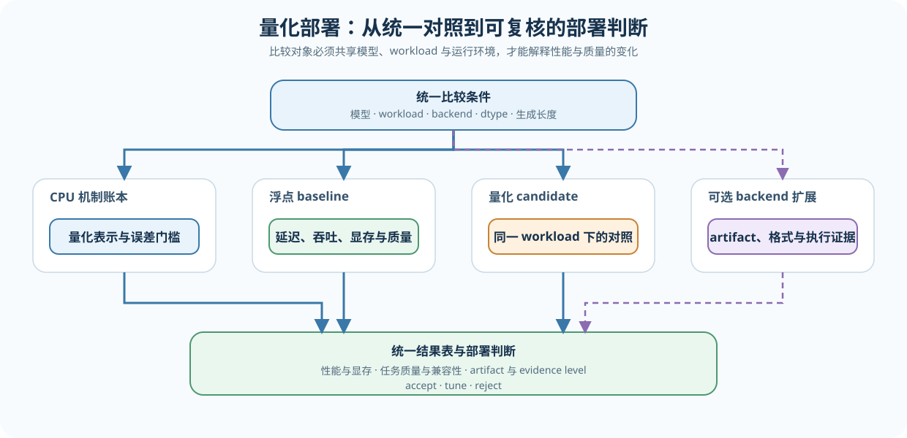
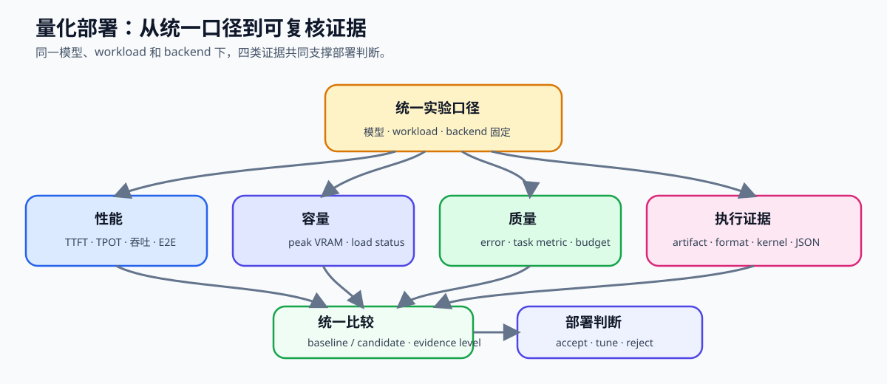
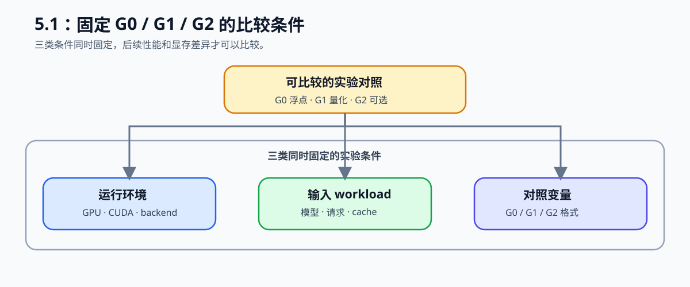

# 67. Quantized Inference and Deployment | 量化推理与部署

**难度：** Hard | **环境：** CPU-first | **标签：** `量化压缩`, `量化推理`, `部署` | **目标人群：** 项目决策练习者

> 🚀 **云端运行环境**
>
> 本章节的实战代码可以点击以下链接在免费 GPU 算力平台上直接运行：
>
> [](https://colab.research.google.com/github/datawhalechina/llm-algo-leetcode/blob/main/02_PyTorch_Algorithms/67_Quantized_Inference_and_Deployment.ipynb)
> [](https://modelscope.cn/my/mynotebook) *(国内推荐：魔搭社区免费实例)*


---

## 本节导读

本节带你完成一次量化部署判断：固定模型、workload、backend 和误差阈值，比较 baseline 与量化方案的延迟、吞吐、显存和输出质量，最后写出部署建议。

**关键词：** `quantization`, `inference`, `deployment`

---

## 前置阅读

**导语：** 先了解量化对象、常见权重量化格式和推理性能指标，再开始部署对照实验。
- [25. Quantization W8A16 | W8A16 量化](./25_Quantization_W8A16.md)
- [65. QLoRA Selection Project | QLoRA 选型项目（需要训练适配时）](./65_QLoRA_Selection_Project.md)
- [40. GPTQ and AWQ Weight Quantization | GPTQ 与 AWQ 权重量化](./40_GPTQ_and_AWQ_Weight_Quantization.md)
- [66. Inference Performance Comparison | 推理性能对比实验](./66_Inference_Performance_Comparison.md)

### Step 1：定义量化部署问题与对照组

量化部署要回答的是：在相同模型、请求负载、硬件和服务 backend 下，低比特 artifact 能否减少资源占用或改善性能，同时保持输出质量和加载兼容性。CPU 部分先理解量化与决策，GPU/backend 部分再完成浮点—量化的配对比较。

| 实验阶段 | 环境 | 实验内容 | 主要回答的问题 |
|:---|:---|:---|:---|
| CPU 机制（C0/C1） | CPU | 改变 bits、group size 或输入候选指标 | 存储、误差和选型规则如何变化？ |
| 浮点基线（G0） | GPU 与 backend | 固定模型和 workload，运行浮点模型 | 当前服务条件下的参照是什么？ |
| 量化候选（G1） | GPU 与 backend | 只替换一种量化 artifact 或启动参数 | 量化带来什么收益与代价？ |
| 扩展对照（G2） | GPU 与 backend | 再比较另一格式或 backend | 哪种部署路径更适合当前目标？ |


### Step 2：确认模型、artifact 与运行口径

比较前先确认 G0 和 G1 是否使用同一基座模型、tokenizer、请求集和运行环境；量化 artifact 的路径、格式和校准数据需要单独记录，才能解释最终差异来自哪里。

| 检查项 | G0 baseline | G1/G2 candidate | 需要留下的记录 |
|:---|:---|:---|:---|
| 模型与 workload | 固定模型版本、tokenizer、prompt、生成长度、batch、并发、cache policy | 与 G0 相同 | 模型版本与 workload 配置 |
| 运行环境 | GPU、driver、PyTorch/CUDA、backend 版本 | 尽量相同 | runtime snapshot |
| 唯一变量 | FP16/BF16 浮点权重 | GPTQ、AWQ、GGUF artifact 或明确 backend 参数 | artifact 路径、格式和加载状态 |
| 校准与执行路径 | 不适用 | calibration/evaluation split、样本数、kernel evidence | 数据 manifest、backend 与结果 JSON |

### Step 3：记录性能、质量与执行证据

结果应同时说明“是否加载成功”“服务是否更快或更省显存”“质量是否仍在预算内”。把性能、容量、质量和执行路径写入同一份记录，才能判断收益是否来自真实执行路径，而不是仅由 bit 数或加载成功推断。

| 指标组 | 记录字段 | 用来回答什么 |
|:---|:---|:---|
| 性能 | load time / TTFT / TPOT / E2E / throughput | 是否更快，是否适合当前请求负载 |
| 容量 | peak VRAM / load status | 是否装得下，是否提高并发或上下文上限 |
| 质量 | error / task metric | 量化误差是否超过预算 |
| 执行证据 | format / kernel evidence / backend version / artifact path | 收益是否来自可复核的执行路径 |



### Step 4：实现 CPU 量化部署的三项机制

题目区把量化部署项目拆成三个会影响最终选型的机制：权重如何按组量化、多个质量合格候选如何排序、候选是否值得进入真实部署。CPU 计时、指标差值、报告字段和 artifact 路径由骨架提供；Step 5 记录真实执行与质量证据。

| 函数 | 学习者完成的机制 | 必须满足的约束 | 测试证据 |
|:---|:---|:---|:---|
| `simulate_weight_quantization` | TODO 1：分组量化机制 | scale 覆盖每个 group；全零组不除零；量化值裁剪到合法范围 | 存储账本、group 数、重构误差 |
| `quantization_rank_key` | TODO 2：量化候选排序机制 | 仅在质量合格候选间排序；显存收益优先于吞吐与延迟收益 | 多候选排序与质量过滤 |
| `choose_quantized_action` | TODO 3：部署策略决策机制 | 误差先于收益；性能与显存均达标才 accept | `accept / tune / reject` 路径 |

```python
import json
import math
import time
from pathlib import Path
from tempfile import TemporaryDirectory
import sys
from typing import Dict, List

REPO_ROOT = Path.cwd()
if str(REPO_ROOT) not in sys.path:
    sys.path.insert(0, str(REPO_ROOT))

from tools.inference_project_runtime import inspect_quantization_upstream_contract

```


```python
def simulate_weight_quantization(weights: List[float], bits: int = 8, group_size: int = 2) -> Dict[str, float]:
    """Simulate symmetric per-group weight quantization and reconstruction.

    Args:
        weights: Floating-point values; this CPU ledger treats each as FP32.
        bits: Signed integer bit width in [2, 8]; it determines qmax.
        group_size: Consecutive weights sharing one scale. Smaller groups usually
            reduce error but add more scale metadata.

    Returns:
        Weight count, compressed-byte estimate (including one FP16 scale per
        group), compression ratio, max absolute error and MSE.
    """
    if bits < 2 or bits > 8 or group_size < 1 or not weights:
        raise ValueError('bits 应在 2-8 之间，group_size >= 1，weights 不能为空')
    qmax = (1 << (bits - 1)) - 1
    reconstructed, group_count = [], 0
    for start in range(0, len(weights), group_size):
        group = [float(value) for value in weights[start:start + group_size]]
        # TODO 1（分组量化机制）：一组共享 scale；映射到 [-qmax, qmax] 后再乘回 scale 重构。
        # 变量提示：scale、quantized、reconstructed；全零组使用 1.0，量化范围是 [-qmax, qmax]。
        # scale = ???
        # quantized = ???
        # reconstructed.extend(???)
        group_count += 1
    errors = [estimate - actual for estimate, actual in zip(reconstructed, weights)]
    original_bytes = len(weights) * 4
    scale_dtype_bits = 16
    quantized_bytes = math.ceil((len(weights) * bits + group_count * scale_dtype_bits) / 8)
    return {'parameter_count': len(weights), 'bits': bits, 'group_size': group_size, 'groups': group_count, 'original_bytes': original_bytes, 'quantized_bytes': quantized_bytes, 'scale_dtype_bits': scale_dtype_bits, 'compression_ratio': round(original_bytes / quantized_bytes, 4), 'max_abs_error': round(max(abs(error) for error in errors), 8), 'mse': round(sum(error * error for error in errors) / len(errors), 8)}


def benchmark_fn(fn, warmup=2, iters=5):
    """Measure one side-effect-safe callable with a CPU timing proxy.

    warmup calls are excluded from the average; iters is the number of timed
    calls. The return value is milliseconds per call: useful for relative CPU
    checks, but not a GPU kernel latency claim.
    """
    if warmup < 0 or iters <= 0:
        raise ValueError('warmup 必须非负，iters 必须为正')
    for _ in range(warmup):
        fn()
    start = time.perf_counter()
    for _ in range(iters):
        fn()
    return (time.perf_counter() - start) * 1000.0 / iters


def summarize_quantized_result(base_metrics, quant_metrics):
    """Compute baseline/candidate deltas with explicit comparison direction.

    Latency and VRAM use baseline minus candidate, so a positive value means the
    candidate is faster or uses less memory. Throughput and error use candidate
    minus baseline; positive throughput is better while error must stay in budget.
    """
    latency_delta = base_metrics['latency_ms'] - quant_metrics['latency_ms']
    throughput_delta = quant_metrics['throughput'] - base_metrics['throughput']
    vram_delta = base_metrics['vram_mb'] - quant_metrics['vram_mb']
    error_delta = quant_metrics['error'] - base_metrics['error']
    return {'latency_delta_ms': round(latency_delta, 2), 'throughput_delta': round(throughput_delta, 2), 'vram_delta_mb': round(vram_delta, 2), 'error_delta': round(error_delta, 4), 'latency_improved': latency_delta > 0, 'throughput_improved': throughput_delta > 0, 'vram_improved': vram_delta > 0, 'error_within_budget': error_delta <= quant_metrics['error_budget']}


def quantization_rank_key(candidate):
    """Return an ascending-sort key for one quality-qualified candidate.

    candidate must contain a summary dictionary from summarize_quantized_result.
    Negative values make ascending sort prefer larger VRAM, throughput and
    latency improvements in that order.
    """
    summary = candidate['summary']
    # TODO 2（量化候选排序机制）：返回升序排序 key；用负号让更大收益排在前面。
    # 变量提示：更大的 vram_delta_mb、throughput_delta、latency_delta_ms 应排在前面。
    raise NotImplementedError('TODO 2：请定义量化候选排序规则')


def select_quantized_candidate(candidates):
    """Filter by error budget, then rank memory, throughput and latency gains.

    Each candidate contains name and a summary from summarize_quantized_result;
    a candidate outside the error budget never enters the performance ranking.
    """
    eligible = [candidate for candidate in candidates if candidate['summary']['error_within_budget']]
    eligible.sort(key=quantization_rank_key)
    return {'candidate_count': len(candidates), 'eligible_count': len(eligible), 'selected': eligible[0] if eligible else None, 'rejected_names': [candidate['name'] for candidate in candidates if not candidate['summary']['error_within_budget']]}


def choose_quantized_action(summary, min_latency_delta_ms=5.0, min_throughput_delta=5.0, min_vram_delta_mb=256.0):
    """Choose deployment action from quality, speed and memory evidence.

    min_latency_delta_ms is a latency saving in milliseconds;
    min_throughput_delta uses the workload throughput unit; and
    min_vram_delta_mb is a memory saving in MB. They are teaching defaults:
    replace them with the target service SLO and capacity budget in a real run.
    """
    error_ok = summary['error_within_budget']
    performance_gain = summary['latency_delta_ms'] >= min_latency_delta_ms or summary['throughput_delta'] >= min_throughput_delta
    memory_gain = summary['vram_delta_mb'] >= min_vram_delta_mb
    # TODO 3（部署策略决策机制）：误差先作为硬门槛；再共同判断性能与显存收益。
    # 仅一类收益达标 -> tune；其余 -> reject。
    # 变量提示：error_ok、performance_gain、memory_gain。
    raise NotImplementedError('TODO 3：请完成量化部署策略决策')


def recommend_quantized_deployment(summary, min_latency_delta_ms=5.0, min_throughput_delta=5.0, min_vram_delta_mb=256.0):
    """将策略机制转换为项目报告；报告字段不作为题目挖空。"""
    decision = choose_quantized_action(summary, min_latency_delta_ms, min_throughput_delta, min_vram_delta_mb)
    details = {'accept': ('误差在预算内，性能和显存收益同时达到当前 workload 阈值。', 'promote_to_extended_regression'), 'tune': ('误差在预算内，但性能或显存收益只有一项达到阈值。', 'refine_quant_granularity_or_backend'), 'reject': ('误差超预算，或没有可接受的性能与显存收益。', 'fallback_to_baseline_or_rework_quant_scheme')}
    reason, next_action = details[decision]
    return {'decision': decision, 'reason': reason, 'next_action': next_action}


def format_deployment_report(quant_name, summary, recommendation):
    """Render one candidate delta ledger and its already-chosen action.

    summary supplies signed deltas and recommendation supplies the decision;
    this helper only formats them and does not make another policy decision.
    """
    rows = [f"| latency | {summary['latency_delta_ms']} ms | {'改善' if summary['latency_improved'] else '未改善'} |", f"| throughput | {summary['throughput_delta']} | {'改善' if summary['throughput_improved'] else '未改善'} |", f"| VRAM | {summary['vram_delta_mb']} MB | {'改善' if summary['vram_improved'] else '未改善'} |", f"| error | {summary['error_delta']} | {'满足预算' if summary['error_within_budget'] else '超出预算'} |"]
    conclusion = f"部署建议：{recommendation['decision']}；原因：{recommendation['reason']}；下一步：{recommendation['next_action']}。"
    return '\n'.join([f'量化方案：{quant_name}', '| 指标 | 变化 | 判断 |', '| --- | --- | --- |', *rows, conclusion])

```

### 测试


```python
# 测试目标：分别验证分组量化、候选排序与部署策略，再验证完整量化项目链路。
# CPU 计时只验证 warmup/iters 口径；真实 artifact、kernel 和 backend 证据由 Step 5 采集。

def _baseline_metrics():
    """Return the fixed FP baseline used by every CPU candidate comparison."""
    return {'latency_ms': 100.0, 'throughput': 80.0, 'vram_mb': 12000.0, 'error': 0.0}


def _candidate_summary(latency=72.0, throughput=120.0, vram=7000.0, error=0.012):
    """Build a candidate whose defaults improve all three resource metrics."""
    return summarize_quantized_result(_baseline_metrics(), {'latency_ms': latency, 'throughput': throughput, 'vram_mb': vram, 'error': error, 'error_budget': 0.02})


def _standard_baseline_contract(**overrides):
    """Create a minimal compatible 66 G0 contract for upstream-state tests."""
    contract = {
        'schema_version': 'inference-baseline/v1', 'project': '66_inference_performance_comparison',
        'experiment_group': 'G0',
        'role': 'baseline', 'quantization_format': 'none', 'model_revision': 'Qwen/Qwen2.5-0.5B-Instruct',
        'backend': 'vllm', 'workload_path': 'benchmarks/workloads/fixed.jsonl',
        'dtype': 'auto', 'evidence_level': 'real_backend_smoke',
    }
    contract.update(overrides)
    return {'experiment_contract': contract}


def test_group_quantization_mechanism():
    """Verify tail groups, compressed storage and non-negative reconstruction error."""
    report = simulate_weight_quantization([0.0, 1.0, -2.0, 3.0, 0.5], bits=4, group_size=2)
    assert report['parameter_count'] == 5 and report['groups'] == 3
    assert report['quantized_bytes'] < report['original_bytes']
    assert report['max_abs_error'] >= 0.0


def test_cpu_timing_contract():
    """Verify warmup is excluded from timed iterations but still calls the function."""
    counter = {'n': 0}
    def fn(): counter['n'] += 1
    assert benchmark_fn(fn, warmup=1, iters=2) >= 0.0
    assert counter['n'] == 3


def test_quantized_candidate_ranking_mechanism():
    """Verify candidates rank by VRAM, throughput, then latency gain."""
    candidates = [
        {'name': 'int8', 'summary': _candidate_summary(vram=8500.0, throughput=110.0)},
        {'name': 'int4', 'summary': _candidate_summary(vram=7000.0, throughput=105.0)},
    ]
    selection = select_quantized_candidate(candidates)
    assert selection['selected']['name'] == 'int4'
    assert selection['eligible_count'] == 2


def test_quantized_strategy_decision_mechanism():
    """Verify error rejection and accept/tune decisions from joint resource gains."""
    assert choose_quantized_action(_candidate_summary()) == 'accept'
    assert choose_quantized_action(_candidate_summary(vram=11800.0)) == 'tune'
    assert choose_quantized_action(_candidate_summary(error=0.08)) == 'reject'


def test_quantized_project_integration():
    """Verify quantization, ranking, recommendation and reporting share one contract."""
    summary = _candidate_summary()
    selection = select_quantized_candidate([{'name': 'gptq', 'summary': summary}])
    decision = recommend_quantized_deployment(selection['selected']['summary'])
    report = format_deployment_report(selection['selected']['name'], summary, decision)
    assert decision['decision'] == 'accept'
    assert '量化方案：gptq' in report


def test_upstream_contract_states():
    """Verify absent, legacy, mismatch and compatible 65/66 upstream contracts remain distinct."""
    expected = {
        'project': '66_inference_performance_comparison', 'experiment_group': 'G0', 'role': 'baseline',
        'quantization_format': 'none', 'model_revision': 'Qwen/Qwen2.5-0.5B-Instruct', 'backend': 'vllm',
        'workload_path': 'benchmarks/workloads/fixed.jsonl', 'dtype': 'auto',
    }
    with TemporaryDirectory() as directory:
        root = Path(directory)
        absent = inspect_quantization_upstream_contract(
            baseline_path=root / 'missing.json', adapter_manifest_path=root / 'missing_manifest.json',
            expected_baseline=expected,
        )
        assert absent['status'] == 'standalone_pair_required'
        assert absent['baseline']['status'] == 'pending_baseline'
        assert absent['adapter_manifest']['status'] == 'pending_manifest'

        legacy_path = root / 'legacy.json'
        legacy_path.write_text(json.dumps({'metrics': {'ttft_ms': 1.0}}), encoding='utf-8')
        legacy = inspect_quantization_upstream_contract(baseline_path=legacy_path, expected_baseline=expected)
        assert legacy['baseline']['status'] == 'legacy_or_incomplete'

        mismatch_path = root / 'mismatch.json'
        mismatch_path.write_text(json.dumps(_standard_baseline_contract(workload_path='other.json')), encoding='utf-8')
        mismatch = inspect_quantization_upstream_contract(baseline_path=mismatch_path, expected_baseline=expected)
        assert mismatch['baseline']['status'] == 'mismatch'
        assert 'workload_path' in mismatch['baseline']['mismatches']

        compatible_path = root / 'compatible.json'
        compatible_path.write_text(json.dumps(_standard_baseline_contract()), encoding='utf-8')
        manifest_path = root / 'adapter_manifest.json'
        manifest_path.write_text(json.dumps({'status': 'ready', 'artifact_path': 'adapter', 'artifact_format': 'peft_adapter'}), encoding='utf-8')
        compatible = inspect_quantization_upstream_contract(
            baseline_path=compatible_path, adapter_manifest_path=manifest_path, expected_baseline=expected,
        )
        assert compatible['status'] == 'compatible'
        assert compatible['matched_measurement'] is True
        assert compatible['adapter_manifest']['artifact_role'] == 'provenance_only'
        assert compatible['adapter_manifest']['can_replace_quantization_artifact'] is False


def run_quantized_project_tests():
    """Run all CPU mechanism and upstream-contract tests in a stable notebook order."""
    for test in (
        test_group_quantization_mechanism, test_cpu_timing_contract,
        test_quantized_candidate_ranking_mechanism, test_quantized_strategy_decision_mechanism,
        test_quantized_project_integration, test_upstream_contract_states,
    ):
        test()
    print('✅ 量化部署项目：分组量化、候选排序、策略决策、项目链路与上游契约均已验证。')


run_quantized_project_tests()

```

---

🛑 **STOP HERE** 🛑
<br><br><br><br><br><br><br><br><br><br>
> 请先尝试自己完成代码并跑通测试。<br>
> 如果你正在 Colab 中运行，并且遇到困难没有思路，可以向下滚动查看参考答案。
<br><br><br><br><br><br><br><br><br><br>

---
## 参考代码与解析

### 代码


```python
def simulate_weight_quantization(weights: List[float], bits: int = 8, group_size: int = 2) -> Dict[str, float]:
    """Simulate symmetric per-group weight quantization and reconstruction.

    Args:
        weights: Floating-point values; this CPU ledger treats each as FP32.
        bits: Signed integer bit width in [2, 8]; it determines qmax.
        group_size: Consecutive weights sharing one scale. Smaller groups usually
            reduce error but add more scale metadata.

    Returns:
        Weight count, compressed-byte estimate (including one FP16 scale per
        group), compression ratio, max absolute error and MSE.
    """
    if bits < 2 or bits > 8 or group_size < 1 or not weights:
        raise ValueError('bits 应在 2-8 之间，group_size >= 1，weights 不能为空')
    qmax = (1 << (bits - 1)) - 1
    reconstructed, group_count = [], 0
    for start in range(0, len(weights), group_size):
        group = [float(value) for value in weights[start:start + group_size]]
        # TODO 1：每组按最大绝对值设置 scale；全零组用 1.0 避免除零，再裁剪并重构。
        max_abs = max(abs(value) for value in group)
        scale = max_abs / qmax if max_abs else 1.0
        quantized = [max(-qmax, min(qmax, round(value / scale))) for value in group]
        reconstructed.extend(value * scale for value in quantized)
        group_count += 1
    errors = [estimate - actual for estimate, actual in zip(reconstructed, weights)]
    original_bytes = len(weights) * 4
    scale_dtype_bits = 16
    quantized_bytes = math.ceil((len(weights) * bits + group_count * scale_dtype_bits) / 8)
    return {'parameter_count': len(weights), 'bits': bits, 'group_size': group_size, 'groups': group_count, 'original_bytes': original_bytes, 'quantized_bytes': quantized_bytes, 'scale_dtype_bits': scale_dtype_bits, 'compression_ratio': round(original_bytes / quantized_bytes, 4), 'max_abs_error': round(max(abs(error) for error in errors), 8), 'mse': round(sum(error * error for error in errors) / len(errors), 8)}


def benchmark_fn(fn, warmup=2, iters=5):
    """Measure one side-effect-safe callable with a CPU timing proxy.

    warmup calls are excluded from the average; iters is the number of timed
    calls. The return value is milliseconds per call: useful for relative CPU
    checks, but not a GPU kernel latency claim.
    """
    if warmup < 0 or iters <= 0:
        raise ValueError('warmup 必须非负，iters 必须为正')
    for _ in range(warmup):
        fn()
    start = time.perf_counter()
    for _ in range(iters):
        fn()
    return (time.perf_counter() - start) * 1000.0 / iters


def summarize_quantized_result(base_metrics, quant_metrics):
    """Compute baseline/candidate deltas with explicit comparison direction.

    Latency and VRAM use baseline minus candidate, so a positive value means the
    candidate is faster or uses less memory. Throughput and error use candidate
    minus baseline; positive throughput is better while error must stay in budget.
    """
    latency_delta = base_metrics['latency_ms'] - quant_metrics['latency_ms']
    throughput_delta = quant_metrics['throughput'] - base_metrics['throughput']
    vram_delta = base_metrics['vram_mb'] - quant_metrics['vram_mb']
    error_delta = quant_metrics['error'] - base_metrics['error']
    return {'latency_delta_ms': round(latency_delta, 2), 'throughput_delta': round(throughput_delta, 2), 'vram_delta_mb': round(vram_delta, 2), 'error_delta': round(error_delta, 4), 'latency_improved': latency_delta > 0, 'throughput_improved': throughput_delta > 0, 'vram_improved': vram_delta > 0, 'error_within_budget': error_delta <= quant_metrics['error_budget']}


def quantization_rank_key(candidate):
    """Return an ascending-sort key for one quality-qualified candidate.

    candidate must contain a summary dictionary from summarize_quantized_result.
    Negative values make ascending sort prefer larger VRAM, throughput and
    latency improvements in that order.
    """
    summary = candidate['summary']
    # TODO 2：负号把更大收益转换为更小排序 key，优先 VRAM、再吞吐、最后延迟。
    return (-summary['vram_delta_mb'], -summary['throughput_delta'], -summary['latency_delta_ms'])


def select_quantized_candidate(candidates):
    """Filter by error budget, then rank memory, throughput and latency gains.

    Each candidate contains name and a summary from summarize_quantized_result;
    a candidate outside the error budget never enters the performance ranking.
    """
    eligible = [candidate for candidate in candidates if candidate['summary']['error_within_budget']]
    eligible.sort(key=quantization_rank_key)
    return {'candidate_count': len(candidates), 'eligible_count': len(eligible), 'selected': eligible[0] if eligible else None, 'rejected_names': [candidate['name'] for candidate in candidates if not candidate['summary']['error_within_budget']]}


def choose_quantized_action(summary, min_latency_delta_ms=5.0, min_throughput_delta=5.0, min_vram_delta_mb=256.0):
    """Choose deployment action from quality, speed and memory evidence.

    min_latency_delta_ms is a latency saving in milliseconds;
    min_throughput_delta uses the workload throughput unit; and
    min_vram_delta_mb is a memory saving in MB. They are teaching defaults:
    replace them with the target service SLO and capacity budget in a real run.
    """
    error_ok = summary['error_within_budget']
    performance_gain = summary['latency_delta_ms'] >= min_latency_delta_ms or summary['throughput_delta'] >= min_throughput_delta
    memory_gain = summary['vram_delta_mb'] >= min_vram_delta_mb
    # TODO 3：先拒绝误差超预算，再区分双收益、单收益和无收益三种部署状态。
    if not error_ok:
        return 'reject'
    if performance_gain and memory_gain:
        return 'accept'
    if performance_gain or memory_gain:
        return 'tune'
    return 'reject'


def recommend_quantized_deployment(summary, min_latency_delta_ms=5.0, min_throughput_delta=5.0, min_vram_delta_mb=256.0):
    """将策略机制转换为项目报告；报告字段不作为题目挖空。"""
    decision = choose_quantized_action(summary, min_latency_delta_ms, min_throughput_delta, min_vram_delta_mb)
    details = {'accept': ('误差在预算内，性能和显存收益同时达到当前 workload 阈值。', 'promote_to_extended_regression'), 'tune': ('误差在预算内，但性能或显存收益只有一项达到阈值。', 'refine_quant_granularity_or_backend'), 'reject': ('误差超预算，或没有可接受的性能与显存收益。', 'fallback_to_baseline_or_rework_quant_scheme')}
    reason, next_action = details[decision]
    return {'decision': decision, 'reason': reason, 'next_action': next_action}


def format_deployment_report(quant_name, summary, recommendation):
    """Render one candidate delta ledger and its already-chosen action.

    summary supplies signed deltas and recommendation supplies the decision;
    this helper only formats them and does not make another policy decision.
    """
    rows = [f"| latency | {summary['latency_delta_ms']} ms | {'改善' if summary['latency_improved'] else '未改善'} |", f"| throughput | {summary['throughput_delta']} | {'改善' if summary['throughput_improved'] else '未改善'} |", f"| VRAM | {summary['vram_delta_mb']} MB | {'改善' if summary['vram_improved'] else '未改善'} |", f"| error | {summary['error_delta']} | {'满足预算' if summary['error_within_budget'] else '超出预算'} |"]
    conclusion = f"部署建议：{recommendation['decision']}；原因：{recommendation['reason']}；下一步：{recommendation['next_action']}。"
    return '\n'.join([f'量化方案：{quant_name}', '| 指标 | 变化 | 判断 |', '| --- | --- | --- |', *rows, conclusion])

```

### 解析

65 的 adapter 记录训练来源，66 提供浮点 benchmark 口径；67 在当前部署环境运行 G0/G1 配对实验。题目区练习三项会改变部署结论的机制，报告字段由骨架提供。

**TODO 1（分组量化机制）**

- 每个 group 用最大绝对值建立 scale；全零 group 用 `1.0` 避免除零。
- 量化值裁剪到 `[-qmax, qmax]`，再乘回 scale 重构浮点近似值。

**TODO 2（量化候选排序机制）**

- 先过滤误差超预算的候选，再按显存收益、吞吐收益、延迟收益排序。
- 这体现量化部署首先要解决容量约束；最终排序也必须在真实 G0/G1 指标上复核。

**TODO 3（部署策略决策机制）**

- 误差超预算直接 `reject`；性能和显存均达标才 `accept`；只有一类收益达标时 `tune`。
- `tune` 可能意味着调整 bit、group size、artifact 或服务 backend，而不是把加载成功当作部署成功。

### Step 5（可选）：GPU 与 backend 实验——真实量化部署

先运行浮点 G0，再在相同条件下运行量化 G1；需要比较另一种格式或 backend 时再增加 G2。各阶段使用同一份实验契约，便于读取结果和复测。

| 层级 | 对应产出 | 代码/记录重点 |
|:---|:---|:---|
| 5.1 | 环境与固定 workload | 模型、GPU、dtype、输入和版本 |
| 5.2 | 环境启动检查 | backend、CUDA、GPU、workload 路径和失败状态 |
| 5.3 | 配置实验条件 | G0/G1/G2、artifact、calibration/evaluation 和 JSON 路径 |
| 5.4 | 执行并保存 JSON | 加载、kernel、延迟、吞吐、显存和质量 |
| 5.5 | 读取结果 | baseline/candidate 对照与复测记录 |
| 5.6 | 形成决策 | evidence level 与 accept/tune/reject |
#### 5.1 环境、输入与固定条件

登记本轮 G0/G1 的模型、运行环境和请求负载；表格列出固定条件、候选变量和对应输出。

| 实验要素 | 本轮设置 | 两组如何保持一致 | 输出证据 |
|:---|:---|:---|:---|
| 实验对象 | G0 浮点 baseline、G1 量化 candidate、可选 G2 对照 | 使用同一基座模型和 tokenizer | 实验组配置 |
| 固定条件 | workload、batch、并发、生成长度、cache policy | G0/G1 使用相同请求与运行参数 | workload 配置 |
| 本轮变量 | 量化 artifact、量化格式或明确的 backend 参数 | 一次只改变已声明变量 | baseline/candidate 对照 |
| 运行环境 | GPU、显存、驱动、PyTorch/CUDA、backend | 尽量使用同一环境 | runtime snapshot |
| 输出内容 | 配置记录、runtime snapshot、结果 JSON 契约 | 不手动修改原始结果 | 供 5.4/5.5/5.6 使用 |



```python
# 5.1 配置检查：只固定模型、tokenizer、workload 和运行路径。
from datetime import datetime
RUN_ID = datetime.now().strftime('%Y%m%d_%H%M%S')
MODEL_PROFILES = {'smoke': 'Qwen/Qwen2.5-0.5B-Instruct', 'gpu_quant': 'Qwen/Qwen2.5-1.5B-Instruct'}
MODEL_PROFILE = 'smoke'  # smoke 适合快速链路；gpu_quant 用于真实量化收益实验。
MODEL_ID = MODEL_PROFILES[MODEL_PROFILE]  # G0/G1/G2 使用同一基座模型。
MODEL_SOURCE = 'auto'  # auto / modelscope / huggingface / local。
MODEL_CACHE_DIR = 'model_cache'  # 模型缓存目录。
DTYPE = 'auto'  # 非量化计算 dtype；auto 根据当前 GPU 选择。
BATCH_SIZE = 1  # baseline 与 candidate 必须一致。
CONCURRENCY = 1  # 单独的并发实验才修改。
NUM_PROMPTS = 5  # smoke 请求数。
MAX_TOKENS = 64  # 每个请求的生成上限。
WARMUP = 1  # 不计入正式统计的预热请求数。
REPEATS = 3  # 每组正式重复次数。
MAX_MODEL_LEN = 2048  # backend 上下文上限。
BACKEND = 'vllm'  # G0/G1 对照中保持一致。
CACHE_POLICY = 'default'  # 对照实验中保持一致。
WORKLOAD_PATH = 'benchmarks/workloads/fixed.jsonl'
RESULT_PATH = f'benchmarks/results/67_quantized_deployment_{RUN_ID}.json'
print({'model': MODEL_ID, 'backend': BACKEND, 'workload': WORKLOAD_PATH, 'result': RESULT_PATH})

```

#### 5.2 运行环境预检

在 5.1 配置完成后，确认 Python、PyTorch、CUDA、GPU、backend 和 workload 路径可用。


```python
# 5.2 预检：读取 5.1 已配置的运行环境和输入路径，不启动 backend。
from pathlib import Path
runtime = {'python': __import__('sys').version.split()[0], 'backend': BACKEND}
try:
    import torch
    runtime.update({'torch': torch.__version__, 'cuda': torch.version.cuda, 'gpu_available': torch.cuda.is_available()})
    if torch.cuda.is_available():
        runtime['gpu'] = torch.cuda.get_device_name(0)
except ImportError:
    runtime.update({'torch': 'unavailable', 'cuda': None, 'gpu_available': False})
preflight = {'runtime': runtime, 'workload_exists': Path(WORKLOAD_PATH).exists(), 'backend': BACKEND}
print('quantized deployment preflight:', preflight)

```

#### 5.3 配置实验条件

在这里填写模型、数据、artifact、backend、G0/G1/G2 和结果路径。G0 与 G1 使用同一基座模型、tokenizer 和 workload；量化 artifact、校准数据和格式是候选组需要额外记录的信息。

| 配置项 | G0 baseline | G1 量化候选 | G2 格式/backend 对照 |
|---|---|---|---|
| 模型与 tokenizer | Qwen2.5-1.5B-Instruct 或 smoke 模型 | 与 G0 相同 | 与 G0 相同 |
| workload | 固定输入、batch、并发、生成长度、cache policy | 与 G0 相同 | 与 G0 相同 |
| dtype / 格式 | FP16 或 BF16 | GPTQ、AWQ 或 GGUF 中的一种 | 明确列出格式和 backend |
| calibration | 不适用 | WikiText-2 train、样本数和最大长度 | 分别记录 |
| evaluation | 独立 validation split | 与 G0 使用相同评估口径 | 分别记录 |
| artifact | 浮点模型路径 | 量化 artifact 路径和格式元数据 | 另一 artifact 或 backend |
| backend / 硬件 | 固定 | 尽量固定 | 单独记录启动命令和环境 |
| 输出路径 | baseline JSON | candidate JSON | extension JSON |


```python
# 5.3 配置实验条件：模型、artifact、数据口径和结果契约。
import json
from pathlib import Path

try:
    from tools.inference_project_runtime import locate_repo_root
    REPO_ROOT = locate_repo_root()
    from tools.inference_project_runtime import (
        shared_project_config, runtime_snapshot, save_project_result, start_optional_vllm,
        inspect_quantization_upstream_contract,
        stop_optional_vllm, start_external_openai_backend, run_backend_benchmark,
    )
    from tools.backend_runtime import (
        probe_vllm_quantization_support, build_vllm_quantization_args, find_free_port,
    )
except ModuleNotFoundError:
    # 题目测试或纯 CPU 环境可能没有仓库工具；真实 backend 入口保持关闭。
    RUN_REAL_BACKEND = False
    def shared_project_config(**kwargs): return kwargs
    def runtime_snapshot(_torch=None): return {'status': 'runtime_helper_unavailable'}
    def save_project_result(*args, **kwargs): raise RuntimeError('需要从仓库根目录运行真实 backend 入口')

# 量化格式决定 G1 candidate 的 artifact 检查路径；none 仅运行 G0 smoke。
QUANTIZATION_FORMAT = 'none'  # 可选 none / gptq / awq / gguf。
# 记录实际加载量化模型的服务 backend，不能把格式名当作 backend。
QUANTIZATION_BACKEND = 'vllm'  # 例如 vllm、sglang 或 transformers。
# GGUF 不沿用 vLLM 路径；只有确认独立启动命令后才填写模板。
GGUF_COMMAND_TEMPLATE = None  # 模板需包含 {model_path} 和 {port}。
# 数据准备默认关闭，打开后才会下载 calibration/evaluation 子集并写 manifest。
RUN_DATA_PREP = False
CALIBRATION_DATASET = 'wikitext'  # 校准数据集名称。
DATASET_CONFIG = 'wikitext-2-raw-v1'  # 数据集配置名。
CALIBRATION_SPLIT = 'train'  # 校准使用的 split。
CALIBRATION_SAMPLES = 128  # 校准样本数，影响数据准备时间和 manifest。
CALIBRATION_MAX_LENGTH = 512  # 校准文本的近似最大 token 长度。
EVAL_DATASET = 'wikitext'  # 独立评估数据集名称。
EVAL_SPLIT = 'validation'  # 评估 split 必须与 calibration 分离。
EVAL_SAMPLES = 128  # 评估样本数。
# G0 保持 None；G1/G2 必须填写可复核的量化权重文件或目录。
QUANTIZATION_ARTIFACT = None
# kernel 证据不能由格式字段推断，需人工或 backend 输出确认。
KERNEL_EVIDENCE = 'pending_manual_confirmation'
# 复用 66 的浮点 baseline，保证量化比较不另起一套 workload。
UPSTREAM_BASELINE_RESULT = 'benchmarks/results/66_g0_vllm_baseline.json'
# 可选复用 65 的 QLoRA artifact manifest，记录模型来源和版本。
UPSTREAM_ADAPTER_MANIFEST = 'benchmarks/results/65_qlora_artifact_manifest.json'
# 保存 calibration/evaluation 数据口径，供 5.4/5.5 复核。
DATA_MANIFEST_PATH = 'benchmarks/results/67_quantization_data_manifest.json'

try:
    import torch
    RUNTIME_SNAPSHOT = runtime_snapshot(torch)
except ImportError:
    RUNTIME_SNAPSHOT = {'status': 'torch_unavailable'}
project_config = shared_project_config(
    model=MODEL_ID, backend=BACKEND, dtype=DTYPE,
    quantization_format=QUANTIZATION_FORMAT, quantization_backend=QUANTIZATION_BACKEND,
    quantization_artifact=QUANTIZATION_ARTIFACT,
    kernel_evidence=KERNEL_EVIDENCE,
    calibration_split=CALIBRATION_SPLIT, calibration_samples=CALIBRATION_SAMPLES,
    calibration_max_length=CALIBRATION_MAX_LENGTH, eval_dataset=EVAL_DATASET,
    eval_split=EVAL_SPLIT, eval_samples=EVAL_SAMPLES,
    generated_tokens=MAX_TOKENS, batch=BATCH_SIZE, concurrency=CONCURRENCY, repeats=REPEATS,
    cache_policy=CACHE_POLICY,
    upstream_baseline_result=UPSTREAM_BASELINE_RESULT,
    upstream_adapter_manifest=UPSTREAM_ADAPTER_MANIFEST,
    result_json=RESULT_PATH,
    runtime_snapshot=RUNTIME_SNAPSHOT,
)
# 65 的 adapter/merged model 只提供训练来源；它不能代替 GPTQ/AWQ/GGUF 量化 artifact。
# 66 的旧 JSON 若没有标准 contract，会标为 legacy；67 仍可独立执行配对 G0/G1。
UPSTREAM_CONTRACT = inspect_quantization_upstream_contract(
    baseline_path=UPSTREAM_BASELINE_RESULT,
    adapter_manifest_path=UPSTREAM_ADAPTER_MANIFEST,
    expected_baseline={
        'project': '66_inference_performance_comparison',
        'experiment_group': 'G0',
        'role': 'baseline',
        'quantization_format': 'none',
        'model_revision': MODEL_ID,
        'backend': BACKEND,
        'workload_path': WORKLOAD_PATH,
        'dtype': DTYPE,
    },
)
project_config['upstream_contract'] = UPSTREAM_CONTRACT
print('upstream contract:', UPSTREAM_CONTRACT)
print(project_config)

def validate_quantization_setup():
    """阻止把普通浮点服务误报成真实量化实验。"""
    valid_formats = {'none', 'gptq', 'awq', 'gguf'}
    if QUANTIZATION_FORMAT not in valid_formats:
        raise ValueError(f'QUANTIZATION_FORMAT 必须是 {sorted(valid_formats)} 之一。')
    if not str(QUANTIZATION_BACKEND).strip():
        raise ValueError('QUANTIZATION_BACKEND 不能为空；请明确记录实际执行后端。')
    if QUANTIZATION_FORMAT == 'none' and QUANTIZATION_ARTIFACT is not None:
        raise ValueError('QUANTIZATION_FORMAT=none 时不能填写 QUANTIZATION_ARTIFACT。')
    if QUANTIZATION_FORMAT != 'none' and not QUANTIZATION_ARTIFACT:
        raise ValueError('真实量化实验必须提供 QUANTIZATION_ARTIFACT。')
    if QUANTIZATION_ARTIFACT and not Path(QUANTIZATION_ARTIFACT).exists():
        raise FileNotFoundError(f'量化 artifact 不存在：{QUANTIZATION_ARTIFACT}')
    if QUANTIZATION_FORMAT == 'gguf' and QUANTIZATION_BACKEND == 'vllm':
        raise ValueError('GGUF 必须使用已确认支持 GGUF 的独立 backend，不能直接沿用 vLLM 启动路径。')
    if QUANTIZATION_FORMAT != 'none' and QUANTIZATION_BACKEND != BACKEND:
        raise ValueError('量化 backend 与服务 backend 不一致；请先拆成独立实验，避免把格式切换和服务栈切换混为一个变量。')
    if QUANTIZATION_FORMAT in {'gptq', 'awq'} and QUANTIZATION_BACKEND not in {'vllm', 'sglang', 'transformers'}:
        raise ValueError('GPTQ/AWQ 的 backend 需先登记为 vllm、sglang 或 transformers，并确认实际支持。')
    if MODEL_PROFILE == 'gpu_quant' and QUANTIZATION_FORMAT == 'none':
        print('提示：gpu_quant 当前仍是浮点 baseline；请设置真实量化格式后再运行 G1。')
    return {
        'artifact_required': QUANTIZATION_FORMAT != 'none',
        'artifact_configured': bool(QUANTIZATION_ARTIFACT),
        'format': QUANTIZATION_FORMAT,
        'backend': QUANTIZATION_BACKEND,
        'same_as_serving_backend': QUANTIZATION_BACKEND == BACKEND,
    }

# 先验证学习者填写的量化候选与 backend 契约。
QUANTIZATION_SETUP = validate_quantization_setup()
print('量化候选与结果契约：', project_config)

```


```python
# 5.3（续）：读取上游基线，检查 artifact 与校准/评测数据口径。
def inspect_quantization_artifact() -> dict:
    """检查 artifact 的基本格式，不把检查结果当作 kernel 兼容性证明。"""
    if QUANTIZATION_FORMAT == 'none':
        return {'status': 'baseline', 'format': 'none'}
    artifact = Path(QUANTIZATION_ARTIFACT)
    if QUANTIZATION_FORMAT == 'gguf':
        files = [artifact] if artifact.is_file() else sorted(artifact.glob('*.gguf'))
        if not files:
            raise ValueError('GGUF artifact 必须是 .gguf 文件，或包含 .gguf 文件的目录。')
        return {'status': 'metadata_present', 'format': 'gguf', 'files': [str(item) for item in files]}
    config_path = artifact / 'config.json' if artifact.is_dir() else artifact.parent / 'config.json'
    if not config_path.exists():
        raise ValueError(f'{QUANTIZATION_FORMAT.upper()} artifact 缺少 config.json，无法确认格式元数据。')
    metadata = json.loads(config_path.read_text(encoding='utf-8'))
    quant_config = metadata.get('quantization_config') or metadata.get('quantization')
    if not isinstance(quant_config, dict):
        raise ValueError(f'{QUANTIZATION_FORMAT.upper()} artifact 未发现 quantization_config 元数据。')
    declared = json.dumps(quant_config, ensure_ascii=False).lower()
    if QUANTIZATION_FORMAT not in declared:
        raise ValueError(f'artifact 元数据未声明 {QUANTIZATION_FORMAT.upper()}，请不要把普通浮点目录当作量化模型。')
    return {'status': 'metadata_present', 'format': QUANTIZATION_FORMAT, 'config_path': str(config_path), 'quantization_config': quant_config}

ARTIFACT_INSPECTION = inspect_quantization_artifact()
project_config['artifact_inspection'] = ARTIFACT_INSPECTION
# 量化候选完成本地测量后，用下面的调用保存统一结果：
# save_project_result(RESULT_PATH, project='67', strategy='w8a16',
#     config=project_config, metrics=metrics, quality=quality, decision=decision)

def load_calibration_and_eval_texts():
    """加载独立 split 的小型文本子集；不执行量化，也不替代任务评估。"""
    try:
        from datasets import load_dataset
    except ImportError as exc:
        raise RuntimeError('数据准备需要 datasets，请先安装 requirements 中的依赖。') from exc
    calibration = load_dataset(
        CALIBRATION_DATASET, DATASET_CONFIG,
        split=f'{CALIBRATION_SPLIT}[:{CALIBRATION_SAMPLES}]',
    )
    evaluation = load_dataset(
        EVAL_DATASET, DATASET_CONFIG,
        split=f'{EVAL_SPLIT}[:{EVAL_SAMPLES}]',
    )
    max_chars = CALIBRATION_MAX_LENGTH * 4  # 这里只做近似字符截断；正式量化前仍需 tokenizer 截断。
    calibration_texts = [row['text'].strip()[:max_chars] for row in calibration if row.get('text', '').strip()]
    evaluation_texts = [row['text'].strip()[:max_chars] for row in evaluation if row.get('text', '').strip()]
    if not calibration_texts or not evaluation_texts:
        raise ValueError('calibration/evaluation split 没有可用文本。')
    return {'calibration': calibration_texts, 'evaluation': evaluation_texts}

if RUN_DATA_PREP:
    DATASET_BUNDLE = load_calibration_and_eval_texts()
    manifest = {
        'dataset': CALIBRATION_DATASET, 'config': DATASET_CONFIG,
        'calibration_split': CALIBRATION_SPLIT,
        'calibration_samples': len(DATASET_BUNDLE['calibration']),
        'calibration_max_length': CALIBRATION_MAX_LENGTH,
        'evaluation_split': EVAL_SPLIT,
        'evaluation_samples': len(DATASET_BUNDLE['evaluation']),
    }
    manifest_path = Path(DATA_MANIFEST_PATH)
    manifest_path.parent.mkdir(parents=True, exist_ok=True)
    manifest_path.write_text(json.dumps(manifest, ensure_ascii=False, indent=2), encoding='utf-8')
    print(manifest)
    print(f'数据口径清单已保存：{manifest_path}')
else:
    print('跳过数据下载：RUN_DATA_PREP=False；当前仅打印量化实验配置。')


```

#### 5.4 执行实验并保存 JSON

自动入口运行同一 vLLM backend 下的 G0/G1 配对；GGUF 或另一 backend 作为 G2 扩展单独记录。每次执行都会保存结果或失败状态。

| 阶段 | 执行内容 | 固定条件 | 输出证据 |
|---|---|---|---|
| G0 baseline | 运行浮点模型 | 模型、输入、backend、硬件固定 | baseline JSON |
| G1 candidate | 只替换量化 artifact 或启动参数 | workload 与 G0 相同 | candidate JSON |
| G2 extension | GGUF 或另一 backend 的独立扩展 | 单独记录启动命令、环境与同 backend baseline | extension JSON |
| 收口 | 汇总结果并保留失败状态 | 不用模拟值代替实测值 | manifest、paired report |


```python
# 5.4 执行实验并保存 JSON：只使用 5.3 已确认的配置。
RUN_REAL_BACKEND = False  # 默认关闭真实 backend；GPU 实验时显式改为 True。


def write_quantization_failure(error, stage):
    """保存失败记录，避免 artifact 或 backend 错误在结果表中消失。"""
    output_path = Path(RESULT_PATH)
    output_path.parent.mkdir(parents=True, exist_ok=True)
    payload = {
        'schema_version': 'quantized-inference-project/v1',
        'project': '67_quantized_inference_and_deployment',
        'stage': stage,
        'config': project_config,
        'failure': {'status': 'recorded', 'stage': stage, 'reason': str(error), 'retest_path': str(output_path)},
        'quality': {'status': 'not_collected'},
        'evidence_checks': {'kernel_evidence': KERNEL_EVIDENCE, 'task_quality': 'not_collected'},
        'decision': {'decision': 'tune', 'reason': '实验未完成，先修复失败原因再复测。', 'next_action': 'inspect_failure_and_rerun'},
        'evidence_level': 'real_backend_failed',
    }
    output_path.write_text(json.dumps(payload, ensure_ascii=False, indent=2), encoding='utf-8')
    return payload
if RUN_REAL_BACKEND and QUANTIZATION_FORMAT == 'gguf' and not GGUF_COMMAND_TEMPLATE:
    raise ValueError('GGUF 实验必须提供包含 {model_path} 和 {port} 的 GGUF_COMMAND_TEMPLATE。')

QUANTIZATION_LAUNCH_ARGS = None
if RUN_REAL_BACKEND and QUANTIZATION_FORMAT in {'gptq', 'awq'}:
    quant_capability = probe_vllm_quantization_support()
    QUANTIZATION_LAUNCH_ARGS = build_vllm_quantization_args(quant_capability, QUANTIZATION_FORMAT)

# 真实 backend 先验证服务链路；量化格式专用启动参数需要按实际引擎补充。
if RUN_REAL_BACKEND and QUANTIZATION_FORMAT == 'gguf':
    # GGUF 使用独立服务路径；它是 G2 backend 扩展，不可与 vLLM G0 自动配对。
    try:
        from tools.model_runtime import resolve_model
        serving_model = QUANTIZATION_ARTIFACT
        model_path = resolve_model(serving_model, MODEL_SOURCE, cache_dir=MODEL_CACHE_DIR)
        port = find_free_port()
        server, log_path = start_external_openai_backend(
            GGUF_COMMAND_TEMPLATE, model_path=str(model_path), port=port,
            log_path='benchmarks/results/67_gguf_backend.log',
        )
        try:
            report = run_backend_benchmark(
                project='67', base_url=f'http://127.0.0.1:{port}', model=MODEL_ID,
                label='g2-gguf-backend-extension', output=RESULT_PATH, backend=QUANTIZATION_BACKEND,
                dtype=DTYPE, cache_policy=CACHE_POLICY, batch=BATCH_SIZE,
                concurrency=CONCURRENCY, num_prompts=NUM_PROMPTS, max_tokens=MAX_TOKENS,
                warmup=WARMUP, repeats=REPEATS,
            )
            print(report['normalized_result'])
        finally:
            stop_optional_vllm(server, log_path)
    except Exception as exc:
        write_quantization_failure(exc, 'g2_gguf_backend_extension')
        raise


def run_vllm_candidate(label, model_id, model_source, quantization_args, output_path):
    """启动一个候选、运行固定 workload，并返回可配对的报告。"""
    server = log_path = None
    try:
        server, log_path, port, selected_dtype, model_path = start_optional_vllm(
            model_id=model_id, model_source=model_source, dtype=DTYPE,
            max_model_len=MAX_MODEL_LEN, served_model_name=MODEL_ID,
            quantization_args=quantization_args,
        )
        report = run_backend_benchmark(
            project='67', base_url=f'http://127.0.0.1:{port}', model=MODEL_ID,
            label=label, output=output_path, backend=BACKEND,
            dtype=selected_dtype, cache_policy=CACHE_POLICY,
            batch=BATCH_SIZE, concurrency=CONCURRENCY, num_prompts=NUM_PROMPTS,
            max_tokens=MAX_TOKENS, warmup=WARMUP, repeats=REPEATS,
        )
        return {
            'label': label, 'model_path': str(model_path), 'dtype': selected_dtype,
            'port': port, 'report_path': str(output_path),
            'load_status': 'backend_started_and_benchmark_completed',
            'kernel_evidence': KERNEL_EVIDENCE,
            'normalized_result': report.get('normalized_result', report),
        }
    except Exception as exc:
        write_quantization_failure(exc, f'{label}_measurement')
        raise
    finally:
        if server is not None:
            stop_optional_vllm(server, log_path)


if RUN_REAL_BACKEND and QUANTIZATION_FORMAT != 'gguf':
    if BACKEND != 'vllm':
        raise RuntimeError('当前 G0/G1 自动配对入口使用 vLLM；SGLang 请沿用独立 backend 入口并保持相同报告字段。')
    if QUANTIZATION_FORMAT == 'none':
        raise ValueError('配对实验需要 QUANTIZATION_FORMAT=gptq 或 awq；none 只运行 CPU/配置检查。')

    result_root = Path(RESULT_PATH)
    baseline_path = result_root.with_name(f'{result_root.stem}_g0_baseline.json')
    candidate_path = result_root.with_name(f'{result_root.stem}_g1_{QUANTIZATION_FORMAT}.json')
    baseline = run_vllm_candidate(
        'g0-float-baseline', MODEL_ID, MODEL_SOURCE, None, baseline_path,
    )
    candidate = run_vllm_candidate(
        f'g1-{QUANTIZATION_FORMAT}', QUANTIZATION_ARTIFACT, 'local',
        QUANTIZATION_LAUNCH_ARGS, candidate_path,
    )
    paired_result = {
        'schema_version': 'quantized-inference-project/v1',
        'project': '67_quantized_inference_and_deployment',
        'upstream': {
            'baseline_result': UPSTREAM_BASELINE_RESULT,
            'adapter_manifest': UPSTREAM_ADAPTER_MANIFEST or None,
            'upstream_66_baseline_status': UPSTREAM_CONTRACT['baseline']['status'],
            'upstream_65_manifest_status': UPSTREAM_CONTRACT['adapter_manifest']['status'],
            'matched_measurement': UPSTREAM_CONTRACT['matched_measurement'],
        },
        'stage': 'matched_backend_measurement',
        'experiment_groups': {'baseline': 'G0', 'candidate': 'G1', 'extension': 'G2'},
        'config': project_config,
        'comparison': {
            'fixed': ['model_tokenizer', 'workload', 'backend', 'hardware', 'dtype_policy', 'cache_policy'],
            'changed': ['quantization_artifact', 'quantization_format', 'quantization_launch_args'],
        },
        'baseline': baseline,
        'candidate': candidate,
        'quality': {
            'status': 'pending_task_evaluation',
            'note': 'backend benchmark 已完成；需补充相同输入的输出质量或 perplexity 后才能判定部署接受。',
        },
        'evidence_checks': {
            'baseline_and_candidate_backend_started': True,
            'quantization_format_metadata': ARTIFACT_INSPECTION.get('status'),
            'kernel_evidence': KERNEL_EVIDENCE,
            'task_quality': 'pending',
        },
        'decision': {
            'decision': 'tune',
            'reason': 'G0/G1 已完成同口径 backend 测量，但质量与 kernel 证据仍需人工核对。',
            'next_action': 'verify_kernel_and_task_quality_then_compare_metrics',
        },
        'evidence_level': 'matched_backend_measurement_pending_quality',
    }
    result_root.parent.mkdir(parents=True, exist_ok=True)
    result_root.write_text(json.dumps(paired_result, ensure_ascii=False, indent=2), encoding='utf-8')
    print(json.dumps(paired_result, ensure_ascii=False, indent=2))
```

#### 5.5 读取结果与记录证据

将本次 G0/G1/G2 的 JSON 填入下表，比较加载状态、TTFT、TPOT、吞吐、峰值显存、质量和 kernel evidence。失败、artifact 缺失、kernel 不支持和 OOM 同样保留。

**实测环境与统一口径**

| 项目 | 实际配置 |
|---|---|
| GPU / 显存 | 待填写 |
| PyTorch / CUDA / backend | 待填写 |
| 模型与 tokenizer | 待填写 |
| workload | 待填写：输入、batch、并发、生成长度、cache policy |
| artifact / 格式 | 待填写：路径、GPTQ/AWQ/GGUF 元数据 |
| evidence level | 待填写：simulation / smoke / matched backend measurement |


```python
# 5.5 读取执行阶段保存的 JSON，不启动 backend。
from pathlib import Path
import json


def _result_metrics(record):
    """提取结果表需要的延迟、吞吐、显存与 kernel 证据字段。"""
    report = record.get('normalized_result', record.get('metrics', record)) if isinstance(record, dict) else {}
    metrics = report.get('metrics', report) if isinstance(report, dict) else {}
    return {
        'label': record.get('label', 'unknown') if isinstance(record, dict) else 'unknown',
        'ttft_ms': metrics.get('ttft_ms'),
        'tpot_ms': metrics.get('tpot_ms'),
        'throughput': metrics.get('output_token_throughput_per_s', metrics.get('throughput_tok_s')),
        'peak_memory_mb': metrics.get('peak_memory_mb', metrics.get('peak_mem_mb')),
        'kernel_evidence': record.get('kernel_evidence') if isinstance(record, dict) else None,
    }


result_path = Path(RESULT_PATH)
result_records = {}
if result_path.exists():
    saved_result = json.loads(result_path.read_text(encoding='utf-8'))
    result_records['paired'] = saved_result
    for group in ('baseline', 'candidate'):
        if isinstance(saved_result.get(group), dict):
            result_records[group] = saved_result[group]
    print({'groups': sorted(result_records), 'evidence_level': saved_result.get('evidence_level'), 'decision': saved_result.get('decision')})
    for group in ('baseline', 'candidate'):
        if group in result_records:
            print(group, _result_metrics(result_records[group]))
else:
    saved_result = None
    print(f'等待量化部署结果：{result_path}')

```

**主线结果与复测记录**

下面的表格填写执行代码已经保存的 JSON 结果；读取代码会优先展示 paired report 中的 G0/G1 字段。失败、未执行和证据不足都要保留原状态。

| 实验组 | GPU / 显存 | 模型与 artifact | backend | format | workload / JSON | TTFT / TPOT | throughput | peak VRAM | quality | kernel evidence | evidence level | failure | decision |
|---|---|---|---|---|---|---:|---:|---:|---|---|---|---|---|
| G0 baseline | 待填写 | 浮点模型路径 | 待填写 | FP16/BF16 | 待填写 / JSON | 待填写 | 待填写 | 待填写 | 参考输出 | 待确认 | 待填写 | none / 待记录 | pending |
| G1 candidate | 待填写 | 量化 artifact 路径 | 待填写 | GPTQ/AWQ/GGUF | 与 G0 相同 / JSON | 待填写 | 待填写 | 待填写 | 待填写 | 待确认 | 待填写 | none / 待记录 | pending |
| G2 optional | 待填写 | 另一 artifact 路径 | 待填写 | 另一格式/backend | 与 G0 相同 / JSON | 待填写 | 待填写 | 待填写 | 待填写 | 待确认 | 待填写 | none / 待记录 | pending |

#### 5.6 解释结果与形成决策

| 结果状态 | 下一步 |
|:---|:---|
| 没有结果文件 | `pending`：先完成 G0/G1 测量 |
| 运行失败或证据不足 | `tune`：补齐 artifact、kernel 或复测记录 |
| 质量、兼容性和收益均达标 | `accept`：保留部署配置与结果 JSON |
| 质量或兼容性不合格 | `reject`：更换格式、artifact 或服务路径 |


```python
# 5.6 形成并回写 pending / tune / reject / accept 决策。
if saved_result is None:
    decision_detail = {
        'decision': 'pending', 'reason': '尚无结果 JSON。',
        'next_action': 'run_matched_g0_g1_measurement',
        'evidence_gaps': ['G0/G1 benchmark'],
    }
else:
    quality = saved_result.get('quality') or {}
    failure = saved_result.get('failure') or {}
    evidence = saved_result.get('evidence_level', 'unknown')
    quality_status = quality.get('status')
    if failure.get('status') not in {None, 'not_observed', 'none'}:
        decision_detail = {
            'decision': 'tune', 'reason': '实验已执行但存在失败状态。',
            'next_action': 'inspect_failure_and_rerun',
            'evidence_gaps': ['successful matched measurement'],
        }
    elif quality_status in {None, 'not_collected', 'pending', 'pending_task_evaluation'} or evidence in {'unknown', 'simulation', 'matched_backend_measurement_pending_quality'}:
        decision_detail = {
            'decision': 'pending', 'reason': '结果、质量或 kernel 证据尚未完整。',
            'next_action': 'collect_quality_and_kernel_evidence',
            'evidence_gaps': ['task quality', 'kernel evidence'],
        }
    elif quality_status in {'failed', 'rejected'}:
        decision_detail = {
            'decision': 'reject', 'reason': '质量或兼容性证据未达到部署要求。',
            'next_action': 'change_format_artifact_or_backend',
            'evidence_gaps': [],
        }
    else:
        decision_detail = {
            'decision': 'accept', 'reason': '结果、质量和执行证据已具备。',
            'next_action': 'expand_workload_and_run_regression',
            'evidence_gaps': [],
        }
    saved_result['decision'] = decision_detail['decision']
    saved_result['decision_detail'] = decision_detail
    result_path.write_text(json.dumps(saved_result, ensure_ascii=False, indent=2), encoding='utf-8')

print({'result_json': str(result_path), **decision_detail})

```

## 相关阅读

完成量化部署实验后，可以用这些资料继续理解量化算法、artifact 和 backend；论文用于理解方法，官方文档和开源实现用于核对实际加载路径。
- [GPTQ: Accurate Post-Training Quantization for Generative Pre-trained Transformers](https://arxiv.org/abs/2210.17323)
- [AWQ: Activation-aware Weight Quantization for LLM Compression and Acceleration](https://arxiv.org/abs/2306.00978)
- [Hugging Face Transformers quantization overview](https://huggingface.co/docs/transformers/main/en/quantization_compression/overview)
- [vLLM quantization documentation](https://docs.vllm.ai/en/latest/features/quantization_compression/)
- [bitsandbytes open-source implementation](https://github.com/bitsandbytes-foundation/bitsandbytes)
