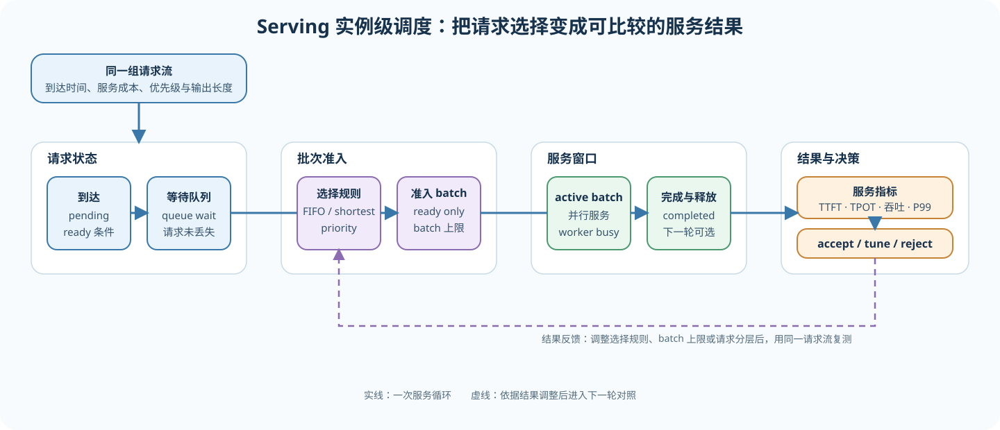
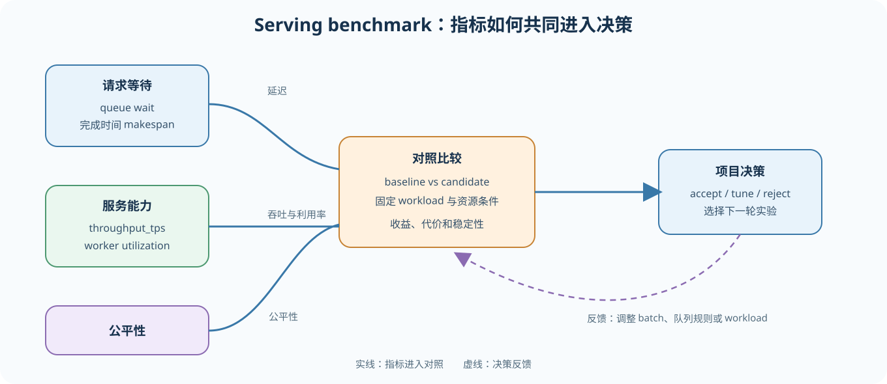
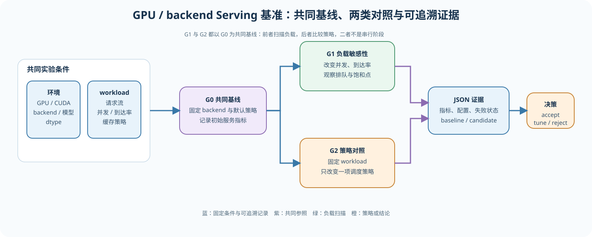

# 70. Serving Scheduler Benchmark | 推理服务调度基准
**难度：** Hard | **环境：** CPU-first | **标签：** `推理优化`, `推理服务`, `调度`, `基准对比` | **目标人群：** 项目决策练习者

> 🚀 **云端运行环境**
>
> 本章节的实战代码可以点击以下链接在免费 GPU 算力平台上直接运行：
>
> [](https://colab.research.google.com/github/datawhalechina/llm-algo-leetcode/blob/main/02_PyTorch_Algorithms/70_Serving_Scheduler_Benchmark.ipynb)
> [](https://modelscope.cn/my/mynotebook) *(国内推荐：魔搭社区免费实例)*


---
## 本节导读

本节从一组可复现的请求流和资源配置开始，先建立 serving baseline，再分别观察负载变化与调度策略对请求等待和服务能力的影响。
学习过程中，你会把“整体吞吐变高”与“部分请求等待更久”放在同一张结果表里，最后根据延迟、服务能力和公平性判断方案适合什么负载。

**关键词：** `serving scheduler`, `TTFT`, `TPOT`, `throughput`, `fairness`, `utilization`

---
## 前置阅读

**导语：** 开始前先了解 decode 调度、KV Cache 调度、PD 分离和前缀缓存如何改变请求的等待与执行顺序。阅读时关注请求状态、资源分配和服务指标之间的联系，随后把这些机制放入统一的 serving workload 中观察。
- [36. Decode Scheduling | 解码调度](./36_Decode_Scheduling.md)
- [37. KV Cache Scheduling | KV Cache 调度](./37_KV_Cache_Scheduling.md)
- [38. Prefill/Decode Scheduling | Prefill/Decode 调度](./38_Prefill_Decode_Scheduling.md)
- [69. Prefix Caching Benchmark | 前缀缓存基准](./69_Prefix_Caching_Benchmark.md)

---
### Step 1: 定义 serving 实例的调度目标

调度对象是 serving 实例中的请求及其等待状态。调度器主要决定三件事：请求何时进入执行队列、哪些请求组成一个 batch、资源有限时优先服务谁。

本节关注单模型 serving 实例内部的队列和 batch 组织。FIFO、shortest 和 batch 调度先作为可解释的教学策略，结合 36、37、38 中的请求推进、KV Cache 和 PD 分离机制，放回服务 workload 中比较。

| 本节问题 | 观察对象 | 学习产出 |
| --- | --- | --- |
| 请求如何排队 | 到达时间、等待时间、batch 选择 | 可解释的队列状态与等待记录 |
| 服务如何批处理 | batch size、batch speedup、worker busy time | 可比较的批处理效率 |
| 策略是否值得保留 | TTFT、TPOT、吞吐、公平性和尾延迟 | 面向服务质量的综合判断 |



### Step 2: 固定 baseline 与请求分布

serving benchmark 要结合 workload 讨论。相同模型、请求流、生成长度、cache policy 和资源配置，构成可比较的对照。先运行 G0，确认请求都完成，再决定后续是扫描负载还是比较策略。

| 实验组 | 固定条件 | 唯一变化 | 结论类型 |
| --- | --- | --- | --- |
| G0 serving baseline | 模型、backend、dtype、请求流、cache policy、worker 配置 | 无 | 共同参照和成功率基线 |
| G1 负载扫描 | 继承 G0 的模型和调度配置 | 并发或请求到达率 | 负载敏感性 |
| G2 策略对照 | 继承 G0 的请求流和资源配置 | 明确可控的调度策略或 scheduler 参数 | 单变量策略收益与代价 |
### Step 3: 比较服务收益与代价指标

这些指标要一起阅读：延迟类指标解释用户体验，吞吐和利用率解释整体服务能力，公平性和队列等待解释收益是否由少数请求承担。

| 指标 | 单位 | 主要回答的问题 | 趋势方向 |
| --- | --- | --- | --- |
| TTFT | ms | 用户等待第一个 token 多久 | 越低越好 |
| TPOT | ms/token | decode 阶段每个 token 间隔多久 | 越低越好 |
| queue wait | ms | 请求在执行前等待了多久 | 越低越好 |
| throughput | token/s 或 request/s | serving 实例整体处理能力是否提高 | 越高越好 |
| fairness | 0–1 | 是否牺牲部分请求换取整体吞吐 | 越高越好 |
| utilization | 0–1 | worker 是否持续工作 | 结合延迟和公平性判断 |


### Step 4（CPU 代码练习）：实现调度模拟、比较与决策

这一 Step 把前面的队列、batch 和指标口径写成四个相互衔接的 TODO：先模拟请求调度，再汇总运行结果、比较 baseline，最后形成 serving 决策。完成后先运行 CPU 测试，检查返回字段和判断方向。

| 类型 | 函数 | 你要完成或阅读的内容 | 运行后检查什么 |
|:---|:---|:---|:---|
| TODO 1 | `simulate_serving_scheduler` | 按 FIFO / shortest 选择 batch，计算等待、完成时间、吞吐和公平性 | `queue_wait_ms`、`makespan_ms`、`throughput_tps`、`fairness` |
| TODO 2 | `summarize_serving_scheduler_runs` | 汇总运行次数、平均吞吐并定位最低 TTFT 的运行 | `run_count`、`avg_throughput_tps`、`best_latency_run` |
| TODO 3 | `compare_scheduler_to_baseline` | 统一 baseline 与 candidate 的延迟、吞吐、公平性和利用率差值 | 五个对照指标及其方向 |
| TODO 4 | `recommend_serving_scheduler_run` | 按吞吐、延迟和公平性门槛输出项目决策 | `accept / tune / reject`、`reason`、`next_action`；只有三类条件同时满足才 accept |
#### 图解：36-37-38-69 如何收束到 70 推理服务调度基准

```text
36 decode scheduling -> 37 KV cache scheduling -> 38 PD disaggregation -> 69 prefix serving baseline
                                          |
                                          v
                          70 serving scheduler benchmark + delivery decision
```
项目页最小产物：

| 模块 | 必须记录 | 用途 |
|:---|:---|:---|
| baseline | workload、TTFT、TPOT、throughput、公平性 | 保证比较合法 |
| candidate | 调度规则、worker 利用率、缓存/队列收益 | 解释 serving 收益来源 |
| 对比 | 延迟变化、吞吐增益、公平性变化、利用率变化 | 判断是否值得 adopt |
| 决策 | accept / tune / reject | 输出 benchmark 结论 |

```python
from typing import Dict, List

```


```python
# 4 个核心 TODO：请求调度模拟、workload 汇总、baseline 对比、项目判断
# 目标：先用 CPU 验证排队/批处理状态，再把调度收益转成可比较的 benchmark 报告。
# CPU 题目区验证单 worker 的队列状态转移；真实 serving 的 batch、P99、GPU 利用率和平台扩缩容属于 GPU/backend 扩展。

# TODO 1: 模拟请求队列、批处理和完成时间
def simulate_serving_scheduler(requests: List[Dict[str, float]], policy: str = 'fifo', batch_size: int = 1, batch_speedup: float = 1.0) -> Dict[str, object]:
    """模拟单 worker 的到达、排队、批处理和完成时间；不测真实 GPU serving。

    arrival_ms、service_ms 和 output_tokens 分别表示请求到达时间、理想服务时长和输出 token 数；
    batch_speedup 是教学模型中的批处理加速因子，不代表线性或硬件实测加速。
    """
    if policy not in {'fifo', 'shortest'}:
        raise ValueError('policy 只能是 fifo 或 shortest')
    if batch_size < 1 or batch_speedup <= 0:
        raise ValueError('batch_size 必须 >= 1，batch_speedup 必须 > 0')
    # ==========================================
    # TODO 1：按到达时间推进队列，按 policy 取 batch，计算等待和完成指标。
    # 提示：FIFO 按到达顺序；shortest 按 service_ms 从小到大；输入顺序 _index 只作稳定 tie-break。
    # 变量提示：
    # pending = ???
    # queue = ???
    # completed = ???
    # batch = ???
    # now 和 busy 是循环中的派生状态，不单独挖空；请保持时间推进与批次占用逻辑清晰。
    #       每个请求读取 request_id、arrival_ms、service_ms、output_tokens。
    #       返回 request_count、completed_count、makespan_ms、throughput_tps、
    #       utilization、fairness、avg_queue_wait_ms 和 requests 明细。
    #       fairness 应基于请求等待/完成表现定义，不能用单一吞吐代替公平性。
    #       每个请求只能完成一次；空输入返回零计数；相同到达时间用 request_id 稳定排序。
    # ==========================================
    raise NotImplementedError("请先完成 TODO 代码！")

# TODO 2: 汇总调度运行结果
def summarize_serving_scheduler_runs(runs: List[Dict[str, float]]) -> Dict[str, object]:
    """汇总同一请求流和 batch 配置下的调度运行结果。

    输入至少包含 name、ttft_ms 和 throughput_tps；空列表返回可解释的空摘要。
    只汇总同一请求流、worker 和 batch 配置的运行；缺失指标不能补成真实的 0。"""
    # TODO 2：汇总多次调度运行结果。
    # 提示：
    # run_count = ???
    # avg_throughput_tps = ???
    # best_latency_run = ???
    #       缺失指标应明确报错；avg_throughput_tps 是报告均值，不等于单请求 latency。
    raise NotImplementedError("请先完成 TODO 代码！")

# TODO 3: 比较 baseline 与 candidate
def compare_scheduler_to_baseline(baseline: Dict[str, float], candidate: Dict[str, float]) -> Dict[str, float]:
    """计算 candidate 相对 baseline 的延迟、吞吐、公平性和利用率变化。

    TTFT/TPOT 差值越低越好，吞吐、公平性和利用率增益越高越好；两组结果
    必须使用同一请求流和资源配置。"""
    # TODO 3：比较 baseline 与 candidate 的延迟、吞吐、公平性和利用率。
    # 提示：
    # ttft_delta_ms = ???
    # tpot_delta_ms = ???
    # throughput_gain_tps = ???
    # fairness_delta = ???
    # utilization_delta = ???
    #       五个差值统一使用 candidate - baseline，结合指标方向阅读。
    raise NotImplementedError("请先完成 TODO 代码！")

# TODO 4: 输出 serving 调度决策
def recommend_serving_scheduler_run(
    baseline: Dict[str, float], candidate: Dict[str, float], min_throughput_gain: float, min_fairness: float
) -> Dict[str, object]:
    """按延迟、吞吐和公平性门槛给出教学决策。

    min_throughput_gain、min_fairness 属于当前 workload 的配置；该函数是
    可解释的筛选模板，不代表生产环境 SLA 或自动调参器。"""
    # TODO 4：先得到 comparison，再使用两个门槛输出 decision、reason、next_action。
    # 提示：
    # throughput_ok = ???
    # fairness_ok = ???
    # decision = ???
    # next_action = ???
    #       允许的 decision 是 accept / tune / reject；吞吐达标但公平性未达标时进入 tune。
    #       accept 必须同时满足吞吐、fairness 和延迟条件，不能只凭吞吐提升接受。
    raise NotImplementedError("请先完成 TODO 代码！")

```


```python
# 测试你的实现
def test_serving_scheduler_benchmark_template():
    requests = [
        {'request_id': 'r1', 'arrival_ms': 0, 'service_ms': 10, 'output_tokens': 20},
        {'request_id': 'r2', 'arrival_ms': 0, 'service_ms': 2, 'output_tokens': 20},
        {'request_id': 'r3', 'arrival_ms': 1, 'service_ms': 3, 'output_tokens': 20},
    ]
    simulation = simulate_serving_scheduler(requests, policy='fifo', batch_size=1)
    assert simulation['request_count'] == 3
    assert simulation['completed_count'] == 3
    assert simulation['makespan_ms'] == 15.0
    assert simulation['throughput_tps'] == 4000.0
    assert simulation['utilization'] == 1.0
    assert simulation['avg_queue_wait_ms'] == round((0.0 + 10.0 + 11.0) / 3, 4)
    assert simulation['requests'][0]['queue_wait_ms'] == 0.0
    assert simulation['requests'][1]['ttft_ms'] == 10.0
    assert 0.0 <= simulation['fairness'] <= 1.0
    shortest = simulate_serving_scheduler(requests, policy='shortest', batch_size=1)
    assert shortest['requests'][0]['request_id'] == 'r2'
    assert shortest['requests'][-1]['request_id'] == 'r1'
    batched = simulate_serving_scheduler(requests, policy='fifo', batch_size=2, batch_speedup=1.0)
    assert batched['completed_count'] == len(requests)
    assert batched['makespan_ms'] == 13.0
    assert batched['makespan_ms'] < simulation['makespan_ms']
    empty = simulate_serving_scheduler([])
    assert empty['request_count'] == 0 and empty['completed_count'] == 0
    try:
        simulate_serving_scheduler(requests, policy='unknown')
    except ValueError:
        pass
    else:
        raise AssertionError('非法调度策略应明确拒绝！')
    for invalid in ({'batch_size': 0}, {'batch_speedup': 0.0}):
        try:
            simulate_serving_scheduler(requests, **invalid)
        except ValueError:
            pass
        else:
            raise AssertionError('非法 batch 参数应明确拒绝！')
    baseline = {
        'name': 'fifo',
        'ttft_ms': 220,
        'tpot_ms': 42,
        'throughput_tps': 180,
        'fairness': 0.78,
        'utilization': 0.70,
    }
    candidate = {
        'name': 'priority_scheduler',
        'ttft_ms': 180,
        'tpot_ms': 36,
        'throughput_tps': 205,
        'fairness': 0.81,
        'utilization': 0.79,
    }
    summary = summarize_serving_scheduler_runs([baseline, candidate])
    assert summary['run_count'] == 2
    assert summary['best_latency_run'] == 'priority_scheduler'
    assert summary['avg_throughput_tps'] == 192.5
    assert summarize_serving_scheduler_runs([]) == {'run_count': 0, 'best_latency_run': None, 'avg_throughput_tps': 0.0}

    comparison = compare_scheduler_to_baseline(baseline, candidate)
    assert comparison['ttft_delta_ms'] == -40
    assert comparison['tpot_delta_ms'] == -6
    assert comparison['throughput_gain_tps'] == 25
    assert comparison['fairness_delta'] == 0.03
    assert comparison['utilization_delta'] == 0.09

    decision = recommend_serving_scheduler_run(baseline, candidate, min_throughput_gain=20, min_fairness=0.8)
    assert decision['decision'] == 'accept'
    assert decision['next_action'] == 'promote_to_serving_rollout'

    weak_candidate = {
        'name': 'aggressive_batching',
        'ttft_ms': 195,
        'tpot_ms': 38,
        'throughput_tps': 202,
        'fairness': 0.76,
        'utilization': 0.82,
    }
    weak_decision = recommend_serving_scheduler_run(baseline, weak_candidate, min_throughput_gain=20, min_fairness=0.8)
    assert weak_decision['decision'] == 'tune'
    assert comparison['throughput_gain_tps'] > 0
    assert comparison['fairness_delta'] > 0

    bad_candidate = {
        'name': 'overfit_scheduler',
        'ttft_ms': 260,
        'tpot_ms': 48,
        'throughput_tps': 170,
        'fairness': 0.60,
        'utilization': 0.66,
    }
    bad_decision = recommend_serving_scheduler_run(baseline, bad_candidate, min_throughput_gain=20, min_fairness=0.8)
    assert bad_decision['decision'] == 'reject'


test_serving_scheduler_benchmark_template()
print('测试通过：推理服务调度基准模板可以工作。')
```

🛑 **STOP HERE** 🛑

请先尝试自己完成代码并跑通测试。如果你在 Colab 中运行，并且暂时没有思路，再继续看下面的参考答案。
## 参考代码与解析

### 代码

```python
from typing import Dict, List

# TODO 1: 模拟请求队列、批处理和完成时间
def simulate_serving_scheduler(requests: List[Dict[str, float]], policy: str = 'fifo', batch_size: int = 1, batch_speedup: float = 1.0) -> Dict[str, object]:
    """模拟单 worker 的到达、排队、批处理和完成时间。

    在本模型中，queue_wait_ms 是请求从到达到 batch 开始的等待时间；
    它与 TTFT 相同只是因为模型把首 token 生成时间简化为 0。"""
    if policy not in {'fifo', 'shortest'}:
        raise ValueError('policy 只能是 fifo 或 shortest')
    if batch_size < 1 or batch_speedup <= 0:
        raise ValueError('batch_size 必须 >= 1，batch_speedup 必须 > 0')
    if not isinstance(requests, list):
        raise TypeError('requests 必须是 list[dict]')
    if not requests:
        return {'request_count': 0, 'completed_count': 0, 'makespan_ms': 0.0, 'throughput_tps': 0.0, 'utilization': 0.0, 'fairness': 1.0, 'requests': []}
    pending = []
    for index, item in enumerate(requests):
        arrival = float(item.get('arrival_ms', 0.0))
        service = float(item.get('service_ms', 0.0))
        tokens = int(item.get('output_tokens', 0))
        if arrival < 0 or service <= 0 or tokens < 0:
            raise ValueError('arrival_ms >= 0，service_ms > 0，output_tokens >= 0')
        pending.append({**item, '_index': index, 'arrival_ms': arrival, 'service_ms': service, 'output_tokens': tokens})
    # TODO 1 对应变量 pending：按到达时间准备待处理请求，并保留输入顺序 _index。
    pending.sort(key=lambda item: (item['arrival_ms'], item['_index']))
    queue, completed, cursor = [], [], 0
    now = busy = 0.0
    while cursor < len(pending) or queue:
        if not queue and cursor < len(pending):
            now = max(now, pending[cursor]['arrival_ms'])
        while cursor < len(pending) and pending[cursor]['arrival_ms'] <= now:
            queue.append(pending[cursor]); cursor += 1
        if policy == 'shortest':
            queue.sort(key=lambda item: (item['service_ms'], item['_index']))
        else:
            queue.sort(key=lambda item: item['_index'])
        # TODO 1 对应变量 queue：收集当前时刻已到达且尚未处理的请求。
        # TODO 1 对应变量 batch：按 policy 从 queue 中取出本轮请求。
        batch = queue[:batch_size]; del queue[:len(batch)]
        start = now
        duration = max(item['service_ms'] for item in batch) / batch_speedup
        now += duration; busy += duration
        for item in batch:
            completed.append({
                'request_id': item.get('request_id', f"request-{item['_index']}"),
                'queue_wait_ms': round(start - item['arrival_ms'], 4),
                'ttft_ms': round(start - item['arrival_ms'], 4),
                'e2e_ms': round(now - item['arrival_ms'], 4),
                'output_tokens': item['output_tokens'],
            })
    makespan = now - min(item['arrival_ms'] for item in pending)
    waits = [item['ttft_ms'] for item in completed]
    mean_wait = sum(waits) / len(waits) if waits else 0.0
    spread = (max(waits) - min(waits)) if waits else 0.0
    fairness = max(0.0, 1.0 - spread / max(mean_wait, 1.0))
    total_tokens = sum(item['output_tokens'] for item in completed)
    avg_queue_wait_ms = sum(item['queue_wait_ms'] for item in completed) / len(completed) if completed else 0.0
    # TODO 1 对应变量 completed：记录每个请求一次且仅一次的完成明细。
    # TODO 1 对应结果：由 completed 和 busy 汇总等待、吞吐、利用率和公平性。
    return {
        'request_count': len(pending), 'completed_count': len(completed),
        'makespan_ms': round(makespan, 4),
        'throughput_tps': round(total_tokens / (makespan / 1000.0), 4) if makespan else 0.0,
        'utilization': round(busy / makespan, 4) if makespan else 0.0,
        'avg_queue_wait_ms': round(avg_queue_wait_ms, 4),
        'fairness': round(fairness, 4), 'requests': completed,
    }

# TODO 2: 汇总调度运行结果
def summarize_serving_scheduler_runs(runs: List[Dict[str, float]]) -> Dict[str, object]:
    """汇总同一请求流和 batch 配置下的调度运行结果。

    每条 run 应包含 name、ttft_ms 和 throughput_tps；空列表返回空摘要。
    缺失指标不能静默解释为真实的 0。"""
    if not isinstance(runs, list):
        raise TypeError('runs 必须是 list[dict]')
    required = {'name', 'ttft_ms', 'throughput_tps'}
    for index, item in enumerate(runs):
        if not isinstance(item, dict) or not required.issubset(item):
            raise ValueError(f'第 {index} 条 run 必须包含 {sorted(required)}')
    # TODO 2 对应变量 run_count：统计输入运行次数。
    # TODO 2 对应变量 avg_throughput_tps：计算同一 workload 的平均吞吐。
    # TODO 2 对应变量 best_latency_run：定位 TTFT 最低的运行。
    best = None
    run_count = len(runs)
    avg_throughput_tps = sum(item.get('throughput_tps', 0.0) for item in runs) / run_count if run_count else 0.0
    for item in runs:
        if best is None or item.get('ttft_ms', float('inf')) < best.get('ttft_ms', float('inf')):
            best = item
    return {'run_count': run_count, 'best_latency_run': best.get('name', 'run') if best else None, 'avg_throughput_tps': avg_throughput_tps}


# TODO 3: 比较 baseline 与 candidate
def compare_scheduler_to_baseline(baseline: Dict[str, float], candidate: Dict[str, float]) -> Dict[str, float]:
    """计算 candidate 相对 baseline 的延迟、吞吐、公平性和利用率变化。"""
    required = {'ttft_ms', 'tpot_ms', 'throughput_tps', 'fairness', 'utilization'}
    for name, item in (('baseline', baseline), ('candidate', candidate)):
        if not isinstance(item, dict) or not required.issubset(item):
            raise ValueError(f'{name} 必须包含 {sorted(required)}')
    # TODO 3 对应变量 ttft_delta_ms / tpot_delta_ms：统一使用 candidate - baseline。
    # TODO 3 对应变量 throughput_gain_tps：计算 candidate 的吞吐增益。
    # TODO 3 对应变量 fairness_delta / utilization_delta：计算公平性和利用率变化。
    return {
        'ttft_delta_ms': round(candidate.get('ttft_ms', 0.0) - baseline.get('ttft_ms', 0.0), 4),
        'tpot_delta_ms': round(candidate.get('tpot_ms', 0.0) - baseline.get('tpot_ms', 0.0), 4),
        'throughput_gain_tps': round(candidate.get('throughput_tps', 0.0) - baseline.get('throughput_tps', 0.0), 4),
        'fairness_delta': round(candidate.get('fairness', 0.0) - baseline.get('fairness', 0.0), 4),
        'utilization_delta': round(candidate.get('utilization', 0.0) - baseline.get('utilization', 0.0), 4),
    }


# TODO 4: 输出 serving 调度决策
def recommend_serving_scheduler_run(
    baseline: Dict[str, float], candidate: Dict[str, float], min_throughput_gain: float, min_fairness: float
) -> Dict[str, object]:
    """按延迟、吞吐和公平性门槛给出教学决策。"""
    if min_throughput_gain < 0:
        raise ValueError('min_throughput_gain 不能为负数')
    if not 0 <= min_fairness <= 1:
        raise ValueError('min_fairness 必须位于 [0, 1]')
    # TODO 4 对应变量 comparison：先复用 TODO 3 的对照结果。
    # TODO 4 对应变量 throughput_ok / fairness_ok：分别检查吞吐和公平性门槛。
    # TODO 4 对应分支 decision：延迟、吞吐、公平性均达标才 accept；否则区分 tune / reject。
    # TODO 4 对应返回 reason / next_action：解释决策并给出下一步。
    comparison = compare_scheduler_to_baseline(baseline, candidate)
    throughput_ok = comparison['throughput_gain_tps'] >= min_throughput_gain
    fairness_ok = candidate.get('fairness', 0.0) >= min_fairness
    if (
        comparison['ttft_delta_ms'] < 0
        and comparison['tpot_delta_ms'] <= 0
        and throughput_ok
        and fairness_ok
    ):
        return {
            'decision': 'accept',
            'reason': '延迟、吞吐和公平性都达标，适合进入真实 serving 验证',
            'next_action': 'promote_to_serving_rollout',
        }
    if comparison['throughput_gain_tps'] >= 0 and comparison['utilization_delta'] >= 0:
        return {
            'decision': 'tune',
            'reason': '吞吐和利用率已有改善，但公平性或延迟边界还不够稳',
            'next_action': 'refine_queue_rules_or_worker_split',
        }
    return {
        'decision': 'reject',
        'reason': 'candidate 没有形成可信的 serving 调度收益',
        'next_action': 'fallback_to_scheduler_audit',
    }
```

### 解析

这页按 `simulate -> summarize -> compare -> decide` 组织 serving scheduler 的最小项目闭环。

**1. TODO 1：模拟请求队列与批处理**
- **实现方式**：按请求到达时间推进单 worker 时钟，把已到达请求放入队列；再按 FIFO 或 shortest policy 选择 batch，计算等待、TTFT、E2E 和整体吞吐。
- **关键点**：`service_ms` 是 CPU 教学成本模型；`utilization` 使用 busy time / makespan，`fairness` 使用请求等待表现计算。
- **技术细节**：`request_count`、`completed_count`、`makespan_ms`、`throughput_tps`、`avg_queue_wait_ms` 和 `requests` 明细需要同时保持一致。

**2. TODO 2：汇总调度运行结果**
- **实现方式**：统计运行次数和平均吞吐，再找出 TTFT 最低的运行。
- **关键点**：每条运行记录需要包含 `name`、`ttft_ms` 和 `throughput_tps`；空列表返回空摘要，缺失字段应明确报错。
- **技术细节**：`best_latency_run` 用于定位优先回看的调度策略，`avg_throughput_tps` 是多次运行的报告均值。

**3. TODO 3：比较 baseline 与 candidate**
- **实现方式**：统一计算 `ttft_delta_ms`、`tpot_delta_ms`、`throughput_gain_tps`、`fairness_delta` 和 `utilization_delta`。
- **关键点**：五个差值统一使用 candidate - baseline；延迟类指标越低越好，其余指标结合增益方向阅读。
- **技术细节**：比较结果同时保留用户体验、服务能力、公平性和 worker 利用率，供决策函数继续使用。

**4. TODO 4：形成 serving 调度决策**
- **实现方式**：根据 `throughput_ok`、`fairness_ok` 和延迟条件，结合当前 workload 门槛输出 `accept / tune / reject`。
- **关键点**：吞吐达标但公平性或延迟条件不足时进入 `tune`；没有可信收益时返回 `reject`。
- **技术细节**：`min_throughput_gain` 和 `min_fairness` 是当前 workload 的配置，不代表生产环境 SLA。
### Step 5（可选）：GPU/backend 实验——真实 serving workload 对照

真实实验沿着“环境预检 → 固定 workload → G0 baseline → G1 负载扫描 → G2 策略对照 → JSON 报告”的顺序执行。先确认 backend 能启动，再解释指标变化；负载扫描和调度策略对照要分别记录。

#### 5.1 环境、输入与固定条件
本次实验回答一个具体问题：在同一 serving workload 下，负载变化和调度策略分别如何影响请求等待与服务能力。先记录实验契约，再区分 G1 负载扫描和 G2 策略对照；不能把负载变化直接解释成调度策略收益。

| 实验要素 | 本轮契约 | G0 / G1 / G2 如何保持一致 | 证据输出 |
|:---|:---|:---|:---|
| 实验对象 | G0 serving baseline；G1 负载扫描；G2 策略对照 | 使用同一模型、backend、dtype 和硬件 | 分组结果可比较 |
| 固定 workload | 请求流、生成长度、warmup、重复次数 | G1 只改变并发或到达率；G2 保持请求流和资源不变 | 统一 workload 记录 |
| 本轮变量 | G1 负载参数；G2 可控 scheduler 参数 | 每组只改变一个实验因素 | 负载敏感性或策略收益 |
| 观察指标 | TTFT、TPOT、吞吐、P95/P99、queue wait、peak memory、fairness、utilization、I/O 与 handoff | 使用同一测量和统计口径 | JSON 与复测记录 |

**统一项目证据字段**

| 公共字段 | 记录内容 | 本节要求 |
|:---|:---|:---|
| `project` / `role` | 项目编号、`baseline` 或 `candidate` | G0/G1/G2 的角色、负载扫描或策略对照必须明确 |
| `workload` / `config` | 模型、backend、dtype、请求流、生成长度、batch、concurrency、seed、repeat | baseline 与 candidate 使用同一 workload；G1 只改变声明的负载因素 |
| `metrics` | TTFT、TPOT、throughput、P95/P99、peak memory、queue wait | 负载敏感性和策略收益分开解释 |
| `metrics` 中的 I/O 字段 | input transfer、network wait、handoff、recompute、通信暴露、overlap、stream output | 与 07 的证据契约一致；不适用字段写 `not_available` |
| `strategy_metrics` | acceptance / hit rate、fairness、utilization、调度器特有字段 | 策略字段不能替代公共 I/O 证据 |
| `quality` / `status` | 输出质量、服务状态、失败原因 | 记录 `ok`、`unsupported`、`OOM` 或 `failed` |
| `evidence_level` / `decision` | 证据等级、`accept / tune / reject`、复测路径 | 参数未生效或证据不足时保留 `tune` |



#### 5.2 环境启动检查（可独立运行）
确认 OpenAI-compatible endpoint、模型、端口和 workload 可以启动并完成 smoke test。更换 GPU、驱动、backend 或服务版本后，需要重新记录环境和启动结果。

#### 5.3 配置实验条件
G0 是 serving baseline；G1 只扫描并发或请求到达率；G2 只有在 backend 暴露可控 scheduler 参数时，才比较调度策略。三组实验分别保存配置和结果路径。

#### 5.4 执行实验并保存 JSON
按 G0、G1、G2 的配置运行相同 benchmark，保存 TTFT、TPOT、吞吐、P95/P99、队列等待、公平性、显存，以及输入搬运、网络等待、KV handoff、重算、通信暴露、重叠比例和流式输出字段。模型加载时间单独标记 `cold_start`，不要混入热请求 TTFT。统一清单使用 `70_serving_scheduler.json`，分组结果使用 `70_serving_scheduler_<group>.json`。G1 的结果应标记为负载敏感性，不能直接写成调度策略收益；unsupported、OOM 或失败结果要同时保存 `failure_reason` 与 `retest_path`。


#### 5.5 实测记录与结果表
先核对实测环境与统一口径，再读取 JSON 并填写复测记录。GPU 利用率、P99 和公平性必须保留证据来源；历史结果只能展示记录格式，不能替代当前硬件上的复测。

**实测环境与统一口径**

| 项目 | 当前记录 | 如何解读 |
|:---|:---|:---|
| 模型、backend、服务版本 | 待填写 | G0/G1/G2 必须记录同一版本口径 |
| GPU、驱动、CUDA、dtype | 待填写 | 更换运行环境后重新采集 |
| 请求流、生成长度、warmup / repeats | 待填写 | 负载扫描与策略对照分别记录 |
| 指标与证据来源 | backend metrics、日志、trace 或服务端记录 | 不能把 CPU 代理值写成 GPU 实测；I/O 字段需注明来源 |

**主线结果与复测记录**


| 实验组 / role | workload / config | model / backend / dtype | concurrency | TTFT P50/P99 | TPOT | throughput | queue wait | peak memory | input transfer / network wait | handoff / recompute | exposed comm / overlap | stream output / cold start | fairness / utilization | quality / status | evidence / decision |
|---|---|---:|---|---:|---:|---:|---:|---:|---|---|---|---|---|---|---|
| G0 / baseline | 固定 workload / baseline | 待填写 | 固定 | 待采集 | 待采集 | 待采集 | 待采集 | 待采集 | 待采集 / 待采集 | 不适用 / 不适用 | 待采集 / 待采集 | 待采集 / warm | 参考值 / 待采集 | 待填写 / ok | gpu_baseline_smoke / 待判断 |
| G1 / candidate | 负载扫描 / 仅改变并发或到达率 | 与 G0 相同 | 扫描 | 待采集 | 待采集 | 待采集 | 待采集 | 待采集 | 待采集 / 待采集 | 待采集 / 待采集 | 待采集 / 待采集 | 待采集 / warm | 待采集 / 待采集 | 待填写 / ok | real_backend_smoke / 待判断 |
| G2 / candidate | 策略对照 / 固定 workload | 与 G0 相同 | 固定 | 待采集 | 待采集 | 待采集 | 待采集 | 待采集 | 待采集 / 待采集 | 待采集 / 待采集 | 待采集 / 待采集 | 待采集 / warm | 待采集 / 待采集 | 待填写 / ok | real_backend_smoke / 待判断 |
| 失败 / 复测记录 | `failure_reason`、`retest_path` | 记录 unsupported、OOM、trace 或 backend metrics | — | — | — | — | — | — | — | — | — | failed / tune | 对应证据等级 | tune / reject |

#### 5.6 解释结果与形成决策
只有在 workload 对齐、调度参数确实生效、指标重复稳定时，才输出 `accept / tune / reject`。如果只是并发或到达率变化，应输出负载敏感性结论；如果公平性、P99 或 GPU 利用率证据不足，则保留待复测状态。

本节可以复用 vLLM / SGLang 的 OpenAI-compatible endpoint，但调度策略是否真正生效取决于 backend 的启动参数和版本。共享字段固定记录模型、backend、dtype、batch、并发与 cache policy；公平性、队列长度和 GPU 利用率等调度指标放入 `strategy_metrics`。

```python
try:
    from tools.inference_project_runtime import locate_repo_root
    REPO_ROOT = locate_repo_root()
    from tools.inference_project_runtime import (
        shared_project_config, save_project_result, start_optional_vllm,
        stop_optional_vllm, run_backend_benchmark,
    )
except ModuleNotFoundError:
    RUN_REAL_BACKEND = False
    def shared_project_config(**kwargs): return kwargs
    def save_project_result(*args, **kwargs): raise RuntimeError('需要从仓库根目录运行真实 backend 入口')

import json
MODEL_ID = 'Qwen/Qwen2.5-0.5B-Instruct'  # G0/G1 使用同一基座模型。
WORKLOAD = 'benchmarks/workloads/fixed.jsonl'  # 两组必须使用同一请求分布。
EXPERIMENT_TYPE = 'load_sensitivity'  # load_sensitivity / scheduler_compare；当前入口默认前者。
SCHEDULER_NOTE = 'G2 需要 backend 暴露可控调度参数后再执行'
RESULT_PATH = 'benchmarks/results/70_serving_scheduler.json'  # 保存负载扫描总清单。
MAX_TOKENS = 64
NUM_PROMPTS = 5  # smoke 规模；正式结论应提高请求数并重复运行。
WARMUP = 1
GROUPS = (
    {'name': 'g0_concurrency1', 'concurrency': 1},
    {'name': 'g1_concurrency4', 'concurrency': 4},
)
project_config = shared_project_config(
    model=MODEL_ID, backend='vllm', dtype='auto', generated_tokens=MAX_TOKENS,
    workload=WORKLOAD, num_prompts=NUM_PROMPTS, warmup=WARMUP,
    experiment_type=EXPERIMENT_TYPE, scheduler_note=SCHEDULER_NOTE, groups=GROUPS,
)
print(project_config)
RUN_REAL_BACKEND = False  # 改为 True 才启动 backend；默认保持 CPU-first。
if RUN_REAL_BACKEND:
    reports = []
    server, log_path, port, selected_dtype, model_path = start_optional_vllm(
        model_id=MODEL_ID, model_source='auto', dtype='auto',
        served_model_name=MODEL_ID,
    )
    try:
        for group in GROUPS:
            result_path = f"benchmarks/results/70_serving_scheduler_{group['name']}.json"
            report = run_backend_benchmark(
                project='70', base_url=f'http://127.0.0.1:{port}', model=MODEL_ID,
                label=f"vllm-{group['name']}", output=result_path, workload=WORKLOAD,
                num_prompts=NUM_PROMPTS, max_tokens=MAX_TOKENS,
                concurrency=group['concurrency'], warmup=WARMUP,
                dtype=selected_dtype, cache_policy='default',
            )
            reports.append({'group': group, 'report_path': result_path,
                            'normalized_result': report.get('normalized_result')})
            print(reports[-1])
    finally:
        stop_optional_vllm(server, log_path)
    manifest_path = Path(RESULT_PATH)
    manifest_path.parent.mkdir(parents=True, exist_ok=True)
    manifest_path.write_text(json.dumps({
        'project': '70', 'config': project_config, 'groups': reports,
        'evidence_boundary': 'load_sensitivity_not_scheduler_strategy_comparison',
    }, ensure_ascii=False, indent=2), encoding='utf-8')
    print(f'负载扫描清单已保存: {manifest_path}')
```

## 相关阅读

完成 serving 调度 benchmark 后，可继续观察调度器实现、负载扫描和分布式资源组织。下面的项目链接用于连接到后续并行实验，开源实现和开发文档用于对照真实 serving 系统中的调度与 batching 行为。
- [79. Distributed Parallel Benchmark | 分布式并行基准项目](./79_Distributed_Parallel_Benchmark.md)
- [81. Distributed Inference Logic Validation | 分布式推理逻辑验证](./81_Distributed_Inference_Project.md)
- [vLLM Scheduler 开源实现](https://github.com/vllm-project/vllm/blob/main/vllm/v1/core/sched/scheduler.py)
- [SGLang Benchmark and Profiling 开发文档](https://github.com/sgl-project/sglang/blob/main/docs_new/docs/developer_guide/benchmark_and_profiling.mdx)
- [SGLang Server Arguments：调度与 batching 配置](https://github.com/sgl-project/sglang/blob/main/docs/advanced_features/server_arguments.md)
