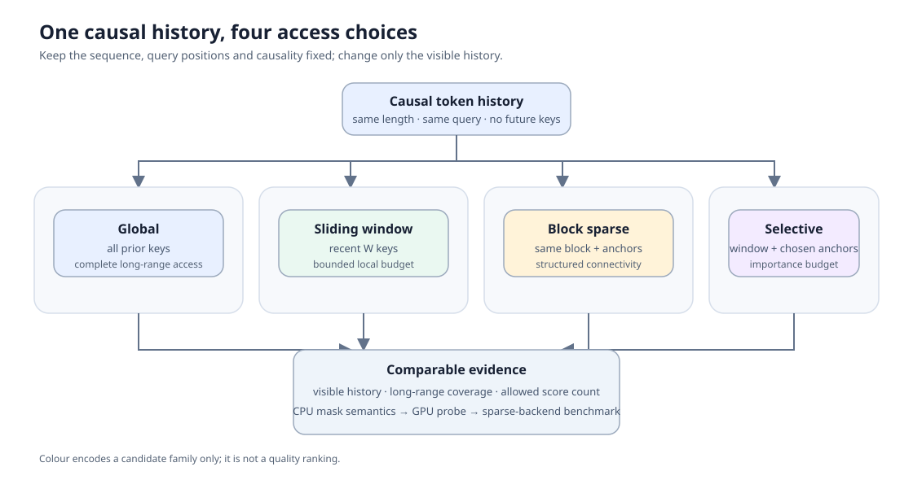
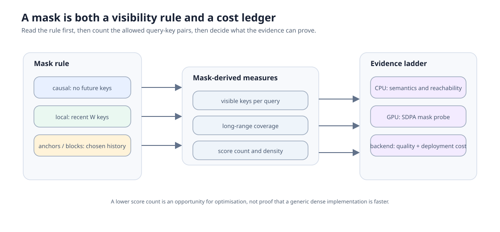

# 78. Attention Access Pattern Benchmark | Attention 访问模式基准

> 🚀 **云端运行环境**
>
> 本章节的实战代码可以点击以下链接在免费 GPU 算力平台上直接运行：
>
> [](https://colab.research.google.com/github/datawhalechina/llm-algo-leetcode/blob/main/02_PyTorch_Algorithms/78_Attention_Access_Pattern_Benchmark.ipynb)
> [](https://modelscope.cn/my/mynotebook) *(国内推荐：魔搭社区免费实例)*


局部窗口、块稀疏和选择性稀疏都在回答同一个问题：当前 token 应该读取多少历史、保留哪些远距离信息，以及为此付出多少注意力计算。这里把访问规则写成可检查的 mask，再用统一 workload 记录可见范围、长程保留和成本证据。

关键词：`causal mask`、`sliding window`、`block sparse`、`selective sparse`、`long-range coverage`。
## 前置阅读

- [04 Attention Core: MHA / GQA / KV Cache](04_Attention_MHA_GQA.md)：理解 Q、K、V、因果约束与 KV 状态。
- [44 Local, Sliding-Window and Sparse Attention](44_Local_Sliding_and_Sparse_Attention.md)：先认识不同访问范围改变了什么。
- [77 Long-Sequence Memory Architecture Benchmark](77_Long_Sequence_Memory_Architecture_Benchmark.md)：把访问范围放进更大的“历史如何保存”问题中。

本节不比较模型能力榜单；CPU 实验只验证访问语义和账本，GPU 探针只记录 PyTorch SDPA 在同一张量上的运行行为。
### Step 1：把历史访问范围写成受控候选

同一序列长度、同一因果方向和同一 query 位置下，候选之间只改变“哪些历史 key 可见”。全局注意力保留全部历史；滑动窗口保留最近邻域；块稀疏按块开放连接；选择性稀疏额外保留少量锚点。先固定这些条件，才能把可见性变化与成本变化放在一起解释。

| 候选 | 当前 token 可读取的历史 | 主要收益 | 主要风险 |
| --- | --- | --- | --- |
| `global` | 全部已出现 token | 长程依赖完整 | 连接数随长度二次增长 |
| `sliding_window` | 最近 `window_size` 个 token | 连接数受窗口约束 | 早期信息可能不可达 |
| `block_sparse` | 同块历史 + 全局锚点 | 结构化稀疏，利于实现 | 跨块信息依赖锚点 |
| `selective_sparse` | 最近窗口 + 被选锚点 | 把预算给重要历史 | 选择错误会丢失证据 |


### Step 2：访问规则同时决定覆盖与计算账本

mask 中每一个 `True` 都是一条允许的 query→key 读取连接。它既决定某个远距离 token 是否可达，也决定需要计算多少注意力分数。`window_size` 是最近历史的保留宽度；`block_size` 是块稀疏分组粒度；`anchor_positions` 是不随窗口淘汰的指定历史位置。

| 观察量 | 从 mask 怎样得到 | 用来回答的问题 |
| --- | --- | --- |
| `visible_keys` | 每个 query 行中允许的 key 数 | 当前 token 能读取多少历史 |
| `long_range_coverage` | 超出局部窗口的允许连接比例 | 远距离线索是否仍可达 |
| `score_count` | 全部允许连接数 | 相对的注意力分数计算量 |
| `density` | `score_count / causal_global_count` | 相比全局因果注意力保留了多少连接 |


### Step 3：先验证可达性，再讨论运行时间

理论连接数少不等于任务质量一定下降；同样，给 PyTorch SDPA 传入稀疏 mask 也不等于自动调用了专用稀疏 kernel。CPU 部分用“远处 needle 是否仍可见”检查访问语义；GPU 部分在相同 Q/K/V、长度和 dtype 下记录运行时间与峰值显存，并标出证据等级。

| 证据 | 能支持的结论 | 不能替代的结论 |
| --- | --- | --- |
| CPU mask 与 needle 检查 | 访问规则、因果性和远距离可达性 | 真实模型质量 |
| 连接数账本 | 相对计算规模 | kernel 实际效率 |
| GPU SDPA mask 探针 | 同一 PyTorch 路径下的运行行为 | 专用稀疏 attention backend 性能 |
| 真实 backend 基准 | 特定实现、模型与 workload 的部署结论 | 其他模型或硬件的泛化结论 |
### Step 4：代码设计——mask 契约、连接账本与采用建议

题目区按“先定义规则，再统计后果，最后给出建议”组织。`TODO 1` 防止不合法的窗口、块或锚点进入比较；`TODO 2` 生成因果访问 mask；`TODO 3` 从同一 mask 计算覆盖和成本代理；`TODO 4` 把质量门槛、成本预算和证据等级一起用于决策。测试分别检查契约、因果 mask、账本和决策，失败时可以定位到具体机制。

| TODO | 学习者完成的机制 | 关键不变量 |
| --- | --- | --- |
| 1 | 校验访问候选规格 | 候选合法；锚点在序列内；局部参数为正 |
| 2 | 构造四类因果 mask | 不能读取未来；不同模式只改变历史可见集合 |
| 3 | 汇总可见范围与连接账本 | `score_count` 与 mask 中连接数一致 |
| 4 | 形成 accept / tune / reject | 质量、成本、证据等级缺一不可 |

```python
from typing import Any, Dict, Iterable, List

import numpy as np
```


```python
# TODO 1：校验访问模式规格。
def validate_access_spec(spec: Dict[str, Any]) -> Dict[str, Any]:
    """Return a ready flag for one attention access candidate.

    Variables to determine:
    # pattern = ???          # global / sliding_window / block_sparse / selective_sparse
    # seq_len = ???          # positive sequence length
    # issues = ???           # invalid window, block or anchor positions
    """
    raise NotImplementedError('请先完成 TODO 1')


# TODO 2：从候选规格生成因果访问 mask。
def build_access_mask(spec: Dict[str, Any]) -> np.ndarray:
    """Return a bool mask shaped [query, key]; True means that key is visible.

    Variables to determine:
    # causal = ???           # key_index <= query_index
    # local_visible = ???    # retain the most recent window
    # anchor_visible = ???   # retain declared anchors when allowed by causality
    """
    raise NotImplementedError('请先完成 TODO 2')


# TODO 3：把 mask 汇总为覆盖与成本代理。
def summarize_access_pattern(mask: np.ndarray, *, local_window: int) -> Dict[str, Any]:
    """Measure visible keys, long-range coverage and allowed score count.

    Variables to determine:
    # score_count = ???          # number of True entries
    # long_range_allowed = ???   # visible keys older than local_window
    # density = ???              # relative to the causal global mask
    """
    raise NotImplementedError('请先完成 TODO 3')


# TODO 4：在质量、成本和证据等级下推荐候选。
def decide_access_pattern(records: List[Dict[str, Any]], *, min_quality: float, max_density: float) -> Dict[str, Any]:
    """Return accept/tune/reject for comparable attention access evidence.

    Variables to determine:
    # feasible = ???         # quality >= min_quality and density <= max_density
    # evidence_level = ???   # cpu_mask / gpu_sdpa_mask_probe / sparse_backend_benchmark
    # decision = ???         # accept only for a real sparse backend benchmark
    """
    raise NotImplementedError('请先完成 TODO 4')
```


```python
# Tests are split by responsibility: spec contract, causal visibility, ledger, and decision.
def test_access_spec_contract():
    spec = {'name': 'window', 'pattern': 'sliding_window', 'seq_len': 8, 'window_size': 3, 'anchor_positions': []}
    assert validate_access_spec(spec)['ready']
    assert not validate_access_spec({**spec, 'window_size': 0})['ready']
    assert not validate_access_spec({**spec, 'anchor_positions': [9]})['ready']
    return spec


def test_causal_access_masks(spec):
    global_mask = build_access_mask({'name': 'global', 'pattern': 'global', 'seq_len': 8, 'window_size': 3, 'anchor_positions': []})
    window_mask = build_access_mask(spec)
    selective_mask = build_access_mask({'name': 'selective', 'pattern': 'selective_sparse', 'seq_len': 8, 'window_size': 2, 'anchor_positions': [0]})
    assert not np.triu(global_mask, k=1).any()
    assert window_mask[7, 5] and not window_mask[7, 4]
    assert selective_mask[7, 0] and selective_mask[7, 6]
    return global_mask, window_mask


def test_access_ledger(global_mask, window_mask):
    global_stats = summarize_access_pattern(global_mask, local_window=3)
    window_stats = summarize_access_pattern(window_mask, local_window=3)
    assert global_stats['score_count'] > window_stats['score_count']
    assert global_stats['long_range_coverage'] > window_stats['long_range_coverage']
    assert 0 < window_stats['density'] < 1
    return global_stats, window_stats


def test_access_decision(global_stats, window_stats):
    records = [
        {'name': 'global', 'quality': 0.92, **global_stats, 'evidence_level': 'cpu_mask'},
        {'name': 'window', 'quality': 0.90, **window_stats, 'evidence_level': 'sparse_backend_benchmark'},
    ]
    result = decide_access_pattern(records, min_quality=0.88, max_density=0.7)
    assert result['decision'] == 'accept' and result['recommended_name'] == 'window'
    observed = decide_access_pattern([{**records[1], 'evidence_level': 'gpu_sdpa_mask_probe'}], min_quality=0.88, max_density=0.7)
    assert observed['decision'] == 'tune'


_window = test_access_spec_contract()
_global_mask, _window_mask = test_causal_access_masks(_window)
_global_stats, _window_stats = test_access_ledger(_global_mask, _window_mask)
test_access_decision(_global_stats, _window_stats)
print('测试通过：访问规格、因果可见性、连接账本与证据决策一致。')
```

---

## 参考代码与解析

```python
from typing import Any, Dict, List

import numpy as np


def validate_access_spec(spec: Dict[str, Any]) -> Dict[str, Any]:
    """TODO 1：校验模式、长度、局部参数与锚点位置。"""
    pattern = str(spec.get('pattern', ''))
    seq_len = int(spec.get('seq_len', 0))
    window_size = int(spec.get('window_size', 0))
    block_size = int(spec.get('block_size', 0))
    anchors = list(spec.get('anchor_positions', []))
    issues = []
    if pattern not in {'global', 'sliding_window', 'block_sparse', 'selective_sparse'}:
        issues.append('unsupported pattern')
    if seq_len <= 0:
        issues.append('seq_len must be positive')
    if pattern in {'sliding_window', 'selective_sparse'} and window_size <= 0:
        issues.append('window_size must be positive for local patterns')
    if pattern == 'block_sparse' and block_size <= 0:
        issues.append('block_size must be positive for block_sparse')
    if any(not isinstance(index, int) or index < 0 or index >= seq_len for index in anchors):
        issues.append('anchor_positions must be integer positions inside the sequence')
    return {'ready': not issues, 'issues': issues}


def build_access_mask(spec: Dict[str, Any]) -> np.ndarray:
    """TODO 2：构造四类候选的因果 query→key 可见性矩阵。"""
    contract = validate_access_spec(spec)
    if not contract['ready']:
        raise ValueError(f"非法访问规格：{contract['issues']}")
    pattern, seq_len = str(spec['pattern']), int(spec['seq_len'])
    window_size = int(spec.get('window_size', seq_len))
    block_size = int(spec.get('block_size', seq_len))
    anchors = set(spec.get('anchor_positions', []))
    mask = np.zeros((seq_len, seq_len), dtype=bool)
    for query_index in range(seq_len):
        for key_index in range(query_index + 1):
            local_visible = key_index >= max(0, query_index - window_size + 1)
            same_block = key_index // block_size == query_index // block_size
            anchor_visible = key_index in anchors
            if pattern == 'global':
                visible = True
            elif pattern == 'sliding_window':
                visible = local_visible
            elif pattern == 'block_sparse':
                visible = same_block or anchor_visible
            else:
                visible = local_visible or anchor_visible
            mask[query_index, key_index] = visible
    return mask


def summarize_access_pattern(mask: np.ndarray, *, local_window: int) -> Dict[str, Any]:
    """TODO 3：统计连接数、远程连接保留和相对稠密度。"""
    if mask.ndim != 2 or mask.shape[0] != mask.shape[1] or local_window <= 0:
        raise ValueError('mask must be square and local_window must be positive')
    seq_len = mask.shape[0]
    causal_global_count = seq_len * (seq_len + 1) // 2
    score_count = int(mask.sum())
    long_range_total = 0
    long_range_allowed = 0
    visible_per_query = []
    for query_index in range(seq_len):
        visible_per_query.append(int(mask[query_index].sum()))
        for key_index in range(query_index + 1):
            if key_index < query_index - local_window + 1:
                long_range_total += 1
                long_range_allowed += int(mask[query_index, key_index])
    return {
        'visible_keys_mean': float(np.mean(visible_per_query)),
        'score_count': score_count,
        'long_range_coverage': float(long_range_allowed / long_range_total) if long_range_total else 1.0,
        'density': float(score_count / causal_global_count),
        'evidence_level': 'cpu_mask',
    }


def decide_access_pattern(records: List[Dict[str, Any]], *, min_quality: float, max_density: float) -> Dict[str, Any]:
    """TODO 4：用质量、连接预算和证据等级形成采用建议。"""
    feasible = [record for record in records if float(record.get('quality', -1)) >= min_quality and float(record.get('density', 2)) <= max_density]
    if not feasible:
        return {'decision': 'reject', 'recommended_name': None, 'reason': '没有候选同时满足质量与连接预算'}
    best = min(feasible, key=lambda record: (float(record['density']), -float(record['quality'])))
    evidence_level = str(best.get('evidence_level', ''))
    if evidence_level == 'sparse_backend_benchmark':
        decision = 'accept'
        reason = '候选在真实稀疏 backend 中满足质量与连接预算'
    else:
        decision = 'tune'
        reason = 'mask 或 SDPA 探针只说明访问语义与当前路径，仍需真实稀疏 backend 复测'
    return {'decision': decision, 'recommended_name': best.get('name'), 'reason': reason}
```

### 答案解析

- 全局 mask 只受因果约束；局部和选择性规则把可见集合缩小到“最近窗口 + 少数锚点”；块稀疏按块开放历史，再用锚点保留跨块通道。
- `score_count` 是允许的 query-key 对数量，适合比较理论规模；`long_range_coverage` 说明远距离连接保留了多少，不能替代真实长文本任务得分。
- 只有真实稀疏 backend 在可比较模型、数据和 workload 下的记录，才足以给出 `accept`。CPU mask 与 GPU SDPA 探针都应进入下一轮复测，而不是直接外推部署收益。
### Step 5：可选 GPU 实验——同一 SDPA 路径的访问 mask 探针

GPU 实验沿用 CPU 的四类访问规则，固定 Q/K/V、序列长度、dtype 和 warmup。PyTorch SDPA 负责固定 mask 与输出语义；如果验证专用稀疏 kernel 或 Serving backend，必须另建候选并保存实际 backend、kernel、fallback、版本与命令，不能把普通 SDPA mask 结果写成专用实现收益。统一环境口径见[模型、执行栈与环境资产表](../gpu_environment_assets.md)。

```python
# 默认关闭：该探针需要 CUDA PyTorch；不会自动下载模型或启动服务。
RUN_ACCESS_GPU_PROBE = False
ACCESS_GPU_CONFIG = {
    'backend': 'torch_sdpa_mask_probe',
    'batch_size': 1,
    'num_heads': 8,
    'seq_len': 512,
    'head_dim': 64,
    'dtype': 'float16',
    'warmup': 5,
    'repeats': 20,
    'window_size': 128,
    'block_size': 128,
    'anchor_positions': [0],
    'result_dir': 'benchmarks/results/78_attention_access_patterns',
}
print('GPU probe disabled. Set RUN_ACCESS_GPU_PROBE=True after checking CUDA and workload.')
```

#### 5.2 环境与候选预检

```python
import json
from pathlib import Path
import time

import torch
import torch.nn.functional as F

if RUN_ACCESS_GPU_PROBE:
    if not torch.cuda.is_available():
        raise RuntimeError('需要 CUDA PyTorch；请保持 RUN_ACCESS_GPU_PROBE=False 或切换到可用 GPU。')
    device = torch.device('cuda')
    print({'device': torch.cuda.get_device_name(device), 'backend': ACCESS_GPU_CONFIG['backend']})
```

#### 5.3 固定 workload 与执行

```python
if RUN_ACCESS_GPU_PROBE:
    dtype = getattr(torch, ACCESS_GPU_CONFIG['dtype'])
    seq_len = ACCESS_GPU_CONFIG['seq_len']
    shape = (ACCESS_GPU_CONFIG['batch_size'], ACCESS_GPU_CONFIG['num_heads'], seq_len, ACCESS_GPU_CONFIG['head_dim'])
    torch.manual_seed(7)
    query = torch.randn(shape, device=device, dtype=dtype)
    key = torch.randn(shape, device=device, dtype=dtype)
    value = torch.randn(shape, device=device, dtype=dtype)
    candidates = [
        {'name': 'global', 'pattern': 'global', 'seq_len': seq_len, 'window_size': ACCESS_GPU_CONFIG['window_size'], 'anchor_positions': ACCESS_GPU_CONFIG['anchor_positions']},
        {'name': 'sliding_window', 'pattern': 'sliding_window', 'seq_len': seq_len, 'window_size': ACCESS_GPU_CONFIG['window_size'], 'anchor_positions': []},
        {'name': 'block_sparse', 'pattern': 'block_sparse', 'seq_len': seq_len, 'block_size': ACCESS_GPU_CONFIG['block_size'], 'anchor_positions': ACCESS_GPU_CONFIG['anchor_positions']},
        {'name': 'selective_sparse', 'pattern': 'selective_sparse', 'seq_len': seq_len, 'window_size': ACCESS_GPU_CONFIG['window_size'], 'anchor_positions': ACCESS_GPU_CONFIG['anchor_positions']},
    ]
    gpu_records = []
    for candidate in candidates:
        mask = torch.from_numpy(build_access_mask(candidate)).to(device=device)
        for _ in range(ACCESS_GPU_CONFIG['warmup']):
            F.scaled_dot_product_attention(query, key, value, attn_mask=mask)
        torch.cuda.synchronize()
        torch.cuda.reset_peak_memory_stats(device)
        start = time.perf_counter()
        for _ in range(ACCESS_GPU_CONFIG['repeats']):
            F.scaled_dot_product_attention(query, key, value, attn_mask=mask)
        torch.cuda.synchronize()
        elapsed_ms = (time.perf_counter() - start) * 1000 / ACCESS_GPU_CONFIG['repeats']
        stats = summarize_access_pattern(mask.cpu().numpy(), local_window=ACCESS_GPU_CONFIG['window_size'])
        gpu_records.append({
            'name': candidate['name'],
            'pattern': candidate['pattern'],
            'latency_ms': elapsed_ms,
            'peak_memory_mb': torch.cuda.max_memory_allocated(device) / 1024**2,
            **stats,
            'quality': None,
            'evidence_level': 'gpu_sdpa_mask_probe',
            'failure': None,
        })
    result_dir = Path(ACCESS_GPU_CONFIG['result_dir'])
    result_dir.mkdir(parents=True, exist_ok=True)
    ACCESS_RESULT_PATH = result_dir / f"access_sdpa_seq{seq_len}_{ACCESS_GPU_CONFIG['dtype']}.json"
    ACCESS_RESULT_PATH.write_text(json.dumps({'config': ACCESS_GPU_CONFIG, 'records': gpu_records}, indent=2), encoding='utf-8')
    print(f'written: {ACCESS_RESULT_PATH}')
```

#### 5.4 读取结果与形成下一步建议

```python
result_path = globals().get('ACCESS_RESULT_PATH')
if result_path is None:
    print('尚未生成 GPU 结果。完成 5.2–5.3 后，此处会读取 JSON 并显示四种访问模式的可比字段。')
else:
    payload = json.loads(Path(result_path).read_text(encoding='utf-8'))
    for record in payload['records']:
        print({key: record[key] for key in ('name', 'latency_ms', 'peak_memory_mb', 'density', 'long_range_coverage', 'evidence_level')})

    # SDPA mask 只验证相同执行路径下的访问规则，不登记为专用稀疏 kernel 收益。
    import sys
    repository_root = next(
        (path for path in (Path.cwd(), *Path.cwd().parents) if (path / 'tools' / 'architecture_result_schema.py').is_file()),
        None,
    )
    if repository_root is None:
        raise RuntimeError('未找到 tools/architecture_result_schema.py，请从教程仓库中运行本节。')
    if str(repository_root) not in sys.path:
        sys.path.insert(0, str(repository_root))

    from tools.architecture_result_schema import make_producer_record, save_record

    records_by_name = {item['name']: item for item in payload['records']}
    baseline_record = records_by_name['global']
    candidate_records = [item for item in payload['records'] if item['name'] != 'global']
    companion = make_producer_record(
        semantic_id='ARCH-ATTENTION-ACCESS',
        comparison_mode='controlled',
        source={
            'notebook': '02_PyTorch_Algorithms/78_Attention_Access_Pattern_Benchmark.ipynb',
            'raw_result_path': str(result_path),
        },
        runtime={
            'framework': 'pytorch',
            'backend': payload['config']['backend'],
            'device': 'cuda',
            'dtype': payload['config']['dtype'],
            'sparse_kernel_executed': False,
        },
        workload={
            key: payload['config'][key]
            for key in ('batch_size', 'num_heads', 'seq_len', 'head_dim', 'warmup', 'repeats')
        },
        baseline={'name': baseline_record['name'], 'pattern': baseline_record['pattern']},
        candidates=[{'name': item['name'], 'pattern': item['pattern']} for item in candidate_records],
        quality={
            'metric': None,
            'status': 'not_recorded',
            'reason': 'SDPA mask probe does not measure downstream model quality',
        },
        cost={
            item['name']: {
                'latency_ms': item['latency_ms'],
                'peak_memory_mb': item['peak_memory_mb'],
            }
            for item in payload['records']
        },
        mechanism={
            item['name']: {
                'pattern': item['pattern'],
                'density': item['density'],
                'long_range_coverage': item['long_range_coverage'],
                'score_count': item['score_count'],
            }
            for item in payload['records']
        },
        evidence_level='gpu_smoke',
        decision={
            'status': 'tune',
            'reason': 'quality and a dedicated sparse backend are not measured',
            'next_action': 'rerun the same workload with a supported sparse backend and quality set',
        },
    )
    companion_path = Path(result_path).with_name(Path(result_path).stem + '_architecture.json')
    if companion_path.exists():
        print(f'Companion already exists and was not overwritten: {companion_path}')
    else:
        save_record(companion_path, companion)
        print(f'Saved companion: {companion_path}')
    print('下一步：若需要部署结论，请在同一模型与 workload 上使用实际 sparse backend 重测质量与性能。')
```

## 相关阅读

- [Longformer: The Long-Document Transformer](https://arxiv.org/abs/2004.05150)：滑动窗口与全局 token 的经典设计。
- [Big Bird: Transformers for Longer Sequences](https://arxiv.org/abs/2007.14062)：随机、窗口和全局连接的块稀疏组合。
- [PyTorch scaled_dot_product_attention](https://pytorch.org/docs/stable/generated/torch.nn.functional.scaled_dot_product_attention.html)：理解本节 GPU 探针调用的 API 语义。
- [FlashAttention](https://arxiv.org/abs/2205.14135)：与“改变访问集合”不同，FlashAttention 主要改变密集 attention 的计算与存储路径。