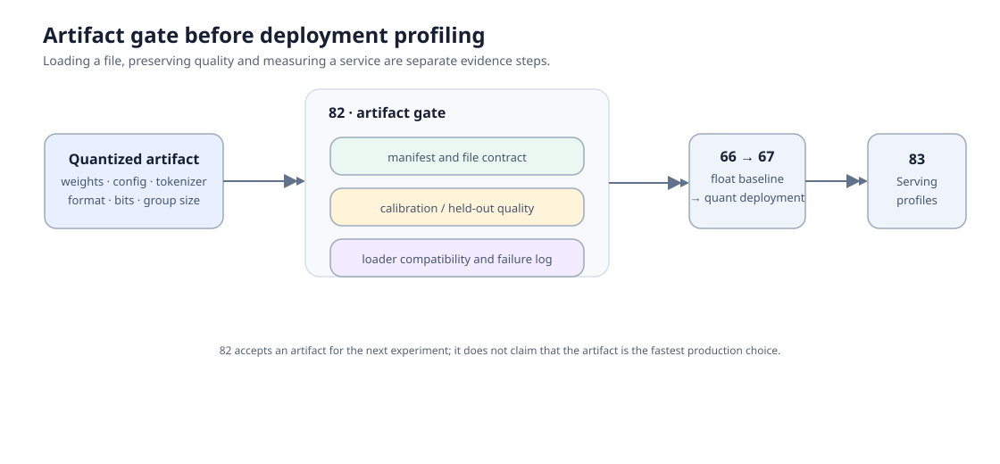
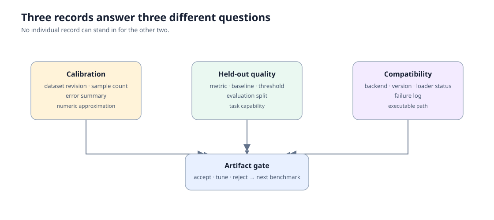

# 82. Quantization Artifact Evaluation Project | 量化产物评估项目

> 🚀 **云端运行环境**
>
> 本章节的实战代码可以点击以下链接在免费 GPU 算力平台上直接运行：
>
> [](https://colab.research.google.com/github/datawhalechina/llm-algo-leetcode/blob/main/02_PyTorch_Algorithms/82_Quantization_Artifact_Evaluation_Project.ipynb)
> [](https://modelscope.cn/my/mynotebook) *(国内推荐：魔搭社区免费实例)*


量化得到的 checkpoint、配置和量化参数并不自动构成可部署产物。这个项目先审计 artifact 是否可识别、校准与评测是否隔离、质量是否达到门槛、目标 backend 是否兼容；通过这些门槛后，才把候选交给 67 做部署对照、交给 83 做多 profile Serving 测量。

关键词：`artifact manifest`、`calibration`、`evaluation split`、`backend compatibility`、`evidence level`。
## 前置阅读

- [40 GPTQ / AWQ Quantization](40_GPTQ_and_AWQ_Weight_Quantization.md)：理解校准数据、误差和 weight-only 量化。
- [41 FP8 运行时低精度路径](41_FP8_and_KV_Cache_Quantization.md)：核对格式、缩放与 runtime kernel 证据。
- [66 Inference Performance Comparison](66_Inference_Performance_Comparison.md)：了解部署 benchmark 的浮点 baseline 契约。
- [67 Quantized Inference and Deployment](67_Quantized_Inference_and_Deployment.md)：在 artifact gate 之后做 backend 与 workload 对照。

本节的 CPU 实验不加载模型；它验证产物与证据的结构。GPU/backend 单元默认关闭，只有配置了本地 artifact 与 loader 命令才会执行。
### Step 1：把量化结果写成可审计的 artifact 候选

一个候选至少要能回答四件事：它来自哪个 base model revision，采用何种量化格式与参数，校准数据是什么，以及哪些文件共同构成可加载产物。把这些字段写进 manifest 后，格式不同的 GPTQ、AWQ、GGUF 或低比特训练导出才能进入同一套检查。

| manifest 区域 | 必填信息 | 作用 |
| --- | --- | --- |
| `model` | id、revision、架构族 | 识别量化前的基座 |
| `quantization` | format、bits、group size、scheme | 解释数值表示与适用 loader |
| `calibration` | dataset、revision、sample count | 追溯量化时使用的数据 |
| `files` | 权重、config、tokenizer 相对路径 | 检查产物是否完整 |
| `evidence` | quality、compatibility、failure | 防止把“文件存在”误当作可部署结论 |


### Step 2：校准误差、任务质量与加载兼容性是三类证据

校准集帮助估计低比特表示误差，评测集检查任务能力是否下降，loader smoke 则确认目标 backend 能读到同一组文件。三者的输入和结论不同：校准误差低不保证任务质量，质量达标也不保证 artifact 能由目标 backend 加载。

| 证据 | 最小记录 | 回答的问题 |
| --- | --- | --- |
| 校准 | 数据 revision、样本数、误差摘要 | 数值近似是否在预期范围 |
| 质量 | 独立评测集、指标、baseline、阈值 | 候选是否保留目标能力 |
| 兼容性 | backend、版本、加载结果、失败日志 | 目标执行路径能否识别 artifact |
| 复测 | hardware、workload、结果 JSON | 记录是否可重复和可交接 |


### Step 3：先过 artifact gate，再进入部署 benchmark

本节只做采用前的 gate：manifest 完整、校准与评测集隔离、质量达到阈值，并且没有未解释的 loader 失败。满足这些条件的候选仍需要在 66 的浮点 baseline 下进入 67，测量 TTFT、TPOT、吞吐、显存和目标 backend 路径；如果同一 artifact 要服务多个 workload，再由 83 比较 profile。

| 阶段 | 输入 | 输出 | 不在本节完成的事 |
| --- | --- | --- | --- |
| 82 artifact gate | manifest、质量记录、兼容性记录 | `accept / tune / reject` 与可追溯 JSON | 服务吞吐结论 |
| 66 / 67 部署对照 | 浮点 baseline + 已通过候选 | backend、质量与性能对照 | 多 workload 选型 |
| 83 Serving profile | 已加载 artifact + 多 workload | profile 选择与容量建议 | 重新定义 artifact 格式 |
### Step 4：代码设计——manifest 契约、证据隔离与采用建议

题目区把“文件是否存在”与“是否值得部署”分开。`TODO 1` 校验 artifact 的结构字段；`TODO 2` 检查校准与评测数据不重合；`TODO 3` 组合质量与兼容性记录；`TODO 4` 在预算和证据等级下给出决策。测试分别覆盖四项责任，避免把缺文件、数据泄漏、质量不达标和 loader 失败混成一个错误。

| TODO | 学习者实现的机制 | 关键不变量 |
| --- | --- | --- |
| 1 | manifest 准入 | 模型、量化、文件和证据字段完整 |
| 2 | 数据隔离检查 | calibration 与 evaluation 不能共享样本 id |
| 3 | 质量与兼容性 gate | 两类记录独立完整，失败可追溯 |
| 4 | 采用决策 | 质量、兼容性、显存预算和证据等级同时满足 |

```python
from typing import Any, Dict, List

import json
from pathlib import Path
```


```python
# TODO 1：校验量化 artifact 的 manifest。
def validate_artifact_manifest(manifest: Dict[str, Any]) -> Dict[str, Any]:
    """Return a ready flag for a deployable quantization artifact candidate.

    Variables to determine:
    # model = ???          # id and revision of the base model
    # quantization = ???   # format, bits and group_size
    # files = ???          # weights, config and tokenizer paths
    """
    raise NotImplementedError('请先完成 TODO 1')


# TODO 2：检查校准集与独立评测集是否隔离。
def validate_data_separation(calibration_ids: List[str], evaluation_ids: List[str]) -> Dict[str, Any]:
    """Return overlap ids; quality evidence is invalid when any ids overlap.

    Variables to determine:
    # calibration_set = ???
    # evaluation_set = ???
    # overlap = ???
    """
    raise NotImplementedError('请先完成 TODO 2')


# TODO 3：聚合质量与兼容性 gate。
def build_artifact_gate(manifest: Dict[str, Any], quality: Dict[str, Any], compatibility: Dict[str, Any]) -> Dict[str, Any]:
    """Combine manifest readiness with independent quality and loader records.

    Variables to determine:
    # quality_ready = ???        # metric, baseline_metric and threshold are present
    # compatibility_ready = ???  # backend, loader_status and version are present
    # issues = ???
    """
    raise NotImplementedError('请先完成 TODO 3')


# TODO 4：在质量、显存与证据等级下形成采用建议。
def decide_artifact_adoption(gate: Dict[str, Any], *, max_memory_mb: float) -> Dict[str, str]:
    """Return accept/tune/reject before the artifact enters deployment profiling.

    Variables to determine:
    # quality_ok = ???       # metric meets threshold
    # compatibility_ok = ??? # loader_status is loaded
    # decision = ???         # accept only for real loader evidence with no failures
    """
    raise NotImplementedError('请先完成 TODO 4')
```


```python
# Tests are split by responsibility: manifest, split isolation, artifact gate, and adoption.
def test_manifest_contract():
    manifest = {
        'model': {'id': 'toy/base', 'revision': 'r1'},
        'quantization': {'format': 'awq', 'bits': 4, 'group_size': 128},
        'calibration': {'dataset': 'toy-cal', 'revision': 'v1', 'sample_count': 128},
        'files': {'weights': 'model.safetensors', 'config': 'config.json', 'tokenizer': 'tokenizer.json'},
        'evidence': {'evidence_level': 'artifact_manifest_and_eval', 'failure': None},
    }
    assert validate_artifact_manifest(manifest)['ready']
    assert not validate_artifact_manifest({**manifest, 'files': {'weights': 'model.safetensors'}})['ready']
    return manifest


def test_data_split_isolation():
    assert validate_data_separation(['c1', 'c2'], ['e1', 'e2'])['ready']
    overlap = validate_data_separation(['c1', 'c2'], ['e2', 'c1'])
    assert not overlap['ready'] and overlap['overlap'] == ['c1']


def test_artifact_gate(manifest):
    quality = {'metric': 0.89, 'baseline_metric': 0.91, 'threshold': 0.87, 'eval_split': 'heldout-v1', 'peak_memory_mb': 1200}
    compatibility = {'backend': 'vllm', 'version': 'x.y', 'loader_status': 'loaded', 'failure': None}
    gate = build_artifact_gate(manifest, quality, compatibility)
    assert gate['ready'] and gate['quality']['metric'] == 0.89
    failed = build_artifact_gate(manifest, quality, {**compatibility, 'loader_status': 'failed', 'failure': 'unsupported format'})
    assert not failed['ready']
    return gate


def test_artifact_decision(gate):
    accepted = decide_artifact_adoption(gate, max_memory_mb=1500)
    assert accepted['decision'] == 'accept'
    observed = decide_artifact_adoption({**gate, 'evidence_level': 'cpu_manifest_gate'}, max_memory_mb=1500)
    assert observed['decision'] == 'tune'


_manifest = test_manifest_contract()
test_data_split_isolation()
_gate = test_artifact_gate(_manifest)
test_artifact_decision(_gate)
print('测试通过：artifact manifest、数据隔离、质量/兼容性 gate 与决策一致。')
```

---

## 参考代码与解析

```python
from typing import Any, Dict, List


def validate_artifact_manifest(manifest: Dict[str, Any]) -> Dict[str, Any]:
    """TODO 1：检查模型、量化、校准、文件与证据字段。"""
    issues = []
    model = manifest.get('model', {})
    quantization = manifest.get('quantization', {})
    calibration = manifest.get('calibration', {})
    files = manifest.get('files', {})
    evidence = manifest.get('evidence', {})
    for section, values, required in (
        ('model', model, ('id', 'revision')),
        ('quantization', quantization, ('format', 'bits', 'group_size')),
        ('calibration', calibration, ('dataset', 'revision', 'sample_count')),
        ('files', files, ('weights', 'config', 'tokenizer')),
        ('evidence', evidence, ('evidence_level', 'failure')),
    ):
        if not isinstance(values, dict):
            issues.append(f'{section} must be a mapping')
            continue
        issues.extend(
            f'missing {section}.{key}'
            for key in required
            if key not in values or (values.get(key) in (None, '') and not (section == 'evidence' and key == 'failure'))
        )
    if isinstance(quantization, dict) and quantization:
        if int(quantization.get('bits', 0)) <= 0:
            issues.append('quantization.bits must be positive')
        if int(quantization.get('group_size', 0)) <= 0:
            issues.append('quantization.group_size must be positive')
    return {'ready': not issues, 'issues': issues}


def validate_data_separation(calibration_ids: List[str], evaluation_ids: List[str]) -> Dict[str, Any]:
    """TODO 2：校准与评测样本必须无重叠。"""
    overlap = sorted(set(calibration_ids) & set(evaluation_ids))
    return {'ready': not overlap, 'overlap': overlap, 'issues': ['calibration/evaluation overlap'] if overlap else []}


def build_artifact_gate(manifest: Dict[str, Any], quality: Dict[str, Any], compatibility: Dict[str, Any]) -> Dict[str, Any]:
    """TODO 3：合并 manifest、独立质量与 loader 兼容性证据。"""
    manifest_check = validate_artifact_manifest(manifest)
    issues = list(manifest_check['issues'])
    for key in ('metric', 'baseline_metric', 'threshold', 'eval_split', 'peak_memory_mb'):
        if key not in quality:
            issues.append(f'missing quality.{key}')
    for key in ('backend', 'version', 'loader_status', 'failure'):
        if key not in compatibility:
            issues.append(f'missing compatibility.{key}')
    if not issues and str(compatibility['loader_status']) != 'loaded':
        issues.append(f"loader status: {compatibility['loader_status']}")
    if not issues and compatibility.get('failure'):
        issues.append(f"loader failure: {compatibility['failure']}")
    return {
        'ready': not issues,
        'issues': issues,
        'quality': quality,
        'compatibility': compatibility,
        'evidence_level': manifest.get('evidence', {}).get('evidence_level', 'cpu_manifest_gate'),
    }


def decide_artifact_adoption(gate: Dict[str, Any], *, max_memory_mb: float) -> Dict[str, str]:
    """TODO 4：质量、兼容性、显存和证据等级共同决定是否进入部署 benchmark。"""
    if not gate.get('ready'):
        return {'decision': 'reject', 'reason': 'artifact gate 未通过：' + '; '.join(gate.get('issues', []))}
    quality = gate['quality']
    quality_ok = float(quality['metric']) >= float(quality['threshold'])
    memory_ok = float(quality['peak_memory_mb']) <= max_memory_mb
    compatibility_ok = gate['compatibility'].get('loader_status') == 'loaded' and not gate['compatibility'].get('failure')
    if not (quality_ok and memory_ok and compatibility_ok):
        return {'decision': 'reject', 'reason': '质量、显存或 loader 兼容性未达到门槛'}
    if gate.get('evidence_level') != 'artifact_manifest_and_eval':
        return {'decision': 'tune', 'reason': '仍需真实 artifact manifest、独立评测和 loader 记录'}
    return {'decision': 'accept', 'reason': 'artifact 可进入 67 的部署 benchmark；多 workload 再进入 83'}
```

### 答案解析

- manifest 把基座、量化参数、校准来源、文件集合和证据等级放在同一可追溯记录中；任一文件缺失都不能假设 loader 会推断出来。
- 校准与独立评测回答不同问题，因此必须检查样本重叠。质量记录至少保留 baseline、阈值和 held-out split。
- `accept` 的含义是“可以进入部署 benchmark”，而不是“已经获得最佳吞吐”。67 仍需要同 workload 的浮点 baseline，83 才比较多个服务 profile。
### Step 5：可选 GPU/backend 实验——加载 artifact 并保存 gate 记录

在本地已有量化 artifact 时，配置 loader 命令、manifest 路径和独立评测结果。单元不会下载模型；执行后将 loader 返回码、环境、manifest 和质量记录写到 JSON，供 67/83 复用。

```python
# 默认关闭：填写本地 artifact 与明确的 loader 命令后再开启。
RUN_ARTIFACT_GATE = False
ARTIFACT_GATE_CONFIG = {
    'artifact_dir': '',
    'manifest_path': '',
    'backend': 'vllm',
    'loader_command': '',  # 例如实际项目的 load/smoke command；不要把示例当作可执行命令。
    'quality_record_path': '',
    'max_memory_mb': 0.0,  # 填入部署预算；0 表示只记录，不在 82 以显存门槛拒绝。
    'result_dir': 'benchmarks/results/82_quantization_artifact_evaluation',
}
print('Artifact gate disabled. Provide local paths and loader_command before enabling.')
```

#### 5.2 环境、manifest 与评测记录预检

```python
import json
from pathlib import Path
import platform
import subprocess

if RUN_ARTIFACT_GATE:
    artifact_dir = Path(ARTIFACT_GATE_CONFIG['artifact_dir'])
    manifest_path = Path(ARTIFACT_GATE_CONFIG['manifest_path'])
    quality_path = Path(ARTIFACT_GATE_CONFIG['quality_record_path'])
    missing = [str(path) for path in (artifact_dir, manifest_path, quality_path) if not path.exists()]
    if missing:
        raise FileNotFoundError(f'请先提供本地 artifact、manifest 和质量记录：{missing}')
    if not ARTIFACT_GATE_CONFIG['loader_command'].strip():
        raise ValueError('请配置实际 loader_command；82 不猜测 backend 启动方式。')
    print({'platform': platform.platform(), 'backend': ARTIFACT_GATE_CONFIG['backend'], 'artifact_dir': str(artifact_dir)})
```

#### 5.3 执行 loader smoke 并保存 JSON

```python
if RUN_ARTIFACT_GATE:
    manifest = json.loads(manifest_path.read_text(encoding='utf-8'))
    quality = json.loads(quality_path.read_text(encoding='utf-8'))
    compatibility = {
        'backend': ARTIFACT_GATE_CONFIG['backend'],
        'version': 'record-in-loader-output',
        'loader_status': 'pending',
        'failure': None,
    }
    completed = subprocess.run(ARTIFACT_GATE_CONFIG['loader_command'], shell=True, text=True, capture_output=True)
    compatibility['loader_status'] = 'loaded' if completed.returncode == 0 else 'failed'
    compatibility['failure'] = None if completed.returncode == 0 else completed.stderr[-1000:]
    gate = build_artifact_gate(manifest, quality, compatibility)
    result_dir = Path(ARTIFACT_GATE_CONFIG['result_dir'])
    result_dir.mkdir(parents=True, exist_ok=True)
    ARTIFACT_GATE_RESULT_PATH = result_dir / '82_quantization_artifact_gate.json'
    payload = {'config': ARTIFACT_GATE_CONFIG, 'manifest': manifest, 'quality': quality, 'compatibility': compatibility, 'gate': gate}
    # 原始 JSON 保留 backend 与 loader 细节；标准记录只用于跨项目衔接。
    from tools.quantization_result_schema import artifact_gate_record, save_record
    payload['normalized_result'] = artifact_gate_record(payload)
    ARTIFACT_GATE_RESULT_PATH.write_text(json.dumps(payload, indent=2, ensure_ascii=False), encoding='utf-8')
    normalized_path = result_dir / '82_quantization_artifact_gate_normalized.json'
    save_record(normalized_path, payload['normalized_result'])
    print(f'written: {ARTIFACT_GATE_RESULT_PATH}')
    print(f'normalized: {normalized_path}')
```

#### 5.4 读取记录并决定下一步

```python
result_path = globals().get('ARTIFACT_GATE_RESULT_PATH')
if result_path is None:
    print('尚未生成 artifact gate 记录。完成 5.2–5.3 后，此处将读取 JSON 并给出进入 67 或返回修复的建议。')
else:
    payload = json.loads(Path(result_path).read_text(encoding='utf-8'))
    budget_mb = float(ARTIFACT_GATE_CONFIG['max_memory_mb']) or float(payload['quality']['peak_memory_mb'])
    decision = decide_artifact_adoption(payload['gate'], max_memory_mb=budget_mb)
    print({'loader_status': payload['compatibility']['loader_status'], 'gate_ready': payload['gate']['ready'], **decision})
```

## 相关阅读

- [GPTQ: Accurate Post-Training Quantization](https://arxiv.org/abs/2210.17323)：校准与逐层误差控制。
- [AWQ: Activation-aware Weight Quantization](https://arxiv.org/abs/2306.00978)：以激活重要性决定权重保护策略。
- [vLLM Quantization](https://docs.vllm.ai/en/latest/features/quantization_compression/)：量化格式与 loader/backend 支持需要以实际版本为准。
- [Safetensors format](https://huggingface.co/docs/safetensors/index)：权重文件与 metadata 的可追溯存储格式。