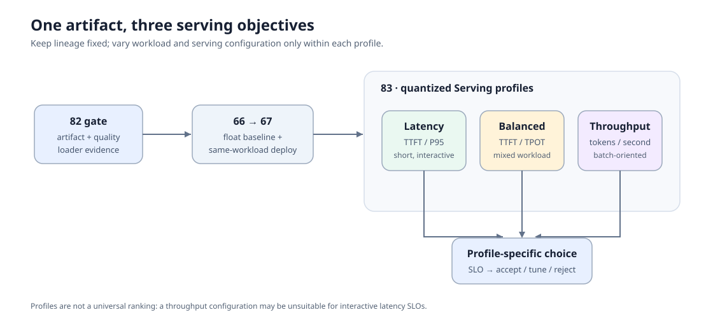
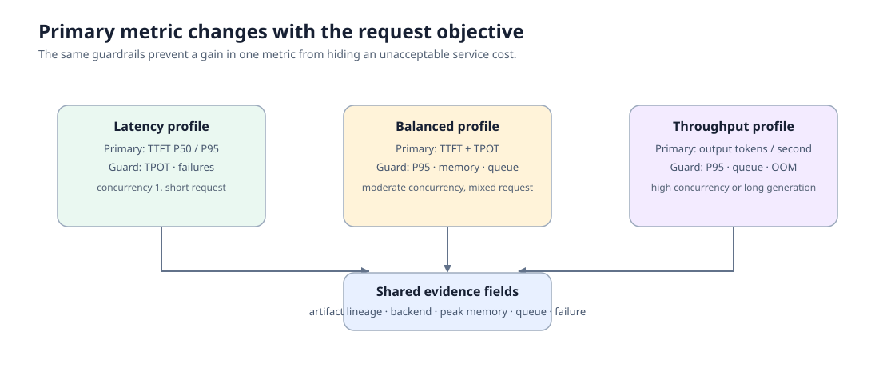

# 83. Quantized Serving Profile Benchmark | 量化 Serving Profile 基准

> 🚀 **云端运行环境**
>
> 本章节的实战代码可以点击以下链接在免费 GPU 算力平台上直接运行：
>
> [](https://colab.research.google.com/github/datawhalechina/llm-algo-leetcode/blob/main/02_PyTorch_Algorithms/83_Quantized_Serving_Profile_Benchmark.ipynb)
> [](https://modelscope.cn/my/mynotebook) *(国内推荐：魔搭社区免费实例)*


同一个量化 artifact 不会在所有请求形态下都表现最好。这里固定已经通过 artifact gate 的模型、格式、backend 和硬件，把请求目标分成低延迟、均衡和高吞吐三类 profile，记录每类 profile 的延迟、吞吐、显存、排队与失败证据，再按 SLO 选择配置。

关键词：`artifact lineage`、`SLO`、`TTFT`、`TPOT`、`P95`、`queue wait`、`serving profile`。
## 前置阅读

- [82 Quantization Artifact Evaluation Project](82_Quantization_Artifact_Evaluation_Project.md)：先确认 artifact、独立质量和 loader 兼容性。
- [66 Inference Performance Comparison](66_Inference_Performance_Comparison.md)：提供同模型、同 backend、同 workload 的浮点 G0 baseline。
- [67 Quantized Inference and Deployment](67_Quantized_Inference_and_Deployment.md)：确认量化候选在目标 backend 的部署对照。
- [36 Serving Scheduler Basics](36_Decode_Scheduling.md)：理解并发、排队与批处理为何改变尾延迟。

83 不重新校准权重或验证 artifact 格式；它只比较一个已通过 gate 的 artifact 在不同服务目标下应使用哪套 profile。
### Step 1：固定 artifact 血缘，再比较服务配置

服务 profile 的比较必须指向同一个 artifact。它应能回溯到 82 的 gate 记录、66 的浮点 baseline 和 67 的量化部署记录；模型 revision、量化格式、backend、硬件和 tokenizer 也必须一致。否则 profile 间的差异可能来自不同模型或不同加载路径，而不是调度和配置。

| 固定项 | 记录来源 | 为什么不能变化 |
| --- | --- | --- |
| artifact id / revision / format | 82 manifest | 避免比较不同权重或量化表示 |
| backend / version / hardware | 67 部署记录 | backend 版本会改变执行路径 |
| tokenizer 与质量门槛 | 82 质量记录 | 防止请求编码或能力标准漂移 |
| baseline workload 定义 | 66 / 67 | 保留同 workload 的性能参照 |


### Step 2：三类 profile 改变的是服务目标，不是模型能力

`latency` 面向交互式短请求，优先看 TTFT 与 P95；`balanced` 面向混合流量，兼顾 TPOT、吞吐和尾延迟；`throughput` 面向批量或离线场景，允许更高并发，但仍要记录 queue wait、失败和显存。三类请求可以使用不同并发和输入/输出长度，因此不能直接把原始耗时互相排序。

| profile | 典型 workload | 主指标 | 约束指标 |
| --- | --- | --- | --- |
| `latency` | 并发 1、短输入/短输出 | TTFT P50 / P95 | TPOT、失败率 |
| `balanced` | 中等并发、混合长度 | TTFT、TPOT、吞吐 | P95、显存、queue wait |
| `throughput` | 高并发或长生成 | 输出吞吐 | P95、排队、OOM / 失败率 |


### Step 3：先在 profile 内比较，再按 SLO 选用

每个 profile 内部应保持 prompt、输出上限、并发、重复次数和 backend 参数固定，只比较明确声明的一项服务配置，例如 batch 上限、KV cache 预算或 scheduler 设置。汇总时先过滤失败记录和 SLO 不达标候选，再选该 profile 下最符合主指标的配置；不同 profile 的推荐可以不同。

| 检查 | 记录方式 | 失败时的处理 |
| --- | --- | --- |
| 可比性 | 相同 artifact 血缘与 profile workload | 标为不可比较，不参与排序 |
| SLO | profile 对应的主指标和上限 | `tune` 或 `reject` |
| 资源 | peak memory、queue wait、错误数 | 记录压力来源与复测路径 |
| 质量引用 | 82 的 held-out quality gate | gate 失效时停止 Serving 比较 |
### Step 4：代码设计——血缘契约、profile 指标与 SLO 决策

题目区按服务选择的顺序组织。`TODO 1` 核验 82/66/67 的血缘字段；`TODO 2` 校验 profile workload 与 SLO；`TODO 3` 汇总可比较的 Serving 记录；`TODO 4` 为每个 profile 选择候选。测试分别覆盖血缘、profile 契约、指标汇总和决策，避免把吞吐收益掩盖尾延迟或失败。

| TODO | 学习者实现的机制 | 关键不变量 |
| --- | --- | --- |
| 1 | artifact 血缘检查 | 三份上游记录指向同一 artifact / backend / hardware |
| 2 | profile 契约 | 主指标、workload 与 SLO 同时存在 |
| 3 | Serving 记录汇总 | 无失败、同 profile、同血缘才可比较 |
| 4 | profile 选择 | 先过 SLO，再按本 profile 的主指标排序 |

```python
from typing import Any, Dict, List

import json
from pathlib import Path
```


```python
# TODO 1：校验来自 82、66、67 的 artifact 血缘。
def validate_artifact_lineage(gate: Dict[str, Any], baseline: Dict[str, Any], deployment: Dict[str, Any]) -> Dict[str, Any]:
    """Return ready only when upstream records describe the same serving candidate.

    Variables to determine:
    # artifact_id = ???  # same across gate and deployment
    # backend = ???      # same backend and version for baseline/deployment
    # issues = ???       # missing upstream decision or inconsistent lineage
    """
    raise NotImplementedError('请先完成 TODO 1')


# TODO 2：校验一个 Serving profile 的 workload 与 SLO。
def validate_serving_profile(profile: Dict[str, Any]) -> Dict[str, Any]:
    """Require a named workload, a primary metric and profile-appropriate limits.

    Variables to determine:
    # workload = ???      # concurrency, prompt_tokens, max_output_tokens, repeats
    # primary_metric = ???
    # slo = ???           # metric ceilings/floors for this profile
    """
    raise NotImplementedError('请先完成 TODO 2')


# TODO 3：汇总同 profile 内可比较的 Serving 记录。
def summarize_profile_records(records: List[Dict[str, Any]], profile: Dict[str, Any]) -> Dict[str, Any]:
    """Keep only matching, successful records and expose profile metrics.

    Variables to determine:
    # comparable = ???  # matching artifact_id, profile and workload id
    # failures = ???    # failed or non-comparable record names
    # summary = ???     # TTFT/TPOT/throughput/memory/queue fields
    """
    raise NotImplementedError('请先完成 TODO 3')


# TODO 4：按 profile 的 SLO 选择服务配置。
def recommend_serving_profile(summary: Dict[str, Any], profile: Dict[str, Any]) -> Dict[str, str]:
    """Return accept/tune/reject and the selected candidate for one profile.

    Variables to determine:
    # feasible = ???      # candidates satisfying all declared SLO values
    # primary_metric = ???
    # decision = ???      # accept only for real backend profile evidence
    """
    raise NotImplementedError('请先完成 TODO 4')
```


```python
# Tests are split by responsibility: lineage, profile contract, record summary and SLO decision.
def test_artifact_lineage():
    gate = {'artifact_id': 'awq-r1', 'backend': 'vllm', 'backend_version': '0.x', 'hardware': 'gpu-a', 'decision': 'accept'}
    baseline = {'artifact_id': 'fp16-r1', 'backend': 'vllm', 'backend_version': '0.x', 'hardware': 'gpu-a', 'decision': 'accept'}
    deployment = {'artifact_id': 'awq-r1', 'backend': 'vllm', 'backend_version': '0.x', 'hardware': 'gpu-a', 'gate_artifact_id': 'awq-r1', 'decision': 'accept'}
    assert validate_artifact_lineage(gate, baseline, deployment)['ready']
    assert not validate_artifact_lineage(gate, baseline, {**deployment, 'hardware': 'gpu-b'})['ready']
    return deployment


def test_profile_contract():
    profile = {'name': 'latency', 'workload': {'id': 'short-chat', 'concurrency': 1, 'prompt_tokens': 64, 'max_output_tokens': 64, 'repeats': 3}, 'primary_metric': 'ttft_p95_ms', 'slo': {'ttft_p95_ms': 500, 'failure_rate': 0.0}}
    assert validate_serving_profile(profile)['ready']
    assert not validate_serving_profile({**profile, 'workload': {}})['ready']
    return profile


def test_profile_summary(deployment, profile):
    records = [
        {'name': 'c1', 'artifact_id': 'awq-r1', 'profile': 'latency', 'workload_id': 'short-chat', 'status': 'ok', 'evidence_level': 'real_backend_profile', 'ttft_p95_ms': 380, 'tpot_p95_ms': 12, 'throughput_tps': 80, 'peak_memory_mb': 1300, 'queue_wait_p95_ms': 5},
        {'name': 'c2', 'artifact_id': 'awq-r1', 'profile': 'latency', 'workload_id': 'short-chat', 'status': 'failed', 'failure': 'oom'},
    ]
    summary = summarize_profile_records(records, profile)
    assert summary['comparable_count'] == 1 and summary['failures'] == ['c2']
    return summary


def test_profile_decision(summary, profile):
    result = recommend_serving_profile(summary, profile)
    assert result['decision'] == 'accept' and result['recommended_name'] == 'c1'
    tuned = recommend_serving_profile({**summary, 'evidence_level': 'cpu_profile_simulation'}, profile)
    assert tuned['decision'] == 'tune'


_deployment = test_artifact_lineage()
_profile = test_profile_contract()
_summary = test_profile_summary(_deployment, _profile)
test_profile_decision(_summary, _profile)
print('测试通过：artifact 血缘、Serving profile、指标汇总与 SLO 决策一致。')
```

---

## 参考代码与解析

```python
from typing import Any, Dict, List


def validate_artifact_lineage(gate: Dict[str, Any], baseline: Dict[str, Any], deployment: Dict[str, Any]) -> Dict[str, Any]:
    """TODO 1：检查 82 gate、66 baseline 与 67 部署记录的血缘契约。"""
    issues = []
    for name, record, fields in (
        ('gate', gate, ('artifact_id', 'backend', 'backend_version', 'hardware', 'decision')),
        ('baseline', baseline, ('backend', 'backend_version', 'hardware', 'decision')),
        ('deployment', deployment, ('artifact_id', 'backend', 'backend_version', 'hardware', 'gate_artifact_id', 'decision')),
    ):
        issues.extend(f'missing {name}.{field}' for field in fields if field not in record)
    if not issues:
        if gate['decision'] != 'accept' or deployment['decision'] != 'accept':
            issues.append('gate and deployment must be accepted before profile comparison')
        if gate['artifact_id'] != deployment['artifact_id'] or deployment['gate_artifact_id'] != gate['artifact_id']:
            issues.append('gate and deployment must reference the same quantized artifact')
        for field in ('backend', 'backend_version', 'hardware'):
            if len({gate[field], baseline[field], deployment[field]}) != 1:
                issues.append(f'{field} must stay fixed across upstream records')
    return {'ready': not issues, 'issues': issues}


def validate_serving_profile(profile: Dict[str, Any]) -> Dict[str, Any]:
    """TODO 2：检查 workload、主指标和 SLO 是否足以定义一个 profile。"""
    issues = []
    name = str(profile.get('name', ''))
    workload = profile.get('workload', {})
    if name not in {'latency', 'balanced', 'throughput'}:
        issues.append('unsupported profile name')
    if not isinstance(workload, dict):
        issues.append('workload must be a mapping')
    else:
        for key in ('id', 'concurrency', 'prompt_tokens', 'max_output_tokens', 'repeats'):
            if key not in workload:
                issues.append(f'missing workload.{key}')
        if not issues and any(float(workload[key]) <= 0 for key in ('concurrency', 'prompt_tokens', 'max_output_tokens', 'repeats')):
            issues.append('workload counts must be positive')
    if not profile.get('primary_metric'):
        issues.append('missing primary_metric')
    if not isinstance(profile.get('slo'), dict) or not profile['slo']:
        issues.append('missing slo')
    return {'ready': not issues, 'issues': issues}


def summarize_profile_records(records: List[Dict[str, Any]], profile: Dict[str, Any]) -> Dict[str, Any]:
    """TODO 3：只保留同 profile、同 workload 且成功的真实记录。"""
    contract = validate_serving_profile(profile)
    if not contract['ready']:
        raise ValueError(f"非法 profile：{contract['issues']}")
    comparable, failures = [], []
    for record in records:
        name = str(record.get('name', 'unnamed'))
        same_profile = record.get('profile') == profile['name'] and record.get('workload_id') == profile['workload']['id']
        if record.get('status') == 'ok' and same_profile:
            comparable.append(record)
        else:
            failures.append(name)
    required = ('ttft_p95_ms', 'tpot_p95_ms', 'throughput_tps', 'peak_memory_mb', 'queue_wait_p95_ms')
    complete = [record for record in comparable if all(key in record for key in required)]
    failures.extend(record.get('name', 'unnamed') for record in comparable if record not in complete)
    return {'profile': profile['name'], 'comparable_count': len(complete), 'candidates': complete, 'failures': sorted(set(failures)), 'evidence_level': 'real_backend_profile'}


def recommend_serving_profile(summary: Dict[str, Any], profile: Dict[str, Any]) -> Dict[str, str]:
    """TODO 4：先按 SLO 过滤，再按 profile 主指标选择配置。"""
    if not summary.get('candidates'):
        return {'decision': 'reject', 'recommended_name': None, 'reason': '没有完整且可比较的成功记录'}
    slo = profile['slo']
    feasible = []
    for candidate in summary['candidates']:
        failure_rate = 0.0
        checks = [
            candidate.get('ttft_p95_ms', float('inf')) <= slo.get('ttft_p95_ms', float('inf')),
            candidate.get('tpot_p95_ms', float('inf')) <= slo.get('tpot_p95_ms', float('inf')),
            candidate.get('peak_memory_mb', float('inf')) <= slo.get('peak_memory_mb', float('inf')),
            candidate.get('queue_wait_p95_ms', float('inf')) <= slo.get('queue_wait_p95_ms', float('inf')),
            failure_rate <= slo.get('failure_rate', 1.0),
        ]
        if all(checks): feasible.append(candidate)
    if not feasible:
        return {'decision': 'tune', 'recommended_name': None, 'reason': '所有候选至少有一项 SLO 未达标'}
    metric = profile['primary_metric']
    if metric == 'throughput_tps':
        chosen = max(feasible, key=lambda record: float(record[metric]))
    else:
        chosen = min(feasible, key=lambda record: float(record[metric]))
    if summary.get('evidence_level') != 'real_backend_profile':
        return {'decision': 'tune', 'recommended_name': chosen['name'], 'reason': '仍需真实 backend profile 复测'}
    return {'decision': 'accept', 'recommended_name': chosen['name'], 'reason': f"满足 {profile['name']} SLO，并在 {metric} 上最优"}
```

### 答案解析

- 83 先验证上游血缘，避免把不同 artifact、backend 或硬件上的记录放在同一个 profile 排名中。
- profile 间的 workload 有意不同，因此只在同一 profile 内比较候选；`latency` 和 `throughput` 可以得到不同推荐。
- 吞吐是 `throughput` profile 的主指标，但不能绕过 P95、queue wait、显存和失败约束。真实 backend 记录不足时，结论只能是 `tune`。
### Step 5：可选 GPU/backend 实验——逐 profile 采集 Serving 证据

填写一个已通过 82 的 artifact、67 的部署记录和实际 benchmark 命令模板。每种 profile 独立保存结果；命令模板中的 `{profile}` 会替换为 profile 名称。默认关闭，不下载模型、不启动未配置的服务。

```python
RUN_SERVING_PROFILE_BENCHMARK = False
SERVING_PROFILE_CONFIG = {
    'artifact_gate_json': '',
    'deployment_json': '',
    'backend': 'vllm',
    'benchmark_command_template': '',  # 必须包含 {profile}，并由你指向实际 benchmark 脚本。
    'benchmark_result_template': '',  # 必须包含 {profile}；命令完成后该 JSON 必须包含 Serving 指标。
    'artifact_id': '',
    'result_dir': 'benchmarks/results/83_quantized_serving_profile',
    'profiles': {
        'latency': {'workload': {'id': 'short-chat', 'concurrency': 1, 'prompt_tokens': 64, 'max_output_tokens': 64, 'repeats': 5}, 'primary_metric': 'ttft_p95_ms', 'slo': {'ttft_p95_ms': 500, 'failure_rate': 0.0}},
        'balanced': {'workload': {'id': 'mixed-chat', 'concurrency': 4, 'prompt_tokens': 256, 'max_output_tokens': 128, 'repeats': 5}, 'primary_metric': 'tpot_p95_ms', 'slo': {'ttft_p95_ms': 1200, 'tpot_p95_ms': 80, 'failure_rate': 0.0}},
        'throughput': {'workload': {'id': 'batch-generate', 'concurrency': 16, 'prompt_tokens': 256, 'max_output_tokens': 256, 'repeats': 5}, 'primary_metric': 'throughput_tps', 'slo': {'queue_wait_p95_ms': 5000, 'failure_rate': 0.0}},
    },
}
print('Serving profile benchmark disabled. Configure upstream JSON paths and command template before enabling.')
```

#### 5.2 上游证据与 backend 预检

```python
import json
from pathlib import Path
import subprocess

if RUN_SERVING_PROFILE_BENCHMARK:
    gate_path = Path(SERVING_PROFILE_CONFIG['artifact_gate_json'])
    deployment_path = Path(SERVING_PROFILE_CONFIG['deployment_json'])
    if not gate_path.exists() or not deployment_path.exists():
        raise FileNotFoundError('请提供 82 artifact gate 与 67 deployment JSON。')
    gate_payload = json.loads(gate_path.read_text(encoding='utf-8'))
    deployment_payload = json.loads(deployment_path.read_text(encoding='utf-8'))
    from tools.quantization_result_schema import validate_profile_inputs
    contract_errors = validate_profile_inputs(
        gate_payload, deployment_payload, artifact_id=SERVING_PROFILE_CONFIG['artifact_id'],
    )
    if contract_errors:
        raise ValueError('82/67 证据契约不满足：' + '; '.join(contract_errors))
    for key in ('benchmark_command_template', 'benchmark_result_template'):
        if '{profile}' not in SERVING_PROFILE_CONFIG[key]:
            raise ValueError(f'{key} 必须包含 {{profile}} 占位符。')
    if not SERVING_PROFILE_CONFIG['artifact_id']:
        raise ValueError('请填写与 82 gate 一致的 artifact_id。')
    print({'backend': SERVING_PROFILE_CONFIG['backend'], 'artifact_id': SERVING_PROFILE_CONFIG['artifact_id']})
```

#### 5.3 逐 profile 执行并保存 JSON

```python
if RUN_SERVING_PROFILE_BENCHMARK:
    result_dir = Path(SERVING_PROFILE_CONFIG['result_dir']); result_dir.mkdir(parents=True, exist_ok=True)
    profile_paths = []
    for name, spec in SERVING_PROFILE_CONFIG['profiles'].items():
        command = SERVING_PROFILE_CONFIG['benchmark_command_template'].format(profile=name)
        completed = subprocess.run(command, shell=True, text=True, capture_output=True)
        external_path = Path(SERVING_PROFILE_CONFIG['benchmark_result_template'].format(profile=name))
        status = 'ok' if completed.returncode == 0 and external_path.exists() else 'failed'
        metrics = json.loads(external_path.read_text(encoding='utf-8')) if status == 'ok' else {}
        failure = None if status == 'ok' else (completed.stderr[-1000:] or f'benchmark result missing: {external_path}')
        record = {
            'artifact_id': SERVING_PROFILE_CONFIG['artifact_id'], 'profile': name,
            'workload': spec['workload'], 'workload_id': spec['workload']['id'], 'primary_metric': spec['primary_metric'], 'slo': spec['slo'],
            'backend': SERVING_PROFILE_CONFIG['backend'], 'command': command,
            'status': status, 'stdout': completed.stdout[-2000:], 'failure': failure,
            'evidence_level': 'real_backend_profile' if status == 'ok' else 'failed_backend_profile', **metrics,
        }
        path = result_dir / f"83_{SERVING_PROFILE_CONFIG['artifact_id']}_{SERVING_PROFILE_CONFIG['backend']}_{name}.json"
        path.write_text(json.dumps(record, indent=2, ensure_ascii=False), encoding='utf-8')
        from tools.quantization_result_schema import save_record, serving_profile_record
        normalized_path = path.with_name(f"{path.stem}_normalized.json")
        save_record(normalized_path, serving_profile_record(record))
        profile_paths.append(path)
    SERVING_PROFILE_RESULT_PATHS = profile_paths
    print('
'.join(str(path) for path in profile_paths))
```

#### 5.4 汇总结果、失败记录与部署建议

```python
paths = globals().get('SERVING_PROFILE_RESULT_PATHS', [])
if not paths:
    print('尚未生成 profile JSON。完成 5.2–5.3 后，此处会汇总 latency、balanced 和 throughput 记录。')
else:
    payloads = [json.loads(Path(path).read_text(encoding='utf-8')) for path in paths]
    summary_path = Path(SERVING_PROFILE_CONFIG['result_dir']) / f"83_{SERVING_PROFILE_CONFIG['artifact_id']}_{SERVING_PROFILE_CONFIG['backend']}_summary.json"
    summary_path.write_text(json.dumps({'profiles': payloads}, indent=2, ensure_ascii=False), encoding='utf-8')
    for payload in payloads:
        print({'profile': payload['profile'], 'status': payload['status'], 'evidence_level': payload['evidence_level']})
    print(f'written: {summary_path}')
```

## 相关阅读

- [vLLM benchmarking](https://docs.vllm.ai/en/latest/benchmarking/)：Serving benchmark 的请求、并发与指标定义。
- [SGLang Benchmarks](https://docs.sglang.ai/benchmark/benchmark.html)：SGLang 的服务测试入口与口径。
- [82 Quantization Artifact Evaluation Project](82_Quantization_Artifact_Evaluation_Project.md)：在进入 profile 对照前检查 artifact 与质量证据。
- [67 Quantized Inference and Deployment](67_Quantized_Inference_and_Deployment.md)：在同 workload 下比较浮点与量化部署候选。