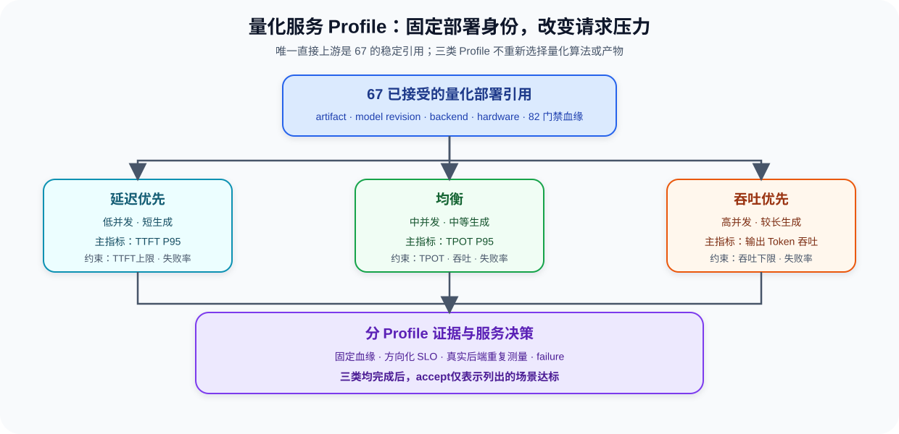
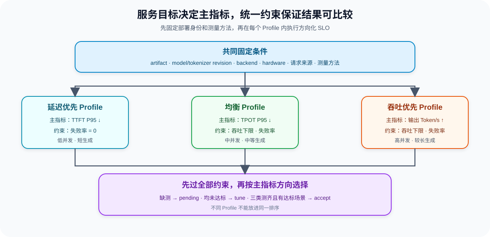

# 83. Quantized Serving Profile Benchmark | 量化服务 Profile 基准

**难度：** Hard | **环境：** [CPU 主线，GPU 可选](#runtime-environment) | **标签：** `量化压缩`、`部署` | **目标人群：** 掌握推理指标与量化基础的读者

> 🚀 **云端运行环境**
>
> 本章节的实战代码可以点击以下链接在免费 GPU 算力平台上直接运行：
>
> [](https://colab.research.google.com/github/datawhalechina/llm-algo-leetcode/blob/main/02_PyTorch_Algorithms/83_Quantized_Serving_Profile_Benchmark.ipynb)
> [](https://modelscope.cn/my/mynotebook) *(国内推荐：魔搭社区免费实例)*


---

## 本节导读

一个量化候选通过固定工作负载的部署验证后，还需要面对不同请求压力。交互式请求更关心首 Token 延迟，混合流量需要兼顾生成延迟与吞吐，离线任务则允许更高并发来换取总吞吐。

本节固定 67 已接受的量化部署资产，在同一后端上分别运行延迟优先、均衡和吞吐优先三类 Profile（请求压力与服务目标的组合）。SLO 是可接受的指标上限或下限；TTFT 是提交至首 Token 的时间，TPOT 是生成阶段平均每个后续 Token 的耗时。通过的场景生成稳定引用，供 72 结合其他候选复测。

**关键词：** `服务 Profile`, `SLO`, `TTFT`, `TPOT`, `吞吐`, `尾延迟`

## 运行环境

- **CPU 练习：** [BASE-CPU](../topic_discussion/inference_optimization/quickstart.md)，验证血缘、服务目标与候选选择。
- **真实实验：** [INF-VLLM-011-CU128](../topic_discussion/inference_optimization/quickstart.md)，需要 NVIDIA GPU 和已准备好的量化产物；创建与检查命令见 Quickstart。
- **结果入口：** Step 5 按 `prepare → measure → close` 运行；prepare／close只检查磁盘证据，不启动后端。

## 前置阅读

- [67. 量化推理与部署](./67_Quantized_Inference_and_Deployment.md)：提供本节唯一必需的量化部署稳定引用。
- [36. 请求选择、准入与公平性](./36_Decode_Scheduling.md)：需要解释排队、并发和尾延迟时选读。

## Step 1：沿用已接受的部署血缘

服务压力比较从已经通过配对部署验证的量化候选开始。上游记录需同时证明产物来源、低精度执行路径和当前环境，才能把后续差异归因于请求压力与服务配置。

| 固定对象 | 上游证据 | 作用 |
|:---|:---|:---|
| 产物血缘 | 产物身份、模型版本、准入引用与哈希 | 保证三类服务配置使用同一候选 |
| 执行路径 | 量化格式、执行后端、回退状态和日志证据 | 防止不同加载路径混入比较 |
| 环境身份 | GPU、CUDA、PyTorch 与执行后端版本 | 解释性能变化是否来自环境 |
| 基准入口 | 请求集版本、模型与分词器 | 生成三类服务压力配置 |



## Step 2：用三类 Profile 表达不同服务目标

三类 Profile 改变的是请求数量、并发和生成长度，不改变模型能力与量化产物。每类 Profile 都声明主指标及其方向，避免把低延迟和高吞吐配置放进同一个排序。

| Profile | 请求压力 | 主指标 | 约束指标 |
|:---|:---|:---|:---|
| 延迟优先 | 低并发、短生成 | TTFT P95，越低越好 | TTFT上限、失败率 |
| 均衡 | 中等并发和生成长度 | TPOT P95，越低越好 | TPOT上限、吞吐下限、失败率 |
| 吞吐优先 | 较高并发和较长生成 | 输出 Token 吞吐，越高越好 | 吞吐下限、失败率 |



## Step 3：在 Profile 内检查 SLO 并选择配置

每个服务配置内部保持请求集、并发、生成上限和重复次数一致。候选先通过失败状态、产物血缘和请求负载可比性检查，再按各项服务目标的上限或下限过滤，最后依据主指标选择结果。

| 判断顺序 | 必须满足的条件 | 不满足时的状态 |
|:---|:---|:---|
| 可比性 | 同一 artifact、Profile 和 workload | 排除该记录并保留原因 |
| 完整性 | 三类压力均完成，主指标和全部 SLO 指标有限且有效 | `pending`：补齐证据后再判断 |
| SLO | `max` 指标不超上限，`min` 指标不低于下限 | 当前 Profile 不可接受 |
| 证据等级 | 来自真实后端重复测量 | CPU 或配置记录不能 `accept` |

## Step 4：实现部署血缘、Profile 契约与 SLO 选择

题目区将服务决策拆成三个动作：确认 67 交接资产完整，检查 Profile 是否明确指标方向，再从同一 Profile 的真实记录中筛选满足 SLO 的候选。

| 任务与目的 | 已知条件 | 完成标准 | 测试验证 |
|:---|:---|:---|:---|
| TODO 1：组合部署血缘门禁 | 已提取的接受状态、产物身份和 82 血缘 | 三项条件使用合取关系形成总状态 | 合格记录与缺血缘反例 |
| TODO 2：检查 Profile 契约 | workload、主指标和方向化 SLO | 三类 Profile 均能独立解释 | 非法方向与缺字段反例 |
| TODO 3：在合格候选中排序 | 已完成可比性和 SLO 过滤的记录 | 先按主指标方向选择，持平时优先余量更大的候选 | 延迟、吞吐与主指标持平反例 |


```python
from typing import Any, Dict, List

from tools.quantization_project_runtime import _finite_number, _positive_int, _text

```


```python
SUPPORTED_PROFILES = {"latency", "balanced", "throughput"}
SUPPORTED_DIRECTIONS = {"max", "min"}


def validate_deployment_lineage(deployment: Dict[str, Any]) -> Dict[str, Any]:
    """检查 67 部署记录是否可以作为服务 Profile 的唯一上游资产。"""
    artifact = deployment.get("artifact", {})
    lineage = deployment.get("lineage", {})
    # 给定实现：提取 67 接受状态、产物身份和 82 血缘事实。
    accepted = (
        deployment.get("stage") == "quantized_deployment"
        and deployment.get("decision", {}).get("decision") == "accept"
    )
    artifact_ready = bool(artifact.get("artifact_id") and artifact.get("path"))
    gate_lineage_ready = bool(
        lineage.get("artifact_gate_reference") and lineage.get("artifact_gate_sha256")
    )
    # TODO 1（部署血缘）：组合三个不可互相替代的准入条件。
    # lineage_ready = ???  # 接受状态、产物身份和 82 血缘必须同时成立。
    if "lineage_ready" not in locals():
        raise NotImplementedError("TODO 1：请完成部署血缘合取规则")
    issues = []
    if not accepted:
        issues.append("deployment_not_accepted")
    if not artifact_ready:
        issues.append("artifact_identity_or_path_missing")
    if not gate_lineage_ready:
        issues.append("artifact_gate_lineage_missing")
    return {"ready": lineage_ready, "issues": issues}


def _positive_workload(workload: Dict[str, Any]) -> bool:
    """给定实现：检查请求数、并发、生成上限和重复次数是否为正。"""
    return all(
        _positive_int(workload.get(key))
        for key in ("num_prompts", "concurrency", "max_tokens", "repeats")
    )


def _valid_slo_rules(slo: Dict[str, Any]) -> bool:
    """给定实现：检查每项 SLO 是否声明合法方向和数值阈值。"""
    return all(
        isinstance(rule, dict) and rule.get("direction") in SUPPORTED_DIRECTIONS
        and _finite_number(rule.get("limit")) and rule["limit"] >= 0
        for rule in slo.values()
    )


def validate_serving_profile(profile: Dict[str, Any]) -> Dict[str, Any]:
    """检查 workload、主指标和带方向 SLO 是否构成完整 Profile。"""
    workload = profile.get("workload", {})
    slo = profile.get("slo", {})
    # TODO 2（Profile 契约）：组合 workload、SLO 和主指标约束。
    # workload_ready = ???  # workload ID 存在，且四项规模参数均为正。
    # slo_ready = ???  # SLO 非空，且每项规则都通过方向与阈值检查。
    # primary_ready = ???  # 主指标必须出现在当前 Profile 的 SLO 中。
    if not all(name in locals() for name in ("workload_ready", "slo_ready", "primary_ready")):
        raise NotImplementedError("TODO 2：请完成三个 Profile 契约判断")
    issues = []
    if profile.get("name") not in SUPPORTED_PROFILES:
        issues.append("unsupported_profile")
    if not workload_ready:
        issues.append("invalid_workload")
    if not slo_ready:
        issues.append("invalid_slo")
    if not primary_ready:
        issues.append("primary_metric_missing_from_slo")
    return {"ready": not issues, "issues": issues}


def _meets_slo(metrics: Dict[str, Any], slo: Dict[str, Any]) -> bool:
    """按每项指标声明的 max/min 方向检查 SLO。"""
    for metric, rule in slo.items():
        value = metrics.get(metric)
        if not _finite_number(value) or value < 0:
            return False
        if rule["direction"] == "max" and value > rule["limit"]:
            return False
        if rule["direction"] == "min" and value < rule["limit"]:
            return False
    return True


def _slo_headroom(metrics: Dict[str, Any], slo: Dict[str, Any]) -> float:
    """给定实现：计算已合格记录相对各项 SLO 的归一化余量之和。"""
    headroom = 0.0
    for metric, rule in slo.items():
        value, limit = metrics[metric], rule["limit"]
        scale = max(abs(float(limit)), 1.0)
        headroom += ((limit - value) if rule["direction"] == "max" else (value - limit)) / scale
    return headroom


def choose_primary_record(
    records: List[Dict[str, Any]], primary_metric: str, direction: str, slo: Dict[str, Any]
) -> Dict[str, Any] | None:
    """按主指标方向选择候选；过滤和 SLO 检查已由调用方完成。"""
    if not records:
        return None
    best = records[0]
    for candidate in records[1:]:
        candidate_value = candidate["metrics"][primary_metric]
        best_value = best["metrics"][primary_metric]
        # TODO 3（候选排序）：先比主指标；主指标持平时比较整体 SLO 余量。
        # candidate_is_better = ???
        if "candidate_is_better" not in locals():
            raise NotImplementedError("TODO 3：请完成方向化比较规则")
        if candidate_is_better:
            best = candidate
    return best


def select_serving_candidate(
    records: List[Dict[str, Any]], profile: Dict[str, Any], *, expected_artifact_id: str | None = None
) -> Dict[str, Any]:
    """在同一 Profile 内过滤不可比记录、检查 SLO 并选择主指标最优候选。"""
    if not validate_serving_profile(profile)["ready"]:
        raise ValueError("Profile 契约不完整")
    expected_artifact = expected_artifact_id or next((record.get("artifact_id") for record in records if record.get("artifact_id")), None)
    comparable = [
        record for record in records
        if record.get("status") == "ok"
        and record.get("artifact_id") == expected_artifact
        and record.get("profile_name") == profile["name"]
        and record.get("workload_id") == profile["workload"]["id"]
        and record.get("evidence_level") == "real_project_benchmark"
    ]
    feasible = [
        record for record in comparable
        if _meets_slo(record.get("metrics", {}), profile["slo"])
    ]
    primary_metric = profile["primary_metric"]
    direction = profile["slo"][primary_metric]["direction"]
    selected = choose_primary_record(feasible, primary_metric, direction, profile["slo"])
    excluded = [record.get("name", "unnamed") for record in records if record not in feasible]
    return {
        "decision": "accept" if selected else "tune",
        "selected": selected,
        "comparable_count": len(comparable),
        "feasible_count": len(feasible),
        "excluded": excluded,
    }

```


```python
def _deployment_record():
    """构造已通过 67、且携带 82 血缘的部署记录。"""
    return {
        "stage": "quantized_deployment",
        "artifact": {"artifact_id": "qwen-awq-r1", "path": "/tmp/qwen-awq-r1"},
        "lineage": {"artifact_gate_reference": "82_ref.json", "artifact_gate_sha256": "abc123"},
        "decision": {"decision": "accept"},
    }


def _latency_profile():
    """构造使用上限型延迟 SLO 的交互式 Profile。"""
    return {
        "name": "latency",
        "workload": {"id": "fixed-chat", "num_prompts": 8, "concurrency": 1, "max_tokens": 64, "repeats": 3},
        "primary_metric": "ttft_p95_ms",
        "slo": {
            "ttft_p95_ms": {"direction": "max", "limit": 500.0},
            "failure_rate": {"direction": "max", "limit": 0.0},
        },
    }


def test_deployment_lineage():
    """验证 67 接受状态和 82 血缘缺一不可。"""
    deployment = _deployment_record()
    assert validate_deployment_lineage(deployment)["ready"]
    assert not validate_deployment_lineage({**deployment, "lineage": {}})["ready"]


def test_serving_profile_contract():
    """验证 workload、主指标和 SLO 方向组成完整契约。"""
    profile = _latency_profile()
    assert validate_serving_profile(profile)["ready"]
    bad = {**profile, "slo": {"ttft_p95_ms": {"direction": "smaller", "limit": 500.0}}}
    assert not validate_serving_profile(bad)["ready"]
    for value in (True, 0, -1, 1.5):
        invalid = {**profile, 'workload': {**profile['workload'], 'repeats': value}}
        assert not validate_serving_profile(invalid)['ready']


def test_profile_candidate_selection():
    """验证上限型延迟和下限型吞吐使用相反选择方向。"""
    latency = _latency_profile()
    records = [
        {"name": "c1", "status": "ok", "artifact_id": "qwen-awq-r1", "profile_name": "latency", "workload_id": "fixed-chat", "evidence_level": "real_project_benchmark", "metrics": {"ttft_p95_ms": 420.0, "failure_rate": 0.0}},
        {"name": "c2", "status": "ok", "artifact_id": "qwen-awq-r1", "profile_name": "latency", "workload_id": "fixed-chat", "evidence_level": "real_project_benchmark", "metrics": {"ttft_p95_ms": 360.0, "failure_rate": 0.0}},
        {"name": "failed", "status": "failed", "artifact_id": "qwen-awq-r1", "profile_name": "latency", "workload_id": "fixed-chat", "evidence_level": "real_project_benchmark", "metrics": {}},
    ]
    contaminated = [{**records[0], "name": "wrong-artifact", "artifact_id": "other"}, *records]
    selected = select_serving_candidate(contaminated, latency, expected_artifact_id="qwen-awq-r1")
    assert selected["decision"] == "accept" and selected["selected"]["name"] == "c2"
    for value in (float('nan'), float('inf'), True, -1.0):
        invalid = {**records[0], 'metrics': {'ttft_p95_ms': value, 'failure_rate': 0.0}}
        assert select_serving_candidate([invalid], latency)['decision'] != 'accept'

    throughput = {
        **latency, "name": "throughput", "primary_metric": "throughput_tps",
        "slo": {"throughput_tps": {"direction": "min", "limit": 70.0}},
    }
    throughput_records = [
        {**record, "profile_name": "throughput", "metrics": {"throughput_tps": value}}
        for record, value in zip(records[:2], (80.0, 95.0))
    ]
    assert select_serving_candidate(
        throughput_records, throughput, expected_artifact_id="qwen-awq-r1"
    )["selected"]["name"] == "c2"

    tie_slo = {
        "tpot_p95_ms": {"direction": "max", "limit": 80.0},
        "throughput_tps": {"direction": "min", "limit": 20.0},
    }
    tied = [
        {"name": "narrow", "metrics": {"tpot_p95_ms": 60.0, "throughput_tps": 22.0}},
        {"name": "roomy", "metrics": {"tpot_p95_ms": 60.0, "throughput_tps": 30.0}},
    ]
    assert choose_primary_record(tied, "tpot_p95_ms", "max", tie_slo)["name"] == "roomy"


def run_serving_profile_tests():
    """按项目顺序运行血缘、Profile 契约与候选选择测试。"""
    test_deployment_lineage()
    test_serving_profile_contract()
    test_profile_candidate_selection()
    print("✅ 部署血缘、Profile 契约和方向化 SLO 选择均已验证。")


run_serving_profile_tests()

```

---

## 参考代码与解析


```python
SUPPORTED_PROFILES = {"latency", "balanced", "throughput"}
SUPPORTED_DIRECTIONS = {"max", "min"}


def validate_deployment_lineage(deployment: Dict[str, Any]) -> Dict[str, Any]:
    """检查 67 部署记录是否可以作为服务 Profile 的唯一上游资产。"""
    artifact = deployment.get("artifact", {})
    lineage = deployment.get("lineage", {})
    # 给定实现：提取 67 接受状态、产物身份和 82 血缘事实。
    accepted = (
        deployment.get("stage") == "quantized_deployment"
        and deployment.get("decision", {}).get("decision") == "accept"
    )
    artifact_ready = bool(artifact.get("artifact_id") and artifact.get("path"))
    gate_lineage_ready = bool(
        lineage.get("artifact_gate_reference") and lineage.get("artifact_gate_sha256")
    )
    # TODO 1（部署血缘）：组合三个不可互相替代的准入条件。
    lineage_ready = accepted and artifact_ready and gate_lineage_ready
    issues = []
    if not accepted:
        issues.append("deployment_not_accepted")
    if not artifact_ready:
        issues.append("artifact_identity_or_path_missing")
    if not gate_lineage_ready:
        issues.append("artifact_gate_lineage_missing")
    return {"ready": lineage_ready, "issues": issues}


def _positive_workload(workload: Dict[str, Any]) -> bool:
    """给定实现：检查请求数、并发、生成上限和重复次数是否为正。"""
    return all(
        _positive_int(workload.get(key))
        for key in ("num_prompts", "concurrency", "max_tokens", "repeats")
    )


def _valid_slo_rules(slo: Dict[str, Any]) -> bool:
    """给定实现：检查每项 SLO 是否声明合法方向和数值阈值。"""
    return all(
        isinstance(rule, dict) and rule.get("direction") in SUPPORTED_DIRECTIONS
        and _finite_number(rule.get("limit")) and rule["limit"] >= 0
        for rule in slo.values()
    )


def validate_serving_profile(profile: Dict[str, Any]) -> Dict[str, Any]:
    """检查 workload、主指标和带方向 SLO 是否构成完整 Profile。"""
    workload = profile.get("workload", {})
    slo = profile.get("slo", {})
    # TODO 2（Profile 契约）：组合 workload、SLO 和主指标约束。
    workload_ready = bool(workload.get("id")) and _positive_workload(workload)
    slo_ready = bool(slo) and _valid_slo_rules(slo)
    primary_ready = profile.get("primary_metric") in slo
    issues = []
    if profile.get("name") not in SUPPORTED_PROFILES:
        issues.append("unsupported_profile")
    if not workload_ready:
        issues.append("invalid_workload")
    if not slo_ready:
        issues.append("invalid_slo")
    if not primary_ready:
        issues.append("primary_metric_missing_from_slo")
    return {"ready": not issues, "issues": issues}


def _meets_slo(metrics: Dict[str, Any], slo: Dict[str, Any]) -> bool:
    """按每项指标声明的 max/min 方向检查 SLO。"""
    for metric, rule in slo.items():
        value = metrics.get(metric)
        if not _finite_number(value) or value < 0:
            return False
        if rule["direction"] == "max" and value > rule["limit"]:
            return False
        if rule["direction"] == "min" and value < rule["limit"]:
            return False
    return True


def _slo_headroom(metrics: Dict[str, Any], slo: Dict[str, Any]) -> float:
    """给定实现：计算已合格记录相对各项 SLO 的归一化余量之和。"""
    headroom = 0.0
    for metric, rule in slo.items():
        value, limit = metrics[metric], rule["limit"]
        scale = max(abs(float(limit)), 1.0)
        headroom += ((limit - value) if rule["direction"] == "max" else (value - limit)) / scale
    return headroom


def choose_primary_record(
    records: List[Dict[str, Any]], primary_metric: str, direction: str, slo: Dict[str, Any]
) -> Dict[str, Any] | None:
    """TODO 3：按主指标方向选择已经满足 SLO 的候选。"""
    if not records:
        return None
    best = records[0]
    for candidate in records[1:]:
        candidate_value = candidate["metrics"][primary_metric]
        best_value = best["metrics"][primary_metric]
        primary_is_better = candidate_value < best_value if direction == "max" else candidate_value > best_value
        primary_is_tied = candidate_value == best_value
        candidate_is_better = primary_is_better or (
            primary_is_tied
            and _slo_headroom(candidate["metrics"], slo) > _slo_headroom(best["metrics"], slo)
        )
        if candidate_is_better:
            best = candidate
    return best


def select_serving_candidate(
    records: List[Dict[str, Any]], profile: Dict[str, Any], *, expected_artifact_id: str | None = None
) -> Dict[str, Any]:
    """在同一 Profile 内过滤不可比记录、检查 SLO 并选择主指标最优候选。"""
    if not validate_serving_profile(profile)["ready"]:
        raise ValueError("Profile 契约不完整")
    expected_artifact = expected_artifact_id or next((record.get("artifact_id") for record in records if record.get("artifact_id")), None)
    comparable = [
        record for record in records
        if record.get("status") == "ok"
        and record.get("artifact_id") == expected_artifact
        and record.get("profile_name") == profile["name"]
        and record.get("workload_id") == profile["workload"]["id"]
        and record.get("evidence_level") == "real_project_benchmark"
    ]
    feasible = [
        record for record in comparable
        if _meets_slo(record.get("metrics", {}), profile["slo"])
    ]
    primary_metric = profile["primary_metric"]
    direction = profile["slo"][primary_metric]["direction"]
    selected = choose_primary_record(feasible, primary_metric, direction, profile["slo"])
    excluded = [record.get("name", "unnamed") for record in records if record not in feasible]
    return {
        "decision": "accept" if selected else "tune",
        "selected": selected,
        "comparable_count": len(comparable),
        "feasible_count": len(feasible),
        "excluded": excluded,
    }

```

### 解析

先确认输入部署可以追溯，再检查服务目标，最后在相同压力内选择合格配置。

#### TODO 1：检查 67 部署血缘

- 骨架已分别检查 67 接受状态、产物身份和 82 引用；TODO 使用合取关系形成部署血缘门禁。
- `test_deployment_lineage` 验证删除嵌入血缘后不能开始 Profile 比较。

#### TODO 2：检查 Profile 契约

- workload 数量必须为正；每项 SLO 都显式声明 `max` 或 `min`，主指标也必须出现在 SLO 中。
- `test_serving_profile_contract` 使用非标准方向名称验证契约不会静默通过。

#### TODO 3：在合格候选中排序

- 骨架负责排除失败、产物不一致或非真实后端记录，并完成 SLO 过滤；TODO 先按主指标方向比较，持平时再比较整体 SLO 余量。
- `test_profile_candidate_selection` 分别验证延迟取更小值、吞吐取更大值，以及主指标持平时优先约束余量更大的候选。

## Step 5：测量量化服务压力

| 路径 | 验证对象 | 输出 |
|---|---|---|
| CPU | 部署血缘、带方向的SLO和配置选择 | 决策规则与边界测试 |
| GPU／真实后端 | 同一量化产物下延迟、均衡和吞吐三类请求压力 | 原始请求结果、后端日志及运行身份 |
| 登记与交接 | 重读来源、哈希、固定调用与完整性 | 逐场景达标范围、汇总报告与回执 |

三类场景都需完成；每类在自身负载和SLO内判断。至少一类达标时accept只适用于达标场景，不表示三类均达标，也不比较不同场景的指标排名。

### 5.1 本次运行配置

使用 **INF-VLLM-011-CU128**，环境创建与检查见[推理优化Quickstart](../topic_discussion/inference_optimization/quickstart.md)。默认prepare，模型、请求和门槛由5.2加载固定合同。


```python
RUN_LABEL = 'replace_with_unique_label'  # 本次唯一标签；不覆盖既有结果。
RUN_STAGE = 'prepare'  # prepare / measure / close；默认只读预检。
UPSTREAM_RUN_LABEL = 'replace_with_upstream_label'  # 67部署已接受结果的唯一标签。

```

### 5.2 环境与唯一上游预检

从67部署引用读取来源，核对SHA256、接受状态、嵌入的候选清单、实际产物文件与固定请求集。只有首次measure会检查GPU环境；prepare、close和已有测量的读取不初始化GPU。


```python
import importlib
import json

from tools.project_runtime import resolve_project_root
import tools.quantized_deployment_runtime as deployment_runtime

deployment_runtime = importlib.reload(deployment_runtime)
plan = deployment_runtime.project_plan(resolve_project_root(), '83', RUN_LABEL, UPSTREAM_RUN_LABEL, RUN_STAGE)
prepared = deployment_runtime.preflight_project(plan)
print({'ready': prepared['ready'], 'issues': prepared['issues'],
       'profile': plan['contract']['environment_profile'], 'inputs': prepared.get('snapshot')})

```

### 5.3 核对压力矩阵与固定条件

三类场景共用产物、后端、硬件和请求来源；每类明确请求数、并发、输出上限、重复次数、主指标和SLO。重复实验的p95采用各轮p95均值，不能解释为合并所有请求后的p95。


```python
print({'fixed_contract': plan['contract'],
       'artifact': prepared.get('artifact'),
       'quality_source': '67_deployment_evidence'})

```

### 5.4 真实执行并保存原始证据

measure按固定矩阵执行，逐项保存来源身份、原始请求结果、完整日志和失败。完整成员可在中断后复用；后端输出已存在但成员记录未完成时保留现场并使用新标签，避免覆盖。此处不生成稳定引用。


```python
if RUN_STAGE == 'measure':
    if not prepared['ready']:
        raise RuntimeError('预检未通过：' + '; '.join(prepared['issues']))
    measured = deployment_runtime.measure_project(plan)
    print({'status': measured['status'], 'decision': measured['decision']})
else:
    print({'status': 'skipped', 'stage': RUN_STAGE})

```

### 5.5 只读核对已保存证据

重新定位本标签的记录，逐项检查来源、固定合同、成员数量、身份、实际请求数及文件哈希，再重算决策。已有报告、交接和回执必须与原始证据一致；读取不会启动后端或补写结果。


```python
if prepared['ready']:
    checked = deployment_runtime.read_project(plan)
else:
    checked = {'status': 'blocked', 'decision': {'decision': 'pending'}, 'issues': prepared['issues']}
print({'status': checked['status'], 'decision': checked['decision'],
       'profiles': checked.get('report', {}).get('profile_decisions'),
       'issues': checked.get('issues', [])})

```

### 5.6 形成决策、登记与交接

close只消费已保存证据，生成报告和SHA256回执；内容一致时复用，中断时补齐缺失资产，冲突时停止。三类压力完整后再判断各场景是否达标，不以单类成功掩盖缺测。

| 已核对证据 | 决策 | 下一动作 |
|---|---|---|
| 测量不完整、失败或关键指标缺失 | pending | 补齐证据；失败复测使用新标签 |
| 场景间的后端、硬件或精度身份发生变化 | reject | 保留报告，修复比较条件 |
| 三类均完成，但没有一类达到自身SLO | tune | 调整后用新标签复测 |
| 三类均完成，至少一类达到自身SLO | accept | 仅登记实际达标的服务场景 |

**当前登记结果**：尚无本页新协议的真实GPU结果；临时目录CPU测试不作为实测登记。进度见[实验资产表](../topic_discussion/quantization_compression/experiment_assets.md)。


```python
if RUN_STAGE == 'close':
    closed = deployment_runtime.close_project(plan) if prepared['ready'] else checked
    print(closed)
else:
    print({'status': 'skipped', 'stage': RUN_STAGE})

```

## 相关阅读

- [vLLM Benchmarking](https://docs.vllm.ai/en/latest/contributing/benchmarks.html)：核对请求并发、重复测量和服务指标。
- [SGLang Benchmark](https://docs.sglang.ai/developer_guide/bench_serving.html)：需要增加同口径后端对照时使用。
