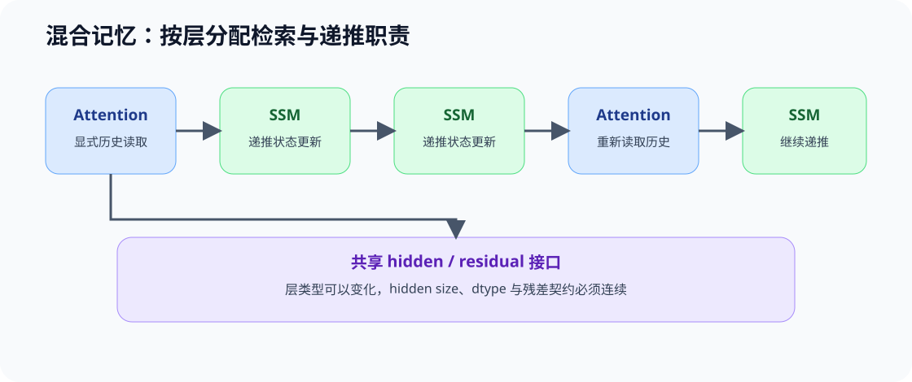

# ARCH-HYBRID-MEMORY. Attention SSM Hybrid | Attention、SSM 与混合记忆架构

**难度：** Hard | **环境：** CPU-first | **标签：** `模型架构`, `SSM`, `混合记忆`

> 🚀 **云端运行环境**
>
> 本章节的实战代码可以点击以下链接在免费 GPU 算力平台上直接运行：
>
> [](https://colab.research.google.com/github/datawhalechina/llm-algo-leetcode/blob/main/02_PyTorch_Algorithms/ARCH-HYBRID-MEMORY_Attention_SSM_Hybrid.ipynb)
> [](https://modelscope.cn/my/mynotebook) *(国内推荐：魔搭社区免费实例)*


## 本节导读

Attention 可以按 Query 重新访问 token 级历史，递推模型则把过去压缩进固定形状状态。两者分别擅长灵活检索与低成本顺序更新，也分别承担状态增长和信息压缩的代价。混合架构不是简单地把两种层交替摆放，而是明确哪些层保留显式历史访问，哪些层负责递推更新。

本节在 45 的线性 Attention 基础上，进一步区分 SSM/Mamba 的选择性状态更新，并用层级计划与状态账本检查混合架构的记忆职责。

## 前置阅读

- [45 线性 Attention 与递推状态](./45_Linear_Attention_and_Recurrent_State.md)
- [05 Decoder Block](./05_LLaMA3_Block_Tutorial.md)

### Step 1：三类记忆接口

Attention 保留可按 token 访问的历史 K/V；线性 Attention 把历史汇总为特征统计；SSM/Mamba 使用状态转移和输入相关控制更新内部状态。它们的共同目标是处理序列，但可恢复的信息与状态增长规律不同。

| 记忆接口 | 保存什么 | 状态随长度变化 | 主要能力与代价 |
|---|---|---|---|
| Full Attention | token 级 K/V | 线性增长 | 可重新访问具体历史，缓存和带宽持续增长 |
| Linear Attention | 特征映射后的累计统计 | 固定形状 | 更新便宜，但相似度形式和可恢复信息受限 |
| SSM / Mamba | 递推状态与选择性控制 | 固定形状 | 适合扫描与流式更新，不等同于 Q/K 检索 |


### Step 2：混合架构中的层级分工

混合模型通常让部分层保留 Attention，以恢复全局或精确历史访问；其余层使用递推状态降低长序列成本。层比例只是配置结果，真正需要审计的是每类层位于哪里、状态怎样在层之间传递，以及任务需要的历史是否仍可被访问。

| 层角色 | 主要职责 | 需要检查 |
|---|---|---|
| Attention layer | 内容寻址、远程检索、token 级重读 | KV 表示、访问范围与缓存成本 |
| Recurrent / SSM layer | 低成本状态更新与局部序列建模 | 状态维度、选择性更新和信息遗忘 |
| Interface / residual | 在不同层类型之间传递 hidden state | hidden size、dtype、残差尺度 |



### Step 3：状态成本、检索要求与证据

固定大小状态不等于固定质量，全 Attention 也不等于所有任务都需要。架构判断应同时记录序列长度、显式 Attention 层数、递推状态维度和任务是否要求精确历史检索。

| 问题 | CPU 机制账本 | 后续真实证据 |
|---|---|---|
| 状态怎样增长 | KV bytes 与 recurrent-state bytes | 实际常驻显存和带宽 |
| 哪些层保留显式访问 | layer schedule | 模型配置与源码 |
| 精确历史能否被重新访问 | 是否存在 Attention 路径 | 长距离检索与目标任务质量 |
| 混合是否更高效 | 理论状态和层比例 | 固定模型族/训练条件下的延迟与质量 |

不同 checkpoint 之间通常还存在数据、规模和训练预算差异，因此不能把跨模型数字全部归因于 Attention/SSM 比例。

### Step 4：代码设计与混合记忆账本

本题用层级 schedule 表达 Attention 与 SSM 的分工，再计算显式 KV 和递推状态的理论账本。学习者需要补全层计划、状态成本和精确历史访问 gate。

| 任务与目的 | 已知条件 | 完成标准 | 测试验证 |
|---|---|---|---|
| TODO 1：生成混合层计划 | 总层数与 Attention 间隔；`None` 表示纯 SSM | 保留周期性 Attention，其余为 SSM | 纯 Attention、纯 SSM、混合与非法参数 |
| TODO 2：计算状态账本 | 序列、KV 维度、递推状态维度和 schedule | 分开返回 KV、SSM 与总字节数 | 长度增长与层类型数量 |
| TODO 3：判断精确历史 gate | schedule 与任务需求 | 无 Attention 时不得声称支持显式历史重读 | 检索要求与流式任务对照 |


```python
from typing import Dict, List, Optional

```


```python
def build_hybrid_schedule(num_layers: int, attention_every: Optional[int]) -> List[str]:
    """生成 Attention / SSM 层级计划。"""
    # TODO 1（层级分工）：校验层数；None 表示纯 SSM，否则第 0 层及周期位置使用 Attention。
    raise NotImplementedError("TODO 1：请生成混合层计划")


def memory_state_ledger(
    schedule: List[str],
    seq_len: int,
    num_kv_heads: int,
    head_dim: int,
    recurrent_state_dim: int,
    dtype_bytes: int = 2,
) -> Dict[str, int]:
    """计算单样本的显式 KV 与递推状态理论字节数。"""
    # TODO 2（状态增长）：Attention 层保存 K+V；SSM 层保存固定维度状态。
    raise NotImplementedError("TODO 2：请计算混合记忆状态账本")


def exact_history_gate(schedule: List[str], requires_exact_history: bool) -> Dict[str, object]:
    """根据任务要求判断当前计划是否保留显式历史读取路径。"""
    # TODO 3（能力 gate）：精确历史任务至少需要一层 attention；流式任务不强制。
    raise NotImplementedError("TODO 3：请判断精确历史访问条件")

```


```python
# 测试设计：分别验证层级计划、状态增长规律和精确历史访问 gate。
def test_hybrid_schedule_contract():
    assert build_hybrid_schedule(6, 2) == ["attention", "ssm", "attention", "ssm", "attention", "ssm"]
    assert build_hybrid_schedule(3, 1) == ["attention", "attention", "attention"]
    assert build_hybrid_schedule(3, None) == ["ssm", "ssm", "ssm"]
    try:
        build_hybrid_schedule(0, 2)
    except ValueError:
        pass
    else:
        raise AssertionError("num_layers=0 必须拒绝")


def test_memory_state_ledger():
    schedule = build_hybrid_schedule(4, 2)
    report = memory_state_ledger(schedule, seq_len=8, num_kv_heads=2, head_dim=4, recurrent_state_dim=16)
    assert report["attention_layers"] == 2
    assert report["ssm_layers"] == 2
    assert report["kv_bytes"] == 512
    assert report["recurrent_bytes"] == 64
    assert report["total_bytes"] == 576


def test_exact_history_gate():
    mixed = ["attention", "ssm"]
    recurrent_only = ["ssm", "ssm"]
    assert exact_history_gate(mixed, True)["eligible"] is True
    assert exact_history_gate(recurrent_only, True)["eligible"] is False
    assert exact_history_gate(recurrent_only, False)["eligible"] is True


def run_arch_hybrid_tests():
    test_hybrid_schedule_contract()
    test_memory_state_ledger()
    test_exact_history_gate()
    print("✅ 混合记忆：层级计划、状态账本与历史访问 gate 测试通过")


run_arch_hybrid_tests()

```

---

🛑 **STOP HERE**：先完成三处机制 TODO 并运行测试，再查看参考代码与解析。

---

## 参考代码与解析


```python
from typing import Dict, List, Optional


def build_hybrid_schedule(num_layers: int, attention_every: Optional[int]) -> List[str]:
    """生成 Attention / SSM 层级计划。"""
    if not isinstance(num_layers, int):
        raise TypeError("num_layers must be an integer")
    if num_layers <= 0:
        raise ValueError("num_layers must be positive")
    if attention_every is None:
        return ["ssm"] * num_layers
    if not isinstance(attention_every, int):
        raise TypeError("attention_every must be an integer or None")
    if attention_every <= 0:
        raise ValueError("attention_every must be positive")
    return ["attention" if index % attention_every == 0 else "ssm" for index in range(num_layers)]


def memory_state_ledger(
    schedule: List[str],
    seq_len: int,
    num_kv_heads: int,
    head_dim: int,
    recurrent_state_dim: int,
    dtype_bytes: int = 2,
) -> Dict[str, int]:
    """计算单样本的显式 KV 与递推状态理论字节数。"""
    if not schedule or any(layer not in {"attention", "ssm"} for layer in schedule):
        raise ValueError("schedule must contain attention or ssm")
    values = (seq_len, num_kv_heads, head_dim, recurrent_state_dim, dtype_bytes)
    if any(not isinstance(value, int) or value <= 0 for value in values):
        raise ValueError("all dimensions must be positive integers")
    attention_layers = schedule.count("attention")
    ssm_layers = schedule.count("ssm")
    kv_bytes = attention_layers * seq_len * num_kv_heads * head_dim * 2 * dtype_bytes
    recurrent_bytes = ssm_layers * recurrent_state_dim * dtype_bytes
    return {
        "attention_layers": attention_layers,
        "ssm_layers": ssm_layers,
        "kv_bytes": kv_bytes,
        "recurrent_bytes": recurrent_bytes,
        "total_bytes": kv_bytes + recurrent_bytes,
    }


def exact_history_gate(schedule: List[str], requires_exact_history: bool) -> Dict[str, object]:
    """根据任务要求判断当前计划是否保留显式历史读取路径。"""
    if not schedule or any(layer not in {"attention", "ssm"} for layer in schedule):
        raise ValueError("schedule must contain attention or ssm")
    has_attention = "attention" in schedule
    eligible = has_attention or not requires_exact_history
    reason = "attention_path_available" if has_attention else (
        "exact_history_requires_attention" if requires_exact_history else "streaming_state_is_sufficient"
    )
    return {"eligible": eligible, "has_attention": has_attention, "reason": reason}

```

### 解析

- **TODO 1：层级分工。** schedule 明确记录每层的记忆接口，避免只用“混合比例”隐藏层位置。
- **TODO 2：状态增长。** Attention 层的 KV 随 `seq_len` 增长；SSM 层使用固定大小状态。二者必须分别计账后再求和。
- **TODO 3：能力 gate。** 没有 Attention 层时，固定状态仍可服务流式任务，但不能仅凭状态存在就声称支持精确 token 级历史重读。

### Step 5：可选 GPU 复测——状态增长与长度阶梯

CPU 账本说明显式 KV 随长度增长、递推状态保持固定；本实验在相同层数、Head 和 dtype 下测量全 Attention、固定递推状态与混合层计划的状态字节和单步开销。递推计算是状态接口代理，不是 Mamba 专用 kernel，也不提供任务质量结论。

| CPU 机制价值 | GPU 实验价值 | 项目页继续验证 |
| --- | --- | --- |
| 验证层计划、状态增长和精确历史 gate | 比较长度阶梯上的状态量、单步时间与峰值显存 | 77 使用真实 checkpoint 检查长序列质量与跨模型成本 |

#### 5.1 固定层计划与长度阶梯


```python
# 默认关闭；受控实验比较状态接口，不下载 Attention 或 SSM checkpoint。
RUN_GPU_EXPERIMENT = False
SEQUENCE_LENGTHS = [512, 2048, 8192]  # 显式历史会随该长度增长。
NUM_LAYERS = 4  # 三种候选保持总层数相同。
ATTENTION_EVERY = 4  # 混合候选每四层保留一层 Attention。
NUM_HEADS = 8
HEAD_DIM = 64
DTYPE = 'bfloat16'
WARMUP = 3
REPEATS = 10
RESULT_PATH = 'benchmarks/results/arch_hybrid_memory_growth.json'
print({'run': RUN_GPU_EXPERIMENT, 'lengths': SEQUENCE_LENGTHS, 'layers': NUM_LAYERS, 'attention_every': ATTENTION_EVERY, 'result': RESULT_PATH})

```

#### 5.2 执行三种记忆接口


```python
if RUN_GPU_EXPERIMENT:
    import subprocess, sys
    command = [
        sys.executable, 'tools/run_architecture_mechanism_benchmark.py',
        '--mode', 'memory_growth', '--output', RESULT_PATH,
        '--sequence-lengths', ','.join(map(str, SEQUENCE_LENGTHS)),
        '--num-layers', str(NUM_LAYERS), '--attention-every', str(ATTENTION_EVERY),
        '--query-heads', str(NUM_HEADS), '--head-dim', str(HEAD_DIM), '--dtype', DTYPE,
        '--warmup', str(WARMUP), '--repeats', str(REPEATS),
    ]
    subprocess.run(command, check=True)
else:
    print('混合记忆 GPU 实验默认关闭。')

```

#### 5.3 读取状态增长与运行代价


```python
import json
from pathlib import Path
result_path = Path(RESULT_PATH)
if result_path.exists():
    result = json.loads(result_path.read_text(encoding='utf-8'))
    required = {'mechanism', 'workload', 'hardware', 'metrics', 'evidence_level', 'failure', 'decision'}
    missing = required - set(result)
    if missing:
        raise ValueError(f'结果 JSON 缺少字段：{sorted(missing)}')
    print(result)
else:
    print(f'尚无混合记忆结果：{RESULT_PATH}')

```

## 相关阅读

- [Mamba](https://arxiv.org/abs/2312.00752)：选择性状态空间模型。
- [Transformers are SSMs](https://arxiv.org/abs/2405.21060)：Attention 与状态空间模型的结构联系。
- [10 线性 Attention、SSM 与混合记忆](../topic_discussion/llm_architecture_evolution/10_linear_attention_ssm_and_hybrid.md)
- [77 长序列记忆架构基准](./77_Long_Sequence_Memory_Architecture_Benchmark.md)
