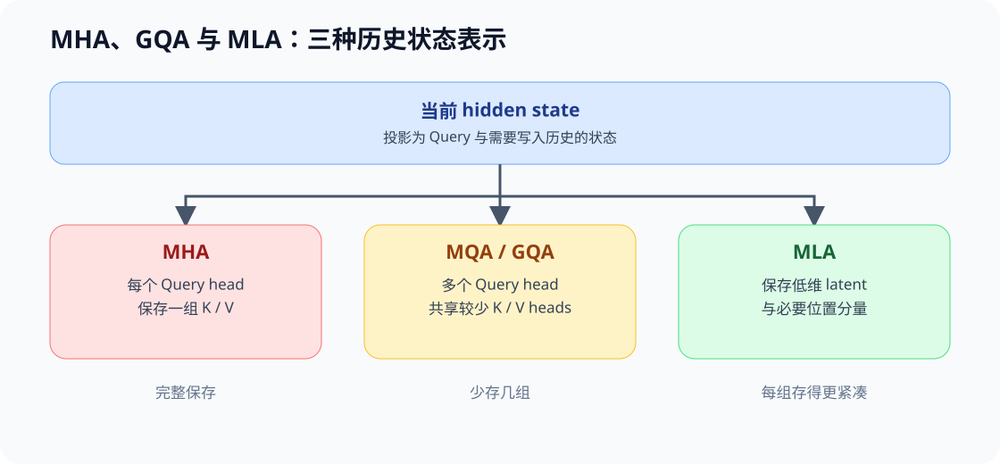
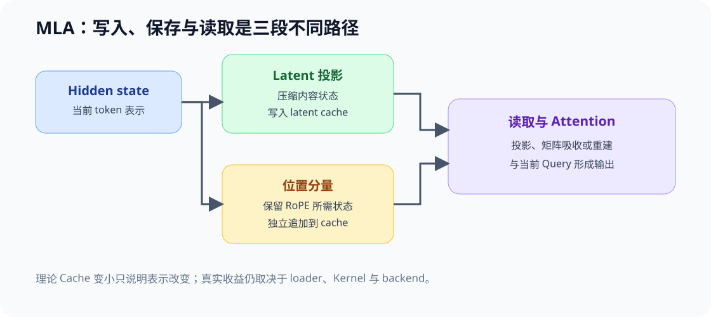

# ARCH-MLA. Multihead Latent Attention | MLA 与紧凑 KV 表示

**难度：** Hard | **环境：** CPU-first | **标签：** `模型架构`, `MLA`, `KV 表示`

> 🚀 **云端运行环境**
>
> 本章节的实战代码可以点击以下链接在免费 GPU 算力平台上直接运行：
>
> [](https://colab.research.google.com/github/datawhalechina/llm-algo-leetcode/blob/main/02_PyTorch_Algorithms/ARCH-MLA_Multihead_Latent_Attention.ipynb)
> [](https://modelscope.cn/my/mynotebook) *(国内推荐：魔搭社区免费实例)*


## 本节导读

MHA 保存每个 KV head 的历史状态，GQA/MQA 通过共享 KV head 减少重复；MLA 进一步改变历史状态的表示，把可压缩部分写入低维 latent，并把位置相关分量单独处理。理解 MLA 的关键不是记住一个压缩比例，而是区分训练中的投影表示、推理时真正保存的状态，以及读取这些状态需要的重建路径。

本节用统一形状和字节账本比较 MHA、GQA 与简化 MLA，建立 latent state、位置分量和解码重建成本的共同口径。真实模型的 layout、吸收矩阵和 Kernel 支持仍需读取模型实现与 backend 证据。

## 前置阅读

先掌握 Q/K/V、MHA/MQA/GQA 和普通 KV Cache 的形状，再进入表示压缩。

- [04 Attention MHA / GQA](./04_Attention_MHA_GQA.md)
- [Part 01 · 11 KV Cache 与显存增长](../01_Hardware_Math_and_Systems/11_KV_Cache_and_Memory_Growth.md)

### Step 1：三条 KV 表示路径

MHA 为每个 Query head 保存对应的 K/V；MQA/GQA 减少 KV head 数；MLA 不再把“head 数”作为唯一压缩轴，而是把历史内容写入较低维 latent，并保留必要的位置相关状态。

| 路径 | 保存的历史状态 | 主要压缩动作 | 读取代价 |
|---|---|---|---|
| MHA | 每个 KV head 的 K 和 V | 不共享 | 状态直接参与注意力 |
| MQA / GQA | 较少 KV head 的 K 和 V | 减少 KV head 数 | 读取时广播或映射到 Query heads |
| MLA | latent state 与位置分量 | 压缩历史表示维度 | 需要投影、吸收或重建路径 |



### Step 2：Latent state 与解耦位置分量

简化 MLA 账本把每个 token 的缓存拆成 `latent_dim` 和 `rope_dim`。latent 承载可压缩的内容状态，位置分量保留 RoPE 所需的信息。二者在概念上必须分开，因为位置旋转不能被任意低维压缩后仍假定完全等价。

| 状态 | 主要来源 | 随序列增长 | 读取时需要什么 |
|---|---|---|---|
| latent KV | hidden state 的低维投影 | 是 | 投影或矩阵吸收后的读取路径 |
| RoPE 分量 | 位置相关的 Key 表示 | 是 | 与 Query 的位置分量匹配 |
| Query latent | 当前 token 的 Query 投影 | 否，通常不作为历史 Cache | 当前步计算 |



### Step 3：训练表示、推理缓存与 Backend 条件

训练时可以并行处理完整序列并保留反向传播所需中间状态；自回归推理则要逐 token 追加 Cache。理论字节下降只说明状态表示更紧凑，不自动代表端到端更快：如果 backend 缺少相应 Kernel，重建、转置或浮点回退可能抵消带宽收益。

| 证据层 | 能回答什么 | 不能替代什么 |
|---|---|---|
| CPU 形状/字节账本 | 表示是否合法、理论状态量如何变化 | 真实显存峰值与延迟 |
| 模型配置与源码 | latent、RoPE 和投影字段怎样落地 | 当前 backend 是否命中优化路径 |
| Backend benchmark | TTFT、TPOT、吞吐、显存和 fallback | 跨模型的架构质量结论 |

本节只建立机制账本；真实 DeepSeek 风格 MLA 的容量与 backend 证据进入 71 项目页。

### Step 4：代码设计与 KV 表示账本

本题用统一配置比较 MHA、GQA 和简化 MLA。骨架提供输入字段；学习者补全配置契约、每 token 状态字节数和三种表示对照，确保压缩结论来自显式维度而不是固定比例。

| 任务与目的 | 已知条件 | 完成标准 | 测试验证 |
|---|---|---|---|
| TODO 1：校验表示配置 | head、KV head、head/latent/RoPE 维度 | 正整数且 Query heads 可整除 KV heads | 合法配置与非法整除关系 |
| TODO 2：计算单 token 状态量 | batch/layer/sequence 之外的每 token 维度 | MHA/GQA 计算 K+V；MLA 计算 latent+RoPE | 手算字节数与维度边界 |
| TODO 3：生成表示对照 | 同一 dtype 与模型层数 | 返回 bytes、相对 MHA 比例和最紧凑候选 | 排序、比例与未知模式 |


```python
from typing import Dict

```


```python
def validate_attention_state_config(config: Dict[str, int]) -> None:
    """校验 MHA/GQA/MLA 共用的状态配置。"""
    required = ("num_heads", "num_kv_heads", "head_dim", "latent_dim", "rope_dim", "dtype_bytes")
    missing = [key for key in required if key not in config]
    if missing:
        raise ValueError(f"missing fields: {missing}")

    # TODO 1（配置契约）：逐项检查正整数，并确认 num_heads 可整除 num_kv_heads。
    # - values = ???
    # - invalid divisibility 时抛出 ValueError
    raise NotImplementedError("TODO 1：请校验 Attention 状态配置")


def cache_bytes_per_token(mode: str, config: Dict[str, int]) -> int:
    """返回单层、单样本、单 token 的历史状态字节数。"""
    validate_attention_state_config(config)

    # TODO 2（状态表示）：分别计算 MHA、GQA 和 MLA 的单 token Cache bytes。
    # - MHA 使用 num_heads * head_dim * 2 * dtype_bytes
    # - GQA 使用 num_kv_heads * head_dim * 2 * dtype_bytes
    # - MLA 使用 (latent_dim + rope_dim) * dtype_bytes
    raise NotImplementedError("TODO 2：请计算单 token 状态字节数")


def compare_attention_states(config: Dict[str, int]) -> Dict[str, object]:
    """比较三种表示并返回相对 MHA 的状态比例。"""
    # TODO 3（表示对照）：计算三种 bytes、ratio_vs_mha，并找出最紧凑表示。
    # - bytes_by_mode = ???
    # - ratio_vs_mha = ???
    # - most_compact = ???
    raise NotImplementedError("TODO 3：请生成 Attention 状态对照")

```


```python
# 测试设计：分别验证配置不变量、三类状态字节数和相对比例。
BASE_CONFIG = {
    "num_heads": 16,
    "num_kv_heads": 4,
    "head_dim": 64,
    "latent_dim": 256,
    "rope_dim": 32,
    "dtype_bytes": 2,
}


def test_attention_state_config_contract():
    validate_attention_state_config(BASE_CONFIG)
    invalid = dict(BASE_CONFIG, num_heads=15)
    try:
        validate_attention_state_config(invalid)
    except ValueError:
        pass
    else:
        raise AssertionError("num_heads 不能被 num_kv_heads 整除时必须拒绝")


def test_cache_bytes_per_token():
    assert cache_bytes_per_token("mha", BASE_CONFIG) == 4096
    assert cache_bytes_per_token("gqa", BASE_CONFIG) == 1024
    assert cache_bytes_per_token("mla", BASE_CONFIG) == 576


def test_attention_state_comparison():
    report = compare_attention_states(BASE_CONFIG)
    assert report["most_compact"] == "mla"
    assert report["ratio_vs_mha"]["mha"] == 1.0
    assert report["ratio_vs_mha"]["gqa"] == 0.25
    assert report["ratio_vs_mha"]["mla"] == 0.140625


def run_arch_mla_tests():
    test_attention_state_config_contract()
    test_cache_bytes_per_token()
    test_attention_state_comparison()
    print("✅ MLA：配置、状态字节数与表示对照测试通过")


run_arch_mla_tests()

```

---

🛑 **STOP HERE**：先完成三处机制 TODO 并运行测试，再查看参考代码与解析。

---

## 参考代码与解析


```python
from typing import Dict


def validate_attention_state_config(config: Dict[str, int]) -> None:
    """校验 MHA/GQA/MLA 共用的状态配置。"""
    required = ("num_heads", "num_kv_heads", "head_dim", "latent_dim", "rope_dim", "dtype_bytes")
    missing = [key for key in required if key not in config]
    if missing:
        raise ValueError(f"missing fields: {missing}")
    values = [config[key] for key in required]
    if any(not isinstance(value, int) or value <= 0 for value in values):
        raise ValueError("all dimensions and dtype_bytes must be positive integers")
    if config["num_heads"] % config["num_kv_heads"] != 0:
        raise ValueError("num_heads must be divisible by num_kv_heads")


def cache_bytes_per_token(mode: str, config: Dict[str, int]) -> int:
    """返回单层、单样本、单 token 的历史状态字节数。"""
    validate_attention_state_config(config)
    dtype_bytes = config["dtype_bytes"]
    if mode == "mha":
        return config["num_heads"] * config["head_dim"] * 2 * dtype_bytes
    if mode == "gqa":
        return config["num_kv_heads"] * config["head_dim"] * 2 * dtype_bytes
    if mode == "mla":
        return (config["latent_dim"] + config["rope_dim"]) * dtype_bytes
    raise ValueError(f"unknown mode: {mode}")


def compare_attention_states(config: Dict[str, int]) -> Dict[str, object]:
    """比较三种表示并返回相对 MHA 的状态比例。"""
    modes = ("mha", "gqa", "mla")
    bytes_by_mode = {mode: cache_bytes_per_token(mode, config) for mode in modes}
    mha_bytes = bytes_by_mode["mha"]
    ratio_vs_mha = {mode: value / mha_bytes for mode, value in bytes_by_mode.items()}
    most_compact = min(bytes_by_mode, key=bytes_by_mode.get)
    return {
        "bytes_per_token": bytes_by_mode,
        "ratio_vs_mha": ratio_vs_mha,
        "most_compact": most_compact,
    }

```

### 解析

- **TODO 1：配置契约。** 所有维度和 dtype 字节数必须为正整数；普通 head sharing 还要求 Query heads 可以均匀映射到 KV heads。
- **TODO 2：状态表示。** MHA/GQA 都保存 K 和 V，因此有系数 2；简化 MLA 保存 latent 与位置分量，不能用固定压缩比例代替显式维度。
- **TODO 3：表示对照。** 所有候选必须使用同一 dtype 和维度口径，再计算相对 MHA 比例。最小理论字节数只是后续 backend 验证的候选，不是性能结论。

### Step 5：可选 GPU 复测——KV 表示与重建代价

CPU 账本给出每 token 理论状态量；本实验在相同 Query Head、长度和 dtype 下比较 MHA、GQA 与 latent KV 代理路径。latent 路径显式执行 K/V 重建，因此可以同时观察缓存字节减少与重建开销。该结果是受控表示实验，不代表真实 MLA checkpoint 或专用 backend。

| CPU 机制价值 | GPU 实验价值 | 项目页继续验证 |
| --- | --- | --- |
| 验证维度契约和理论字节数 | 比较缓存状态、单步时间、峰值显存与重建开销 | 71 验证真实模型语义、backend 能力和质量—成本 |

#### 5.1 固定表示与长度阶梯


```python
# 默认关闭；这是单卡受控机制实验，不下载模型权重。
RUN_GPU_EXPERIMENT = False
SEQUENCE_LENGTHS = [512, 2048, 8192]  # 观察三种状态表示随历史长度的增长。
QUERY_HEADS = 16  # MHA 的 K/V Head 数也使用该值。
KV_HEADS = 4  # GQA 与 latent 重建后的 K/V Head 数。
HEAD_DIM = 64
LATENT_DIM = 256  # 每 token 保存的压缩内容维度。
ROPE_DIM = 64  # 每 token 额外保存的位置分量维度。
DTYPE = 'bfloat16'
WARMUP = 3
REPEATS = 10
RESULT_PATH = 'benchmarks/results/arch_mla_representation.json'
print({'run': RUN_GPU_EXPERIMENT, 'lengths': SEQUENCE_LENGTHS, 'query_heads': QUERY_HEADS, 'kv_heads': KV_HEADS, 'latent_dim': LATENT_DIM, 'result': RESULT_PATH})

```

#### 5.2 执行三种表示路径


```python
if RUN_GPU_EXPERIMENT:
    import subprocess, sys
    command = [
        sys.executable, 'tools/run_architecture_mechanism_benchmark.py',
        '--mode', 'kv_representation', '--output', RESULT_PATH,
        '--sequence-lengths', ','.join(map(str, SEQUENCE_LENGTHS)),
        '--query-heads', str(QUERY_HEADS), '--kv-heads', str(KV_HEADS),
        '--head-dim', str(HEAD_DIM), '--latent-dim', str(LATENT_DIM),
        '--rope-dim', str(ROPE_DIM), '--dtype', DTYPE,
        '--warmup', str(WARMUP), '--repeats', str(REPEATS),
    ]
    subprocess.run(command, check=True)
else:
    print('MLA 表示 GPU 实验默认关闭。')

```

#### 5.3 读取状态与运行代价


```python
import json
from pathlib import Path
result_path = Path(RESULT_PATH)
if result_path.exists():
    result = json.loads(result_path.read_text(encoding='utf-8'))
    required = {'mechanism', 'workload', 'hardware', 'metrics', 'evidence_level', 'failure', 'decision'}
    missing = required - set(result)
    if missing:
        raise ValueError(f'结果 JSON 缺少字段：{sorted(missing)}')
    print(result)
else:
    print(f'尚无 MLA 表示结果：{RESULT_PATH}')

```

## 相关阅读

- [DeepSeek-V2](https://arxiv.org/abs/2405.04434)：MLA 的代表架构。
- [04 Attention 演进专题正文](../topic_discussion/llm_architecture_evolution/04_attention_evolution.md)
- [71 MLA / KV Cache 结构基准](./71_MLA_KV_Cache_Architecture_Benchmark.md)
