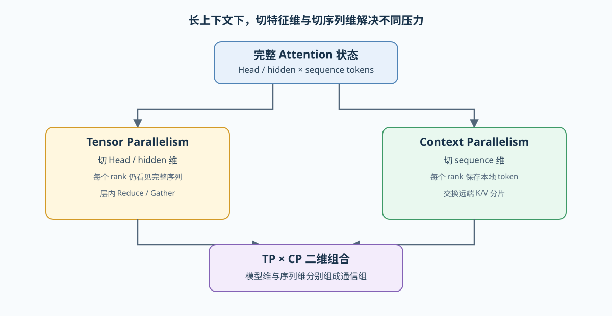
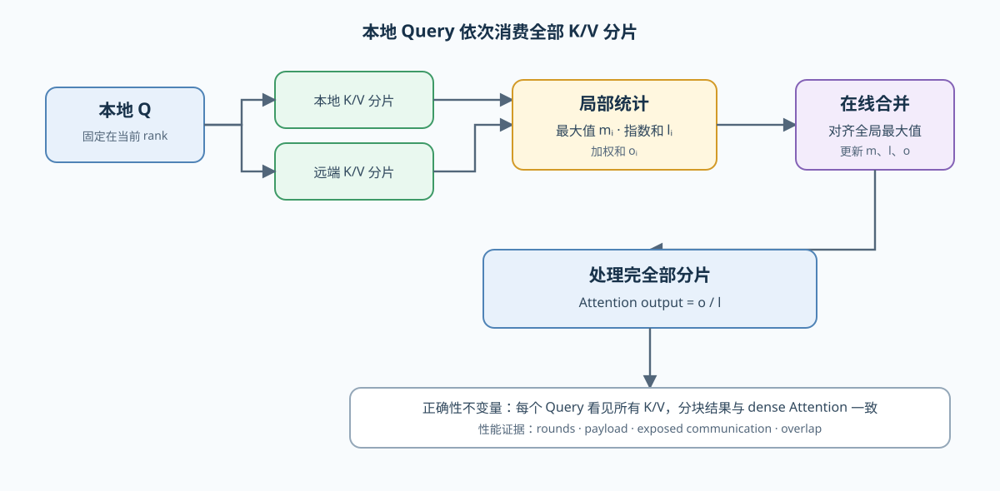

# PAR-CONTEXT. Context and Sequence Parallelism | 上下文与序列并行

**难度：** Hard | **环境：** CPU-first | **标签：** `通信与并行`, `Context Parallelism`, `长上下文` | **目标人群：** 并行通信学习者

> 🚀 **云端运行环境**
>
> 本章节的实战代码可以点击以下链接在免费 GPU 算力平台上直接运行：
>
> [](https://colab.research.google.com/github/datawhalechina/llm-algo-leetcode/blob/main/02_PyTorch_Algorithms/PAR-CONTEXT_Context_and_Sequence_Parallelism.ipynb)
> [](https://modelscope.cn/my/mynotebook) *(国内推荐：魔搭社区免费实例)*


---

## 本节导读

Tensor Parallelism 沿 Head 或特征维拆分单层计算；当上下文继续增长时，每个 rank 仍可能保存完整序列状态。Context Parallelism（CP）改为沿序列维分片，让不同 rank 分别持有一段 token，并通过通信获得完成 Attention 所需的远端 K/V。

本节从序列分片、远端 K/V 访问和分块 Softmax 合并三个环节解释 CP。重点不是记住某个框架参数，而是理解：切开序列后哪些状态留在本地、哪些信息必须交换，以及通信量为何随上下文和并行规模变化。

**关键词：** `Context Parallelism`, `Sequence Parallelism`, `Ring Attention`, `online softmax`

---

## 前置阅读

**导语：** 先掌握 Attention 中 Q/K/V 的形状和 Tensor Parallelism 的 Head 切分，再比较“切特征维”和“切序列维”改变了什么。

- [04. Attention MHA/GQA | Attention：MHA 与 GQA](./04_Attention_MHA_GQA.md)
- [29. Tensor Parallelism Sim | Tensor 并行模拟](./29_Tensor_Parallelism_Sim.md)
- [46. Communication Profiling with NCCL | NCCL 通信剖析](./46_Communication_Profiling_with_NCCL.md)

---
### Step 1：从长上下文压力定位序列切分

对长度为 $S$ 的序列，TP 可以降低每个 rank 的 Head 或隐藏维负担，却不会自动把 $S$ 个 token 分散出去。CP 将序列切为连续分片，每个 rank 保存本地 Q/K/V；计算本地 Query 时，还必须依次访问所有 K/V 分片，才能保持全局可见性。

| 并行维度 | 每个 rank 主要持有什么 | 主要通信 | 解决的压力 |
|---|---|---|---|
| TP | 部分 Head 或特征维 | All-Reduce / Reduce-Scatter | 单层权重与矩阵计算 |
| CP | 部分序列 token 及其状态 | K/V 交换、Ring 或 Gather | 长上下文状态与 Attention 工作 |
| TP × CP | 部分 Head × 部分序列 | 两个并行组内分别通信 | 大模型与长上下文同时扩展 |



### Step 2：让本地 Query 看见全部 K/V

序列分片后，本地 Query 只能直接访问本地 K/V。Ring Attention 让 K/V 分片按轮次在 rank 间移动：每轮计算一块局部分数，并维护当前最大值、指数和与加权值。经过全部分片后，每个 Query 仍然看见完整上下文。

分块 Softmax 不能分别归一化后再平均。设当前累计统计为 $(m, l, o)$，新分片统计为 $(m_i, l_i, o_i)$，必须先用 $m' = \max(m,m_i)$ 对两部分重新缩放，再合并分母和加权和。这个在线归一化不变量也是 FlashAttention 与分块 Attention 的共同基础。



### Step 3：比较容量收益与通信代价

CP 的容量收益来自序列状态分片，代价来自远端 K/V 访问。若每个 rank 的本地长度为 $S/P$，单轮 K/V payload 约与 $2(S/P)D$ 成正比；Ring 路径通常需要 $P-1$ 次远端交换。真实收益还取决于链路拓扑、通信—计算重叠和负载是否均匀。

| 检查项 | 机制问题 | 需要保留的证据 |
|---|---|---|
| 分片完整性 | token 是否不重不漏地分给各 rank | shard range、local sequence length |
| 数值一致性 | 分块统计能否恢复 dense Attention | 最大误差、dtype、mask 口径 |
| 通信账本 | 每轮搬运多少 K/V、需要多少轮 | payload bytes、rounds、world size |
| 组合约束 | TP group 与 CP group 是否正确分解 world size | TP degree、CP degree、rank mesh |
| 性能结论 | 通信是否被计算隐藏 | exposed communication、overlap、吞吐 |

### Step 4：CPU 实现——分块 Attention 与通信账本

本题用一组小型 Q/K/V 张量复现序列分片和全局 Attention。骨架已提供输入校验与结果容器；你将补全连续分片、局部 Softmax 统计、跨分片在线合并和 Ring 通信账本。

测试区分别覆盖分片完整性、与 dense Attention 的数值等价、大幅值输入的稳定性，以及通信轮数和 payload 的增长规律。

| 任务与目的 | 已知条件 | 完成标准 | 测试验证 |
|---|---|---|---|
| TODO 1：连续切分序列。保证 token 不重不漏 | `tensor`、`cp_size`、序列维 | 返回等长且有序的分片；不可整除时失败 | 拼接恢复与异常输入 |
| TODO 2：计算局部 Softmax 统计。避免提前局部归一化 | `scores`、`v_shard` | 返回局部最大值、指数和与加权和 | 形状与大幅值稳定性 |
| TODO 3：在线合并分片统计。恢复全局 Attention | 累计统计与局部统计 | 先对齐最大值，再合并分母与加权和 | 与 dense Attention 数值等价 |
| TODO 4：建立 Ring 通信账本。解释 CP 的代价 | 序列长度、hidden size、dtype、`cp_size` | 输出本地长度、轮数、每轮与总 payload | `cp_size=1` 与规模增长 |


```python
import math
from typing import Dict, List, Tuple

import torch
```


```python
def split_sequence_contiguous(tensor: torch.Tensor, cp_size: int) -> List[torch.Tensor]:
    """沿倒数第二维把序列连续、等长地分给 CP rank。"""
    if cp_size <= 0:
        raise ValueError('cp_size 必须为正整数')
    sequence_length = tensor.shape[-2]
    if sequence_length % cp_size != 0:
        raise ValueError('序列长度必须能被 cp_size 整除')

    # TODO 1（序列分片）：计算 local_sequence_length，并沿序列维返回有序分片。
    # local_sequence_length = ???
    # shards = ???
    raise NotImplementedError


def local_softmax_statistics(scores: torch.Tensor, value_shard: torch.Tensor) -> Tuple[torch.Tensor, torch.Tensor, torch.Tensor]:
    """计算一个 K/V 分片的稳定 Softmax 统计，不在分片内提前输出最终归一化结果。"""
    # TODO 2（局部统计）：沿 key 维计算 local_max、local_denominator 和 local_numerator。
    # local_max = ???
    # local_exp = ???
    # local_denominator = ???
    # local_numerator = ???
    raise NotImplementedError


def merge_softmax_statistics(
    running: Tuple[torch.Tensor, torch.Tensor, torch.Tensor] | None,
    local: Tuple[torch.Tensor, torch.Tensor, torch.Tensor],
) -> Tuple[torch.Tensor, torch.Tensor, torch.Tensor]:
    """将新分片的统计合并到全局在线 Softmax 状态。"""
    if running is None:
        return local
    running_max, running_denominator, running_numerator = running
    local_max, local_denominator, local_numerator = local

    # TODO 3（在线合并）：先得到 merged_max，再缩放两侧统计并相加。
    # merged_max = ???
    # running_scale = ???
    # local_scale = ???
    # merged_denominator = ???
    # merged_numerator = ???
    raise NotImplementedError


def context_parallel_attention_sim(query: torch.Tensor, key: torch.Tensor, value: torch.Tensor, cp_size: int) -> torch.Tensor:
    """用 K/V 分片和在线 Softmax 模拟每个本地 Query 对全序列的 Attention。"""
    key_shards = split_sequence_contiguous(key, cp_size)
    value_shards = split_sequence_contiguous(value, cp_size)
    running = None
    scale = 1.0 / math.sqrt(query.shape[-1])
    for key_shard, value_shard in zip(key_shards, value_shards):
        scores = torch.matmul(query, key_shard.transpose(-2, -1)) * scale
        running = merge_softmax_statistics(running, local_softmax_statistics(scores, value_shard))
    _, denominator, numerator = running
    return numerator / denominator


def estimate_ring_kv_communication(sequence_length: int, hidden_size: int, dtype_bytes: int, cp_size: int) -> Dict[str, int]:
    """估算每个 rank 在 Ring 路径中搬运 K/V 分片的通信账本。"""
    if min(sequence_length, hidden_size, dtype_bytes, cp_size) <= 0:
        raise ValueError('输入参数必须为正整数')
    if sequence_length % cp_size != 0:
        raise ValueError('序列长度必须能被 cp_size 整除')

    # TODO 4（通信账本）：K 与 V 各占一份本地序列状态；单卡不需要远端轮转。
    # local_sequence_length = ???
    # rounds = ???
    # payload_per_round_bytes = ???
    # total_payload_per_rank_bytes = ???
    raise NotImplementedError
```


```python
def test_sequence_partition_contract():
    """连续分片必须不重不漏，并能按原顺序恢复序列。"""
    tensor = torch.arange(24).reshape(1, 6, 4)
    shards = split_sequence_contiguous(tensor, cp_size=3)
    assert [shard.shape[-2] for shard in shards] == [2, 2, 2]
    assert torch.equal(torch.cat(shards, dim=-2), tensor)
    try:
        split_sequence_contiguous(tensor, cp_size=4)
    except ValueError:
        pass
    else:
        raise AssertionError('不可整除的序列长度应显式失败')


def test_context_parallel_attention_equivalence():
    """分块在线归一化应恢复 dense Attention 的数值结果。"""
    torch.manual_seed(7)
    query = torch.randn(2, 4, 8)
    key = torch.randn(2, 8, 8)
    value = torch.randn(2, 8, 6)
    scores = torch.matmul(query, key.transpose(-2, -1)) / math.sqrt(query.shape[-1])
    dense = torch.softmax(scores, dim=-1) @ value
    partitioned = context_parallel_attention_sim(query, key, value, cp_size=4)
    assert torch.allclose(partitioned, dense, atol=1e-5)


def test_online_softmax_stability():
    """大幅值分数下仍应得到有限且与 dense 路径一致的结果。"""
    query = torch.tensor([[[100.0, 0.0]]])
    key = torch.tensor([[[1.0, 0.0], [0.9, 0.0], [-1.0, 0.0], [0.0, 1.0]]])
    value = torch.arange(8, dtype=torch.float32).reshape(1, 4, 2)
    scores = torch.matmul(query, key.transpose(-2, -1)) / math.sqrt(2)
    dense = torch.softmax(scores, dim=-1) @ value
    partitioned = context_parallel_attention_sim(query, key, value, cp_size=2)
    assert torch.isfinite(partitioned).all()
    assert torch.allclose(partitioned, dense, atol=1e-5)


def test_ring_communication_ledger():
    """通信账本应区分本地长度、远端轮数与每 rank 总 payload。"""
    single = estimate_ring_kv_communication(1024, 4096, 2, cp_size=1)
    assert single['rounds'] == 0
    assert single['total_payload_per_rank_bytes'] == 0
    distributed = estimate_ring_kv_communication(1024, 4096, 2, cp_size=4)
    assert distributed['local_sequence_length'] == 256
    assert distributed['rounds'] == 3
    assert distributed['payload_per_round_bytes'] == 2 * 256 * 4096 * 2
    assert distributed['total_payload_per_rank_bytes'] == distributed['rounds'] * distributed['payload_per_round_bytes']


test_sequence_partition_contract()
test_context_parallel_attention_equivalence()
test_online_softmax_stability()
test_ring_communication_ledger()
print('✅ 序列分片、在线 Softmax 与 Ring 通信账本验证通过。')
```

---

🛑 **STOP HERE** 🛑
<br><br><br><br><br><br><br><br><br><br>
> 请先尝试自己完成代码并跑通测试。<br>
> 如果你正在 Colab 中运行，并且遇到困难没有思路，可以向下滚动查看参考答案。
<br><br><br><br><br><br><br><br><br><br>

---
## 参考代码与解析

### 代码

```python
def split_sequence_contiguous(tensor: torch.Tensor, cp_size: int) -> List[torch.Tensor]:
    """沿倒数第二维把序列连续、等长地分给 CP rank。"""
    if cp_size <= 0:
        raise ValueError('cp_size 必须为正整数')
    sequence_length = tensor.shape[-2]
    if sequence_length % cp_size != 0:
        raise ValueError('序列长度必须能被 cp_size 整除')
    local_sequence_length = sequence_length // cp_size
    return list(torch.split(tensor, local_sequence_length, dim=-2))


def local_softmax_statistics(scores: torch.Tensor, value_shard: torch.Tensor) -> Tuple[torch.Tensor, torch.Tensor, torch.Tensor]:
    """计算一个 K/V 分片的稳定 Softmax 统计。"""
    local_max = scores.max(dim=-1, keepdim=True).values
    local_exp = torch.exp(scores - local_max)
    local_denominator = local_exp.sum(dim=-1, keepdim=True)
    local_numerator = torch.matmul(local_exp, value_shard)
    return local_max, local_denominator, local_numerator


def merge_softmax_statistics(running, local):
    """将新分片统计合并到全局在线 Softmax 状态。"""
    if running is None:
        return local
    running_max, running_denominator, running_numerator = running
    local_max, local_denominator, local_numerator = local
    merged_max = torch.maximum(running_max, local_max)
    running_scale = torch.exp(running_max - merged_max)
    local_scale = torch.exp(local_max - merged_max)
    merged_denominator = running_denominator * running_scale + local_denominator * local_scale
    merged_numerator = running_numerator * running_scale + local_numerator * local_scale
    return merged_max, merged_denominator, merged_numerator


def context_parallel_attention_sim(query: torch.Tensor, key: torch.Tensor, value: torch.Tensor, cp_size: int) -> torch.Tensor:
    """用 K/V 分片和在线 Softmax 模拟全局 Attention。"""
    key_shards = split_sequence_contiguous(key, cp_size)
    value_shards = split_sequence_contiguous(value, cp_size)
    running = None
    scale = 1.0 / math.sqrt(query.shape[-1])
    for key_shard, value_shard in zip(key_shards, value_shards):
        scores = torch.matmul(query, key_shard.transpose(-2, -1)) * scale
        running = merge_softmax_statistics(running, local_softmax_statistics(scores, value_shard))
    _, denominator, numerator = running
    return numerator / denominator


def estimate_ring_kv_communication(sequence_length: int, hidden_size: int, dtype_bytes: int, cp_size: int) -> Dict[str, int]:
    """估算每个 rank 在 Ring 路径中搬运 K/V 分片的通信账本。"""
    if min(sequence_length, hidden_size, dtype_bytes, cp_size) <= 0:
        raise ValueError('输入参数必须为正整数')
    if sequence_length % cp_size != 0:
        raise ValueError('序列长度必须能被 cp_size 整除')
    local_sequence_length = sequence_length // cp_size
    rounds = cp_size - 1
    payload_per_round_bytes = 2 * local_sequence_length * hidden_size * dtype_bytes
    total_payload_per_rank_bytes = rounds * payload_per_round_bytes
    return {
        'local_sequence_length': local_sequence_length,
        'rounds': rounds,
        'payload_per_round_bytes': payload_per_round_bytes,
        'total_payload_per_rank_bytes': total_payload_per_rank_bytes,
    }
```

### 解析

**TODO 1：序列分片**

- 连续等长分片让每个 token 只属于一个 rank，也使通信账本能够用统一的本地长度计算。
- 不可整除的配置应在执行前失败，不能静默丢弃尾部 token。

**TODO 2：局部 Softmax 统计**

- 先减去局部最大值，避免大分数在指数运算中溢出。
- 局部分母和加权和仍是未完成状态，不能直接当作最终 Attention 输出。

**TODO 3：在线合并**

- 两个分片必须先对齐到新的全局最大值，再合并指数和与加权和。
- 该不变量保证分块顺序不改变最终归一化结果。

**TODO 4：Ring 通信账本**

- 每个分片同时包含 K 和 V，因此每轮 payload 含两份状态。
- `cp_size=1` 没有远端交换；扩大 CP 会缩短本地序列，却增加远端轮数。真实结论还需测量链路与 overlap。

### Step 5：可选多 GPU 复测——K/V 交换与局部 Query

CPU 实验验证分块 Softmax 与通信账本；本实验让每个 rank 保存局部 Q/K/V，通过真实 NCCL all-gather 形成全局 K/V，再与预先复制全量 K/V 的计算路径比较。它验证通信暴露量，不等同于 Ring Attention 专用 kernel。

| CPU 机制价值 | GPU 实验价值 | 仍不能推出 |
| --- | --- | --- |
| 验证分片、在线 Softmax 和理论 payload | 验证全局 K/V 交换、输出一致性和暴露交换时间 | 专用 Ring kernel、长上下文模型质量和生产吞吐 |

#### 5.1 固定上下文切分 workload


```python
# 默认关闭；真实 Context Parallel 机制复测至少需要两张 CUDA GPU。
RUN_GPU_EXPERIMENT = False
WORLD_SIZE = 2  # 序列分片数和 NCCL rank 数。
SEQ_LEN = 2048  # 全局上下文长度，必须能被 WORLD_SIZE 整除。
NUM_HEADS = 8  # 每个 rank 使用相同的 Query Head 数。
HEAD_DIM = 64  # 单个 Attention Head 的维度。
DTYPE = 'bfloat16'
WARMUP = 3
REPEATS = 10
RESULT_PATH = 'benchmarks/results/par_context_attention.json'
print({'run': RUN_GPU_EXPERIMENT, 'world_size': WORLD_SIZE, 'seq_len': SEQ_LEN, 'heads': NUM_HEADS, 'head_dim': HEAD_DIM, 'result': RESULT_PATH})

```

#### 5.2 执行 K/V 交换与 Attention


```python
if RUN_GPU_EXPERIMENT:
    import subprocess
    command = [
        'torchrun', '--standalone', '--nproc_per_node', str(WORLD_SIZE),
        'tools/run_parallel_mechanism_benchmark.py', '--mode', 'cp_attention',
        '--seq-len', str(SEQ_LEN), '--num-heads', str(NUM_HEADS), '--head-dim', str(HEAD_DIM),
        '--dtype', DTYPE, '--warmup', str(WARMUP), '--repeats', str(REPEATS),
        '--output', RESULT_PATH,
    ]
    subprocess.run(command, check=True)
else:
    print('多 GPU Context Parallel 实验默认关闭。')

```

#### 5.3 读取交换与状态证据


```python
import json
from pathlib import Path
result_path = Path(RESULT_PATH)
if result_path.exists():
    result = json.loads(result_path.read_text(encoding='utf-8'))
    required = {'workload', 'hardware', 'metrics', 'evidence_level', 'failure', 'decision'}
    missing = required - set(result)
    if missing:
        raise ValueError(f'结果 JSON 缺少字段：{sorted(missing)}')
    print(result)
else:
    print(f'尚无 Context Parallel 结果：{RESULT_PATH}')

```

## 相关阅读

- [Ring Attention 论文](https://arxiv.org/abs/2310.01889)
- [PyTorch Distributed：Context Parallel](https://docs.pytorch.org/tutorials/unstable/context_parallel.html)
- [49. Parallelism Strategy Selection | 并行策略选型](./49_Parallelism_Strategy_Selection.md)
- [79. Distributed Parallel Benchmark | 分布式并行基准](./79_Distributed_Parallel_Benchmark.md)