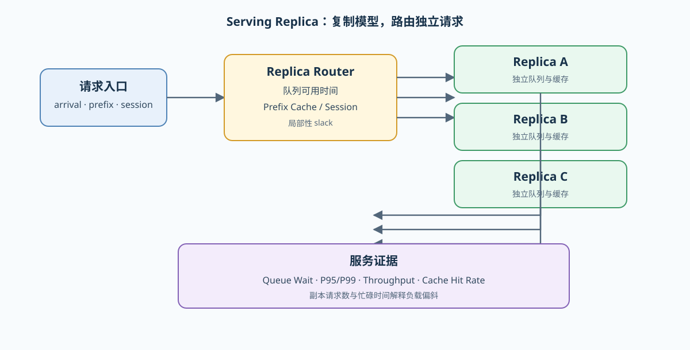
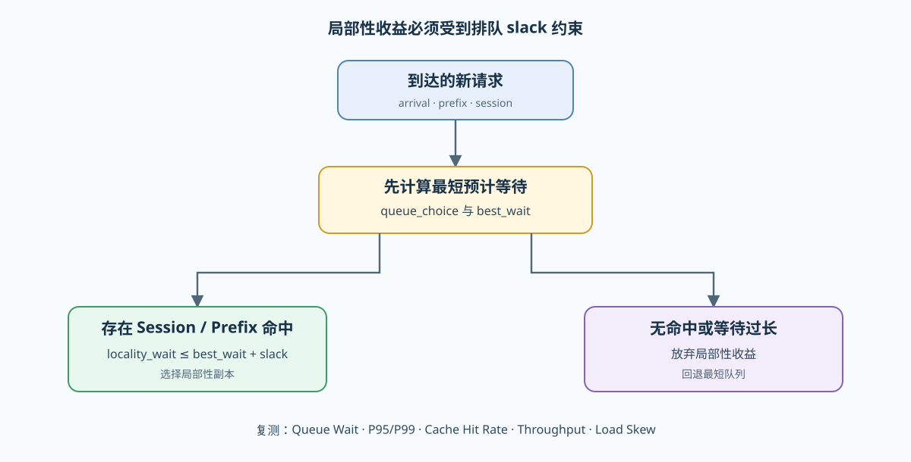

# PAR-REPLICA. Serving Replica Routing | Serving 副本与请求路由

**难度：** Hard | **环境：** CPU-first | **标签：** `通信与并行`, `Serving Replica`, `请求路由` | **目标人群：** 推理与并行系统学习者

> 🚀 **云端运行环境**
>
> 本章节的实战代码可以点击以下链接在免费 GPU 算力平台上直接运行：
>
> [](https://colab.research.google.com/github/datawhalechina/llm-algo-leetcode/blob/main/02_PyTorch_Algorithms/PAR-REPLICA_Serving_Replica_Routing.ipynb)
> [](https://modelscope.cn/my/mynotebook) *(国内推荐：魔搭社区免费实例)*


---

## 本节导读

训练 Data Parallelism 让多个副本处理不同数据，并在更新时同步梯度；Serving 副本同样复制模型，但主要任务是把彼此独立的请求分给合适实例。它通常不需要每轮梯度同步，却要处理队列偏斜、缓存局部性、会话连续性和尾延迟。

本节比较 Round-Robin、Queue-Aware 与 Prefix / Session-Aware 路由。学习重点是路由目标之间的冲突：选择空闲副本可以缩短等待，选择已有缓存的副本可以减少重复 Prefill，但为了缓存命中等待过久同样会伤害 P95 / P99。

**关键词：** `replica routing`, `queue wait`, `cache locality`, `sticky session`, `tail latency`

---

## 前置阅读

**导语：** 先理解请求级调度、Prefix Cache 和队列等待，再把这些信号提升到多副本路由层。

- [24. Prefix Cache Matching and Reuse | Prefix Cache 匹配与复用](./24_Prefix_Cache_Matching_and_Reuse.md)
- [36. Decode Scheduling | Decode 调度](./36_Decode_Scheduling.md)
- [70. Serving Scheduler Benchmark | Serving 调度基准](./70_Serving_Scheduler_Benchmark.md)

---
### Step 1：区分训练数据并行与 Serving 副本

两者都复制模型，但协同对象不同。训练副本需要共同完成一次参数更新；Serving 副本通常独立执行请求，由路由层决定请求进入哪个队列。

| 对比维度 | 训练 Data Parallel | Serving Replica |
|---|---|---|
| 工作单元 | batch / micro-batch | 独立请求或会话 |
| 跨副本协同 | 梯度归约、参数一致性 | 请求分发、状态与缓存定位 |
| 主要均衡目标 | 每 rank 计算量接近 | 队列等待、吞吐与尾延迟 |
| 状态局部性 | 优化器与训练状态 | Prefix Cache、会话与 adapter |
| 主要失败模式 | straggler、同步等待 | 热点副本、缓存抖动、会话迁移 |



### Step 2：比较三种路由信号

Round-Robin 不读取运行状态，适合作为低成本 baseline；Queue-Aware 选择预计最早可用的副本；Locality-Aware 优先复用会话或 Prefix Cache，但必须设置等待容忍度。若缓存副本的预计开始时间比最空闲副本晚得过多，应放弃局部性并回到队列优先。

| 策略 | 使用的信号 | 主要收益 | 容易误判的场景 |
|---|---|---|---|
| Round-Robin | 请求序号 | 实现简单、无状态 | 请求成本不均时形成热点 |
| Queue-Aware | `available_at`、arrival | 降低排队和负载偏斜 | 忽略 Prefix Cache 与会话迁移 |
| Prefix / Session-Aware | 队列、prefix、session、slack | 复用状态并减少重复 Prefill | 为命中等待过久，反而增加尾延迟 |



### Step 3：用负载、局部性与尾延迟共同判断

副本数增加不保证吞吐线性增长。路由结果至少要同时记录 Queue Wait、P95 / P99、吞吐、Cache Hit Rate 和副本负载偏斜；若只看平均延迟，少量被错误粘住的长等待请求会被掩盖。

| 证据 | 回答的问题 | 典型风险 |
|---|---|---|
| Queue Wait 与 P95 / P99 | 请求是否在入口长期等待 | 热点副本或 sticky session 过强 |
| Cache Hit Rate | 路由是否保留状态局部性 | 命中高但队列更长 |
| 每副本请求数与忙碌时间 | 负载是否均衡 | 仅按请求数均衡却忽略请求成本 |
| Throughput | 固定 workload 内完成请求的速度 | 牺牲尾延迟换取总量 |
| 路由原因 | 决策来自队列、prefix 还是 session | 无法解释策略为何退化 |

### Step 4：CPU 实现——多副本路由与离散事件模拟

本题用带到达时间、服务时间、Prefix 与 Session 的请求流模拟多个副本。骨架已提供副本状态和事件字段；你将补全路由选择、队列时间推进、指标汇总和策略比较。

测试区覆盖 Round-Robin 顺序、Queue-Aware 的最早可用选择、局部性 slack、时间线不变量和三种策略的统一 workload 对照。

| 任务与目的 | 已知条件 | 完成标准 | 测试验证 |
|---|---|---|---|
| TODO 1：选择副本。平衡队列与状态局部性 | 请求、各副本 `available_at`、缓存、会话归属、slack | 返回 replica 与可解释路由原因；局部性等待不得超过 slack | 三类策略与 fallback |
| TODO 2：推进请求时间线。形成可复核执行记录 | arrival、service、cache speedup、选中副本 | `start ≥ arrival`，同副本请求不重叠，完成后更新缓存与会话 | 时间线、命中与状态更新 |
| TODO 3：汇总服务指标。避免只看平均值 | 完整 records、replica 数 | 输出 queue wait、P95/P99、吞吐、命中率与负载偏斜 | 空输入与已知分布 |
| TODO 4：比较路由策略。保持 workload 一致 | 同一请求流与副本数 | 返回按 P95、吞吐排序的策略结果，不修改原请求 | baseline / candidate 对照 |


```python
import math
from copy import deepcopy
from typing import Any, Dict, List, Tuple
```


```python
def select_replica(
    request: Dict[str, Any],
    replicas: List[Dict[str, Any]],
    strategy: str,
    round_robin_index: int,
    session_owner: Dict[str, int],
    locality_slack_ms: float,
) -> Tuple[int, str]:
    """选择副本，并返回可解释的路由原因。"""
    if strategy not in {'round_robin', 'queue_aware', 'locality_aware'}:
        raise ValueError(f'未知路由策略: {strategy}')
    if not replicas:
        raise ValueError('至少需要一个副本')

    # TODO 1（副本选择）：
    # round_robin 按索引轮转；queue_aware 选择预计等待最短的副本；
    # locality_aware 依次检查 session 和 prefix，但候选等待不能超过最短等待 + slack。
    # selected_replica = ???
    # route_reason = ???
    raise NotImplementedError


def simulate_replica_routing(
    requests: List[Dict[str, Any]],
    num_replicas: int,
    strategy: str,
    locality_slack_ms: float = 5.0,
    cache_hit_speedup: float = 0.30,
) -> List[Dict[str, Any]]:
    """按到达顺序模拟副本队列、缓存命中和会话归属。"""
    if num_replicas <= 0:
        raise ValueError('num_replicas 必须为正整数')
    replicas = [
        {'replica_id': index, 'available_at_ms': 0.0, 'cached_prefixes': set(), 'request_count': 0}
        for index in range(num_replicas)
    ]
    session_owner: Dict[str, int] = {}
    records: List[Dict[str, Any]] = []

    # TODO 2（时间线推进）：逐个选择副本，计算 start / finish / queue_wait，更新状态并保存记录。
    # 注意：cache_hit 由执行前的缓存状态决定；命中只缩短 service，不改变原请求。
    raise NotImplementedError


def summarize_replica_service(records: List[Dict[str, Any]], num_replicas: int) -> Dict[str, Any]:
    """汇总队列、尾延迟、吞吐、命中率与副本负载偏斜。"""
    if not records:
        return {'request_count': 0, 'mean_queue_wait_ms': 0.0, 'p95_queue_wait_ms': 0.0,
                'p99_queue_wait_ms': 0.0, 'throughput_requests_per_s': 0.0,
                'cache_hit_rate': 0.0, 'load_skew_ratio': 0.0}

    # TODO 3（指标汇总）：使用 nearest-rank 分位数，并按观测窗口计算吞吐。
    # waits = ???
    # counts = ???
    # metrics = ???
    raise NotImplementedError


def compare_replica_strategies(requests: List[Dict[str, Any]], num_replicas: int, locality_slack_ms: float = 5.0) -> List[Dict[str, Any]]:
    """在同一请求流上比较三种路由策略，并按 P95 后按吞吐排序。"""
    # TODO 4（策略对照）：分别运行三种策略，保留 strategy 与 metrics，不得修改 requests。
    # comparisons = ???
    raise NotImplementedError
```


```python
def _routing_requests():
    return [
        {'request_id': 'r0', 'arrival_ms': 0.0, 'service_ms': 20.0, 'prefix_key': 'a', 'session_id': 's0'},
        {'request_id': 'r1', 'arrival_ms': 1.0, 'service_ms': 8.0, 'prefix_key': 'b', 'session_id': 's1'},
        {'request_id': 'r2', 'arrival_ms': 2.0, 'service_ms': 8.0, 'prefix_key': 'a', 'session_id': 's2'},
        {'request_id': 'r3', 'arrival_ms': 3.0, 'service_ms': 6.0, 'prefix_key': 'b', 'session_id': 's1'},
    ]


def test_replica_selection_contract():
    """三类策略应读取各自需要的信号，并遵守 locality slack。"""
    replicas = [
        {'replica_id': 0, 'available_at_ms': 20.0, 'cached_prefixes': {'a'}, 'request_count': 1},
        {'replica_id': 1, 'available_at_ms': 5.0, 'cached_prefixes': set(), 'request_count': 1},
    ]
    request = {'arrival_ms': 0.0, 'prefix_key': 'a', 'session_id': 'new'}
    assert select_replica(request, replicas, 'round_robin', 3, {}, 5.0)[0] == 1
    assert select_replica(request, replicas, 'queue_aware', 0, {}, 5.0)[0] == 1
    assert select_replica(request, replicas, 'locality_aware', 0, {}, 20.0) == (0, 'prefix_locality')
    assert select_replica(request, replicas, 'locality_aware', 0, {}, 5.0) == (1, 'queue_fallback')


def test_routing_timeline_contract():
    """同一副本上的请求不得重叠，缓存命中与会话归属必须可追踪。"""
    records = simulate_replica_routing(_routing_requests(), 2, 'locality_aware', locality_slack_ms=10.0)
    assert len(records) == 4
    for record in records:
        assert record['start_ms'] >= record['arrival_ms']
        assert record['finish_ms'] >= record['start_ms']
        assert record['queue_wait_ms'] == record['start_ms'] - record['arrival_ms']
    by_replica = {}
    for record in records:
        previous_finish = by_replica.get(record['replica_id'], 0.0)
        assert record['start_ms'] >= previous_finish
        by_replica[record['replica_id']] = record['finish_ms']
    assert any(record['cache_hit'] for record in records)


def test_service_metrics_and_strategy_comparison():
    """所有策略必须使用同一 workload，并输出可比较的尾延迟与吞吐字段。"""
    original = deepcopy(_routing_requests())
    comparisons = compare_replica_strategies(original, 2, locality_slack_ms=10.0)
    assert original == _routing_requests()
    assert {item['strategy'] for item in comparisons} == {'round_robin', 'queue_aware', 'locality_aware'}
    assert comparisons == sorted(
        comparisons,
        key=lambda item: (item['metrics']['p95_queue_wait_ms'], -item['metrics']['throughput_requests_per_s']),
    )
    for item in comparisons:
        metrics = item['metrics']
        assert 0.0 <= metrics['cache_hit_rate'] <= 1.0
        assert metrics['throughput_requests_per_s'] > 0.0


test_replica_selection_contract()
test_routing_timeline_contract()
test_service_metrics_and_strategy_comparison()
print('✅ Serving 副本选择、时间线与策略对照验证通过。')
```

---

🛑 **STOP HERE** 🛑
<br><br><br><br><br><br><br><br><br><br>
> 请先尝试自己完成代码并跑通测试。<br>
> 如果你正在 Colab 中运行，并且遇到困难没有思路，可以向下滚动查看参考答案。
<br><br><br><br><br><br><br><br><br><br>

---
## 参考代码与解析

### 代码

```python
def select_replica(request, replicas, strategy, round_robin_index, session_owner, locality_slack_ms):
    """选择副本，并返回可解释的路由原因。"""
    if strategy not in {'round_robin', 'queue_aware', 'locality_aware'}:
        raise ValueError(f'未知路由策略: {strategy}')
    if not replicas:
        raise ValueError('至少需要一个副本')
    if strategy == 'round_robin':
        return round_robin_index % len(replicas), 'round_robin'

    arrival_ms = float(request['arrival_ms'])
    waits = [max(0.0, replica['available_at_ms'] - arrival_ms) for replica in replicas]
    queue_choice = min(range(len(replicas)), key=lambda index: (waits[index], index))
    if strategy == 'queue_aware':
        return queue_choice, 'shortest_queue'

    session_id = request.get('session_id')
    if session_id in session_owner:
        owner = session_owner[session_id]
        if waits[owner] <= waits[queue_choice] + locality_slack_ms:
            return owner, 'sticky_session'
    prefix_key = request.get('prefix_key')
    prefix_candidates = [
        index for index, replica in enumerate(replicas)
        if prefix_key is not None and prefix_key in replica['cached_prefixes']
    ]
    if prefix_candidates:
        prefix_choice = min(prefix_candidates, key=lambda index: (waits[index], index))
        if waits[prefix_choice] <= waits[queue_choice] + locality_slack_ms:
            return prefix_choice, 'prefix_locality'
    return queue_choice, 'queue_fallback'


def simulate_replica_routing(requests, num_replicas, strategy, locality_slack_ms=5.0, cache_hit_speedup=0.30):
    """按到达顺序模拟副本队列、缓存命中和会话归属。"""
    if num_replicas <= 0:
        raise ValueError('num_replicas 必须为正整数')
    replicas = [
        {'replica_id': index, 'available_at_ms': 0.0, 'cached_prefixes': set(), 'request_count': 0}
        for index in range(num_replicas)
    ]
    session_owner = {}
    records = []
    ordered_requests = sorted(requests, key=lambda request: (request['arrival_ms'], request['request_id']))
    for request_index, request in enumerate(ordered_requests):
        replica_id, route_reason = select_replica(
            request, replicas, strategy, request_index, session_owner, locality_slack_ms
        )
        replica = replicas[replica_id]
        arrival_ms = float(request['arrival_ms'])
        start_ms = max(arrival_ms, replica['available_at_ms'])
        cache_hit = request.get('prefix_key') in replica['cached_prefixes']
        service_ms = float(request['service_ms']) * (1.0 - cache_hit_speedup if cache_hit else 1.0)
        finish_ms = start_ms + service_ms
        record = {
            **request, 'replica_id': replica_id, 'route_reason': route_reason,
            'cache_hit': cache_hit, 'start_ms': start_ms, 'finish_ms': finish_ms,
            'queue_wait_ms': start_ms - arrival_ms, 'effective_service_ms': service_ms,
        }
        records.append(record)
        replica['available_at_ms'] = finish_ms
        replica['request_count'] += 1
        if request.get('prefix_key') is not None:
            replica['cached_prefixes'].add(request['prefix_key'])
        if request.get('session_id') is not None:
            session_owner[request['session_id']] = replica_id
    return records


def summarize_replica_service(records, num_replicas):
    """汇总队列、尾延迟、吞吐、命中率与副本负载偏斜。"""
    if not records:
        return {'request_count': 0, 'mean_queue_wait_ms': 0.0, 'p95_queue_wait_ms': 0.0,
                'p99_queue_wait_ms': 0.0, 'throughput_requests_per_s': 0.0,
                'cache_hit_rate': 0.0, 'load_skew_ratio': 0.0}
    waits = sorted(float(record['queue_wait_ms']) for record in records)
    def nearest_rank(values, quantile):
        index = max(0, math.ceil(quantile * len(values)) - 1)
        return values[index]
    counts = [0] * num_replicas
    for record in records:
        counts[record['replica_id']] += 1
    window_ms = max(record['finish_ms'] for record in records) - min(record['arrival_ms'] for record in records)
    mean_count = len(records) / num_replicas
    return {
        'request_count': len(records),
        'mean_queue_wait_ms': sum(waits) / len(waits),
        'p95_queue_wait_ms': nearest_rank(waits, 0.95),
        'p99_queue_wait_ms': nearest_rank(waits, 0.99),
        'throughput_requests_per_s': len(records) * 1000.0 / window_ms,
        'cache_hit_rate': sum(bool(record['cache_hit']) for record in records) / len(records),
        'load_skew_ratio': (max(counts) - min(counts)) / mean_count if mean_count else 0.0,
    }


def compare_replica_strategies(requests, num_replicas, locality_slack_ms=5.0):
    """在同一请求流上比较三种路由策略。"""
    comparisons = []
    for strategy in ('round_robin', 'queue_aware', 'locality_aware'):
        records = simulate_replica_routing(
            deepcopy(requests), num_replicas, strategy, locality_slack_ms=locality_slack_ms
        )
        comparisons.append({
            'strategy': strategy,
            'metrics': summarize_replica_service(records, num_replicas),
        })
    return sorted(
        comparisons,
        key=lambda item: (item['metrics']['p95_queue_wait_ms'], -item['metrics']['throughput_requests_per_s']),
    )
```

### 解析

**TODO 1：副本选择**

- Queue-Aware 比较的是预计等待，而不是简单请求数；Locality-Aware 还要检查缓存或会话归属。
- `locality_slack_ms` 给局部性设置上限，避免为了命中把请求粘在长期拥塞的副本上。

**TODO 2：时间线推进**

- `start_ms` 同时受请求到达时间和副本可用时间约束，同一副本上的请求不能重叠。
- 缓存命中只影响当前请求的有效服务时间；缓存和 Session 归属在请求完成路径中更新。

**TODO 3：指标汇总**

- P95 / P99 揭示少量长等待请求，Cache Hit Rate 与负载偏斜解释这些等待可能来自哪里。
- 吞吐必须使用统一观测窗口，不能把不同请求流的结果直接比较。

**TODO 4：策略对照**

- 三种策略必须复用相同请求流和副本数；排序先看尾延迟，再用吞吐打破并列。
- CPU 模拟只验证路由和时间线机制；真实副本的模型执行、KV 占用和网络代价由分布式推理项目验证。

### Step 5：可选多 GPU 复测——副本负载分配

CPU 模拟能够解释队列和局部性；本实验把同一组不均匀请求成本分配给两个真实 GPU rank，比较 round-robin 与 least-loaded 的最大 rank 完成时间。它是副本负载机制实验，不是 vLLM 或 SGLang Serving benchmark。

| CPU 机制价值 | GPU 实验价值 | 仍不能推出 |
| --- | --- | --- |
| 验证到达、排队、缓存与路由规则 | 验证不均匀 GPU workload 下的负载分配和 makespan | 模型 KV 命中、网络入口、真实 backend 调度和在线尾延迟 |

#### 5.1 固定副本与请求 workload


```python
# 默认关闭；每个 torchrun rank 代表一个独立 GPU 副本。
RUN_GPU_EXPERIMENT = False
WORLD_SIZE = 2  # 副本数量；当前固定成本序列针对两卡对照。
COMPUTE_DIM = 768  # 每个成本单位执行一次方阵乘法。
DTYPE = 'bfloat16'
WARMUP = 2
REPEATS = 5
RESULT_PATH = 'benchmarks/results/par_replica_routing.json'
print({'run': RUN_GPU_EXPERIMENT, 'replicas': WORLD_SIZE, 'compute_dim': COMPUTE_DIM, 'result': RESULT_PATH})

```

#### 5.2 执行两种副本分配策略


```python
if RUN_GPU_EXPERIMENT:
    import subprocess
    command = [
        'torchrun', '--standalone', '--nproc_per_node', str(WORLD_SIZE),
        'tools/run_parallel_mechanism_benchmark.py', '--mode', 'replica_routing',
        '--compute-dim', str(COMPUTE_DIM), '--dtype', DTYPE,
        '--warmup', str(WARMUP), '--repeats', str(REPEATS), '--output', RESULT_PATH,
    ]
    subprocess.run(command, check=True)
else:
    print('多 GPU Replica 实验默认关闭。')

```

#### 5.3 读取负载与 makespan 证据


```python
import json
from pathlib import Path
result_path = Path(RESULT_PATH)
if result_path.exists():
    result = json.loads(result_path.read_text(encoding='utf-8'))
    required = {'workload', 'hardware', 'metrics', 'evidence_level', 'failure', 'decision'}
    missing = required - set(result)
    if missing:
        raise ValueError(f'结果 JSON 缺少字段：{sorted(missing)}')
    print(result)
else:
    print(f'尚无 Replica Routing 结果：{RESULT_PATH}')

```

## 相关阅读

- [SGLang：HiCache 与缓存感知调度](https://docs.sglang.ai/advanced_features/hicache_best_practices.html)
- [vLLM：Production Metrics](https://docs.vllm.ai/en/latest/design/metrics.html)
- [49. Parallelism Strategy Selection | 并行策略选型](./49_Parallelism_Strategy_Selection.md)
- [81. Distributed Inference Project | 分布式推理项目](./81_Distributed_Inference_Project.md)