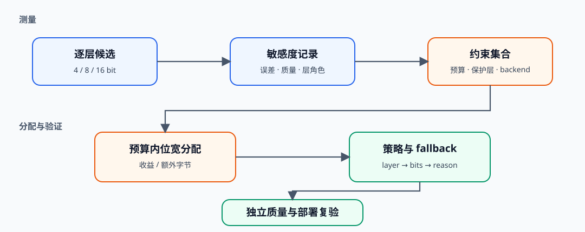
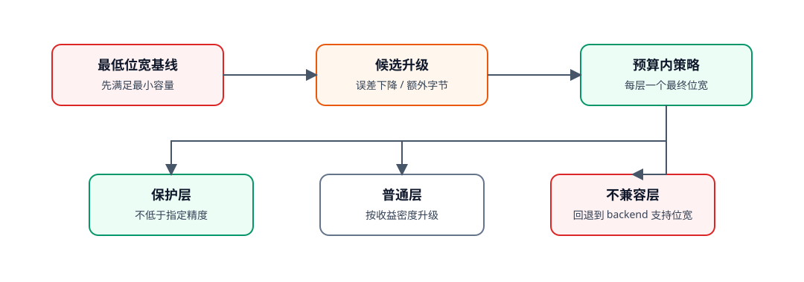

# QUANT-MIXED-BIT. Mixed Bit Allocation | 混合位宽分配

**状态：** 语义编号候选页　**难度：** Hard　**环境：** CPU　**标签：** `量化`, `mixed-bit`, `budget`

> 🚀 **云端运行环境**
>
> 本章节的实战代码可以点击以下链接在免费 GPU 算力平台上直接运行：
>
> [](https://colab.research.google.com/github/datawhalechina/llm-algo-leetcode/blob/main/02_PyTorch_Algorithms/QUANT-MIXED-BIT_Mixed_Bit_Allocation.ipynb)
> [](https://modelscope.cn/my/mynotebook) *(国内推荐：魔搭社区免费实例)*


## 本节导读

统一位宽把所有层视为同样敏感，但实际模型中，不同层对量化误差的容忍度并不相同。混合位宽先在统一评测协议下测量逐层候选，再在容量预算、保护层规则和 backend 支持范围内分配位宽。本节把敏感度、预算和 fallback 收敛为一份可审计策略。
## 前置阅读

先掌握统一误差协议和权重量化 artifact，再进入跨层预算分配。

- [52 量化校准与误差控制](./52_Quantization_Calibration_and_Error.md)
- [40 GPTQ / AWQ 权重量化](./40_GPTQ_and_AWQ_Weight_Quantization.md)
- [53 激活量化与 SmoothQuant](./53_Activation_Quantization_and_SmoothQuant.md)
### Step 1：混合位宽需要哪些共同输入

混合位宽不是凭层名猜测精度，而是为每层准备可比较候选。每个候选至少包含位宽、实测误差、权重字节和 backend 支持状态；保护层规则用于表达 embedding、输出头或其他高敏感层的最低精度。

| 输入 | 作用 | 典型失败 |
|---|---|---|
| 逐层候选误差 | 衡量降低位宽的质量代价 | 使用不同校准样本导致不可比 |
| 参数量与元数据 | 计算真实容量 | 只算 packed weight，漏掉 scale |
| backend 支持位宽 | 过滤无法执行的候选 | 策略存在但 loader/kernel 不支持 |
| 保护层规则 | 保留最低允许精度 | 全局预算把关键层压得过低 |


### Step 2：敏感度必须来自统一协议

逐层敏感度可以由输出重建误差、任务质量下降或两者组合得到。无论选择哪种指标，校准数据、其余层状态和评测方法都必须固定；否则“某层更敏感”可能只是实验条件不同。

| 测量方式 | 优点 | 局限 | 适用阶段 |
|---|---|---|---|
| 层输出 MSE | 快、可逐层扫描 | 不等同于任务质量 | 候选初筛 |
| Hessian/激活加权误差 | 更贴近输入分布 | 仍是代理指标 | 权重量化排序 |
| 任务质量消融 | 决策意义强 | 成本高、噪声大 | 最终保护层确认 |
### Step 3：在预算内升级敏感层并保留 fallback

一种可解释的启发式做法是：先为所有层选择最低可行位宽，再把剩余预算用于升级“单位额外字节可减少最多误差”的层。该策略不保证全局最优，但每次升级都有可追溯理由，也能显式处理保护层和 backend fallback。

| 阶段 | 决策 | 输出 |
|---|---|---|
| 最低可行策略 | 应用 backend 与保护层约束 | 容量下界 |
| 候选升级 | 比较误差下降 / 额外字节 | 升级优先级 |
| 独立复验 | 固定质量集和真实 backend | accept / tune / reject |


### Step 4：实现预算约束下的混合位宽分配

题目区实现候选契约、保护层基线和贪心升级。代码不负责产生敏感度数据；它要求输入已经来自统一协议，从而把练习集中在跨层策略组合。

| TODO | 机制责任 | 关键测试 |
|---|---|---|
| TODO 1 | 过滤 backend 不支持的位宽并计算候选字节 | 支持集合、容量计算 |
| TODO 2 | 建立满足保护规则的最低容量策略 | 最低位宽与无候选错误 |
| TODO 3 | 按误差下降/额外字节选择升级 | 预算不超限、敏感层优先 |

```python
import math

import torch
```


```python
# 题目区：补全候选构造、保护层基线和预算内升级三个混合位宽机制。
class MixedBitAllocator:
    """根据逐层实测误差、容量预算与 backend 支持生成混合位宽策略。"""

    def __init__(self, supported_bits=(4, 8, 16)):
        self.supported_bits = tuple(sorted(set(int(bits) for bits in supported_bits)))

    def build_options(self, layer_name: str, layer_spec: dict):
        """把一个层的实测误差表转换为可比较候选。"""
        numel = int(layer_spec["numel"])
        error_by_bits = {int(bits): float(error) for bits, error in layer_spec["error_by_bits"].items()}

        # TODO 1（候选契约）：仅保留 backend 支持且有实测误差的位宽，并计算权重字节。
        # options = ???
        if not options:
            raise ValueError(f"{layer_name} has no supported bit-width candidate")
        return sorted(options, key=lambda option: option["bytes"])

    @staticmethod
    def select_initial_option(options, minimum_bits: int):
        """选择满足保护规则的最低容量候选。"""
        # TODO 2（保护规则）：过滤 bits >= minimum_bits 的候选，再选择字节最少者。
        # eligible = ???
        # initial = ???
        return initial

    def allocate(self, layer_specs: dict, budget_bytes: int, protected_min_bits=None):
        """从最低可行策略开始，按误差下降/额外字节比率逐步升级。"""
        protected_min_bits = protected_min_bits or {}
        options_by_layer = {
            name: self.build_options(name, spec) for name, spec in layer_specs.items()
        }
        policy = {
            name: self.select_initial_option(options, protected_min_bits.get(name, 0))
            for name, options in options_by_layer.items()
        }
        total_bytes = sum(option["bytes"] for option in policy.values())
        if total_bytes > budget_bytes:
            raise ValueError("budget cannot satisfy the minimum feasible policy")

        while True:
            upgrades = []
            for name, options in options_by_layer.items():
                current = policy[name]
                for candidate in options:
                    extra_bytes = candidate["bytes"] - current["bytes"]
                    error_reduction = current["error"] - candidate["error"]
                    if extra_bytes > 0 and error_reduction > 0 and total_bytes + extra_bytes <= budget_bytes:
                        upgrades.append({
                            "layer": name,
                            "candidate": candidate,
                            "extra_bytes": extra_bytes,
                            "error_reduction": error_reduction,
                        })
            if not upgrades:
                break

            # TODO 3（预算分配）：选择单位额外字节带来最大误差下降的升级。
            # best_upgrade = ???
            policy[best_upgrade["layer"]] = best_upgrade["candidate"]
            total_bytes += best_upgrade["extra_bytes"]

        return {
            "policy": {name: option["bits"] for name, option in policy.items()},
            "total_bytes": total_bytes,
            "total_error": sum(option["error"] for option in policy.values()),
            "details": policy,
        }
```

### 测试

测试覆盖候选过滤、保护层、预算守恒、升级优先级和不可行预算。

```python
# 机制测试：backend 候选、保护层、容量预算与敏感层升级。
def make_mixed_bit_specs():
    """构造两个层的固定敏感度记录。"""
    return {
        "attention": {"numel": 1000, "error_by_bits": {4: 0.40, 8: 0.03, 16: 0.0}},
        "mlp": {"numel": 2000, "error_by_bits": {4: 0.18, 8: 0.08, 16: 0.0}},
    }


def test_options_respect_backend_support():
    """不受 backend 支持的位宽不能进入候选集合。"""
    allocator = MixedBitAllocator(supported_bits=(4, 8))
    options = allocator.build_options("attention", make_mixed_bit_specs()["attention"])
    assert [option["bits"] for option in options] == [4, 8]


def test_protected_layer_uses_minimum_bits():
    """保护层不得落到指定最低位宽以下。"""
    allocator = MixedBitAllocator()
    result = allocator.allocate(make_mixed_bit_specs(), budget_bytes=3000, protected_min_bits={"attention": 8})
    assert result["policy"]["attention"] >= 8


def test_budget_is_never_exceeded():
    """最终策略的权重字节必须位于预算内。"""
    allocator = MixedBitAllocator()
    result = allocator.allocate(make_mixed_bit_specs(), budget_bytes=2000)
    assert result["total_bytes"] <= 2000


def test_upgrade_prefers_higher_error_reduction_density():
    """预算只允许一次升级时，应优先升级单位字节收益更高的层。"""
    allocator = MixedBitAllocator(supported_bits=(4, 8))
    # 4-bit 基线为 1500 bytes；额外 500 bytes 只够 attention 升到 8 bit。
    result = allocator.allocate(make_mixed_bit_specs(), budget_bytes=2000)
    assert result["policy"] == {"attention": 8, "mlp": 4}


def test_impossible_budget_is_rejected():
    """预算低于最低可行策略时应显式失败。"""
    try:
        MixedBitAllocator().allocate(make_mixed_bit_specs(), budget_bytes=100)
        raise AssertionError("impossible budget should fail")
    except ValueError:
        pass


def run_mixed_bit_tests():
    """汇总混合位宽的五项机制测试。"""
    for test in (
        test_options_respect_backend_support,
        test_protected_layer_uses_minimum_bits,
        test_budget_is_never_exceeded,
        test_upgrade_prefers_higher_error_reduction_density,
        test_impossible_budget_is_rejected,
    ):
        test()
    print("✅ 混合位宽机制测试通过：候选、保护规则、预算和敏感层升级均已验证。")


run_mixed_bit_tests()
```

## 参考代码与解析

### 代码

```python
# 题目区：补全候选构造、保护层基线和预算内升级三个混合位宽机制。
class MixedBitAllocator:
    """根据逐层实测误差、容量预算与 backend 支持生成混合位宽策略。"""

    def __init__(self, supported_bits=(4, 8, 16)):
        self.supported_bits = tuple(sorted(set(int(bits) for bits in supported_bits)))

    def build_options(self, layer_name: str, layer_spec: dict):
        """把一个层的实测误差表转换为可比较候选。"""
        numel = int(layer_spec["numel"])
        error_by_bits = {int(bits): float(error) for bits, error in layer_spec["error_by_bits"].items()}

        # TODO 1（候选契约）：仅保留 backend 支持且有实测误差的位宽，并计算权重字节。
        options = [
            {"layer": layer_name, "bits": bits, "bytes": (numel * bits + 7) // 8, "error": error}
            for bits, error in error_by_bits.items()
            if bits in self.supported_bits
        ]
        if not options:
            raise ValueError(f"{layer_name} has no supported bit-width candidate")
        return sorted(options, key=lambda option: option["bytes"])

    @staticmethod
    def select_initial_option(options, minimum_bits: int):
        """选择满足保护规则的最低容量候选。"""
        # TODO 2（保护规则）：过滤 bits >= minimum_bits 的候选，再选择字节最少者。
        eligible = [option for option in options if option["bits"] >= minimum_bits]
        if not eligible:
            raise ValueError(f"no candidate satisfies minimum_bits={minimum_bits}")
        initial = min(eligible, key=lambda option: option["bytes"])
        return initial

    def allocate(self, layer_specs: dict, budget_bytes: int, protected_min_bits=None):
        """从最低可行策略开始，按误差下降/额外字节比率逐步升级。"""
        protected_min_bits = protected_min_bits or {}
        options_by_layer = {
            name: self.build_options(name, spec) for name, spec in layer_specs.items()
        }
        policy = {
            name: self.select_initial_option(options, protected_min_bits.get(name, 0))
            for name, options in options_by_layer.items()
        }
        total_bytes = sum(option["bytes"] for option in policy.values())
        if total_bytes > budget_bytes:
            raise ValueError("budget cannot satisfy the minimum feasible policy")

        while True:
            upgrades = []
            for name, options in options_by_layer.items():
                current = policy[name]
                for candidate in options:
                    extra_bytes = candidate["bytes"] - current["bytes"]
                    error_reduction = current["error"] - candidate["error"]
                    if extra_bytes > 0 and error_reduction > 0 and total_bytes + extra_bytes <= budget_bytes:
                        upgrades.append({
                            "layer": name,
                            "candidate": candidate,
                            "extra_bytes": extra_bytes,
                            "error_reduction": error_reduction,
                        })
            if not upgrades:
                break

            # TODO 3（预算分配）：选择单位额外字节带来最大误差下降的升级。
            best_upgrade = max(
                upgrades,
                key=lambda upgrade: (
                    upgrade["error_reduction"] / upgrade["extra_bytes"],
                    upgrade["error_reduction"],
                ),
            )
            policy[best_upgrade["layer"]] = best_upgrade["candidate"]
            total_bytes += best_upgrade["extra_bytes"]

        return {
            "policy": {name: option["bits"] for name, option in policy.items()},
            "total_bytes": total_bytes,
            "total_error": sum(option["error"] for option in policy.values()),
            "details": policy,
        }
```

### 解析

**TODO 1：候选契约。** 只有同时具备实测误差和 backend 支持的位宽才能进入分配；候选字节按参数量与位宽计算，生产 artifact 还需追加 scale、zero point 和布局元数据。

**TODO 2：最低可行策略。** 保护层先应用最低位宽约束，再选择容量最小的候选。若该基线已经超过预算，应直接报告不可行，而不是静默破坏保护规则。

**TODO 3：预算内升级。** 每轮选择 `error_reduction / extra_bytes` 最大的升级，直到没有预算内的正收益候选。输出必须保留逐层位宽与误差，供 82 的 artifact gate 和后续 backend benchmark 复验。
### Step 5：可选 GPU 实验——用 FqnToConfig 落地混合位宽

#### 5.1 环境、FQN 规则与固定输入

实验在同一小模型上比较统一 INT4 与混合位宽：候选把首层 `q_proj` 提升到 INT8，其余 Attention/MLP 投影保持 INT4。FQN 的精确规则优先于正则 fallback，因此可以把 CPU 敏感度决策转换为成熟库配置。

| 路径 | FQN 配置 | 验证目标 |
|---|---|---|
| uniform baseline | 投影层统一 INT4 | 最低容量候选 |
| mixed-bit candidate | 指定敏感层 INT8，其余投影 INT4 | 额外容量是否换来更低输出误差 |
| float reference | BF16 | 计算两条量化路径的 logits MSE |


```python
# 5.1 只定义模型、敏感层与量化粒度；默认不下载模型、不占用 GPU。
from pathlib import Path

RUN_MODE = "dry_run"  # dry_run / real_gpu
MODEL_ID = "Qwen/Qwen2.5-0.5B-Instruct"
PROMPT = "Explain why sensitive layers may need a higher quantization bit width."
PROTECTED_FQN = "model.layers.0.self_attn.q_proj"
PROJECTION_PATTERN = r"re:model\.layers\.\d+\.(?:self_attn|mlp)\..+_proj"
INT4_GROUP_SIZE = 32
SEED = 42
OUTPUT_PATH = Path("benchmarks/results/quant_mixed_bit_torchao_fqn.json")

```

#### 5.2 执行统一 / 混合位宽配对实验

三条路径分别从同一 checkpoint 加载。结果记录实际匹配到的权重类型、逻辑状态字节和固定输入 logits MSE；若 FQN 未匹配或设备不支持 INT4 kernel，失败原因会保留在 JSON。


```python
# 5.2 使用 torchao FqnToConfig 把层级位宽决策应用到真实模型 FQN。
from collections import OrderedDict
import importlib.metadata
import json
import platform

import torch


def package_version(name):
    """读取依赖版本；缺失时返回 None。"""
    try:
        return importlib.metadata.version(name)
    except importlib.metadata.PackageNotFoundError:
        return None


def state_bytes(model):
    """统计 state_dict 张量的逻辑字节，用于同模型表示比较。"""
    return sum(value.numel() * value.element_size() for value in model.state_dict().values())


result = {
    "schema_version": "quantization-mechanism-gpu/v2",
    "semantic_id": "QUANT-MIXED-BIT",
    "run_mode": RUN_MODE,
    "framework": {
        "python": platform.python_version(),
        "torch": torch.__version__,
        "transformers": package_version("transformers"),
        "torchao": package_version("torchao"),
    },
    "hardware": {
        "cuda_available": torch.cuda.is_available(),
        "cuda": torch.version.cuda,
        "device": torch.cuda.get_device_name(0) if torch.cuda.is_available() else None,
    },
    "workload": {
        "model_id": MODEL_ID,
        "prompt": PROMPT,
        "protected_fqn": PROTECTED_FQN,
        "projection_pattern": PROJECTION_PATTERN,
        "int4_group_size": INT4_GROUP_SIZE,
        "seed": SEED,
    },
    "baseline": {"name": "uniform_int4_projection_layers"},
    "candidate": {"name": "protected_int8_plus_int4_projection_layers"},
    "mechanism_metrics": None,
    "failure": None,
    "evidence_level": "environment_preflight",
    "decision": "ready_to_measure",
}

if RUN_MODE == "real_gpu":
    try:
        if not torch.cuda.is_available():
            raise RuntimeError("RUN_MODE=real_gpu 但 CUDA 不可用")

        from torchao.quantization import (
            FqnToConfig,
            Int4WeightOnlyConfig,
            Int8WeightOnlyConfig,
            quantize_,
        )
        from transformers import AutoModelForCausalLM, AutoTokenizer

        torch.manual_seed(SEED)
        tokenizer = AutoTokenizer.from_pretrained(MODEL_ID, use_fast=True)
        inputs = tokenizer(PROMPT, return_tensors="pt").to("cuda")

        def load_model():
            """从相同 BF16 checkpoint 加载一条独立候选路径。"""
            return AutoModelForCausalLM.from_pretrained(
                MODEL_ID,
                torch_dtype=torch.bfloat16,
            ).to("cuda").eval()

        reference = load_model()
        with torch.inference_mode():
            reference_logits = reference(**inputs, use_cache=False).logits.float().cpu()
        reference_state_bytes = state_bytes(reference)
        del reference
        torch.cuda.empty_cache()

        int4_config = Int4WeightOnlyConfig(group_size=INT4_GROUP_SIZE)
        configs = {
            "uniform_int4": FqnToConfig(
                OrderedDict([(PROJECTION_PATTERN, int4_config)])
            ),
            "mixed_bit": FqnToConfig(
                OrderedDict([
                    (PROTECTED_FQN, Int8WeightOnlyConfig()),
                    (PROJECTION_PATTERN, int4_config),
                ])
            ),
        }
        metrics = {}
        for name, config in configs.items():
            model = load_model()
            quantize_(model, config)
            protected_module = dict(model.named_modules()).get(PROTECTED_FQN)
            if protected_module is None:
                raise KeyError(f"未找到受保护层 FQN：{PROTECTED_FQN}")
            with torch.inference_mode():
                logits = model(**inputs, use_cache=False).logits.float().cpu()
            metrics[name] = {
                "state_bytes": state_bytes(model),
                "state_reduction_ratio": 1.0 - state_bytes(model) / max(1, reference_state_bytes),
                "logits_mse": torch.mean((reference_logits - logits) ** 2).item(),
                "protected_weight_type": type(protected_module.weight).__name__,
            }
            del model
            torch.cuda.empty_cache()

        error_reduction = (
            metrics["uniform_int4"]["logits_mse"] - metrics["mixed_bit"]["logits_mse"]
        )
        extra_bytes = metrics["mixed_bit"]["state_bytes"] - metrics["uniform_int4"]["state_bytes"]
        result.update({
            "baseline": {**result["baseline"], **metrics["uniform_int4"]},
            "candidate": {**result["candidate"], **metrics["mixed_bit"]},
            "mechanism_metrics": {
                "logits_mse_reduction": error_reduction,
                "extra_state_bytes": extra_bytes,
                "error_reduction_per_extra_byte": error_reduction / max(1, extra_bytes),
            },
            "evidence_level": "matched_torchao_fqn_mixed_bit_experiment",
            "decision": "accept" if error_reduction > 0 else "tune",
        })
    except Exception as exc:
        result.update({
            "failure": {"type": type(exc).__name__, "message": str(exc)},
            "evidence_level": "failed_real_gpu_attempt",
            "decision": "reject_until_environment_fixed",
        })

OUTPUT_PATH.parent.mkdir(parents=True, exist_ok=True)
OUTPUT_PATH.write_text(json.dumps(result, ensure_ascii=False, indent=2), encoding="utf-8")
print(json.dumps(result, ensure_ascii=False, indent=2))

```

#### 5.3 读取 FQN 分配结果

读取单元展示统一与混合位宽的表示、误差、匹配类型和证据状态，不重新加载模型。


```python
# 5.3 只读取 5.2 保存的 JSON。
if OUTPUT_PATH.exists():
    saved = json.loads(OUTPUT_PATH.read_text(encoding="utf-8"))
    keys = (
        "framework", "hardware", "workload", "baseline", "candidate",
        "mechanism_metrics", "failure", "evidence_level", "decision",
    )
    print({key: saved.get(key) for key in keys})
else:
    print(f"等待 mixed-bit FQN 结果：{OUTPUT_PATH}")

```

#### 5.4 解释额外容量是否值得

混合位宽候选应同时证明 FQN 规则真实命中、敏感层得到更高位宽，并且额外状态字节换来了误差下降。若误差没有改善，应回到统一协议重估敏感层，而不是继续增加保护层。

| 观察项 | 读取字段 | 判断问题 |
|---|---|---|
| FQN 命中 | `protected_weight_type` | 指定层是否采用 INT8 而非 fallback INT4 |
| 容量代价 | `extra_state_bytes` | 提升位宽增加多少状态 |
| 误差收益 | `logits_mse_reduction` | 混合位宽是否优于统一 INT4 |
| 分配效率 | `error_reduction_per_extra_byte` | 每个额外字节换来多少误差下降 |
| 下一步 | `decision` | accept / tune / reject_until_environment_fixed |

## 相关阅读

- [torchao：FqnToConfig API](https://docs.pytorch.org/ao/stable/api_reference/generated/torchao.quantization.FqnToConfig.html)
- [torchao 与 vLLM 的 FQN 配置示例](https://docs.pytorch.org/ao/stable/eager_tutorials/torchao_vllm_integration.html)
- [HAWQ](https://arxiv.org/abs/1905.03696)
- [HAWQ-V2](https://arxiv.org/abs/1911.03852)
- [82. Quantization Artifact Evaluation Project | 量化产物评估](./82_Quantization_Artifact_Evaluation_Project.md)
