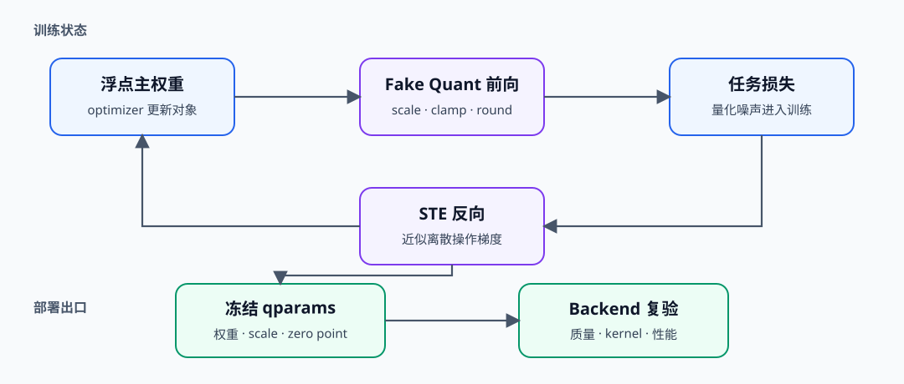
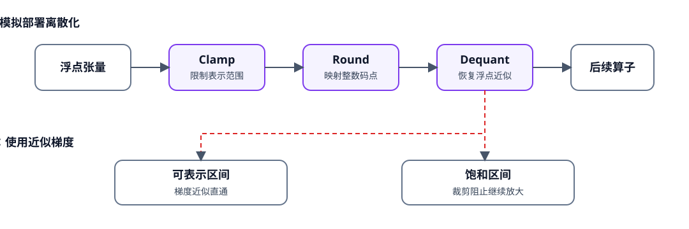

# QUANT-QAT. Quantization Aware Training | 量化感知训练

**状态：** 语义编号候选页　**难度：** Hard　**环境：** CPU-first，GPU 可选　**标签：** `量化`, `QAT`, `STE`

> 🚀 **云端运行环境**
>
> 本章节的实战代码可以点击以下链接在免费 GPU 算力平台上直接运行：
>
> [](https://colab.research.google.com/github/datawhalechina/llm-algo-leetcode/blob/main/02_PyTorch_Algorithms/QUANT-QAT_Quantization_Aware_Training.ipynb)
> [](https://modelscope.cn/my/mynotebook) *(国内推荐：魔搭社区免费实例)*


## 本节导读

当 PTQ 在既定质量门槛下无法继续压缩时，可以让训练过程提前感知量化误差。QAT 保留可优化的浮点主权重，在前向中插入 fake quantization，并用近似梯度完成反向更新。本节关注 observer、STE、训练/评估状态切换和部署产物一致性。
## 前置阅读

先建立量化参数、校准集与独立评测集的口径，再进入训练期误差适配。

- [52 量化校准与误差控制](./52_Quantization_Calibration_and_Error.md)
- [25 W8A16 量化表示](./25_Quantization_W8A16.md)
- [12 梯度累积与训练控制](./12_Gradient_Accumulation.md)
### Step 1：QAT 如何把量化误差放进训练闭环

QAT 的优化器仍更新浮点主权重；fake quant 只在前向中模拟裁剪、舍入和恢复，使损失函数能够看到部署时可能出现的离散误差。训练结束后还要冻结量化参数并导出部署产物，不能直接把训练图当作量化 kernel。

| 状态 | 训练时作用 | 部署时去向 |
|---|---|---|
| 浮点主权重 | 接收优化器更新 | 转换为量化权重或保留 fallback |
| observer 统计 | 估计激活/权重范围 | 固化为 scale、zero point 等 qparams |
| fake quant 节点 | 模拟离散误差 | 由实际量化算子或 kernel 取代 |
| 任务损失 | 驱动模型适应量化噪声 | 由独立评测集验证质量 |


### Step 2：Fake Quant 与 STE 分别解决什么问题

`round` 的真实梯度几乎处处为零，直接反向传播会让训练停止。Straight-Through Estimator（STE，直通估计器）让前向使用离散近似值，反向在可表示区间沿裁剪后的浮点路径传递梯度；落入饱和区的值则由 clamp 抑制继续放大。

| 环节 | 前向行为 | 反向行为 |
|---|---|---|
| observer | 更新范围统计 | 不参与梯度优化 |
| clamp | 限制到可表示区间 | 区间内传递、饱和区截断 |
| round / dequant | 模拟整数码点与恢复值 | 用 STE 绕过离散梯度 |


### Step 3：训练状态必须与部署契约对齐

QAT 的收益依赖训练图和部署图的一致性。observer 冻结时机、权重/激活粒度、目标 dtype、累加精度和 backend 支持都应进入产物 manifest；否则训练恢复的质量可能在导出后丢失。

| 决策 | 训练期证据 | 部署期证据 |
|---|---|---|
| observer 冻结 | 范围是否趋于稳定 | qparams 是否完整加载 |
| fake quant 配置 | 位宽、粒度和饱和率 | 量化算子配置是否一致 |
| 质量恢复 | 独立验证集曲线 | 导出产物的任务质量 |
| 性能收益 | 训练 step time 与峰值显存 | kernel、延迟、吞吐和显存 |
### Step 4：实现 observer、STE 与 QAT 线性层

题目区把 QAT 拆成三个可验证机制：维护训练期范围、构造带 STE 的 fake quant、在线性层中分别处理激活和权重。测试同时检查训练/评估状态切换和浮点主权重更新。

| TODO | 机制责任 | 关键测试 |
|---|---|---|
| TODO 1 | 用指数移动平均维护 observer 范围 | 首次赋值、后续更新、评估冻结 |
| TODO 2 | 前向离散、反向沿 clamp 路径传播 | 区间内梯度与饱和梯度 |
| TODO 3 | 组合激活/权重 fake quant 与线性层 | shape、observer 状态、权重更新 |

```python
import json
import time
from pathlib import Path

import torch
import torch.nn as nn
import torch.nn.functional as F
```


```python
# 题目区：补全 observer、STE fake quant 和双路径线性层三个 QAT 机制。
class FakeQuantizer:
    """维护训练期范围，并用 fake quant 在浮点张量中模拟 INT8 离散误差。"""

    def __init__(self, qmax: int = 127, momentum: float = 0.9, eps: float = 1e-8):
        if not 0.0 <= momentum < 1.0:
            raise ValueError("momentum must be in [0, 1).")
        self.qmax = qmax
        self.momentum = momentum
        self.eps = eps
        self.observed_absmax = None

    def update_observer(self, tensor: torch.Tensor):
        """使用当前 absmax 更新指数移动平均范围。"""
        current = tensor.detach().float().abs().max().clamp_min(self.eps)
        # TODO 1（训练范围）：首次观察直接赋值；后续使用 momentum 更新历史范围。
        # self.observed_absmax = ???
        return self.observed_absmax

    def fake_quant(self, tensor: torch.Tensor, *, update_observer: bool):
        """前向模拟裁剪与舍入，反向在未饱和区使用 STE。"""
        if update_observer:
            self.update_observer(tensor)
        if self.observed_absmax is None:
            raise RuntimeError("observer has no range; run a training observation first")

        absmax = self.observed_absmax.to(tensor.device, tensor.dtype).clamp_min(self.eps)
        scale = self.qmax / absmax
        clipped = torch.clamp(tensor, -absmax, absmax)
        dequantized = torch.round(clipped * scale) / scale

        # TODO 2（STE）：前向取 dequantized，反向沿 clipped 传递近似梯度。
        # fake_quantized = ???
        return fake_quantized


class QATLinearSim(nn.Module):
    """保留浮点主权重，并在训练前向中模拟激活与权重量化。"""

    def __init__(self, in_features: int, out_features: int):
        super().__init__()
        self.weight = nn.Parameter(torch.empty(out_features, in_features))
        nn.init.uniform_(self.weight, -0.5, 0.5)
        self.activation_quantizer = FakeQuantizer()
        self.weight_quantizer = FakeQuantizer()

    def forward(self, inputs: torch.Tensor):
        """训练时更新 observer；评估时冻结范围并复用既有 qparams。"""
        # TODO 3（QAT 前向）：分别 fake-quant 激活和权重，再执行线性层。
        # quantized_inputs = ???
        # quantized_weight = ???
        # outputs = ???
        return outputs
```

### 测试

测试按 observer 生命周期、STE 梯度、训练/评估前向和优化器更新四层展开。

```python
# 机制测试：observer 生命周期、STE 梯度、QAT 前向与训练更新。
def test_observer_updates_then_freezes():
    """训练观察应更新范围，冻结路径不应被新异常值改写。"""
    quantizer = FakeQuantizer(momentum=0.5)
    quantizer.fake_quant(torch.tensor([-1.0, 2.0]), update_observer=True)
    trained_range = quantizer.observed_absmax.clone()
    quantizer.fake_quant(torch.tensor([100.0]), update_observer=False)
    assert torch.equal(quantizer.observed_absmax, trained_range)


def test_ste_passes_in_range_gradient_and_clips_saturation():
    """STE 在可表示区传递梯度，超出 observer 范围的值由 clamp 截断。"""
    quantizer = FakeQuantizer()
    quantizer.update_observer(torch.tensor([-1.0, 1.0]))
    inputs = torch.tensor([-2.0, 0.5], requires_grad=True)
    quantizer.fake_quant(inputs, update_observer=False).sum().backward()
    assert inputs.grad[0].item() == 0.0
    assert inputs.grad[1].item() == 1.0


def test_qat_linear_training_and_eval_contract():
    """训练前向建立范围，评估前向复用范围并保持输出形状。"""
    torch.manual_seed(0)
    layer = QATLinearSim(4, 3)
    inputs = torch.randn(5, 4)
    train_output = layer(inputs)
    activation_range = layer.activation_quantizer.observed_absmax.clone()
    layer.eval()
    eval_output = layer(inputs * 10)
    assert train_output.shape == (5, 3) and eval_output.shape == (5, 3)
    assert torch.equal(layer.activation_quantizer.observed_absmax, activation_range)


def test_qat_step_updates_float_master_weight():
    """fake quant 前向后，优化器仍应更新浮点主权重。"""
    torch.manual_seed(1)
    layer = QATLinearSim(3, 2)
    optimizer = torch.optim.SGD(layer.parameters(), lr=0.1)
    inputs, target = torch.randn(4, 3), torch.randn(4, 2)
    before = layer.weight.detach().clone()
    loss = F.mse_loss(layer(inputs), target)
    optimizer.zero_grad()
    loss.backward()
    optimizer.step()
    assert layer.weight.grad is not None
    assert not torch.equal(layer.weight.detach(), before)


def run_qat_tests():
    """汇总 QAT 的四项机制测试。"""
    for test in (
        test_observer_updates_then_freezes,
        test_ste_passes_in_range_gradient_and_clips_saturation,
        test_qat_linear_training_and_eval_contract,
        test_qat_step_updates_float_master_weight,
    ):
        test()
    print("✅ QAT 机制测试通过：observer、STE、双路径前向和主权重更新均已验证。")


run_qat_tests()
```

## 参考代码与解析

### 代码

```python
# 题目区：补全 observer、STE fake quant 和双路径线性层三个 QAT 机制。
class FakeQuantizer:
    """维护训练期范围，并用 fake quant 在浮点张量中模拟 INT8 离散误差。"""

    def __init__(self, qmax: int = 127, momentum: float = 0.9, eps: float = 1e-8):
        if not 0.0 <= momentum < 1.0:
            raise ValueError("momentum must be in [0, 1).")
        self.qmax = qmax
        self.momentum = momentum
        self.eps = eps
        self.observed_absmax = None

    def update_observer(self, tensor: torch.Tensor):
        """使用当前 absmax 更新指数移动平均范围。"""
        current = tensor.detach().float().abs().max().clamp_min(self.eps)
        # TODO 1（训练范围）：首次观察直接赋值；后续使用 momentum 更新历史范围。
        self.observed_absmax = (
            current if self.observed_absmax is None
            else self.momentum * self.observed_absmax + (1.0 - self.momentum) * current
        )
        return self.observed_absmax

    def fake_quant(self, tensor: torch.Tensor, *, update_observer: bool):
        """前向模拟裁剪与舍入，反向在未饱和区使用 STE。"""
        if update_observer:
            self.update_observer(tensor)
        if self.observed_absmax is None:
            raise RuntimeError("observer has no range; run a training observation first")

        absmax = self.observed_absmax.to(tensor.device, tensor.dtype).clamp_min(self.eps)
        scale = self.qmax / absmax
        clipped = torch.clamp(tensor, -absmax, absmax)
        dequantized = torch.round(clipped * scale) / scale

        # TODO 2（STE）：前向取 dequantized，反向沿 clipped 传递近似梯度。
        fake_quantized = clipped + (dequantized - clipped).detach()
        return fake_quantized


class QATLinearSim(nn.Module):
    """保留浮点主权重，并在训练前向中模拟激活与权重量化。"""

    def __init__(self, in_features: int, out_features: int):
        super().__init__()
        self.weight = nn.Parameter(torch.empty(out_features, in_features))
        nn.init.uniform_(self.weight, -0.5, 0.5)
        self.activation_quantizer = FakeQuantizer()
        self.weight_quantizer = FakeQuantizer()

    def forward(self, inputs: torch.Tensor):
        """训练时更新 observer；评估时冻结范围并复用既有 qparams。"""
        # TODO 3（QAT 前向）：分别 fake-quant 激活和权重，再执行线性层。
        quantized_inputs = self.activation_quantizer.fake_quant(
            inputs, update_observer=self.training
        )
        quantized_weight = self.weight_quantizer.fake_quant(
            self.weight, update_observer=self.training
        )
        outputs = F.linear(quantized_inputs, quantized_weight)
        return outputs
```

### 解析

**TODO 1：observer 生命周期。** 首次观察直接建立范围，后续使用指数移动平均减小 batch 波动；进入评估路径后复用已冻结范围，避免输入变化改写部署 qparams。

**TODO 2：STE。** `clipped + (dequantized - clipped).detach()` 的前向值等于离散恢复值，反向梯度来自 `clipped`。因此未饱和值获得近似梯度，饱和值由 clamp 截断。

**TODO 3：双量化前向。** 激活和权重各自维护 observer，训练时更新统计，评估时只复用统计。优化器看到的参数仍是浮点主权重，而非整数副本。
### Step 5：可选 GPU 实验——用 torchao 验证 QAT 闭环

#### 5.1 环境、训练任务与对照路径

实验让浮点参考网络生成固定监督信号，并比较“直接 PTQ”与“QAT 短训练后 convert”两条 INT4 weight-only 路径。两者从同一初始权重出发，因此量化后误差的差异来自 QAT 对离散数值的适应，而不是模型初始化差异。

| 路径 | torchao 操作 | 本节观察 |
|---|---|---|
| float reference | 不量化 | 固定监督输出 |
| PTQ baseline | `quantize_(..., Int4WeightOnlyConfig)` | 未适应量化误差的结果 |
| QAT candidate | `prepare → train → convert` | 训练是否回收 PTQ 误差 |


```python
# 5.1 只定义网络、训练步数与量化配置；默认不占用 GPU。
from pathlib import Path

RUN_MODE = "dry_run"  # dry_run / real_gpu
SEED = 42
BATCH_SIZE = 32
IN_FEATURES = 256
HIDDEN_FEATURES = 256
OUT_FEATURES = 128
GROUP_SIZE = 32  # INT4 weight-only 的分组大小
TRAIN_STEPS = 20
LEARNING_RATE = 1e-3
OUTPUT_PATH = Path("benchmarks/results/quant_qat_torchao_prepare_convert.json")

```

#### 5.2 执行 PTQ / QAT 配对实验

QAT 路径先由 `QATConfig(step="prepare")` 插入 fake quant，再完成少量优化步骤，最后用同一个 base config 执行 `convert`。结果同时保留训练损失、转换后误差、峰值显存和失败原因。


```python
# 5.2 使用 torchao 推荐的 QATConfig API 完成 prepare、训练与 convert。
import copy
import importlib.metadata
import json
import platform
import time

import torch
from torch import nn
from torch.nn import functional as F


def package_version(name):
    """读取依赖版本，缺失时返回 None。"""
    try:
        return importlib.metadata.version(name)
    except importlib.metadata.PackageNotFoundError:
        return None


result = {
    "schema_version": "quantization-mechanism-gpu/v2",
    "semantic_id": "QUANT-QAT",
    "run_mode": RUN_MODE,
    "framework": {
        "python": platform.python_version(),
        "torch": torch.__version__,
        "torchao": package_version("torchao"),
    },
    "hardware": {
        "cuda_available": torch.cuda.is_available(),
        "cuda": torch.version.cuda,
        "device": torch.cuda.get_device_name(0) if torch.cuda.is_available() else None,
    },
    "workload": {
        "batch_size": BATCH_SIZE,
        "in_features": IN_FEATURES,
        "hidden_features": HIDDEN_FEATURES,
        "out_features": OUT_FEATURES,
        "group_size": GROUP_SIZE,
        "train_steps": TRAIN_STEPS,
        "learning_rate": LEARNING_RATE,
        "seed": SEED,
    },
    "baseline": {"name": "direct_ptq_int4_weight_only"},
    "candidate": {"name": "qat_prepare_train_convert_int4_weight_only"},
    "mechanism_metrics": None,
    "failure": None,
    "evidence_level": "environment_preflight",
    "decision": "ready_to_measure",
}

if RUN_MODE == "real_gpu":
    try:
        if not torch.cuda.is_available():
            raise RuntimeError("RUN_MODE=real_gpu 但 CUDA 不可用")

        from torchao.quantization import Int4WeightOnlyConfig, quantize_
        from torchao.quantization.qat import QATConfig

        torch.manual_seed(SEED)

        def make_model():
            """构造尺寸满足 INT4 group 约束的小型线性网络。"""
            return nn.Sequential(
                nn.Linear(IN_FEATURES, HIDDEN_FEATURES, bias=False),
                nn.GELU(),
                nn.Linear(HIDDEN_FEATURES, OUT_FEATURES, bias=False),
            ).to(device="cuda", dtype=torch.bfloat16)

        reference = make_model().eval()
        initial_state = copy.deepcopy(reference.state_dict())
        train_inputs = torch.randn(BATCH_SIZE, IN_FEATURES, device="cuda", dtype=torch.bfloat16)
        eval_inputs = torch.randn(BATCH_SIZE, IN_FEATURES, device="cuda", dtype=torch.bfloat16)
        with torch.inference_mode():
            train_targets = reference(train_inputs).float()
            eval_targets = reference(eval_inputs).float()

        base_config = Int4WeightOnlyConfig(group_size=GROUP_SIZE)

        ptq_model = make_model().eval()
        ptq_model.load_state_dict(initial_state)
        quantize_(ptq_model, base_config)
        with torch.inference_mode():
            ptq_output = ptq_model(eval_inputs).float()
        ptq_mse = F.mse_loss(ptq_output, eval_targets).item()

        qat_model = make_model().train()
        qat_model.load_state_dict(initial_state)
        quantize_(qat_model, QATConfig(base_config, step="prepare"))
        optimizer = torch.optim.AdamW(qat_model.parameters(), lr=LEARNING_RATE)
        torch.cuda.reset_peak_memory_stats()
        torch.cuda.synchronize()
        started = time.perf_counter()
        losses = []
        for _ in range(TRAIN_STEPS):
            prediction = qat_model(train_inputs).float()
            loss = F.mse_loss(prediction, train_targets)
            optimizer.zero_grad(set_to_none=True)
            loss.backward()
            optimizer.step()
            losses.append(float(loss.detach()))
        torch.cuda.synchronize()
        training_ms = (time.perf_counter() - started) * 1000.0
        peak_memory = int(torch.cuda.max_memory_allocated())

        qat_model.eval()
        quantize_(qat_model, QATConfig(base_config, step="convert"))
        with torch.inference_mode():
            qat_output = qat_model(eval_inputs).float()
        qat_mse = F.mse_loss(qat_output, eval_targets).item()
        recovery_ratio = (ptq_mse - qat_mse) / max(ptq_mse, 1e-12)

        result.update({
            "baseline": {**result["baseline"], "eval_mse": ptq_mse},
            "candidate": {
                **result["candidate"],
                "initial_train_loss": losses[0],
                "final_train_loss": losses[-1],
                "eval_mse": qat_mse,
                "training_ms": training_ms,
                "training_ms_per_step": training_ms / TRAIN_STEPS,
                "peak_allocated_bytes": peak_memory,
            },
            "mechanism_metrics": {
                "qat_error_recovery_ratio": recovery_ratio,
                "prepare_completed": True,
                "convert_completed": True,
            },
            "evidence_level": "matched_torchao_qat_prepare_train_convert",
            "decision": "accept" if qat_mse < ptq_mse else "tune",
        })
        del reference, ptq_model, qat_model, train_inputs, eval_inputs
        torch.cuda.empty_cache()
    except Exception as exc:
        result.update({
            "failure": {"type": type(exc).__name__, "message": str(exc)},
            "evidence_level": "failed_real_gpu_attempt",
            "decision": "reject_until_environment_fixed",
        })

OUTPUT_PATH.parent.mkdir(parents=True, exist_ok=True)
OUTPUT_PATH.write_text(json.dumps(result, ensure_ascii=False, indent=2), encoding="utf-8")
print(json.dumps(result, ensure_ascii=False, indent=2))

```

#### 5.3 读取 QAT 闭环结果

读取单元集中展示 PTQ 误差、QAT 误差、训练代价、转换状态与证据等级。


```python
# 5.3 只读取 5.2 保存的 JSON，不重新执行训练或转换。
if OUTPUT_PATH.exists():
    saved = json.loads(OUTPUT_PATH.read_text(encoding="utf-8"))
    keys = (
        "framework",
        "hardware",
        "workload",
        "baseline",
        "candidate",
        "mechanism_metrics",
        "failure",
        "evidence_level",
        "decision",
    )
    print({key: saved.get(key) for key in keys})
else:
    print(f"等待 torchao QAT 结果：{OUTPUT_PATH}")

```

#### 5.4 解释误差回收与训练代价

QAT 的价值不是“训练过程能运行”，而是 convert 后的候选是否比直接 PTQ 更接近浮点参考。若误差没有回收，应优先检查训练步数、学习率、监督数据与量化配置，再决定是否扩大训练规模。

| 观察项 | 读取字段 | 判断问题 |
|---|---|---|
| PTQ 基线 | `baseline.eval_mse` | 直接量化造成多大误差 |
| QAT 收益 | `candidate.eval_mse`、`qat_error_recovery_ratio` | 训练是否回收量化误差 |
| 训练代价 | `training_ms_per_step`、`peak_allocated_bytes` | 回收误差需要多少资源 |
| 闭环完整性 | `prepare_completed`、`convert_completed`、`failure` | 是否完成真实 prepare/convert |
| 下一步 | `decision` | accept / tune / reject_until_environment_fixed |

## 相关阅读

- [torchao：Quantization-Aware Training 工作流](https://docs.pytorch.org/ao/stable/workflows/qat.html)
- [torchao：QATConfig API](https://docs.pytorch.org/ao/stable/api_reference/generated/torchao.quantization.qat.QATConfig.html)
- [Quantization and Training of Neural Networks for Efficient Integer-Arithmetic-Only Inference](https://arxiv.org/abs/1712.05877)
