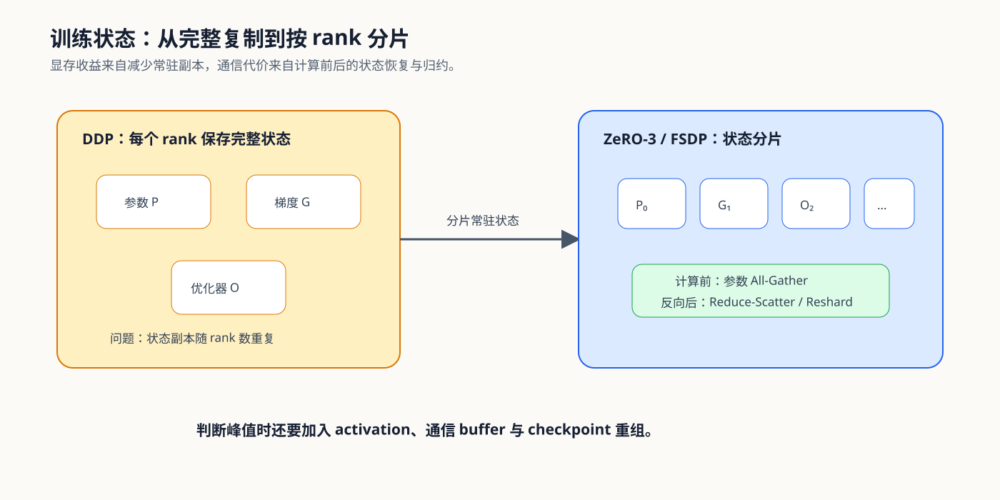

# 03. State Sharding and ZeRO | 状态分片与 ZeRO

## 本页目标与路线位置

数据并行复制计算，也复制参数、梯度和优化器状态。状态分片通过减少每个 rank 的常驻副本扩大训练容量，但计算前后的参数收集、梯度归约和 checkpoint 重组会带来新的通信与生命周期约束。

## 核心机制

### ZeRO 阶段切分什么

ZeRO 阶段越高，每个 rank 常驻的训练状态越少；与此同时，计算路径需要更频繁地恢复当前层所需状态。比较阶段时，应以同一模型、global batch、dtype 和 checkpoint 口径为前提。

| 策略 | 参数 | 梯度 | 优化器状态 | 主要新增代价 |
|:---|:---|:---|:---|:---|
| DDP | 每 rank 完整保存 | 每 rank 完整保存 | 每 rank 完整保存 | 梯度 All-Reduce |
| ZeRO-1 | 复制 | 复制 | 分片 | 更新后参数同步 |
| ZeRO-2 | 复制 | 分片 | 分片 | 梯度 Reduce-Scatter 与参数同步 |
| ZeRO-3 / FSDP full shard | 分片 | 分片 | 分片 | 计算前参数 All-Gather、反向归约与 reshard |

### 生命周期决定峰值而非静态除法

不能简单用“总状态字节 ÷ world size”预测真实峰值。参数可能在计算前临时聚合，activation 与通信 buffer 也会与训练状态重叠；checkpoint 保存还可能要求重组 full state dict。

| 生命周期位置 | 需要观察的状态 | 风险 |
|:---|:---|:---|
| 初始化与加载 | 参数如何落到 rank、是否由 rank 0 广播 | 启动峰值和主机内存放大 |
| forward 前 | 当前单元参数 All-Gather | 临时完整参数与 activation 重叠 |
| backward 后 | 梯度归约和 reshard | bucket、梯度与通信 buffer 重叠 |
| optimizer step | 分片状态更新 | 精度、offload 与更新时间 |
| checkpoint | full / local / sharded state dict | 保存峰值、恢复兼容性和产物体积 |

## 选择条件与验证证据

| 目的 | 入口 |
|:---|:---|
| 建立训练状态账本 | [Part 01 · 06 显存计算与 ZeRO](../../01_Hardware_Math_and_Systems/06_VRAM_Calculation_and_ZeRO.md) |
| 验证阶段语义 | [Part 02 · 27 ZeRO 优化器模拟](../../02_PyTorch_Algorithms/27_ZeRO_Optimizer_Sim.md) |
| 运行真实模型 | Transformers + Accelerate，选择 FSDP 或 DeepSpeed backend |
| 汇总项目证据 | [Part 02 · 79 分布式并行基准](../../02_PyTorch_Algorithms/79_Distributed_Parallel_Benchmark.md) |

## 相关阅读

- [PyTorch FSDP](https://pytorch.org/docs/stable/fsdp.html)
- [Accelerate FSDP](https://huggingface.co/docs/accelerate/main/usage_guides/fsdp)
- [Accelerate DeepSpeed](https://huggingface.co/docs/accelerate/main/usage_guides/deepspeed)
