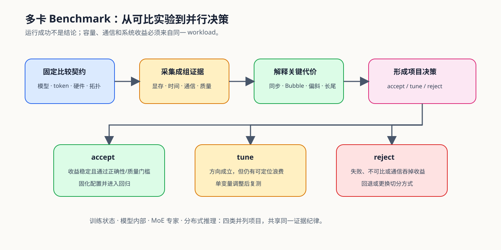

# 07. Benchmark and Parallel Decision | Benchmark 与并行决策

## 本页目标与路线位置

多卡项目的结论不是“成功启动”，而是在固定 workload 和硬件下，额外复杂度是否换来了可复查的容量、速度或服务收益。训练状态并行、模型内部并行、MoE 和分布式推理使用不同指标，但共享同一条证据链。

## 核心机制

### 先固定比较契约

| 契约 | 必须记录的内容 |
|:---|:---|
| workload | 模型与 revision、tokenizer、输入 manifest、长度、batch / concurrency |
| hardware | GPU、world size、拓扑、驱动、CUDA、NCCL |
| strategy | DDP / FSDP / ZeRO / PP / TP / CP / EP / Replica 及并行度 |
| execution | backend、dtype、warmup、repeats、随机种子 |
| result | metrics、artifact、failure、`evidence_level`、decision |

### 四类项目分别形成结论

现有项目与待建项目不是必须串行执行的步骤。每个项目只负责自己的决策对象，避免把训练状态、模型切分、MoE 和 Serving 字段不断堆进同一份报告。

| 项目角色 | 当前入口 | 核心指标 | 主要决策 |
|:---|:---|:---|:---|
| 训练状态并行 | Part 02 · 79 | peak memory、step time、throughput、communication、scaling efficiency | DDP、FSDP/ZeRO 是否值得采用 |
| 模型内部并行 | [PAR-MODEL-INTERNAL](../../02_PyTorch_Algorithms/PAR-MODEL-INTERNAL_Model_Internal_Parallel_Benchmark.md) | stage/head/sequence 布局、bubble、collective、scaling efficiency | PP、TP、CP 与 Device Mesh 如何组合 |
| MoE 并行 | Part 02 · 80 | expert load、overflow、All-to-All、max-rank time、quality | EP 路由和容量是否稳定 |
| 分布式推理 | Part 02 · 81 | TTFT、TPOT、throughput、P95/P99、queue、KV handoff | TP、Replica 或 PD 是否满足服务目标 |

## 选择条件与验证证据

### 决策规则

`accept` 要求收益经过重复测量并通过正确性或质量门槛；`tune` 表示机制方向成立但仍有可定位的通信、负载或配置问题；`reject` 表示失败、不可比或新增代价吞掉了收益。

| 结论 | 证据条件 | 下一步 |
|:---|:---|:---|
| `accept` | workload 可比，结果稳定，容量或性能收益达到目标，质量正确 | 固化配置与 artifact，进入回归测试 |
| `tune` | 已出现收益，但 overlap、负载、并行度或长尾仍不稳定 | 一次只调整一个候选因素并复测 |
| `reject` | 运行失败、结果不可比、正确性失败或通信吞掉收益 | 保留 failure，回退 baseline 或更换切分方式 |

### 项目入口

- [Part 02 · 79 分布式并行基准](../../02_PyTorch_Algorithms/79_Distributed_Parallel_Benchmark.md)
- [PAR-MODEL-INTERNAL 模型内部并行项目](../../02_PyTorch_Algorithms/PAR-MODEL-INTERNAL_Model_Internal_Parallel_Benchmark.md)
- [Part 02 · 80 MoE 专家并行基准](../../02_PyTorch_Algorithms/80_MoE_Expert_Parallel_Benchmark.md)
- [Part 02 · 81 分布式推理项目](../../02_PyTorch_Algorithms/81_Distributed_Inference_Project.md)
- [通信与并行案例集](./casebook.md)

## 相关阅读

- [PyTorch Distributed Overview](https://pytorch.org/tutorials/beginner/dist_overview.html)
- [Hugging Face Accelerate](https://huggingface.co/docs/accelerate/index)
