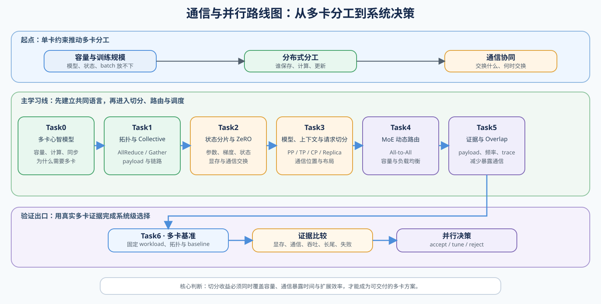
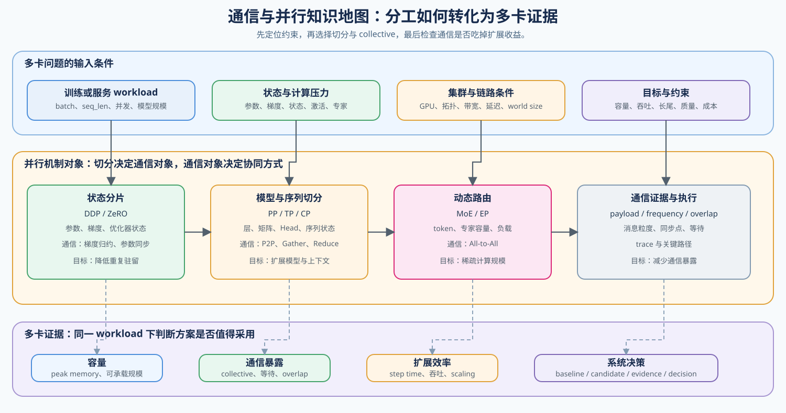

# 通信与并行（Communication and Parallelism）

> 专题类型：横向支撑　学习目标：理解多卡如何分工、如何通信，以及如何用证据选择并行方案。

## 页面导语

单卡无法同时满足模型容量、训练吞吐或服务规模时，系统需要把数据、训练状态或模型计算分给多张 GPU。**分布式**描述这种分工方式；**通信**描述分工后各张 GPU 如何交换梯度、参数、激活或 token 路由结果，重新组成一次正确的训练或推理。

两者不是并列的两套技术。分布式切分先决定谁保存、谁计算、谁负责更新；多卡通信再决定交换什么、何时交换以及经过什么链路；最终共同影响容量、吞吐、等待、长尾和扩展效率。

切分能摊开单卡压力，也会引入集合通信、同步点、链路等待和调度成本。本专题帮助学习者在“能否放下、能否更快、代价是否可接受”之间建立可验证的判断。想沿完整问题链学习时阅读[深入阅读](./walkthrough.md)；遇到显存不足、通信等待或负载偏斜时使用[案例集](./casebook.md)定位问题。

本专题统一使用中文主称并保留通用英文术语：进程编号（rank）、集合通信（Collective）、载荷字节数（Payload）、通信—计算重叠（Overlap）和执行时间线（Trace）。正文首次解释概念，配置字段、Profiler 事件和结果 JSON 保留原始英文名称。

## 如何开始

Task0–1 建立多卡执行与集合通信的共同语言；随后按训练状态进入 Task2，按模型、长上下文或 Serving 规模进入 Task3，按 MoE 路由进入 Task4。需要解释“为什么多卡没有更快”时进入 Task5，具备真实多卡环境后再完成 Task6。已有明确问题时，可以直接进入相应分支，再回补通信原语。

路线图把多卡问题、Task0–6 的推进关系和每阶段的验证出口放在一起。

## 主学习路线与验证出口

| Task | 要回答的问题 | 主学习线 | 专题正文 | 交付物 |
|:---|:---|:---|:---|:---|
| Task0 · 多卡执行与通信心智模型 | 为什么需要多卡？分工后为什么一定会出现同步与等待？ | [Part 01 · 03 GPU 架构与显存](../../01_Hardware_Math_and_Systems/03_GPU_Architecture_and_Memory.md) → [05 通信拓扑](../../01_Hardware_Math_and_Systems/05_Communication_Topologies.md) → [06 显存计算与 ZeRO](../../01_Hardware_Math_and_Systems/06_VRAM_Calculation_and_ZeRO.md) | [01 为什么需要并行与通信](./01_why_parallel_and_communication.md) | 一份单卡约束与多卡代价清单 |
| Task1 · 拓扑与集合通信原语 | 不同 collective 在传什么？拓扑为何改变通信时间？ | [Part 01 · 05 通信拓扑](../../01_Hardware_Math_and_Systems/05_Communication_Topologies.md) → [20 NCCL 与 AllReduce](../../01_Hardware_Math_and_Systems/20_NCCL_and_AllReduce_Basics.md) → [Part 02 · 46 NCCL 通信分析](../../02_PyTorch_Algorithms/46_Communication_Profiling_with_NCCL.md) | [02 数据并行与同步](./02_data_parallel_and_synchronization.md) | collective、payload 与链路代价对照 |
| Task2 · 训练状态分片与 ZeRO | 参数、梯度、优化器状态如何从复制变为分片？ | 共享前置：[Part 00 · 11 优化器与损失](../../00_Prerequisites/11_PyTorch_Optimizers_and_Loss.md) → [12 训练生命周期](../../00_Prerequisites/12_PyTorch_Minimal_Training_Interface.md)；核心：[Part 01 · 06 显存计算与 ZeRO](../../01_Hardware_Math_and_Systems/06_VRAM_Calculation_and_ZeRO.md) → [Part 02 · 27 ZeRO 优化器模拟](../../02_PyTorch_Algorithms/27_ZeRO_Optimizer_Sim.md) | [03 状态分片与 ZeRO](./03_state_sharding_and_zero.md) | 状态账本与通信交换说明 |
| Task3 · 模型、上下文与请求切分 | PP、TP、CP 与 Serving 副本分别切层、张量、上下文还是请求？ | [Part 01 · 26 并行策略决策](../../01_Hardware_Math_and_Systems/26_Parallel_Strategy_Decision_Framework.md) → [Part 02 · 28 Pipeline 并行](../../02_PyTorch_Algorithms/28_Pipeline_Parallelism_MicroBatch.md) / [29 Tensor 并行](../../02_PyTorch_Algorithms/29_Tensor_Parallelism_Sim.md) / [PAR-CONTEXT 上下文并行](../../02_PyTorch_Algorithms/PAR-CONTEXT_Context_and_Sequence_Parallelism.md) / [PAR-REPLICA Serving 副本路由](../../02_PyTorch_Algorithms/PAR-REPLICA_Serving_Replica_Routing.md) → [49 并行策略选择](../../02_PyTorch_Algorithms/49_Parallelism_Strategy_Selection.md) | [04 模型、上下文与请求切分](./04_pipeline_and_tensor_parallel.md) | 切分对象、Head / stage / sequence / request 布局与组合约束表 |
| Task4 · MoE 与动态路由通信 | 为什么专家路由会把 All-to-All、容量与负载均衡放到同一个问题中？ | [Part 01 · 22 MoE 参数与计算](../../01_Hardware_Math_and_Systems/22_MoE_Parameter_and_Compute.md) → [Part 02 · 47 MoE 专家并行](../../02_PyTorch_Algorithms/47_MoE_Expert_Parallel.md) → [80 MoE 专家并行基准](../../02_PyTorch_Algorithms/80_MoE_Expert_Parallel_Benchmark.md) | [05 专家并行与动态路由](./05_expert_parallel_and_communication_hotspots.md) | 路由负载与 All-to-All 证据 |
| Task5 · 通信调度、Profiling 与 Overlap | payload 与同步频率如何形成通信时间？怎样减少真正暴露在关键路径上的部分？ | [Part 01 · 17 CUDA Stream 与异步](../../01_Hardware_Math_and_Systems/17_CUDA_Stream_and_Asynchrony.md) → [27 通信调度优化](../../01_Hardware_Math_and_Systems/27_Communication_Scheduling_Optimization.md) → [29 CUDA Stream 高级调度](../../01_Hardware_Math_and_Systems/29_CUDA_Stream_Advanced_Scheduling.md) → [Part 02 · 46 NCCL 通信剖析](../../02_PyTorch_Algorithms/46_Communication_Profiling_with_NCCL.md) → [48 通信热点](../../02_PyTorch_Algorithms/48_Communication_Hotspots_and_Mitigation.md) | [06 通信 Profiling 与 Overlap](./06_communication_profiling_and_overlap.md) | collective、payload、同步频率、overlap 与热点归因 |
| Task6 · 多卡基准与系统决策 | 怎样将容量、通信、吞吐、长尾和成本收口为可交付结论？ | 证据前置：[Part 00 · 20 性能证据与实验设计](../../00_Prerequisites/20_Performance_Evidence_and_Experiment_Design.md)；项目：训练状态并行 [79](../../02_PyTorch_Algorithms/79_Distributed_Parallel_Benchmark.md)、[模型内部并行](../../02_PyTorch_Algorithms/PAR-MODEL-INTERNAL_Model_Internal_Parallel_Benchmark.md)、MoE 并行 [80](../../02_PyTorch_Algorithms/80_MoE_Expert_Parallel_Benchmark.md)、分布式推理 [81](../../02_PyTorch_Algorithms/81_Distributed_Inference_Project.md) | [07 多卡 Benchmark 与并行决策](./07_benchmark_and_parallel_decision.md) | 四种角色分别形成 baseline / candidate 决策报告 |

知识地图把同一个多卡问题拆成“先有什么约束、如何切分、需要交换什么、最终观察什么”。它不是额外的阅读顺序；遇到显存、同步或扩展效率问题时，可用它回查对应机制。

## 按需回补：训练状态与硬件基础

不要求先顺序学完 Part 00 和 Part 01。无法解释参数、梯度和优化器状态时，先补 Task2 标出的训练生命周期；无法解释带宽、延迟和拓扑时，回到 Task0–1；准备形成项目结论时，再补 Task6 的实验设计与证据口径。

## 跨专题入口

Task5 关注梯度、参数、激活、序列状态或 token 路由的通信—计算重叠；请求排队、Continuous Batching 与 Prefill / Decode 路由进入[推理优化 · Serving 调度](../inference_optimization/07_serving_scheduling_and_pd.md)。副本路由同时依赖队列、缓存局部性和通信证据；瓶颈归因可继续进入[性能分析](../performance_analysis/intro.md)，设备与 backend 选择可进入[部署与异构系统](../deployment_heterogeneous/intro.md)。

## 项目出口与稳定 ID

四类项目已经拥有独立入口，并按训练状态、模型内部、MoE 和分布式推理分流。

| 稳定项目 ID | 项目职责 | 当前承载 | 建设状态 |
|:---|:---|:---|:---|
| `PAR-TRAINING-STATE` | DDP、FSDP、ZeRO 的训练状态与显存扩展 | 79 | CPU 机制已收口；真实多卡结果待验证 |
| `PAR-MODEL-INTERNAL` | TP、PP、CP、Device Mesh 与混合并行 | [模型内部并行基准](../../02_PyTorch_Algorithms/PAR-MODEL-INTERNAL_Model_Internal_Parallel_Benchmark.md) | CPU 机制已建设；真实多卡结果待验证 |
| `PAR-MOE-EXPERT` | EP、dispatch/combine、capacity、overflow 与负载偏斜 | 80 | 待接入真实 MoE workload |
| `PAR-DISTRIBUTED-INFERENCE` | Serving 副本、模型并行与 PD 分离 | 81 | 待接入 vLLM/SGLang adapter |

四类项目共享 `distributed-benchmark/v1` 外层契约，但不要求按编号连续执行。80 的路由和容量证据可被架构专题引用，81 的 Serving 结果可被推理专题引用；PP、TP 与 CP 的综合证据进入 `PAR-MODEL-INTERNAL`，不再写入 79。

## 环境与验证

通信机制与真实项目使用不同抽象层。机制页需要暴露 rank、张量布局、collective 和 payload；项目页再使用成熟框架加载真实模型，验证训练或 Serving 结果。

| 实验层级 | 默认技术栈 | 用途 |
|:---|:---|:---|
| CPU 机制 | PyTorch Tensor | 验证切分、状态、路由与账本，不解释真实多卡性能 |
| 多卡通信机制 | `torchrun + torch.distributed + NCCL` | 验证 collective、payload 与 TP / CP / EP 数据流 |
| 真实模型训练 | Transformers + Accelerate；FSDP / DeepSpeed backend | 比较训练状态、显存、通信与 step time |
| 分布式推理 | Transformers 固定输入；vLLM 为主、SGLang 对照 | 验证模型并行、副本路由、KV 状态与服务指标 |

机制页保留 rank、张量布局、collective 和 payload；Transformers 固定模型语义与输入，Accelerate 编排真实训练，vLLM / SGLang 承担分布式推理。llama.cpp 不作为本专题默认多卡训练或数据中心 Serving 基线；TensorRT-LLM 只有在 NVIDIA 专用部署项目固定 Engine 与版本矩阵后才作为候选。

通信 smoke 默认复用稳定功能基线 `Qwen/Qwen2.5-0.5B-Instruct`；`Qwen/Qwen3-0.6B` 用于现代模型兼容性验证，并显式固定 `enable_thinking=false`。扩展效率实验使用资产表登记的较大模型或合成大 Payload，不能把 0.5B/0.6B 功能结果外推为性能结论。具体模型角色、执行栈版本与固定方式见 [模型、执行栈与环境资产表](../../gpu_environment_assets.md)。

每次运行至少记录以下契约：

| 契约 | 必须固定的字段 |
|:---|:---|
| 模型与 tokenizer | `model_id`、revision、dtype、chat template、special tokens |
| 输入 | 数据集或 prompt manifest、padding / truncation、输入与输出长度 |
| 执行 | world size、并行度、backend、warmup、repeats、随机种子 |
| 输出 | 结果 JSON、artifact、failure、`evidence_level`、decision |

CPU 模拟用于验证状态和数据流；只有真实 NCCL 或 backend 运行结果才能解释实际多卡性能。环境组合与安装入口统一登记在 [模型、执行栈与环境资产表](../../gpu_environment_assets.md)。
